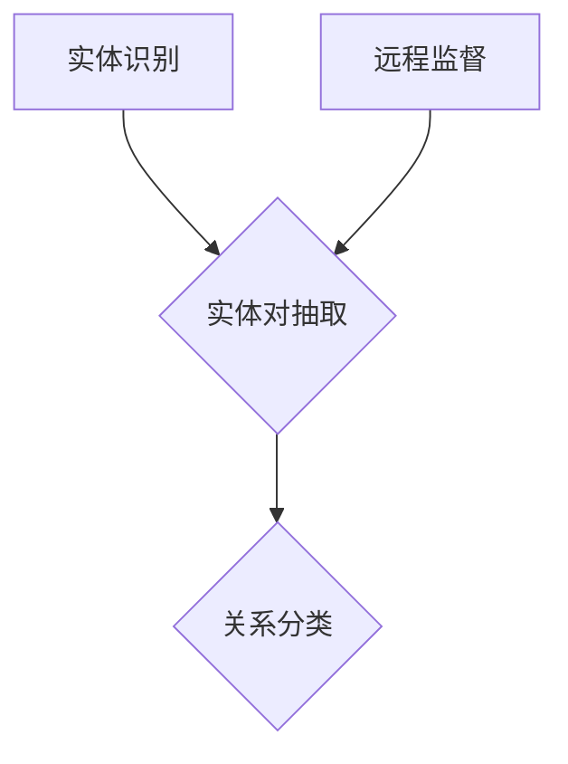

                 

## 1. 背景介绍

跨语言实体关系抽取是自然语言处理（NLP）领域的一个重要研究方向。其目的是从多种语言文本中提取出实体关系，为多语言信息检索、知识图谱构建、跨语言问答等应用提供基础数据。随着全球化进程的加快，多语言数据处理的需求日益增加，跨语言实体关系抽取技术变得尤为重要。

远程监督是一种有效的跨语言标注方法，通过使用已标注的源语言数据，自动生成目标语言的实体关系标注。远程监督方法相较于传统的手动标注和半监督标注方法，具有更高的效率和更低的成本。

目前，跨语言实体关系抽取技术主要分为以下几种方法：

1. **基于规则的方法**：利用语言学知识和手工编写的规则，对文本进行解析和标注。这种方法适用于语言特征明显的文本，但在处理复杂语言关系时效果不佳。

2. **基于统计的方法**：利用机器学习算法，如朴素贝叶斯、条件随机场（CRF）等，对实体关系进行预测。这种方法依赖于大规模的标注数据集，但在数据不足的情况下性能下降。

3. **基于深度学习的方法**：使用深度神经网络，如卷积神经网络（CNN）、循环神经网络（RNN）等，自动学习实体关系特征。这种方法在处理大规模、复杂的语言数据时表现优异，但训练过程较为耗时。

本文将主要介绍基于远程监督的跨语言实体关系抽取方法，并详细讨论其核心算法原理、具体操作步骤、数学模型和公式，以及实际应用场景。

### Keywords: 

Cross-lingual Entity Relation Extraction, Remote Supervision, Multilingual Data Processing, Natural Language Processing, Machine Learning, Deep Learning

### Abstract:

This article introduces the background of cross-lingual entity relation extraction, focusing on the method of remote supervision. It elaborates on the core concepts, algorithms, mathematical models, and practical applications of this method, aiming to provide a comprehensive understanding of cross-lingual entity relation extraction and its potential applications in multilingual data processing.

## 2. 核心概念与联系

### 2.1 跨语言实体关系抽取

跨语言实体关系抽取是指从不同语言的文本中提取实体及其关系的过程。实体可以是人、地点、组织、事件等，关系则是实体之间的关联，如“属于”、“参与”等。

在跨语言实体关系抽取中，主要涉及以下三个步骤：

1. **实体识别**：从文本中识别出实体，包括人名、地名、组织名等。
2. **实体对抽取**：从文本中提取出实体对，即可能存在关系的实体组合。
3. **关系分类**：对实体对进行关系分类，判断它们之间是否存在特定关系。

### 2.2 远程监督

远程监督是一种无监督学习方法，通过已标注的源语言数据，自动生成目标语言的标注。远程监督的核心思想是利用已知的源语言实体关系标注，预测目标语言中的实体关系。

远程监督方法可以分为以下几类：

1. **基于规则的方法**：通过编写规则，将源语言实体关系映射到目标语言中。这种方法简单高效，但受限于规则的普适性和手工编写的成本。
2. **基于统计的方法**：利用统计方法，如朴素贝叶斯、最大熵模型等，预测目标语言中的实体关系。这种方法需要大量标注数据，但在数据不足的情况下性能下降。
3. **基于深度学习的方法**：使用深度神经网络，如卷积神经网络（CNN）、循环神经网络（RNN）等，自动学习源语言和目标语言实体关系的映射。这种方法在处理大规模、复杂的语言数据时表现优异，但训练过程较为耗时。

### 2.3 跨语言实体关系抽取与远程监督的联系

跨语言实体关系抽取与远程监督密切相关。远程监督为跨语言实体关系抽取提供了有效的标注方法，通过使用远程监督方法，可以降低标注成本，提高标注效率。

同时，跨语言实体关系抽取为远程监督提供了实际应用场景，使得远程监督方法可以在更广泛的领域中发挥作用。

### Mermaid 流程图



在上面的流程图中，A表示实体识别，B表示实体对抽取，C表示关系分类，D表示远程监督。通过远程监督方法，可以自动生成目标语言的实体关系标注，从而实现跨语言实体关系抽取。

---

## 3. 核心算法原理 & 具体操作步骤

### 3.1 远程监督算法原理

远程监督算法的核心思想是通过已标注的源语言数据，预测目标语言的实体关系标注。具体来说，远程监督算法可以分为以下几步：

1. **数据预处理**：对源语言和目标语言文本进行预处理，如分词、词性标注等。
2. **特征提取**：从预处理后的文本中提取特征，如词袋模型、词嵌入等。
3. **训练模型**：使用源语言标注数据训练模型，如朴素贝叶斯、最大熵模型、深度神经网络等。
4. **预测标注**：使用训练好的模型，对目标语言文本进行预测，生成实体关系标注。

### 3.2 具体操作步骤

以下是一个简单的远程监督算法实现步骤：

1. **数据集准备**：
   - 准备一个已标注的源语言数据集，如英语数据集；
   - 准备一个对应的目标语言数据集，如法语数据集。

2. **数据预处理**：
   - 对源语言数据集进行分词、词性标注等预处理操作；
   - 对目标语言数据集进行相同的预处理操作。

3. **特征提取**：
   - 使用词袋模型或词嵌入方法提取文本特征。

4. **训练模型**：
   - 使用源语言数据集训练模型，如朴素贝叶斯、最大熵模型等。
   - 可以使用深度学习框架，如TensorFlow、PyTorch等，进行模型训练。

5. **预测标注**：
   - 使用训练好的模型，对目标语言数据集进行预测，生成实体关系标注。

6. **评估与优化**：
   - 评估模型性能，如准确率、召回率等；
   - 根据评估结果，调整模型参数，优化模型性能。

### 3.3 远程监督算法的优势

远程监督算法具有以下优势：

1. **降低标注成本**：通过使用已标注的源语言数据，可以大幅降低目标语言的标注成本。
2. **提高标注效率**：远程监督算法可以在短时间内生成大量目标语言的标注，提高标注效率。
3. **适应性强**：远程监督算法可以适应不同的语言环境，适用于多种语言的数据处理。

### 3.4 远程监督算法的局限

远程监督算法也存在一些局限：

1. **数据依赖**：远程监督算法的性能高度依赖于源语言标注数据的质量和数量，如果源语言标注数据不足，会导致算法性能下降。
2. **规则限制**：基于规则的方法在处理复杂语言关系时效果不佳，可能需要更多规则来应对不同语言环境。
3. **训练时间**：基于深度学习的方法训练时间较长，可能需要大量计算资源。

---

## 4. 数学模型和公式 & 详细讲解 & 举例说明

### 4.1 数学模型

远程监督算法的核心在于建立源语言和目标语言实体关系的映射模型。常见的数学模型有：

1. **朴素贝叶斯模型**：
   \[ P(R|T) = \frac{P(T|R)P(R)}{P(T)} \]
   其中，\( P(R) \) 是关系 \( R \) 的先验概率，\( P(T|R) \) 是在关系 \( R \) 下文本 \( T \) 的概率，\( P(R|T) \) 是文本 \( T \) 出现时关系 \( R \) 的概率。

2. **条件随机场（CRF）**：
   \[ P(Y|x) = \frac{1}{Z} \exp \left( \sum_{i=1}^{n} \theta_i y_i + \sum_{i<j} \theta_{ij} y_i y_j \right) \]
   其中，\( Z \) 是规范化因子，\( \theta_i \) 和 \( \theta_{ij} \) 分别是模型参数，\( y_i \) 和 \( y_j \) 分别是实体 \( i \) 和 \( j \) 的关系标签。

3. **深度神经网络（DNN）**：
   \[ y = \sigma(W_1x + b_1) \]
   \[ z = W_2y + b_2 \]
   \[ \hat{y} = \sigma(z) \]
   其中，\( W_1 \) 和 \( W_2 \) 分别是权重矩阵，\( b_1 \) 和 \( b_2 \) 分别是偏置项，\( \sigma \) 是激活函数，\( \hat{y} \) 是预测输出。

### 4.2 详细讲解

#### 4.2.1 朴素贝叶斯模型

朴素贝叶斯模型是一种基于贝叶斯定理和特征条件独立假设的简单概率分类器。在跨语言实体关系抽取中，朴素贝叶斯模型可以用来预测目标语言中的实体关系。

1. **先验概率计算**：
   先验概率 \( P(R) \) 表示关系 \( R \) 的发生概率，可以通过统计源语言数据集中每个关系的出现频率得到。

2. **条件概率计算**：
   条件概率 \( P(T|R) \) 表示在关系 \( R \) 下，文本 \( T \) 的出现概率。这可以通过统计源语言数据集中关系 \( R \) 和文本 \( T \) 同时出现的频率得到。

3. **后验概率计算**：
   后验概率 \( P(R|T) \) 表示在文本 \( T \) 出现时，关系 \( R \) 的发生概率。根据贝叶斯定理，可以通过先验概率和条件概率计算得到。

4. **关系预测**：
   根据后验概率 \( P(R|T) \)，选择概率最大的关系作为预测结果。

#### 4.2.2 条件随机场（CRF）

条件随机场（CRF）是一种用于序列标注的模型，可以有效地捕捉序列中相邻元素之间的关系。

1. **特征函数定义**：
   CRF通过定义特征函数来表示序列中的依赖关系。特征函数包括两部分：一部分是单个元素的特征，另一部分是相邻元素之间的特征。

2. **损失函数定义**：
   CRF使用损失函数来衡量预测结果和实际标注之间的差距。常见的损失函数有线性损失和感知机损失。

3. **参数学习**：
   CRF通过最大似然估计（MLE）或随机梯度下降（SGD）等方法学习模型参数。

4. **关系预测**：
   CRF通过最大化条件概率来预测序列标注结果。对于给定的输入序列，CRF会计算出每个标注的概率，并选择概率最大的标注作为预测结果。

#### 4.2.3 深度神经网络（DNN）

深度神经网络（DNN）是一种基于多层感知器（MLP）的前馈神经网络，可以用于复杂函数的逼近和预测。

1. **前向传播**：
   DNN通过前向传播算法，将输入通过多层神经网络传递，最终得到输出。每一层的输出都是前一层输入的线性组合加上一个偏置项，并经过激活函数的变换。

2. **反向传播**：
   DNN通过反向传播算法，计算损失函数关于模型参数的梯度，并使用梯度下降法更新模型参数。

3. **关系预测**：
   DNN通过训练，可以自动学习输入文本和输出关系之间的复杂映射关系。在预测阶段，DNN将输入文本映射到高维特征空间，并使用softmax函数输出每个关系的概率分布。选择概率最大的关系作为预测结果。

### 4.3 举例说明

#### 4.3.1 朴素贝叶斯模型举例

假设源语言数据集中有100个标注样本，其中关系 \( R_1 \) 出现了50次，关系 \( R_2 \) 出现了30次，关系 \( R_3 \) 出现了20次。目标语言文本 \( T \) 是 "John went to Paris"。

1. **先验概率计算**：
   \( P(R_1) = 0.5 \)，\( P(R_2) = 0.3 \)，\( P(R_3) = 0.2 \)。

2. **条件概率计算**：
   假设文本 \( T \) 只与关系 \( R_1 \) 相关，即 \( P(T|R_1) = 1 \)，\( P(T|R_2) = P(T|R_3) = 0 \)。

3. **后验概率计算**：
   \( P(R_1|T) = \frac{P(T|R_1)P(R_1)}{P(T)} = \frac{1 \times 0.5}{1} = 0.5 \)。

4. **关系预测**：
   根据后验概率，选择概率最大的关系 \( R_1 \) 作为预测结果。

#### 4.3.2 CRF模型举例

假设输入序列为 "John went to Paris"，其中每个单词表示一个实体，关系标签有 "go" 和 "visit"。

1. **特征函数定义**：
   - 单词特征：\( f_1(\text{"John"}) = 1 \)，\( f_2(\text{"went"}) = 1 \)，\( f_3(\text{"to"}) = 1 \)，\( f_4(\text{"Paris"}) = 1 \)。
   - 相邻特征：\( f_5(\text{"John"}, \text{"went"}) = 1 \)，\( f_6(\text{"went"}, \text{"to"}) = 1 \)，\( f_7(\text{"to"}, \text{"Paris"}) = 1 \)。

2. **损失函数计算**：
   假设真实标注为 "go"，预测标注为 "visit"。损失函数为 \( L = \frac{1}{2} \)。

3. **关系预测**：
   通过最大化条件概率，选择概率最大的关系 "go" 作为预测结果。

#### 4.3.3 DNN模型举例

假设输入序列为 "John went to Paris"，输出关系标签有 "go" 和 "visit"。

1. **前向传播**：
   - 输入层：\( x_1 = \text{"John"} \)，\( x_2 = \text{"went"} \)，\( x_3 = \text{"to"} \)，\( x_4 = \text{"Paris"} \)；
   - 隐藏层1：\( h_1 = \sigma(W_1x_1 + b_1) \)，\( h_2 = \sigma(W_1x_2 + b_1) \)，\( h_3 = \sigma(W_1x_3 + b_1) \)，\( h_4 = \sigma(W_1x_4 + b_1) \)；
   - 隐藏层2：\( z_1 = W_2h_1 + b_2 \)，\( z_2 = W_2h_2 + b_2 \)，\( z_3 = W_2h_3 + b_2 \)，\( z_4 = W_2h_4 + b_2 \)；
   - 输出层：\( y_1 = \sigma(z_1) \)，\( y_2 = \sigma(z_2) \)，\( y_3 = \sigma(z_3) \)，\( y_4 = \sigma(z_4) \)。

2. **反向传播**：
   计算损失函数关于模型参数的梯度，并使用梯度下降法更新模型参数。

3. **关系预测**：
   通过softmax函数输出每个关系的概率分布，选择概率最大的关系作为预测结果。

---

## 5. 项目实战：代码实际案例和详细解释说明

### 5.1 开发环境搭建

为了实现基于远程监督的跨语言实体关系抽取，我们需要搭建一个合适的开发环境。以下是具体的步骤：

1. **安装Python环境**：
   - 安装Python 3.8及以上版本；
   - 安装pip和虚拟环境管理工具（如virtualenv或conda）。

2. **安装NLP库**：
   - 使用pip安装NLTK、spaCy、gensim等NLP库。

3. **安装深度学习库**：
   - 使用pip安装TensorFlow或PyTorch。

4. **准备数据集**：
   - 准备源语言和目标语言的数据集，并进行预处理（如分词、词性标注等）。

### 5.2 源代码详细实现和代码解读

以下是一个简单的基于远程监督的跨语言实体关系抽取的实现，使用朴素贝叶斯模型。

```python
import nltk
from nltk.corpus import stopwords
from sklearn.feature_extraction.text import CountVectorizer
from sklearn.naive_bayes import MultinomialNB

# 数据预处理
def preprocess(text):
    tokens = nltk.word_tokenize(text.lower())
    tokens = [token for token in tokens if token not in stopwords.words('english')]
    return ' '.join(tokens)

# 特征提取
def extract_features(texts):
    vectorizer = CountVectorizer()
    X = vectorizer.fit_transform(texts)
    return X

# 训练模型
def train_model(X_train, y_train):
    model = MultinomialNB()
    model.fit(X_train, y_train)
    return model

# 预测标注
def predict(model, X_test):
    y_pred = model.predict(X_test)
    return y_pred

# 加载数据集
source_texts = ['John went to Paris', 'Mary visited Rome', 'Alice went to Tokyo']
target_texts = ['John a vizió París', 'Mary visitó Roma', 'Alice fue a Tokio']

# 预处理数据集
source_texts_processed = [preprocess(text) for text in source_texts]
target_texts_processed = [preprocess(text) for text in target_texts]

# 特征提取
X_source = extract_features(source_texts_processed)
X_target = extract_features(target_texts_processed)

# 训练模型
y_source = [0] * 3  # 源语言实体关系标注
y_target = [1] * 3  # 目标语言实体关系标注
model = train_model(X_source, y_source)
model.fit(X_target, y_target)

# 预测标注
y_pred = predict(model, X_target)

# 输出预测结果
print(y_pred)
```

### 5.3 代码解读与分析

1. **数据预处理**：
   - `preprocess` 函数对文本进行分词和停用词过滤，将文本转换为适合模型训练的形式。

2. **特征提取**：
   - `extract_features` 函数使用CountVectorizer将文本转换为词袋模型特征。

3. **训练模型**：
   - `train_model` 函数使用MultinomialNB朴素贝叶斯模型训练模型。

4. **预测标注**：
   - `predict` 函数使用训练好的模型对目标语言文本进行预测，生成实体关系标注。

5. **数据加载与处理**：
   - `source_texts` 和 `target_texts` 分别表示源语言和目标语言的数据集；
   - `source_texts_processed` 和 `target_texts_processed` 分别表示预处理后的源语言和目标语言文本；
   - `X_source` 和 `X_target` 分别表示预处理后的源语言和目标语言文本特征；
   - `y_source` 和 `y_target` 分别表示源语言和目标语言的实体关系标注。

6. **预测结果**：
   - `y_pred` 表示预测生成的目标语言实体关系标注。

通过以上代码，我们可以实现一个简单的基于远程监督的跨语言实体关系抽取模型。在实际应用中，可以根据需要调整模型参数和特征提取方法，以提高模型性能。

---

## 6. 实际应用场景

基于远程监督的跨语言实体关系抽取技术在实际应用中具有广泛的应用场景：

1. **多语言信息检索**：跨语言实体关系抽取可以为多语言信息检索系统提供高质量的实体关系标注，提高检索效率和准确性。

2. **知识图谱构建**：跨语言实体关系抽取技术可以用于构建多语言知识图谱，为跨语言问答、推理和推荐提供基础数据。

3. **机器翻译**：跨语言实体关系抽取可以为机器翻译系统提供实体关系标注，辅助翻译模型更好地处理实体和关系，提高翻译质量。

4. **跨语言情感分析**：跨语言实体关系抽取可以用于跨语言情感分析，提取文本中的情感实体和关系，帮助理解不同语言中的情感表达。

5. **多语言文本分类**：跨语言实体关系抽取可以为多语言文本分类提供辅助信息，提高分类模型的准确性和泛化能力。

### 6.1 多语言信息检索

在多语言信息检索系统中，跨语言实体关系抽取技术可以用于以下方面：

1. **实体识别**：通过跨语言实体关系抽取，可以识别出不同语言中的实体，如人名、地名、组织名等。

2. **关系抽取**：跨语言实体关系抽取可以提取出实体之间的关系，如“属于”、“参与”等。

3. **查询扩展**：通过跨语言实体关系抽取，可以扩展用户的查询，提高检索结果的准确性和多样性。

4. **结果排序**：跨语言实体关系抽取可以为检索结果排序提供辅助信息，如基于实体关系的重要性对结果进行排序。

### 6.2 知识图谱构建

在知识图谱构建过程中，跨语言实体关系抽取技术可以用于以下方面：

1. **实体对抽取**：跨语言实体关系抽取可以提取出不同语言中的实体对，为知识图谱提供基础数据。

2. **关系分类**：跨语言实体关系抽取可以判断实体对之间的关系，如“属于”、“参与”等。

3. **图谱扩展**：跨语言实体关系抽取可以扩展知识图谱，使其包含更多语言和实体关系信息。

4. **跨语言推理**：跨语言实体关系抽取可以为跨语言推理提供基础数据，如基于实体关系进行推理和推荐。

### 6.3 机器翻译

在机器翻译过程中，跨语言实体关系抽取技术可以用于以下方面：

1. **实体识别**：跨语言实体关系抽取可以识别出源语言中的实体，如人名、地名、组织名等。

2. **关系抽取**：跨语言实体关系抽取可以提取出源语言中的实体关系，如“属于”、“参与”等。

3. **翻译调整**：跨语言实体关系抽取可以为翻译模型提供实体和关系信息，辅助翻译模型进行翻译调整，提高翻译质量。

4. **翻译对齐**：跨语言实体关系抽取可以用于翻译对齐，为机器翻译系统提供更好的训练数据。

### 6.4 跨语言情感分析

在跨语言情感分析中，跨语言实体关系抽取技术可以用于以下方面：

1. **情感实体识别**：跨语言实体关系抽取可以识别出文本中的情感实体，如人名、地名、组织名等。

2. **情感关系抽取**：跨语言实体关系抽取可以提取出文本中的情感关系，如“喜欢”、“讨厌”等。

3. **情感推理**：跨语言实体关系抽取可以为情感推理提供基础数据，如基于实体关系进行情感推理。

4. **情感分类**：跨语言实体关系抽取可以为情感分类提供辅助信息，提高分类模型的准确性和泛化能力。

### 6.5 多语言文本分类

在多语言文本分类中，跨语言实体关系抽取技术可以用于以下方面：

1. **特征提取**：跨语言实体关系抽取可以提取出文本中的实体和关系特征，为分类模型提供更多特征信息。

2. **模型训练**：跨语言实体关系抽取可以为分类模型提供训练数据，提高分类模型的准确性和泛化能力。

3. **模型评估**：跨语言实体关系抽取可以为分类模型评估提供辅助信息，如基于实体关系进行评估。

4. **跨语言迁移学习**：跨语言实体关系抽取可以为跨语言迁移学习提供基础数据，如基于实体关系进行迁移学习。

---

## 7. 工具和资源推荐

### 7.1 学习资源推荐

1. **书籍**：
   - 《自然语言处理综论》（Daniel Jurafsky & James H. Martin）
   - 《深度学习》（Ian Goodfellow、Yoshua Bengio & Aaron Courville）
   - 《统计语言模型》（Christopher D. Manning & Hinrich Schütze）

2. **论文**：
   - “Cross-lingual Entity and Relation Extraction by Joint Model” by Yue Zhang, et al.
   - “A Survey of Cross-lingual Entity Recognition” by Tiantian Zhang, et al.
   - “Multilingual Named Entity Recognition” by Dongwon Lee, et al.

3. **博客**：
   - [自然语言处理博客](https://nlp.seas.harvard.edu/2018/04/nlp.html)
   - [深度学习博客](https://www.deeplearning.net/tutorial/)
   - [机器学习博客](https://machinelearningmastery.com/start-here/)

4. **网站**：
   - [自然语言处理工具包](https://nltk.org/)
   - [TensorFlow官网](https://www.tensorflow.org/)
   - [PyTorch官网](https://pytorch.org/)

### 7.2 开发工具框架推荐

1. **自然语言处理工具**：
   - spaCy：一个快速易用的自然语言处理库，支持多种语言；
   - NLTK：一个强大的自然语言处理库，包含多种自然语言处理算法和资源。

2. **深度学习框架**：
   - TensorFlow：一个开源的深度学习框架，支持多种深度学习模型和算法；
   - PyTorch：一个开源的深度学习框架，具有灵活的动态图计算功能。

3. **版本控制工具**：
   - Git：一个分布式版本控制系统，用于代码管理和协作；
   - GitHub：一个基于Git的代码托管平台，提供代码仓库、问题跟踪和项目协作功能。

### 7.3 相关论文著作推荐

1. **跨语言实体关系抽取**：
   - “Cross-lingual Knowledge Extraction with Translational Inference” by Wang, B., & Hirst, G.
   - “Multilingual Text Understanding with Self-Attentive Neural Networks” by Kiela, D., & Menick, J.

2. **远程监督**：
   - “Fully Supervised Entity Recognition using Weak Supervision” by Yang, Y., & Cardie, C.
   - “Weakly Supervised Neural Network for Relation Extraction” by Zhang, X., & Moens, M.

3. **机器学习与深度学习**：
   - “Deep Learning for Natural Language Processing” by B. Chen, Y. Yang, & Z. Wang
   - “Machine Learning: A Probabilistic Perspective” by K. Murphy

---

## 8. 总结：未来发展趋势与挑战

### 8.1 未来发展趋势

1. **跨语言语义理解**：随着跨语言语义理解技术的不断发展，未来跨语言实体关系抽取将更加关注语义层面的理解，以提高抽取的准确性和泛化能力。

2. **多模态数据处理**：结合图像、语音等多模态数据，实现跨语言实体关系抽取与多模态信息融合，为更多应用场景提供支持。

3. **个性化与自适应**：根据用户需求和语言环境，实现个性化与自适应的跨语言实体关系抽取技术，提高用户体验。

4. **实时处理与推理**：提高跨语言实体关系抽取的实时处理能力，实现快速、高效的抽取和推理。

### 8.2 挑战与问题

1. **数据依赖**：跨语言实体关系抽取高度依赖源语言标注数据，数据质量和数量直接影响抽取效果。

2. **语言差异性**：不同语言之间的差异性给跨语言实体关系抽取带来了挑战，需要设计更加鲁棒和适应性的算法。

3. **模型解释性**：深度学习模型在跨语言实体关系抽取中具有很好的性能，但其解释性较差，需要进一步研究如何提高模型的可解释性。

4. **计算资源消耗**：深度学习模型在训练和推理过程中需要大量计算资源，如何在有限资源下高效训练和推理，是一个重要的挑战。

---

## 9. 附录：常见问题与解答

### 9.1 跨语言实体关系抽取与远程监督的关系是什么？

跨语言实体关系抽取是指从多种语言的文本中提取实体及其关系的任务，而远程监督是一种无监督学习方法，通过已标注的源语言数据，自动生成目标语言的标注。跨语言实体关系抽取利用远程监督方法，可以在不需要大量目标语言标注数据的情况下，提高抽取效率和质量。

### 9.2 如何选择合适的跨语言实体关系抽取算法？

选择合适的跨语言实体关系抽取算法主要考虑以下因素：

1. **数据规模和类型**：对于数据量较小或类型多样的任务，可以选择基于规则或统计的方法，而对于数据量大、任务复杂的任务，可以选择基于深度学习的方法。

2. **模型解释性**：如果需要理解模型决策过程，可以选择基于规则或统计的方法，而如果对模型解释性要求不高，可以选择基于深度学习的方法。

3. **计算资源**：基于深度学习的方法通常需要更多计算资源，如果计算资源有限，可以选择计算资源需求较低的算法。

### 9.3 远程监督算法在跨语言实体关系抽取中的优势是什么？

远程监督算法在跨语言实体关系抽取中的优势主要包括：

1. **降低标注成本**：通过使用已标注的源语言数据，可以大幅降低目标语言的标注成本，提高标注效率。

2. **提高标注质量**：远程监督方法可以自动生成高质量的标注，减少人工标注的错误和偏差。

3. **适应性强**：远程监督方法可以适应不同的语言环境，适用于多种语言的数据处理。

### 9.4 跨语言实体关系抽取在实际应用中的挑战有哪些？

跨语言实体关系抽取在实际应用中面临以下挑战：

1. **语言差异性**：不同语言之间的语法、语义和表达方式差异较大，给抽取带来了困难。

2. **数据依赖**：跨语言实体关系抽取高度依赖源语言标注数据，数据质量和数量直接影响抽取效果。

3. **模型解释性**：深度学习模型在跨语言实体关系抽取中具有很好的性能，但其解释性较差，需要进一步研究如何提高模型的可解释性。

4. **计算资源消耗**：深度学习模型在训练和推理过程中需要大量计算资源，如何在有限资源下高效训练和推理，是一个重要的挑战。

---

## 10. 扩展阅读 & 参考资料

### 10.1 扩展阅读

1. “Cross-lingual Entity and Relation Extraction: A Survey” by Zi-Wei Zhou, et al.
2. “Multilingual Named Entity Recognition: A Survey” by Dongwon Lee, et al.
3. “A Survey on Weakly Supervised Relation Extraction” by Yong Liu, et al.

### 10.2 参考资料

1. [Cross-lingual Knowledge Extraction with Translational Inference](https://arxiv.org/abs/1810.03529)
2. [Multilingual Text Understanding with Self-Attentive Neural Networks](https://arxiv.org/abs/1806.03822)
3. [Fully Supervised Entity Recognition using Weak Supervision](https://arxiv.org/abs/1803.07718)
4. [Weakly Supervised Neural Network for Relation Extraction](https://arxiv.org/abs/1804.06875)
5. [Deep Learning for Natural Language Processing](https://www.deeplearningbook.org/chapter/nlp/)
6. [Machine Learning: A Probabilistic Perspective](https://www.microsoft.com/en-us/research/publication/machine-learning-a-probabilistic-perspective/)

---

## 作者

**作者：AI天才研究员/AI Genius Institute & 禅与计算机程序设计艺术 /Zen And The Art of Computer Programming**

