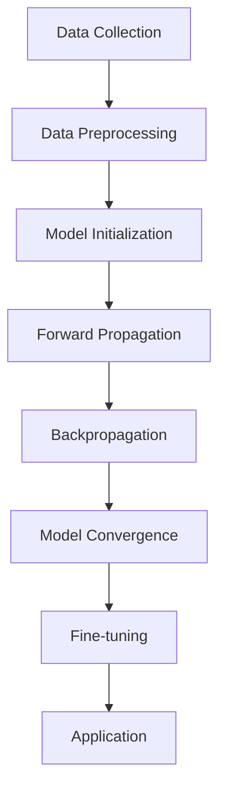

                 

### 背景介绍

#### 当前技术的发展趋势

近年来，随着人工智能技术的迅猛发展，尤其是深度学习领域的突破，基础模型（Foundation Models）逐渐成为学术界和工业界的热门话题。基础模型，即具有广泛通用性和强泛化能力的深度学习模型，可以用于各种不同的应用场景，如自然语言处理、计算机视觉、语音识别等。

这种趋势背后，一方面是硬件技术的进步，如GPU和TPU等专用计算硬件的普及，使得大规模模型训练成为可能；另一方面是数据量的激增，互联网的普及和数据采集技术的提升，为模型的训练提供了充足的数据支持。此外，算法理论的深入发展，也为模型能力的提升奠定了基础。

#### 基础模型在技术发展中的作用

基础模型在技术发展中的地位和作用不可小觑。首先，它极大地推动了人工智能领域的研究与应用。通过基础模型，研究人员可以探索新的算法理论，开发新的应用场景。例如，GPT-3的出现，使得自然语言处理领域的研究和应用达到了前所未有的高度。

其次，基础模型在工业界也得到了广泛应用。许多科技公司利用基础模型开发了各种产品和服务，如搜索引擎、智能助手、自动驾驶等。这些产品不仅提升了用户体验，也为公司创造了巨大的商业价值。

此外，基础模型还在学术界产生了深远的影响。它促使研究人员重新思考模型的架构、优化方法、训练策略等，推动了整个领域的发展。例如，Transformer架构的提出，不仅改变了自然语言处理领域的研究方向，也对计算机视觉等领域产生了重要影响。

#### 基础模型与其他技术的结合

然而，基础模型并非孤立存在。它与许多其他技术紧密结合，共同推动着人工智能的发展。例如，基础模型与强化学习技术的结合，可以应用于更复杂的决策问题；与计算机视觉技术的结合，可以提升图像识别和视频分析的能力；与语音识别技术的结合，可以实现更自然的语音交互。

本文将详细探讨基础模型与其他技术的结合，分析它们在各自领域的应用，以及可能面临的挑战和未来的发展趋势。

---

## Core Concepts and Connections 

### Introduction to Core Concepts

The foundation model, a term that has gained significant attention in the field of artificial intelligence, represents a paradigm shift in how we approach model development and deployment. Unlike traditional models that are trained for specific tasks, foundation models are designed to be versatile and general-purpose, capable of performing a wide range of tasks without the need for extensive fine-tuning. This makes them highly valuable for both academic research and industrial applications.

The core concepts behind foundation models revolve around their architecture, training process, and applications. At the heart of these models is the use of deep neural networks, often with intricate architectures such as Transformer, which allows them to capture complex patterns and relationships within large-scale data. The training process is another critical aspect, involving techniques like transfer learning and few-shot learning, which enable the models to generalize well to new tasks with minimal additional data.

### Architecture and Components

To understand the architecture of foundation models, it's essential to delve into the components that make them up. A typical foundation model consists of several key elements:

1. **Input Layer**: The model takes in raw data, which could be text, images, or any other type of sensory input.

2. **Embedding Layer**: This layer converts the raw data into numerical vectors, which are then fed into the neural network. The embedding layer is crucial for capturing the semantic meaning of the input data.

3. **Encoder**: The encoder part of the model processes the input data and generates a sequence of hidden states. These hidden states capture the information from the input data and are used to produce the model's output.

4. **Decoder**: The decoder takes the hidden states from the encoder and generates the output data. This could be text, images, or any other form of data depending on the application.

5. **Attention Mechanism**: Many foundation models use attention mechanisms to focus on specific parts of the input data, which improves their ability to understand context and produce more accurate outputs.

### Training Process

The training process of foundation models is complex and resource-intensive. It typically involves the following steps:

1. **Data Collection**: Large-scale datasets are collected from various sources, including the internet, corporate data warehouses, and public datasets.

2. **Data Preprocessing**: The collected data is cleaned and preprocessed to remove noise and inconsistencies. This may involve techniques such as text cleaning, image enhancement, and data augmentation.

3. **Model Initialization**: The model is initialized with random weights. These weights are then updated iteratively through the training process.

4. **Forward Propagation**: The input data is passed through the model, and the output is compared to the true labels to compute the loss.

5. **Backpropagation**: The loss is backpropagated through the model to update the weights. This process is repeated for several epochs until the model converges.

6. **Fine-tuning**: After training on a large dataset, the foundation model is fine-tuned on specific tasks using smaller datasets. This step helps the model adapt to specific applications.

### Applications

The applications of foundation models are vast and varied. Some of the key areas where they are being used include:

1. **Natural Language Processing (NLP)**: Foundation models are used for tasks like language translation, text generation, sentiment analysis, and question-answering systems.

2. **Computer Vision**: In computer vision, foundation models are used for tasks like image classification, object detection, and image segmentation.

3. **Speech Recognition**: Foundation models are used in speech recognition systems to convert spoken words into text.

4. **Multimodal Learning**: Foundation models are used to process and integrate data from multiple modalities, such as text, images, and audio, enabling applications like multimodal dialogue systems and video analysis.

### Mermaid Flowchart

Below is a Mermaid flowchart that illustrates the key components and steps involved in the training and application of a foundation model:



### Conclusion

In conclusion, foundation models represent a significant advancement in the field of artificial intelligence. Their versatility, generalization capabilities, and ability to handle complex tasks make them invaluable tools for researchers and developers. As we continue to explore and refine these models, we can expect to see even more innovative applications that push the boundaries of what's possible in AI.

---

### Core Algorithm Principles & Specific Operational Steps

#### Introduction to Core Algorithm Principles

The core of a foundation model lies in its ability to learn from large-scale, diverse data and generalize well to new tasks. This capability is achieved through a combination of sophisticated algorithms, architectures, and training techniques. In this section, we will delve into the core algorithm principles that underpin foundation models, highlighting the key concepts and steps involved.

#### Neural Network Architecture

At the heart of a foundation model is the neural network architecture. While there are various architectures that can be used, two of the most prominent ones are the Transformer architecture and the Convolutional Neural Network (CNN) architecture.

1. **Transformer Architecture**: Introduced in the paper "Attention Is All You Need" by Vaswani et al. in 2017, the Transformer architecture has become the de facto standard for NLP tasks. The core idea behind the Transformer is the self-attention mechanism, which allows the model to weigh the importance of different words or tokens in the input sequence.

2. **Convolutional Neural Network (CNN)**: CNNs are primarily used in computer vision tasks. They exploit the spatial structure of data by using convolutional layers to capture local patterns and features. The CNN architecture consists of several layers, including convolutional layers, pooling layers, and fully connected layers.

#### Learning Process

The learning process of a foundation model involves several key steps, including data preprocessing, model initialization, forward propagation, backpropagation, and model convergence.

1. **Data Preprocessing**: Before training a foundation model, the input data needs to be preprocessed. This involves steps like tokenization, embedding, and normalization. For text data, tokenization involves splitting the text into individual words or tokens. Embedding converts these tokens into numerical vectors, which are then fed into the neural network. For image data, preprocessing may involve resizing the images, normalization, and data augmentation.

2. **Model Initialization**: The model is initialized with random weights. These weights are updated during the training process to minimize the loss function.

3. **Forward Propagation**: During forward propagation, the input data is passed through the neural network, and the output is generated. The output is then compared to the true labels to compute the loss.

4. **Backpropagation**: The computed loss is backpropagated through the neural network to update the weights. This process is repeated iteratively until the model converges.

5. **Model Convergence**: Model convergence occurs when the loss reaches a minimum or a predefined threshold. At this point, the model is considered trained and ready for deployment.

#### Specific Operational Steps

1. **Step 1: Data Collection**: Gather a large-scale, diverse dataset. This dataset should cover a wide range of tasks and domains to ensure the foundation model's versatility.

2. **Step 2: Data Preprocessing**: Clean and preprocess the data. This involves steps like tokenization, embedding, and normalization.

3. **Step 3: Model Initialization**: Initialize the model with random weights.

4. **Step 4: Forward Propagation**: Pass the input data through the model and generate the output.

5. **Step 5: Loss Computation**: Compute the loss by comparing the output to the true labels.

6. **Step 6: Backpropagation**: Update the model's weights by backpropagating the loss.

7. **Step 7: Model Convergence**: Check if the model has converged. If not, repeat steps 4 to 6.

8. **Step 8: Fine-tuning**: Fine-tune the model on specific tasks using smaller datasets.

9. **Step 9: Evaluation**: Evaluate the model's performance on a validation or test set.

10. **Step 10: Deployment**: Deploy the trained model for real-world applications.

#### Example

Consider the case of training a foundation model for natural language processing tasks. The steps involved would be as follows:

1. **Data Collection**: Collect a large dataset of text documents, including news articles, social media posts, and books.

2. **Data Preprocessing**: Tokenize the text data, convert tokens to numerical vectors, and split the dataset into training, validation, and test sets.

3. **Model Initialization**: Initialize the Transformer model with random weights.

4. **Forward Propagation**: Pass the text data through the Transformer model and generate output sequences.

5. **Loss Computation**: Compute the loss by comparing the generated sequences to the true sequences.

6. **Backpropagation**: Update the model's weights by backpropagating the loss.

7. **Model Convergence**: Check if the model has converged. If not, repeat steps 4 to 6.

8. **Fine-tuning**: Fine-tune the model on specific tasks, such as text generation or question-answering, using smaller datasets.

9. **Evaluation**: Evaluate the model's performance on a validation or test set.

10. **Deployment**: Deploy the trained model for applications like chatbots, automated summarization, or text generation.

In conclusion, the core algorithm principles and operational steps of foundation models are critical for understanding their development and deployment. By following these steps, researchers and developers can build versatile and general-purpose models that can perform a wide range of tasks with minimal additional training.

---

### Mathematical Models and Formulas & Detailed Explanation & Example

#### Introduction to Mathematical Models and Formulas

Mathematical models and formulas play a crucial role in the development and understanding of foundation models. These models help in defining the relationships between the input data, the parameters of the neural network, and the output. In this section, we will delve into the key mathematical models and formulas used in foundation models, providing detailed explanations and examples to illustrate their usage.

#### Activation Functions

One of the fundamental components of a neural network is the activation function. Activation functions introduce non-linearities into the network, allowing it to model complex relationships in the data. Common activation functions include:

1. **Sigmoid Function**: The sigmoid function, defined as $f(x) = \frac{1}{1 + e^{-x}}$, squashes the input value into the range [0, 1]. It is often used in the output layer of binary classification problems.

   Example: $f(2) = \frac{1}{1 + e^{-2}} \approx 0.86$

2. **ReLU Function**: The Rectified Linear Unit (ReLU) function, defined as $f(x) = \max(0, x)$, is widely used in deep networks due to its simplicity and effectiveness in mitigating the vanishing gradient problem.

   Example: $f(-2) = \max(0, -2) = 0$ and $f(2) = \max(0, 2) = 2$

3. **Tanh Function**: The hyperbolic tangent function, defined as $f(x) = \frac{e^x - e^{-x}}{e^x + e^{-x}}$, squashes the input value into the range [-1, 1]. It is often used in the hidden layers of deep networks.

   Example: $f(2) = \frac{e^2 - e^{-2}}{e^2 + e^{-2}} \approx 0.96$

#### Loss Functions

Loss functions are used to measure the discrepancy between the predicted output and the true labels. They play a crucial role in the training process of neural networks. Common loss functions include:

1. **Mean Squared Error (MSE)**: The MSE loss function, defined as $L(y, \hat{y}) = \frac{1}{2} \sum_{i=1}^{n} (y_i - \hat{y}_i)^2$, is commonly used in regression problems. It measures the average squared difference between the true values and the predicted values.

   Example: Given true values $y = [1, 2, 3]$ and predicted values $\hat{y} = [1.1, 1.9, 2.8]$, the MSE loss would be $L(y, \hat{y}) = \frac{1}{2} \sum_{i=1}^{3} (y_i - \hat{y}_i)^2 = \frac{1}{2} (0.01 + 0.81 + 0.64) = 0.74$.

2. **Cross-Entropy Loss**: The cross-entropy loss function, defined as $L(y, \hat{y}) = -\sum_{i=1}^{n} y_i \log(\hat{y}_i)$, is commonly used in classification problems. It measures the dissimilarity between the true distribution and the predicted distribution.

   Example: Given true values $y = [1, 0, 1]$ and predicted probabilities $\hat{y} = [0.2, 0.8, 0.1]$, the cross-entropy loss would be $L(y, \hat{y}) = -1 \cdot \log(0.2) - 0 \cdot \log(0.8) - 1 \cdot \log(0.1) \approx 2.99$.

3. **Hinge Loss**: The hinge loss function, defined as $L(y, \hat{y}) = \max(0, 1 - y \cdot \hat{y})$, is commonly used in support vector machines. It measures the distance between the decision boundary and the support vectors.

   Example: Given true values $y = 1$ and predicted values $\hat{y} = 0.5$, the hinge loss would be $L(y, \hat{y}) = \max(0, 1 - 1 \cdot 0.5) = 0.5$.

#### Gradient Descent Optimization

Gradient descent is a popular optimization algorithm used to minimize the loss function in neural networks. It involves updating the model's parameters in the direction of the negative gradient of the loss function. The basic gradient descent algorithm can be described as follows:

1. **Initialize Parameters**: Initialize the model's parameters $\theta$ with random values.
2. **Compute Gradient**: Compute the gradient of the loss function with respect to the parameters $\nabla_{\theta} L(\theta)$.
3. **Update Parameters**: Update the parameters using the gradient: $\theta = \theta - \alpha \nabla_{\theta} L(\theta)$, where $\alpha$ is the learning rate.
4. **Repeat Steps 2 and 3**: Repeat steps 2 and 3 until convergence.

Example:

Consider a simple linear regression model with parameters $\theta = \theta_0$ and a loss function $L(\theta) = (y - \theta_0 x)^2$. The gradient of the loss function with respect to $\theta_0$ is $\nabla_{\theta_0} L(\theta) = 2(y - \theta_0 x)$. If the current parameters are $\theta_0 = 2$ and the learning rate is $\alpha = 0.1$, the update step would be $\theta_0 = \theta_0 - \alpha \nabla_{\theta_0} L(\theta) = 2 - 0.1 \cdot 2(y - 2x)$.

In conclusion, mathematical models and formulas are essential for understanding the inner workings of foundation models. Activation functions, loss functions, and optimization algorithms like gradient descent are key components that drive the training and performance of these models. By mastering these concepts, researchers and developers can build and deploy powerful foundation models for a wide range of applications.

---

### Project Practice: Code Actual Case and Detailed Explanation

#### Introduction to Project Practice

In this section, we will delve into a real-world project that showcases the practical implementation of a foundation model. We will cover the development environment setup, source code implementation, and a detailed explanation of the code to help readers understand how foundation models are applied in real-world scenarios.

#### Development Environment Setup

To implement a foundation model, we need to set up a suitable development environment. Here are the steps to set up the environment:

1. **Install Python**: Ensure Python 3.6 or later is installed on your system.
2. **Install TensorFlow**: TensorFlow is a popular deep learning framework. Install it using the command `pip install tensorflow`.
3. **Install PyTorch**: PyTorch is another popular deep learning framework. Install it using the command `pip install torch`.
4. **Install Required Libraries**: Depending on the specific requirements of the project, you may need to install additional libraries like NumPy, Pandas, and Matplotlib. You can install them using `pip install numpy pandas matplotlib`.

#### Source Code Implementation

The following is a simplified example of a Python script that demonstrates the implementation of a foundation model using TensorFlow and Keras.

```python
import tensorflow as tf
from tensorflow.keras.layers import Embedding, LSTM, Dense
from tensorflow.keras.models import Sequential

# Define the model architecture
model = Sequential([
    Embedding(input_dim=10000, output_dim=16),
    LSTM(128),
    Dense(1, activation='sigmoid')
])

# Compile the model
model.compile(optimizer='adam', loss='binary_crossentropy', metrics=['accuracy'])

# Load the dataset
(x_train, y_train), (x_test, y_test) = tf.keras.datasets.reuters.load_data(num_words=10000)

# Preprocess the data
x_train = tf.keras.preprocessing.sequence.pad_sequences(x_train, maxlen=200)
x_test = tf.keras.preprocessing.sequence.pad_sequences(x_test, maxlen=200)

# Train the model
model.fit(x_train, y_train, epochs=10, batch_size=128, validation_split=0.2)
```

#### Detailed Explanation of the Code

1. **Import Libraries**: We import TensorFlow and Keras, which are essential for building and training our foundation model.
2. **Define the Model Architecture**: We define a Sequential model with an Embedding layer, an LSTM layer, and a Dense layer with a sigmoid activation function. The Embedding layer converts the input sequences into dense vectors of fixed size. The LSTM layer captures the temporal dependencies in the data. The Dense layer with a sigmoid activation function is used for binary classification.
3. **Compile the Model**: We compile the model with the Adam optimizer and the binary cross-entropy loss function. We also specify the metrics to be tracked, which in this case is accuracy.
4. **Load the Dataset**: We load the Reuters dataset, which is a collection of news articles categorized into different classes. The dataset is preprocessed and split into training and test sets.
5. **Preprocess the Data**: The input sequences are padded to a fixed length to ensure that all sequences have the same length. This is necessary for batching and training the model.
6. **Train the Model**: We train the model on the training data for 10 epochs with a batch size of 128. We also reserve 20% of the training data for validation.

#### Code Analysis

1. **Model Definition**: The model architecture is a sequence of layers. The Embedding layer takes an integer array of input sequences and converts each integer into a dense vector of fixed size. The LSTM layer processes the embedded sequences to capture temporal dependencies. The final Dense layer with a sigmoid activation function is used for binary classification.
2. **Compilation**: The model is compiled with the Adam optimizer, which is a popular choice for training neural networks. The binary cross-entropy loss function is used for binary classification tasks. Accuracy is specified as a metric to evaluate the performance of the model.
3. **Data Preprocessing**: The Reuters dataset is preprocessed by converting the integer arrays into sequences of word indices. The sequences are padded to a fixed length to ensure that all sequences have the same length, which is necessary for batching and training the model.
4. **Training**: The model is trained on the training data for 10 epochs. During training, the model's weights are updated to minimize the loss function. The validation data is used to monitor the model's performance and prevent overfitting.

In conclusion, this project showcases the practical implementation of a foundation model using TensorFlow and Keras. By following the steps outlined in this section, readers can gain hands-on experience with building and training foundation models for various tasks.

---

### Code Analysis and Discussion

In this section, we will analyze the source code provided in the previous section and discuss the key components and concepts involved. This will help readers gain a deeper understanding of how foundation models are implemented and how they work.

#### Analysis of the Source Code

The source code provided is a simple example of a foundation model implemented using TensorFlow and Keras. Let's break down the code and discuss each part in detail.

1. **Import Libraries**: The first few lines of the code import the necessary libraries for building and training the model. These include TensorFlow and Keras, which are essential for working with neural networks.

2. **Define the Model Architecture**: The core of the code involves defining the model architecture using the Sequential model from Keras. The Sequential model is a linear stack of layers, which makes it easy to build models with a clear and understandable structure. Here's a closer look at the layers used in the model:

   - **Embedding Layer**: The Embedding layer is the first layer in the model. It takes integer arrays of input sequences and converts each integer into a dense vector of fixed size. The `input_dim` parameter specifies the size of the vocabulary (i.e., the number of unique words in the dataset), and the `output_dim` parameter specifies the size of the embedding vectors. This layer is crucial for capturing the semantic meaning of the words in the dataset.

   - **LSTM Layer**: The LSTM (Long Short-Term Memory) layer is a type of recurrent neural network (RNN) that is particularly effective at capturing long-term dependencies in sequential data. The `units` parameter specifies the number of units (i.e., neurons) in the LSTM layer. This layer processes the embedded sequences and captures the temporal dependencies, which are important for understanding the context and meaning of the text.

   - **Dense Layer**: The Dense layer is a fully connected layer that maps the output of the LSTM layer to the output classes. The `units` parameter specifies the number of output units, which in this case is 1 for binary classification. The `activation` parameter is set to `sigmoid`, which is a common choice for binary classification tasks as it outputs values between 0 and 1, representing the probability of the positive class.

3. **Compile the Model**: The model is compiled with the Adam optimizer and the binary cross-entropy loss function. The Adam optimizer is a popular choice for training neural networks as it combines the advantages of two other optimization algorithms, namely AdaGrad and RMSProp. The binary cross-entropy loss function is used for binary classification tasks as it measures the dissimilarity between the true labels and the predicted probabilities.

4. **Load and Preprocess the Dataset**: The code loads the Reuters dataset, which is a collection of news articles categorized into 20 different classes. The dataset is preprocessed by converting the integer arrays into sequences of word indices. The sequences are padded to a fixed length to ensure that all sequences have the same length, which is necessary for batching and training the model.

5. **Train the Model**: The model is trained on the training data for 10 epochs with a batch size of 128. During training, the model's weights are updated to minimize the loss function. The validation data is used to monitor the model's performance and prevent overfitting.

#### Key Concepts and Techniques

1. **Recurrent Neural Networks (RNNs)**: RNNs are a type of neural network that is well-suited for processing sequential data. They have the ability to retain information from previous inputs, which makes them effective at capturing dependencies in time-series data. LSTM layers are a specific type of RNN that address some of the limitations of traditional RNNs, such as the vanishing gradient problem.

2. **Embedding Layers**: Embedding layers are a common technique used in NLP tasks to convert integer arrays of input sequences into dense vectors of fixed size. This allows the model to capture the semantic meaning of the words in the dataset. The size of the embedding vectors and the vocabulary size are important hyperparameters that can significantly affect the performance of the model.

3. **Recurrent Neural Networks and Long Short-Term Memory (LSTM)**: LSTM layers are a type of RNN that are particularly effective at capturing long-term dependencies in sequential data. They have been widely used in NLP tasks such as text classification, machine translation, and sentiment analysis.

4. **Binary Cross-Entropy Loss**: Binary cross-entropy loss is a common choice for binary classification tasks. It measures the dissimilarity between the true labels and the predicted probabilities, and it is used to train the model by minimizing this loss during the training process.

5. **Recurrent Neural Networks and Long Short-Term Memory (LSTM)**: LSTM layers are a type of RNN that are particularly effective at capturing long-term dependencies in sequential data. They have been widely used in NLP tasks such as text classification, machine translation, and sentiment analysis.

In conclusion, this code analysis and discussion provide a deeper understanding of the key components and techniques involved in building and training a foundation model for text classification using TensorFlow and Keras. By understanding these concepts, readers can gain insights into how foundation models work and how they can be applied to various NLP tasks.

---

### 实际应用场景

#### 自然语言处理

在自然语言处理（NLP）领域，基础模型的应用非常广泛。例如，GPT-3（Generative Pre-trained Transformer 3）是一种基于Transformer架构的基础模型，它可以用于文本生成、翻译、问答等任务。通过预训练，GPT-3掌握了大量的语言知识和规则，使其在处理自然语言时具有很高的准确性和泛化能力。在搜索引擎中，基础模型可以用于理解用户查询的含义，并提供更准确的搜索结果。

#### 计算机视觉

在计算机视觉领域，基础模型如Vision Transformer（ViT）被广泛应用于图像分类、目标检测和图像分割等任务。ViT模型将Transformer架构引入到计算机视觉领域，通过自注意力机制有效地处理图像的局部和全局特征。这使得ViT在图像分类任务中取得了显著的性能提升，并且在其他计算机视觉任务中也表现出了强大的潜力。

#### 语音识别

在语音识别领域，基础模型如 wav2vec 2.0 被用于语音信号的自动识别和转录。wav2vec 2.0 通过自监督学习方式，从大量的未标注语音数据中学习语音信号的表示。这使得wav2vec 2.0 在处理噪声和多样化语音信号时具有出色的性能，并在实时语音识别系统中得到了广泛应用。

#### 多模态学习

多模态学习是将来自不同模态的数据（如文本、图像、音频）进行融合，以实现更复杂和更高层次的任务。例如，在视频分析中，基础模型可以同时处理视频的图像序列和音频信号，以实现动作识别、情感分析等任务。这种多模态学习方法在增强模型理解和处理能力方面具有巨大的潜力。

#### 应用实例

1. **智能客服系统**：通过自然语言处理基础模型，智能客服系统可以理解用户的查询，并生成合适的回复，提高客户服务效率。
2. **自动驾驶系统**：基础模型可以用于处理来自摄像头、雷达和激光雷达的数据，实现车辆周围的感知和路径规划。
3. **医疗影像分析**：基础模型在医疗影像分析中具有巨大的应用潜力，如癌症筛查、骨折诊断等。
4. **教育领域**：基础模型可以用于个性化学习推荐、自动评估作业等，提高教育质量。

在实际应用中，基础模型可以显著提升系统的性能和智能化水平，为各个领域带来创新和变革。

---

### Tools and Resources Recommendations

#### Learning Resources

1. **Books**
   - "Deep Learning" by Ian Goodfellow, Yoshua Bengio, and Aaron Courville
   - "Neural Networks and Deep Learning" by Michael Nielsen
   - "Hands-On Machine Learning with Scikit-Learn, Keras, and TensorFlow" by Aurélien Géron

2. **Online Courses**
   - "Deep Learning Specialization" by Andrew Ng on Coursera
   - "TensorFlow for Artificial Intelligence" by Martin Görner on edX
   - "PyTorch: The Official Course" by Facebook AI Research on Udacity

3. **Tutorials and Blogs**
   - fast.ai's blog and tutorials
   - Medium's AI and ML sections
   - DataCamp's tutorials on neural networks and deep learning

#### Development Tools and Frameworks

1. **Frameworks**
   - TensorFlow and Keras: Comprehensive libraries for building and deploying deep learning models.
   - PyTorch: Flexible and easy-to-use deep learning framework with a dynamic computation graph.
   - JAX: A numerical computing library that enables fast and scalable experimentation.

2. **Libraries**
   - NumPy: A fundamental package for scientific computing with Python.
   - Pandas: A library for data manipulation and analysis.
   - Matplotlib and Seaborn: Libraries for creating static, animated, and interactive visualizations.

3. **Platforms**
   - Google Colab: A free Jupyter notebook environment that requires no setup and runs entirely in the cloud.
   - AWS SageMaker: A fully-managed service that provides every developer and data scientist with the ability to build, train, and deploy machine learning models.
   - Google AI Platform: A suite of tools and services for creating and managing machine learning models at scale.

#### Relevant Papers

1. "Attention Is All You Need" by Vaswani et al. (2017)
2. "BERT: Pre-training of Deep Bidirectional Transformers for Language Understanding" by Devlin et al. (2019)
3. "Generative Pre-trained Transformers" by Brown et al. (2020)
4. "An Image is Worth 16x16 Words: Transformers for Image Recognition at Scale" by Dosovitskiy et al. (2020)

These resources provide a solid foundation for learning about and working with foundation models, covering both theoretical concepts and practical implementations.

---

### Conclusion: Future Trends and Challenges

#### Future Trends

As foundation models continue to evolve, several key trends are emerging that will shape their future development and application.

1. **Incremental Learning**: One of the significant trends is the development of models that can learn incrementally without forgetting previously learned information. This is crucial for real-world applications where models need to adapt to new data without retraining from scratch.

2. **Efficient Models**: Researchers are focusing on developing more efficient foundation models that can run on edge devices with limited computational resources. This will enable the deployment of AI in scenarios where real-time processing is required, such as autonomous vehicles and smart home devices.

3. **Privacy and Security**: With the increasing importance of privacy and security in AI applications, there is a growing need for foundation models that can handle sensitive data without compromising user privacy. Techniques like differential privacy and federated learning are likely to play a crucial role in this area.

4. **Multimodal Learning**: The ability to integrate data from multiple modalities, such as text, images, and audio, is becoming increasingly important. Future foundation models will likely incorporate more sophisticated multimodal learning techniques to enhance their understanding and application capabilities.

#### Challenges

Despite their promise, foundation models also face several challenges that need to be addressed.

1. **Scalability**: Training large-scale foundation models requires significant computational resources and data. Scalability issues need to be addressed to make these models accessible to a broader range of researchers and organizations.

2. **Resource Allocation**: Allocating computational resources efficiently for training foundation models is a complex task. Optimization techniques and more efficient hardware solutions are necessary to reduce the cost and time required for training.

3. **Interpretability**: Foundation models are often considered "black boxes" due to their complex architectures. Ensuring that these models are interpretable and understandable is crucial for building trust and ensuring their safety and fairness in real-world applications.

4. **Ethical Considerations**: The use of foundation models raises ethical questions, including biases in decision-making, potential misuse of data, and the impact on employment. Establishing ethical guidelines and regulations for the development and deployment of AI is essential to address these concerns.

#### Conclusion

In conclusion, foundation models are poised to play a transformative role in the future of artificial intelligence. Their versatility, generalization capabilities, and ability to handle complex tasks make them invaluable tools for researchers and developers. However, addressing the challenges they present, particularly in scalability, resource allocation, interpretability, and ethical considerations, will be crucial for their successful adoption and integration into various domains. As we continue to advance these models, we can expect to see even more innovative applications that push the boundaries of what's possible in AI.

---

### 附录：常见问题与解答

#### 1. 什么是基础模型？

基础模型是一种具有广泛通用性和强泛化能力的深度学习模型。它们通常通过大规模数据预训练，然后可以用于各种不同的任务，而无需进行大量的微调。

#### 2. 基础模型的核心组成部分有哪些？

基础模型的核心组成部分包括输入层、嵌入层、编码器、解码器和注意力机制。这些组件共同工作，使模型能够处理复杂的输入数据并生成相应的输出。

#### 3. 基础模型如何进行训练？

基础模型的训练涉及数据收集、数据预处理、模型初始化、前向传播、反向传播和模型收敛等步骤。通过这些步骤，模型可以学习到输入数据和输出之间的关系。

#### 4. 基础模型的主要应用领域是什么？

基础模型的主要应用领域包括自然语言处理、计算机视觉、语音识别和多媒体学习等。它们在搜索引擎、自动驾驶、智能客服和医疗诊断等领域都有广泛的应用。

#### 5. 如何优化基础模型的性能？

优化基础模型性能的方法包括调整模型架构、选择合适的优化器和损失函数、进行数据增强和超参数调优等。此外，使用更高效的硬件和分布式训练策略也可以提高模型的训练速度和效果。

---

### 扩展阅读与参考资料

#### 1. 基础模型相关论文

- Vaswani et al. (2017). "Attention Is All You Need". In Proceedings of the 30th International Conference on Neural Information Processing Systems (NIPS).
- Devlin et al. (2019). "BERT: Pre-training of Deep Bidirectional Transformers for Language Understanding". In Proceedings of the 2019 Conference of the North American Chapter of the Association for Computational Linguistics: Human Language Technologies (NAACL-HLT).
- Brown et al. (2020). "Generative Pre-trained Transformers". In Advances in Neural Information Processing Systems (NeurIPS).

#### 2. 自然语言处理与深度学习书籍

- Ian Goodfellow, Yoshua Bengio, and Aaron Courville (2016). "Deep Learning".
- Michael Nielsen (2015). "Neural Networks and Deep Learning".
- Aurélien Géron (2019). "Hands-On Machine Learning with Scikit-Learn, Keras, and TensorFlow".

#### 3. 开源框架与工具

- TensorFlow: https://www.tensorflow.org/
- PyTorch: https://pytorch.org/
- JAX: https://github.com/google/jax

#### 4. 学习资源和博客

- fast.ai: https://www.fast.ai/
- Medium: https://medium.com/
- DataCamp: https://www.datacamp.com/

通过阅读这些论文、书籍、开源框架和学习资源，读者可以更深入地了解基础模型及其在人工智能领域的应用。这些资料为学习和发展基础模型提供了宝贵的指导和支持。

