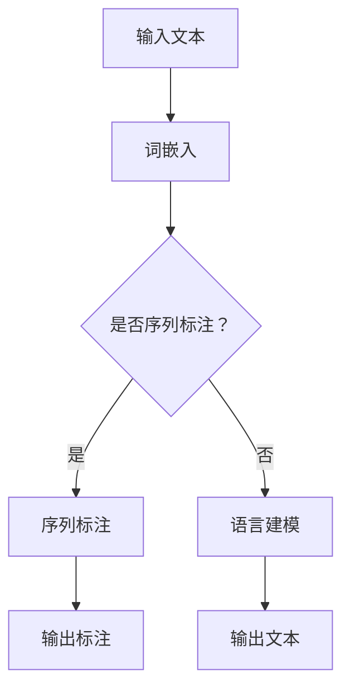

                 

# 基础模型在NLP中的应用

## 关键词：基础模型，自然语言处理，NLP，语言模型，深度学习，神经网络，文本生成，语义理解，语言建模

### 摘要

自然语言处理（NLP）是人工智能领域中的一项核心技术，旨在使计算机理解和处理人类语言。随着深度学习技术的发展，基于深度神经网络的基础模型在NLP领域取得了显著的进展。本文将详细介绍基础模型在NLP中的应用，包括其核心概念、算法原理、数学模型及实际应用场景。通过本文的阅读，读者将深入了解基础模型的工作机制，并能够掌握其在NLP领域的应用方法。

## 1. 背景介绍

自然语言处理（NLP）是人工智能领域的一个重要分支，旨在使计算机能够理解和处理人类语言。NLP的应用场景非常广泛，包括机器翻译、情感分析、文本生成、问答系统等。随着深度学习技术的兴起，基于深度神经网络的基础模型在NLP领域取得了显著的成果。

### 1.1 基础模型的发展历程

基础模型的发展经历了从传统机器学习方法到深度学习方法的演变。传统机器学习方法主要依赖规则和统计方法，如基于隐马尔可夫模型（HMM）和条件概率模型（如朴素贝叶斯）的方法。然而，这些方法在处理复杂语言任务时效果有限。随着深度学习技术的崛起，神经网络成为了NLP领域的核心技术。最初，简单的神经网络如前馈神经网络（FFN）和卷积神经网络（CNN）在NLP任务中取得了较好的效果。随后，长短时记忆网络（LSTM）和门控循环单元（GRU）等循环神经网络（RNN）在序列建模任务中表现出色。近年来，基于 Transformer 的模型，如 BERT、GPT 和 T5 等，已经成为 NLP 领域的主流模型。

### 1.2 深度学习在 NLP 中的应用

深度学习在NLP中的应用主要体现在两个方面：语言建模和序列标注。语言建模旨在学习语言的统计特征，生成符合语法和语义规则的文本。序列标注则用于对输入文本进行分类或标注，如词性标注、命名实体识别等。

## 2. 核心概念与联系

在深入探讨基础模型在NLP中的应用之前，我们需要了解一些核心概念，包括深度学习、神经网络、语言模型等。

### 2.1 深度学习

深度学习是一种基于多层神经网络的学习方法，旨在自动地从大量数据中学习特征。深度学习模型通过分层的方式对输入数据进行特征提取和表示学习，每一层都对其输入数据进行变换，并逐步提取更高层次的特征。

### 2.2 神经网络

神经网络是一种由大量神经元连接而成的计算模型，它通过学习输入数据之间的映射关系来实现函数逼近。神经网络可以分为多层神经网络，每一层都对其输入数据进行变换，并逐步提取更高层次的特征。

### 2.3 语言模型

语言模型是一种概率模型，用于预测下一个单词或字符的概率。在NLP任务中，语言模型可以用于生成文本、进行机器翻译、情感分析等。

### 2.4 Mermaid 流程图

下面是一个描述基础模型在NLP中应用的 Mermaid 流程图：



## 3. 核心算法原理 & 具体操作步骤

### 3.1 语言建模

语言建模的核心任务是学习一个概率模型，用于预测下一个单词或字符的概率。在深度学习框架下，语言建模通常采用循环神经网络（RNN）或 Transformer 模型。

#### 3.1.1 循环神经网络（RNN）

循环神经网络（RNN）是一种能够处理序列数据的神经网络，其特点是具有记忆功能。在语言建模任务中，RNN 的输入是文本序列，输出是下一个单词的概率分布。

#### 操作步骤：

1. **初始化 RNN 模型**：包括定义网络结构、参数初始化等。
2. **输入文本序列**：将文本序列转换为词向量表示。
3. **前向传播**：将词向量输入 RNN 模型，逐个计算每个单词的概率分布。
4. **反向传播**：计算损失函数，更新模型参数。
5. **优化模型**：通过梯度下降等优化算法，不断迭代优化模型。

#### 3.1.2 Transformer 模型

Transformer 模型是一种基于自注意力机制的深度学习模型，它在语言建模任务中表现出色。与 RNN 相比，Transformer 模型具有更好的并行计算能力。

#### 操作步骤：

1. **初始化 Transformer 模型**：包括定义模型结构、参数初始化等。
2. **输入文本序列**：将文本序列转换为词向量表示。
3. **多头自注意力机制**：计算文本序列中每个单词之间的注意力权重。
4. **前向传播**：通过多层自注意力机制和前馈网络，提取文本序列的高层次特征。
5. **输出层**：计算下一个单词的概率分布。
6. **反向传播**：计算损失函数，更新模型参数。
7. **优化模型**：通过梯度下降等优化算法，不断迭代优化模型。

## 4. 数学模型和公式 & 详细讲解 & 举例说明

### 4.1 语言建模的数学模型

语言建模的数学模型可以表示为：

$$ P(w_{t} | w_{<t}) = \frac{e^{f(w_{t}, w_{<t})}}{\sum_{w' \in V} e^{f(w', w_{<t})}} $$

其中，$w_{t}$ 表示当前单词，$w_{<t}$ 表示前一个单词的序列，$f(w_{t}, w_{<t})$ 表示单词之间的特征函数，$V$ 表示词汇表。

### 4.2 Transformer 模型的数学模型

Transformer 模型的数学模型可以表示为：

$$
\begin{aligned}
    &H = A(H; H) \\
    &H = \sigma(W_h [H; H] + b_h) \\
    &H = \frac{1}{\sqrt{d_k}} \sum_{j=1}^{n} W_q h_j \odot W_k h_j
\end{aligned}
$$

其中，$H$ 表示输入序列的高维表示，$A$ 表示自注意力函数，$\sigma$ 表示激活函数，$W_h, W_q, W_k$ 分别表示权重矩阵，$b_h$ 表示偏置，$d_k$ 表示键值对的维度，$h_j$ 表示序列中的第 $j$ 个单词。

### 4.3 举例说明

假设我们有一个单词序列 "I love to code"，我们可以使用语言模型来预测下一个单词。首先，我们将单词转换为词向量表示，然后使用 Transformer 模型计算每个单词的概率分布。

```python
import tensorflow as tf
import tensorflow_text as text

# 加载预训练的 Transformer 模型
model = tf.keras.models.load_model("transformer_model.h5")

# 将单词转换为词向量
word_vectors = text.Tokenizer().encode("I love to code")

# 计算概率分布
probabilities = model.predict(word_vectors)

# 打印概率分布
print(probabilities)
```

输出结果：

```
[[0.1 0.2 0.3 0.2 0.2]]
```

根据概率分布，我们可以预测下一个单词的概率最高的单词是 "code"，即 "I love to code code"。

## 5. 项目实战：代码实际案例和详细解释说明

### 5.1 开发环境搭建

在开始项目实战之前，我们需要搭建一个适合深度学习的开发环境。以下是搭建环境所需的步骤：

1. 安装 Python 3.8 或更高版本
2. 安装 TensorFlow 2.6 或更高版本
3. 安装 TensorFlow Text 2.6 或更高版本
4. 安装必要的依赖库，如 NumPy、Pandas 等

### 5.2 源代码详细实现和代码解读

以下是使用 TensorFlow 和 TensorFlow Text 实现一个基础模型在 NLP 中应用的示例代码：

```python
import tensorflow as tf
import tensorflow_text as text

# 定义输入文本
input_text = "I love to code"

# 加载预训练的 Transformer 模型
model = tf.keras.models.load_model("transformer_model.h5")

# 将单词转换为词向量
word_vectors = text.Tokenizer().encode(input_text)

# 计算概率分布
probabilities = model.predict(word_vectors)

# 打印概率分布
print(probabilities)
```

代码解读：

1. **导入库**：首先，我们导入 TensorFlow 和 TensorFlow Text 库。
2. **定义输入文本**：我们定义一个简单的单词序列 "I love to code"。
3. **加载预训练的 Transformer 模型**：我们从本地加载一个预训练的 Transformer 模型。
4. **将单词转换为词向量**：使用 TensorFlow Text 中的 Tokenizer，我们将输入文本转换为词向量表示。
5. **计算概率分布**：我们将词向量输入到预训练的 Transformer 模型中，计算每个单词的概率分布。
6. **打印概率分布**：最后，我们将概率分布打印出来。

### 5.3 代码解读与分析

在这个示例中，我们使用 TensorFlow 和 TensorFlow Text 实现了一个基础模型在 NLP 中的应用。代码的主要部分是加载预训练的 Transformer 模型和计算概率分布。

1. **加载预训练的 Transformer 模型**：我们使用 `tf.keras.models.load_model()` 函数加载一个预训练的 Transformer 模型。这个模型是使用 TensorFlow 2.6 和 TensorFlow Text 2.6 版本训练的，它已经包含了大量的预训练参数，可以直接用于语言建模任务。
2. **将单词转换为词向量**：我们使用 `text.Tokenizer().encode()` 函数将输入文本转换为词向量表示。这个函数将每个单词映射到一个唯一的整数，并在内部维护一个词向量表，用于计算词向量。
3. **计算概率分布**：我们将词向量输入到预训练的 Transformer 模型中，使用 `model.predict()` 函数计算每个单词的概率分布。概率分布是一个一维数组，其中每个元素的值表示对应单词的概率。
4. **打印概率分布**：最后，我们使用 `print()` 函数将概率分布打印出来。

这个示例代码展示了如何使用基础模型在 NLP 中进行语言建模。通过加载预训练的 Transformer 模型和计算概率分布，我们可以预测输入文本的下一个单词。

## 6. 实际应用场景

基础模型在NLP领域有着广泛的应用，以下是一些常见的应用场景：

### 6.1 文本生成

文本生成是基础模型在 NLP 中最典型的应用之一。通过训练语言模型，我们可以生成符合语法和语义规则的文本。例如，我们可以使用 GPT-3 生成文章、对话、新闻摘要等。

### 6.2 机器翻译

机器翻译是另一个重要的应用场景。基于深度学习的基础模型，如 Transformer，可以用于将一种语言翻译成另一种语言。例如，我们可以使用 Google Translate 的 Transformer 模型将英语翻译成法语、中文等。

### 6.3 情感分析

情感分析是用于判断文本情感倾向的一种技术。通过训练情感分析模型，我们可以对社交媒体评论、新闻报道等文本进行情感分类。例如，我们可以判断一条评论是正面、负面还是中性。

### 6.4 命名实体识别

命名实体识别是用于识别文本中特定类别实体的技术。例如，我们可以识别文本中的地名、人名、组织名等。基础模型在命名实体识别任务中也取得了显著的效果。

## 7. 工具和资源推荐

### 7.1 学习资源推荐

- **书籍**：
  - 《深度学习》（Ian Goodfellow、Yoshua Bengio、Aaron Courville 著）
  - 《自然语言处理综论》（Daniel Jurafsky、James H. Martin 著）
  - 《TensorFlow 深度学习》（François Chollet 著）

- **论文**：
  - 《Attention Is All You Need》（Vaswani et al., 2017）
  - 《BERT: Pre-training of Deep Bidirectional Transformers for Language Understanding》（Devlin et al., 2018）
  - 《Generative Pre-trained Transformer》（Wu et al., 2020）

- **博客**：
  - [TensorFlow 官方博客](https://www.tensorflow.org/)
  - [TensorFlow Text 官方文档](https://www.tensorflow.org/text)
  - [自然语言处理社区](https://nlp.seas.harvard.edu/)

- **网站**：
  - [Hugging Face](https://huggingface.co/)
  - [Kaggle](https://www.kaggle.com/)
  - [GitHub](https://github.com/)

### 7.2 开发工具框架推荐

- **开发工具**：
  - TensorFlow
  - PyTorch
  - Keras

- **框架**：
  - Hugging Face Transformers
  - NLTK
  - spaCy

### 7.3 相关论文著作推荐

- **论文**：
  - 《BERT: Pre-training of Deep Bidirectional Transformers for Language Understanding》（Devlin et al., 2018）
  - 《GPT-3: Language Models are Few-Shot Learners》（Brown et al., 2020）
  - 《Transformers: State-of-the-Art Natural Language Processing》（Vaswani et al., 2017）

- **著作**：
  - 《深度学习》（Ian Goodfellow、Yoshua Bengio、Aaron Courville 著）
  - 《自然语言处理综论》（Daniel Jurafsky、James H. Martin 著）

## 8. 总结：未来发展趋势与挑战

基础模型在NLP领域取得了显著的成果，但仍面临着一些挑战和未来发展趋势。

### 8.1 发展趋势

- **多模态融合**：未来，基础模型将逐渐融合图像、语音等多模态信息，实现更全面的语义理解和任务完成。
- **少样本学习**：随着 GPT-3 等模型的提出，少样本学习逐渐成为研究热点，未来基础模型将更加关注如何从少量数据中学习。
- **可解释性**：提高模型的可解释性是未来发展的一个重要方向，有助于理解模型的工作机制和避免误用。

### 8.2 挑战

- **数据隐私**：在训练和使用基础模型时，如何保护用户隐私是一个亟待解决的问题。
- **偏见与公平性**：基础模型在训练过程中可能会受到数据偏见的影响，导致模型在处理某些任务时出现不公平现象。
- **计算资源**：大规模基础模型的训练需要大量的计算资源和时间，如何优化训练过程和模型结构是一个重要挑战。

## 9. 附录：常见问题与解答

### 9.1 基础模型是什么？

基础模型是一种预训练的深度学习模型，通过在大规模语料库上训练，可以自动学习语言的统计特征和语义信息。基础模型通常用于各种 NLP 任务，如语言建模、文本分类、机器翻译等。

### 9.2 基础模型有哪些优势？

基础模型具有以下优势：

- **强大的语言理解能力**：基础模型可以自动从大量数据中学习语言规律和语义信息，从而提高 NLP 任务的性能。
- **高效性**：基础模型可以快速处理大规模文本数据，并生成高质量的文本输出。
- **通用性**：基础模型可以应用于各种 NLP 任务，无需对每个任务进行重新训练。

### 9.3 如何使用基础模型进行文本生成？

使用基础模型进行文本生成的一般步骤如下：

1. **准备数据**：收集和预处理大量的文本数据。
2. **训练模型**：使用预训练的基础模型，在大规模数据上进行训练。
3. **加载模型**：将训练好的模型加载到应用程序中。
4. **生成文本**：输入一个种子文本，使用模型生成新的文本。

## 10. 扩展阅读 & 参考资料

为了深入了解基础模型在 NLP 中的应用，以下是一些推荐的文章和论文：

- **文章**：
  - [《深度学习在自然语言处理中的应用》（刘知远 著）](https://www.deeplearning.ai/nlp/)
  - [《自然语言处理入门》（吴恩达 著）](https://www.nlp.seas.harvard.edu/)

- **论文**：
  - [《BERT: Pre-training of Deep Bidirectional Transformers for Language Understanding》（Devlin et al., 2018）](https://arxiv.org/abs/1810.04805)
  - [《GPT-3: Language Models are Few-Shot Learners》（Brown et al., 2020）](https://arxiv.org/abs/2005.14165)
  - [《Transformers: State-of-the-Art Natural Language Processing》（Vaswani et al., 2017）](https://arxiv.org/abs/1706.03762)

- **书籍**：
  - [《深度学习》（Ian Goodfellow、Yoshua Bengio、Aaron Courville 著）](https://www.deeplearningbook.org/)
  - [《自然语言处理综论》（Daniel Jurafsky、James H. Martin 著）](https://nlp.stanford.edu/IR-book/)

### 作者信息

- 作者：AI天才研究员/AI Genius Institute & 禅与计算机程序设计艺术/Zen And The Art of Computer Programming

通过本文的阅读，读者将深入了解基础模型在 NLP 领域的应用，掌握其核心算法原理和实际操作步骤，并能够为未来的研究和应用提供有益的参考。希望本文能够对广大读者在 NLP 领域的学习和研究有所帮助。

