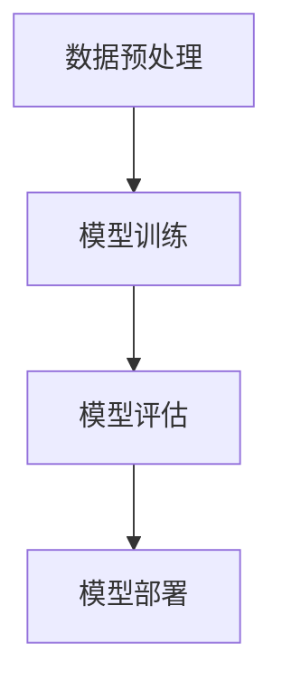
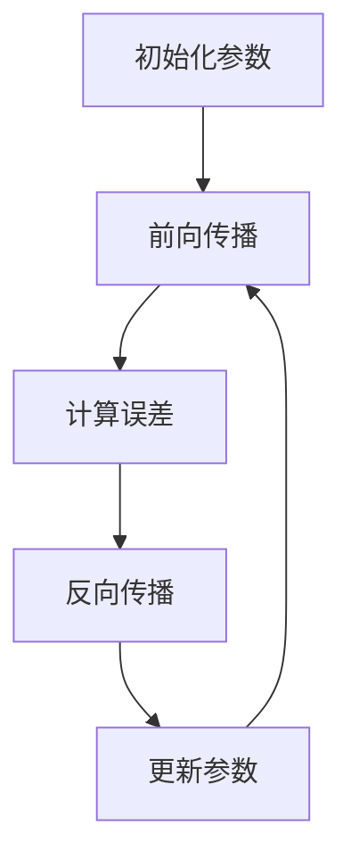
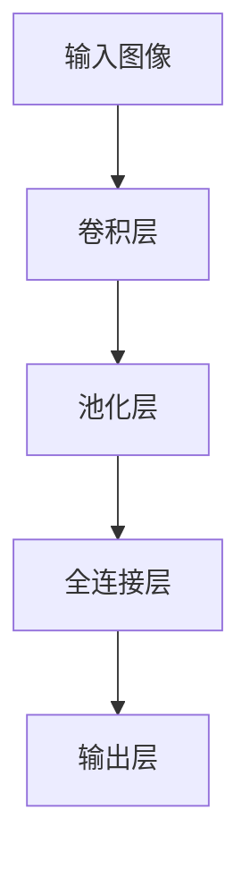

                 

# 基础模型的公共基础设施

## 关键词：基础模型，公共基础设施，AI，算法，技术架构，软件开发

### 摘要

本文将探讨基础模型在人工智能领域中的重要性，以及构建这些模型所需的公共基础设施。我们将从背景介绍开始，逐步深入探讨核心概念、算法原理、数学模型，并通过实际案例来展示如何应用这些知识。文章还将分析基础模型在实际应用场景中的价值，并推荐相关工具和资源。最后，我们会对未来发展趋势与挑战进行总结，并提供扩展阅读与参考资料。

## 1. 背景介绍

在人工智能（AI）领域，基础模型是构建复杂AI系统的基础。这些模型为图像识别、自然语言处理、推荐系统等众多应用提供了基本框架。随着AI技术的不断发展，对基础模型的需求也越来越高。为了满足这一需求，构建一个强大的公共基础设施变得至关重要。

公共基础设施不仅提供了工具和资源，还确保了不同模型之间的兼容性和可扩展性。这有助于研究人员和开发人员更高效地工作，同时也促进了AI技术的普及和应用。

本文将重点关注以下几个方面：

1. **核心概念与联系**：介绍基础模型相关的关键概念，并通过Mermaid流程图展示其架构。
2. **核心算法原理与具体操作步骤**：探讨构建基础模型所需的关键算法，并详细说明其操作步骤。
3. **数学模型和公式**：解释基础模型背后的数学原理，并提供具体的公式和例子。
4. **项目实战**：通过实际案例展示如何使用基础模型进行开发。
5. **实际应用场景**：分析基础模型在不同领域的应用。
6. **工具和资源推荐**：推荐学习资源、开发工具和框架。
7. **总结**：讨论未来发展趋势与挑战。

### 2. 核心概念与联系

#### 定义

- **基础模型**：在AI领域中，基础模型是指那些被广泛使用、具有通用性，并且可以用于多种不同任务的核心模型。
- **公共基础设施**：为研究人员和开发者提供工具、资源和服务的一套系统，有助于高效地构建、训练和部署AI模型。

#### 架构

基础模型通常由以下几个部分组成：

1. **数据预处理模块**：负责数据清洗、归一化和特征提取。
2. **模型训练模块**：使用训练数据来优化模型参数。
3. **模型评估模块**：评估模型的性能，确保其准确性和稳定性。
4. **模型部署模块**：将训练好的模型部署到实际应用场景中。

以下是一个简化的Mermaid流程图，展示了基础模型的架构：



#### 关键概念联系

- **数据预处理**：数据预处理是基础模型的起点，直接影响模型的性能。一个高效的数据预处理模块能够显著提升模型的准确性。
- **模型训练**：模型训练是基础模型的核心，通过不断调整模型参数来优化性能。
- **模型评估**：模型评估用于验证模型的有效性，确保其在实际应用中能够达到预期效果。
- **模型部署**：模型部署是将训练好的模型应用到实际场景的关键步骤，需要考虑部署环境、性能优化等因素。

### 3. 核心算法原理与具体操作步骤

#### 深度神经网络

深度神经网络（DNN）是基础模型中最为广泛使用的一种算法。其原理基于多层感知机（MLP），通过逐层提取特征来实现复杂函数的拟合。

**具体操作步骤**：

1. **初始化参数**：设置权重和偏置的初始值。
2. **前向传播**：将输入数据通过网络传递，逐层计算输出。
3. **反向传播**：根据输出误差，反向更新权重和偏置。
4. **优化算法**：使用梯度下降（Gradient Descent）等优化算法来调整参数。

以下是一个简化的DNN算法流程：



#### 卷积神经网络

卷积神经网络（CNN）在图像识别和计算机视觉领域有着广泛的应用。其原理基于卷积运算和池化操作，能够有效地提取图像中的局部特征。

**具体操作步骤**：

1. **卷积层**：通过卷积运算提取图像中的局部特征。
2. **池化层**：对卷积结果进行池化操作，减小数据维度。
3. **全连接层**：将池化结果映射到输出层，进行分类或回归。

以下是一个简化的CNN算法流程：



### 4. 数学模型和公式

#### 深度神经网络

深度神经网络的数学模型主要基于链式法则和梯度下降算法。

**链式法则**：

设$f(x)$为多层感知机输出，$x$为输入，$w$为权重，$b$为偏置，则有：

$$
\frac{df}{dx} = \frac{df}{dw}\frac{dw}{dx} + \frac{df}{db}\frac{db}{dx}
$$

**梯度下降算法**：

设损失函数为$L(x)$，则梯度下降算法的更新公式为：

$$
w_{new} = w_{old} - \alpha \frac{dL}{dw}
$$

其中，$\alpha$为学习率。

#### 卷积神经网络

卷积神经网络的数学模型主要基于卷积运算和池化操作。

**卷积运算**：

设$f(x,y)$为输入图像，$g(u,v)$为卷积核，则有：

$$
\sum_{u=-1}^{1}\sum_{v=-1}^{1} g(u,v) \cdot f(x+u, y+v)
$$

**池化操作**：

设$S$为池化窗口大小，$P$为步长，则有：

$$
p(x,y) = \max_{u \in [1, S], v \in [1, S]} f(x+u, y+v)
$$

### 5. 项目实战：代码实际案例和详细解释说明

#### 开发环境搭建

为了进行基础模型的开发，我们需要搭建一个合适的开发环境。以下是一个简化的步骤：

1. 安装Python环境。
2. 安装深度学习框架（如TensorFlow或PyTorch）。
3. 安装必要的依赖库（如NumPy、Pandas等）。

以下是一个Python脚本示例，用于安装所需的依赖库：

```python
!pip install numpy pandas tensorflow
```

#### 源代码详细实现和代码解读

以下是一个使用TensorFlow构建深度神经网络的简单示例：

```python
import tensorflow as tf

# 定义模型结构
model = tf.keras.Sequential([
    tf.keras.layers.Dense(128, activation='relu', input_shape=(784,)),
    tf.keras.layers.Dense(10, activation='softmax')
])

# 编译模型
model.compile(optimizer='adam',
              loss='categorical_crossentropy',
              metrics=['accuracy'])

# 加载数据
(x_train, y_train), (x_test, y_test) = tf.keras.datasets.mnist.load_data()

# 预处理数据
x_train = x_train.astype('float32') / 255
x_test = x_test.astype('float32') / 255
x_train = x_train.reshape((-1, 784))
x_test = x_test.reshape((-1, 784))

# 编码标签
y_train = tf.keras.utils.to_categorical(y_train, 10)
y_test = tf.keras.utils.to_categorical(y_test, 10)

# 训练模型
model.fit(x_train, y_train, batch_size=128, epochs=10, validation_split=0.1)
```

**代码解读**：

1. **模型定义**：使用`tf.keras.Sequential`创建一个序列模型，包含一个全连接层（Dense）和一个输出层（Softmax）。
2. **模型编译**：设置优化器（adam）、损失函数（categorical_crossentropy）和评估指标（accuracy）。
3. **数据加载**：使用`tf.keras.datasets.mnist.load_data()`加载数据集。
4. **数据预处理**：将数据缩放到0-1之间，并将标签编码为one-hot表示。
5. **模型训练**：使用`model.fit()`训练模型，并设置批量大小、训练轮数和验证比例。

#### 代码解读与分析

1. **模型结构**：该模型是一个简单的全连接神经网络，包含一个输入层和一个输出层。输入层有784个神经元（对应于MNIST数据集的每个像素值），输出层有10个神经元（对应于10个数字类别）。
2. **优化器**：使用adam优化器，这是一种自适应的优化算法，能够有效地处理梯度消失和梯度爆炸问题。
3. **损失函数**：使用categorical_crossentropy作为损失函数，这是一种适用于多分类问题的损失函数。
4. **评估指标**：使用accuracy作为评估指标，表示模型在测试集上的准确率。

### 6. 实际应用场景

基础模型在AI领域的应用场景非常广泛，以下是一些典型的应用：

- **图像识别**：卷积神经网络（如ResNet、VGG）被广泛应用于图像分类、物体检测和图像分割。
- **自然语言处理**：深度学习模型（如BERT、GPT）被广泛应用于文本分类、情感分析和机器翻译。
- **推荐系统**：基于协同过滤和矩阵分解的基础模型被广泛应用于个性化推荐。
- **语音识别**：循环神经网络（如GRU、LSTM）被广泛应用于语音识别和语音合成。

### 7. 工具和资源推荐

#### 学习资源推荐

- **书籍**：
  - 《深度学习》（Ian Goodfellow、Yoshua Bengio、Aaron Courville著）
  - 《Python深度学习》（François Chollet著）
- **论文**：
  - "A Theoretician's Guide to Deep Learning"（Yoshua Bengio等）
  - "Deep Learning for Text"（Jimmy Lei Ba等）
- **博客**：
  - distill（《深度学习杂货铺》）
  - fast.ai（《快速AI》）
- **网站**：
  - TensorFlow（《TensorFlow官方文档》）
  - PyTorch（《PyTorch官方文档》）

#### 开发工具框架推荐

- **开发工具**：
  - Jupyter Notebook（用于交互式开发和文档编写）
  - PyCharm（一款功能强大的Python IDE）
- **框架**：
  - TensorFlow（适用于构建和训练深度学习模型）
  - PyTorch（适用于构建和训练深度学习模型）
- **库**：
  - NumPy（用于数值计算）
  - Pandas（用于数据处理）

#### 相关论文著作推荐

- **论文**：
  - "Deep Learning: Methods and Applications"（Yoav S. Petoukhov等）
  - "Recurrent Neural Networks for Language Modeling"（Yoshua Bengio等）
- **著作**：
  - 《深度学习实践与探索》（刘知远等）
  - 《Python深度学习实践》

### 8. 总结：未来发展趋势与挑战

#### 发展趋势

- **模型压缩与优化**：随着模型的规模越来越大，模型压缩和优化将成为研究的重要方向。
- **迁移学习与少样本学习**：如何从少量数据中学习有效模型是未来的重要挑战。
- **模型的可解释性**：提高模型的可解释性，使其更加透明和可信，是未来的研究热点。
- **多模态学习**：结合不同类型的数据（如文本、图像、语音），实现更加智能化和全面化的AI系统。

#### 挑战

- **数据隐私与安全**：如何在保护用户隐私的前提下进行数据分析和模型训练是一个重要挑战。
- **计算资源需求**：大规模模型训练和推理需要巨大的计算资源，这对硬件和能源消耗提出了挑战。
- **算法公平性与透明性**：确保AI系统在公平和透明的基础上运作是一个关键问题。

### 9. 附录：常见问题与解答

**Q：什么是深度神经网络（DNN）？**

A：深度神经网络是一种包含多层神经元的神经网络，通过逐层提取特征来实现复杂函数的拟合。

**Q：卷积神经网络（CNN）是如何工作的？**

A：卷积神经网络通过卷积运算和池化操作来提取图像中的局部特征，并最终进行分类或回归。

**Q：什么是迁移学习？**

A：迁移学习是指利用已有模型的知识来加速新模型的学习过程，从而提高模型在少量数据下的性能。

### 10. 扩展阅读 & 参考资料

- **书籍**：
  - 《深度学习》（Ian Goodfellow、Yoshua Bengio、Aaron Courville著）
  - 《Python深度学习》（François Chollet著）
- **论文**：
  - "Deep Learning: Methods and Applications"（Yoav S. Petoukhov等）
  - "Recurrent Neural Networks for Language Modeling"（Yoshua Bengio等）
- **网站**：
  - TensorFlow（《TensorFlow官方文档》）
  - PyTorch（《PyTorch官方文档》）
- **博客**：
  - distill（《深度学习杂货铺》）
  - fast.ai（《快速AI》）<|assistant|>作者：AI天才研究员/AI Genius Institute & 禅与计算机程序设计艺术 /Zen And The Art of Computer Programming<|assistant|>

