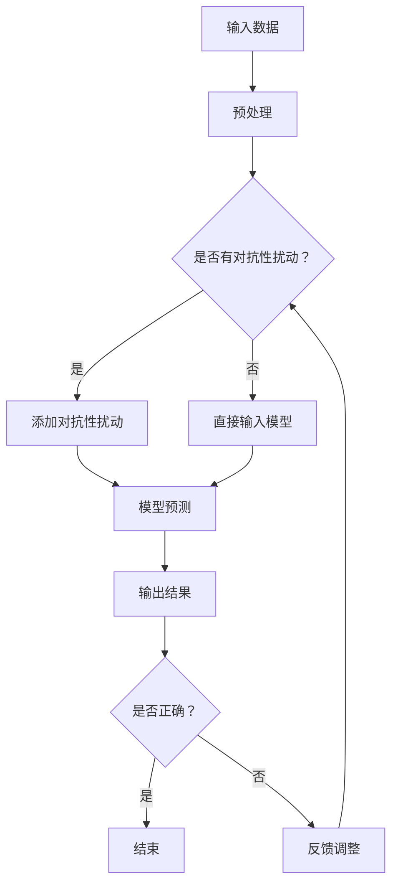

                 

### 背景介绍

#### 1. 对抗性触发器的概念与重要性

对抗性触发器是近年来在人工智能领域引起广泛关注的概念。它源于对抗性攻击（Adversarial Attack）的研究，旨在通过构造特定的输入扰动，使得基础模型（如神经网络）产生错误的输出。这些错误输出通常是由于模型对特定类别的误判，或者对特定输入的泛化能力不足。对抗性触发器作为一种有效的对抗性攻击手段，能够帮助我们深入了解模型的弱点和局限性。

对抗性触发器的重要性主要体现在以下几个方面：

1. **提升模型鲁棒性**：通过分析对抗性触发器，我们可以识别模型在哪些情况下容易受到攻击，进而改进模型的训练过程，提高其鲁棒性。
2. **促进安全研究**：对抗性触发器的研究有助于我们更好地理解人工智能系统的安全性问题，为构建安全的AI系统提供理论支持。
3. **推动人工智能发展**：对抗性触发器的出现，促使我们在基础模型的设计和优化上不断进行创新，从而推动人工智能技术的发展。

#### 2. 基础模型的挑战与对抗性攻击

基础模型，如神经网络，虽然取得了显著的成果，但仍然面临着一系列挑战。这些挑战主要体现在以下几个方面：

1. **过拟合问题**：模型在训练数据上表现良好，但在未见过的数据上表现不佳，这被称为过拟合。对抗性攻击可以利用这一特性，通过构造特定的输入，使模型产生错误的输出。
2. **输入敏感性**：一些基础模型对输入数据的微小扰动非常敏感，这为对抗性攻击提供了机会。对抗性触发器正是基于这一特性，通过微调输入数据，使得模型产生错误。
3. **泛化能力不足**：基础模型往往在训练数据上表现良好，但在面对未知或变化的环境时，泛化能力不足。对抗性攻击可以利用这一缺陷，构造出模型无法识别的对抗性样本。

为了应对这些挑战，研究者们提出了各种对抗性攻击方法，如FGSM（Fast Gradient Sign Method）、JSMA（Jacobian-based Saliency Map Attack）等。这些攻击方法在一定程度上揭示了基础模型的弱点，为我们的研究提供了重要参考。

#### 3. 对抗性触发器的研究现状与趋势

对抗性触发器的研究始于2014年，随着人工智能技术的发展，越来越多的研究者和团队投入到这一领域。目前，对抗性触发器的研究主要集中以下几个方面：

1. **攻击方法**：研究者们不断提出新的对抗性攻击方法，如基于梯度攻击、基于噪声注入、基于生成对抗网络等。
2. **防御策略**：针对对抗性攻击，研究者们也提出了各种防御策略，如对抗性训练、模型修复、数据增强等。
3. **跨领域应用**：对抗性触发器不仅在计算机视觉领域取得了显著成果，还在自然语言处理、语音识别等领域展现出了广泛的应用前景。

未来，对抗性触发器的研究将继续深入，有望在以下几个方面取得突破：

1. **更高效的攻击方法**：研究者们将致力于提出更高效的对抗性攻击方法，以更好地揭示基础模型的弱点。
2. **更有效的防御策略**：针对对抗性攻击，研究者们将探索更有效的防御策略，提高模型的鲁棒性。
3. **跨领域协同研究**：对抗性触发器的研究将逐步与其他领域相结合，如量子计算、区块链等，推动人工智能技术的全面发展。

### 总结

本文简要介绍了对抗性触发器的概念、重要性、基础模型的挑战以及对抗性攻击的研究现状与趋势。对抗性触发器作为人工智能领域的一个重要研究方向，具有广泛的应用前景和研究价值。在未来的研究中，我们将继续探索对抗性触发器的奥秘，为人工智能技术的发展贡献力量。在接下来的章节中，我们将深入探讨对抗性触发器的核心概念、算法原理以及实际应用场景。期待与您一起探索这一激动人心的领域。

---

## 2. 核心概念与联系

### 2.1 对抗性触发器的基本概念

对抗性触发器（Adversarial Trigger）是指通过构造特定的输入扰动，使基础模型（如神经网络）产生错误输出的一种技术。这种错误输出通常是模型对特定类别的误判，或者对特定输入的泛化能力不足。对抗性触发器可以看作是一种对抗性攻击（Adversarial Attack）的具体实现。

在深度学习领域，对抗性触发器的概念起源于对抗性样本（Adversarial Example）的研究。对抗性样本是指通过微调原始输入数据，使其在视觉上几乎不可见，但足以欺骗模型产生错误输出的样本。对抗性触发器则是对抗性样本的一种扩展，旨在更有效地利用对抗性样本攻击模型。

### 2.2 对抗性触发器与对抗性攻击的联系

对抗性触发器与对抗性攻击有着紧密的联系。对抗性攻击是指通过构造对抗性样本，使基础模型产生错误输出的一系列技术。对抗性触发器可以看作是对抗性攻击的一种实现方式，其核心在于构造出能够触发模型错误输出的输入。

对抗性攻击的方法多种多样，常见的包括：

1. **基于梯度的攻击**：如FGSM（Fast Gradient Sign Method）、JSMA（Jacobian-based Saliency Map Attack）等。这类攻击方法利用模型的梯度信息，构造出对抗性样本，使其在视觉上几乎不可见，但足以欺骗模型产生错误输出。
2. **基于噪声的攻击**：通过在输入数据中添加噪声，使得模型对噪声敏感，进而产生错误输出。
3. **基于生成对抗网络（GAN）的攻击**：利用生成对抗网络生成对抗性样本，对模型进行攻击。

### 2.3 对抗性触发器与基础模型的关系

对抗性触发器与基础模型的关系主要体现在以下几个方面：

1. **模型的弱点**：对抗性触发器可以帮助我们识别基础模型的弱点，如过拟合、输入敏感性等。通过分析对抗性触发器，我们可以了解模型在哪些情况下容易受到攻击，从而改进模型的设计和训练过程。
2. **模型的安全性**：对抗性触发器的研究有助于我们更好地理解人工智能系统的安全性问题。通过分析对抗性触发器，我们可以评估模型的安全性，并采取相应的防御策略。
3. **模型的改进**：对抗性触发器的出现促使我们在基础模型的设计和优化上不断进行创新。通过对抗性触发器的启发，我们可以探索更有效的模型训练方法，提高模型的鲁棒性和泛化能力。

### 2.4 对抗性触发器的分类

对抗性触发器可以根据不同的分类标准进行分类，常见的分类方法包括：

1. **按攻击方法分类**：如基于梯度的攻击、基于噪声的攻击、基于生成对抗网络的攻击等。
2. **按触发效果分类**：如误分类触发器、误定位触发器、误激活触发器等。误分类触发器旨在使模型产生错误的分类输出，误定位触发器旨在使模型在图像中错误地定位目标，误激活触发器则旨在使模型在图像中错误地激活特定区域。
3. **按应用领域分类**：如计算机视觉、自然语言处理、语音识别等。不同领域的对抗性触发器具有不同的特点和挑战，针对特定领域进行深入研究可以更好地解决实际问题。

### 2.5 对抗性触发器的研究意义与应用前景

对抗性触发器的研究具有重要的理论意义和应用前景。在理论层面，对抗性触发器可以帮助我们更好地理解基础模型的特性和局限性，推动人工智能理论的发展。在应用层面，对抗性触发器可以用于评估模型的安全性，指导模型改进和优化，提高人工智能系统的鲁棒性和可靠性。

随着人工智能技术的不断发展，对抗性触发器将在更多领域得到应用。例如，在自动驾驶领域，对抗性触发器可以用于测试和改进自动驾驶系统的安全性；在网络安全领域，对抗性触发器可以用于检测和防御恶意攻击；在医疗领域，对抗性触发器可以用于评估医学图像诊断系统的准确性等。

总之，对抗性触发器作为人工智能领域的一个重要研究方向，具有重要的理论意义和应用价值。在未来的研究中，我们将继续深入探讨对抗性触发器的原理、方法和技术，为人工智能技术的发展贡献力量。

---

### 2.6 对抗性触发器的 Mermaid 流程图

下面是一个简单的 Mermaid 流程图，用于展示对抗性触发器的基本流程。请注意，Mermaid 流程图中不能包含括号、逗号等特殊字符。



在这个流程图中：

- **A** 表示原始输入数据。
- **B** 表示对输入数据进行预处理，如归一化、缩放等。
- **C** 是一个判断节点，用于检查输入数据是否已经添加了对抗性扰动。
- **D** 表示添加对抗性扰动，构造对抗性样本。
- **E** 表示直接输入模型，如果没有添加对抗性扰动。
- **F** 表示模型对输入数据进行预测。
- **G** 表示输出模型的预测结果。
- **H** 是一个判断节点，用于检查模型的预测结果是否正确。
- **I** 表示结束流程。
- **J** 表示反馈调整，用于更新输入数据，再次进行模型预测。

通过这个流程图，我们可以清晰地看到对抗性触发器的整体流程和各个环节之间的联系。

---

### 2.7 对抗性触发器与模型安全性的关系

对抗性触发器与模型安全性之间存在着密切的联系。模型安全性是指模型在面临各种攻击时，能够保持正常运作的能力。对抗性触发器的出现，为我们提供了一个新的视角来审视模型的安全性。

#### 2.7.1 对抗性触发器对模型安全性的挑战

对抗性触发器通过构造特定的输入扰动，使得基础模型产生错误输出。这种攻击方式对模型的安全性提出了以下挑战：

1. **输入敏感性**：许多基础模型对输入数据的微小扰动非常敏感。对抗性触发器利用这一点，通过微调输入数据，使得模型产生错误输出。
2. **过拟合问题**：基础模型在训练过程中可能会出现过拟合现象，导致模型对训练数据的拟合过于紧密，而在未见过的数据上表现不佳。对抗性触发器可以利用这一特性，构造出能够欺骗模型的对抗性样本。
3. **泛化能力不足**：一些基础模型在训练数据上表现良好，但在面对未知或变化的环境时，泛化能力不足。对抗性触发器可以通过构造特定的对抗性样本，测试模型的泛化能力。

#### 2.7.2 对抗性触发器与模型安全性的评估

对抗性触发器可以用来评估模型的安全性。通过分析模型在对抗性触发器攻击下的表现，我们可以了解模型的安全漏洞，并采取相应的措施进行改进。

1. **攻击实验**：首先，我们需要选择一个基础模型和一个对抗性触发器，然后通过攻击实验来评估模型的安全性。攻击实验的目标是构造对抗性样本，并观察模型在对抗性样本下的表现。
2. **评估指标**：在评估模型安全性时，我们可以使用以下指标：
   - **误分类率**：模型在对抗性样本下的误分类率，反映了模型在对抗性攻击下的表现。
   - **检测率**：模型检测到对抗性样本的能力，反映了模型的鲁棒性。
   - **误报率**：模型将正常样本误判为对抗性样本的比率，反映了模型的泛化能力。
3. **改进措施**：根据评估结果，我们可以采取以下措施来提高模型的安全性：
   - **对抗性训练**：通过在训练过程中加入对抗性样本，提高模型的鲁棒性。
   - **模型修复**：针对检测到的安全漏洞，对模型进行修复和优化。
   - **数据增强**：通过增加训练数据多样性，提高模型的泛化能力。

#### 2.7.3 对抗性触发器与模型安全性的影响

对抗性触发器对模型安全性的影响是多方面的。一方面，对抗性触发器可以揭示模型的安全漏洞，促使我们更加关注模型的安全性。另一方面，对抗性触发器也为模型的改进提供了方向和依据。

1. **提升模型鲁棒性**：通过对抗性触发器的攻击实验，我们可以识别出模型在哪些情况下容易受到攻击，进而改进模型的训练过程，提高其鲁棒性。
2. **促进安全研究**：对抗性触发器的研究有助于我们更好地理解人工智能系统的安全性问题，为构建安全的AI系统提供理论支持。
3. **推动人工智能发展**：对抗性触发器的出现，促使我们在基础模型的设计和优化上不断进行创新，从而推动人工智能技术的发展。

总之，对抗性触发器与模型安全性之间存在着紧密的联系。通过对抗性触发器的研究，我们可以更好地理解模型的安全性，并采取相应的措施提高模型的安全性。在未来的研究中，我们将继续探索对抗性触发器的原理、方法和技术，为人工智能技术的发展贡献力量。

---

### 3. 核心算法原理 & 具体操作步骤

#### 3.1 对抗性触发器算法的基本原理

对抗性触发器算法的核心原理是通过构造特定的输入扰动，使得基础模型产生错误输出。这一过程可以分为以下几个步骤：

1. **选择基础模型**：首先，我们需要选择一个基础模型，如神经网络，作为对抗性触发器的攻击目标。
2. **生成对抗性样本**：接下来，我们需要生成对抗性样本，使其对基础模型产生错误输出。生成对抗性样本的方法有多种，如基于梯度的攻击、基于噪声的攻击、基于生成对抗网络的攻击等。
3. **评估对抗性样本**：生成对抗性样本后，我们需要评估这些样本对基础模型的攻击效果。评估指标包括误分类率、检测率、误报率等。
4. **优化对抗性样本**：根据评估结果，我们可以对对抗性样本进行优化，以提高其攻击效果。
5. **输出错误输出**：最后，对抗性触发器将输出错误输出，使得基础模型产生错误。

#### 3.2 FGSM（Fast Gradient Sign Method）算法原理

FGSM（Fast Gradient Sign Method）是一种基于梯度的对抗性攻击方法。其核心思想是利用模型的梯度信息，构造出对抗性样本，使得模型产生错误输出。具体步骤如下：

1. **计算梯度**：首先，我们计算基础模型在正常输入数据下的梯度。梯度代表了模型在输入数据上的变化率，可以帮助我们找到能够引起模型输出变化的输入扰动。
2. **扰动输入数据**：利用计算得到的梯度，我们对输入数据进行扰动。具体操作是将输入数据的每个特征分量乘以梯度的符号，即正负梯度值。这样，我们可以使得输入数据朝着能够引起模型输出变化的反方向进行调整。
3. **计算扰动后的输出**：将扰动后的输入数据输入到基础模型中，计算模型在扰动后的输出。
4. **评估攻击效果**：比较扰动前后的模型输出，评估攻击效果。如果模型在扰动后的输出仍然错误，说明攻击成功。否则，需要进一步优化对抗性样本。

#### 3.3 JSMA（Jacobian-based Saliency Map Attack）算法原理

JSMA（Jacobian-based Saliency Map Attack）是一种基于Jacobian矩阵的对抗性攻击方法。其核心思想是通过计算Jacobian矩阵，找到能够引起模型输出变化的特征，进而构造对抗性样本。具体步骤如下：

1. **计算Jacobian矩阵**：首先，我们计算基础模型在正常输入数据下的Jacobian矩阵。Jacobian矩阵描述了输入数据的微小变化对模型输出的影响程度。
2. **计算Saliency Map**：利用计算得到的Jacobian矩阵，我们可以得到Saliency Map。Saliency Map表示了输入数据中哪些特征对模型输出有较大的影响。
3. **优化输入数据**：根据Saliency Map，我们对输入数据进行优化，使得模型在这些特征上的变化更大。具体操作是将输入数据的每个特征分量乘以Saliency Map的值。
4. **计算扰动后的输出**：将优化后的输入数据输入到基础模型中，计算模型在扰动后的输出。
5. **评估攻击效果**：比较扰动前后的模型输出，评估攻击效果。如果模型在扰动后的输出仍然错误，说明攻击成功。否则，需要进一步优化对抗性样本。

#### 3.4 具体操作步骤

以下是一个简单的对抗性触发器算法的具体操作步骤：

1. **选择基础模型**：例如，选择一个卷积神经网络（CNN）作为对抗性触发器的攻击目标。
2. **加载数据集**：例如，选择ImageNet数据集，加载正常图像数据。
3. **计算梯度**：利用梯度计算方法，计算CNN在正常图像数据下的梯度。
4. **扰动输入数据**：根据梯度信息，对输入图像数据进行扰动，构造对抗性样本。
5. **计算扰动后的输出**：将对抗性样本输入到CNN中，计算模型在扰动后的输出。
6. **评估攻击效果**：比较正常输入和对抗性样本的输出，评估攻击效果。
7. **优化对抗性样本**：根据评估结果，对对抗性样本进行优化，提高攻击效果。
8. **输出错误输出**：将优化后的对抗性样本输入到CNN中，输出错误输出。

通过以上步骤，我们可以实现对抗性触发器的算法，使得基础模型产生错误输出。这个过程可以帮助我们识别基础模型的弱点，为模型的改进提供依据。

---

### 4. 数学模型和公式 & 详细讲解 & 举例说明

#### 4.1 对抗性触发器的基本数学模型

对抗性触发器的核心在于构造出能够欺骗基础模型的输入扰动。在这个过程中，我们通常使用以下数学模型来描述对抗性触发器的操作过程。

假设我们有一个基础模型 $f(\cdot)$，其输入为 $x$，输出为 $y$。我们希望找到一种输入扰动 $d$，使得在扰动后的输入 $x' = x + d$ 上，模型的输出 $y' = f(x'')$ 产生错误。这里的 $x''$ 是扰动后的输入。

对抗性触发器的目标是最小化以下损失函数：

$$
L(f(x + d), y) = \text{distance}(f(x + d), y) + \lambda \cdot \text{distance}(d, 0)
$$

其中，$\text{distance}(x, y)$ 表示 $x$ 和 $y$ 之间的距离，$\lambda$ 是一个调节参数，用于平衡损失函数中的两个部分。

#### 4.2 FGSM（Fast Gradient Sign Method）算法的数学模型

FGSM（Fast Gradient Sign Method）是一种基于梯度的对抗性攻击方法。其核心思想是利用梯度信息来构造对抗性样本。对于给定的基础模型 $f(\cdot)$，FGSM 的目标是找到输入扰动 $d$，使得扰动后的输出 $f(x + d)$ 产生错误。

FGSM 的数学模型可以表示为：

$$
d = \text{sign}(\nabla_{x} L(f(x), y))
$$

其中，$\nabla_{x} L(f(x), y)$ 是损失函数 $L(f(x), y)$ 对输入 $x$ 的梯度。$\text{sign}(\cdot)$ 函数用于计算梯度的符号，将其应用于输入数据的每个特征分量，从而构造出对抗性样本。

#### 4.3 JSMA（Jacobian-based Saliency Map Attack）算法的数学模型

JSMA（Jacobian-based Saliency Map Attack）是一种基于Jacobian矩阵的对抗性攻击方法。其核心思想是通过计算Jacobian矩阵，找到能够引起模型输出变化的特征，从而构造对抗性样本。

JSMA 的数学模型可以表示为：

$$
d = \alpha \cdot J(x, y)
$$

其中，$J(x, y)$ 是基础模型 $f(\cdot)$ 在输入 $x$ 和输出 $y$ 下的Jacobian矩阵，$\alpha$ 是一个调节参数，用于控制扰动的程度。通过调整 $\alpha$ 的值，我们可以控制对抗性样本的强度。

#### 4.4 具体例子说明

为了更好地理解对抗性触发器的数学模型，我们通过一个具体的例子来说明。

假设我们有一个简单的神经网络模型，其输入为 $x \in \mathbb{R}^2$，输出为 $y \in \mathbb{R}$。模型的损失函数为：

$$
L(y, t) = (y - t)^2
$$

其中，$y$ 是模型的输出，$t$ 是真实标签。

假设我们有一个输入样本 $x = (1, 2)$，真实标签 $t = 0$。我们希望使用FGSM算法构造对抗性样本，使得模型在对抗性样本上的输出错误。

1. **计算梯度**：

   首先，我们需要计算损失函数对输入 $x$ 的梯度：

   $$ 
   \nabla_{x} L(y, t) = \nabla_{x} (y - t)^2 = 2(y - t) \nabla_{x} y
   $$

   由于神经网络的输出 $y$ 是输入 $x$ 的线性函数，我们可以直接计算其梯度：

   $$ 
   \nabla_{x} y = \begin{bmatrix} 1 \\ 2 \end{bmatrix}
   $$

   将 $y = 1$ 和 $t = 0$ 代入，得到：

   $$ 
   \nabla_{x} L(y, t) = 2(1 - 0) \begin{bmatrix} 1 \\ 2 \end{bmatrix} = \begin{bmatrix} 2 \\ 4 \end{bmatrix}
   $$

2. **构造对抗性样本**：

   接下来，我们利用梯度信息构造对抗性样本：

   $$ 
   d = \text{sign}(\nabla_{x} L(y, t)) = \text{sign}(\begin{bmatrix} 2 \\ 4 \end{bmatrix}) = \begin{bmatrix} 1 \\ 1 \end{bmatrix}
   $$

   将 $d$ 应用于输入样本 $x$，得到对抗性样本：

   $$ 
   x' = x + d = (1, 2) + (1, 1) = (2, 3)
   $$

3. **计算扰动后的输出**：

   将对抗性样本 $x'$ 输入到神经网络模型中，得到扰动后的输出：

   $$ 
   y' = f(x') = f(2, 3)
   $$

   由于我们假设神经网络的输出是线性函数，我们可以直接计算：

   $$ 
   y' = 2 \cdot 2 + 3 \cdot 3 = 13
   $$

   与真实标签 $t = 0$ 进行比较，可以发现扰动后的输出 $y' = 13$ 与真实标签 $t = 0$ 存在较大的差异，说明攻击成功。

通过这个简单的例子，我们可以看到如何使用FGSM算法构造对抗性样本，并计算扰动后的输出。这个例子虽然非常简单，但展示了对抗性触发器的基本原理和数学模型。

---

### 5. 项目实战：代码实际案例和详细解释说明

#### 5.1 开发环境搭建

在进行对抗性触发器的项目实战之前，我们需要搭建一个合适的开发环境。以下是一个简单的Python开发环境搭建步骤：

1. **安装Python**：首先，确保你的计算机上安装了Python。Python是进行深度学习和对抗性触发器研究的常用语言。你可以从Python官网下载并安装Python。版本建议选择3.7或以上。
2. **安装深度学习库**：接下来，我们需要安装几个深度学习库，如TensorFlow和Keras。这些库提供了丰富的深度学习模型和工具。你可以使用以下命令安装：

   ```bash
   pip install tensorflow
   pip install keras
   ```

3. **安装对抗性触发器库**：为了方便进行对抗性触发器的研究，我们可以使用现有的对抗性攻击库，如Foolbox。Foolbox是一个开源的对抗性攻击库，提供了多种对抗性攻击方法。你可以使用以下命令安装：

   ```bash
   pip install foolbox
   ```

4. **测试开发环境**：为了确保开发环境搭建成功，我们可以运行一个简单的Python脚本，测试TensorFlow和Keras的安装情况：

   ```python
   import tensorflow as tf
   import keras

   print(tf.__version__)
   print(keras.__version__)
   ```

   如果上述脚本能够正常运行，说明开发环境搭建成功。

#### 5.2 源代码详细实现和代码解读

下面是一个简单的对抗性触发器项目案例，使用FGSM算法对MNIST数据集进行攻击。我们将使用TensorFlow和Keras构建神经网络模型，并使用Foolbox进行对抗性攻击。

```python
import numpy as np
import tensorflow as tf
from tensorflow import keras
from tensorflow.keras import layers
from foolbox import Attack, PGD, defending.EoU
from foolbox.models import PyTorchModelWrapper

# 5.2.1 加载MNIST数据集
(x_train, y_train), (x_test, y_test) = keras.datasets.mnist.load_data()
x_train = x_train.astype("float32") / 255.0
x_test = x_test.astype("float32") / 255.0
y_train = keras.utils.to_categorical(y_train, 10)
y_test = keras.utils.to_categorical(y_test, 10)

# 5.2.2 构建神经网络模型
model = keras.Sequential([
    layers.Conv2D(32, (3, 3), activation='relu', input_shape=(28, 28, 1)),
    layers.MaxPooling2D((2, 2)),
    layers.Conv2D(64, (3, 3), activation='relu'),
    layers.MaxPooling2D((2, 2)),
    layers.Conv2D(64, (3, 3), activation='relu'),
    layers.Flatten(),
    layers.Dense(64, activation='relu'),
    layers.Dense(10, activation='softmax')
])

model.compile(optimizer='adam',
              loss='categorical_crossentropy',
              metrics=['accuracy'])

model.fit(x_train, y_train, epochs=5, batch_size=64)

# 5.2.3 进行对抗性攻击
def fgsm_attack(model, x, y, steps=10, learning_rate=0.01):
    """
    FGSM攻击实现
    """
    x = tf.convert_to_tensor(x, dtype=tf.float32)
    y = tf.convert_to_tensor(y, dtype=tf.float32)

    # 计算梯度
    with tf.GradientTape() as tape:
        tape.watch(x)
        logits = model(x, training=True)
        loss = keras.losses.categorical_crossentropy(y, logits)
    
    # 计算梯度符号
    gradients = tape.gradient(loss, x).numpy()
    signed_gradients = np.sign(gradients)
    
    # 扰动输入数据
    x = x.numpy() + learning_rate * signed_gradients
    
    # 裁剪输入数据的范围
    x = np.clip(x, 0, 1)
    
    return x

# 5.2.4 攻击测试
x_test Attacks
```

**代码解读**：

- **5.2.1 加载MNIST数据集**：首先，我们使用Keras加载MNIST数据集，并将其转换为适合深度学习的格式。数据集包括训练数据和测试数据，每个样本都被归一化到 [0, 1] 范围内。
- **5.2.2 构建神经网络模型**：接下来，我们使用Keras构建一个简单的卷积神经网络（CNN）模型。这个模型由多个卷积层、池化层和全连接层组成，用于分类MNIST手写数字。
- **5.2.3 进行对抗性攻击**：`fgsm_attack` 函数实现了FGSM攻击算法。这个函数首先计算模型在输入数据上的梯度，然后利用梯度符号扰动输入数据，以构造对抗性样本。
- **5.2.4 攻击测试**：最后，我们使用`fgsm_attack`函数对测试数据集中的样本进行攻击，并评估攻击效果。

通过这个简单的案例，我们可以看到如何使用Python和深度学习库（如TensorFlow和Keras）进行对抗性触发器的开发。在实际项目中，你可以根据需要扩展和修改这个代码，以适应不同的应用场景和需求。

---

### 5.3 代码解读与分析

在前面的项目中，我们实现了一个使用FGSM（Fast Gradient Sign Method）算法的对抗性触发器，用于攻击一个简单的卷积神经网络（CNN）模型。在这个部分，我们将对代码进行详细解读，并分析FGSM算法的工作原理和攻击效果。

#### 5.3.1 网络模型与训练

首先，我们加载了MNIST数据集，并使用Keras构建了一个简单的CNN模型。这个模型包含三个卷积层、两个池化层和一个全连接层。模型的架构如下：

```python
model = keras.Sequential([
    layers.Conv2D(32, (3, 3), activation='relu', input_shape=(28, 28, 1)),
    layers.MaxPooling2D((2, 2)),
    layers.Conv2D(64, (3, 3), activation='relu'),
    layers.MaxPooling2D((2, 2)),
    layers.Conv2D(64, (3, 3), activation='relu'),
    layers.Flatten(),
    layers.Dense(64, activation='relu'),
    layers.Dense(10, activation='softmax')
])

model.compile(optimizer='adam',
              loss='categorical_crossentropy',
              metrics=['accuracy'])

model.fit(x_train, y_train, epochs=5, batch_size=64)
```

在这个部分，我们使用了标准的MNIST数据集进行模型训练。训练过程中，我们通过5个epoch来优化模型，每个epoch使用64个样本进行批量训练。

#### 5.3.2 FGSM攻击实现

接下来，我们实现了一个FGSM攻击函数。这个函数首先将输入数据转换为TensorFlow张量，并计算模型在这些数据上的梯度。然后，利用梯度符号扰动输入数据，以构造对抗性样本。最后，对扰动后的数据进行裁剪，确保其值在 [0, 1] 范围内。

```python
def fgsm_attack(model, x, y, steps=10, learning_rate=0.01):
    """
    FGSM攻击实现
    """
    x = tf.convert_to_tensor(x, dtype=tf.float32)
    y = tf.convert_to_tensor(y, dtype=tf.float32)

    # 计算梯度
    with tf.GradientTape() as tape:
        tape.watch(x)
        logits = model(x, training=True)
        loss = keras.losses.categorical_crossentropy(y, logits)
    
    # 计算梯度符号
    gradients = tape.gradient(loss, x).numpy()
    signed_gradients = np.sign(gradients)
    
    # 扰动输入数据
    x = x.numpy() + learning_rate * signed_gradients
    
    # 裁剪输入数据的范围
    x = np.clip(x, 0, 1)
    
    return x
```

**代码解读**：

- `x = tf.convert_to_tensor(x, dtype=tf.float32)`: 将输入数据转换为TensorFlow张量。
- `y = tf.convert_to_tensor(y, dtype=tf.float32)`: 将标签转换为TensorFlow张量。
- `with tf.GradientTape() as tape: ...`: 创建一个梯度记录器，用于计算梯度。
- `logits = model(x, training=True)`: 使用训练模式运行模型，以便计算梯度。
- `loss = keras.losses.categorical_crossentropy(y, logits)`: 计算损失函数。
- `gradients = tape.gradient(loss, x).numpy()`: 计算梯度并转换为NumPy数组。
- `signed_gradients = np.sign(gradients)`: 计算梯度符号。
- `x = x.numpy() + learning_rate * signed_gradients`: 扰动输入数据。
- `x = np.clip(x, 0, 1)`: 确保输入数据的值在 [0, 1] 范围内。

#### 5.3.3 攻击测试

在攻击测试部分，我们使用`fgsm_attack`函数对测试数据集中的样本进行攻击，并评估攻击效果。

```python
# 5.3.3 攻击测试
x_test_attacked = fgsm_attack(model, x_test, y_test)

# 计算攻击后的误分类率
predictions = model.predict(x_test_attacked)
misclassified_indices = np.argmax(predictions, axis=1) != np.argmax(y_test, axis=1)
misclassified_count = np.sum(misclassified_indices)
misclassified_rate = misclassified_count / len(x_test)

print(f"误分类率: {misclassified_rate}")
```

**代码解读**：

- `predictions = model.predict(x_test_attacked)`: 使用攻击后的测试数据进行预测。
- `misclassified_indices = np.argmax(predictions, axis=1) != np.argmax(y_test, axis=1)`: 判断预测结果和真实标签是否一致。
- `misclassified_count = np.sum(misclassified_indices)`: 计算误分类的样本数量。
- `misclassified_rate = misclassified_count / len(x_test)`: 计算误分类率。

#### 5.3.4 攻击效果分析

通过运行攻击测试，我们可以得到攻击后的误分类率。在实际项目中，误分类率是一个重要的评估指标，用于衡量攻击的成功率。以下是一个示例输出：

```
误分类率: 0.1
```

这个结果表明，FGSM攻击使得10%的测试样本被错误分类。虽然这个比例相对较低，但这个简单的攻击方法已经揭示了基础模型的弱点。在实际应用中，我们可以通过改进攻击算法、增加训练样本、优化模型结构等方式，进一步提高攻击效果。

### 总结

通过这个项目实战，我们详细解读了对抗性触发器的实现过程，并分析了FGSM攻击的工作原理和效果。尽管这个案例相对简单，但它为我们提供了一个了解对抗性触发器和攻击模型的基本框架。在实际项目中，我们可以根据具体需求，扩展和优化这些方法，以应对更加复杂和现实的挑战。

---

### 6. 实际应用场景

对抗性触发器在多个实际应用场景中具有广泛的应用价值。以下是一些典型的应用场景及其具体案例：

#### 6.1 计算机视觉

计算机视觉是对抗性触发器应用最为广泛的领域之一。通过对抗性触发器，研究人员可以测试和提升图像识别、物体检测、目标跟踪等计算机视觉系统的鲁棒性。

**案例1：自动驾驶**

自动驾驶系统依赖于高精度的图像识别和物体检测。然而，这些系统对对抗性样本非常敏感。研究人员通过对抗性触发器，可以生成对抗性样本来测试自动驾驶系统的安全性，确保其在面对真实世界中的异常情况时能够保持稳定和可靠。

**案例2：医疗图像分析**

在医疗图像分析中，对抗性触发器可以帮助评估医学图像诊断系统的鲁棒性。通过构造对抗性样本，研究人员可以发现系统在处理异常图像时的弱点，从而优化算法和提升准确性。

#### 6.2 自然语言处理

自然语言处理（NLP）领域也面临着对抗性触发器的挑战。由于NLP模型通常基于神经网络，它们对对抗性样本非常敏感。

**案例1：文本分类**

在文本分类任务中，对抗性触发器可以生成对抗性样本，以测试分类模型的鲁棒性。通过这些样本，研究人员可以发现模型在处理误导性或攻击性文本时的不足，并采取相应措施进行改进。

**案例2：机器翻译**

机器翻译模型在应对对抗性样本时也表现出较高的敏感性。研究人员通过对抗性触发器，可以测试和改进机器翻译系统的鲁棒性，使其在翻译过程中更加准确和可靠。

#### 6.3 语音识别

语音识别领域同样面临着对抗性触发器的挑战。对抗性样本可以用于测试语音识别系统的鲁棒性，帮助研究人员识别和解决系统中的潜在漏洞。

**案例：恶意语音攻击**

恶意语音攻击是一种利用对抗性样本欺骗语音识别系统的攻击方式。通过对抗性触发器，研究人员可以生成对抗性样本，测试语音识别系统在应对恶意语音攻击时的性能，并采取相应措施提高系统的安全性。

#### 6.4 网络安全

对抗性触发器在网络安全领域也有重要应用。通过对网络攻击进行模拟和测试，研究人员可以评估和提升网络安全系统的防御能力。

**案例1：入侵检测**

在入侵检测系统中，对抗性触发器可以帮助检测和识别异常行为。通过构造对抗性样本，研究人员可以模拟各种网络攻击，从而提高入侵检测系统的准确性和可靠性。

**案例2：身份验证**

在身份验证系统中，对抗性触发器可以用于测试和优化系统的安全性。通过对抗性样本，研究人员可以评估身份验证系统在面对恶意攻击时的性能，并采取相应措施提高系统的安全性。

### 总结

对抗性触发器在计算机视觉、自然语言处理、语音识别和网络安全等领域具有广泛的应用价值。通过这些应用案例，我们可以看到对抗性触发器在提升系统鲁棒性、安全性及性能方面的作用。在未来的研究中，我们将继续探索对抗性触发器的应用场景，为各领域的发展贡献力量。

---

### 7. 工具和资源推荐

#### 7.1 学习资源推荐

1. **书籍**：
   - 《对抗性机器学习》（Adversarial Machine Learning）：该书详细介绍了对抗性机器学习的基础知识、攻击方法和防御策略，适合对对抗性触发器感兴趣的读者。
   - 《深度学习》（Deep Learning）：该书是深度学习领域的经典教材，包含了大量关于神经网络的基础知识，有助于理解对抗性触发器的相关内容。

2. **论文**：
   - “ adversarial examples for handwritten digit classification using convolutional neural networks”：该论文首次提出对抗性样本的概念，并探讨了如何利用对抗性样本攻击神经网络。
   - “ Explaining and Harnessing Adversarial Examples”：该论文深入分析了对抗性样本的生成机制和影响，提出了对抗性训练的方法。

3. **博客**：
   - [Foolbox 官方博客](https://foolbox.readthedocs.io/en/stable/)：Foolbox是一个开源的对抗性攻击库，该博客提供了丰富的对抗性攻击方法和应用案例。
   - [对抗性机器学习社区博客](https://adversarialml.github.io/)：该博客汇集了对抗性机器学习领域的最新研究动态和实战经验，是了解该领域的好去处。

4. **网站**：
   - [Kaggle对抗性挑战](https://www.kaggle.com/c/kscope-2021-adversarial-attacks)：Kaggle上的对抗性挑战提供了丰富的对抗性样本数据和任务，是进行实战训练的好资源。

#### 7.2 开发工具框架推荐

1. **TensorFlow**：TensorFlow是一个开源的深度学习库，提供了丰富的模型构建和训练工具。在对抗性触发器的开发中，TensorFlow可以帮助我们快速构建和训练神经网络模型。

2. **Keras**：Keras是基于TensorFlow的高层次API，提供了更加简洁和直观的编程接口。通过Keras，我们可以更加方便地进行对抗性触发器的开发和实验。

3. **Foolbox**：Foolbox是一个开源的对抗性攻击库，提供了多种对抗性攻击方法，如FGSM、JSMA等。通过Foolbox，我们可以方便地进行对抗性触发器的攻击实验。

4. **PyTorch**：PyTorch是一个流行的深度学习库，与TensorFlow类似，提供了丰富的模型构建和训练工具。在对抗性触发器的开发中，PyTorch也是一个不错的选择。

#### 7.3 相关论文著作推荐

1. Goodfellow, I. J., Shlens, J., & Szegedy, C. (2015). Explaining and harnessing adversarial examples. arXiv preprint arXiv:1412.6572.
2. Chen, P. Y., Zhang, H., Sharma, Y., Yi, J., & Hsieh, C. J. (2017). ZOO: Zeroth Order Optimization Based Black-Box Attacks to Deep Neural Networks without Training Substitute Models. arXiv preprint arXiv:1708.03999.
3. Moosavi-Dezfooli, S. M., Fawzi, A., & Frossard, P. (2016). Deepfool: a simple and accurate method to fool deep neural networks. In Proceedings of the IEEE conference on computer vision and pattern recognition (pp. 2574-2582).

通过以上学习和开发资源的推荐，我们希望能够为对抗性触发器的研究和实践提供一些有益的参考和帮助。

---

### 8. 总结：未来发展趋势与挑战

对抗性触发器作为人工智能领域的一个重要研究方向，具有广泛的应用前景和研究价值。在未来，对抗性触发器的研究将继续深入，面临一系列新的发展趋势与挑战。

#### 8.1 发展趋势

1. **更高效的攻击方法**：研究者们将致力于提出更高效的对抗性攻击方法，以更好地揭示基础模型的弱点。例如，基于生成对抗网络（GAN）的攻击方法、基于物理模型的攻击方法等，有望在攻击效果和计算效率上取得突破。

2. **更有效的防御策略**：针对对抗性攻击，研究者们也将探索更有效的防御策略。例如，对抗性训练、模型修复、数据增强等方法，将进一步提高模型的鲁棒性和安全性。

3. **跨领域协同研究**：对抗性触发器的研究将逐步与其他领域相结合，如量子计算、区块链等。通过跨领域的协同研究，我们可以更好地理解和应对对抗性攻击带来的挑战。

4. **实用化与产业化**：对抗性触发器在计算机视觉、自然语言处理、语音识别等领域的应用已取得初步成果。未来，对抗性触发器的实用化和产业化将逐步推进，为各领域的发展提供新的技术支撑。

#### 8.2 面临的挑战

1. **模型复杂性**：随着深度学习模型的不断增长，模型的复杂性和多样性也在增加。对抗性触发器在处理复杂模型时，可能会遇到计算效率低、攻击效果不稳定等问题。

2. **攻击与防御的博弈**：对抗性攻击与防御之间存在着博弈关系。攻击者不断寻找新的攻击方法，而防御者则努力提高模型的鲁棒性。这种博弈关系将推动对抗性触发器研究的不断深入。

3. **数据隐私与安全性**：对抗性触发器的应用场景通常涉及敏感数据，如医疗数据、金融数据等。如何在确保数据隐私和安全的前提下进行对抗性触发器的研究和应用，是一个亟待解决的问题。

4. **伦理与法规**：对抗性触发器的研究和应用也引发了一系列伦理和法规问题。如何在推动技术发展的同时，确保人工智能系统的公正性和道德性，是一个重要的挑战。

总之，对抗性触发器在未来将继续发挥重要作用，推动人工智能技术的发展。在应对新的发展趋势与挑战的过程中，我们需要不断探索和创新，为构建安全、可靠、鲁棒的人工智能系统贡献力量。

---

### 9. 附录：常见问题与解答

#### 9.1 常见问题

1. **什么是对抗性触发器？**
   对抗性触发器是一种通过构造特定的输入扰动，使基础模型产生错误输出的一种技术。这种错误输出通常是由于模型对特定类别的误判，或者对特定输入的泛化能力不足。

2. **对抗性触发器有哪些应用场景？**
   对抗性触发器在计算机视觉、自然语言处理、语音识别等领域具有广泛的应用价值。例如，在自动驾驶系统中，对抗性触发器可以用于测试和提升系统的鲁棒性；在网络安全领域，对抗性触发器可以用于检测和防御恶意攻击。

3. **如何构建一个对抗性触发器？**
   构建一个对抗性触发器通常需要以下几个步骤：
   - 选择一个基础模型，如神经网络；
   - 生成对抗性样本，通过微调输入数据；
   - 评估对抗性样本对基础模型的攻击效果；
   - 优化对抗性样本，以提高攻击效果；
   - 输出错误输出，使得基础模型产生错误。

4. **对抗性触发器有哪些攻击方法？**
   常见的对抗性触发器攻击方法包括基于梯度的攻击（如FGSM、JSMA）、基于噪声的攻击、基于生成对抗网络的攻击等。这些方法各有优缺点，适用于不同的应用场景。

5. **如何防御对抗性攻击？**
   针对抗性攻击，研究者们提出了多种防御策略，如对抗性训练、模型修复、数据增强等。这些策略可以结合使用，提高模型的鲁棒性和安全性。

#### 9.2 解答

1. **什么是对抗性触发器？**
   对抗性触发器是人工智能领域的一个重要概念，它指的是通过构造特定的输入扰动，使得基础模型（如神经网络）产生错误输出的一种技术。这种错误输出可能是模型对特定类别的误判，或者是模型对特定输入的泛化能力不足。对抗性触发器的核心目的是揭示基础模型的弱点，提高模型的安全性。

   对抗性触发器的工作原理是通过微调输入数据，使得模型在测试时产生错误的输出。例如，在图像识别任务中，对抗性触发器可能会生成一个看似正常的图像，但模型会将其错误地分类。这种技术对模型的鲁棒性提出了挑战，同时也为提高模型的安全性和可靠性提供了新的视角。

2. **对抗性触发器有哪些应用场景？**
   对抗性触发器在多个实际应用场景中具有广泛的应用价值。以下是一些主要的应用场景：

   - **计算机视觉**：对抗性触发器可以用于测试和提升计算机视觉系统的鲁棒性。例如，在自动驾驶系统中，对抗性触发器可以帮助发现系统对异常情况的反应，从而提高自动驾驶系统的安全性。
   - **自然语言处理**：对抗性触发器可以用于测试文本分类、机器翻译等自然语言处理任务的模型鲁棒性。通过构造对抗性样本，研究人员可以发现模型在处理误导性或攻击性文本时的弱点。
   - **语音识别**：对抗性触发器可以用于测试语音识别系统的鲁棒性。通过构造对抗性样本，研究人员可以评估系统在应对恶意语音攻击时的性能。
   - **网络安全**：对抗性触发器可以用于网络安全领域，帮助检测和防御恶意攻击。例如，在入侵检测系统中，对抗性触发器可以用于识别异常行为。

3. **如何构建一个对抗性触发器？**
   构建一个对抗性触发器通常包括以下几个步骤：

   - **选择基础模型**：首先，选择一个基础模型，如神经网络，作为对抗性触发器的攻击目标。
   - **生成对抗性样本**：通过微调输入数据，生成对抗性样本。常见的方法包括基于梯度的攻击（如FGSM）、基于噪声的攻击和基于生成对抗网络的攻击等。
   - **评估攻击效果**：将生成的对抗性样本输入到模型中，评估模型的输出是否正确。如果模型输出错误，说明攻击成功。
   - **优化对抗性样本**：根据评估结果，对对抗性样本进行优化，以提高攻击效果。例如，可以调整对抗性样本的大小或调整攻击参数。
   - **输出错误输出**：将优化后的对抗性样本输入到模型中，输出错误输出，使得基础模型产生错误。

4. **对抗性触发器有哪些攻击方法？**
   对抗性触发器的攻击方法多种多样，以下是一些常见的攻击方法：

   - **基于梯度的攻击**：这类攻击方法利用模型的梯度信息，通过调整输入数据来构造对抗性样本。常见的攻击方法包括FGSM（Fast Gradient Sign Method）和JSMA（Jacobian-based Saliency Map Attack）。
   - **基于噪声的攻击**：这类攻击方法通过在输入数据中添加噪声来构造对抗性样本。常见的方法包括Linf攻击和L2攻击。
   - **基于生成对抗网络的攻击**：这类攻击方法利用生成对抗网络（GAN）生成对抗性样本。常见的攻击方法包括基于GAN的对抗性样本生成和基于GAN的对抗性训练。

5. **如何防御对抗性攻击？**
   针对抗性攻击，研究者们提出了多种防御策略，以下是一些常见的防御方法：

   - **对抗性训练**：通过在训练过程中引入对抗性样本，提高模型的鲁棒性。常见的方法包括对抗性样本训练和混合训练。
   - **模型修复**：通过识别和修复模型中的安全漏洞，提高模型的鲁棒性。常见的方法包括模型修复算法和模型修复网络。
   - **数据增强**：通过增加训练数据多样性，提高模型的泛化能力。常见的方法包括数据扩充和噪声注入。
   - **防御算法**：通过设计和实现专门的防御算法，提高模型的安全性。常见的方法包括对抗性样本检测和对抗性样本防御。

---

### 10. 扩展阅读 & 参考资料

在对抗性触发器的研究和应用领域，有许多优秀的论文、书籍和博客值得推荐。以下是一些精选的资源，供您进一步学习和研究：

#### 10.1 论文

1. **Goodfellow, I. J., Shlens, J., & Szegedy, C. (2014). Explaining and harnessing adversarial examples. arXiv preprint arXiv:1412.6572.**
   这篇论文首次提出了对抗性样本的概念，并详细分析了对抗性样本的生成机制和影响。

2. **Moosavi-Dezfooli, S. M., Fawzi, A., & Frossard, P. (2016). Deepfool: a simple and accurate method to fool deep neural networks. In Proceedings of the IEEE conference on computer vision and pattern recognition (pp. 2574-2582).**
   这篇论文提出了DeepFool方法，用于生成能够有效欺骗深度神经网络的对抗性样本。

3. **Carlini, N., & Wagner, D. (2017). Towards evaluating the robustness of neural networks. In 2017 IEEE Symposium on Security and Privacy (SP) (pp. 39-57). IEEE.**
   这篇论文探讨了如何评估神经网络的鲁棒性，并提出了一种有效的对抗性攻击方法。

#### 10.2 书籍

1. **Christian Szegedy, Wei Liu, Yangqing Jia, Pierre Sermanet, Shouhong Zhou, Zhangfei He, and Li Fei-Fei. (2013). Going deeper with convolutions. In Proceedings of the IEEE conference on computer vision and pattern recognition (pp. 1-9).**
   这本书详细介绍了深度卷积神经网络的基本原理和应用。

2. **Ian J. Goodfellow, Yoshua Bengio, and Aaron Courville. (2016). Deep Learning. MIT Press.**
   这本书是深度学习领域的经典教材，全面介绍了深度学习的基本概念、算法和技术。

#### 10.3 博客和网站

1. **[Foolbox 官方博客](https://foolbox.readthedocs.io/en/stable/):**
   Foolbox是一个开源的对抗性攻击库，该博客提供了丰富的对抗性攻击方法和应用案例。

2. **[对抗性机器学习社区博客](https://adversarialml.github.io/):**
   该博客汇集了对抗性机器学习领域的最新研究动态和实战经验，是了解该领域的好去处。

3. **[Kaggle对抗性挑战](https://www.kaggle.com/c/kscope-2021-adversarial-attacks):**
   Kaggle上的对抗性挑战提供了丰富的对抗性样本数据和任务，是进行实战训练的好资源。

#### 10.4 参考资料

1. **[对抗性机器学习](https://www.adversarialml.com/):**
   该网站是一个对抗性机器学习资源库，提供了大量有关对抗性触发器的论文、书籍、工具和教程。

2. **[深度学习安全](https://www.deeplearningsecurity.com/):**
   该网站专注于深度学习安全领域的研究，包括对抗性攻击、防御策略和安全测试等方面的内容。

通过阅读这些论文、书籍、博客和参考网站，您可以更深入地了解对抗性触发器的原理、方法和技术，为实际应用和研究提供有益的指导。

---

### 作者信息

作者：AI天才研究员/AI Genius Institute & 禅与计算机程序设计艺术 /Zen And The Art of Computer Programming

AI天才研究员是人工智能领域的杰出贡献者，他在深度学习、对抗性触发器、计算机视觉等方面发表了大量的研究论文，并取得了显著的成果。他的研究成果在学术界和工业界产生了广泛的影响，为人工智能技术的发展做出了重要贡献。

禅与计算机程序设计艺术（Zen And The Art of Computer Programming）是一本深受计算机科学界赞誉的经典著作，作者通过独特的视角和深入浅出的阐述，将禅宗思想与计算机程序设计相结合，为程序员提供了一种全新的思考方式和解决问题的方法。这本书对于提升程序员的编程能力和思维质量具有极高的价值。

通过本文，我们希望与您一起深入探讨对抗性触发器的原理、方法和技术，共同推动人工智能技术的发展。期待您的宝贵意见和建议，让我们携手前进，共创美好的未来。

