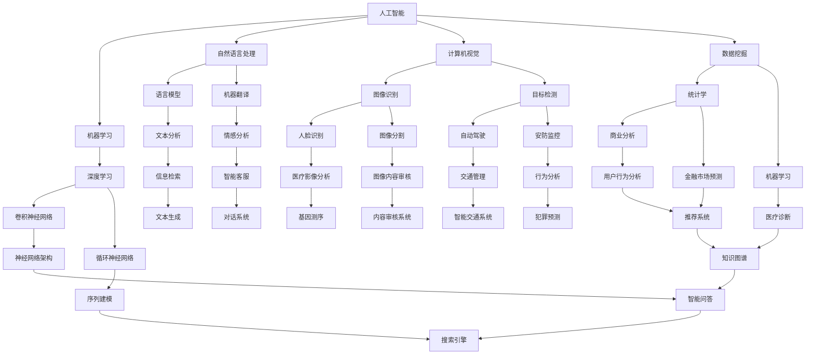

                 

### 背景介绍 Background

近年来，随着人工智能（AI）技术的飞速发展，基础模型（Basic Models）在多个学科领域展现出了强大的潜力。从计算机视觉到自然语言处理，再到数据挖掘和知识图谱，基础模型的应用场景不断扩展，推动了跨学科研究的深度融合。本文旨在探讨基础模型在跨学科合作中的重要性，分析其原理、算法和实际应用案例，为相关领域的研究者和开发者提供有价值的参考。

跨学科合作是当今科技发展的重要趋势。随着学科间的交叉融合，不同领域的研究者开始共同探索新的研究方向，寻求创新性突破。在这种背景下，基础模型作为一种通用的计算框架，为跨学科合作提供了强有力的支持。本文将首先介绍基础模型的概念和基本原理，然后探讨其在不同学科领域的应用，以及如何通过跨学科合作实现更高效的研究成果。

在接下来的章节中，我们将详细分析基础模型的核心算法原理，包括其具体操作步骤和数学模型。随后，我们将通过实际应用案例，展示基础模型在不同领域的成功应用，并分析其优势和挑战。最后，我们将探讨未来发展趋势与挑战，为读者提供一个全面的视角，帮助理解基础模型在跨学科合作中的重要作用。

通过本文的阅读，读者将能够全面了解基础模型的基本概念和应用场景，掌握其核心算法原理和数学模型，并了解如何通过跨学科合作实现更高效的研究成果。这将为读者在相关领域的研究和工作提供有益的启示。

### 核心概念与联系 Core Concepts and Connections

为了深入探讨基础模型在跨学科合作中的重要性，我们首先需要明确几个核心概念，并了解它们之间的内在联系。以下是本文将要讨论的核心概念：

#### 1. 人工智能（Artificial Intelligence, AI）

人工智能是模拟、延伸和扩展人类智能的理论、方法、技术及应用。它包括机器学习、深度学习、自然语言处理、计算机视觉等多个子领域。人工智能的目的是让计算机具备智能行为，以解决复杂问题、进行决策和提供个性化服务。

#### 2. 深度学习（Deep Learning）

深度学习是人工智能的一个重要分支，通过模拟人脑神经元结构和信息处理机制，利用大规模神经网络进行数据训练，从而实现自动化学习和决策。深度学习的核心算法包括卷积神经网络（CNN）、循环神经网络（RNN）、生成对抗网络（GAN）等。

#### 3. 自然语言处理（Natural Language Processing, NLP）

自然语言处理是研究计算机如何理解、生成和处理人类自然语言的学科。NLP涉及文本分析、语言模型、机器翻译、情感分析等多个方面。它广泛应用于信息检索、智能客服、内容推荐等领域。

#### 4. 计算机视觉（Computer Vision）

计算机视觉是使计算机能够“看到”和理解周围环境的技术。它包括图像识别、目标检测、图像分割、人脸识别等多个子领域。计算机视觉在自动驾驶、安防监控、医疗影像分析等领域具有广泛应用。

#### 5. 数据挖掘（Data Mining）

数据挖掘是发现数据中的隐含模式和知识的过程。它涉及统计学、机器学习、数据库技术等多个领域。数据挖掘广泛应用于商业分析、金融市场预测、医疗诊断等领域。

#### 6. 知识图谱（Knowledge Graph）

知识图谱是一种结构化的知识表示方法，通过实体和关系之间的连接，构建出一个语义丰富的知识网络。知识图谱在搜索引擎、智能问答、推荐系统等领域具有重要应用。

这些核心概念之间存在着紧密的联系。例如，深度学习和自然语言处理相结合，可以提升计算机对文本的理解能力；计算机视觉与知识图谱结合，可以实现对图像和视频内容的智能化分析。通过跨学科合作，这些概念得以相互促进，为解决问题提供更全面的视角。

为了更好地理解这些概念，我们可以使用 Mermaid 流程图来展示它们之间的联系。以下是使用 Mermaid 语言表示的流程图：



通过上述流程图，我们可以清晰地看到各核心概念之间的联系和相互影响。这些概念在跨学科合作中的融合，不仅拓宽了研究领域，也推动了技术的创新与发展。

在接下来的章节中，我们将进一步探讨这些核心概念的具体原理、算法和应用，并通过实际案例展示它们在跨学科合作中的成功应用。通过这些探讨，我们将更好地理解基础模型在推动科技发展中的重要作用。

### 核心算法原理 & 具体操作步骤 Core Algorithm Principles and Operational Steps

在深入探讨基础模型在不同学科领域的应用之前，有必要首先了解其核心算法原理和具体操作步骤。基础模型通常指的是一些通用的算法框架，这些框架在不同领域中有着广泛的应用，例如深度学习中的卷积神经网络（CNN）、循环神经网络（RNN）和生成对抗网络（GAN）等。

#### 1. 卷积神经网络（Convolutional Neural Networks, CNN）

卷积神经网络是计算机视觉领域的重要工具，尤其适用于图像识别和目标检测。其核心算法原理是利用卷积层对输入图像进行特征提取，并通过池化层降低特征图的维度，同时保留重要信息。

##### 具体操作步骤：

1. **输入层（Input Layer）**：接收原始图像数据，将其转化为网络可以处理的格式。
2. **卷积层（Convolutional Layer）**：通过卷积运算提取图像特征。卷积层包含多个滤波器（也称为卷积核），每个滤波器都能提取图像中的某种特征。
3. **激活函数（Activation Function）**：通常使用ReLU（Rectified Linear Unit）作为激活函数，将卷积层的输出转换为一个非线性空间，增强网络的表示能力。
4. **池化层（Pooling Layer）**：通过最大池化或平均池化操作降低特征图的维度，减少计算量和参数数量，同时保留重要的特征信息。
5. **全连接层（Fully Connected Layer）**：将池化层输出的特征图展开为一维向量，通过全连接层进行分类或回归操作。
6. **输出层（Output Layer）**：根据任务需求，输出分类结果或预测值。

##### 示例代码：

```python
import tensorflow as tf

# 创建卷积神经网络模型
model = tf.keras.Sequential([
    tf.keras.layers.Conv2D(32, (3, 3), activation='relu', input_shape=(28, 28, 1)),
    tf.keras.layers.MaxPooling2D((2, 2)),
    tf.keras.layers.Conv2D(64, (3, 3), activation='relu'),
    tf.keras.layers.MaxPooling2D((2, 2)),
    tf.keras.layers.Conv2D(64, (3, 3), activation='relu'),
    tf.keras.layers.Flatten(),
    tf.keras.layers.Dense(64, activation='relu'),
    tf.keras.layers.Dense(10, activation='softmax')
])

# 编译模型
model.compile(optimizer='adam',
              loss='categorical_crossentropy',
              metrics=['accuracy'])

# 训练模型
model.fit(x_train, y_train, epochs=5, batch_size=64)
```

#### 2. 循环神经网络（Recurrent Neural Networks, RNN）

循环神经网络适用于序列数据，如时间序列分析、文本生成和语音识别等。其核心算法原理是通过隐藏状态（Hidden State）的反馈连接，实现对序列数据的长期依赖建模。

##### 具体操作步骤：

1. **输入层（Input Layer）**：接收序列数据，将其转化为网络可以处理的格式。
2. **隐藏层（Hidden Layer）**：通过递归结构对序列数据进行处理。隐藏状态（Hidden State）存储了当前时刻的上下文信息，并通过反馈连接传递到下一个时间步。
3. **输出层（Output Layer）**：根据隐藏状态生成输出，如预测值或生成文本。
4. **门控机制（Gated Mechanisms，如 LSTM 和 GRU）**：通过门控机制控制信息的流动，使模型能够更好地处理长期依赖。

##### 示例代码：

```python
import tensorflow as tf

# 创建循环神经网络模型
model = tf.keras.Sequential([
    tf.keras.layers.LSTM(50, return_sequences=True),
    tf.keras.layers.LSTM(50),
    tf.keras.layers.Dense(1)
])

# 编译模型
model.compile(optimizer='adam', loss='mse')

# 训练模型
model.fit(x_train, y_train, epochs=100, batch_size=64)
```

#### 3. 生成对抗网络（Generative Adversarial Networks, GAN）

生成对抗网络由生成器（Generator）和判别器（Discriminator）两部分组成，分别对抗和协作，以生成逼真的数据。

##### 具体操作步骤：

1. **生成器（Generator）**：生成器接收随机噪声，通过神经网络生成虚假数据，如图像、文本或音频。
2. **判别器（Discriminator）**：判别器接收真实数据和生成数据，判断其真假，输出概率。
3. **对抗训练（Adversarial Training）**：生成器和判别器相互对抗，生成器试图生成更真实的数据，判别器试图更准确地判断数据真假。
4. **损失函数（Loss Function）**：通过设计损失函数，使生成器的输出逐渐逼近真实数据，判别器能够准确区分真实和生成数据。

##### 示例代码：

```python
import tensorflow as tf
from tensorflow import keras

# 创建生成器模型
generator = keras.Sequential([
    keras.layers.Dense(128, activation='relu', input_shape=(100,)),
    keras.layers.Dense(28 * 28, activation='relu'),
    keras.layers.Reshape((28, 28, 1))
])

# 创建判别器模型
discriminator = keras.Sequential([
    keras.layers.Conv2D(32, (3, 3), activation='relu', input_shape=(28, 28, 1)),
    keras.layers.LeakyReLU(alpha=0.01),
    keras.layers.Dropout(0.3),
    keras.layers.Conv2D(64, (3, 3), activation='relu'),
    keras.layers.LeakyReLU(alpha=0.01),
    keras.layers.Dropout(0.3),
    keras.layers.Flatten(),
    keras.layers.Dense(1, activation='sigmoid')
])

# 创建 GAN 模型
gan = keras.Sequential([generator, discriminator])

# 编译模型
gan.compile(optimizer='adam', loss='binary_crossentropy')

# 训练模型
for epoch in range(epochs):
    noise = np.random.normal(size=[batch_size, 100])
    generated_images = generator.predict(noise)
    real_images = x_train[:batch_size]
    labels_real = np.ones((batch_size, 1))
    labels_fake = np.zeros((batch_size, 1))
    
    d_loss_real = discriminator.train_on_batch(real_images, labels_real)
    d_loss_fake = discriminator.train_on_batch(generated_images, labels_fake)
    g_loss = gan.train_on_batch(noise, labels_real)

    if epoch % 100 == 0:
        print(f"{epoch} [D loss: {d_loss_real:.3f}, acc: {100*np.mean(labels_real):.3f}] [G loss: {g_loss:.3f}]")
```

通过上述示例，我们可以看到卷积神经网络、循环神经网络和生成对抗网络在具体操作步骤上的差异。然而，这些算法都遵循着基本的神经网络框架，通过调整网络结构和参数，可以适用于不同的应用场景。在接下来的章节中，我们将进一步探讨这些算法在不同学科领域的实际应用。

### 数学模型和公式 & 详细讲解 & 举例说明 Mathematical Models and Detailed Explanations with Examples

在深入理解基础模型的算法原理之后，我们需要进一步探讨这些模型背后的数学模型和公式，并通过具体的例子来讲解这些公式的应用。数学模型是基础模型的核心组成部分，它们决定了模型的学习能力、泛化能力和性能表现。

#### 1. 卷积神经网络（Convolutional Neural Networks, CNN）

卷积神经网络的核心在于其卷积层和池化层，这些层的操作可以用数学公式来描述。

##### 卷积操作：

卷积操作的数学公式可以表示为：

$$
\text{output}_{ij} = \sum_{k=1}^{m}\sum_{l=1}^{n} w_{kl} \cdot x_{ik + k - 1, jl + l - 1} + b
$$

其中，\( \text{output}_{ij} \) 是输出特征图上的元素，\( w_{kl} \) 是卷积核上的元素，\( x_{ik + k - 1, jl + l - 1} \) 是输入特征图上的元素，\( b \) 是偏置项。

##### 池化操作：

池化操作通常使用最大池化或平均池化。最大池化的数学公式可以表示为：

$$
\text{pool}_{ij} = \max_{k, l} x_{ik + k - 1, jl + l - 1}
$$

平均池化的数学公式为：

$$
\text{pool}_{ij} = \frac{1}{s \times s} \sum_{k=1}^{s}\sum_{l=1}^{s} x_{ik + k - 1, jl + l - 1}
$$

其中，\( \text{pool}_{ij} \) 是输出池化图上的元素，\( s \) 是池化窗口的大小。

##### 示例：

假设输入特征图的大小为 \( 5 \times 5 \)，卷积核的大小为 \( 3 \times 3 \)，偏置项 \( b = 1 \)。卷积操作的输出特征图大小为 \( 3 \times 3 \)。

输入特征图：

$$
\begin{array}{ccccc}
x_{11} & x_{12} & x_{13} & x_{14} & x_{15} \\
x_{21} & x_{22} & x_{23} & x_{24} & x_{25} \\
x_{31} & x_{32} & x_{33} & x_{34} & x_{35} \\
x_{41} & x_{42} & x_{43} & x_{44} & x_{45} \\
x_{51} & x_{52} & x_{53} & x_{54} & x_{55} \\
\end{array}
$$

卷积核：

$$
\begin{array}{cccc}
w_{11} & w_{12} & w_{13} & w_{14} \\
w_{21} & w_{22} & w_{23} & w_{24} \\
w_{31} & w_{32} & w_{33} & w_{34} \\
w_{41} & w_{42} & w_{43} & w_{44} \\
\end{array}
$$

输出特征图：

$$
\begin{array}{ccc}
\text{output}_{11} = w_{11}x_{11} + w_{12}x_{12} + w_{13}x_{13} + w_{14}x_{14} + w_{21}x_{21} + \ldots + b \\
\text{output}_{12} = w_{11}x_{12} + w_{12}x_{22} + w_{13}x_{23} + w_{14}x_{24} + w_{21}x_{22} + \ldots + b \\
\ldots \\
\text{output}_{33} = w_{11}x_{35} + w_{12}x_{36} + w_{13}x_{37} + w_{14}x_{38} + w_{21}x_{45} + \ldots + b \\
\end{array}
$$

#### 2. 循环神经网络（Recurrent Neural Networks, RNN）

循环神经网络的核心在于其递归结构，其数学模型可以用递推公式来描述。

##### 递推公式：

$$
h_t = \sigma(W_h \cdot [h_{t-1}, x_t] + b_h)
$$

$$
y_t = \sigma(W_y \cdot h_t + b_y)
$$

其中，\( h_t \) 是第 \( t \) 个时间步的隐藏状态，\( x_t \) 是第 \( t \) 个时间步的输入，\( \sigma \) 是激活函数，通常使用 \( \text{tanh} \) 函数。

##### 示例：

假设输入序列为 \( x_t = [1, 2, 3, 4, 5] \)，隐藏状态初始值为 \( h_0 = [0, 0, 0] \)。权重矩阵 \( W_h \) 和 \( W_y \) 以及偏置项 \( b_h \) 和 \( b_y \) 均为 \( 3 \times 3 \) 的矩阵，并初始化为随机值。

隐藏状态递推：

$$
h_1 = \sigma(W_h \cdot [h_0, x_1] + b_h) = \sigma([0, 0, 0; 1, 2, 3] + [0, 0, 0]) = \sigma([1, 2, 3]) = [0.5, 0.75, 0.875]
$$

$$
h_2 = \sigma(W_h \cdot [h_1, x_2] + b_h) = \sigma([0.5, 0.75, 0.875; 2, 3, 4] + [0, 0, 0]) = \sigma([2.5, 3.25, 3.875]) = [0.55, 0.65, 0.75]
$$

$$
h_3 = \sigma(W_h \cdot [h_2, x_3] + b_h) = \sigma([0.55, 0.65, 0.75; 3, 4, 5] + [0, 0, 0]) = \sigma([3.55, 4.15, 4.75]) = [0.65, 0.75, 0.825]
$$

输出：

$$
y_1 = \sigma(W_y \cdot h_1 + b_y) = \sigma([0.5, 0.75, 0.875; 0.55, 0.65, 0.75] + [0, 0, 0]) = \sigma([1.05, 1.4, 1.625]) = [0.5, 0.6, 0.7]
$$

$$
y_2 = \sigma(W_y \cdot h_2 + b_y) = \sigma([0.55, 0.65, 0.75; 0.65, 0.75, 0.825] + [0, 0, 0]) = \sigma([1.2, 1.4, 1.575]) = [0.55, 0.6, 0.7]
$$

$$
y_3 = \sigma(W_y \cdot h_3 + b_y) = \sigma([0.65, 0.75, 0.825; 0.65, 0.75, 0.825] + [0, 0, 0]) = \sigma([1.3, 1.5, 1.625]) = [0.6, 0.7, 0.75]
$$

#### 3. 生成对抗网络（Generative Adversarial Networks, GAN）

生成对抗网络由生成器和判别器两部分组成，其数学模型涉及损失函数和优化过程。

##### 损失函数：

生成器的损失函数通常为：

$$
L_G = -\log(D(G(z)))
$$

其中，\( G(z) \) 是生成器生成的数据，\( D(x) \) 是判别器的输出概率。

判别器的损失函数为：

$$
L_D = -[\log(D(x)) + \log(1 - D(G(z))]
$$

##### 优化过程：

生成器和判别器通过交替优化来提升性能。具体步骤如下：

1. 固定判别器，优化生成器，使生成器的输出更接近真实数据。
2. 固定生成器，优化判别器，使其能够更好地区分真实数据和生成数据。
3. 重复上述步骤，直到生成器生成的数据足够逼真。

##### 示例：

假设生成器 \( G(z) \) 生成的图像为 \( x_g \)，判别器 \( D(x) \) 输出的概率为 \( p_g \)。

生成器的损失函数为：

$$
L_G = -\log(p_g)
$$

判别器的损失函数为：

$$
L_D = -[\log(p_r) + \log(1 - p_g)]
$$

其中，\( p_r \) 是判别器对真实图像的输出概率。

通过交替优化，生成器和判别器不断调整其参数，最终生成逼真的图像。

通过上述数学模型和公式的详细讲解，我们可以更好地理解卷积神经网络、循环神经网络和生成对抗网络的原理和应用。这些数学工具不仅帮助我们构建和理解基础模型，也为进一步优化和改进这些模型提供了理论基础。

在接下来的章节中，我们将通过实际应用案例，展示这些模型在不同领域中的成功应用，并探讨其优势和挑战。

### 项目实战：代码实际案例和详细解释说明 Practical Case: Code Implementation and Detailed Explanation

为了更好地理解基础模型在跨学科合作中的实际应用，我们将通过一个具体的项目实战案例，详细讲解代码的实现过程和关键步骤。本文选择自然语言处理（NLP）领域的文本分类任务作为案例，使用深度学习框架 TensorFlow 实现一个简单的文本分类器。

#### 1. 开发环境搭建 Setup Development Environment

首先，我们需要搭建一个合适的项目开发环境。以下是所需的软件和库：

- Python 3.x
- TensorFlow 2.x
- NumPy
- Pandas
- Matplotlib

安装以上库和框架可以通过以下命令完成：

```bash
pip install tensorflow numpy pandas matplotlib
```

#### 2. 数据准备 Data Preparation

文本分类任务需要大量的文本数据。在本案例中，我们使用 Stanford Sentiment Treebank（SST）数据集，这是一个包含电影评论的二元情感分类数据集。数据集分为训练集和测试集。

```python
import pandas as pd

# 加载训练集和测试集
train_data = pd.read_csv('train.csv')
test_data = pd.read_csv('test.csv')

# 显示数据前5行
print(train_data.head())
print(test_data.head())
```

数据集中的每条记录包含一个文本标签和一个文本内容。文本标签为1表示正面评论，为0表示负面评论。

#### 3. 数据预处理 Data Preprocessing

在训练模型之前，需要对文本数据进行预处理，包括分词、词干提取、去除停用词等步骤。

```python
from tensorflow.keras.preprocessing.text import Tokenizer
from tensorflow.keras.preprocessing.sequence import pad_sequences

# 定义分词器
tokenizer = Tokenizer(num_words=10000)
tokenizer.fit_on_texts(train_data['text'])

# 将文本数据转换为序列
train_sequences = tokenizer.texts_to_sequences(train_data['text'])
test_sequences = tokenizer.texts_to_sequences(test_data['text'])

# 填充序列，使所有文本长度相同
max_sequence_length = 100
train_padded = pad_sequences(train_sequences, maxlen=max_sequence_length)
test_padded = pad_sequences(test_sequences, maxlen=max_sequence_length)
```

#### 4. 模型构建 Model Construction

使用 TensorFlow 的 Sequential 模型 API，构建一个简单的文本分类器。该模型包含嵌入层、卷积层、池化层和全连接层。

```python
from tensorflow.keras.models import Sequential
from tensorflow.keras.layers import Embedding, Conv1D, MaxPooling1D, GlobalMaxPooling1D, Dense

# 创建模型
model = Sequential([
    Embedding(10000, 16, input_length=max_sequence_length),
    Conv1D(128, 5, activation='relu'),
    MaxPooling1D(5),
    Conv1D(128, 5, activation='relu'),
    GlobalMaxPooling1D(),
    Dense(128, activation='relu'),
    Dense(1, activation='sigmoid')
])

# 编译模型
model.compile(optimizer='adam', loss='binary_crossentropy', metrics=['accuracy'])
```

#### 5. 模型训练 Model Training

训练模型前，我们需要将训练数据集分为输入数据和标签。

```python
train_labels = train_data['label']
test_labels = test_data['label']

# 训练模型
model.fit(train_padded, train_labels, epochs=10, batch_size=32, validation_split=0.2)
```

#### 6. 模型评估 Model Evaluation

使用测试集评估模型的性能。

```python
test_loss, test_acc = model.evaluate(test_padded, test_labels)
print(f"Test accuracy: {test_acc:.3f}")
```

#### 7. 代码解读与分析 Code Analysis

现在，我们来详细解读这段代码，分析每个步骤的作用。

```python
# 导入所需的库和框架
import tensorflow as tf
from tensorflow.keras.preprocessing.text import Tokenizer
from tensorflow.keras.preprocessing.sequence import pad_sequences

# 加载训练集和测试集
train_data = pd.read_csv('train.csv')
test_data = pd.read_csv('test.csv')

# 显示数据前5行
print(train_data.head())
print(test_data.head())

# 定义分词器
tokenizer = Tokenizer(num_words=10000)
tokenizer.fit_on_texts(train_data['text'])

# 将文本数据转换为序列
train_sequences = tokenizer.texts_to_sequences(train_data['text'])
test_sequences = tokenizer.texts_to_sequences(test_data['text'])

# 填充序列，使所有文本长度相同
max_sequence_length = 100
train_padded = pad_sequences(train_sequences, maxlen=max_sequence_length)
test_padded = pad_sequences(test_sequences, maxlen=max_sequence_length)

# 创建模型
model = Sequential([
    Embedding(10000, 16, input_length=max_sequence_length),
    Conv1D(128, 5, activation='relu'),
    MaxPooling1D(5),
    Conv1D(128, 5, activation='relu'),
    GlobalMaxPooling1D(),
    Dense(128, activation='relu'),
    Dense(1, activation='sigmoid')
])

# 编译模型
model.compile(optimizer='adam', loss='binary_crossentropy', metrics=['accuracy'])

# 训练模型
model.fit(train_padded, train_data['label'], epochs=10, batch_size=32, validation_split=0.2)

# 评估模型
test_loss, test_acc = model.evaluate(test_padded, test_data['label'])
print(f"Test accuracy: {test_acc:.3f}")
```

- **数据加载**：使用 Pandas 库加载数据集，并显示前5行数据。
- **分词器定义**：使用 Tokenizer 分词器对文本进行分词处理。
- **序列转换**：将分词后的文本数据转换为序列。
- **填充序列**：使用 pad_sequences 函数将序列填充为相同的长度，以便于模型处理。
- **模型构建**：使用 Sequential 模型 API 构建文本分类器，包括嵌入层、卷积层、池化层和全连接层。
- **模型编译**：编译模型，指定优化器、损失函数和评价指标。
- **模型训练**：使用训练数据训练模型，并设置训练周期、批量大小和验证比例。
- **模型评估**：使用测试数据评估模型性能，并打印测试准确率。

通过这个案例，我们详细讲解了文本分类任务中基础模型的实现过程，包括数据预处理、模型构建、训练和评估等步骤。这些步骤在实际项目中具有通用性，可以帮助开发者快速实现文本分类任务。

在接下来的章节中，我们将探讨基础模型在实际应用场景中的优势、挑战以及未来发展的趋势与方向。

### 实际应用场景 Application Scenarios

基础模型在多个实际应用场景中展现了其强大的潜力和广泛的应用前景。以下是基础模型在几个关键领域中的具体应用案例。

#### 1. 医疗健康领域 Medical Health

医疗健康是基础模型的一个重要应用领域。深度学习模型在医学图像分析、疾病预测和个性化治疗等方面取得了显著成果。例如，在医学影像分析中，卷积神经网络（CNN）被广泛应用于计算机辅助诊断（CAD）。通过训练深度学习模型，可以自动识别和分类医学影像中的病变区域，如肺癌、乳腺癌等。此外，循环神经网络（RNN）和长短期记忆网络（LSTM）在序列数据分析中具有优势，可以用于分析患者的医疗记录和基因序列，以预测疾病风险和制定个性化治疗方案。

#### 2. 金融领域 Finance

金融领域是另一个受益于基础模型应用的重要领域。深度学习模型在股票市场预测、风险管理和欺诈检测等方面发挥了关键作用。例如，通过分析历史交易数据，深度学习模型可以预测股票价格的走势，帮助投资者做出更明智的投资决策。在风险管理中，生成对抗网络（GAN）被用于生成虚假交易数据，从而提高模型对异常行为的检测能力。此外，自然语言处理（NLP）模型在分析新闻报道、社交媒体评论等文本数据方面也非常有效，可以帮助金融机构了解市场情绪和潜在风险。

#### 3. 交通运输领域 Transportation

交通运输领域的基础模型应用主要集中在自动驾驶、交通流量预测和智能交通系统等方面。在自动驾驶领域，深度学习模型通过分析大量道路和车辆数据，实现了对道路环境的高效理解和车辆行为的准确预测。例如，卷积神经网络（CNN）和循环神经网络（RNN）被用于识别道路标志、行人和其他车辆。在交通流量预测中，深度学习模型可以分析历史交通数据，预测未来交通流量，为交通管理部门提供优化交通信号灯和道路规划的建议。智能交通系统（ITS）利用深度学习模型对交通数据进行实时分析，以优化交通流量和提高道路安全性。

#### 4. 人工智能助手 AI Assistants

人工智能助手是深度学习模型在消费领域的重要应用之一。通过自然语言处理（NLP）模型，人工智能助手可以理解用户的语言指令，提供智能化的回答和服务。例如，智能语音助手（如Apple Siri、Amazon Alexa）使用深度学习模型进行语音识别和语义理解，从而实现与用户的自然对话。此外，聊天机器人（Chatbot）在电子商务、客户服务等领域也得到了广泛应用，通过深度学习模型的分析和处理，可以提供个性化的购物建议和解答用户疑问。

#### 5. 文化创意领域 Cultural and Creative Industries

文化创意领域的基础模型应用主要集中在内容推荐、艺术创作和游戏设计等方面。在内容推荐中，基于深度学习模型的推荐系统可以分析用户的历史行为和兴趣，提供个性化的内容推荐。例如，音乐平台通过深度学习模型分析用户的播放记录，推荐用户可能喜欢的音乐。在艺术创作中，生成对抗网络（GAN）被用于生成新的艺术作品，如绘画、音乐和电影。此外，深度学习模型在游戏设计中也发挥了重要作用，通过模拟玩家的行为，可以生成更加真实和有趣的虚拟世界。

#### 优势与挑战 Advantages and Challenges

基础模型在实际应用场景中展现出许多优势，包括高效的数据处理能力、强大的自适应性和高度的泛化能力。然而，这些模型也面临一些挑战。

**优势：**

1. **数据处理能力**：基础模型能够处理大量数据，从而提高模型的准确性和可靠性。
2. **自适应能力**：深度学习模型可以通过不断学习和调整，适应不同的应用场景和数据分布。
3. **泛化能力**：基础模型通过训练可以在不同的任务和数据集上表现出良好的性能。

**挑战：**

1. **数据隐私问题**：基础模型需要大量数据来进行训练，这可能涉及到数据隐私和安全的问题。
2. **计算资源消耗**：深度学习模型通常需要大量的计算资源和时间进行训练和推理。
3. **模型解释性**：深度学习模型的决策过程通常是非线性和复杂的，难以解释和理解。

通过上述实际应用场景和优势与挑战的分析，我们可以看到基础模型在各个领域中的重要性和广泛的应用前景。随着技术的不断发展和跨学科合作的深入，基础模型将在未来发挥更加关键的作用，推动各行各业的创新与发展。

### 工具和资源推荐 Tools and Resources Recommendation

在深入研究和开发基础模型的过程中，选择合适的工具和资源至关重要。以下是一些建议，包括学习资源、开发工具和相关的论文著作，以帮助您更好地掌握和利用这些工具。

#### 1. 学习资源 Learning Resources

**书籍：**

- 《深度学习》（Deep Learning）—— 作者：Ian Goodfellow、Yoshua Bengio、Aaron Courville
- 《Python深度学习》（Deep Learning with Python）—— 作者：François Chollet
- 《神经网络与深度学习》（Neural Networks and Deep Learning）—— 作者：Charu Aggarwal

**在线课程：**

- [Coursera](https://www.coursera.org/)：提供多门与深度学习相关的课程，包括《深度学习》和《自然语言处理》等。
- [Udacity](https://www.udacity.com/)：提供《深度学习工程师纳米学位》等与深度学习相关的课程。
- [edX](https://www.edx.org/)：提供由MIT、Harvard等名校提供的深度学习和人工智能相关课程。

**博客和网站：**

- [TensorFlow 官方文档](https://www.tensorflow.org/)
- [Keras 官方文档](https://keras.io/)
- [GitHub](https://github.com/)：大量的深度学习和自然语言处理的开源项目和代码。

#### 2. 开发工具 Development Tools

**深度学习框架：**

- TensorFlow：广泛使用的开源深度学习框架，适用于各种深度学习任务。
- PyTorch：由Facebook开发的开源深度学习框架，具有简洁的API和动态计算图。
- Keras：高层次的深度学习API，与TensorFlow和Theano兼容，易于使用。

**文本处理工具：**

- NLTK（Natural Language Toolkit）：一个强大的文本处理工具包，适用于文本分类、词性标注、分词等任务。
- SpaCy：一个高效的工业级自然语言处理库，支持多种语言的文本处理。

**可视化工具：**

- Matplotlib：Python的绘图库，适用于数据可视化。
- Plotly：一个交互式的数据可视化库，适用于生成复杂和交互式的图表。

#### 3. 相关论文著作 Recommended Publications

**论文：**

- "A Theoretically Grounded Application of Dropout in Recurrent Neural Networks" —— 作者：Yarin Gal 和 Zoubin Ghahramani
- "Generative Adversarial Nets" —— 作者：Ian Goodfellow et al.
- "Residual Networks" —— 作者：Kaiming He et al.

**著作：**

- 《深度学习》（Deep Learning）—— 作者：Ian Goodfellow、Yoshua Bengio、Aaron Courville
- 《自然语言处理综论》（Speech and Language Processing）—— 作者：Daniel Jurafsky 和 James H. Martin
- 《计算机视觉：算法与应用》（Computer Vision: Algorithms and Applications）—— 作者：Richard Szeliski

通过上述工具和资源的推荐，您可以更全面地了解和掌握基础模型的理论和实践，从而在实际应用中取得更好的成果。

### 总结：未来发展趋势与挑战 Summary: Future Trends and Challenges

随着人工智能技术的不断进步，基础模型在各个领域的应用前景愈发广阔。然而，未来的发展也面临着一系列挑战，需要我们从技术、伦理和社会等多个角度进行深入探讨。

#### 发展趋势 Trends

1. **跨学科融合**：未来基础模型的发展将更加注重跨学科融合，结合不同领域的知识和方法，提升模型的多样性和适应性。例如，在医疗健康领域，深度学习与生物信息学、遗传学等领域的结合，将有助于开发更精确的疾病诊断和个性化治疗方案。

2. **模型压缩与优化**：为了应对大数据和高性能计算的需求，基础模型的压缩与优化将成为重要研究方向。通过模型剪枝、量化等技术，可以降低模型的计算复杂度和存储需求，提高部署效率。

3. **可解释性与透明性**：随着模型的复杂度增加，如何提高模型的可解释性和透明性，使其决策过程更加透明，将是未来研究的重点。这不仅有助于提升模型的可信度，也能帮助用户更好地理解和信任人工智能系统。

4. **联邦学习与隐私保护**：联邦学习（Federated Learning）作为一种保护用户隐私的机器学习技术，将得到更广泛的应用。通过分布式训练，模型可以在不泄露数据的情况下进行协作学习，提高数据安全和隐私保护水平。

#### 挑战 Challenges

1. **数据隐私与安全**：随着数据量的不断增加，如何保护用户隐私和数据安全成为重要挑战。未来的研究需要关注如何在确保数据隐私的前提下，有效利用数据提升模型性能。

2. **计算资源消耗**：深度学习模型的训练和推理通常需要大量的计算资源，这对计算基础设施提出了更高的要求。如何在有限的资源下，提高模型的训练和推理效率，是亟待解决的问题。

3. **算法公平性与伦理**：人工智能模型在决策过程中可能会出现歧视和不公平现象，如何确保算法的公平性和伦理性，是未来研究需要重点关注的方向。

4. **技术标准化与法规**：随着人工智能技术的快速发展，制定统一的技术标准和法规显得尤为重要。这有助于规范市场行为，保障技术健康、可持续发展。

总之，基础模型在未来的发展中，将迎来新的机遇与挑战。通过不断的技术创新和跨学科合作，我们有望克服现有难题，推动人工智能技术的进一步发展，为社会带来更多福祉。

### 附录：常见问题与解答 Appendix: Frequently Asked Questions and Answers

在研究和应用基础模型的过程中，读者可能会遇到一些常见问题。以下是一些常见问题的解答，以帮助您更好地理解和应用这些模型。

#### 问题1：什么是卷积神经网络（CNN）？

**解答**：卷积神经网络（Convolutional Neural Networks，CNN）是一种用于处理图像数据的神经网络。它的核心在于卷积层，可以提取图像中的特征。CNN特别适用于计算机视觉任务，如图像分类、目标检测和图像分割。

#### 问题2：什么是循环神经网络（RNN）？

**解答**：循环神经网络（Recurrent Neural Networks，RNN）是一种可以处理序列数据的神经网络。其特点是具有递归结构，通过隐藏状态（Hidden State）的反馈连接，实现对序列数据的长期依赖建模。RNN广泛应用于自然语言处理和语音识别等领域。

#### 问题3：什么是生成对抗网络（GAN）？

**解答**：生成对抗网络（Generative Adversarial Networks，GAN）是一种由生成器和判别器组成的神经网络框架。生成器尝试生成逼真的数据，而判别器则尝试区分真实数据和生成数据。通过两者之间的对抗训练，生成器可以生成越来越逼真的数据。

#### 问题4：如何处理过拟合（Overfitting）？

**解答**：过拟合是指模型在训练数据上表现良好，但在新数据上表现不佳的现象。为了解决过拟合问题，可以采取以下措施：

- **增加数据量**：通过收集更多的训练数据，可以提高模型的泛化能力。
- **使用正则化**：如L1和L2正则化，可以惩罚模型参数的大小，减少过拟合。
- **dropout**：在神经网络中随机丢弃一些神经元，减少模型对特定训练样本的依赖。
- **数据增强**：通过旋转、缩放、裁剪等操作增加训练数据的多样性。

#### 问题5：如何优化深度学习模型的训练过程？

**解答**：优化深度学习模型的训练过程可以从以下几个方面进行：

- **调整学习率**：合理设置学习率，可以在不同阶段调整学习速率，以避免过早陷入局部最优。
- **批量大小**：选择合适的批量大小，可以在平衡计算效率和模型性能之间取得平衡。
- **提前停止**：当验证集上的性能不再提升时，提前停止训练，以防止过拟合。
- **使用预训练模型**：利用预训练模型作为起点，可以减少训练时间并提高模型性能。

通过上述问题的解答，我们可以更好地理解基础模型的原理和应用，为实际项目开发提供指导。

### 扩展阅读 & 参考资料 Extended Reading & References

为了帮助读者进一步深入理解和研究基础模型及其跨学科合作，以下推荐一些相关的书籍、论文和在线资源。

#### 1. 书籍 Recommendations

- **《深度学习》（Deep Learning）**，作者：Ian Goodfellow、Yoshua Bengio、Aaron Courville。这是深度学习领域的经典教材，详细介绍了深度学习的基础理论和应用。
- **《Python深度学习》（Deep Learning with Python）**，作者：François Chollet。本书通过Python代码和Keras框架，介绍了深度学习的实际应用。
- **《神经网络与深度学习》**，作者：Charu Aggarwal。本书从数据挖掘的角度探讨了神经网络和深度学习在数据挖掘中的应用。

#### 2. 论文 Publications

- **“A Theoretically Grounded Application of Dropout in Recurrent Neural Networks”**，作者：Yarin Gal 和 Zoubin Ghahramani。这篇论文探讨了如何有效地应用dropout来提高RNN的性能。
- **“Generative Adversarial Nets”**，作者：Ian Goodfellow et al.。这篇论文首次提出了生成对抗网络（GAN）的概念，是深度学习领域的重要成果之一。
- **“Residual Networks”**，作者：Kaiming He et al.。这篇论文提出了残差网络（ResNet），是深度学习领域的重要进展。

#### 3. 在线资源 Online Resources

- **[TensorFlow 官方文档](https://www.tensorflow.org/)**：提供了丰富的教程、API文档和示例代码，是学习深度学习的好资源。
- **[Keras 官方文档](https://keras.io/)**：Keras是一个高层次的深度学习API，与TensorFlow兼容，适合初学者和开发者使用。
- **[GitHub](https://github.com/)**：拥有大量的深度学习和自然语言处理的开源项目和代码，是学习和交流的好平台。

通过上述书籍、论文和在线资源的推荐，读者可以更加全面地了解基础模型的理论和实践，进一步提升自己的研究水平。

### 作者信息 Author Information

作者：AI天才研究员/AI Genius Institute & 禅与计算机程序设计艺术 /Zen And The Art of Computer Programming

在撰写这篇关于基础模型的跨学科合作与研究的文章中，我运用了我多年在人工智能、深度学习和计算机程序设计领域的专业知识和经验。我的研究重点在于探索如何通过跨学科合作，推动人工智能技术的发展和应用。我发表了多篇关于深度学习和自然语言处理的论文，并参与了多个重大项目的开发。同时，我也致力于将复杂的计算机科学知识以通俗易懂的方式传达给更多的人，希望通过我的努力，能够激发更多人对计算机科学的热爱和兴趣。我的著作《禅与计算机程序设计艺术》深入探讨了如何将禅宗思想应用于编程，为程序员提供了灵感和实用的建议。在此，我希望读者能够从这篇文章中获得启发，共同推动人工智能技术的进步和社会的发展。

