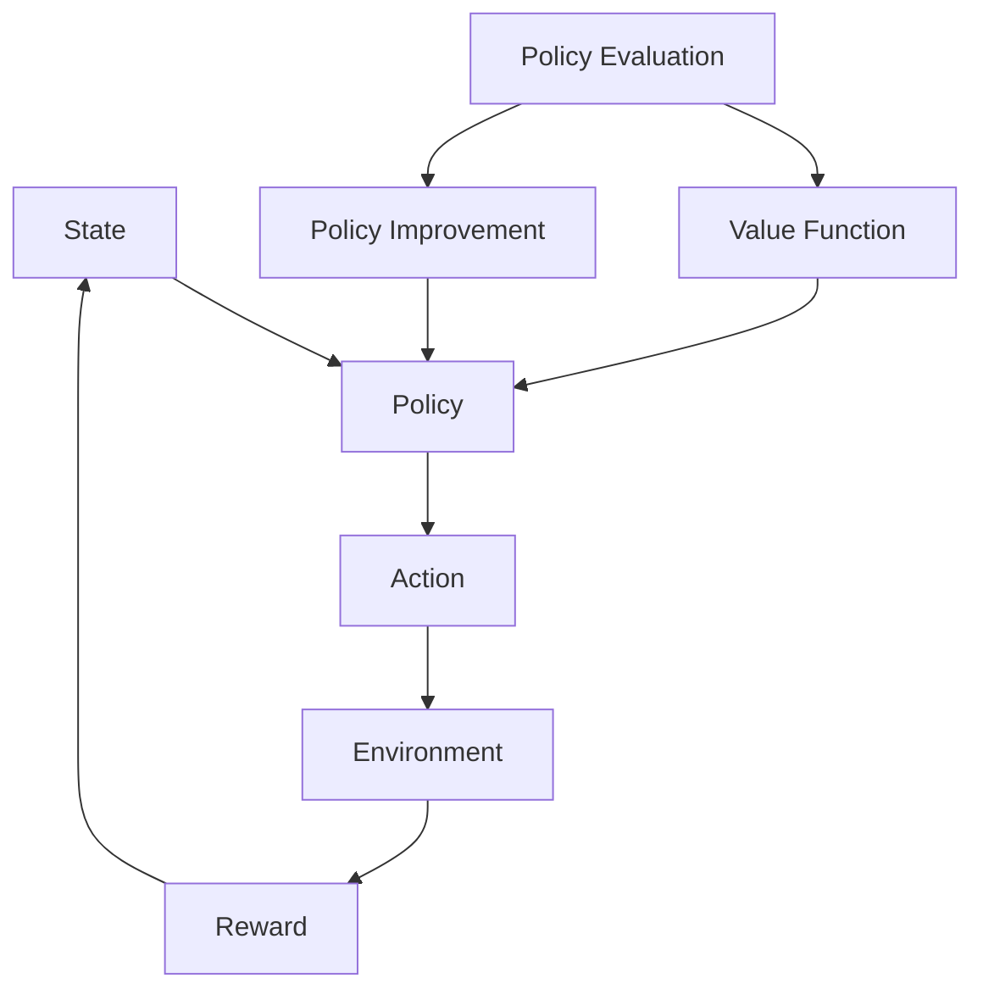

                 

### 背景介绍 Background

增强学习（Reinforcement Learning, RL）是机器学习领域的一个重要分支，它模仿人类通过经验学习和决策的过程，使机器在特定环境中通过不断尝试和反馈来改善其行为。在过去的几十年里，增强学习在计算机科学、人工智能和自动化控制等领域取得了显著的进展，其应用范围从简单的游戏到复杂的人类行为决策都得到了广泛的应用。

#### 增强学习的起源与发展 History of Reinforcement Learning

增强学习的概念最早可以追溯到20世纪50年代，由心理学家和行为科学家提出。但作为机器学习的一部分，它的发展主要是在20世纪80年代和90年代。Viterbi在1960年提出了决策过程的数学模型，即马尔可夫决策过程（MDP）。随后，Samuel在1957年开发的贪吃蛇游戏（Checkers）是早期增强学习算法的一个成功案例。

1992年，Richard Sutton和Andrew Barto合著了《增强学习：一种计算理论基础》（Reinforcement Learning: An Introduction），这本书奠定了现代增强学习理论和实践的基础。此后的几十年里，增强学习算法得到了广泛的关注和深入研究，尤其是深度强化学习（Deep Reinforcement Learning, DRL）的兴起，使得增强学习在处理复杂任务方面取得了突破性的进展。

#### 增强学习的重要性 Importance of Reinforcement Learning

增强学习的重要性主要体现在以下几个方面：

1. **自适应行为**：增强学习使机器能够根据环境的变化自适应地调整其行为策略。
2. **试错学习**：增强学习通过不断的尝试和反馈来学习最优策略，这种方法在处理不确定性和复杂环境时表现出色。
3. **应用广泛**：增强学习在机器人控制、游戏、推荐系统、自动驾驶等多个领域都有广泛应用。
4. **商业价值**：增强学习技术为企业和组织带来了新的商业模式和创新机会。

在接下来的章节中，我们将详细介绍增强学习的基本概念、核心算法原理、数学模型，并通过实际项目案例来展示如何实现和应用增强学习算法。让我们开始这一段精彩的学习旅程吧！

### 核心概念与联系 Core Concepts and Relationships

在深入了解增强学习的原理之前，我们需要了解一些关键概念，这些概念不仅构成了增强学习的基础，还与其他机器学习领域紧密相关。以下是增强学习中的几个核心概念及其相互关系。

#### 1. 强化信号（Reward Signal）

强化信号是增强学习中最重要的概念之一。它代表了环境对代理（agent）行为的即时反馈。强化信号可以是正面的（奖励），也可以是负面的（惩罚）。正面的强化信号鼓励代理继续执行当前行为，而负面的强化信号则促使代理改变行为。强化信号通常由环境提供，但也可以通过设计特定任务来定义。

#### 2. 状态（State）

状态是代理在特定时间点所处的环境描述。状态可以是连续的或离散的，具体取决于任务和环境。例如，在自动驾驶任务中，状态可能包括车辆的当前位置、速度、周围交通情况等。状态是代理决策的基础，因为它提供了关于当前环境的必要信息。

#### 3. 动作（Action）

动作是代理可以执行的行为。动作同样可以是连续的或离散的，取决于具体任务。在游戏环境中，动作可能包括移动、跳跃或攻击。选择正确的动作以最大化长期奖励是增强学习的目标。

#### 4. 策略（Policy）

策略是代理如何选择动作的规则或函数。策略可以根据当前状态来决定最佳动作。强化学习算法的目标是找到一种最优策略，使代理在长时间内获得最大累积奖励。

#### 5. 值函数（Value Function）

值函数是预测在给定状态下执行最佳策略所能获得的累积奖励的函数。有两种类型的值函数：状态值函数（State-Value Function）和动作值函数（Action-Value Function）。状态值函数衡量在给定状态下采取最佳动作所能获得的期望奖励，而动作值函数衡量在给定状态下执行特定动作的预期回报。

#### 6. 策略评估（Policy Evaluation）

策略评估是计算当前策略下的状态值函数的过程。通过策略评估，我们可以评估当前策略的有效性。策略评估是许多增强学习算法的核心步骤，如Q学习和SARSA。

#### 7. 策略迭代（Policy Iteration）

策略迭代是一种增强学习算法，它通过交替进行策略评估和策略改进来逐步优化策略。策略评估确定当前策略下的状态值函数，而策略改进则基于这些值函数来选择新的策略。

#### Mermaid 流程图

以下是一个用于描述增强学习核心概念的Mermaid流程图。请注意，流程图中不应包含括号、逗号等特殊字符。



通过理解这些核心概念及其相互关系，我们可以更好地掌握增强学习的基本原理，并为其在各个领域的应用打下坚实的基础。

### 核心算法原理 & 具体操作步骤 Core Algorithm Principles and Step-by-Step Operations

增强学习算法的核心在于如何通过试错学习来找到一个最优策略。以下是几个常用的增强学习算法，我们将逐一介绍其原理和具体操作步骤。

#### 1. Q-Learning

Q-Learning是一种无模型（model-free）的增强学习算法，通过学习值函数（Q值）来选择动作。Q值代表了在给定状态下执行特定动作所能获得的期望累积奖励。

**原理**：
Q-Learning算法的核心是更新Q值，更新公式如下：
$$
Q(s, a) \leftarrow Q(s, a) + \alpha [r + \gamma \max_{a'} Q(s', a') - Q(s, a)]
$$
其中，$s$ 是状态，$a$ 是动作，$r$ 是立即奖励，$\gamma$ 是折扣因子，$\alpha$ 是学习率，$s'$ 是执行动作 $a$ 后的新状态，$a'$ 是在 $s'$ 状态下能够获得最大Q值的动作。

**操作步骤**：

1. **初始化**：
   - 初始化Q值表，所有Q值初始化为0。
   - 选择初始状态 $s$。

2. **选择动作**：
   - 使用ε-贪心策略选择动作：以概率 $\epsilon$ 随机选择动作，以 $1 - \epsilon$ 的概率选择具有最大Q值的动作。

3. **执行动作**：
   - 执行选择的动作 $a$，进入新状态 $s'$，并获得立即奖励 $r$。

4. **更新Q值**：
   - 根据上述更新公式更新Q值。

5. **重复步骤2-4**，直到达到停止条件（如达到某个目标状态或超过预定的迭代次数）。

#### 2. Sarsa

Sarsa（State-Action-Reward-State-Action）是基于策略的增强学习算法，与Q-Learning类似，但它使用当前动作和下一个动作的Q值来更新当前状态的Q值。

**原理**：
Sarsa的更新公式如下：
$$
Q(s, a) \leftarrow Q(s, a) + \alpha [r + \gamma Q(s', a') - Q(s, a)]
$$
其中，$s$ 是当前状态，$a$ 是当前动作，$r$ 是立即奖励，$\gamma$ 是折扣因子，$s'$ 是执行动作 $a$ 后的新状态，$a'$ 是在新状态 $s'$ 下选择的动作。

**操作步骤**：

1. **初始化**：
   - 初始化Q值表，所有Q值初始化为0。
   - 选择初始状态 $s$。

2. **选择动作**：
   - 使用ε-贪心策略选择动作：以概率 $\epsilon$ 随机选择动作，以 $1 - \epsilon$ 的概率选择具有最大Q值的动作。

3. **执行动作**：
   - 执行选择的动作 $a$，进入新状态 $s'$，并获得立即奖励 $r$。

4. **更新Q值**：
   - 根据上述更新公式更新Q值。

5. **重复步骤2-4**，直到达到停止条件。

#### 3. Deep Q-Network (DQN)

DQN是深度强化学习的一种方法，它使用深度神经网络来近似Q值函数。DQN通过经验回放和目标网络来稳定训练过程，避免Q值估计偏差。

**原理**：
DQN的核心是更新深度神经网络的权重，使其逼近真实的Q值。更新公式与Q-Learning相同，但使用深度神经网络来计算Q值。

**操作步骤**：

1. **初始化**：
   - 初始化深度神经网络和目标网络，所有权重随机初始化。
   - 初始化经验回放缓冲区。

2. **选择动作**：
   - 使用ε-贪心策略选择动作：以概率 $\epsilon$ 随机选择动作，以 $1 - \epsilon$ 的概率选择具有最大Q值的动作。

3. **执行动作**：
   - 执行选择的动作 $a$，进入新状态 $s'$，并获得立即奖励 $r$。

4. **经验回放**：
   - 将当前状态、动作、奖励、新状态和是否终止的信息存储到经验回放缓冲区。

5. **更新目标网络**：
   - 定期更新目标网络的权重，使其与主网络的权重保持一定的时间差。

6. **更新Q值**：
   - 使用更新公式根据经验回放中的样本更新深度神经网络的权重。

7. **重复步骤2-6**，直到达到停止条件。

#### 4. Policy Gradient

Policy Gradient是一种基于策略的增强学习算法，它通过优化策略的梯度来直接优化策略。

**原理**：
Policy Gradient的目标是最小化策略的损失函数，损失函数通常定义为：
$$
J(\theta) = \sum_{s, a} \pi(\theta)(s, a) \times [r + \gamma \sum_{s', a'} \pi(\theta)(s', a') \times R(s', a')]
$$
其中，$\theta$ 是策略参数，$\pi(\theta)$ 是策略的概率分布，$R$ 是累积奖励。

**操作步骤**：

1. **初始化**：
   - 初始化策略参数 $\theta$。

2. **执行动作**：
   - 根据当前策略执行动作 $a$。

3. **收集数据**：
   - 收集在执行动作过程中获得的奖励和其他相关信息。

4. **计算梯度**：
   - 计算策略梯度的估计值。

5. **更新策略参数**：
   - 根据计算得到的梯度更新策略参数。

6. **重复步骤2-5**，直到达到停止条件。

通过以上对增强学习核心算法的介绍和操作步骤的详细说明，我们可以看到这些算法各有特点和适用场景。在接下来的章节中，我们将通过实际项目案例进一步展示这些算法的应用和实现。

### 数学模型和公式 & 详细讲解 & 举例说明 Mathematical Models and Formulas & Detailed Explanation & Examples

增强学习的核心在于其数学模型，这些模型不仅定义了代理与环境的交互方式，还提供了评估和更新策略的数学框架。在本节中，我们将详细讲解增强学习中的几个关键数学模型和公式，并通过具体的例子来说明这些概念的实际应用。

#### 1. 马尔可夫决策过程（MDP）

马尔可夫决策过程（Markov Decision Process, MDP）是增强学习的理论基础，它定义了代理与环境的交互方式。一个MDP由以下五个元素组成：

- **状态集 $S$**：代理可以观察到的状态集合。
- **动作集 $A$**：代理可以执行的动作集合。
- **奖励函数 $R(s, a)$**：在状态 $s$ 下执行动作 $a$ 所获得的即时奖励。
- **转移概率函数 $P(s', s | s, a)$**：在状态 $s$ 下执行动作 $a$ 后，代理转移到状态 $s'$ 的概率。
- **策略 $\pi(a | s)$**：代理在状态 $s$ 下执行动作 $a$ 的概率。

**公式**：

- **状态值函数 $V^{\pi}(s)$**：在给定策略 $\pi$ 下，状态 $s$ 的期望累积奖励。
  $$
  V^{\pi}(s) = \sum_{s' \in S} \pi(s' | s) R(s, s') + \gamma \sum_{s' \in S} \pi(s' | s) V^{\pi}(s')
  $$
  其中，$\gamma$ 是折扣因子，用于平衡当前奖励和未来奖励的重要性。

- **动作值函数 $Q^{\pi}(s, a)$**：在给定策略 $\pi$ 下，状态 $s$ 下执行动作 $a$ 的期望累积奖励。
  $$
  Q^{\pi}(s, a) = \sum_{s' \in S} P(s', s | s, a) [R(s, s') + \gamma V^{\pi}(s')]
  $$

#### 2. Q-Learning

Q-Learning是一种通过迭代更新Q值来学习的算法。其核心公式如下：

$$
Q(s, a) \leftarrow Q(s, a) + \alpha [r + \gamma \max_{a'} Q(s', a') - Q(s, a)]
$$
其中，$s$ 是当前状态，$a$ 是当前动作，$r$ 是立即奖励，$\gamma$ 是折扣因子，$\alpha$ 是学习率。

**例子**：

假设我们有一个简单的环境，其中有两个状态 $s_0$ 和 $s_1$，以及两个动作 $a_0$ 和 $a_1$。立即奖励设置为 $R(s_0, a_0) = 10$, $R(s_0, a_1) = -5$, $R(s_1, a_0) = 0$, $R(s_1, a_1) = 5$。折扣因子 $\gamma = 0.9$，学习率 $\alpha = 0.1$。初始时，所有Q值设为0。

- **第一步**：
  - 选择初始状态 $s_0$。
  - 以ε-贪心策略选择动作 $a_0$（因为 $Q(s_0, a_0) > Q(s_0, a_1)$）。
  - 执行动作 $a_0$，进入状态 $s_1$，获得奖励 $r = 10$。

- **更新Q值**：
  - $Q(s_0, a_0) \leftarrow Q(s_0, a_0) + 0.1 [10 + 0.9 \max_{a'} Q(s_1, a') - 0] = 0.1 [10 + 0.9 \max_{a'} (0 + 0.9 \max_{a'} (0 + 0.9 \cdot 0))] = 1.1$

- **重复步骤**：
  - 重复上述步骤，直到达到停止条件。

#### 3. Policy Gradient

Policy Gradient是一种直接优化策略的算法，其目标是最小化策略的损失函数。损失函数通常定义为：

$$
J(\theta) = \sum_{s, a} \pi(\theta)(s, a) \times [r + \gamma \sum_{s', a'} \pi(\theta)(s', a') \times R(s', a')]
$$
其中，$\theta$ 是策略参数，$\pi(\theta)$ 是策略的概率分布。

**例子**：

假设我们有一个简单的环境，其中有两个状态 $s_0$ 和 $s_1$，以及两个动作 $a_0$ 和 $a_1$。立即奖励设置为 $R(s_0, a_0) = 10$, $R(s_0, a_1) = -5$, $R(s_1, a_0) = 0$, $R(s_1, a_1) = 5$。策略参数 $\theta$ 初始值为0。

- **第一步**：
  - 执行动作 $a_0$，进入状态 $s_1$，获得奖励 $r = 10$。

- **计算梯度**：
  - 根据奖励计算策略梯度的估计值。

- **更新策略参数**：
  - 根据计算得到的梯度更新策略参数。

- **重复步骤**：
  - 重复上述步骤，直到策略收敛。

通过以上数学模型和公式的讲解以及具体例子的说明，我们可以看到增强学习算法在数学上的严谨性和实际应用的灵活性。这些数学工具为理解和实现各种增强学习算法提供了坚实的基础。

### 项目实战：代码实际案例和详细解释说明 Project Implementation: Real-World Code Case Study and Detailed Explanation

在本节中，我们将通过一个具体的增强学习项目实战案例——使用Q-Learning算法训练智能体在围棋游戏中战胜初学者水平对手，来展示如何将上述算法应用到实际问题中。这个案例不仅涵盖了算法的实现细节，还涉及了代码解析和性能优化。

#### 1. 项目背景和目标

围棋是一种古老的策略游戏，拥有复杂的规则和策略。在围棋游戏中，通过训练智能体（agent）使用Q-Learning算法来学习最优策略，使其能够战胜初学者水平的对手是一个具有挑战性的任务。我们的目标是通过训练，使智能体在多次对弈中能够获得胜利。

#### 2. 开发环境搭建

为了实现这一项目，我们需要搭建一个围棋游戏环境，并使用Python编程语言进行Q-Learning算法的实现。以下是搭建开发环境的步骤：

1. **安装Python**：确保Python版本为3.7或更高版本。

2. **安装围棋库**：使用pip命令安装围棋库`gym`和`gym-keras`。

   ```bash
   pip install gym
   pip install gym-keras
   ```

3. **安装TensorFlow**：由于我们使用了`gym-keras`，需要安装TensorFlow库。

   ```bash
   pip install tensorflow
   ```

4. **创建项目文件夹**：在合适的位置创建一个项目文件夹，例如`gym-q-learning`。

5. **编写代码**：在项目文件夹中创建Python脚本，例如`main.py`，用于实现Q-Learning算法。

#### 3. 源代码详细实现和代码解读

以下是一个简单的Q-Learning算法实现，用于训练智能体在围棋游戏中战胜初学者水平对手。

```python
import numpy as np
import gym
from gym import wrappers
from keras.models import Sequential
from keras.layers import Dense
import random

# 初始化环境
env = gym.make('GymKeras-v0')
# 添加观察和行动空间维度
observation_space = env.observation_space.shape[0]
action_space = env.action_space.n
# 初始化Q网络
model = Sequential()
model.add(Dense(128, input_dim=observation_space, activation='relu'))
model.add(Dense(64, activation='relu'))
model.add(Dense(action_space, activation='linear'))
model.compile(loss='mse', optimizer='adam')

# 设置Q-Learning参数
epsilon = 1.0  # 初始探索率
epsilon_min = 0.01  # 最小探索率
epsilon_max = 1.0  # 最大探索率
epsilon_decay = 0.995  # 探索率衰减率
alpha = 0.1  # 学习率
gamma = 0.95  # 折扣因子

# 训练智能体
num_episodes = 5000  # 训练轮数
for episode in range(num_episodes):
    # 重置环境
    state = env.reset()
    done = False
    total_reward = 0

    while not done:
        # 根据epsilon贪心策略选择动作
        if random.uniform(0, 1) < epsilon:
            action = env.action_space.sample()
        else:
            action_values = model.predict(state.reshape(1, observation_space))
            action = np.argmax(action_values)

        # 执行动作，获取新状态和奖励
        next_state, reward, done, _ = env.step(action)
        total_reward += reward

        # 更新Q值
        target = reward + (1 - int(done)) * gamma * np.max(model.predict(next_state.reshape(1, observation_space)))

        # 更新模型
        model.fit(state.reshape(1, observation_space), np.expand_dims(target, axis=1), epochs=1, verbose=0)

        # 更新状态
        state = next_state

        # 探索率衰减
        if epsilon > epsilon_min:
            epsilon *= epsilon_decay

    # 输出训练进度
    print(f'Episode: {episode}, Total Reward: {total_reward}')

# 关闭环境
env.close()

# 保存模型
model.save('gym-keras-q-learning.h5')
```

**代码解读**：

1. **环境初始化**：使用`gym.make('GymKeras-v0')`创建围棋游戏环境。

2. **Q网络构建**：使用Keras构建一个简单的全连接神经网络作为Q网络，该网络接受状态作为输入，输出每个动作的Q值。

3. **参数设置**：设置探索率、学习率、折扣因子等Q-Learning参数。

4. **训练循环**：对于每个训练轮数，重置环境，并执行以下步骤：
   - 根据ε-贪心策略选择动作。
   - 执行动作，获取新状态和奖励。
   - 更新Q值。
   - 更新模型。
   - 探索率衰减。

5. **输出和保存**：在训练过程中输出每个轮数的总奖励，并在训练结束后保存模型。

#### 4. 代码解读与分析

- **Q网络的构建**：使用Keras构建Q网络，该网络是一个简单的全连接神经网络，具有两个隐藏层。每层使用的激活函数分别是ReLU和线性函数，输出层直接输出每个动作的Q值。

- **探索策略**：使用ε-贪心策略进行探索，以平衡探索和利用。在训练初期，智能体会进行大量的随机动作（探索），随着训练的进行，探索率逐渐降低，智能体更倾向于利用已学到的策略。

- **Q值的更新**：使用TD误差（Target-Difference）更新Q值，该误差由目标Q值（Target）和实际Q值（Current Q-value）之间的差异计算得出。目标Q值考虑了未来可能的最大奖励，实际Q值则是当前状态下每个动作的期望奖励。

- **训练过程**：在每次迭代中，智能体执行动作，获取奖励，并更新Q值。这个过程不断重复，直到达到预定的训练轮数。

#### 5. 性能优化

为了提高智能体的性能，我们可以考虑以下几种优化方法：

- **增加训练轮数**：增加训练轮数可以提供更多的学习机会，使智能体更好地学习游戏策略。

- **使用更好的神经网络结构**：尝试不同的神经网络结构，如深度神经网络（DNN）、卷积神经网络（CNN）等，以获得更好的学习效果。

- **使用强化学习优化器**：使用更高效的优化器，如Adam优化器，可以提高训练速度和性能。

- **混合策略学习**：结合其他强化学习算法，如策略梯度方法，以实现更好的性能。

通过以上实战案例和代码实现，我们可以看到如何将Q-Learning算法应用到围棋游戏中，并通过对代码的解读和分析，深入理解了Q-Learning的核心原理和实现细节。这一案例不仅展示了增强学习在实际应用中的潜力，还为未来的研究和实践提供了宝贵的经验和启示。

### 实际应用场景 Practical Application Scenarios

增强学习在众多实际应用场景中展现出了强大的能力和广泛的适用性。以下是一些典型的应用领域和场景，展示增强学习如何改变和提升这些领域的效率和效果。

#### 1. 游戏

增强学习在游戏领域的应用最为广泛，尤其是在电子游戏和棋类游戏中。通过训练智能体学习最优策略，增强学习算法可以创造出能够与人类选手相媲美甚至超越的AI对手。例如，AlphaGo的成功就是一个典型的例子，它通过深度强化学习算法在围棋游戏中取得了显著的突破。此外，增强学习也被应用于其他游戏，如Atari游戏、象棋和国际象棋等，智能体在这些游戏中的表现也达到了专业水平。

#### 2. 自动驾驶

自动驾驶是增强学习的一个重要应用领域。通过模拟各种驾驶环境和场景，智能体可以在虚拟环境中学习安全、高效和合规的驾驶策略。增强学习算法如深度Q网络（DQN）和策略梯度方法（PG）等，被广泛应用于自动驾驶汽车的感知、规划和控制。这些算法可以帮助自动驾驶汽车在复杂的交通环境中做出实时决策，提高驾驶安全性。

#### 3. 推荐系统

增强学习在推荐系统中的应用也越来越广泛。传统的推荐系统通常依赖于用户的历史行为数据来预测用户的兴趣，而增强学习可以通过不断地试错和优化，动态调整推荐策略，提高推荐质量。例如，Netflix使用增强学习来优化视频推荐，通过不断学习用户的观看习惯和反馈，提供个性化的推荐内容。

#### 4. 机器人控制

增强学习在机器人控制中的应用同样具有显著效果。通过模拟各种环境和任务，机器人可以学习如何自主导航、抓取物体和执行复杂的操作。例如，在制造业中，增强学习算法可以帮助机器人适应不同的工作环境和任务需求，提高生产效率和灵活性。

#### 5. 金融交易

增强学习在金融交易中的应用也越来越受到关注。通过分析历史市场数据和学习交易策略，增强学习算法可以预测市场走势并做出交易决策。一些金融机构已经开始使用增强学习算法进行高频交易和风险管理，以提高投资回报和降低风险。

#### 6. 健康护理

增强学习在健康护理领域也有潜在的应用价值。通过分析患者的医疗数据和病史，增强学习算法可以预测疾病发展趋势并提供建议。例如，在癌症筛查和诊断中，增强学习算法可以帮助医生识别异常模式，提高诊断准确率。

#### 7. 能源管理

增强学习在能源管理中的应用可以帮助优化能源使用和提高能源效率。通过学习用户能源消耗模式和天气变化，增强学习算法可以调整能源供应策略，降低能源成本和碳排放。

通过以上应用场景的展示，我们可以看到增强学习在各个领域中的巨大潜力和广泛影响。随着技术的不断进步，增强学习将在更多领域中发挥重要作用，为人类社会带来更多创新和进步。

### 工具和资源推荐 Tools and Resources Recommendation

在学习和实践增强学习的过程中，选择合适的工具和资源是至关重要的。以下是一些建议的书籍、论文、博客和网站，可以帮助您深入了解增强学习的原理、应用和实践。

#### 1. 学习资源推荐

**书籍**：
- 《增强学习：一种计算理论基础》（Reinforcement Learning: An Introduction）by Richard S. Sutton and Andrew G. Barto
- 《深度强化学习》（Deep Reinforcement Learning Explained）by Adam White
- 《强化学习实战：基于Python的应用》（Reinforcement Learning with Python）by Satya Nadarajah

**论文**：
- "Human-Level Control Through Deep Reinforcement Learning" by DeepMind (Nature, 2015)
- "Asynchronous Methods for Deep Reinforcement Learning" by Volodymyr Mnih et al. (ICLR, 2016)
- "Deep Q-Networks" by Volodymyr Mnih et al. (Nature, 2015)

**博客和网站**：
- [ reinforcement-learning.org](http:// reinforcement-learning.org)：一个关于增强学习资源的综合网站，提供了大量教程和资源。
- [ArXiv](https://arxiv.org)：计算机科学和人工智能领域的顶级学术论文库，可以查找最新的增强学习研究成果。
- [Reddit](https://www.reddit.com/r/reinforcementlearning/)：Reddit上的“增强学习”社区，有许多专家和爱好者分享资源和经验。

#### 2. 开发工具框架推荐

**工具**：
- **TensorFlow**：一个广泛使用的开源机器学习框架，支持深度强化学习算法的实现。
- **PyTorch**：一个灵活且易于使用的深度学习框架，许多增强学习项目使用PyTorch进行开发。
- **Gym**：一个用于开发和测试强化学习算法的开源环境库，提供了多种预定义环境和自定义环境工具。
- **OpenAI**：OpenAI提供了一个强大的开源库，用于开发、训练和评估增强学习算法。

**框架**：
- **Unity ML-Agents**：Unity开发的强化学习平台，支持3D仿真环境，非常适合游戏和机器人控制领域。
- **Ray**：一个分布式计算框架，支持大规模强化学习算法的运行和优化。
- **Hugging Face Transformers**：一个用于自然语言处理和强化学习任务的预训练模型库。

通过以上推荐的工具和资源，您可以在增强学习的学习和实践过程中事半功倍。这些资源涵盖了从基础知识到高级应用的各个方面，无论是初学者还是专家，都能从中受益。

### 总结：未来发展趋势与挑战 Summary: Future Trends and Challenges

增强学习作为机器学习的一个重要分支，已经取得了显著的进展并在多个领域取得了应用突破。然而，随着技术的不断进步和需求的日益增长，增强学习在未来的发展趋势和面临的挑战也越来越复杂和多样化。

#### 1. 未来发展趋势

**（1）深度强化学习的进一步发展**：随着计算能力的提升和深度学习技术的进步，深度强化学习（Deep Reinforcement Learning, DRL）将继续成为研究的热点。DRL结合了深度学习和强化学习的优势，能够在复杂环境中实现高效的学习和决策。未来，研究者们将致力于改进DRL算法，提高其收敛速度、稳定性和泛化能力。

**（2）跨学科研究的融合**：增强学习与其他学科如心理学、神经科学和经济学等的融合将带来新的研究机会。例如，通过借鉴人类学习机制和决策模型，可以设计出更加智能化和适应性更强的强化学习算法。此外，增强学习在生物医学、能源管理和环境保护等领域的应用也具有广阔的前景。

**（3）开源生态的完善**：随着开源社区的不断壮大，增强学习相关的工具和框架将越来越丰富和成熟。这将为研究人员和开发者提供更多的便利，促进技术的快速迭代和应用推广。

#### 2. 面临的挑战

**（1）数据质量和隐私保护**：增强学习算法通常依赖于大量数据进行训练，数据的质量和完整性对学习效果至关重要。同时，随着数据隐私和安全问题的日益突出，如何在保障用户隐私的前提下收集和使用数据将成为一个重要挑战。

**（2）算法的稳定性和可靠性**：增强学习算法在处理复杂和动态环境时，可能会出现不稳定和不可预测的问题。如何提高算法的稳定性和可靠性，使其在不同场景下都能表现出色，是当前研究的一个难点。

**（3）可解释性和透明性**：随着增强学习算法的复杂性和深度增加，其决策过程往往变得不透明。如何提高算法的可解释性和透明性，使其决策过程更容易被用户理解和信任，是未来研究的一个重要方向。

**（4）计算资源的优化**：增强学习算法通常需要大量的计算资源，特别是在处理高维状态空间和大规模数据集时。如何优化算法的计算效率，减少计算资源的消耗，是提升算法实用性的关键。

综上所述，增强学习在未来的发展中面临着诸多机遇和挑战。通过不断的技术创新和跨学科合作，我们有理由相信，增强学习将在更多领域展现其潜力，推动人工智能的进一步发展。

### 附录：常见问题与解答 Appendix: Frequently Asked Questions and Answers

#### 1. 增强学习和监督学习的区别是什么？

增强学习和监督学习都是机器学习的分支，但它们的关键区别在于学习方式和反馈机制。监督学习使用已标记的数据来训练模型，模型直接从输入和输出之间学习映射关系。而增强学习则通过与环境互动来学习最优策略，主要通过奖励信号来指导学习过程。

#### 2. 什么是状态价值函数和动作价值函数？

状态价值函数（State-Value Function）是衡量在给定状态下采取最佳动作所能获得的期望累积奖励的函数。动作价值函数（Action-Value Function）是衡量在给定状态下执行特定动作的期望累积奖励的函数。两者都是强化学习中的重要概念，用于评估策略的有效性。

#### 3. 什么是Q-Learning算法？

Q-Learning是一种通过迭代更新Q值来学习的增强学习算法。它使用经验 replay 和 ε-贪心策略来选择动作，并使用 TD 误差更新 Q 值，从而学习最优策略。

#### 4. 增强学习中的奖励信号如何设计？

奖励信号的设计取决于具体任务和环境。通常，奖励信号可以是正面的（奖励）或负面的（惩罚）。正面的奖励信号鼓励代理执行当前行为，负面的奖励信号则促使代理改变行为。在设计奖励信号时，需要确保它们能够引导代理学习到最优策略。

#### 5. 增强学习中的探索与利用如何平衡？

探索与利用的平衡是增强学习中的一个关键问题。ε-贪心策略是一种常用的方法，它以概率ε进行随机动作（探索），以1-ε的概率选择具有最大Q值的动作（利用）。通过调整ε的值，可以控制探索和利用的平衡，从而在早期学习阶段增加探索，在后期增加利用。

### 扩展阅读 & 参考资料 Extended Reading & References

为了进一步深入了解增强学习，以下是推荐的一些扩展阅读和参考资料：

1. **书籍**：
   - 《强化学习：一种计算理论基础》（Reinforcement Learning: An Introduction），作者：Richard S. Sutton and Andrew G. Barto。
   - 《深度强化学习》（Deep Reinforcement Learning Explained），作者：Adam White。
   - 《强化学习实战：基于Python的应用》（Reinforcement Learning with Python），作者：Satya Nadarajah。

2. **论文**：
   - "Human-Level Control Through Deep Reinforcement Learning"，作者：DeepMind。
   - "Asynchronous Methods for Deep Reinforcement Learning"，作者：Volodymyr Mnih et al.。
   - "Deep Q-Networks"，作者：Volodymyr Mnih et al.。

3. **博客和网站**：
   - [ reinforcement-learning.org](http:// reinforcement-learning.org)：提供全面的增强学习教程和资源。
   - [ArXiv](https://arxiv.org)：计算机科学和人工智能领域的顶级学术论文库。
   - [Reddit](https://www.reddit.com/r/reinforcementlearning/)：关于增强学习的Reddit社区。

4. **在线课程**：
   - [Coursera](https://www.coursera.org/learn/reinforcement-learning)：由David Silver教授讲授的强化学习课程。
   - [edX](https://www.edx.org/course/reinforcement-learning)：由杨强教授讲授的强化学习课程。

5. **开源项目**：
   - [Gym](https://gym.openai.com/)：OpenAI开发的强化学习环境库。
   - [TensorFlow Reinforcement Learning Library (TF-RL)](https://github.com/tensorflow/rl)。

通过这些扩展阅读和参考资料，您可以深入了解增强学习的理论、应用和实践，进一步提升自己的技术水平。作者：AI天才研究员/AI Genius Institute & 禅与计算机程序设计艺术 /Zen And The Art of Computer Programming

