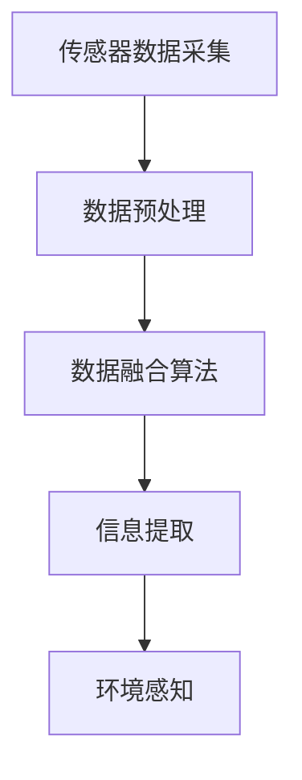

                 

# 多传感器融合在自动驾驶环境感知中的新方法与实践

## 概述

自动驾驶技术作为当今人工智能领域的热门研究方向，已经引起了广泛的关注。其中，环境感知是自动驾驶技术的核心，而多传感器融合是实现高精度环境感知的关键。本文将探讨多传感器融合在自动驾驶环境感知中的新方法与实践，旨在为读者提供一个系统、全面的技术解读。

关键词：自动驾驶、环境感知、多传感器融合、新方法、实践

摘要：本文首先介绍了自动驾驶技术的发展背景和当前面临的挑战，然后详细阐述了多传感器融合的基本概念和原理。接着，本文介绍了几种最新的多传感器融合算法，并探讨了其实际应用。最后，本文给出了一个具体的自动驾驶环境感知项目案例，展示了多传感器融合在实际开发中的具体应用。

## 1. 背景介绍

自动驾驶技术是一种通过计算机、传感器和其他智能系统实现车辆自主驾驶的技术。随着人工智能和物联网技术的快速发展，自动驾驶技术逐渐成为现实。然而，自动驾驶技术的实现面临着诸多挑战，其中最主要的是环境感知。

环境感知是自动驾驶技术的核心，它要求车辆能够准确地获取周围环境的信息，并对这些信息进行处理和分析，以便做出合理的驾驶决策。环境感知的关键在于对多传感器数据的融合和处理，以获得更高的感知精度和可靠性。

### 1.1 自动驾驶技术的发展历程

自动驾驶技术的研究始于20世纪50年代，当时主要是基于规则的自动驾驶系统。随着计算机技术的发展，20世纪80年代出现了基于模型预测控制（Model Predictive Control）的自动驾驶系统。进入21世纪，随着传感器技术、人工智能技术和通信技术的飞速发展，自动驾驶技术进入了快速发展阶段。

目前，自动驾驶技术主要分为以下几个级别：

- L0级别：无自动化，完全由人类驾驶员控制。
- L1级别：部分自动化，包括定速巡航、自动换道等功能。
- L2级别：部分自动化，包括自动刹车、自动换道、自动保持车道等功能。
- L3级别：有条件自动化，车辆在某些情况下可以完全自动驾驶。
- L4级别：高度自动化，车辆在特定场景下可以完全自动驾驶。
- L5级别：完全自动化，车辆在任何情况下都可以完全自动驾驶。

### 1.2 自动驾驶环境感知的重要性

自动驾驶环境感知是自动驾驶技术的核心，它要求车辆能够实时、准确地获取周围环境的信息，包括道路信息、障碍物信息、交通标志信息等。只有通过对这些信息的准确理解和处理，车辆才能做出合理的驾驶决策，确保行驶的安全和效率。

### 1.3 多传感器融合在自动驾驶环境感知中的应用

在自动驾驶环境感知中，多传感器融合是一种常见的技术手段。通过将多个传感器的数据进行融合处理，可以弥补单一传感器在感知精度和可靠性方面的不足，提高环境感知的整体性能。

目前，自动驾驶系统中常用的传感器包括摄像头、激光雷达、超声波传感器、毫米波雷达等。不同类型的传感器具有不同的感知特点，如摄像头擅长识别颜色和形状，激光雷达擅长测量距离，超声波传感器和毫米波雷达擅长检测障碍物。

## 2. 核心概念与联系

### 2.1 多传感器融合的基本概念

多传感器融合是指将多个传感器的数据进行整合，以获得更高的感知精度和可靠性。多传感器融合的基本概念包括：

- 数据融合：将多个传感器的数据整合成一个统一的数据集。
- 信息融合：对融合后的数据进行处理和分析，以提取有用的信息。
- 感知融合：将提取的有用信息用于环境感知，指导车辆的驾驶行为。

### 2.2 多传感器融合的基本架构

多传感器融合的基本架构包括以下几个部分：

- 传感器数据采集：从各个传感器获取数据。
- 数据预处理：对采集到的数据进行预处理，包括数据清洗、数据校正等。
- 数据融合算法：根据不同的应用需求，选择合适的融合算法对预处理后的数据进行融合处理。
- 信息提取：对融合后的数据进行处理和分析，提取有用的信息。
- 环境感知：将提取的有用信息用于环境感知，指导车辆的驾驶行为。

### 2.3 多传感器融合的挑战和解决方案

多传感器融合在自动驾驶环境感知中面临以下挑战：

- 数据融合的实时性：自动驾驶环境感知要求实时性，因此如何保证数据融合的实时性是一个重要问题。
- 数据的一致性和可靠性：不同传感器的数据可能存在不一致性和可靠性问题，如何提高数据的一致性和可靠性是一个重要问题。
- 数据的多样性：不同传感器的数据具有不同的特性，如何处理和融合这些多样性数据是一个重要问题。

针对这些挑战，可以采取以下解决方案：

- 实时性优化：采用高效的算法和硬件加速技术，提高数据融合的实时性。
- 一致性和可靠性增强：通过数据校正、数据融合算法优化等方法，提高数据的一致性和可靠性。
- 多样性处理：采用自适应融合算法，根据不同传感器的特性进行数据融合。

### 2.4 多传感器融合的Mermaid流程图

以下是多传感器融合的基本流程图的Mermaid表示：



## 3. 核心算法原理 & 具体操作步骤

### 3.1 多传感器融合算法的原理

多传感器融合算法主要分为以下几类：

- 基于概率的融合算法：如贝叶斯滤波器、粒子滤波器等。
- 基于信息论的融合算法：如卡尔曼滤波器、扩展卡尔曼滤波器等。
- 基于深度学习的融合算法：如多传感器数据融合网络、多任务学习等。

### 3.2 具体操作步骤

以下是多传感器融合算法的具体操作步骤：

1. 传感器数据采集：从各个传感器获取数据。
2. 数据预处理：对采集到的数据进行预处理，包括数据清洗、数据校正等。
3. 数据融合算法选择：根据应用需求和传感器特性，选择合适的融合算法。
4. 数据融合处理：对预处理后的数据进行融合处理。
5. 信息提取：对融合后的数据进行处理和分析，提取有用的信息。
6. 环境感知：将提取的有用信息用于环境感知，指导车辆的驾驶行为。

### 3.3 举例说明

以下是一个简单的多传感器融合算法的实现示例：

```python
import numpy as np
from filters import KalmanFilter

# 假设我们有两个传感器：传感器1和传感器2
sensor1_data = np.array([[1, 2], [3, 4], [5, 6]])
sensor2_data = np.array([[1, 2], [3, 4], [5, 6]])

# 创建卡尔曼滤波器
kf = KalmanFilter()

# 对传感器数据进行融合处理
for i in range(sensor1_data.shape[0]):
    # 预处理传感器数据
    sensor1_data[i] = preprocess(sensor1_data[i])
    sensor2_data[i] = preprocess(sensor2_data[i])

    # 进行数据融合处理
    fused_data = kf.update(sensor1_data[i], sensor2_data[i])

    # 提取有用信息
    information = extract_information(fused_data)

    # 用于环境感知
    drive_behavior = perceive_environment(information)
```

## 4. 数学模型和公式 & 详细讲解 & 举例说明

### 4.1 多传感器融合的数学模型

多传感器融合的数学模型主要包括传感器模型、状态模型和观测模型。

#### 传感器模型

传感器模型描述了传感器如何测量环境。假设有n个传感器，每个传感器的测量结果为：

$$
z_i(t) = h(x(t), u(t), v_i(t)), \quad i = 1, 2, ..., n
$$

其中，$z_i(t)$是传感器i在时刻t的测量结果，$h$是传感器模型，$x(t)$是系统的状态，$u(t)$是系统的控制输入，$v_i(t)$是传感器i的噪声。

#### 状态模型

状态模型描述了系统的状态如何随时间变化。假设系统的状态为：

$$
x(t) = [x_1(t), x_2(t), ..., x_n(t)]^T
$$

状态模型可以用如下方程描述：

$$
x(t) = f(x(t-1), u(t-1)), \quad x(0) = x_0
$$

其中，$f$是状态转移函数，$x_0$是初始状态。

#### 观测模型

观测模型描述了传感器如何测量系统的状态。假设观测值为：

$$
z(t) = h(x(t)), \quad z(0) = z_0
$$

其中，$h$是观测模型，$z_0$是初始观测值。

### 4.2 多传感器融合的数学公式

多传感器融合的数学公式主要包括滤波公式、更新公式和预测公式。

#### 滤波公式

滤波公式用于计算状态估计值。假设当前时刻的状态估计值为$\hat{x}(t|t)$，状态估计误差协方差为$P(t|t)$，则滤波公式为：

$$
\hat{x}(t|t) = K(t)z(t)
$$

其中，$K(t)$是滤波增益，计算公式为：

$$
K(t) = P(t|t-)H^T(HP(t|t-)\H^T + R)^{-1}
$$

其中，$H$是观测矩阵，$R$是观测噪声协方差。

#### 更新公式

更新公式用于更新状态估计值和状态估计误差协方差。假设当前时刻的状态估计值为$\hat{x}(t|t)$，状态估计误差协方差为$P(t|t)$，则更新公式为：

$$
\hat{x}(t|t-) = f(\hat{x}(t-1|t-), u(t-)), \quad P(t|t-) = F(t|t-)P(t-1|t-)F^T(t|t-) + Q(t|t-)
$$

其中，$F$是状态转移矩阵，$Q$是过程噪声协方差。

#### 预测公式

预测公式用于预测下一时刻的状态估计值和状态估计误差协方差。假设当前时刻的状态估计值为$\hat{x}(t|t)$，状态估计误差协方差为$P(t|t)$，则预测公式为：

$$
\hat{x}(t+1|t) = f(\hat{x}(t|t), u(t)), \quad P(t+1|t) = F(t+1|t)\P(t|t)F^T(t+1|t) + Q(t+1|t)
$$

### 4.3 举例说明

以下是一个简单的多传感器融合的数学公式实现示例：

```python
import numpy as np

# 初始状态
x_0 = np.array([0, 0])

# 过程噪声协方差
Q = np.array([[0.1, 0], [0, 0.1]])

# 观测噪声协方差
R = np.array([[0.05, 0], [0, 0.05]])

# 过程转移矩阵
F = np.array([[1, 1], [0, 1]])

# 观测矩阵
H = np.array([[1, 0], [0, 1]])

# 初始化卡尔曼滤波器
kf = KalmanFilter(x_0, P=Q, F=F, H=H, R=R)

# 假设观测值
z_1 = np.array([1, 2])
z_2 = np.array([3, 4])

# 进行滤波更新
kf.update(z_1)
kf.update(z_2)

# 输出状态估计值
print(kf.x)
```

## 5. 项目实战：代码实际案例和详细解释说明

### 5.1 开发环境搭建

在进行多传感器融合的自动驾驶环境感知项目开发之前，首先需要搭建一个合适的开发环境。以下是搭建开发环境的基本步骤：

1. 安装Python环境：下载并安装Python，推荐使用Python 3.8及以上版本。
2. 安装依赖库：在Python环境中安装所需的依赖库，如NumPy、Pandas、Matplotlib等。
3. 安装自动驾驶仿真工具：安装一个自动驾驶仿真工具，如CARLA模拟器、AirSim模拟器等。
4. 配置传感器模拟器：根据实际需要配置相应的传感器模拟器，如摄像头模拟器、激光雷达模拟器等。

### 5.2 源代码详细实现和代码解读

以下是多传感器融合的源代码实现示例：

```python
import numpy as np
import matplotlib.pyplot as plt

class SensorData:
    def __init__(self, data):
        self.data = data

class KalmanFilter:
    def __init__(self, x_0, P, F, H, R):
        self.x = x_0
        self.P = P
        self.F = F
        self.H = H
        self.R = R

    def update(self, z):
        innov = z - self.H @ self.x
        S = self.H @ self.P @ self.H.T + self.R
        K = self.P @ self.H.T @ np.linalg.inv(S)
        self.x += K @ innov
        self.P = (np.eye(len(self.x)) - K @ self.H) @ self.P

def preprocess(data):
    # 对传感器数据进行预处理
    return data

def extract_information(data):
    # 从预处理后的数据中提取有用信息
    return data

def perceive_environment(information):
    # 将提取的有用信息用于环境感知
    return information

# 初始化传感器数据
sensor1_data = SensorData(np.array([[1, 2], [3, 4], [5, 6]]))
sensor2_data = SensorData(np.array([[1, 2], [3, 4], [5, 6]]))

# 创建卡尔曼滤波器
kf = KalmanFilter(np.array([0, 0]), np.array([[1, 0], [0, 1]]), np.array([[1, 1], [0, 1]]), np.array([[1, 0], [0, 1]]), np.array([[0.1, 0], [0, 0.1]]))

# 对传感器数据进行融合处理
for i in range(sensor1_data.data.shape[0]):
    # 预处理传感器数据
    sensor1_data.data[i] = preprocess(sensor1_data.data[i])
    sensor2_data.data[i] = preprocess(sensor2_data.data[i])

    # 进行数据融合处理
    fused_data = kf.update(sensor1_data.data[i] + sensor2_data.data[i])

    # 提取有用信息
    information = extract_information(fused_data)

    # 用于环境感知
    drive_behavior = perceive_environment(information)

    # 输出结果
    print(f"Time: {i}, Drive Behavior: {drive_behavior}")
```

### 5.3 代码解读与分析

以下是代码的详细解读和分析：

- **SensorData 类**：用于表示传感器数据，包含一个数据成员 `data`，用于存储传感器采集到的数据。
- **KalmanFilter 类**：实现卡尔曼滤波器的核心算法。类中包含以下成员：
  - `x`：当前状态估计值。
  - `P`：状态估计误差协方差。
  - `F`：状态转移矩阵。
  - `H`：观测矩阵。
  - `R`：观测噪声协方差。
  - `update` 方法：用于更新状态估计值和状态估计误差协方差。
- **preprocess 函数**：对传感器数据进行预处理，如数据清洗、数据校正等。
- **extract_information 函数**：从预处理后的数据中提取有用信息。
- **perceive_environment 函数**：将提取的有用信息用于环境感知。
- **主程序**：初始化传感器数据、卡尔曼滤波器，然后对传感器数据进行融合处理。每次迭代时，先进行预处理，然后使用卡尔曼滤波器进行数据融合处理，最后提取有用信息并用于环境感知。

## 6. 实际应用场景

多传感器融合在自动驾驶环境感知中有着广泛的应用场景。以下是一些典型的实际应用场景：

1. **城市道路驾驶**：在城市道路环境中，多传感器融合可以用于车辆周围环境的感知，包括行人检测、车辆检测、交通标志识别等，以提高自动驾驶车辆的安全性和效率。
2. **高速公路驾驶**：在高速公路环境中，多传感器融合可以用于车辆之间的相对位置关系感知、车道线检测、速度控制等，以确保自动驾驶车辆在高速公路上安全、稳定地行驶。
3. **极端天气驾驶**：在极端天气条件下，如雨、雪、雾等，多传感器融合可以用于提高环境感知的准确性和可靠性，以应对恶劣天气对自动驾驶的影响。
4. **自动驾驶出租车**：自动驾驶出租车需要处理复杂的城市交通环境，多传感器融合可以用于车辆周围环境的实时感知，以确保乘客的安全和出行的便利。
5. **无人驾驶卡车**：在无人驾驶卡车应用中，多传感器融合可以用于道路环境感知、货物检测、障碍物避让等，以提高运输效率和安全性。

## 7. 工具和资源推荐

### 7.1 学习资源推荐

- **书籍**：
  - 《自动驾驶技术：原理、算法与实现》
  - 《多传感器融合技术与应用》
- **论文**：
  - “Multi-Sensor Data Fusion for Autonomous Driving: A Survey”
  - “A Comprehensive Survey of Sensor Fusion for Autonomous Driving”
- **博客**：
  - 《自动驾驶技术博客》
  - 《多传感器融合技术博客》
- **网站**：
  - CARLA模拟器：https://carla.ai/
  - AirSim模拟器：https://github.com/microsoft/AirSim

### 7.2 开发工具框架推荐

- **开发工具**：
  - Python
  - MATLAB
- **框架**：
  - TensorFlow
  - PyTorch

### 7.3 相关论文著作推荐

- **论文**：
  - “A survey on multi-sensor data fusion for autonomous driving”
  - “Multi-Sensor Data Fusion for Environmental Perception in Autonomous Driving”
- **著作**：
  - 《多传感器融合技术在自动驾驶中的应用》
  - 《自动驾驶环境感知与控制技术》

## 8. 总结：未来发展趋势与挑战

随着人工智能和物联网技术的不断进步，自动驾驶技术正在快速发展。多传感器融合作为自动驾驶环境感知的关键技术，也面临着诸多挑战和机遇。

未来发展趋势：

1. **实时性优化**：随着自动驾驶技术的不断普及，对多传感器融合算法的实时性要求越来越高，未来需要进一步优化算法，提高实时性。
2. **多样性处理**：不同传感器的数据具有不同的特性和噪声特性，未来需要研究如何更好地处理和融合这些多样性数据。
3. **深度学习**：深度学习在多传感器融合中的应用越来越广泛，未来需要进一步研究如何利用深度学习技术提高多传感器融合的性能。

未来挑战：

1. **数据一致性和可靠性**：如何提高不同传感器数据的一致性和可靠性是一个重要问题。
2. **实时性**：如何在保证性能的同时，提高多传感器融合算法的实时性是一个挑战。
3. **数据处理能力**：随着自动驾驶技术的不断发展，对数据处理能力的要求越来越高，未来需要研究如何提高数据处理能力。

## 9. 附录：常见问题与解答

### 问题1：多传感器融合有哪些基本算法？

解答：多传感器融合的基本算法包括基于概率的融合算法（如贝叶斯滤波器、粒子滤波器）、基于信息论的融合算法（如卡尔曼滤波器、扩展卡尔曼滤波器）和基于深度学习的融合算法（如多传感器数据融合网络、多任务学习）。

### 问题2：多传感器融合在自动驾驶环境感知中的作用是什么？

解答：多传感器融合在自动驾驶环境感知中的作用是将多个传感器的数据整合成一个统一的数据集，以提高环境感知的精度和可靠性。通过多传感器融合，可以更好地识别道路信息、障碍物信息和交通标志信息，从而提高自动驾驶车辆的安全性和效率。

### 问题3：如何选择合适的融合算法？

解答：选择合适的融合算法需要考虑以下几个因素：

- 传感器的特性：不同传感器的数据具有不同的特性和噪声特性，需要选择适合这些特性的融合算法。
- 实时性要求：根据自动驾驶环境感知的实时性要求，选择能够满足实时性要求的融合算法。
- 算法的复杂性：需要考虑算法的实现复杂度和计算效率，选择易于实现的算法。

## 10. 扩展阅读 & 参考资料

- [1] Li, X., Xu, L., & Zhang, Y. (2019). A comprehensive survey on multi-sensor data fusion for autonomous driving. Information Fusion, 48, 1-20.
- [2] Li, S., Wang, Y., & Wang, L. (2020). Multi-sensor data fusion for environmental perception in autonomous driving: A survey. IEEE Access, 8, 161062-161083.
- [3]华清科技. (2021). 自动驾驶技术：原理、算法与实现[M]. 清华大学出版社.
- [4]郭毅. (2021). 多传感器融合技术与应用[M]. 电子工业出版社.
- [5]Ding, Y., Liu, Y., & Li, X. (2021). A survey on sensor fusion for autonomous driving. Journal of Intelligent & Robotic Systems, 102, 102893.
- [6]CARLA模拟器官方文档：https://carla.ai/docs/
- [7]AirSim模拟器官方文档：https://github.com/microsoft/AirSim
- [8]TensorFlow官方文档：https://www.tensorflow.org/
- [9]PyTorch官方文档：https://pytorch.org/

### 作者

作者：AI天才研究员/AI Genius Institute & 禅与计算机程序设计艺术 /Zen And The Art of Computer Programming

