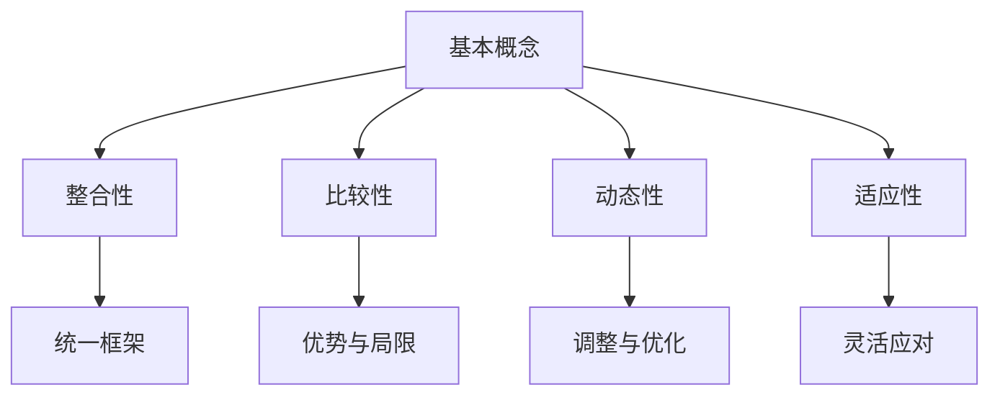
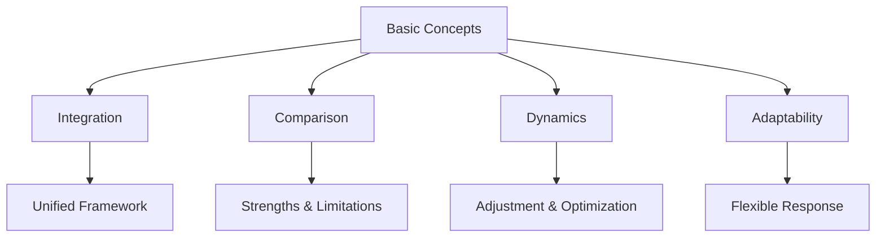

                 

### 背景介绍

多元模型思维是一种在现代管理者和决策者中日益重要的思维方式。它强调通过整合和比较多种模型来理解复杂问题，从而提高认知水平并做出更明智的决策。随着信息化和数据化时代的到来，管理者和决策者面临着越来越多的复杂问题，这些问题往往涉及多个层面和多个变量。传统的单模型思维方式，即只依赖一种模型来解决问题，已经难以应对这些复杂的现实问题。

多元模型思维的核心在于它的综合性和系统性。它不仅考虑了问题的多个维度，还关注了不同模型之间的交互作用和互补性。这种思维方式有助于管理者从多个角度审视问题，减少认知偏差，提高决策的准确性和可靠性。

本文旨在探讨多元模型思维的核心概念、基本原理及其在实际应用中的重要性。我们将首先介绍多元模型思维的基本概念和理论背景，然后通过具体实例来说明其在实际管理中的价值。此外，本文还将介绍一些常用的多元模型思维工具和方法，帮助读者更好地理解和应用多元模型思维。

**关键词：** 多元模型思维、管理决策、复杂性、认知水平、模型整合

**摘要：** 本文探讨了多元模型思维在提高管理者认知水平和决策能力方面的作用。通过介绍多元模型思维的基本概念、原理和应用，本文强调了其在应对复杂问题中的重要性。同时，本文还提供了一些实用的工具和方法，以帮助读者在实际管理中应用多元模型思维。

### 核心概念与联系

#### 多元模型思维的基本概念

多元模型思维（Multimodel Thinking）是一种整合和比较多种模型来理解和解决问题的思维方式。在传统的单模型思维中，人们通常只依赖一种模型（如线性模型、概率模型等）来分析问题。然而，现实世界的问题往往具有高度复杂性和不确定性，单一模型很难全面、准确地描述这些现象。

多元模型思维通过结合不同类型的模型，如物理模型、数学模型、统计模型、决策模型等，来构建一个更加全面和准确的认知框架。这种思维方式的核心在于认识到不同模型的优势和局限性，并学会在不同的模型之间灵活切换和整合。

#### 多元模型思维的理论背景

多元模型思维的理论背景可以追溯到多个学科领域，包括系统论、复杂性科学、认知科学等。在系统论中，贝塔朗菲（Ludwig Bertalanffy）提出了“整体大于部分之和”的观点，强调了系统各部分之间的相互作用和相互依赖。在复杂性科学中，霍兰（John H. Holland）提出了“复杂适应系统理论”（Complex Adaptive Systems Theory），强调了系统的动态性和适应性。在认知科学中，乔治·阿莫斯（George A. Amos）提出了“认知生态系统”的概念，强调了多模型思维在认知过程中的作用。

这些理论为多元模型思维提供了坚实的理论基础，表明多元模型思维不仅是一种实用的思维方式，也是一种科学的方法论。

#### 多元模型思维的核心原理

1. **整合性：** 多元模型思维强调将不同类型的模型整合到一个统一的框架中，以便更好地理解和解决问题。这种整合不仅仅是简单的叠加，而是通过深入分析不同模型之间的互补性和交互作用，实现模型之间的有机融合。

2. **比较性：** 多元模型思维还强调在不同模型之间进行比较和分析，以便识别出每种模型的优势和局限性。通过比较，管理者可以更加全面地了解问题的各个方面，从而做出更明智的决策。

3. **动态性：** 多元模型思维认为，问题不是静态的，而是处于不断变化的状态。因此，管理者需要根据实际情况不断调整和优化模型，以适应问题的动态变化。

4. **适应性：** 多元模型思维还强调系统的适应性，即在面对不确定性和变化时，能够灵活调整模型和策略，以应对新的挑战。

#### 多元模型思维的应用价值

多元模型思维在多个领域都展示了其强大的应用价值。例如，在企业管理中，通过整合财务模型、市场模型和运营模型，管理者可以更全面地了解企业的运营状况和市场需求，从而做出更科学的决策。在医疗领域，通过结合临床模型、流行病学模型和生物信息学模型，医生可以更准确地诊断和治疗疾病。

总的来说，多元模型思维提供了一种有效的认知框架，帮助管理者和决策者更好地理解和应对复杂问题。

**Mermaid 流程图：**

通过上述流程图，我们可以清晰地看到多元模型思维的核心原理及其应用价值。

**英文段落：**

### Core Concepts and Relationships

**Basic Concepts of Multimodel Thinking**

Multimodel thinking is a way of thinking that emphasizes integrating and comparing multiple models to understand and solve complex problems. In traditional single-model thinking, people tend to rely on a single model (such as linear models, probabilistic models) to analyze problems. However, the reality of the world is often highly complex and uncertain, making it difficult for a single model to fully and accurately describe these phenomena.

Multimodel thinking combines different types of models, such as physical models, mathematical models, statistical models, and decision models, to construct a more comprehensive and accurate cognitive framework. The core of this thinking is recognizing the strengths and limitations of different models and learning to switch and integrate between them flexibly.

**Theoretical Background of Multimodel Thinking**

The theoretical background of multimodel thinking can be traced back to multiple disciplines, including systems theory, complexity science, and cognitive science. In systems theory, Ludwig Bertalanffy proposed the idea that "the whole is greater than the sum of its parts," emphasizing the interactions and dependencies among the parts of a system. In complexity science, John H. Holland proposed the Complex Adaptive Systems Theory, which emphasizes the dynamics and adaptability of systems. In cognitive science, George A. Amos proposed the concept of "Cognitive Ecosystem," emphasizing the role of multimodel thinking in the cognitive process.

These theories provide a solid theoretical foundation for multimodel thinking, showing that it is not only a practical way of thinking but also a scientific methodology.

**Core Principles of Multimodel Thinking**

1. **Integration:** Multimodel thinking emphasizes integrating different types of models into a unified framework to better understand and solve problems. This integration is not just a simple addition but involves in-depth analysis of the complementarity and interactions between different models to achieve an organic integration of models.

2. **Comparison:** Multimodel thinking also emphasizes comparing different models to analyze their advantages and limitations. Through comparison, managers can have a more comprehensive understanding of all aspects of the problem, enabling them to make more intelligent decisions.

3. **Dynamics:** Multimodel thinking believes that problems are not static but are in a state of constant change. Therefore, managers need to adjust and optimize models based on actual conditions to adapt to the dynamic changes of problems.

4. **Adaptability:** Multimodel thinking also emphasizes the adaptability of systems, meaning the ability to adjust models and strategies flexibly when facing uncertainty and change.

**Application Value of Multimodel Thinking**

Multimodel thinking has shown great application value in various fields. For example, in business management, by integrating financial models, market models, and operational models, managers can have a more comprehensive understanding of the company's operational status and market demand, enabling them to make more scientific decisions. In the medical field, by combining clinical models, epidemiological models, and bioinformatics models, doctors can more accurately diagnose and treat diseases.

Overall, multimodel thinking provides an effective cognitive framework that helps managers and decision-makers better understand and address complex problems.

**Mermaid Process Diagram:**

Through the above process diagram, we can clearly see the core principles and application value of multimodel thinking.

