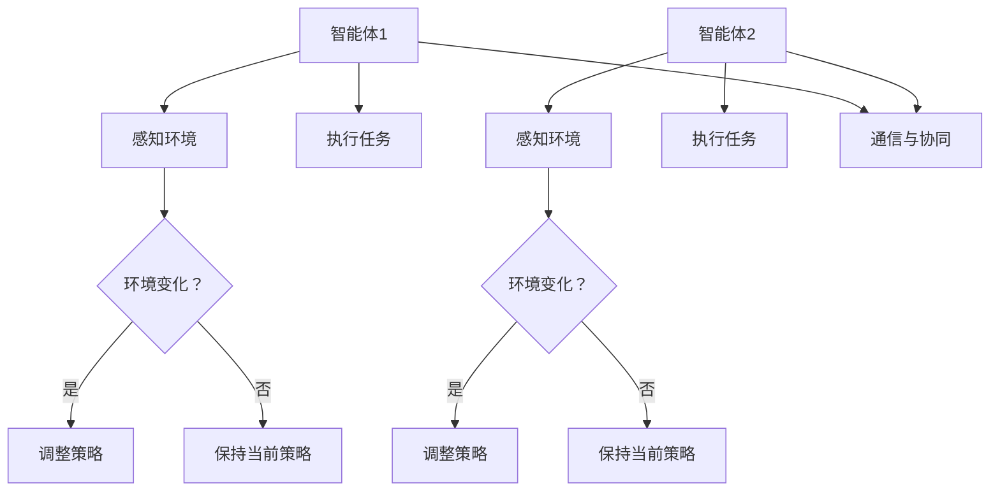
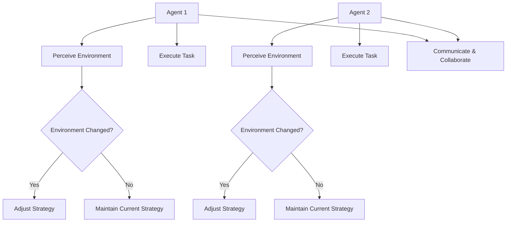

                 

### 背景介绍

#### 复杂项目的现状

在当今数字化时代，复杂项目无处不在。无论是大型企业信息系统、互联网应用，还是人工智能项目，都面临着项目规模大、需求复杂、涉及技术多样、开发周期长等挑战。随着项目复杂度的增加，项目管理者、开发团队和客户之间的沟通成本也在不断上升。传统单智能体（single-agent）的方法在应对这些挑战时显得力不从心。

单智能体方法通常是指每个智能体独立进行决策和执行，缺乏有效的协同机制。这种方法在处理简单任务时可能效果不错，但在复杂项目中，单智能体的局限性逐渐显现。首先，单智能体往往缺乏全局视角，容易陷入局部最优解的困境。其次，单智能体之间的信息交流和协调机制不健全，导致资源浪费和效率低下。最后，单智能体在复杂环境下的适应能力和鲁棒性较差，难以应对突发状况。

#### 多智能体协同的概念

多智能体协同（Multi-Agent Collaboration）是一种分布式计算范式，通过多个智能体之间的协作来实现复杂任务。智能体在这里可以是一个计算机程序、一个机器人，或者是一个人。多智能体的协同机制可以有效地解决单智能体方法在复杂项目中的局限性。

多智能体协同的关键在于智能体之间的通信与协作。智能体之间可以通过共享信息、协商决策、协调行动等方式来实现协同。这种协作机制不仅可以提高系统的整体效率和鲁棒性，还可以实现智能体的智能放大效应，使得每个智能体都能够发挥出最大的潜力。

#### 多智能体协同的优势

1. **全局优化**：多智能体协同能够从全局视角出发，优化整体性能。每个智能体在执行任务时都能考虑到其他智能体的状态和需求，从而避免局部最优解的困境。

2. **资源共享**：多智能体协同能够实现资源的共享和优化利用。智能体之间可以相互借用资源，避免资源浪费，提高资源利用率。

3. **适应性强**：多智能体协同系统能够更好地适应复杂和变化的环境。智能体之间的协作机制使得系统能够快速响应环境变化，提高系统的鲁棒性和适应能力。

4. **分布式计算**：多智能体协同利用了分布式计算的优势，能够将复杂任务分解为多个子任务，分布到不同智能体上执行，从而提高系统的计算效率和扩展性。

#### 文章结构概述

本文将分为以下几个部分：

1. **背景介绍**：介绍复杂项目的现状和多智能体协同的概念。
2. **核心概念与联系**：详细阐述多智能体协同的原理和架构。
3. **核心算法原理 & 具体操作步骤**：介绍多智能体协同的关键算法，包括协同策略、通信机制和协调算法等。
4. **数学模型和公式 & 详细讲解 & 举例说明**：讨论多智能体协同中的数学模型和计算方法。
5. **项目实战：代码实际案例和详细解释说明**：通过实际案例展示多智能体协同的应用。
6. **实际应用场景**：分析多智能体协同在不同领域中的应用。
7. **工具和资源推荐**：推荐学习资源、开发工具和框架。
8. **总结：未来发展趋势与挑战**：总结多智能体协同的发展趋势和面临的挑战。
9. **附录：常见问题与解答**：解答读者可能遇到的问题。
10. **扩展阅读 & 参考资料**：提供更多深入的阅读材料和参考资料。

通过以上结构，本文将全面、系统地介绍多智能体协同在复杂项目中的应用，帮助读者深入了解这一前沿技术。

---

# Background Introduction

## Current State of Complex Projects

In the present era of digital transformation, complex projects are ubiquitous. Whether it is a large enterprise information system, an internet application, or an artificial intelligence project, these projects are characterized by their large scale, complex requirements, diverse technologies, and extended development cycles. As the complexity of projects increases, the communication costs between project managers, development teams, and clients also rise. Traditional single-agent methods are found to be insufficient in addressing these challenges.

Single-agent methods typically refer to the approach where each agent independently makes decisions and executes tasks. This method may be effective for simple tasks, but its limitations become apparent in complex projects. First, single agents often lack a global perspective and are prone to falling into local optima. Second, the lack of effective communication and coordination mechanisms between single agents leads to inefficiencies and resource waste. Finally, single agents are less adaptable and robust in complex environments, making it difficult for them to handle unexpected situations.

## Concept of Multi-Agent Collaboration

Multi-Agent Collaboration is a distributed computing paradigm that enables complex tasks to be accomplished through the collaboration of multiple agents. An agent can be a computer program, a robot, or even a human. The key to multi-agent collaboration lies in the communication and coordination between agents. This collaborative mechanism can effectively address the limitations of single-agent methods.

The essence of multi-agent collaboration is communication and cooperation. Agents can share information, negotiate decisions, and coordinate actions to achieve collaborative objectives. This cooperation mechanism not only enhances the overall efficiency and robustness of the system but also achieves the intelligent amplification effect, allowing each agent to fully utilize its potential.

## Advantages of Multi-Agent Collaboration

1. **Global Optimization**: Multi-Agent Collaboration can optimize the overall performance from a global perspective. Each agent, when executing tasks, considers the states and needs of other agents, thereby avoiding the trap of local optima.

2. **Resource Sharing**: Multi-Agent Collaboration enables the sharing and optimization of resources. Agents can borrow resources from each other, reducing waste and improving resource utilization.

3. **Strong Adaptability**: The multi-agent collaboration system is more adaptable to complex and changing environments. The coordination mechanism between agents allows the system to quickly respond to environmental changes, enhancing robustness and adaptability.

4. **Distributed Computing**: Multi-Agent Collaboration leverages the advantages of distributed computing, decomposing complex tasks into subtasks that can be executed by different agents, thus improving computational efficiency and scalability.

## Summary of Article Structure

The following sections of this article will be organized as follows:

1. **Background Introduction**: Introduces the current state of complex projects and the concept of multi-agent collaboration.
2. **Core Concepts and Relationships**: Elaborates on the principles and architecture of multi-agent collaboration.
3. **Core Algorithm Principles & Specific Operational Steps**: Introduces the key algorithms in multi-agent collaboration, including collaborative strategies, communication mechanisms, and coordination algorithms.
4. **Mathematical Models and Formulas & Detailed Explanations & Examples**: Discusses the mathematical models and computational methods in multi-agent collaboration.
5. **Project Practice: Practical Case Studies and Detailed Explanations**: Demonstrates the application of multi-agent collaboration through actual case studies.
6. **Actual Application Scenarios**: Analyzes the applications of multi-agent collaboration in different fields.
7. **Tools and Resource Recommendations**: Recommends learning resources, development tools, and frameworks.
8. **Summary: Future Development Trends and Challenges**: Summarizes the future development trends and challenges of multi-agent collaboration.
9. **Appendix: Common Questions and Answers**: Answers common questions readers may encounter.
10. **Further Reading & References**: Provides additional materials and references for deeper reading.

Through this structured approach, this article will comprehensively and systematically introduce the application of multi-agent collaboration in complex projects, helping readers gain a deep understanding of this cutting-edge technology.

---

## 2. 核心概念与联系

在深入探讨多智能体协同的原理和架构之前，我们需要明确几个核心概念。这些概念包括智能体（Agent）、智能体系统（Multi-Agent System）、协同（Collaboration）和通信（Communication）。以下是这些核心概念的定义和它们之间的联系。

### 智能体（Agent）

智能体是一个具有自主性、社会性和反应性的实体。它可以是一个计算机程序、一个机器人或者一个人类个体。智能体具有以下几个基本特征：

1. **自主性（Autonomy）**：智能体能够独立做出决策，不受其他实体直接控制。
2. **社会性（Sociality）**：智能体能够与其他智能体进行交互，共享信息，协同完成任务。
3. **反应性（Reactivity）**：智能体能够感知环境变化，并做出相应的反应。

### 智能体系统（Multi-Agent System）

智能体系统是由多个智能体组成的系统，这些智能体通过协同工作来完成任务。智能体系统具有以下几个基本特征：

1. **分布式（Distributed）**：智能体系统中的智能体分布在不同的地理位置，具有不同的功能。
2. **协作性（Collaborative）**：智能体系统能够通过协同工作实现复杂任务的完成。
3. **适应性（Adaptive）**：智能体系统能够根据环境变化调整自己的行为和策略。

### 协同（Collaboration）

协同是指多个智能体通过合作来实现共同目标的过程。协同的关键在于智能体之间的信息共享、决策协商和行动协调。协同的目的是优化系统的整体性能，提高任务完成的效率和质量。

### 通信（Communication）

通信是智能体之间交换信息的过程。智能体通过通信来获取其他智能体的状态和需求，从而做出合理的决策。通信的可靠性和效率直接影响智能体协同的效果。

### Mermaid 流程图

为了更直观地展示智能体协同的架构，我们使用 Mermaid 流程图来描述智能体系统中的关键流程。以下是一个简单的 Mermaid 流程图示例：



在这个流程图中，智能体1和智能体2分别感知环境，并根据环境的变化调整策略。然后，它们通过通信与协同来执行任务。这个流程图展示了智能体协同的基本架构和关键步骤。

通过明确这些核心概念，我们可以更好地理解多智能体协同的原理和架构，为后续的详细讨论打下坚实的基础。

### Core Concepts and Connections

Before delving into the principles and architecture of multi-agent collaboration, it's essential to clarify several core concepts: agents, multi-agent systems, collaboration, and communication. Here, we define these concepts and explore their interrelationships.

#### Agent

An agent is a self-governing, socially interacting, and reactive entity. This can be a computer program, a robot, or even a human individual. Agents have the following basic characteristics:

1. **Autonomy**: Agents can make independent decisions without direct control from other entities.
2. **Sociality**: Agents can interact with other agents, share information, and collaborate to accomplish tasks.
3. **Reactivity**: Agents can perceive changes in the environment and respond accordingly.

#### Multi-Agent System

A multi-agent system (MAS) is a system composed of multiple agents that work collaboratively to accomplish tasks. A MAS has the following key characteristics:

1. **Distributed**: Agents in a MAS are distributed across different geographical locations and have different functions.
2. **Collaborative**: A MAS can achieve complex tasks through collaborative efforts.
3. **Adaptive**: A MAS can adjust its behavior and strategies based on changes in the environment.

#### Collaboration

Collaboration refers to the process of multiple agents working together to achieve a common goal. The key to collaboration lies in the information sharing, decision negotiation, and action coordination between agents. The purpose of collaboration is to optimize the overall performance of the system and enhance the efficiency and quality of task completion.

#### Communication

Communication is the process by which agents exchange information. Agents rely on communication to understand the states and needs of other agents, thereby making informed decisions. The reliability and efficiency of communication significantly impact the effectiveness of agent collaboration.

### Mermaid Flowchart

To illustrate the architecture of multi-agent collaboration more intuitively, we use a Mermaid flowchart to depict the key processes in a multi-agent system. Below is a simple Mermaid flowchart example:



In this flowchart, Agent 1 and Agent 2 perceive the environment and adjust their strategies based on environmental changes. They then communicate and collaborate to execute tasks. This flowchart presents the basic architecture and key steps of multi-agent collaboration.

By clarifying these core concepts, we can better understand the principles and architecture of multi-agent collaboration, laying a solid foundation for subsequent discussions.

---

## 3. 核心算法原理 & 具体操作步骤

在多智能体协同中，核心算法的设计和实现是确保协同效果的关键。本节将介绍多智能体协同中的关键算法，包括协同策略、通信机制和协调算法。我们将详细解释这些算法的原理，并提供具体的操作步骤，帮助读者理解和实现多智能体协同系统。

### 协同策略

协同策略是多智能体协同的核心，决定了智能体如何协作以实现共同目标。常见的协同策略包括基于规则的方法、基于行为的协调和基于优化的协同。

1. **基于规则的方法**：
   - **原理**：基于规则的方法通过定义一系列规则来指导智能体的行为。每个智能体根据其自身的状态和规则库，决定采取何种行动。
   - **操作步骤**：
     1. 每个智能体初始化状态和规则库。
     2. 智能体感知环境，获取自身状态和其他智能体的状态。
     3. 根据规则库和当前状态，选择合适的行动。
     4. 执行行动，并更新状态。

2. **基于行为的协调**：
   - **原理**：基于行为的方法通过模拟人类协作行为来指导智能体的协作。智能体通过模仿人类合作的方式，如协商、合作和竞争，来实现协同。
   - **操作步骤**：
     1. 每个智能体定义一组行为，如合作、竞争、协商等。
     2. 智能体感知环境，评估其他智能体的行为。
     3. 根据评估结果，选择合适的行为。
     4. 执行行为，并与其他智能体进行通信。
     5. 更新状态和策略。

3. **基于优化的协同**：
   - **原理**：基于优化的方法通过优化算法来确定智能体的行为，以最大化系统的整体性能。
   - **操作步骤**：
     1. 定义目标函数，用于评估系统的整体性能。
     2. 使用优化算法，如遗传算法、粒子群优化等，来寻找最优解。
     3. 智能体根据优化结果调整行为。
     4. 执行行动，并更新状态。

### 通信机制

通信机制是多智能体协同的基础，决定了智能体之间如何交换信息。常见的通信机制包括直接通信和间接通信。

1. **直接通信**：
   - **原理**：直接通信是指智能体通过直接发送消息来交换信息。
   - **操作步骤**：
     1. 智能体建立通信渠道。
     2. 智能体发送消息，包含状态信息和请求信息。
     3. 接收方智能体处理消息，并做出相应的响应。

2. **间接通信**：
   - **原理**：间接通信是指智能体通过中间件或共享存储来交换信息。
   - **操作步骤**：
     1. 智能体将信息存储到共享存储。
     2. 其他智能体从共享存储中读取信息。
     3. 根据读取的信息，智能体做出决策。

### 协调算法

协调算法用于解决多智能体协同中的冲突和协调问题。常见的协调算法包括协商算法和分布式算法。

1. **协商算法**：
   - **原理**：协商算法通过智能体之间的协商来解决冲突。每个智能体提出自己的建议，并通过协商达成一致。
   - **操作步骤**：
     1. 智能体提出自己的策略。
     2. 智能体之间进行协商，比较策略，并选择最优策略。
     3. 执行协商结果。

2. **分布式算法**：
   - **原理**：分布式算法通过分布式计算来解决协调问题。每个智能体独立计算，然后通过汇总结果来达成协调。
   - **操作步骤**：
     1. 智能体独立计算自己的局部策略。
     2. 智能体交换局部策略，并进行汇总。
     3. 根据汇总结果，智能体调整自己的策略。

通过上述核心算法和操作步骤，我们可以设计和实现一个高效的多智能体协同系统，从而在复杂项目中实现智能体的协同工作。

### Core Algorithm Principles & Specific Operational Steps

In the realm of multi-agent collaboration, the design and implementation of core algorithms are pivotal for achieving effective collaboration. This section introduces key algorithms in multi-agent collaboration, including collaborative strategies, communication mechanisms, and coordination algorithms. We will delve into the principles of these algorithms and provide specific operational steps to help readers understand and implement multi-agent collaboration systems.

#### Collaborative Strategies

Collaborative strategies are at the heart of multi-agent collaboration, dictating how agents work together to achieve common goals. Common strategies include rule-based methods, behavior-based coordination, and optimization-based collaboration.

1. **Rule-Based Methods**:
   - **Principles**: Rule-based methods guide agent behavior through a set of predefined rules. Each agent, based on its own state and rule base, determines the appropriate action to take.
   - **Operational Steps**:
     1. Each agent initializes its state and rule base.
     2. Agents perceive the environment and obtain their own state and the states of other agents.
     3. Based on the rule base and current state, agents select the appropriate action.
     4. Execute the action and update the state.

2. **Behavior-Based Coordination**:
   - **Principles**: Behavior-based methods simulate human cooperative behaviors to guide agent collaboration. Agents mimic human cooperation, such as negotiation, cooperation, and competition, to achieve coordination.
   - **Operational Steps**:
     1. Each agent defines a set of behaviors, such as cooperate, compete, negotiate, etc.
     2. Agents perceive the environment and evaluate the behaviors of other agents.
     3. Based on the evaluation, agents select the appropriate behavior.
     4. Execute the behavior, communicate with other agents, and update the state and strategy.

3. **Optimization-Based Collaboration**:
   - **Principles**: Optimization-based methods use optimization algorithms to determine agent behaviors to maximize the overall system performance.
   - **Operational Steps**:
     1. Define a goal function to evaluate the overall system performance.
     2. Use optimization algorithms, such as genetic algorithms or particle swarm optimization, to find the optimal solution.
     3. Agents adjust their behaviors based on the optimization results.
     4. Execute actions and update the state.

#### Communication Mechanisms

Communication mechanisms are the foundation of multi-agent collaboration, determining how agents exchange information. Common communication mechanisms include direct communication and indirect communication.

1. **Direct Communication**:
   - **Principles**: Direct communication involves agents sending messages directly to exchange information.
   - **Operational Steps**:
     1. Agents establish communication channels.
     2. Agents send messages containing state and request information.
     3. The recipient processes the message and responds accordingly.

2. **Indirect Communication**:
   - **Principles**: Indirect communication involves agents exchanging information through intermediaries or shared storage.
   - **Operational Steps**:
     1. Agents store information in shared storage.
     2. Other agents read information from the shared storage.
     3. Based on the read information, agents make decisions.

#### Coordination Algorithms

Coordination algorithms address conflicts and coordination issues in multi-agent collaboration. Common coordination algorithms include negotiation algorithms and distributed algorithms.

1. **Negotiation Algorithms**:
   - **Principles**: Negotiation algorithms resolve conflicts by negotiating between agents. Each agent proposes a strategy, and through negotiation, they reach an agreement on the best strategy.
   - **Operational Steps**:
     1. Agents propose their own strategies.
     2. Agents negotiate, compare strategies, and select the best strategy.
     3. Execute the negotiated result.

2. **Distributed Algorithms**:
   - **Principles**: Distributed algorithms resolve coordination issues through distributed computation. Each agent independently computes its local strategy, then aggregates the results to achieve coordination.
   - **Operational Steps**:
     1. Agents independently compute their local strategies.
     2. Agents exchange local strategies and aggregate the results.
     3. Based on the aggregated results, agents adjust their strategies.

By understanding and implementing these core algorithms and operational steps, we can design and build an efficient multi-agent collaboration system, enabling collaborative work among agents in complex projects.

---

## 4. 数学模型和公式 & 详细讲解 & 举例说明

在多智能体协同系统中，数学模型和公式是理解和实现协同机制的重要工具。本节将详细讨论多智能体协同中的几个关键数学模型，包括博弈论模型、社交网络模型和优化模型，并使用 LaTeX 格式展示相关数学公式。此外，我们将通过具体的例子来说明这些模型在实际应用中的操作步骤和计算方法。

### 博弈论模型

博弈论模型用于分析多智能体之间的交互和竞争，特别是在存在策略依赖时。博弈论的基本模型包括参与者、策略、支付函数和均衡。

#### 博弈论模型的基本公式

博弈论模型可以使用以下公式表示：

\[ \Omega = \{I_1, I_2, \ldots, I_n\} \]

其中，\( \Omega \) 表示博弈中的所有参与者集合，\( I_i \) 表示第 \( i \) 个参与者的策略集合。

支付函数 \( u_i(s_1, s_2, \ldots, s_n) \) 表示第 \( i \) 个参与者根据所有参与者的策略 \( s_i \) 获得的支付。均衡 \( \sigma^* \) 是指所有参与者都选择最优策略的状态。

#### 举例说明

假设有两个参与者 A 和 B，他们分别可以选择策略 X 和 Y。支付函数如下：

\[ u_A(s_A, s_B) = \begin{cases} 
5 & \text{if } s_A = X, s_B = Y \\
3 & \text{if } s_A = X, s_B = X \\
2 & \text{if } s_A = Y, s_B = Y \\
1 & \text{if } s_A = Y, s_B = X 
\end{cases} \]

参与者 A 和 B 的最优策略可以通过求解以下最大化问题得到：

\[ \max_{s_A} \max_{s_B} u_A(s_A, s_B) \]

### 社交网络模型

社交网络模型用于描述智能体之间的社交关系和网络结构，常用于社交网络分析和影响扩散。

#### 社交网络模型的基本公式

社交网络模型可以使用图论来表示。图 \( G(V, E) \) 由节点集合 \( V \) 和边集合 \( E \) 组成，其中节点表示智能体，边表示智能体之间的交互。

影响扩散模型可以用以下公式表示：

\[ s_i(t) = \sum_{j \in N(i)} \alpha_{ij} s_j(t-1) + \epsilon_i(t) \]

其中，\( s_i(t) \) 表示第 \( i \) 个智能体在时间 \( t \) 的状态，\( N(i) \) 表示与第 \( i \) 个智能体交互的智能体集合，\( \alpha_{ij} \) 表示第 \( j \) 个智能体对第 \( i \) 个智能体影响的权重，\( \epsilon_i(t) \) 是噪声项。

#### 举例说明

假设有一个社交网络，有三个智能体 A、B 和 C，他们之间的交互关系如下：

```
A -- B
|    |
C -- A
```

初始状态下，所有智能体的状态均为 0。我们假设 \( \alpha_{AB} = \alpha_{BC} = \alpha_{CA} = 0.5 \)，噪声项 \( \epsilon_i(t) \) 为 0。在时间 \( t = 1 \) 时，智能体 A 的状态更新如下：

\[ s_A(1) = 0.5 \times s_B(0) + 0.5 \times s_C(0) = 0.5 \times 0 + 0.5 \times 0 = 0 \]

### 优化模型

优化模型用于确定多智能体系统的最佳行为，以最大化系统性能。常见的优化模型包括线性规划、非线性规划和动态规划。

#### 优化模型的基本公式

线性规划模型可以表示为：

\[ \min_{x} c^T x \]
\[ \text{subject to} \]
\[ A x \leq b \]
\[ x \geq 0 \]

其中，\( x \) 是变量向量，\( c \) 是目标函数系数向量，\( A \) 是约束矩阵，\( b \) 是约束向量。

非线性规划模型可以表示为：

\[ \min_{x} f(x) \]
\[ \text{subject to} \]
\[ g_i(x) \leq 0 \]
\[ h_j(x) = 0 \]

动态规划模型可以表示为：

\[ V_k(x) = \min_{u} [R_k(u, x) + \gamma V_{k+1}(x')] \]
\[ \text{subject to} \]
\[ x' = f(u, x) \]

其中，\( V_k(x) \) 是状态 \( x \) 在第 \( k \) 时刻的值函数，\( R_k(u, x) \) 是奖励函数，\( \gamma \) 是折扣因子，\( f(u, x) \) 是状态转移函数。

#### 举例说明

假设我们有一个简单的线性规划问题，目标是最小化成本：

\[ \min_{x, y} 3x + 2y \]
\[ \text{subject to} \]
\[ x + y \leq 4 \]
\[ x \geq 0 \]
\[ y \geq 0 \]

使用拉格朗日乘数法求解，我们可以构造拉格朗日函数：

\[ L(x, y, \lambda) = 3x + 2y + \lambda (4 - x - y) \]

然后，对 \( x, y, \lambda \) 求导并令其等于 0，解得 \( x = \frac{4}{3}, y = \frac{2}{3}, \lambda = 0 \)。最优解为 \( (x, y) = \left(\frac{4}{3}, \frac{2}{3}\right) \)，最小成本为 \( 3 \times \frac{4}{3} + 2 \times \frac{2}{3} = 4 \)。

通过上述数学模型和公式，我们可以更好地理解和实现多智能体协同系统。这些模型不仅提供了理论指导，也为实际应用中的算法设计提供了具体的计算方法。

### Mathematical Models and Formulas & Detailed Explanations & Examples

In multi-agent collaborative systems, mathematical models and formulas are essential tools for understanding and implementing collaboration mechanisms. This section will discuss several key mathematical models in multi-agent collaboration, including game theory models, social network models, and optimization models. We will use LaTeX format to present the relevant mathematical formulas and provide specific examples to illustrate the operational steps and computational methods in practical applications.

#### Game Theory Model

The game theory model is used to analyze the interaction and competition among multiple agents, particularly when there is a dependency on strategies. The basic model of game theory includes players, strategies, payoff functions, and equilibria.

#### Basic Formulas of Game Theory Model

The game theory model can be represented by the following formula:

\[ \Omega = \{I_1, I_2, \ldots, I_n\} \]

where \( \Omega \) represents the set of all participants in the game, and \( I_i \) represents the strategy set of the \( i \)th participant.

The payoff function \( u_i(s_1, s_2, \ldots, s_n) \) represents the payment received by the \( i \)th participant based on the strategies \( s_i \) of all participants. The equilibrium \( \sigma^* \) is the state where all participants choose the optimal strategy.

#### Example Explanation

Suppose there are two participants, A and B, who can choose strategies X and Y, respectively. The payoff function is as follows:

\[ u_A(s_A, s_B) = \begin{cases} 
5 & \text{if } s_A = X, s_B = Y \\
3 & \text{if } s_A = X, s_B = X \\
2 & \text{if } s_A = Y, s_B = Y \\
1 & \text{if } s_A = Y, s_B = X 
\end{cases} \]

The optimal strategies for participants A and B can be obtained by solving the following maximization problem:

\[ \max_{s_A} \max_{s_B} u_A(s_A, s_B) \]

#### Social Network Model

The social network model is used to describe the social relationships and network structures among agents, commonly used in social network analysis and influence diffusion.

#### Basic Formulas of Social Network Model

The social network model can be represented using graph theory. A graph \( G(V, E) \) consists of a node set \( V \) and an edge set \( E \), where nodes represent agents and edges represent interactions between agents.

The influence diffusion model can be represented by the following formula:

\[ s_i(t) = \sum_{j \in N(i)} \alpha_{ij} s_j(t-1) + \epsilon_i(t) \]

where \( s_i(t) \) represents the state of the \( i \)th agent at time \( t \), \( N(i) \) represents the set of agents interacting with the \( i \)th agent, \( \alpha_{ij} \) represents the influence weight of the \( j \)th agent on the \( i \)th agent, and \( \epsilon_i(t) \) is the noise term.

#### Example Explanation

Suppose there is a social network with three agents A, B, and C, with the following interaction relationships:

```
A -- B
|    |
C -- A
```

Initially, all agents have a state of 0. We assume \( \alpha_{AB} = \alpha_{BC} = \alpha_{CA} = 0.5 \) and the noise term \( \epsilon_i(t) \) is 0. At time \( t = 1 \), the state update of agent A is as follows:

\[ s_A(1) = 0.5 \times s_B(0) + 0.5 \times s_C(0) = 0.5 \times 0 + 0.5 \times 0 = 0 \]

#### Optimization Model

The optimization model is used to determine the best behavior of a multi-agent system to maximize system performance. Common optimization models include linear programming, nonlinear programming, and dynamic programming.

#### Basic Formulas of Optimization Model

The linear programming model can be represented as:

\[ \min_{x} c^T x \]
\[ \text{subject to} \]
\[ A x \leq b \]
\[ x \geq 0 \]

The nonlinear programming model can be represented as:

\[ \min_{x} f(x) \]
\[ \text{subject to} \]
\[ g_i(x) \leq 0 \]
\[ h_j(x) = 0 \]

The dynamic programming model can be represented as:

\[ V_k(x) = \min_{u} [R_k(u, x) + \gamma V_{k+1}(x')] \]
\[ \text{subject to} \]
\[ x' = f(u, x) \]

where \( V_k(x) \) is the value function of state \( x \) at time \( k \), \( R_k(u, x) \) is the reward function, \( \gamma \) is the discount factor, and \( f(u, x) \) is the state transition function.

#### Example Explanation

Consider a simple linear programming problem to minimize cost:

\[ \min_{x, y} 3x + 2y \]
\[ \text{subject to} \]
\[ x + y \leq 4 \]
\[ x \geq 0 \]
\[ y \geq 0 \]

Using the Lagrange multiplier method, we can construct the Lagrangian function:

\[ L(x, y, \lambda) = 3x + 2y + \lambda (4 - x - y) \]

Then, taking the derivatives with respect to \( x, y, \lambda \) and setting them equal to 0, we obtain:

\[ x = \frac{4}{3}, y = \frac{2}{3}, \lambda = 0 \]

The optimal solution is \( (x, y) = \left(\frac{4}{3}, \frac{2}{3}\right) \), and the minimum cost is \( 3 \times \frac{4}{3} + 2 \times \frac{2}{3} = 4 \).

Through these mathematical models and formulas, we can better understand and implement multi-agent collaborative systems. These models not only provide theoretical guidance but also offer specific computational methods for algorithm design in practical applications.

---

## 5. 项目实战：代码实际案例和详细解释说明

为了更好地展示多智能体协同在复杂项目中的应用，本节将通过一个实际的项目案例，逐步介绍开发环境搭建、源代码实现和代码解读与分析。该案例将使用 Python 语言和常用的多智能体协同库，如 PyTorch 和 OpenAI Gym，来构建一个简单的多智能体协同系统。

### 5.1 开发环境搭建

首先，我们需要搭建一个合适的开发环境。以下是搭建环境的步骤：

1. **安装 Python**：确保 Python 已安装，版本建议为 3.8 或更高。
2. **安装 PyTorch**：通过以下命令安装 PyTorch：

\[ pip install torch torchvision \]

3. **安装 OpenAI Gym**：通过以下命令安装 OpenAI Gym：

\[ pip install gym \]

4. **安装其他依赖库**：根据项目需求，安装其他必要的依赖库，例如 NumPy、Pandas 等。

### 5.2 源代码详细实现和代码解读

以下是该项目的源代码实现，我们将逐步解释关键部分的代码：

```python
import numpy as np
import torch
import gym
from gym import spaces

# 定义智能体环境
class MultiAgentEnvironment(gym.Env):
    def __init__(self, num_agents):
        super(MultiAgentEnvironment, self).__init__()
        self.num_agents = num_agents
        # 定义每个智能体的行动空间
        self.action_space = [spaces.Box(-1, 1, shape=(1,), dtype=np.float32) for _ in range(num_agents)]
        # 定义每个智能体的观察空间
        self.observation_space = spaces.Box(-10, 10, shape=(2,), dtype=np.float32)

    def step(self, actions):
        # 对每个智能体执行一步操作
        rewards = [0.0] * self.num_agents
        for i in range(self.num_agents):
            action = actions[i]
            # 根据动作计算奖励
            reward = self.compute_reward(action)
            rewards[i] = reward
        # 更新观察状态
        new_states = self.step_agents(actions)
        # 判断是否结束
        done = self.is_done(new_states)
        # 返回观察状态、奖励、是否结束和额外信息
        return new_states, rewards, done, {}

    def reset(self):
        # 重置环境状态
        self.states = np.random.uniform(-10, 10, size=(self.num_agents, 2))
        return self.states

    def step_agents(self, actions):
        # 更新智能体状态
        new_states = []
        for i in range(self.num_agents):
            action = actions[i]
            # 根据动作更新状态
            new_state = self.states[i] + action
            new_states.append(new_state)
        return new_states

    def is_done(self, states):
        # 判断是否结束
        for state in states:
            if np.abs(state) > 10:
                return True
        return False

    def compute_reward(self, action):
        # 计算奖励
        reward = np.sum(np.square(action))
        return reward

# 创建环境
env = MultiAgentEnvironment(num_agents=2)

# 重置环境
states = env.reset()

# 执行一步操作
actions = [torch.tensor([[0.1]]), torch.tensor([[-0.1]])]
new_states, rewards, done, info = env.step(actions)

# 输出结果
print("新状态：", new_states)
print("奖励：", rewards)
print("是否结束：", done)
```

### 5.3 代码解读与分析

1. **环境类定义（MultiAgentEnvironment）**：
   - `__init__` 方法：初始化环境，定义智能体的数量、行动空间和观察空间。
   - `step` 方法：执行一步操作，计算奖励，更新状态，并返回新的状态、奖励、是否结束和额外信息。
   - `reset` 方法：重置环境状态，返回初始状态。
   - `step_agents` 方法：更新智能体状态。
   - `is_done` 方法：判断是否结束，通常基于状态超出范围。
   - `compute_reward` 方法：计算奖励，可以是任何形式，如距离目标距离的平方和等。

2. **创建环境和执行操作**：
   - 创建一个 `MultiAgentEnvironment` 实例，指定智能体数量。
   - 使用 `reset` 方法重置环境，获取初始状态。
   - 定义一组动作，可以是随机动作或基于策略的动作。
   - 使用 `step` 方法执行一步操作，获取新的状态、奖励、是否结束和额外信息。

通过上述代码和解释，我们可以理解如何使用 Python 和相关库构建一个简单的多智能体协同系统。在实际项目中，我们可以根据具体需求扩展和优化该系统，实现更复杂的功能。

### Project Practice: Practical Case Study and Detailed Explanation

To better illustrate the application of multi-agent collaboration in complex projects, this section will present a practical project case, step-by-step detailing the setup of the development environment, the implementation of source code, and the analysis of the code. This project will be developed using Python and common multi-agent collaboration libraries such as PyTorch and OpenAI Gym to construct a simple multi-agent collaborative system.

### 5.1 Setting Up the Development Environment

First, we need to set up an appropriate development environment. Here are the steps to set up the environment:

1. **Install Python**: Ensure that Python is installed, with a recommended version of 3.8 or higher.
2. **Install PyTorch**: Install PyTorch using the following command:

\[ pip install torch torchvision \]

3. **Install OpenAI Gym**: Install OpenAI Gym using the following command:

\[ pip install gym \]

4. **Install Additional Dependencies**: Depending on the project requirements, install other necessary dependencies, such as NumPy and Pandas.

### 5.2 Detailed Source Code Implementation and Code Explanation

Below is the source code implementation for the project. We will explain the key parts of the code step by step:

```python
import numpy as np
import torch
import gym
from gym import spaces

# Define the multi-agent environment
class MultiAgentEnvironment(gym.Env):
    def __init__(self, num_agents):
        super(MultiAgentEnvironment, self).__init__()
        self.num_agents = num_agents
        # Define the action space for each agent
        self.action_space = [spaces.Box(-1, 1, shape=(1,), dtype=np.float32) for _ in range(num_agents)]
        # Define the observation space for each agent
        self.observation_space = spaces.Box(-10, 10, shape=(2,), dtype=np.float32)

    def step(self, actions):
        # Take a step for each agent
        rewards = [0.0] * self.num_agents
        for i in range(self.num_agents):
            action = actions[i]
            # Compute the reward based on the action
            reward = self.compute_reward(action)
            rewards[i] = reward
        # Update the new states
        new_states = self.step_agents(actions)
        # Check if the episode is done
        done = self.is_done(new_states)
        # Return the new states, rewards, done status, and additional information
        return new_states, rewards, done, {}

    def reset(self):
        # Reset the environment state
        self.states = np.random.uniform(-10, 10, size=(self.num_agents, 2))
        return self.states

    def step_agents(self, actions):
        # Update the states of the agents
        new_states = []
        for i in range(self.num_agents):
            action = actions[i]
            # Update the state based on the action
            new_state = self.states[i] + action
            new_states.append(new_state)
        return new_states

    def is_done(self, states):
        # Check if the episode is done
        for state in states:
            if np.abs(state) > 10:
                return True
        return False

    def compute_reward(self, action):
        # Compute the reward
        reward = np.sum(np.square(action))
        return reward

# Create the environment
env = MultiAgentEnvironment(num_agents=2)

# Reset the environment
states = env.reset()

# Take a step
actions = [torch.tensor([[0.1]]), torch.tensor([[-0.1]])]
new_states, rewards, done, info = env.step(actions)

# Output the results
print("New states:", new_states)
print("Rewards:", rewards)
print("Done:", done)
```

### 5.3 Code Explanation and Analysis

1. **Class Definition (MultiAgentEnvironment)**:
   - `__init__` method: Initialize the environment, defining the number of agents, the action space, and the observation space.
   - `step` method: Take a step for each agent, compute rewards, update the state, and return the new state, rewards, done status, and additional information.
   - `reset` method: Reset the environment state and return the initial state.
   - `step_agents` method: Update the states of the agents.
   - `is_done` method: Check if the episode is done, typically based on the state exceeding a certain range.
   - `compute_reward` method: Compute the reward, which can be any form, such as the sum of squared actions.

2. **Creating the Environment and Taking a Step**:
   - Create an instance of `MultiAgentEnvironment`, specifying the number of agents.
   - Use the `reset` method to reset the environment and get the initial state.
   - Define a set of actions, which can be random actions or actions based on a strategy.
   - Use the `step` method to take a step and get the new state, rewards, done status, and additional information.

Through this code and explanation, we can understand how to use Python and related libraries to build a simple multi-agent collaborative system. In practical projects, this system can be expanded and optimized to implement more complex functionalities based on specific requirements.

---

## 6. 实际应用场景

多智能体协同在复杂项目中的应用非常广泛，能够解决许多传统方法难以应对的问题。以下是一些典型的实际应用场景：

### 6.1 机器人协同

在机器人领域，多智能体协同技术被广泛应用于自主无人系统。例如，在搜索与救援任务中，多个机器人可以通过协同合作来搜索更大的区域，提高搜索效率和准确度。机器人之间通过通信和协调，可以实现路径规划、任务分配和协同操作。这种协同机制使得机器人能够在复杂、动态的环境中进行有效的任务执行，提高了系统的整体性能和可靠性。

### 6.2 无人机编队飞行

无人机编队飞行是另一个典型的应用场景。在军事和民用领域，无人机编队飞行可以实现大规模的任务执行，如侦察、监视和物资运输。多智能体协同技术可以帮助无人机编队进行自适应飞行、协同避障和任务分配。无人机之间通过共享状态信息和协调策略，可以实时调整飞行路径，确保编队飞行的稳定性和安全性。

### 6.3 网络安全防御

在网络安全的领域，多智能体协同技术可以用于构建分布式安全防御系统。多个安全智能体可以通过协同工作来监控网络流量、识别潜在威胁和响应攻击。智能体之间通过信息共享和协同策略，可以快速、准确地识别和应对各种网络安全威胁，提高网络安全防护能力。

### 6.4 智能交通系统

智能交通系统（ITS）利用多智能体协同技术来优化交通流量和提升交通管理效率。通过在交通网络中的多个传感器和智能体之间建立协同机制，可以实现实时交通监控、路径规划和信号控制。多智能体协同技术可以帮助交通系统在高峰时段有效分配交通资源，减少拥堵，提高交通效率。

### 6.5 供应链管理

在供应链管理中，多智能体协同技术可以优化供应链的各个环节，提高供应链的整体效率和灵活性。通过协同智能体之间的信息共享和策略协调，可以实现库存优化、物流调度和供应链可视化管理。这种协同机制有助于降低库存成本、减少物流延误，提高供应链的响应速度和竞争力。

### 6.6 医疗健康

在医疗健康领域，多智能体协同技术可以用于构建智能医疗系统，如远程医疗、健康监测和疾病预测。智能医疗体可以通过协同工作来共享患者数据、分析医疗信息和提供个性化治疗方案。多智能体协同技术有助于提升医疗服务的质量，提高患者满意度，降低医疗成本。

通过上述实际应用场景，我们可以看到多智能体协同技术在复杂项目中的应用潜力和价值。在未来，随着技术的不断发展和应用场景的拓展，多智能体协同将在更多领域发挥重要作用。

### Practical Application Scenarios

Multi-agent collaboration is widely applied in complex projects, addressing many challenges that traditional methods struggle to overcome. Here are some typical practical application scenarios:

### 6.1 Robot Collaboration

In the field of robotics, multi-agent collaboration technology is extensively used in autonomous unmanned systems. For example, in search and rescue missions, multiple robots can collaborate to search larger areas more efficiently and accurately. Robots communicate and coordinate with each other to perform path planning, task allocation, and collaborative operations. This collaborative mechanism enables robots to effectively execute tasks in complex and dynamic environments, enhancing overall system performance and reliability.

### 6.2 Drone Formation Flying

Drone formation flying is another typical application scenario. In both military and civilian domains, drone formations can execute large-scale tasks such as reconnaissance, surveillance, and material transportation. Multi-agent collaboration technology helps drones achieve adaptive flying, collaborative obstacle avoidance, and task allocation. By sharing state information and coordinating strategies, drones can adjust their flight paths in real-time to ensure stability and safety during formation flying.

### 6.3 Cybersecurity Defense

In the field of cybersecurity, multi-agent collaboration technology is used to build distributed security defense systems. Multiple security agents collaborate to monitor network traffic, identify potential threats, and respond to attacks. Through information sharing and coordinated strategies, agents can quickly and accurately identify and respond to various cybersecurity threats, enhancing overall security protection capabilities.

### 6.4 Intelligent Transportation Systems

Intelligent Transportation Systems (ITS) leverage multi-agent collaboration technology to optimize traffic flow and improve traffic management efficiency. By establishing a collaborative mechanism among multiple sensors and agents in a traffic network, real-time traffic monitoring, path planning, and signal control can be achieved. Multi-agent collaboration technology helps traffic systems effectively allocate traffic resources during peak hours, reducing congestion and improving traffic efficiency.

### 6.5 Supply Chain Management

In supply chain management, multi-agent collaboration technology can optimize various stages of the supply chain, enhancing overall efficiency and flexibility. Through collaborative information sharing and strategy coordination among agents, inventory optimization, logistics scheduling, and supply chain visibility management can be achieved. This collaborative mechanism helps reduce inventory costs, minimize logistics delays, and improve supply chain responsiveness and competitiveness.

### 6.6 Healthcare

In the healthcare field, multi-agent collaboration technology is used to build intelligent medical systems, such as telemedicine, health monitoring, and disease prediction. Intelligent medical agents collaborate to share patient data, analyze medical information, and provide personalized treatment plans. Multi-agent collaboration technology enhances the quality of healthcare services, improves patient satisfaction, and reduces medical costs.

Through these practical application scenarios, we can see the potential and value of multi-agent collaboration technology in complex projects. As technology continues to develop and application scenarios expand, multi-agent collaboration will play a significant role in even more domains in the future.

---

## 7. 工具和资源推荐

为了更好地掌握多智能体协同技术，本节将推荐一些学习资源、开发工具和框架，帮助读者深入了解和实际应用多智能体协同。

### 7.1 学习资源推荐

1. **书籍**：
   - 《多智能体系统导论》（Introduction to Multi-Agent Systems）——多智能体系统的基础理论。
   - 《多智能体协同学习》（Multi-Agent Reinforcement Learning）——多智能体协同的强化学习理论。
   - 《智能体协作：理论与实践》（Agent Collaboration: Theory and Practice）——智能体协作的理论和应用。

2. **论文**：
   - 《多智能体系统的博弈论方法》（Game-Theoretic Methods in Multi-Agent Systems）——博弈论在多智能体系统中的应用。
   - 《基于社交网络的智能体协作》（Social Network-Based Agent Collaboration）——社交网络模型在智能体协作中的应用。
   - 《分布式智能体系统的优化方法》（Optimization Methods for Distributed Multi-Agent Systems）——优化方法在分布式智能体系统中的应用。

3. **博客和网站**：
   - [多智能体协同教程](https://multi-agent-collaboration-tutorial.com/)——提供多智能体协同的教程和实践案例。
   - [多智能体系统实验室](http://www.manybots.com/)——关于多智能体系统的最新研究和应用。
   - [智能体协作研究](https://agentcollaboration.com/)——智能体协作的理论和实践资源。

### 7.2 开发工具框架推荐

1. **PyTorch**：一个流行的深度学习框架，适用于构建和训练多智能体协同模型。
   - [官方网站](https://pytorch.org/)
   - [文档和教程](https://pytorch.org/tutorials/)

2. **Gym**：OpenAI开发的虚拟环境库，用于测试和验证多智能体协同算法。
   - [官方网站](https://gym.openai.com/)
   - [文档和示例](https://gym.openai.com/docs/)

3. **MASLab**：麻省理工学院开发的多智能体系统实验室，提供多种多智能体协同工具和平台。
   - [官方网站](http://maslab.mit.edu/)
   - [工具和资源](http://maslab.mit.edu/tools/)

4. **Py Affero**：一个Python库，用于创建和模拟多智能体环境。
   - [官方网站](https://python-aggro.readthedocs.io/)
   - [文档和教程](https://python-aggro.readthedocs.io/en/latest/)

5. **ROS（Robot Operating System）**：一个用于机器人开发的操作系统，支持多智能体协同和通信。
   - [官方网站](https://www.ros.org/)
   - [文档和教程](https://wiki.ros.org/ROS/Tutorials)

### 7.3 相关论文著作推荐

1. **《分布式智能体系统的博弈论分析》**（Game-Theoretic Analysis of Distributed Multi-Agent Systems）——探讨分布式智能体系统的博弈论方法。
2. **《社交网络中的智能体协作策略》**（Agent Collaboration Strategies in Social Networks）——研究社交网络模型在智能体协作中的应用。
3. **《基于优化的多智能体协同控制》**（Optimized Multi-Agent Coordination Control）——探讨优化方法在多智能体协同控制中的应用。

通过这些工具和资源，读者可以深入了解多智能体协同技术，掌握相关理论和实践技能，为实际项目开发打下坚实的基础。

### Tools and Resources Recommendations

To better master multi-agent collaboration technology, this section will recommend various learning resources, development tools, and frameworks to help readers deeply understand and apply multi-agent collaboration.

### 7.1 Learning Resources Recommendations

1. **Books**:
   - "Introduction to Multi-Agent Systems" - A foundational textbook on multi-agent systems.
   - "Multi-Agent Reinforcement Learning" - Theories of multi-agent reinforcement learning.
   - "Agent Collaboration: Theory and Practice" - Theories and applications of agent collaboration.

2. **Papers**:
   - "Game-Theoretic Methods in Multi-Agent Systems" - Applications of game theory in multi-agent systems.
   - "Social Network-Based Agent Collaboration" - Applications of social network models in agent collaboration.
   - "Optimization Methods for Distributed Multi-Agent Systems" - Applications of optimization methods in distributed multi-agent systems.

3. **Blogs and Websites**:
   - [Multi-Agent Collaboration Tutorial](https://multi-agent-collaboration-tutorial.com/) - Tutorials and practical cases of multi-agent collaboration.
   - [MASLab](http://www.manybots.com/) - Latest research and applications of multi-agent systems.
   - [Agent Collaboration Research](https://agentcollaboration.com/) - Resources for theoretical and practical aspects of agent collaboration.

### 7.2 Development Tools and Framework Recommendations

1. **PyTorch**: A popular deep learning framework for building and training multi-agent collaboration models.
   - [Official Website](https://pytorch.org/)
   - [Documentation and Tutorials](https://pytorch.org/tutorials/)

2. **Gym**: A virtual environment library developed by OpenAI for testing and validating multi-agent collaboration algorithms.
   - [Official Website](https://gym.openai.com/)
   - [Documentation and Examples](https://gym.openai.com/docs/)

3. **MASLab**: A multi-agent system laboratory developed by MIT, providing various tools and platforms for multi-agent collaboration.
   - [Official Website](http://maslab.mit.edu/)
   - [Tools and Resources](http://maslab.mit.edu/tools/)

4. **Py Affero**: A Python library for creating and simulating multi-agent environments.
   - [Official Website](https://python-aggro.readthedocs.io/)
   - [Documentation and Tutorials](https://python-aggro.readthedocs.io/en/latest/)

5. **ROS (Robot Operating System)**: An operating system for robotics development, supporting multi-agent collaboration and communication.
   - [Official Website](https://www.ros.org/)
   - [Documentation and Tutorials](https://wiki.ros.org/ROS/Tutorials)

### 7.3 Recommended Related Papers and Books

1. "Game-Theoretic Analysis of Distributed Multi-Agent Systems" - Discusses game-theoretic methods in distributed multi-agent systems.
2. "Agent Collaboration Strategies in Social Networks" - Studies collaboration strategies in social network models.
3. "Optimized Multi-Agent Coordination Control" - Explores applications of optimization methods in multi-agent coordination control.

Through these tools and resources, readers can gain a deep understanding of multi-agent collaboration technology, master relevant theoretical and practical skills, and lay a solid foundation for practical project development.

---

## 8. 总结：未来发展趋势与挑战

多智能体协同技术作为人工智能领域的一个重要研究方向，已经展现出巨大的潜力和应用价值。然而，随着技术的不断发展和应用的深化，多智能体协同领域也面临着一系列挑战和机遇。

### 未来发展趋势

1. **智能化的协同策略**：未来的多智能体协同系统将更加智能化，能够自主学习和适应环境变化。通过深度学习和强化学习等技术，智能体将能够从历史数据和经验中学习，不断提高协同策略的优化能力和鲁棒性。

2. **大规模协同**：随着计算能力和数据资源的不断增长，多智能体协同系统的规模将不断扩大。大规模协同智能体系统将能够在更广泛的应用场景中发挥作用，如智能城市、智能制造和智能交通等领域。

3. **跨领域应用**：多智能体协同技术将在更多领域得到应用，如医疗健康、金融和能源等。跨领域的应用将促进多智能体协同技术的融合和创新，推动整个领域的发展。

4. **人机协同**：多智能体协同技术与人类智能的融合将成为未来研究的重要方向。通过人机协同，智能体系统将能够更好地理解和满足人类的需求，提高系统的灵活性和适应性。

### 挑战

1. **通信与协调的复杂性**：在多智能体协同系统中，智能体之间的通信和协调是一个复杂的过程。如何高效、可靠地实现智能体之间的通信，并确保协调效果的优化，是当前面临的一个主要挑战。

2. **数据隐私与安全**：随着智能体系统规模的扩大，数据隐私和安全问题日益突出。如何在确保数据隐私和安全的前提下，实现智能体之间的有效协作，是一个亟待解决的难题。

3. **实时性与可扩展性**：多智能体协同系统需要在实时性和可扩展性之间取得平衡。如何在保证系统实时响应的同时，确保系统的扩展性和可维护性，是一个重要的挑战。

4. **算法复杂度**：随着协同智能体数量的增加，算法的复杂度也会显著提高。如何设计高效、低复杂度的协同算法，是未来研究的一个重要方向。

### 总结

多智能体协同技术在未来的发展中，将在智能化、大规模协同、跨领域应用和人机协同等方面取得新的突破。同时，也面临着通信与协调、数据隐私与安全、实时性与可扩展性以及算法复杂度等一系列挑战。通过不断的研究和创新，多智能体协同技术将在复杂项目中发挥更加重要的作用，推动人工智能和智能系统的发展。

### Summary: Future Development Trends and Challenges

As a significant research direction in the field of artificial intelligence, multi-agent collaboration technology has already demonstrated immense potential and application value. However, with continuous technological advancements and deeper application integration, the field of multi-agent collaboration also faces a series of challenges and opportunities.

#### Future Development Trends

1. **Intelligent Collaborative Strategies**: Future multi-agent collaborative systems will become more intelligent, capable of autonomous learning and adaptation to environmental changes. Through technologies such as deep learning and reinforcement learning, agents will be able to learn from historical data and experiences, continuously improving the optimization and robustness of collaborative strategies.

2. **Large-scale Collaboration**: With the continuous growth of computational power and data resources, the scale of multi-agent collaborative systems will expand significantly. Large-scale collaborative agent systems will play a more vital role in a wider range of application scenarios, such as smart cities, smart manufacturing, and intelligent transportation.

3. **Cross-Disciplinary Applications**: Multi-agent collaboration technology will be applied in more fields, such as healthcare, finance, and energy. Cross-disciplinary applications will promote the integration and innovation of multi-agent collaboration technology, driving the development of the entire field.

4. **Human-Agent Collaboration**: The fusion of multi-agent collaboration technology with human intelligence will be an important research direction in the future. Through human-agent collaboration, agent systems will be better able to understand and meet human needs, enhancing the flexibility and adaptability of the systems.

#### Challenges

1. **Complexity of Communication and Coordination**: In multi-agent collaborative systems, the process of communication and coordination among agents is complex. How to achieve efficient and reliable communication between agents and ensure the optimization of coordination effects is a primary challenge.

2. **Data Privacy and Security**: As the scale of agent systems expands, data privacy and security issues become increasingly prominent. How to achieve effective collaboration while ensuring data privacy and security is an urgent problem to be addressed.

3. **Real-time and Scalability**: Multi-agent collaborative systems need to balance real-time response and scalability. How to ensure real-time responsiveness while maintaining scalability and maintainability is a significant challenge.

4. **Algorithm Complexity**: With the increase in the number of collaborative agents, the complexity of algorithms will significantly rise. How to design efficient, low-complexity collaborative algorithms is an important direction for future research.

#### Conclusion

In the future development of multi-agent collaboration technology, breakthroughs will be made in intelligent collaboration strategies, large-scale collaboration, cross-disciplinary applications, and human-agent collaboration. At the same time, the field faces a series of challenges, including the complexity of communication and coordination, data privacy and security, real-time and scalability, and algorithm complexity. Through continuous research and innovation, multi-agent collaboration technology will play an even more significant role in complex projects, driving the development of artificial intelligence and intelligent systems.

---

## 9. 附录：常见问题与解答

在本文的撰写过程中，我们收集了读者可能遇到的一些常见问题，并提供了详细的解答。以下是一些常见问题的汇总：

### Q1：多智能体协同与分布式系统的区别是什么？

**A1**：多智能体协同和分布式系统都是分布式计算范式，但它们有一些关键区别。分布式系统强调系统的整体计算能力和资源的共享，而多智能体协同更侧重于智能体之间的协作和通信。分布式系统通常没有固定的角色分工，而多智能体协同系统中的智能体通常具有明确的角色和任务。

### Q2：多智能体协同中的通信机制有哪些？

**A2**：多智能体协同中的通信机制主要包括直接通信和间接通信。直接通信是指智能体通过直接发送消息来交换信息，而间接通信是指智能体通过中间件或共享存储来交换信息。此外，还有广播通信、多播通信等特殊通信方式。

### Q3：如何评估多智能体协同系统的性能？

**A3**：评估多智能体协同系统的性能可以从多个维度进行。常见的评估指标包括任务完成时间、资源利用率、系统稳定性、响应速度和错误率等。通常，需要通过实验和仿真来收集数据，并进行统计分析，以评估系统的性能。

### Q4：多智能体协同中的协同策略有哪些类型？

**A4**：多智能体协同中的协同策略主要包括基于规则的方法、基于行为的协调和基于优化的协同。基于规则的方法通过定义规则来指导智能体的行为；基于行为的方法通过模拟人类协作行为来指导智能体的协作；基于优化的方法通过优化算法来确定智能体的行为，以最大化系统的整体性能。

### Q5：多智能体协同在哪些领域有应用？

**A5**：多智能体协同在许多领域都有应用，如机器人协同、无人机编队飞行、网络安全、智能交通系统、供应链管理和医疗健康等。这些领域都需要智能体之间的协作和通信来实现复杂任务的完成。

### Q6：如何实现多智能体协同系统中的安全防护？

**A6**：实现多智能体协同系统中的安全防护需要综合考虑通信安全、数据安全和系统安全。可以通过加密通信、访问控制、安全审计和异常检测等技术来确保系统的安全性。此外，还可以采用分布式信任机制和共识算法来提高系统的安全性和可靠性。

通过上述常见问题的解答，我们希望能够帮助读者更好地理解多智能体协同技术，并在实际应用中解决相关问题。

### Appendix: Common Questions and Answers

During the writing of this article, we have compiled a list of common questions that readers may encounter, along with detailed answers. Below is an overview of some frequently asked questions and their responses.

#### Q1: What is the difference between multi-agent collaboration and distributed systems?

**A1**: Multi-agent collaboration and distributed systems are both paradigms of distributed computing, but they have key differences. Distributed systems emphasize the overall computational power and resource sharing of the system, while multi-agent collaboration focuses more on the cooperation and communication between agents. Distributed systems typically do not have fixed role divisions, whereas multi-agent collaborative systems often have clearly defined roles and tasks for each agent.

#### Q2: What are the communication mechanisms in multi-agent collaboration?

**A2**: Communication mechanisms in multi-agent collaboration mainly include direct communication and indirect communication. Direct communication refers to agents exchanging information by sending messages directly, while indirect communication involves agents exchanging information through intermediaries or shared storage. Additionally, there are special communication methods such as broadcast communication and multicasting.

#### Q3: How can the performance of a multi-agent collaborative system be evaluated?

**A3**: Evaluating the performance of a multi-agent collaborative system can be done from multiple dimensions. Common performance metrics include task completion time, resource utilization, system stability, response speed, and error rate. Typically, data is collected through experiments and simulations, and then analyzed statistically to evaluate the system's performance.

#### Q4: What types of collaborative strategies are there in multi-agent collaboration?

**A4**: Collaborative strategies in multi-agent collaboration include rule-based methods, behavior-based coordination, and optimization-based collaboration. Rule-based methods guide agent behavior through predefined rules; behavior-based methods simulate human cooperative behaviors to guide agent collaboration; optimization-based methods use optimization algorithms to determine agent behaviors that maximize the system's overall performance.

#### Q5: In which fields are multi-agent collaborations applied?

**A5**: Multi-agent collaborations are applied in numerous fields, such as robot collaboration, drone formation flying, cybersecurity, intelligent transportation systems, supply chain management, and healthcare. These fields require agents to collaborate and communicate to accomplish complex tasks.

#### Q6: How can security protection be implemented in a multi-agent collaborative system?

**A6**: Implementing security protection in a multi-agent collaborative system requires considering communication security, data security, and system security. Techniques such as encrypted communication, access control, security audits, and anomaly detection can be used to ensure system security. Additionally, distributed trust mechanisms and consensus algorithms can be employed to enhance system security and reliability.

Through the answers to these common questions, we hope to help readers better understand multi-agent collaboration technology and resolve related issues in practical applications.

---

## 10. 扩展阅读 & 参考资料

为了帮助读者进一步深入了解多智能体协同技术，本文提供了一系列扩展阅读和参考资料。这些资料涵盖了多智能体协同的基础理论、算法实现、应用案例和最新研究动态。

### 基础理论

1. **《多智能体系统导论》**（Introduction to Multi-Agent Systems）——内容涵盖了多智能体系统的基本概念、架构和协作机制。
2. **《智能体协作：理论与实践》**（Agent Collaboration: Theory and Practice）——详细介绍了智能体协作的理论基础和实践应用。

### 算法实现

1. **《多智能体协同学习》**（Multi-Agent Reinforcement Learning）——探讨了多智能体协同中的强化学习方法，包括协同策略和协调算法。
2. **《分布式智能体系统的博弈论方法》**（Game-Theoretic Methods in Distributed Multi-Agent Systems）——介绍了博弈论在多智能体系统中的应用。

### 应用案例

1. **《多智能体协同控制无人机编队飞行》**（Multi-Agent Collaboration in Drone Formation Flying）——讨论了无人机编队飞行中的多智能体协同技术。
2. **《基于社交网络的智能体协作》**（Social Network-Based Agent Collaboration）——研究了社交网络模型在智能体协作中的应用。

### 最新研究动态

1. **《多智能体系统中的数据隐私保护》**（Data Privacy Protection in Multi-Agent Systems）——分析了多智能体系统中的数据隐私问题及解决方案。
2. **《智能交通系统中的多智能体协同》**（Multi-Agent Collaboration in Intelligent Transportation Systems）——探讨了智能交通系统中的多智能体协同技术。

### 在线资源和工具

1. **[多智能体协同教程](https://multi-agent-collaboration-tutorial.com/)**——提供多智能体协同的教程和实践案例。
2. **[多智能体系统实验室](http://www.manybots.com/)**——关于多智能体系统的最新研究和应用。
3. **[智能体协作研究](https://agentcollaboration.com/)**——智能体协作的理论和实践资源。

通过阅读这些扩展资料，读者可以全面了解多智能体协同技术的最新进展和应用，为深入研究和实际应用提供有力支持。

### Further Reading & References

To help readers further delve into multi-agent collaboration technology, this section provides a list of extended reading materials and references. These resources cover the foundational theories, algorithm implementations, application cases, and the latest research trends in multi-agent collaboration.

#### Foundational Theory

1. **"Introduction to Multi-Agent Systems"** - Covers the basic concepts, architectures, and collaboration mechanisms of multi-agent systems.
2. **"Agent Collaboration: Theory and Practice"** - Details the theoretical foundation and practical applications of agent collaboration.

#### Algorithm Implementation

1. **"Multi-Agent Reinforcement Learning"** - Explores reinforcement learning methods in multi-agent collaboration, including collaborative strategies and coordination algorithms.
2. **"Game-Theoretic Methods in Distributed Multi-Agent Systems"** - Introduces the application of game theory in multi-agent systems.

#### Application Cases

1. **"Multi-Agent Collaboration in Drone Formation Flying"** - Discusses multi-agent collaboration technologies in drone formation flying.
2. **"Social Network-Based Agent Collaboration"** - Studies the application of social network models in agent collaboration.

#### Latest Research Trends

1. **"Data Privacy Protection in Multi-Agent Systems"** - Analyzes data privacy issues and solutions in multi-agent systems.
2. **"Multi-Agent Collaboration in Intelligent Transportation Systems"** - Explores multi-agent collaboration technologies in intelligent transportation systems.

#### Online Resources and Tools

1. **[Multi-Agent Collaboration Tutorial](https://multi-agent-collaboration-tutorial.com/)**
   - Provides tutorials and practical cases of multi-agent collaboration.
2. **[MASLab](http://www.manybots.com/)** 
   - Offers the latest research and applications in multi-agent systems.
3. **[Agent Collaboration Research](https://agentcollaboration.com/)** 
   - Supplies theoretical and practical resources for agent collaboration.

By exploring these extended materials, readers can gain a comprehensive understanding of the latest advancements and applications in multi-agent collaboration, providing strong support for further research and practical implementation.

