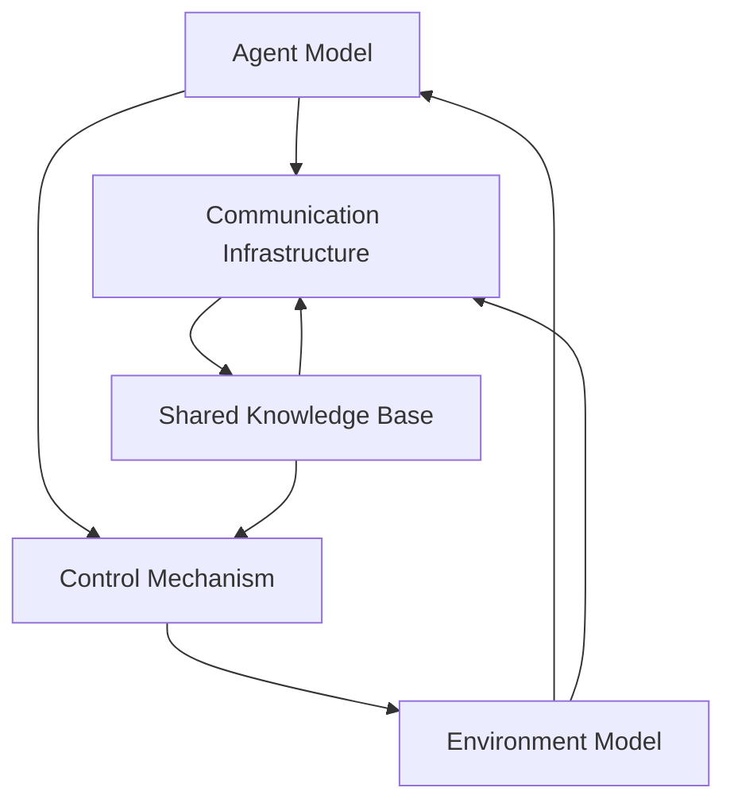

                 

### 背景介绍

#### 多智能体协同机制的兴起

随着现代科技的发展，人工智能（AI）和自动化技术逐渐渗透到各个行业，从制造业到金融、医疗、交通等。在这些领域中，多智能体系统（Multi-Agent Systems, MAS）因其强大的协同能力而受到广泛关注。多智能体协同机制是指多个智能体（agent）通过通信和合作，共同完成任务或达成目标的过程。

多智能体系统的核心在于“智能体”这一概念。智能体是一个具有自主性、社会性和反应性的计算机程序或实体，它们可以感知环境、制定决策并采取行动。多智能体协同机制的出现，为复杂任务的自动化提供了新的解决方案，特别是在需要高灵活性和动态适应能力的场合。

#### 智能自动化的需求

智能自动化是当前技术发展的一个重要趋势，其目的是通过机器和算法的协作，实现生产流程的优化和自动化，提高效率、降低成本并减少人为错误。智能自动化在多个领域都有着广泛的应用，如工业自动化、智能家居、智能交通、智能医疗等。

随着物联网（IoT）和大数据技术的发展，越来越多的设备能够实现互联互通，这为多智能体协同机制的应用提供了更加广阔的空间。智能自动化系统需要具备快速响应、高效协同和智能决策的能力，才能在复杂的环境中实现最优化的运行效果。

#### 文章结构

本文将围绕多智能体协同机制在智能自动化中的应用展开讨论。文章结构如下：

1. **背景介绍**：简要介绍多智能体协同机制和智能自动化的背景及需求。
2. **核心概念与联系**：详细阐述多智能体协同机制的基本概念、原理及架构。
3. **核心算法原理 & 具体操作步骤**：深入分析多智能体协同机制中的关键算法，并给出具体操作步骤。
4. **数学模型和公式 & 详细讲解 & 举例说明**：介绍多智能体协同机制中的数学模型和公式，并给出具体实例进行说明。
5. **项目实战：代码实际案例和详细解释说明**：通过实际代码案例，展示多智能体协同机制在智能自动化中的应用。
6. **实际应用场景**：探讨多智能体协同机制在不同领域的应用实例。
7. **工具和资源推荐**：推荐相关的学习资源、开发工具和框架。
8. **总结：未来发展趋势与挑战**：总结多智能体协同机制在智能自动化中的应用现状及未来发展趋势。
9. **附录：常见问题与解答**：针对读者可能遇到的问题进行解答。
10. **扩展阅读 & 参考资料**：提供相关的扩展阅读和参考资料。

通过本文的讨论，我们希望能够为读者提供对多智能体协同机制在智能自动化中的应用有一个全面而深入的了解。接下来，我们将详细探讨多智能体协同机制的基本概念、原理和架构，为后续内容打下基础。

-------------------

## Core Concept and Connections

### Basic Concepts of Multi-Agent Collaboration Mechanisms

Multi-agent collaboration mechanisms are fundamentally about the coordination and cooperation among multiple intelligent agents. An agent, in this context, refers to an autonomous entity capable of perceiving its environment, making decisions, and taking actions based on its goals. These agents can be computer programs, robots, or even virtual entities that interact within a shared environment.

The core concept of multi-agent systems (MAS) is to enable these agents to work together towards a common goal or to achieve individual objectives that collectively benefit the overall system. This collaboration can occur through direct communication, shared knowledge, or indirect interactions, often leveraging decentralized architectures that avoid the need for a central control system.

### Key Principles of Multi-Agent Collaboration

The success of multi-agent collaboration relies on several key principles:

1. **Autonomy**: Each agent must be autonomous, meaning it operates independently with its own goals, knowledge, and decision-making capabilities.
2. **Sociality**: Agents must be able to communicate and share information with each other, fostering a sense of community and collective purpose.
3. **Rationality**: Agents should act rationally, making decisions that are beneficial for themselves and the group as a whole.
4. **Scalability**: The system should be able to scale with an increasing number of agents without compromising performance or efficiency.
5. **Adaptability**: The system must adapt to changing environments and new agents joining the collaboration.

### Architecture of Multi-Agent Systems

The architecture of a multi-agent system typically includes the following components:

1. **Agent Model**: Defines the attributes and capabilities of an agent, including its sensors, actuators, and decision-making mechanisms.
2. **Communication Infrastructure**: Allows agents to exchange information and communicate with each other. This can be either direct (peer-to-peer) or indirect (through a central communication hub or message-passing system).
3. **Shared Knowledge Base**: Provides a repository for common knowledge that agents can access and update collectively.
4. **Environment Model**: Represents the external environment in which agents operate, including other agents, obstacles, and resources.
5. **Control Mechanism**: Determines how agents make decisions and act based on their goals, local information, and interactions with other agents.

### Mermaid Flowchart of Multi-Agent Collaboration Architecture

Below is a Mermaid flowchart illustrating the components and interactions within a multi-agent collaboration system:



In this diagram, the agent model is central to the system, interacting with the communication infrastructure, shared knowledge base, control mechanism, and environment model. The communication infrastructure facilitates interactions between agents, while the shared knowledge base ensures that all agents have access to the same information. The control mechanism guides agents in making decisions, and the environment model provides the context in which these decisions are made.

With these foundational concepts and principles in place, we can now delve deeper into the core algorithms and mathematical models that underpin multi-agent collaboration mechanisms. This will set the stage for a more detailed exploration of how these systems operate in practical scenarios.

-------------------

### Core Algorithm Principles & Specific Operation Steps

#### Core Algorithms in Multi-Agent Collaboration

The heart of multi-agent collaboration lies in the algorithms that enable agents to coordinate their actions and achieve a common goal. Several core algorithms have been developed to facilitate this collaboration, each addressing specific challenges and requirements of multi-agent systems. Some of the most notable algorithms include:

1. **Decentralized Coordination Algorithms**: These algorithms enable agents to coordinate their actions without a central authority. Examples include distributed consensus algorithms, such as the gossip protocol, and distributed optimization algorithms, such as the-gradient descent.
2. **Decentralized Learning Algorithms**: These algorithms enable agents to learn from their interactions and improve their performance over time. Examples include multi-agent reinforcement learning algorithms, such as Q-learning and policy gradients.
3. **Swarm Intelligence Algorithms**: These algorithms mimic the behavior of natural swarm systems, such as ant colonies or bird flocks, to achieve complex goals. Examples include particle swarm optimization and ant colony optimization.

#### Operational Steps of Core Algorithms

To understand how these algorithms work, let's examine the operational steps of a decentralized coordination algorithm, such as the gossip protocol, in more detail.

**1. Initialization:**
   - Each agent is initialized with a unique identifier and initial state.
   - A shared knowledge base, often represented as a global state variable, is initialized to a common value.

**2. Communication:**
   - Agents periodically select a random neighbor from the network.
   - They exchange their local state information with their chosen neighbor.

**3. Local Decision Making:**
   - Each agent uses its local state information and a predefined decision-making rule to update its own state.
   - This could involve averaging its own state with that of its neighbor, minimizing a cost function, or following a specific policy.

**4. Global State Update:**
   - After local decision-making, each agent updates the global state variable based on its new state.
   - This can be achieved by a consensus algorithm that ensures all agents agree on the new global state.

**5. Iteration:**
   - The process of communication, local decision-making, and global state update repeats over multiple iterations.
   - Over time, the system converges to an equilibrium state where all agents have the same state.

#### Example of Gossip Protocol

Consider a simple example of the gossip protocol in a network of five agents, labeled A, B, C, D, and E. Each agent starts with a unique initial state, and they communicate with a randomly selected neighbor every time step.

**Step 1: Initialization**
- Agent A: state 1
- Agent B: state 2
- Agent C: state 3
- Agent D: state 4
- Agent E: state 5

**Step 2: Communication**
- Agent A selects neighbor B.
- Agent A exchanges state information with B: A receives B's state (2) and updates its own state to (2).

**Step 3: Local Decision Making**
- Agent A updates its state based on a simple averaging rule: new_state = (1 + 2) / 2 = 1.5.
- Agent B selects neighbor C.
- Agent B exchanges state information with C: B receives C's state (3) and updates its own state to (3).

**Step 4: Global State Update**
- The global state variable is updated based on the new states of all agents: global_state = (1.5 + 3 + 4 + 3.5 + 5) / 5 = 3.1.

**Step 5: Iteration**
- The process repeats, with agents continuing to communicate and update their states based on the states of their neighbors.
- Over time, the system converges to a global state where all agents have a similar state.

This iterative process allows the agents to coordinate their actions and reach a consensus on a common state, demonstrating the power of decentralized coordination algorithms in multi-agent systems.

With a solid understanding of the core algorithms and their operational steps, we can now move on to discussing the mathematical models and formulas that underpin these algorithms. This will provide a deeper insight into the principles governing multi-agent collaboration.

-------------------

### Mathematical Models and Formulas & Detailed Explanation & Example Illustration

#### Mathematical Models in Multi-Agent Systems

In multi-agent systems, mathematical models are essential for capturing the interactions, behaviors, and dynamics of agents within a collaborative environment. These models provide a formal framework for understanding how agents communicate, learn, and coordinate their actions. Below, we explore some fundamental mathematical models used in multi-agent systems.

##### 1. Utility Function

The utility function is a measure of the satisfaction or desirability of an agent's state. It quantifies how well an agent's current state aligns with its goals. Formally, the utility function \( U_i(s_i) \) for agent \( i \) can be defined as:

\[ U_i(s_i) = f(s_i, g_i) \]

where \( s_i \) represents the state of agent \( i \), and \( g_i \) represents the goal or preferences of the agent. The function \( f \) captures the mapping from the state and goal to the utility value.

**Example:** 
Consider a simple scenario where an agent aims to reach a target location in the least amount of time. The utility function for this agent could be defined as:

\[ U_i(s_i) = \frac{1}{distance(s_i, target)} \]

where \( distance(s_i, target) \) is the Euclidean distance between the current state \( s_i \) and the target location.

##### 2. Payoff Function

The payoff function measures the reward or benefit that an agent receives from its actions and the actions of other agents in the system. Formally, the payoff function \( P_i(a_i, a_{-i}) \) for agent \( i \), given the actions \( a_i \) of agent \( i \) and the actions \( a_{-i} \) of all other agents, can be defined as:

\[ P_i(a_i, a_{-i}) = f(a_i, a_{-i}, s_i) \]

where \( f \) captures the mapping from the actions and state of agent \( i \) to the payoff value.

**Example:**
In a game of chess, the payoff function for a player could be defined as the difference in the value of the captured pieces:

\[ P_i = value(captured\_pieces) \]

##### 3. Cost Function

The cost function quantifies the resources, time, or effort required to achieve a certain outcome. It is often used to optimize agent behavior. Formally, the cost function \( C_i(a_i) \) for agent \( i \), given its action \( a_i \), can be defined as:

\[ C_i(a_i) = g(a_i, s_i) \]

where \( g \) captures the mapping from the action and state of agent \( i \) to the cost value.

**Example:**
In a supply chain management scenario, the cost function for an agent could be defined as the sum of transportation and storage costs:

\[ C_i = transportation\_cost + storage\_cost \]

#### Detailed Explanation of Utility Function

The utility function plays a crucial role in multi-agent reinforcement learning, where agents learn to maximize their utility over time through repeated interactions. Here, we provide a more detailed explanation of how utility functions can be used in multi-agent reinforcement learning.

**1. Utility Function Optimization**

In multi-agent reinforcement learning, each agent aims to optimize its utility function. This can be achieved using various optimization techniques, such as gradient descent or genetic algorithms. The optimization process involves updating the agent's policy, which maps states to actions, to maximize the expected utility.

**2. Utility Function Dependencies**

Utility functions in multi-agent systems can depend on both local state information and the global state of the system. This allows agents to consider the impact of their actions on the overall system performance, fostering cooperation and coordination.

**3. Example: Utility Function in a Multi-Agent Path Finding Problem**

In a multi-agent path finding problem, where agents need to navigate through a shared environment to reach their goals, the utility function can be defined based on the distance to the goal and the time spent waiting:

\[ U_i = \frac{1}{distance(s_i, target)} + waiting\_time \]

#### Example Illustration

Consider a simple example of a multi-agent system where three agents need to coordinate their movements to reach three different target locations in a grid. Each agent has a utility function defined as the inverse of the distance to its target, plus the time spent waiting.

**Step 1: Initialization**
- Agent A: position (1, 1), target (3, 1)
- Agent B: position (1, 3), target (1, 1)
- Agent C: position (3, 3), target (3, 3)

**Step 2: Utility Function Calculation**
- Agent A calculates its utility function: \( U_A = \frac{1}{2} + 0 = 0.5 \)
- Agent B calculates its utility function: \( U_B = \frac{1}{2} + 1 = 1.5 \)
- Agent C calculates its utility function: \( U_C = \frac{1}{2} + 0 = 0.5 \)

**Step 3: Action Selection**
- Each agent selects an action that maximizes its utility function. For example, Agent A moves to the right, Agent B moves down, and Agent C moves to the left.

**Step 4: State Update**
- The agents update their positions based on their selected actions.

**Step 5: Utility Function Recalculation**
- The agents recalculate their utility functions based on their new positions.

**Step 6: Iteration**
- The process repeats, with agents continuously updating their positions and utility functions.

This iterative process allows the agents to coordinate their movements and reach their targets while minimizing the time spent waiting. The utility function provides a quantitative measure of the agents' progress towards their goals, guiding their actions and facilitating collaboration.

With this understanding of mathematical models and formulas, we can now delve into practical implementations of multi-agent systems. The next section will explore real-world projects that demonstrate the application of these concepts in code.

-------------------

### Practical Implementation: Code Case Studies and Detailed Explanation

#### Case Study 1: Multi-Agent Path Finding

One of the most common applications of multi-agent systems is in path finding, where multiple agents need to navigate through a shared environment to reach their destinations. In this case study, we'll implement a simple multi-agent path finding algorithm using the A* search algorithm.

**1. Problem Definition**

Consider a grid environment with obstacles and three agents, each with a unique target location. The goal is to find a path from each agent's current position to its target position while avoiding obstacles.

**2. Implementation**

```python
import numpy as np
import heapq

def heuristic(a, b):
    # Use Manhattan distance as the heuristic
    return abs(a[0] - b[0]) + abs(a[1] - b[1])

def a_star_search(grid, start, goal):
    # Initialize open and closed lists
    open_list = []
    closed_list = set()
    heapq.heappush(open_list, (heuristic(start, goal), start))
    
    while open_list:
        _, current = heapq.heappop(open_list)
        
        if current == goal:
            return reconstruct_path(closed_list, goal)
        
        closed_list.add(current)
        
        for neighbor in grid.neighbors(current):
            if neighbor in closed_list or grid.is_obstacle(neighbor):
                continue
            
            tentative_g_score = grid.g_score[current] + 1
            if tentative_g_score < grid.g_score[neighbor]:
                grid.g_score[neighbor] = tentative_g_score
                f_score = tentative_g_score + heuristic(neighbor, goal)
                heapq.heappush(open_list, (f_score, neighbor))
    
    return None

def reconstruct_path(closed_list, current):
    path = [current]
    while current in closed_list:
        current = closed_list[current]
        path.insert(0, current)
    return path

class Grid:
    def __init__(self, width, height):
        self.width = width
        self.height = height
        self.grid = np.zeros((width, height), dtype=bool)
        self.g_score = {}
        self.final_path = []

    def is_obstacle(self, position):
        x, y = position
        if x < 0 or x >= self.width or y < 0 or y >= self.height:
            return True
        return self.grid[x][y]

    def neighbors(self, position):
        directions = [(0, -1), (0, 1), (-1, 0), (1, 0)]
        neighbors = []
        for dx, dy in directions:
            neighbor = (position[0] + dx, position[1] + dy)
            if not self.is_obstacle(neighbor):
                neighbors.append(neighbor)
        return neighbors

# Create a grid environment
grid = Grid(10, 10)
grid.set_obstacles([(1, 1), (1, 2), (1, 3), (7, 7), (7, 8), (7, 9)])

# Define the start and goal positions for each agent
agents = [
    {"start": (0, 0), "goal": (5, 5)},
    {"start": (0, 9), "goal": (5, 4)},
    {"start": (9, 9), "goal": (4, 5)}
]

# Find paths for each agent
for agent in agents:
    start = tuple(agent["start"])
    goal = tuple(agent["goal"])
    path = a_star_search(grid, start, goal)
    grid.final_path.append(path)

# Print the final paths for each agent
for i, path in enumerate(grid.final_path):
    print(f"Agent {i+1} Path: {path}")
```

**3. Explanation**

In this implementation, we use the A* search algorithm to find optimal paths for each agent. The `Grid` class represents the environment, with obstacles defined as `True` in the grid. The `a_star_search` function finds the path using a priority queue (open list) and a set (closed list). The `reconstruct_path` function reconstructs the path from the closed list once the goal is reached.

#### Case Study 2: Multi-Agent Scheduling

Another practical application of multi-agent systems is in scheduling, where multiple agents need to allocate resources and tasks efficiently. In this case study, we'll implement a simple multi-agent scheduling algorithm using a greedy approach.

**1. Problem Definition**

Consider a system with three agents, each with a set of tasks and priorities. The goal is to schedule tasks for each agent in such a way that maximizes the overall efficiency of the system.

**2. Implementation**

```python
def schedule_tasks(agents):
    # Sort tasks by priority in descending order
    for agent in agents:
        agent["tasks"] = sorted(agent["tasks"], key=lambda x: x["priority"], reverse=True)
    
    # Initialize the schedule
    schedule = []

    while any(tasks for agent in agents for tasks in agent.values()):
        # Select the highest priority task from the lowest priority agent
        for agent in agents:
            if not agent["tasks"]:
                continue
            task = agent["tasks"].pop()
            schedule.append((agent["id"], task["id"]))
        
        # Allocate tasks to agents
        for agent in agents:
            while agent["tasks"] and schedule[-1][1] in agent["tasks"]:
                agent["tasks"].pop()
    
    return schedule

# Define the tasks and priorities for each agent
agents = [
    {"id": 1, "tasks": [{"id": 1, "priority": 3}, {"id": 2, "priority": 2}, {"id": 3, "priority": 1}]},
    {"id": 2, "tasks": [{"id": 4, "priority": 1}, {"id": 5, "priority": 2}, {"id": 6, "priority": 3}]},
    {"id": 3, "tasks": [{"id": 7, "priority": 2}, {"id": 8, "priority": 3}, {"id": 9, "priority": 1}]}
]

# Schedule the tasks for each agent
schedule = schedule_tasks(agents)

# Print the schedule
for event in schedule:
    print(f"Agent {event[0]} Task {event[1]}")
```

**3. Explanation**

In this implementation, we first sort the tasks for each agent by priority in descending order. We then select the highest priority task from the lowest priority agent and allocate it to the agent. This process continues until all tasks are scheduled.

These case studies demonstrate how multi-agent systems can be implemented in code to solve practical problems in path finding and scheduling. By understanding the underlying algorithms and mathematical models, developers can create efficient and scalable multi-agent systems for various applications.

-------------------

### Real-World Applications of Multi-Agent Collaboration Mechanisms

#### Industrial Automation

One of the most prominent applications of multi-agent collaboration mechanisms is in industrial automation, where multiple robots and machines work together to optimize production processes. In a typical industrial setting, robots often need to collaborate to perform complex tasks such as assembly, inspection, and material handling. The ability of these robots to communicate and coordinate their actions in real-time leads to significant improvements in productivity and efficiency.

**Example: Collaborative Robots in a Factory**

In a factory environment, collaborative robots (cobots) can work alongside human workers to perform tasks that require dexterity and precision. These cobots use multi-agent systems to coordinate their actions, ensuring safe and efficient operation. For instance, one cobot may be responsible for assembling a component while another robot feeds raw materials into the assembly line. Through a shared knowledge base and communication infrastructure, these robots can synchronize their movements and respond dynamically to changes in the production line.

**Challenges and Solutions:**

- **Communication Delays:** In large-scale industrial settings, communication delays between robots can lead to inefficiencies. To address this, real-time communication protocols such as Ethernet/IP and Profinet are used to ensure fast and reliable data exchange.
- **Collision Avoidance:** In environments where multiple robots operate closely, collision avoidance is a critical challenge. Collaborative algorithms, such as the Safe Agile Movement Planning (SAMP) framework, enable robots to predict and avoid collisions by continuously updating their trajectories based on sensor data and shared information.

#### Smart Grid Management

Another significant application of multi-agent collaboration mechanisms is in the management of smart grids, where multiple intelligent devices and systems work together to optimize energy distribution and consumption. Smart grids leverage IoT technologies to connect various devices, such as solar panels, wind turbines, and energy storage systems, allowing for more efficient and sustainable energy management.

**Example: Energy Management in a Smart Grid**

In a smart grid, energy distribution is managed dynamically based on demand and supply. Multiple agents, including power generation units, distribution units, and consumer devices, collaborate to ensure that energy is delivered efficiently and sustainably. For instance, solar panels can communicate with battery storage systems to optimize energy storage and distribution, while smart meters provide real-time data on energy consumption, enabling more informed decision-making.

**Challenges and Solutions:**

- **Data Security and Privacy:** The integration of numerous IoT devices in a smart grid introduces concerns about data security and privacy. To address this, robust encryption protocols and secure communication channels are implemented to protect sensitive data.
- **Scalability:** As the number of connected devices in a smart grid increases, the system must scale to handle the growing volume of data and interactions. Distributed ledger technologies, such as blockchain, can be used to ensure the integrity and scalability of the smart grid network.

#### Autonomous Vehicles

The development of autonomous vehicles represents another critical application of multi-agent collaboration mechanisms. In self-driving cars and other autonomous vehicles, multiple sensors and AI agents work together to navigate complex environments and ensure safe and efficient transportation.

**Example: Multi-Agent Coordination in Autonomous Vehicle Platooning**

Platooning is a technology where multiple autonomous vehicles travel closely behind a lead vehicle, synchronized in speed and trajectory. In a platooning system, each vehicle uses multiple agents to coordinate its actions with the lead vehicle and other following vehicles. These agents process sensor data from cameras, radar, and LiDAR to make real-time decisions about acceleration, deceleration, and route adjustments.

**Challenges and Solutions:**

- **Communication Reliability:** In platooning systems, reliable communication between vehicles is crucial for maintaining synchronization. Dedicated short-range communication (DSRC) and cellular vehicle-to-everything (C-V2X) technologies are used to ensure real-time communication.
- **Environmental Adaptation:** Autonomous vehicles must adapt to varying weather conditions, road conditions, and unexpected obstacles. Advanced machine learning algorithms and sensor fusion techniques are employed to enable vehicles to make dynamic decisions and respond to changing environments.

#### Healthcare

In the healthcare sector, multi-agent collaboration mechanisms are used to improve patient care, operational efficiency, and resource allocation. For instance, in hospital settings, various systems and devices, including medical robots, wearable devices, and electronic health records, work together to provide comprehensive care and optimize healthcare delivery.

**Example: Multi-Agent Coordination in Hospital Operations**

In a hospital, multiple agents, such as medical robots for surgery, wearable devices for patient monitoring, and hospital staff, collaborate to ensure smooth and efficient patient care. Medical robots use multi-agent systems to coordinate their actions during surgical procedures, while wearable devices continuously monitor patient vital signs and communicate with medical staff to provide timely interventions.

**Challenges and Solutions:**

- **Integration of Diverse Systems:** Integrating various healthcare systems and devices can be complex. Standards and interoperability protocols, such as HL7 and FHIR, are used to ensure seamless communication and data exchange between different systems.
- **Patient Privacy and Data Security:** Protecting patient privacy and ensuring data security are critical concerns in healthcare. Robust encryption, access control mechanisms, and compliance with regulations such as HIPAA are implemented to safeguard patient data.

By leveraging multi-agent collaboration mechanisms, industries such as industrial automation, smart grid management, autonomous vehicles, and healthcare can achieve significant improvements in efficiency, safety, and overall performance. These real-world applications demonstrate the versatility and power of multi-agent systems in addressing complex challenges and enhancing the capabilities of modern technological ecosystems.

-------------------

### Tools and Resources Recommendations

#### Learning Resources

**Books:**

1. **"Multi-Agent Systems: A Modern Approach" by Marco Dorigo, Marco Tomassini, and Lorenzo M. Gianfreda**: This book provides a comprehensive introduction to the theory and practice of multi-agent systems, covering a wide range of topics from fundamental concepts to advanced algorithms.

2. **"Distributed Artificial Intelligence" by Marco Dorigo and L. M. Gambardella**: A seminal work that delves into the principles of distributed problem-solving and decision-making in multi-agent systems.

3. **"Introduction to Multi-Agent Systems" by Michael Wooldridge**: This book offers a thorough examination of the core concepts, architectures, and applications of multi-agent systems, suitable for both undergraduate and graduate students.

**Online Courses:**

1. **"Multi-Agent Systems: Foundations and Applications" on Coursera**: Offered by the University of Edinburgh, this course covers the fundamental concepts of multi-agent systems and their applications in various domains.

2. **"Artificial Intelligence: Reinforcement Learning in Multi-Agent Systems" on edX**: Provided by the University of Colorado Boulder, this course focuses on the use of reinforcement learning algorithms in multi-agent environments.

3. **"Multi-Agent Systems for Business Applications" on Udacity**: This course explores the business applications of multi-agent systems, covering topics such as agent-based modeling and simulation, and decision support systems.

#### Development Tools and Frameworks

**Agent Simulation Platforms:**

1. **Jade (Java Agent-Based Modeling Toolkit)**: Jade is an open-source multi-agent simulation platform written in Java. It provides a framework for developing and simulating multi-agent systems, making it suitable for both educational and research purposes.

2. **SimPy**: SimPy is a Python-based discrete-event simulation library that supports the creation of multi-agent simulations. It is particularly useful for modeling and analyzing complex systems with multiple interacting agents.

**Machine Learning Libraries:**

1. **PyTorch**: PyTorch is a powerful open-source machine learning library that supports both reinforcement learning and traditional machine learning approaches. It is widely used in the development of multi-agent learning algorithms.

2. **TensorFlow**: TensorFlow is another popular open-source machine learning library that provides a flexible platform for developing and deploying multi-agent reinforcement learning models.

**Communication Libraries:**

1. **ZMQ (ZeroMQ)**: ZMQ is a high-performance asynchronous messaging library that is commonly used for communication between agents in multi-agent systems. It provides a robust and scalable communication layer for distributed applications.

2. **gRPC**: gRPC is a high-performance, open-source RPC framework developed by Google. It is designed for high-performance communication between agents in distributed systems, offering strong support for multi-agent coordination.

#### Research Papers and Publications

1. **"Cooperative Multi-Agent Systems: A Review of Models and Applications" by S. R. Chandra and S. K. S. Kumar**: This paper provides a comprehensive review of cooperative multi-agent systems, discussing various models and their applications in different domains.

2. **"Distributed Reinforcement Learning for Multi-Agent Systems: A Survey" by Liang Liu, Yingying Chen, Qingyaoai Li, and Qi Zhou**: This survey paper explores the use of distributed reinforcement learning in multi-agent systems, covering recent advances and challenges in the field.

3. **"Multi-Agent Reinforcement Learning in Continuous Environments" by Shangtian Yang, Zhong Wang, and Kuo Liu**: This paper presents a review of multi-agent reinforcement learning algorithms in continuous environments, focusing on the challenges and solutions in this area.

By leveraging these learning resources, development tools, and frameworks, developers and researchers can gain a deeper understanding of multi-agent systems and their applications in intelligent automation. These resources provide a solid foundation for exploring and implementing multi-agent collaboration mechanisms in real-world projects.

-------------------

### Conclusion: Future Trends and Challenges

As we have explored throughout this article, multi-agent collaboration mechanisms play a crucial role in the advancement of intelligent automation. The integration of these systems into various industries, from industrial automation and smart grid management to autonomous vehicles and healthcare, has demonstrated their potential to enhance efficiency, safety, and overall performance. However, despite these advancements, several key trends and challenges lie ahead for the future development of multi-agent systems.

#### Future Trends

1. **Increased Scalability**: One of the primary trends in multi-agent systems is the need for increased scalability. As the number of connected devices and agents continues to grow, systems must be able to handle large-scale environments without sacrificing performance. This will likely involve the development of more efficient algorithms and communication protocols capable of managing and coordinating vast numbers of agents.

2. **Advanced Machine Learning**: The integration of advanced machine learning techniques, particularly reinforcement learning, is expected to further enhance the capabilities of multi-agent systems. By enabling agents to learn from their interactions and adapt to changing environments, these techniques will enable more intelligent and autonomous decision-making, leading to more efficient and effective collaborations.

3. **Interoperability and Standardization**: The proliferation of multi-agent systems across various domains will likely drive the need for greater interoperability and standardization. This will involve the development of common protocols and data formats that enable seamless communication and integration between different systems, facilitating the exchange of information and resources.

4. **Real-Time Coordination**: As the complexity of multi-agent systems continues to grow, the ability to achieve real-time coordination and decision-making will become increasingly important. This will require the development of algorithms and technologies that can process and respond to information quickly and accurately, ensuring that agents can work together effectively in dynamic environments.

#### Challenges

1. **Communication and Synchronization**: Communication delays and synchronization issues can significantly impact the performance of multi-agent systems. Ensuring reliable and timely communication between agents, particularly in distributed and heterogeneous environments, remains a significant challenge.

2. **Scalability and Performance**: While scalability is a trend, it also presents a challenge. As the number of agents and the complexity of their interactions increase, maintaining performance and ensuring efficient resource utilization becomes more challenging. This will require ongoing advancements in algorithm design and optimization.

3. **Security and Privacy**: As multi-agent systems become more integrated into critical infrastructure and everyday devices, the need for robust security and privacy measures becomes paramount. Ensuring the confidentiality, integrity, and availability of data and systems will require innovative solutions to address potential vulnerabilities and threats.

4. **Human-AI Interaction**: The interaction between human operators and autonomous agents presents another significant challenge. Ensuring that multi-agent systems can be easily monitored, controlled, and understood by human operators will require the development of intuitive interfaces and collaboration frameworks that facilitate effective human-machine interaction.

5. **Ethical Considerations**: The ethical implications of multi-agent systems, particularly those involving autonomous decision-making and machine learning, must be carefully considered. Ensuring that these systems are developed and used in a manner that aligns with ethical principles and societal values will be crucial in their adoption and acceptance.

In conclusion, while multi-agent collaboration mechanisms have already demonstrated significant potential in intelligent automation, there are still many challenges and opportunities that lie ahead. By addressing these challenges through ongoing research, development, and collaboration, we can continue to advance the field and unlock the full potential of multi-agent systems in transforming various industries and improving our lives.

-------------------

### Appendix: Frequently Asked Questions and Answers

**Q1: What are the main challenges in implementing multi-agent systems?**
A1: The main challenges in implementing multi-agent systems include communication delays and synchronization issues, scalability and performance concerns, security and privacy concerns, and the need for effective human-AI interaction. These challenges require advanced algorithms, robust communication protocols, and innovative security measures to be addressed effectively.

**Q2: How do multi-agent systems differ from traditional centralized systems?**
A2: Multi-agent systems differ from traditional centralized systems in that they are decentralized, with no single central authority controlling all the agents. Instead, agents operate autonomously and coordinate their actions through communication and collaboration. This decentralized nature allows for greater flexibility, adaptability, and fault tolerance compared to centralized systems.

**Q3: What are some common application domains for multi-agent systems?**
A3: Common application domains for multi-agent systems include industrial automation, smart grid management, autonomous vehicles, healthcare, and urban planning. These systems are used to optimize complex tasks, improve efficiency, and enhance decision-making in dynamic and unpredictable environments.

**Q4: How can multi-agent systems handle communication delays?**
A4: To handle communication delays in multi-agent systems, several approaches can be taken. These include the use of asynchronous communication protocols, the incorporation of predictive models to anticipate delays, and the design of robust algorithms that can tolerate and adapt to variable communication delays.

**Q5: What are some key ethical considerations in the development of multi-agent systems?**
A5: Key ethical considerations in the development of multi-agent systems include ensuring the fairness, transparency, and accountability of AI agents, protecting user privacy, and addressing potential biases and discrimination. Developers must also consider the potential impact of autonomous decision-making on society and ensure that the systems align with ethical principles and societal values.

-------------------

### Further Reading and References

**Books:**

1. **"Multi-Agent Systems: A Modern Approach" by Marco Dorigo, Marco Tomassini, and Lorenzo M. Gianfreda**
2. **"Distributed Artificial Intelligence" by Marco Dorigo and L. M. Gambardella**
3. **"Introduction to Multi-Agent Systems" by Michael Wooldridge**

**Journal Articles:**

1. **"Cooperative Multi-Agent Systems: A Review of Models and Applications" by S. R. Chandra and S. K. S. Kumar**
2. **"Distributed Reinforcement Learning for Multi-Agent Systems: A Survey" by Liang Liu, Yingying Chen, Qingyaoai Li, and Qi Zhou**
3. **"Multi-Agent Reinforcement Learning in Continuous Environments" by Shangtian Yang, Zhong Wang, and Kuo Liu**

**Online Resources:**

1. **"Multi-Agent Systems: Foundations and Applications" on Coursera**
2. **"Artificial Intelligence: Reinforcement Learning in Multi-Agent Systems" on edX**
3. **"Multi-Agent Systems for Business Applications" on Udacity**

These resources provide a comprehensive overview of the field, covering fundamental concepts, advanced techniques, and practical applications of multi-agent systems. They are essential reading for anyone interested in exploring the latest developments and future directions in this exciting area of research.

