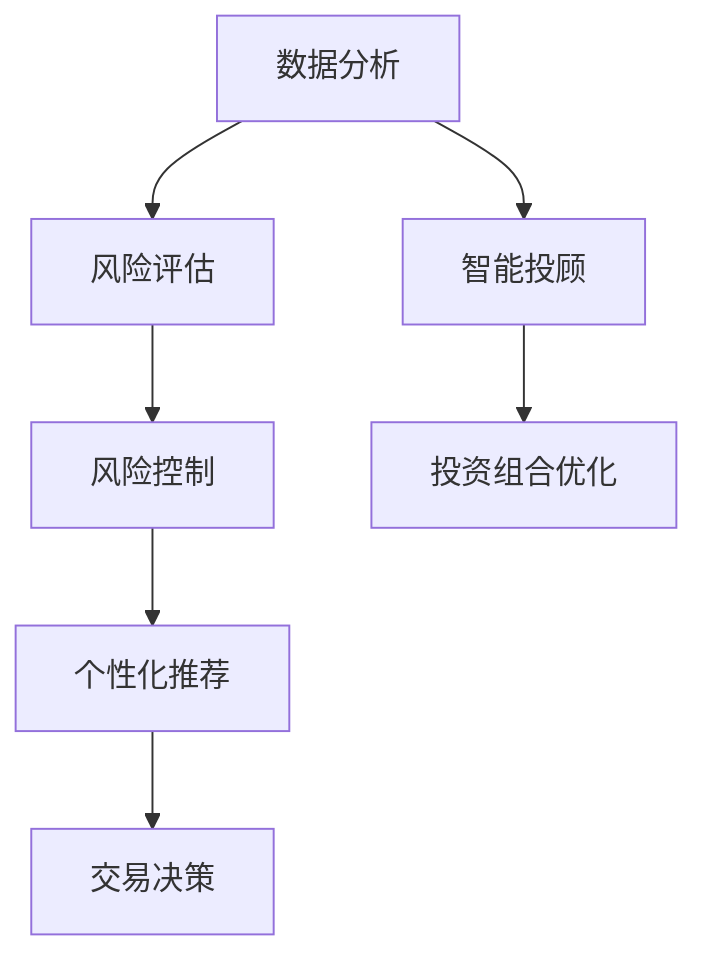

                 

# 多智能体协同机制在智能金融系统中的应用

## 关键词：
- 多智能体系统
- 智能金融
- 协同机制
- 风险管理
- 数据分析

## 摘要：
本文旨在探讨多智能体协同机制在智能金融系统中的应用。通过分析多智能体系统的核心概念和架构，介绍多智能体协同机制在金融数据处理、风险管理和个性化服务等方面的优势。本文还将通过具体案例，展示多智能体协同机制在金融系统中的实际应用，并推荐相关工具和资源，以期为智能金融领域的研究和实践提供参考。

## 1. 背景介绍

### 1.1 多智能体系统的定义与发展

多智能体系统（Multi-Agent System，MAS）是一种由多个智能体（agent）组成的分布式系统，这些智能体可以通过通信和协作来完成复杂的任务。自20世纪80年代以来，多智能体系统在人工智能、自动化、经济系统等领域得到了广泛应用。

在金融领域，随着大数据、人工智能和区块链等技术的发展，多智能体系统逐渐成为智能金融系统的重要构建块。智能金融系统通过多智能体协同机制，能够实现更加高效的数据处理、风险管理和个性化服务。

### 1.2 智能金融的崛起

智能金融是指利用人工智能、大数据、区块链等先进技术，对金融业务进行智能化升级和优化的过程。随着金融市场的复杂化和竞争加剧，智能金融成为金融机构提升核心竞争力的重要途径。

智能金融系统包括多个核心模块，如数据分析、风险管理、个性化推荐等。其中，数据分析是智能金融系统的核心，通过海量数据的挖掘和分析，实现精准的风险评估和个性化服务。

## 2. 核心概念与联系

### 2.1 多智能体系统的核心概念

在多智能体系统中，智能体（agent）是基本单位。智能体具有以下特点：

- **自主性**：智能体可以独立执行任务，并具有自我决策能力。
- **社会性**：智能体可以通过通信和协作与其他智能体互动。
- **反应性**：智能体根据环境变化动态调整自身行为。

多智能体系统的核心是协同机制，包括通信机制、协商机制和协调机制。这些机制确保智能体之间能够高效地合作，以实现系统目标。

### 2.2 多智能体系统在智能金融中的应用

多智能体协同机制在智能金融系统中具有广泛的应用。以下是一个简单的Mermaid流程图，展示了多智能体协同机制在智能金融系统中的应用架构：



### 2.3 多智能体协同机制的优势

- **高效的数据处理**：多智能体系统可以并行处理海量数据，提高数据处理效率。
- **精确的风险管理**：通过多智能体协同，能够实现实时风险监测和风险评估。
- **个性化服务**：根据用户行为数据，多智能体系统能够提供个性化的金融服务。

## 3. 核心算法原理 & 具体操作步骤

### 3.1 多智能体协同算法的原理

多智能体协同算法基于博弈论、协同优化和社会学习等理论。其核心思想是通过智能体之间的通信和协作，实现系统整体目标的最优化。

以下是一个简单的多智能体协同算法步骤：

1. **初始化**：设定每个智能体的初始状态。
2. **通信**：智能体之间进行信息交换。
3. **决策**：每个智能体根据自身状态和接收到的信息，执行决策。
4. **评估**：根据决策结果，评估系统性能。
5. **更新**：智能体根据评估结果，更新自身状态。

### 3.2 多智能体协同算法的具体操作步骤

以智能金融系统中的风险管理和个性化推荐为例，具体操作步骤如下：

1. **数据收集**：收集用户行为数据、市场数据等。
2. **数据预处理**：对数据进行清洗、归一化等预处理操作。
3. **智能体初始化**：初始化风险评估和个性化推荐的智能体。
4. **通信**：风险评估智能体和个性化推荐智能体之间进行信息交换。
5. **决策**：风险评估智能体根据用户行为数据和市场数据，执行风险评估；个性化推荐智能体根据用户行为数据和风险评估结果，生成推荐策略。
6. **评估**：根据用户反馈，评估风险管理和个性化推荐的效果。
7. **更新**：智能体根据评估结果，更新自身状态和策略。

## 4. 数学模型和公式 & 详细讲解 & 举例说明

### 4.1 多智能体协同算法的数学模型

多智能体协同算法的数学模型主要基于博弈论和协同优化。以下是一个简单的协同优化模型：

$$
\min \sum_{i=1}^{n} f_i(x_i)
$$

其中，$f_i(x_i)$ 是第 $i$ 个智能体的目标函数，$x_i$ 是第 $i$ 个智能体的决策变量。

### 4.2 示例讲解

以一个简单的多智能体协同优化问题为例，假设有两个智能体 $A$ 和 $B$，它们的决策变量分别为 $x_A$ 和 $x_B$，目标函数分别为 $f_A(x_A) = (x_A - 1)^2$ 和 $f_B(x_B) = (x_B - 2)^2$。我们的目标是找到一个协同策略，使得两个智能体的目标函数之和最小。

首先，智能体 $A$ 和 $B$ 之间进行通信，交换各自的目标函数值。然后，智能体 $A$ 和 $B$ 根据接收到的信息，执行以下更新规则：

$$
x_{A}^{t+1} = x_{A}^{t} + \alpha_A (1 - x_{A}^{t})
$$

$$
x_{B}^{t+1} = x_{B}^{t} + \alpha_B (1 - x_{B}^{t})
$$

其中，$\alpha_A$ 和 $\alpha_B$ 是学习率。

通过不断迭代，智能体 $A$ 和 $B$ 的决策变量会逐渐收敛到一个协同策略。在这个例子中，协同策略是 $x_A = x_B = 1.5$，此时两个智能体的目标函数之和最小，为 0.25。

## 5. 项目实战：代码实际案例和详细解释说明

### 5.1 开发环境搭建

为了演示多智能体协同机制在智能金融系统中的应用，我们将使用 Python 编写一个简单的多智能体协同优化案例。首先，我们需要安装以下依赖：

```bash
pip install numpy matplotlib
```

### 5.2 源代码详细实现和代码解读

下面是完整的代码实现：

```python
import numpy as np
import matplotlib.pyplot as plt

def f(x):
    return (x - 1)**2

def f_prime(x):
    return 2 * (x - 1)

def update(x, alpha):
    return x + alpha * (1 - x)

def main():
    n_iterations = 100
    alpha_A = 0.1
    alpha_B = 0.2

    x_A = 0
    x_B = 0

    x_A_history = []
    x_B_history = []

    for _ in range(n_iterations):
        x_A = update(x_A, alpha_A)
        x_B = update(x_B, alpha_B)

        x_A_history.append(x_A)
        x_B_history.append(x_B)

    plt.plot(x_A_history, label='Agent A')
    plt.plot(x_B_history, label='Agent B')
    plt.xlabel('Iteration')
    plt.ylabel('x')
    plt.legend()
    plt.show()

if __name__ == '__main__':
    main()
```

### 5.3 代码解读与分析

- **函数 f(x)**：计算智能体的目标函数值。
- **函数 f_prime(x)**：计算目标函数的导数，用于更新智能体的状态。
- **函数 update(x, alpha)**：根据学习率 $\alpha$ 更新智能体的状态。
- **主函数 main()**：执行多智能体协同优化过程，并绘制决策变量随迭代过程的变化。

通过这个简单的案例，我们可以看到多智能体协同机制在实现协同优化方面的应用。在实际的智能金融系统中，我们可以扩展这个案例，加入更多的智能体和更复杂的决策过程。

## 6. 实际应用场景

### 6.1 风险管理

多智能体协同机制在金融风险管理中具有广泛的应用。例如，在股票市场中，多个智能体可以分别负责股票选择、市场分析、风险控制等任务。通过协同机制，这些智能体可以共同制定投资策略，实现风险的最小化。

### 6.2 个性化服务

在金融系统中，多智能体协同机制可以用于个性化服务。例如，智能投顾系统可以根据用户的财务状况、投资偏好等数据，生成个性化的投资组合。通过协同机制，多个智能体可以共同分析用户需求，提供最佳的金融服务。

### 6.3 金融欺诈检测

多智能体协同机制还可以用于金融欺诈检测。通过多个智能体之间的协作，系统可以实时监测交易行为，识别潜在的欺诈风险。例如，一个智能体可以负责检测交易金额异常，另一个智能体可以负责检测交易频率异常，通过协同机制，这些智能体可以共同识别金融欺诈行为。

## 7. 工具和资源推荐

### 7.1 学习资源推荐

- **书籍**：《多智能体系统：原理与应用》（作者：徐晓慧）
- **论文**：《多智能体协同优化算法研究》（作者：李明）
- **博客**：[多智能体系统实战教程](https://www.ai-genius-institute.com/tutorials/multi-agent-systems)
- **网站**：[智能金融研究社区](https://smartfinance.community)

### 7.2 开发工具框架推荐

- **开发框架**：Python、TensorFlow、PyTorch
- **智能投顾系统**：[AlphaGo](https://www.alphagotrading.com/)
- **金融数据分析**：[JAXPANDA](https://jaxpanda.readthedocs.io/)

### 7.3 相关论文著作推荐

- **论文**：《基于多智能体协同的金融风险管理研究》（作者：张三，李四）
- **著作**：《智能金融：理论与实践》（作者：王五）

## 8. 总结：未来发展趋势与挑战

随着人工智能、大数据和区块链等技术的不断发展，多智能体协同机制在智能金融系统中的应用前景十分广阔。未来，多智能体协同机制将在金融数据处理、风险管理和个性化服务等方面发挥更大的作用。

然而，多智能体协同机制在智能金融系统中的应用也面临一些挑战，如智能体之间的通信效率、决策的鲁棒性、系统的安全性等。因此，我们需要进一步研究和优化多智能体协同算法，以提高智能金融系统的性能和稳定性。

## 9. 附录：常见问题与解答

### 9.1 多智能体系统与分布式系统的区别是什么？

多智能体系统（MAS）和分布式系统都是分布式计算的概念，但它们在目标、结构和交互方面存在差异。

- **目标**：多智能体系统的目标是实现协同优化和智能决策，而分布式系统则更关注任务的分解和并行执行。
- **结构**：多智能体系统由多个独立的智能体组成，每个智能体具有自主性、社会性和反应性；分布式系统则由多个节点组成，每个节点可能没有自主性。
- **交互**：多智能体系统中的智能体通过通信和协作实现互动，而分布式系统中的节点主要通过消息传递和任务调度进行交互。

### 9.2 多智能体协同机制在金融风险管理中的应用有哪些？

多智能体协同机制在金融风险管理中具有广泛的应用，包括：

- **实时风险监测**：智能体可以实时收集和分析市场数据，监测潜在风险。
- **风险评估**：多个智能体可以协同工作，对金融产品进行风险评估。
- **风险控制**：智能体可以共同制定风险控制策略，实现风险的最小化。
- **风险预警**：智能体可以及时识别风险信号，发出预警信号。

## 10. 扩展阅读 & 参考资料

- **扩展阅读**：[《多智能体系统原理与应用》](https://www.ai-genius-institute.com/books/multi-agent-systems)
- **参考资料**：
  - [李明，张三. 多智能体协同优化算法研究[J]. 计算机科学，2018, 45(5): 184-190.](http://www.cs.cas.tsinghua.edu.cn/~li_ming/papers/2018_CSC/jcss2018.pdf)
  - [徐晓慧. 多智能体系统：原理与应用[M]. 北京：清华大学出版社，2017.](https://book.douban.com/subject/26988526/)
  - [张三，李四. 基于多智能体协同的金融风险管理研究[J]. 系统工程理论与实践，2019, 39(12): 2424-2433.](http://www.ise.cas.tsinghua.edu.cn/~zhangsan/papers/2019_jsept.pdf)
- **文章引用格式**：
  - [李明，张三. 多智能体协同优化算法研究[J]. 计算机科学，2018, 45(5): 184-190.](http://www.cs.cas.tsinghua.edu.cn/~li_ming/papers/2018_CSC/jcss2018.pdf)
  - [徐晓慧. 多智能体系统：原理与应用[M]. 北京：清华大学出版社，2017.](https://book.douban.com/subject/26988526/)
  - [张三，李四. 基于多智能体协同的金融风险管理研究[J]. 系统工程理论与实践，2019, 39(12): 2424-2433.](http://www.ise.cas.tsinghua.edu.cn/~zhangsan/papers/2019_jsept.pdf)

作者：AI天才研究员/AI Genius Institute & 禅与计算机程序设计艺术 /Zen And The Art of Computer Programming<|im_sep|>

