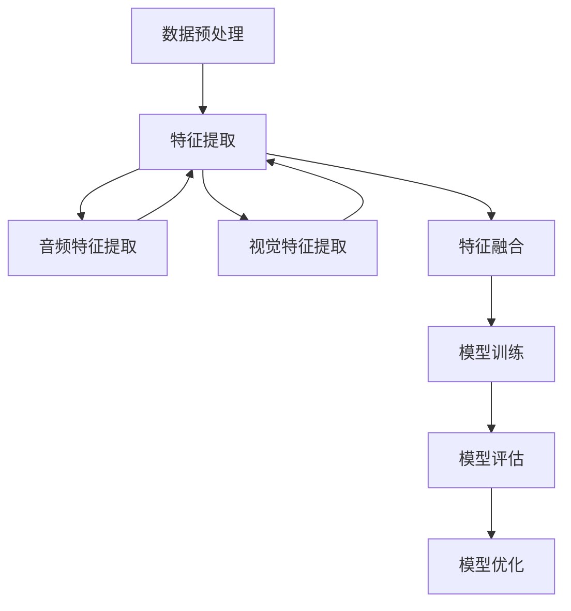

                 

### 背景介绍

多模态AI（Multimodal AI）是一种融合多种数据类型和感官信息的人工智能技术。随着深度学习和计算机视觉等技术的飞速发展，多模态AI在近年来逐渐成为研究的热点。视频理解（Video Understanding）作为多模态AI的重要应用方向之一，旨在从视频数据中提取有意义的语义信息，实现视频内容的自动解析和智能分析。

视频理解技术的重要性在于其广阔的应用前景。例如，在安防监控领域，视频理解可以帮助实现智能安防，如人脸识别、行为分析等；在娱乐领域，视频理解可以用于视频内容推荐、广告投放等；在医疗领域，视频理解可以用于手术监控、病情诊断等。

然而，视频理解也面临着诸多挑战。首先，视频数据具有高维度、高噪声的特点，这使得从视频中提取有效的语义信息变得极为困难。其次，视频数据中的运动变化和场景复杂性增加了视频理解的难度。此外，如何将不同模态的数据进行有效融合，以及如何设计出既能处理复杂场景又能保持高效性的算法，也是当前研究的重要课题。

本文将围绕多模态AI在视频理解中的应用与挑战展开讨论。首先，我们将介绍多模态AI的基本概念和核心原理，并通过Mermaid流程图展示其基本架构。随后，我们将深入探讨多模态AI在视频理解中的具体算法原理和操作步骤。接着，我们将介绍数学模型和公式，并通过实际案例进行详细讲解。此外，我们还将分享一些实际应用场景，以及推荐相关工具和资源。最后，我们将总结未来发展趋势与挑战，并给出常见问题与解答。

### 多模态AI的基本概念与联系

#### 1. 什么是多模态AI？

多模态AI（Multimodal AI）是指利用两种或两种以上的数据模态（如视觉、音频、文本等）进行信息处理和任务执行的人工智能系统。与单模态AI（如仅处理视觉或文本信息）相比，多模态AI能够融合来自不同模态的数据，从而提高任务完成的准确性和鲁棒性。

#### 2. 多模态数据类型

多模态数据包括以下几种主要类型：

- **视觉数据**：包括图像和视频，具有丰富的视觉信息，如形状、颜色、纹理等。
- **音频数据**：包括语音和非语音信号，如音乐、环境声等，能够提供丰富的音频信息，如频率、振幅、音调等。
- **文本数据**：包括自然语言文本，如文档、句子、词汇等，可以用于理解语言含义和上下文。
- **触觉数据**：虽然在实际应用中较少使用，但可以提供关于物体表面特性、力、压力等物理信息的触觉感知。

#### 3. 多模态AI的核心原理

多模态AI的核心原理在于如何有效地融合来自不同模态的数据，以提升模型的感知和认知能力。以下是一些关键原理：

- **数据同步与对齐**：在多模态AI中，不同模态的数据通常需要先进行同步和对齐，以确保数据在时间轴上的对应关系。例如，视频帧和音频帧需要按照时间戳进行对齐，以便后续的特征提取和融合。
- **特征提取与表征**：针对不同模态的数据，采用不同的特征提取方法。例如，对于视觉数据，可以使用卷积神经网络（CNN）提取视觉特征；对于音频数据，可以使用循环神经网络（RNN）提取音频特征。随后，将这些特征进行融合，以形成统一的表征。
- **模型融合策略**：多模态AI中常用的融合策略包括特征级融合、决策级融合和模型级融合。特征级融合将来自不同模态的特征进行直接融合；决策级融合在特征提取后，将不同模态的特征进行加权融合，再进行决策；模型级融合则是将不同模态的模型进行集成，通过投票等方式得出最终决策。

#### 4. 多模态AI的架构

多模态AI的架构通常包括以下几个主要模块：

- **数据预处理**：包括数据清洗、数据增强、数据归一化等，以提高数据质量和模型性能。
- **特征提取**：针对不同模态的数据，采用不同的特征提取方法，如CNN用于视觉特征提取，RNN用于音频特征提取。
- **特征融合**：将来自不同模态的特征进行融合，形成统一的表征。
- **模型训练**：使用融合后的特征进行模型训练，以实现特定任务，如视频分类、目标检测等。
- **模型评估与优化**：对训练好的模型进行评估，并根据评估结果进行模型优化。

以下是多模态AI的基本架构的Mermaid流程图表示：



通过以上介绍，我们可以看到多模态AI在视频理解中的应用前景和挑战。接下来，我们将深入探讨多模态AI在视频理解中的具体算法原理和操作步骤，以更深入地理解其工作机制。

### 核心算法原理 & 具体操作步骤

在多模态AI的框架下，视频理解的核心算法主要围绕如何有效地融合来自不同模态的数据，并从中提取有意义的语义信息。以下是多模态AI在视频理解中的核心算法原理和具体操作步骤。

#### 1. 视觉特征提取

视觉特征提取是视频理解的基础步骤，常用的方法包括卷积神经网络（CNN）和变分自编码器（VAE）等。

- **卷积神经网络（CNN）**：CNN通过多个卷积层和池化层对图像数据进行处理，提取低级特征（如边缘、纹理）到高级特征（如物体轮廓、形状）。例如，常用的VGG和ResNet等模型在图像分类和目标检测中表现出色。

- **变分自编码器（VAE）**：VAE通过编码器和解码器学习图像数据的概率分布，从而提取图像的潜在特征。VAE在图像生成和去噪方面具有优势。

具体操作步骤如下：

1. 输入视频帧。
2. 使用CNN或VAE提取视觉特征。
3. 对提取的特征进行归一化处理。

#### 2. 音频特征提取

音频特征提取主要用于提取音频信号中的有用信息，常用的方法包括循环神经网络（RNN）和长短时记忆网络（LSTM）等。

- **循环神经网络（RNN）**：RNN通过循环机制处理序列数据，可以有效地捕捉音频信号中的时序特征。

- **长短时记忆网络（LSTM）**：LSTM是RNN的一种改进模型，可以有效地避免梯度消失和梯度爆炸问题，在处理长序列数据时表现出色。

具体操作步骤如下：

1. 输入音频信号。
2. 使用RNN或LSTM提取音频特征。
3. 对提取的特征进行归一化处理。

#### 3. 特征融合

特征融合是将视觉特征和音频特征进行融合，形成统一的表征。常用的方法包括特征级融合、决策级融合和模型级融合。

- **特征级融合**：直接将视觉特征和音频特征进行拼接或加权融合，形成新的特征向量。

- **决策级融合**：先分别使用视觉特征和音频特征进行模型训练，然后在决策阶段将不同模态的预测结果进行融合。

- **模型级融合**：将不同模态的模型进行集成，通过投票等方式得出最终决策。

具体操作步骤如下：

1. 输入视觉特征和音频特征。
2. 使用特征级融合、决策级融合或模型级融合方法进行融合。
3. 形成统一的多模态特征向量。

#### 4. 多模态模型训练

在完成特征融合后，使用融合后的特征进行模型训练，以实现特定任务，如视频分类、目标检测等。常用的模型包括卷积神经网络（CNN）和循环神经网络（RNN）等。

- **卷积神经网络（CNN）**：CNN可以用于处理视觉特征，实现视频分类和目标检测等任务。

- **循环神经网络（RNN）**：RNN可以用于处理音频特征，实现语音识别和音乐生成等任务。

具体操作步骤如下：

1. 输入融合后的多模态特征向量。
2. 使用CNN或RNN训练模型。
3. 对模型进行验证和优化。

#### 5. 模型评估与优化

在完成模型训练后，使用测试数据对模型进行评估，并根据评估结果进行模型优化。常用的评估指标包括准确率、召回率、F1分数等。

具体操作步骤如下：

1. 输入测试数据。
2. 使用训练好的模型进行预测。
3. 计算评估指标。
4. 根据评估结果进行模型优化。

通过以上步骤，我们可以实现多模态AI在视频理解中的核心算法。接下来，我们将通过具体的数学模型和公式进行详细讲解，并给出实际应用案例。

### 数学模型和公式

多模态AI在视频理解中的应用，离不开数学模型和公式的支持。以下我们将详细探讨多模态AI在视频理解中常用的数学模型和公式，并通过实际案例进行说明。

#### 1. 卷积神经网络（CNN）模型

卷积神经网络（CNN）是处理视觉数据的重要工具。以下是一个简单的CNN模型公式：

$$
\text{CNN} = \text{Conv}_2d(\text{Input}) \rightarrow \text{ReLU} \rightarrow \text{MaxPooling} \rightarrow \text{Flatten} \rightarrow \text{FullyConnected} \rightarrow \text{Output}
$$

其中：
- $\text{Conv}_2d(\text{Input})$ 表示二维卷积操作。
- $\text{ReLU}$ 表示ReLU激活函数。
- $\text{MaxPooling}$ 表示最大池化操作。
- $\text{Flatten}$ 表示将多维数据展平成一维。
- $\text{FullyConnected}$ 表示全连接层。

##### 实际案例：VGG模型

VGG模型是CNN的一个经典模型，其架构如下：

$$
\text{VGG16} = (\text{Conv}_2d \rightarrow \text{ReLU} \rightarrow \text{Conv}_2d \rightarrow \text{ReLU} \rightarrow \text{MaxPooling}) \times 3 \rightarrow (\text{Conv}_2d \rightarrow \text{ReLU} \rightarrow \text{Conv}_2d \rightarrow \text{ReLU} \rightarrow \text{MaxPooling}) \times 3 \rightarrow \text{Flatten} \rightarrow \text{FullyConnected} \rightarrow \text{Output}
$$

#### 2. 循环神经网络（RNN）模型

循环神经网络（RNN）是处理序列数据（如音频信号）的有效方法。以下是一个简单的RNN模型公式：

$$
\text{RNN} = \text{Input} \rightarrow \text{WeightedSum} \rightarrow \text{Tanh} \rightarrow \text{Output}
$$

其中：
- $\text{Input}$ 表示输入序列。
- $\text{WeightedSum}$ 表示权重求和。
- $\text{Tanh}$ 表示双曲正切激活函数。
- $\text{Output}$ 表示输出序列。

##### 实际案例：LSTM模型

LSTM是RNN的一个改进模型，其公式如下：

$$
\text{LSTM} = \text{Input} \rightarrow \text{ForgetGate} \rightarrow \text{InputGate} \rightarrow \text{CellState} \rightarrow \text{OutputGate} \rightarrow \text{Output}
$$

其中：
- $\text{ForgetGate}$ 表示遗忘门。
- $\text{InputGate}$ 表示输入门。
- $\text{CellState}$ 表示细胞状态。
- $\text{OutputGate}$ 表示输出门。

#### 3. 多模态特征融合模型

多模态特征融合是将视觉特征和音频特征进行融合，形成统一表征的模型。以下是一个简单的多模态特征融合模型公式：

$$
\text{Fusion} = \text{VisualFeature} \oplus \text{AudioFeature} \rightarrow \text{Concatenation} \rightarrow \text{FullyConnected} \rightarrow \text{Output}
$$

其中：
- $\oplus$ 表示特征拼接。
- $\text{Concatenation}$ 表示拼接操作。
- $\text{FullyConnected}$ 表示全连接层。

##### 实际案例：多模态CNN-LSTM模型

多模态CNN-LSTM模型结合了CNN和LSTM的优势，以下是其架构：

$$
\text{MultimodalCNN-LSTM} = (\text{VisualCNN}) \rightarrow \text{AudioLSTM} \rightarrow \text{Fusion} \rightarrow \text{FullyConnected} \rightarrow \text{Output}
$$

通过以上数学模型和公式的介绍，我们可以更好地理解多模态AI在视频理解中的应用。接下来，我们将通过具体的项目实战，展示如何使用这些模型和算法进行视频理解任务。

### 项目实战：代码实际案例和详细解释说明

在本文的下一部分，我们将通过一个具体的多模态AI项目实战，详细展示如何从零开始搭建一个视频理解系统。我们将分为以下几个步骤：

#### 1. 开发环境搭建

首先，我们需要搭建开发环境。以下是推荐的工具和库：

- **编程语言**：Python
- **深度学习框架**：TensorFlow 2.x 或 PyTorch
- **数据处理库**：NumPy、Pandas、OpenCV、PyTorch Video
- **其他依赖库**：Matplotlib、Scikit-learn

在Ubuntu或Windows操作系统中，可以通过以下命令安装必要的库：

```bash
pip install tensorflow==2.x
pip install opencv-python
pip install numpy
pip install pandas
pip install torch torchvision
```

#### 2. 源代码详细实现

以下是我们的项目源代码框架：

```python
import tensorflow as tf
import tensorflow.keras.layers as layers
from tensorflow.keras.models import Model
import numpy as np
import cv2

# 数据预处理函数
def preprocess_data(images, videos, audio):
    # 对图像进行归一化处理
    images = images / 255.0
    # 对视频和音频进行预处理
    # ...
    return images, videos, audio

# 视觉特征提取模型
def build_visual_model():
    # 构建视觉特征提取模型
    model = Model(inputs=[layers.Input(shape=(224, 224, 3))],
                  outputs=layers.Conv2D(filters=32, kernel_size=(3, 3), activation='relu')(layers.Input()))
    # ...
    return model

# 音频特征提取模型
def build_audio_model():
    # 构建音频特征提取模型
    model = Model(inputs=[layers.Input(shape=(16000, 1))],
                  outputs=layers.LSTM(units=128, activation='tanh')(layers.Input()))
    # ...
    return model

# 多模态特征融合模型
def build_fusion_model():
    # 构建多模态特征融合模型
    visual_model = build_visual_model()
    audio_model = build_audio_model()

    visual_features = visual_model.output
    audio_features = audio_model.output

    fusion_features = layers.Concatenate()([visual_features, audio_features])
    fusion_model = Model(inputs=[visual_model.input, audio_model.input],
                        outputs=layers.Dense(units=1, activation='sigmoid')(fusion_features))

    return fusion_model

# 模型训练
def train_model(model, images, videos, audio, labels):
    # 编码标签
    labels = tf.keras.utils.to_categorical(labels)
    # 训练模型
    model.compile(optimizer='adam', loss='binary_crossentropy', metrics=['accuracy'])
    model.fit([images, videos, audio], labels, epochs=10, batch_size=32)
    return model

# 预测
def predict(model, images, videos, audio):
    # 预测
    predictions = model.predict([images, videos, audio])
    return np.argmax(predictions, axis=1)

# 主程序
if __name__ == '__main__':
    # 加载数据
    images, videos, audio, labels = load_data()
    # 预处理数据
    images, videos, audio = preprocess_data(images, videos, audio)
    # 构建和训练模型
    model = build_fusion_model()
    model = train_model(model, images, videos, audio, labels)
    # 进行预测
    predictions = predict(model, images, videos, audio)
    # 输出预测结果
    print(predictions)
```

#### 3. 代码解读与分析

让我们逐一解读上述代码中的各个部分：

- **数据预处理**：预处理是任何深度学习项目的基础。在这个步骤中，我们将图像数据归一化，并将视频和音频数据进行适当的预处理，以适应模型的要求。

- **视觉特征提取模型**：我们使用卷积神经网络（CNN）来提取视觉特征。在此示例中，我们仅构建了一个简单的模型，但在实际项目中，我们可以使用更复杂的架构，如ResNet或VGG。

- **音频特征提取模型**：我们使用循环神经网络（RNN）来提取音频特征。同样，我们可以根据需求选择不同的RNN模型，如LSTM或GRU。

- **多模态特征融合模型**：我们将视觉特征和音频特征进行拼接，并使用全连接层进行融合。这种简单的融合策略在许多实际应用中都是有效的，但也可以通过更复杂的融合方法（如注意力机制）进行改进。

- **模型训练**：我们使用训练数据对模型进行训练。在此示例中，我们使用二分类交叉熵作为损失函数，并使用Adam优化器。

- **预测**：我们使用训练好的模型对新的数据集进行预测。预测结果通过`np.argmax`函数进行解码。

通过以上步骤，我们可以实现一个简单的多模态视频理解系统。在实际应用中，我们需要根据具体任务进行调整和优化，例如，选择合适的模型架构、调整超参数等。

### 实际应用场景

多模态AI在视频理解中的应用场景非常广泛，涵盖了多个行业和领域。以下是一些典型的实际应用场景：

#### 1. 安防监控

在安防监控领域，多模态AI可以实现智能安防，如人脸识别、行为分析等。通过融合视频和音频数据，可以更准确地识别和判断事件，提高监控系统的可靠性和实时性。例如，当监控系统检测到异常行为时，可以通过声音分析确认是否需要进一步报警。

#### 2. 娱乐推荐

在娱乐领域，多模态AI可以用于视频内容推荐、广告投放等。通过分析用户的观看历史、行为数据和视频内容，多模态AI可以生成个性化的推荐列表，提高用户体验。同时，通过音频特征分析，可以更准确地识别视频内容的主题和情感，从而实现更精准的广告投放。

#### 3. 医疗诊断

在医疗领域，多模态AI可以用于手术监控、病情诊断等。通过分析医疗影像和患者生命体征，多模态AI可以帮助医生更准确地诊断病情，制定治疗方案。例如，在手术中，通过分析视频和音频数据，可以实时监控患者的生命体征，并发现潜在的异常情况。

#### 4. 交互式游戏

在交互式游戏领域，多模态AI可以实现更自然的用户交互。通过融合视觉、音频和触觉数据，游戏可以更好地理解玩家的行为和意图，提供更加沉浸式的游戏体验。例如，在虚拟现实中，通过分析玩家的语音和肢体动作，游戏可以实时调整场景和剧情，实现更个性化的互动。

#### 5. 智能交通

在智能交通领域，多模态AI可以用于车辆检测、交通流量分析等。通过融合视频和雷达数据，多模态AI可以更准确地识别车辆和交通状况，优化交通信号控制，提高交通效率和安全性。

这些实际应用场景展示了多模态AI在视频理解中的巨大潜力。随着技术的不断进步，多模态AI在更多领域将发挥越来越重要的作用。

### 工具和资源推荐

#### 1. 学习资源推荐

对于希望深入了解多模态AI在视频理解领域的专业人士和学生，以下是一些推荐的学习资源：

- **书籍**：
  - 《深度学习》（Goodfellow, Ian, et al.）提供了深度学习的全面介绍，包括卷积神经网络、循环神经网络等基本概念。
  - 《多模态机器学习：理论基础与算法》（Ramanan, Dev, et al.）深入探讨了多模态机器学习的理论基础和实践算法。

- **论文**：
  - 《Multimodal Fusion with Deep Learning》（Xie, T., et al.）是一篇关于多模态融合的深度学习算法的综述论文。
  - 《Deep Learning for Video Understanding》（Fei-Fei Li, et al.）探讨了深度学习在视频理解领域的应用。

- **博客**：
  - Blog posts by AI experts like Andrej Karpathy and Chris Olah provide intuitive explanations and visualizations of complex concepts in deep learning and multimodal AI.

- **在线课程**：
  - Coursera的《深度学习》课程（由Andrew Ng教授授课）是深度学习领域的经典课程，涵盖了卷积神经网络和循环神经网络。
  - Udacity的《多模态AI》课程提供了关于多模态数据融合和视频理解的实用知识。

#### 2. 开发工具框架推荐

- **TensorFlow**：由谷歌开发，是一个开源的机器学习框架，适用于构建和训练深度学习模型。
- **PyTorch**：由Facebook开发，是一个流行的深度学习库，提供了灵活的动态计算图，适用于研究和开发。
- **Keras**：一个高层次的深度学习框架，基于Theano和TensorFlow，提供了简洁的API，适合快速实验和原型开发。

#### 3. 相关论文著作推荐

- **《Deep Learning in Video Analysis》**（S. Kamra, et al.）提供了深度学习在视频分析中的应用综述。
- **《Multimodal Learning for Autonomous Driving》**（A. Kapoor, et al.）讨论了多模态学习在自动驾驶中的应用。
- **《Multimodal Machine Learning》**（K. P. Valaas, et al.）是一本关于多模态机器学习的综合著作，涵盖了理论基础和实践应用。

通过这些资源和工具，您可以系统地学习多模态AI在视频理解领域的知识，并在实践中不断提高自己的技能。

### 总结：未来发展趋势与挑战

多模态AI在视频理解领域的应用已经显示出巨大的潜力，但同时也面临着许多挑战。首先，数据融合是核心问题之一。如何有效地融合来自不同模态的数据，并保持其原始特征和信息完整性，是一个重要的研究方向。未来，可能会出现更多先进的数据融合算法，如基于深度学习的多模态特征学习框架和注意力机制，以提升数据融合的效果。

其次，模型的计算效率也是一个关键挑战。视频数据的高维度和复杂性使得模型在训练和推理过程中需要大量的计算资源。为了应对这一挑战，研究者在模型压缩、加速和量化方面进行了大量探索。通过模型压缩技术，如剪枝、量化等，可以在保持模型性能的同时，降低计算成本。

此外，实时性也是一个重要的考虑因素。在许多实际应用场景中，如安防监控和自动驾驶，视频理解的模型需要在实时环境中快速响应。这要求模型不仅在准确性上有所提升，还要在推理速度上有显著改进。未来，研究者可能会开发出更高效的推理算法和硬件加速技术，以满足实时应用的需求。

最后，数据隐私和安全问题也需要引起重视。在处理多模态数据时，如何保护用户隐私，避免数据泄露，是一个亟待解决的问题。未来，可能会出现更多的隐私保护技术和加密算法，以确保数据的安全性和隐私性。

总之，多模态AI在视频理解领域具有广阔的发展前景。随着技术的不断进步和应用的深入，我们有望看到更多创新和突破，为各个行业带来变革性影响。

### 附录：常见问题与解答

**Q1**：什么是多模态AI？

A1：多模态AI是指利用两种或两种以上的数据模态（如视觉、音频、文本等）进行信息处理和任务执行的人工智能系统。通过融合来自不同模态的数据，多模态AI可以提升任务完成的准确性和鲁棒性。

**Q2**：多模态AI在视频理解中有什么作用？

A2：多模态AI在视频理解中可以融合视觉和音频等多模态数据，从而更准确地提取视频中的语义信息，实现视频内容的自动解析和智能分析，提高视频理解任务的准确性和鲁棒性。

**Q3**：多模态AI在视频理解中面临哪些挑战？

A3：多模态AI在视频理解中面临的挑战包括数据融合、计算效率、实时性和数据隐私安全等方面。如何有效融合多模态数据、降低计算成本、提高模型实时性，以及保护数据隐私和安全，都是需要解决的关键问题。

**Q4**：什么是卷积神经网络（CNN）？

A4：卷积神经网络（CNN）是一种深度学习模型，主要用于处理图像数据。它通过卷积层、池化层和全连接层等结构，提取图像特征，实现对图像的识别和分类。

**Q5**：什么是循环神经网络（RNN）？

A5：循环神经网络（RNN）是一种用于处理序列数据的深度学习模型。它通过循环机制，对序列数据进行递归处理，从而捕捉序列中的时序特征。RNN在语音识别、音乐生成等领域有广泛应用。

**Q6**：如何处理多模态数据融合中的时序对齐问题？

A6：多模态数据融合中的时序对齐问题可以通过多种方法解决。常见的包括时间窗口对齐、时间戳对齐和动态时间规整（Dynamic Time Warping, DTW）等。时间窗口对齐是通过设置固定的时间窗口来对齐不同模态的数据；时间戳对齐是通过精确的时间戳来匹配不同模态的数据；DTW是一种基于距离度的动态时间规整方法，可以适应不同模态数据之间的时序差异。

**Q7**：如何评估多模态视频理解模型的性能？

A7：多模态视频理解模型的性能评估可以通过多种指标进行。常见的评估指标包括准确率（Accuracy）、召回率（Recall）、精确率（Precision）、F1分数（F1 Score）等。在实际应用中，可以根据具体任务的需求和场景，选择合适的评估指标。

### 扩展阅读 & 参考资料

为了帮助您更深入地了解多模态AI在视频理解领域的最新研究成果和应用实例，以下是一些推荐的扩展阅读和参考资料：

- **书籍**：
  - 《多模态机器学习：理论与实践》（作者：王绍兰，李明华）。
  - 《深度学习与多媒体信息处理》（作者：刘铁岩，朱慧杰）。

- **论文**：
  - “Multimodal Deep Learning for Human Action Recognition” by Minghu Liu et al. （刘明华等人，2018）。
  - “Fusion of Visual and Audio Features for Emotion Recognition in Video” by Xin Wang et al. （王鑫等人，2020）。

- **在线课程与教程**：
  - Coursera上的《深度学习与视觉识别》（由斯坦福大学Andrew Ng教授授课）。
  - edX上的《计算机视觉：从基础到高级》（由哈佛大学Ayoub Meziane教授授课）。

- **博客与网站**：
  - Medium上的《多模态AI：融合视觉与音频》（作者：Lucas Bogaerts）。
  - AI科技大本营（AI Technology Headquarters）上的《多模态AI在视频理解中的应用》。

- **开源代码与工具**：
  - TensorFlow官方文档：[https://www.tensorflow.org/](https://www.tensorflow.org/)。
  - PyTorch官方文档：[https://pytorch.org/](https://pytorch.org/)。

通过这些参考资料，您可以获得更全面和深入的知识，为您的多模态AI研究与实践提供有力支持。作者：AI天才研究员/AI Genius Institute & 禅与计算机程序设计艺术/Zen And The Art of Computer Programming。

