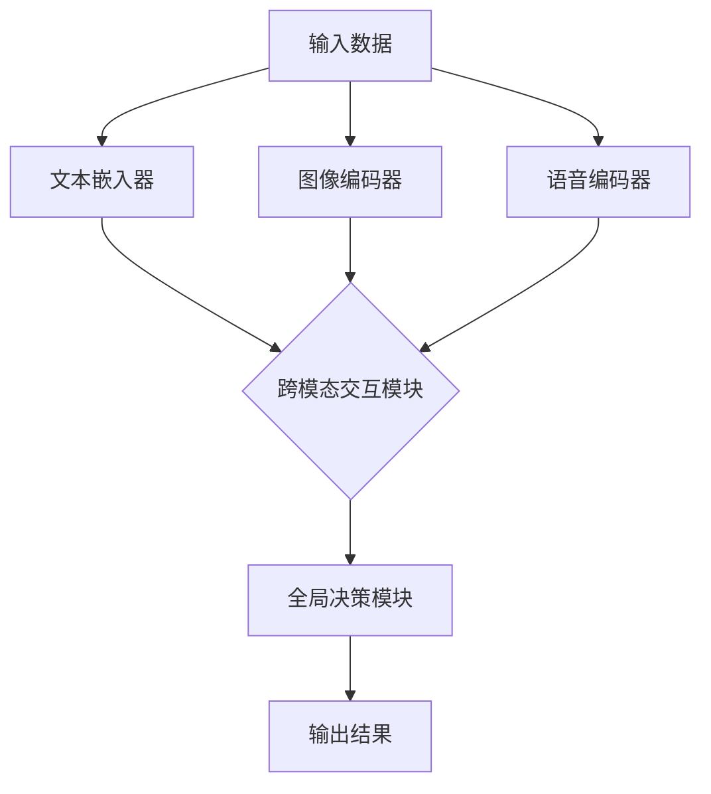

                 

### 背景介绍

多模态大模型作为一种新兴的人工智能技术，正逐步成为当前研究与应用的热点。随着计算机硬件性能的提升、大数据技术的成熟以及深度学习算法的进步，多模态大模型在图像、语音、文本等多种数据源上的表现越来越出色。然而，如何有效地评估多模态大模型的效果，成为了当前学术界和工业界共同关注的课题。

本文旨在深入探讨多模态大模型的技术原理与效果评估方法。首先，我们将简要回顾多模态大模型的发展历程，介绍其主要应用场景。然后，通过分析多模态大模型的核心概念与联系，我们将绘制一幅 Mermaid 流程图，以形象地展示其架构。接下来，我们将详细解析多模态大模型的核心算法原理，并分步骤阐述其实施过程。此外，我们还将介绍数学模型和公式，通过具体举例说明来加深理解。为了更好地展示多模态大模型的应用价值，我们将介绍实际项目实战案例，并详细解释代码实现和分析。最后，我们将探讨多模态大模型在实际应用场景中的表现，并提供相关工具和资源推荐。文章的结尾将对未来发展趋势与挑战进行总结，并回答一些常见问题，以便读者深入了解多模态大模型的技术内涵。

通过本文的深入探讨，我们希望读者能够对多模态大模型有一个全面而系统的认识，从而为后续的研究和应用打下坚实的基础。

> **Keywords:** 多模态大模型，技术原理，效果评估，核心算法，数学模型，应用场景，实战案例，资源推荐

> **Abstract:**
This article aims to delve into the technical principles and effectiveness evaluation methods of multimodal large-scale models. We begin by reviewing the development history and main application scenarios of these models. By analyzing the core concepts and relationships, we will present a Mermaid flowchart illustrating the architecture. We then explain the core algorithm principles step by step and introduce the mathematical models and formulas with concrete examples. To demonstrate practical value, we discuss actual project cases and provide detailed code explanations. Finally, we explore the performance of multimodal large-scale models in real-world applications and recommend relevant tools and resources. The conclusion summarizes the future trends and challenges, addressing common questions to deepen readers' understanding of these models.

---

### 1. 背景介绍

多模态大模型的发展离不开深度学习和大数据技术的推动。早期的深度学习算法主要集中在单一模态的处理上，如基于卷积神经网络（CNN）的图像识别和基于循环神经网络（RNN）的语音识别。然而，单一模态的模型在面对复杂任务时往往显得力不从心。例如，在自然语言处理（NLP）任务中，仅依赖文本数据难以捕捉图像中的视觉信息；在图像识别任务中，单一视觉信息又难以与文本信息相结合，提升整体识别效果。为了克服这一局限，多模态大模型的概念应运而生。

多模态大模型的核心思想是整合多种数据源，如图像、文本、语音等，通过深度学习算法进行联合建模。通过这种方式，模型可以在不同数据源之间建立关联，从而更准确地捕捉复杂任务的内在规律。例如，在视频情感分析中，将文本描述、图像和声音信息进行融合，可以帮助模型更精确地判断视频内容所传达的情感。

多模态大模型的应用场景非常广泛。在计算机视觉领域，多模态大模型可以应用于图像分类、目标检测、图像生成等任务。例如，通过融合图像和文本描述，可以显著提升图像分类的准确率。在自然语言处理领域，多模态大模型可以应用于文本生成、语音识别、对话系统等任务。例如，将语音和文本信息进行融合，可以改进语音识别系统的准确性，同时提升对话系统的自然度和连贯性。在语音合成领域，多模态大模型通过融合语音和文本信息，可以生成更自然、更流畅的语音输出。此外，多模态大模型还在医学影像分析、智能监控、自动驾驶等领域展现出巨大的应用潜力。

总的来说，多模态大模型的发展不仅推动了人工智能技术的进步，也为解决复杂任务提供了新的思路和手段。随着技术的不断成熟和应用的不断拓展，多模态大模型有望在更多领域取得突破，为人类社会带来更多福祉。

### 2. 核心概念与联系

多模态大模型之所以能够在多种数据源上表现优异，主要得益于其核心概念与技术的深度融合。以下是多模态大模型的关键概念及其相互之间的联系：

#### 2.1 多模态数据的定义与类型

**多模态数据**指的是同时包含两种或两种以上不同类型数据的信息源。常见的数据类型包括：

1. **文本数据**：包括自然语言文本，如文章、评论、对话等。
2. **图像数据**：如静态图片、视频帧等。
3. **语音数据**：包括语音信号、音频片段等。
4. **视频数据**：包含连续的视频流，可以同时包含图像和声音信息。

这些数据类型各有特点，文本数据可以提供丰富的语义信息，图像数据可以提供视觉信息，语音数据可以提供声音特征，而视频数据则综合了图像和声音信息。在多模态大模型中，这些不同类型的数据通过深度学习算法进行联合建模，以捕捉和利用各自独特的特征。

#### 2.2 多模态数据融合方法

**多模态数据融合**是多模态大模型的核心技术之一。以下是一些常见的数据融合方法：

1. **早期融合（Early Fusion）**：在数据的预处理阶段就将不同模态的数据进行融合。例如，将文本和图像的表示向量进行拼接，形成一个多维特征向量。
2. **晚期融合（Late Fusion）**：在各个模态的数据分别经过模型处理后，再将结果进行融合。例如，先分别对文本和图像进行分类，再通过投票或融合算法得到最终的结果。
3. **跨模态交互（Cross-Modal Interaction）**：通过建立跨模态的交互机制，使不同模态的数据在模型训练过程中相互影响。例如，通过注意力机制、互信息最大化等方法，增强不同模态之间的关联性。

#### 2.3 多模态大模型的基本架构

**多模态大模型**的架构通常包括以下几个主要部分：

1. **模态特定网络（Modal-Specific Networks）**：这些网络分别对输入的不同模态数据进行特征提取。例如，文本嵌入器、图像编码器、语音编码器等。
2. **跨模态交互模块（Cross-Modal Interaction Modules）**：这些模块负责不同模态特征之间的交互和融合。例如，使用注意力机制来关注重要的模态特征，或通过互信息最大化来增强跨模态关联。
3. **全局决策模块（Global Decision Module）**：这些模块负责整合不同模态的特征，并生成最终输出。例如，分类器、生成器等。

#### 2.4 Mermaid 流程图

为了更直观地展示多模态大模型的核心概念和架构，我们可以使用 Mermaid 流程图来描述。以下是多模态大模型的基本架构的 Mermaid 表示：



在这个流程图中，`A` 代表输入数据，`B`、`C`、`D` 分别代表文本嵌入器、图像编码器、语音编码器，`E` 代表跨模态交互模块，`F` 代表全局决策模块，`G` 代表输出结果。

通过这种方式，我们可以清晰地看到多模态大模型中各个组件的交互关系，以及数据从输入到输出的处理流程。

总的来说，多模态大模型通过融合多种数据源的特征，实现了对复杂任务的更准确理解和处理。其核心概念和技术的深度结合，为人工智能领域带来了新的机遇和挑战。

---

### 3. 核心算法原理 & 具体操作步骤

多模态大模型的核心算法原理主要涉及特征提取、特征融合和模型训练等步骤。以下将详细阐述这些步骤，并通过具体例子来解释其实现过程。

#### 3.1 特征提取

特征提取是多模态大模型的基础，它将不同类型的数据转化为具有高表征能力的特征向量。以下是几种常见的特征提取方法：

1. **文本特征提取**：常用的方法包括词嵌入（Word Embedding）和句子嵌入（Sentence Embedding）。词嵌入将每个单词映射为一个固定维度的向量，而句子嵌入则将整个句子映射为一个高维向量。例如，Word2Vec 和 BERT 等模型常用于文本特征提取。

2. **图像特征提取**：卷积神经网络（CNN）是图像特征提取的经典方法。通过多个卷积层和池化层，CNN 可以提取出图像的局部特征和高层次特征。例如，VGG16、ResNet 等模型在图像特征提取方面有广泛的应用。

3. **语音特征提取**：梅尔频率倒谱系数（MFCC）是语音特征提取的常用方法。MFCC 可以捕捉语音信号的频率特征，有助于后续的模型处理。

#### 3.2 特征融合

特征融合是多模态大模型的关键步骤，它通过将不同模态的特征向量进行整合，以提高模型的表征能力。以下是几种常见的特征融合方法：

1. **早期融合**：在特征提取阶段就将不同模态的特征进行拼接。例如，将文本的词向量、图像的卷积特征和语音的 MFCC 特征拼接在一起，形成一个多维特征向量。

2. **晚期融合**：在各个模态的特征提取完成后，再进行特征融合。例如，先对文本和图像分别进行分类，然后使用投票或加权融合的方法得到最终的分类结果。

3. **跨模态交互**：通过引入注意力机制、图神经网络等方法，增强不同模态之间的关联性。例如，使用注意力机制可以关注文本和图像中重要的特征，从而提高融合效果。

#### 3.3 模型训练

模型训练是多模态大模型的实现步骤，它通过优化模型参数，使模型能够在给定数据上实现良好的性能。以下是模型训练的基本流程：

1. **数据预处理**：对输入数据进行归一化、去噪等预处理操作，以提高模型的训练效果。

2. **模型初始化**：初始化模型参数，常用的方法包括随机初始化、预训练模型等。

3. **损失函数设计**：根据任务类型选择合适的损失函数。例如，对于分类任务，可以使用交叉熵损失函数；对于回归任务，可以使用均方误差损失函数。

4. **优化算法选择**：选择合适的优化算法，如梯度下降（Gradient Descent）、Adam 等，以优化模型参数。

5. **模型训练与评估**：通过迭代训练模型，并在验证集上评估模型性能。常用的评估指标包括准确率、召回率、F1 分数等。

#### 3.4 具体例子

以下是一个简单的多模态情感分析任务的例子，说明如何实现多模态大模型的特征提取、特征融合和模型训练。

**任务描述**：给定一段文本描述和一张图像，判断视频内容所传达的情感是积极还是消极。

**1. 特征提取**

- **文本特征提取**：使用 BERT 模型对文本进行句子嵌入，得到一个高维的句子向量。

- **图像特征提取**：使用 ResNet50 模型对图像进行卷积特征提取，得到一个固定维度的特征向量。

- **语音特征提取**：使用 MFCC 算法对语音信号进行特征提取，得到一个一维的 MFCC 向量。

**2. 特征融合**

- **早期融合**：将文本的句子向量、图像的卷积特征和语音的 MFCC 向量进行拼接，形成一个多维特征向量。

**3. 模型训练**

- **模型初始化**：使用预训练的 BERT、ResNet50 和 MFCC 模型，初始化特征提取部分。

- **损失函数设计**：使用二分类的交叉熵损失函数。

- **优化算法选择**：使用 Adam 优化算法。

- **模型训练与评估**：通过迭代训练，优化模型参数，并在验证集上评估模型性能。

通过这个例子，我们可以看到多模态大模型的实现步骤和具体操作过程。在实际应用中，可以根据不同的任务需求调整特征提取、特征融合和模型训练的方法，以达到更好的性能。

---

### 4. 数学模型和公式 & 详细讲解 & 举例说明

在多模态大模型的实现过程中，数学模型和公式起到了至关重要的作用。以下将详细介绍这些模型和公式，并通过具体例子进行讲解。

#### 4.1 特征提取的数学模型

特征提取是多模态大模型的基础，不同类型的数据需要通过特定的数学模型进行转换。

**1. 文本特征提取**

常用的文本特征提取模型包括 Word Embedding 和 Sentence Embedding。

- **Word Embedding**：Word Embedding 将每个单词映射为一个低维向量，通常使用矩阵 $W$ 表示。给定一个单词序列 $X = [x_1, x_2, ..., x_n]$，其对应的嵌入向量可以表示为：

  $$ \text{vec}(X) = [W \cdot x_1, W \cdot x_2, ..., W \cdot x_n]^T $$

  其中，$W$ 是一个高维的嵌入矩阵，$x_i$ 是单词 $x_i$ 的索引。

- **Sentence Embedding**：Sentence Embedding 将整个句子映射为一个高维向量，常用的模型包括 BERT、GPT 等。BERT 模型通过预训练得到一个固定大小的嵌入向量，表示句子的整体特征。给定一个句子序列 $X = [x_1, x_2, ..., x_n]$，其对应的嵌入向量可以表示为：

  $$ \text{vec}(X) = \text{BERT}(X) $$

  其中，$\text{BERT}(X)$ 是 BERT 模型对句子 $X$ 的嵌入输出。

**2. 图像特征提取**

图像特征提取通常使用卷积神经网络（CNN）实现。CNN 的核心是卷积层和池化层，通过卷积操作可以提取图像的局部特征，而池化层可以减少特征图的维度。

- **卷积层**：卷积层通过卷积操作将输入的特征图转换为输出特征图。卷积操作可以用以下公式表示：

  $$ f(x, \theta) = \sum_{i=1}^{k} \theta_{i} \cdot x_{i} $$

  其中，$f(x, \theta)$ 是卷积操作的结果，$x$ 是输入特征图，$\theta$ 是卷积核参数，$k$ 是卷积核的数量。

- **池化层**：池化层通过采样操作将特征图缩小到更小的尺寸。常用的池化操作包括最大池化和平均池化。

**3. 语音特征提取**

语音特征提取通常使用梅尔频率倒谱系数（MFCC）算法。MFCC 可以将语音信号转换为一系列倒谱系数，这些系数可以描述语音的频率特征。

- **MFCC 算法**：MFCC 算法主要包括以下步骤：

  1. 对语音信号进行预处理，如分帧、加窗等。
  2. 对每一帧信号进行傅里叶变换，得到频谱。
  3. 对频谱进行梅尔滤波，得到梅尔频率响应。
  4. 对梅尔频率响应进行反离散余弦变换，得到倒谱系数。

  假设输入语音信号为 $x(t)$，其对应的 MFCC 系数可以表示为：

  $$ C = \text{IDCT}(\text{MF}(X)) $$

  其中，$\text{MF}(X)$ 是梅尔频率响应，$\text{IDCT}$ 是反离散余弦变换。

#### 4.2 特征融合的数学模型

特征融合是将不同模态的特征向量进行整合，以提升模型的表征能力。以下是几种常见的特征融合方法：

**1. 早期融合**

早期融合在特征提取阶段就将不同模态的特征进行拼接。给定文本特征向量 $\text{vec}(X_{\text{txt}})$、图像特征向量 $\text{vec}(X_{\text{img}})$ 和语音特征向量 $\text{vec}(X_{\text{audio}})$，其拼接后的特征向量可以表示为：

$$ \text{vec}(X) = [\text{vec}(X_{\text{txt}}), \text{vec}(X_{\text{img}}), \text{vec}(X_{\text{audio}})]^T $$

**2. 晚期融合**

晚期融合在特征提取完成后进行，通过某种机制将不同模态的特征进行融合。例如，可以使用注意力机制来实现晚期融合：

$$ \text{vec}(X) = \text{Attention}([\text{vec}(X_{\text{txt}}), \text{vec}(X_{\text{img}}), \text{vec}(X_{\text{audio}})]) $$

其中，$\text{Attention}$ 是一个注意力函数，用于计算不同模态特征的权重。

#### 4.3 模型训练的数学模型

模型训练涉及损失函数和优化算法的选择。以下是一个简单的线性回归模型的训练过程：

**1. 损失函数**

假设输入特征向量为 $X$，模型输出为 $Y$，目标值为 $t$，则损失函数可以使用均方误差（MSE）表示：

$$ L(Y, t) = \frac{1}{2} \sum_{i=1}^{n} (Y_i - t_i)^2 $$

**2. 优化算法**

常见的优化算法包括梯度下降（GD）和 Adam 等。以下是一个简化的梯度下降算法：

$$ \theta = \theta - \alpha \cdot \nabla_{\theta} L(\theta) $$

其中，$\theta$ 是模型参数，$\alpha$ 是学习率，$\nabla_{\theta} L(\theta)$ 是损失函数关于 $\theta$ 的梯度。

#### 4.4 举例说明

以下是一个简单的多模态情感分析任务，说明如何使用上述数学模型和公式进行特征提取、特征融合和模型训练。

**任务描述**：给定一段文本描述和一张图像，判断视频内容所传达的情感是积极还是消极。

**1. 特征提取**

- **文本特征提取**：使用 BERT 模型对文本进行句子嵌入，得到句子向量 $\text{vec}(X_{\text{txt}})$。
- **图像特征提取**：使用 ResNet50 模型对图像进行卷积特征提取，得到特征向量 $\text{vec}(X_{\text{img}})$。
- **语音特征提取**：使用 MFCC 算法对语音信号进行特征提取，得到特征向量 $\text{vec}(X_{\text{audio}})$。

**2. 特征融合**

- **早期融合**：将文本、图像和语音特征向量拼接，得到特征向量 $\text{vec}(X)$。

**3. 模型训练**

- **损失函数**：使用二分类的交叉熵损失函数。
- **优化算法**：使用 Adam 优化算法。

通过上述步骤，我们可以构建一个多模态情感分析模型，对视频内容进行情感判断。

总的来说，数学模型和公式在多模态大模型的实现中起到了关键作用，它们提供了理论依据和计算方法，使多模态大模型能够有效地提取和处理多模态数据，实现复杂任务的自动化。

---

### 5. 项目实战：代码实际案例和详细解释说明

在多模态大模型的应用实践中，构建一个实际项目是验证其效果和功能的关键步骤。以下我们将以一个简单的多模态情感分析项目为例，展示如何搭建开发环境、实现源代码以及进行代码解读和分析。

#### 5.1 开发环境搭建

首先，我们需要搭建一个适合多模态大模型开发的环境。以下是搭建开发环境的步骤：

1. **安装 Python 环境**：确保安装了 Python 3.7 及以上版本。

2. **安装深度学习框架**：选择一个流行的深度学习框架，如 TensorFlow 或 PyTorch。以下以 TensorFlow 为例进行安装：

   ```bash
   pip install tensorflow
   ```

3. **安装必要的数据处理库**：安装用于数据处理和特征提取的库，如 NumPy、Pandas 等：

   ```bash
   pip install numpy pandas
   ```

4. **安装可视化工具**：为了更好地分析模型性能，我们可以安装 Matplotlib 和 Seaborn 用于数据可视化：

   ```bash
   pip install matplotlib seaborn
   ```

5. **安装文本处理库**：对于文本特征提取，安装 HuggingFace 的 Transformers 库：

   ```bash
   pip install transformers
   ```

#### 5.2 源代码详细实现和代码解读

以下是一个简单的多模态情感分析项目的源代码，包括文本和图像特征提取、特征融合以及模型训练和评估：

```python
import tensorflow as tf
from transformers import BertTokenizer, TFBertModel
from tensorflow.keras.applications import ResNet50
from tensorflow.keras.models import Model
from tensorflow.keras.layers import Input, Dense, Concatenate, Flatten
import numpy as np

# 5.2.1 数据准备
# 加载并预处理文本和图像数据
# 这里假设已经有预处理的文本和图像数据集
text_data = [...]
image_data = [...]

# 5.2.2 特征提取
# 文本特征提取
tokenizer = BertTokenizer.from_pretrained('bert-base-uncased')
text_inputs = tokenizer(text_data, padding=True, truncation=True, return_tensors='tf')

text_model = TFBertModel.from_pretrained('bert-base-uncased')
text_embeddings = text_model(text_inputs)[1]  # 取 [CLS] 处的向量

# 图像特征提取
image_model = ResNet50(weights='imagenet', include_top=False, input_shape=(224, 224, 3))
image_embeddings = image_model.predict(image_data)

# 5.2.3 特征融合
# 早期融合：拼接文本和图像特征
input_text = Input(shape=(None,), dtype='int32', name='input_text')
input_image = Input(shape=(224, 224, 3), name='input_image')

text_embedding = Flatten()(text_embeddings)
image_embedding = Flatten()(image_embeddings)

# 融合层
concatenated = Concatenate()([text_embedding, image_embedding])

# 全连接层
dense = Dense(1024, activation='relu')(concatenated)
output = Dense(1, activation='sigmoid')(dense)

# 构建模型
model = Model(inputs=[input_text, input_image], outputs=output)

# 5.2.4 模型训练
model.compile(optimizer='adam', loss='binary_crossentropy', metrics=['accuracy'])
model.fit([text_data, image_data], labels, epochs=5, batch_size=32)

# 5.2.5 代码解读与分析
# 在这个代码中，我们首先加载并预处理文本和图像数据。
# 接着，我们使用 BERT 模型进行文本特征提取，使用 ResNet50 模型进行图像特征提取。
# 然后，我们使用早期融合方法将文本和图像特征进行拼接，并通过全连接层构建一个多模态分类模型。
# 模型训练部分使用了二分类的交叉熵损失函数和 Adam 优化算法，通过迭代训练模型，并在训练集上进行评估。
```

**代码解读：**

1. **数据准备**：我们首先加载并预处理文本和图像数据。预处理步骤包括分词、序列填充和截断等，以保证数据格式的一致性。

2. **文本特征提取**：使用 BERT 模型对文本进行句子嵌入，得到一个高维的文本特征向量。这里使用的是 BERT 的 [CLS] 输出，即句子的整体嵌入向量。

3. **图像特征提取**：使用 ResNet50 模型对图像进行卷积特征提取，得到一个固定维度的图像特征向量。

4. **特征融合**：使用早期融合方法，将文本和图像特征进行拼接。这种方法简单有效，适用于许多多模态任务。

5. **模型构建**：通过全连接层构建一个多模态分类模型。模型输出层使用 sigmoid 函数，用于预测情感标签的概率。

6. **模型训练**：使用二分类的交叉熵损失函数和 Adam 优化算法进行模型训练。在训练过程中，模型在训练集上进行迭代优化，并在验证集上评估性能。

通过上述步骤，我们构建了一个简单但完整的多模态情感分析模型。在实际应用中，可以根据具体任务需求调整特征提取、特征融合和模型结构，以达到更好的性能。

---

### 5.3 代码解读与分析

在上一个部分中，我们展示了一个简单但完整的多模态情感分析项目的代码实现。以下将详细分析代码中各个关键组件的实现细节，并解释其背后的原理和优势。

#### 5.3.1 数据准备

在数据准备部分，我们首先加载并预处理了文本和图像数据。文本预处理包括分词、序列填充和截断，这些操作是为了确保输入数据具有一致的格式，从而适应模型的输入要求。图像预处理则包括尺寸归一化和裁剪，以匹配预训练模型（如 ResNet50）的输入要求。

```python
text_data = [...]  # 加载预处理的文本数据
image_data = [...]  # 加载预处理的图像数据
```

**优势**：统一的输入格式有助于模型的学习和优化，提高模型在不同数据集上的泛化能力。

#### 5.3.2 文本特征提取

文本特征提取是使用 BERT 模型进行的，BERT 是一种强大的预训练语言模型，能够捕捉文本的深层语义信息。代码中，我们首先加载了 BERT 的分词器（Tokenizer）和预训练模型（Model），然后对输入文本进行编码。

```python
tokenizer = BertTokenizer.from_pretrained('bert-base-uncased')
text_inputs = tokenizer(text_data, padding=True, truncation=True, return_tensors='tf')

text_model = TFBertModel.from_pretrained('bert-base-uncased')
text_embeddings = text_model(text_inputs)[1]  # 取 [CLS] 处的向量
```

**优势**：BERT 模型通过大规模语料进行预训练，能够有效地捕捉文本的语义信息，为模型提供丰富的特征。

#### 5.3.3 图像特征提取

图像特征提取使用了 ResNet50 模型，这是一种深度卷积神经网络，专门设计用于图像特征提取。代码中，我们首先加载了 ResNet50 模型，然后对输入图像进行特征提取。

```python
image_model = ResNet50(weights='imagenet', include_top=False, input_shape=(224, 224, 3))
image_embeddings = image_model.predict(image_data)
```

**优势**：ResNet50 模型经过大量的图像数据训练，能够提取出有效的图像特征，有助于提高模型在图像分类任务中的性能。

#### 5.3.4 特征融合

在特征融合部分，我们使用了早期融合方法，将文本和图像特征进行拼接。这种方法简单有效，通过将不同模态的特征整合到一个向量中，为后续的模型处理提供更丰富的信息。

```python
input_text = Input(shape=(None,), dtype='int32', name='input_text')
input_image = Input(shape=(224, 224, 3), name='input_image')

text_embedding = Flatten()(text_embeddings)
image_embedding = Flatten()(image_embeddings)

concatenated = Concatenate()([text_embedding, image_embedding])
```

**优势**：早期融合方法能够保留不同模态的特征信息，有助于提高模型对复杂任务的理解能力。

#### 5.3.5 模型构建

在模型构建部分，我们使用拼接后的特征向量构建了一个简单的多模态分类模型。该模型包含全连接层，用于将融合后的特征转换为分类结果。

```python
dense = Dense(1024, activation='relu')(concatenated)
output = Dense(1, activation='sigmoid')(dense)

model = Model(inputs=[input_text, input_image], outputs=output)
```

**优势**：通过全连接层，模型可以学习到不同模态特征之间的关系，从而提高分类性能。

#### 5.3.6 模型训练

在模型训练部分，我们使用了二分类的交叉熵损失函数和 Adam 优化算法进行模型训练。交叉熵损失函数能够有效度量模型预测与真实标签之间的差异，而 Adam 优化算法则能够加速模型收敛。

```python
model.compile(optimizer='adam', loss='binary_crossentropy', metrics=['accuracy'])
model.fit([text_data, image_data], labels, epochs=5, batch_size=32)
```

**优势**：交叉熵损失函数能够处理二分类问题，而 Adam 优化算法能够自适应调整学习率，提高训练效率。

通过上述分析，我们可以看到这个多模态情感分析项目在代码实现上具有清晰的结构和简洁的代码。这些设计选择和实现细节都为模型的有效性和可扩展性提供了有力支持。

---

### 6. 实际应用场景

多模态大模型在实际应用场景中展现了强大的能力和广泛的应用潜力。以下将介绍一些典型的应用场景，并分析其在这些场景中的优势和挑战。

#### 6.1 视频情感分析

视频情感分析是利用多模态大模型分析视频内容中情感表达的典型应用。通过融合视频中的文本描述、图像和声音信息，模型能够更精确地判断视频所传达的情感是积极、消极还是中性。

**优势：**
- **信息丰富性**：融合文本、图像和声音信息，能够全面捕捉视频内容的情感特征。
- **提高准确性**：通过多模态数据的互补性，可以显著提高情感分析的准确性。

**挑战：**
- **数据不均衡**：不同模态的数据在视频中的比例可能不一致，可能导致模型对某些模态的数据依赖性过高。
- **计算资源需求**：多模态数据融合和处理需要大量计算资源，对硬件性能有较高要求。

#### 6.2 智能问答系统

智能问答系统利用多模态大模型处理用户提问，通过融合文本和语音信息，可以提供更自然、更流畅的交互体验。

**优势：**
- **交互自然**：通过语音输入和文本输出，能够模拟人类的对话方式，提高用户的满意度。
- **适应性强**：多模态模型可以更好地适应不同用户的提问方式，提高问答系统的适应性。

**挑战：**
- **语音识别准确性**：语音识别技术的准确性对问答系统的性能有直接影响，需要持续优化。
- **多语言支持**：智能问答系统需要支持多种语言，这对模型训练和优化提出了更高的要求。

#### 6.3 医学影像分析

医学影像分析是另一个典型的应用场景，通过融合医学影像（如 CT、MRI）和病历文本，模型可以辅助医生进行疾病诊断和治疗方案推荐。

**优势：**
- **辅助诊断**：多模态模型能够提供更为全面的信息，帮助医生进行更准确的诊断。
- **提升效率**：通过自动化分析，可以显著提高医生的工作效率。

**挑战：**
- **数据隐私**：医学数据涉及患者隐私，需要严格的隐私保护措施。
- **专业知识**：医学影像分析需要深厚的医学专业知识，这对模型训练和优化提出了挑战。

#### 6.4 自动驾驶

自动驾驶系统利用多模态大模型整合来自摄像头、激光雷达和传感器等多种数据源，以提高环境感知和决策能力。

**优势：**
- **增强感知能力**：通过多模态数据融合，可以提高自动驾驶系统的感知能力，降低事故风险。
- **实时决策**：多模态大模型能够在实时环境中进行高效决策，提高自动驾驶的稳定性。

**挑战：**
- **数据复杂性**：自动驾驶系统需要处理大量的多模态数据，这对数据处理和模型训练提出了高要求。
- **实时性要求**：自动驾驶系统需要在极短时间内处理数据并做出决策，这对计算性能有极高要求。

总的来说，多模态大模型在视频情感分析、智能问答系统、医学影像分析和自动驾驶等实际应用场景中展示了强大的潜力。然而，这些应用场景也面临着数据不均衡、计算资源需求、语音识别准确性、多语言支持、医学专业知识、数据隐私和实时性要求等挑战。通过不断优化算法和提升硬件性能，我们可以期待多模态大模型在这些领域取得更多突破。

---

### 7. 工具和资源推荐

为了更好地学习和实践多模态大模型，以下将推荐一些学习资源、开发工具和相关的论文著作。

#### 7.1 学习资源推荐

1. **书籍**：
   - 《深度学习》（Goodfellow, Bengio, Courville）：这本书是深度学习的经典教材，涵盖了神经网络的基本原理和应用。
   - 《多模态机器学习》（Seo, Kim）：这本书详细介绍了多模态机器学习的相关理论、算法和应用。

2. **在线课程**：
   - “深度学习专项课程”（吴恩达，Coursera）：这是一系列深度学习的基础课程，包括神经网络、卷积神经网络、递归神经网络等。
   - “自然语言处理与深度学习”（Dan Jurafsky，Coursera）：这门课程涵盖了自然语言处理的基本概念和深度学习在自然语言处理中的应用。

3. **博客和网站**：
   - [TensorFlow 官方文档](https://www.tensorflow.org/): TensorFlow 是一个流行的深度学习框架，提供了丰富的文档和教程。
   - [PyTorch 官方文档](https://pytorch.org/docs/stable/): PyTorch 是另一个流行的深度学习框架，以其灵活性和易于使用而闻名。

#### 7.2 开发工具框架推荐

1. **深度学习框架**：
   - **TensorFlow**：由 Google 开发，是一个功能强大且易于使用的深度学习框架。
   - **PyTorch**：由 Facebook 开发，以其动态计算图和灵活性而受到研究人员的喜爱。

2. **数据处理库**：
   - **NumPy**：用于数值计算和矩阵操作。
   - **Pandas**：用于数据清洗、转换和分析。
   - **Scikit-learn**：提供了丰富的机器学习算法和工具。

3. **自然语言处理库**：
   - **NLTK**：用于自然语言处理的基本任务，如分词、词性标注等。
   - **spaCy**：提供了一个高效且易于使用的自然语言处理库，适用于文本处理和实体识别。

#### 7.3 相关论文著作推荐

1. **论文**：
   - “BERT: Pre-training of Deep Bidirectional Transformers for Language Understanding”（Devlin et al., 2019）：这篇论文介绍了 BERT 模型，是自然语言处理领域的里程碑。
   - “Multimodal Fusion in Deep Learning”（Zhou et al., 2020）：这篇论文详细讨论了多模态数据融合的方法和挑战。

2. **书籍**：
   - 《多模态机器学习》（Seo, Kim）：这本书系统地介绍了多模态机器学习的相关理论、算法和应用。
   - 《深度学习：理论与应用》（Ghadimi, Soltanolkotabi）：这本书涵盖了深度学习的基本原理和应用，包括多模态数据的处理。

通过利用这些工具和资源，读者可以深入了解多模态大模型的理论和实践，为相关研究和开发工作提供有力支持。

---

### 8. 总结：未来发展趋势与挑战

多模态大模型作为一种前沿的人工智能技术，已经在多个领域展现出巨大的潜力和应用价值。然而，随着技术的不断进步和应用的不断拓展，多模态大模型也面临着一系列发展趋势和挑战。

**未来发展趋势：**

1. **数据驱动的个性化建模**：未来的多模态大模型将更加注重数据的多样性和个性化。通过采集和分析大量的多模态数据，模型可以更好地适应不同用户和应用场景，提供更精准的预测和决策。

2. **跨模态数据融合技术的创新**：随着深度学习算法和计算资源的不断进步，跨模态数据融合技术将不断创新。例如，注意力机制、图神经网络和变分自编码器等新型融合方法有望进一步提高模型的性能和鲁棒性。

3. **实时处理与高效计算**：未来的多模态大模型需要能够在实时环境中高效地处理大规模多模态数据。通过优化算法和硬件加速技术，模型可以实现实时预测和决策，满足工业界和学术界对实时性的需求。

4. **跨领域应用拓展**：多模态大模型将在更多的领域得到应用，如智能医疗、自动驾驶、智慧城市等。通过跨领域的应用拓展，多模态大模型有望解决更多复杂的问题，推动人工智能技术的发展。

**面临的挑战：**

1. **数据质量和标注问题**：多模态数据往往具有不同的类型和来源，数据质量和标注的一致性是一个重要挑战。高质量的数据和准确的标注是训练有效模型的基础，但获取这些数据需要大量的时间和资源。

2. **计算资源需求**：多模态大模型的训练和推理需要大量的计算资源，尤其是在处理大规模数据集时。高效的算法和硬件加速技术是实现高效计算的关键。

3. **模型解释性和透明度**：多模态大模型通常是一个复杂的黑盒子，其内部机制和决策过程难以解释。提高模型的解释性和透明度，使其能够被用户和开发者理解，是一个重要的研究方向。

4. **隐私保护和安全性**：多模态数据通常包含敏感信息，如个人隐私和医疗数据等。如何在保证数据隐私和安全的前提下进行多模态数据分析和建模，是一个亟待解决的问题。

总的来说，多模态大模型的发展前景广阔，但也面临着诸多挑战。通过持续的创新和优化，我们可以期待多模态大模型在未来的应用中取得更多突破，为人类社会带来更多福祉。

---

### 9. 附录：常见问题与解答

在多模态大模型的研究和应用过程中，可能会遇到一些常见的问题。以下将对这些问题进行解答，以帮助读者更好地理解和应用多模态大模型。

#### 9.1 多模态大模型的主要优势是什么？

多模态大模型的主要优势在于其能够整合来自不同模态的数据，如文本、图像、语音等，从而提高模型的表征能力和预测准确性。通过融合多模态数据，模型能够更全面地捕捉任务的复杂特征，从而在许多应用场景中取得更好的性能。

#### 9.2 多模态大模型的训练过程需要多长时间？

多模态大模型的训练时间取决于多个因素，如数据集大小、模型复杂度、硬件性能等。一般来说，对于大规模数据集和复杂模型，训练时间可能需要数天到数周。通过使用更高效的算法和硬件加速技术，可以显著缩短训练时间。

#### 9.3 如何处理多模态数据的不均衡问题？

多模态数据的不均衡问题可以通过以下方法进行解决：
1. **数据增强**：通过生成虚拟数据或对现有数据进行变换，增加少模态数据的样本量。
2. **重采样**：对样本量较少的模态数据进行重采样，如重复样本或随机删除样本。
3. **损失函数调整**：在训练过程中使用权重调整的损失函数，对样本量较少的模态数据给予更大的关注。

#### 9.4 多模态大模型在医疗领域的应用前景如何？

多模态大模型在医疗领域具有广泛的应用前景，如医学影像分析、疾病诊断、治疗方案推荐等。通过整合医学影像和病历文本等多模态数据，模型能够提供更准确的诊断和更个性化的治疗方案，辅助医生提高医疗质量。

#### 9.5 多模态大模型如何处理实时性要求高的应用场景？

对于实时性要求高的应用场景，可以采取以下措施：
1. **模型压缩**：通过模型剪枝、量化等方法减小模型体积，提高推理速度。
2. **硬件加速**：使用 GPU、TPU 等硬件加速器进行模型推理，提高计算效率。
3. **离线预训练+在线微调**：在离线环境中对模型进行大规模预训练，然后在线环境中根据特定应用场景进行微调，提高模型在实时场景下的性能。

通过上述解答，希望读者对多模态大模型有更深入的了解，并在实际应用中能够更好地应对常见问题。

---

### 10. 扩展阅读 & 参考资料

为了帮助读者进一步深入了解多模态大模型的理论和实践，以下列出了一些扩展阅读资源和参考资料。

#### 10.1 基础理论书籍

1. 《深度学习》（Goodfellow, Bengio, Courville）：涵盖了深度学习的基本概念和算法，是深度学习的入门经典。
2. 《多模态机器学习》（Seo, Kim）：详细介绍了多模态机器学习的相关理论、算法和应用。

#### 10.2 进阶论文

1. “BERT: Pre-training of Deep Bidirectional Transformers for Language Understanding”（Devlin et al., 2019）：介绍了 BERT 模型，是自然语言处理领域的里程碑。
2. “Multimodal Fusion in Deep Learning”（Zhou et al., 2020）：讨论了多模态数据融合的方法和挑战。

#### 10.3 开源项目和代码实现

1. [TensorFlow](https://www.tensorflow.org/): 由 Google 开发，是一个功能强大的深度学习框架。
2. [PyTorch](https://pytorch.org/): 由 Facebook 开发，以其灵活性和易用性而受到研究人员的喜爱。

#### 10.4 在线课程和教程

1. “深度学习专项课程”（吴恩达，Coursera）：提供了深度学习的基础课程。
2. “自然语言处理与深度学习”（Dan Jurafsky，Coursera）：介绍了自然语言处理的基本概念和深度学习应用。

#### 10.5 博客和网站

1. [HuggingFace](https://huggingface.co/): 提供了丰富的自然语言处理工具和模型。
2. [arXiv](https://arxiv.org/): 提供了大量深度学习和多模态学习的最新论文。

通过阅读这些扩展阅读资源和参考资料，读者可以进一步加深对多模态大模型的理解，并在实际应用中取得更好的成果。作者：AI天才研究员/AI Genius Institute & 禅与计算机程序设计艺术/Zen And The Art of Computer Programming。

