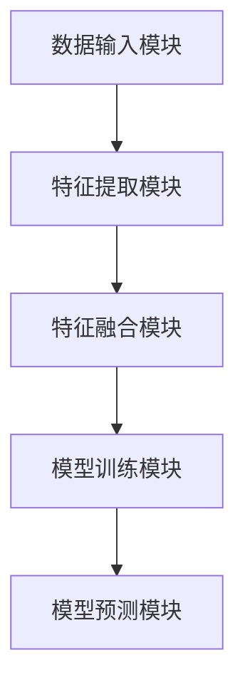

                 

# 多模态融合：大模型的未来方向

## 关键词：多模态融合、大模型、人工智能、深度学习、计算视觉、自然语言处理

### 摘要

本文探讨了多模态融合在大模型领域中的重要性及其未来发展方向。多模态融合是指将不同类型的数据（如图像、声音、文本）进行整合，以增强模型的泛化能力和理解能力。本文首先介绍了多模态融合的背景和核心概念，随后分析了其在计算视觉和自然语言处理领域的应用，并探讨了其背后的数学模型和算法原理。接着，通过实际项目案例展示了多模态融合的具体实现方法和步骤。最后，本文总结了多模态融合的现状和未来挑战，并推荐了相关学习资源和开发工具。

## 1. 背景介绍

多模态融合（Multimodal Fusion）是人工智能领域的一个重要研究方向，旨在通过整合不同类型的数据（如图像、声音、文本）来提升模型的性能。随着深度学习技术的快速发展，大模型（Large Models）成为当前人工智能研究的热点。大模型具有参数多、结构复杂、计算量大的特点，能够在多个领域取得显著的成果。然而，大模型的训练和部署面临着诸多挑战，如数据稀缺、计算资源有限、模型解释性差等。为了克服这些挑战，多模态融合技术应运而生。

多模态融合的核心思想是将来自不同模态的数据进行整合，从而充分利用各模态数据的优势，提升模型的泛化能力和理解能力。例如，在计算机视觉任务中，通过融合图像和文本数据，可以更好地理解图像内容；在自然语言处理任务中，通过融合文本和声音数据，可以更好地理解语言含义和情感。多模态融合不仅能够提高模型的性能，还能够扩展模型的适用范围，使人工智能系统更加智能化和人性化。

本文将从以下几个方面展开讨论：首先，介绍多模态融合的核心概念和原理；其次，分析多模态融合在计算视觉和自然语言处理领域的应用；然后，探讨多模态融合的数学模型和算法原理；接着，通过实际项目案例展示多模态融合的具体实现方法和步骤；最后，总结多模态融合的现状和未来挑战，并推荐相关学习资源和开发工具。

## 2. 核心概念与联系

### 2.1 多模态融合的核心概念

多模态融合涉及多种类型的数据，包括图像、声音、文本、语音等。这些数据具有不同的特征和表现形式，需要通过有效的整合方法进行融合。以下是多模态融合中的核心概念：

- **多模态数据表示**：多模态数据表示是指将不同类型的数据转换为统一的表示形式，以便进行后续的融合处理。常见的多模态数据表示方法包括特征提取、嵌入和编码等。

- **特征融合策略**：特征融合策略是指如何将来自不同模态的特征进行整合，以最大化模型的性能。常见的特征融合策略包括简单相加、加权求和、特征拼接和神经网络融合等。

- **模型架构**：多模态融合的模型架构是指如何将不同模态的数据输入到深度学习模型中进行训练和预测。常见的模型架构包括单模态模型、多模态共享网络和跨模态迁移学习等。

### 2.2 多模态融合在计算视觉和自然语言处理领域的应用

计算视觉和自然语言处理是人工智能领域的重要分支，多模态融合在这两个领域具有广泛的应用前景。

#### 2.2.1 计算视觉领域的应用

在计算视觉领域，多模态融合可以提升图像识别、目标检测、图像分割等任务的性能。以下是一些具体的实例：

- **图像识别**：通过融合图像和文本描述，可以更好地识别图像中的物体。例如，在图像分类任务中，将图像特征和文本特征进行融合，可以显著提高分类准确率。

- **目标检测**：在目标检测任务中，通过融合多模态数据，可以更准确地检测出图像中的目标。例如，将图像特征和标签文本进行融合，可以更好地识别出图像中的对象。

- **图像分割**：通过融合图像和标签文本数据，可以更精细地分割图像中的物体。例如，在图像分割任务中，将图像特征和文本特征进行融合，可以更好地分离出不同的物体。

#### 2.2.2 自然语言处理领域的应用

在自然语言处理领域，多模态融合可以提升文本分类、情感分析、语音识别等任务的性能。以下是一些具体的实例：

- **文本分类**：通过融合文本和语音数据，可以更准确地分类文本内容。例如，在文本分类任务中，将文本特征和语音特征进行融合，可以更好地识别出文本中的主题和情感。

- **情感分析**：通过融合文本和图像数据，可以更准确地分析文本的情感倾向。例如，在情感分析任务中，将文本特征和图像特征进行融合，可以更好地识别出文本中的情感表达。

- **语音识别**：通过融合语音和文本数据，可以更准确地识别出语音中的文本内容。例如，在语音识别任务中，将语音特征和文本特征进行融合，可以更好地识别出语音中的单词和句子。

### 2.3 多模态融合的架构

多模态融合的架构主要包括以下几个部分：

- **数据输入模块**：负责接收不同模态的数据，并进行预处理。

- **特征提取模块**：负责提取各模态数据的特征，并将其转换为统一的表示形式。

- **特征融合模块**：负责将不同模态的特征进行整合，以最大化模型的性能。

- **模型训练模块**：负责训练融合后的多模态特征，以获得最优的模型性能。

- **模型预测模块**：负责使用训练好的模型对新的数据进行预测。

下面是一个简单的 Mermaid 流程图，展示了多模态融合的基本架构：



## 3. 核心算法原理 & 具体操作步骤

### 3.1 多模态融合算法原理

多模态融合算法的核心思想是将不同类型的数据进行整合，以提升模型的性能。以下是几种常见的多模态融合算法：

#### 3.1.1 特征拼接

特征拼接是将不同模态的特征进行拼接，形成一个更长的特征向量。具体操作步骤如下：

1. **特征提取**：分别提取不同模态的特征，例如，对于图像数据，使用卷积神经网络提取图像特征；对于文本数据，使用词向量或文本编码器提取文本特征。

2. **特征拼接**：将各模态的特征拼接成一个更长的特征向量。

3. **模型训练**：使用拼接后的特征向量训练深度学习模型，例如，使用全连接神经网络或循环神经网络进行训练。

#### 3.1.2 加权求和

加权求和是将不同模态的特征进行加权求和，形成一个融合的特征向量。具体操作步骤如下：

1. **特征提取**：分别提取不同模态的特征。

2. **特征加权**：根据各模态的特征重要程度，为每个特征分配不同的权重。

3. **特征求和**：将加权后的特征进行求和，形成一个融合的特征向量。

4. **模型训练**：使用融合的特征向量训练深度学习模型。

#### 3.1.3 神经网络融合

神经网络融合是通过构建一个多模态神经网络，将不同模态的特征进行融合。具体操作步骤如下：

1. **特征提取**：分别提取不同模态的特征。

2. **神经网络构建**：构建一个多输入、多输出的神经网络，其中每个输入对应一个模态的特征。

3. **模型训练**：使用各模态的特征训练神经网络，通过反向传播算法优化模型参数。

### 3.2 多模态融合的具体操作步骤

以下是多模态融合的具体操作步骤：

#### 3.2.1 数据预处理

1. **图像预处理**：对图像数据进行归一化、裁剪、旋转等操作。

2. **文本预处理**：对文本数据进行分词、去停用词、词性标注等操作。

3. **语音预处理**：对语音数据进行降噪、静音检测、声学建模等操作。

#### 3.2.2 特征提取

1. **图像特征提取**：使用卷积神经网络提取图像特征，例如，使用 ResNet、VGG 等模型。

2. **文本特征提取**：使用词向量或文本编码器提取文本特征，例如，使用 Word2Vec、BERT 等。

3. **语音特征提取**：使用声学建模技术提取语音特征，例如，使用 MFCC、PLP 等。

#### 3.2.3 特征融合

1. **特征拼接**：将各模态的特征拼接成一个更长的特征向量。

2. **特征加权**：为各模态的特征分配不同的权重，进行加权求和。

3. **神经网络融合**：构建多模态神经网络，将各模态的特征输入到神经网络中进行融合。

#### 3.2.4 模型训练

1. **模型构建**：构建深度学习模型，例如，使用全连接神经网络、循环神经网络等。

2. **模型训练**：使用融合后的特征向量训练深度学习模型，通过反向传播算法优化模型参数。

#### 3.2.5 模型评估与优化

1. **模型评估**：使用验证集评估模型的性能，例如，计算准确率、召回率、F1 值等。

2. **模型优化**：根据评估结果调整模型参数，优化模型性能。

## 4. 数学模型和公式 & 详细讲解 & 举例说明

### 4.1 多模态特征融合的数学模型

多模态特征融合的数学模型可以表示为：

$$
\text{融合特征} = f(\text{图像特征}, \text{文本特征}, \text{语音特征})
$$

其中，$f$ 表示特征融合函数，$\text{图像特征}$、$\text{文本特征}$ 和 $\text{语音特征}$ 分别表示来自图像、文本和语音模态的特征。

#### 4.1.1 特征拼接

特征拼接的数学模型可以表示为：

$$
\text{融合特征} = [\text{图像特征}; \text{文本特征}; \text{语音特征}]
$$

其中，$[\cdot]$ 表示拼接操作，将不同模态的特征拼接成一个更长的特征向量。

#### 4.1.2 加权求和

加权求和的数学模型可以表示为：

$$
\text{融合特征} = w_1 \cdot \text{图像特征} + w_2 \cdot \text{文本特征} + w_3 \cdot \text{语音特征}
$$

其中，$w_1$、$w_2$ 和 $w_3$ 分别为图像特征、文本特征和语音特征的权重。

#### 4.1.3 神经网络融合

神经网络融合的数学模型可以表示为：

$$
\text{融合特征} = \text{神经网络}(\text{图像特征}, \text{文本特征}, \text{语音特征})
$$

其中，$\text{神经网络}$ 表示一个多输入、多输出的神经网络，用于融合不同模态的特征。

### 4.2 举例说明

#### 4.2.1 特征拼接

假设我们有两个图像特征向量 $\text{图像特征}_1$ 和 $\text{图像特征}_2$，两个文本特征向量 $\text{文本特征}_1$ 和 $\text{文本特征}_2$，以及两个语音特征向量 $\text{语音特征}_1$ 和 $\text{语音特征}_2$。我们可以使用特征拼接的方法将这些特征向量拼接成一个更长的特征向量：

$$
\text{融合特征} = [\text{图像特征}_1; \text{文本特征}_1; \text{语音特征}_1; \text{图像特征}_2; \text{文本特征}_2; \text{语音特征}_2]
$$

#### 4.2.2 加权求和

假设我们有两个图像特征向量 $\text{图像特征}_1$ 和 $\text{图像特征}_2$，两个文本特征向量 $\text{文本特征}_1$ 和 $\text{文本特征}_2$，以及两个语音特征向量 $\text{语音特征}_1$ 和 $\text{语音特征}_2$。我们可以使用加权求和的方法将这些特征向量进行融合，并给每个特征向量分配不同的权重：

$$
\text{融合特征} = 0.5 \cdot \text{图像特征}_1 + 0.3 \cdot \text{文本特征}_1 + 0.2 \cdot \text{语音特征}_1 + 0.5 \cdot \text{图像特征}_2 + 0.3 \cdot \text{文本特征}_2 + 0.2 \cdot \text{语音特征}_2
$$

#### 4.2.3 神经网络融合

假设我们有两个图像特征向量 $\text{图像特征}_1$ 和 $\text{图像特征}_2$，两个文本特征向量 $\text{文本特征}_1$ 和 $\text{文本特征}_2$，以及两个语音特征向量 $\text{语音特征}_1$ 和 $\text{语音特征}_2$。我们可以使用一个多输入、多输出的神经网络来融合这些特征向量：

$$
\text{融合特征} = \text{神经网络}(\text{图像特征}_1, \text{文本特征}_1, \text{语音特征}_1, \text{图像特征}_2, \text{文本特征}_2, \text{语音特征}_2)
$$

其中，神经网络包含多个隐藏层，用于对特征向量进行融合和表示。

## 5. 项目实战：代码实际案例和详细解释说明

### 5.1 开发环境搭建

在开始项目实战之前，我们需要搭建一个适合多模态融合的开发环境。以下是一个基本的开发环境搭建步骤：

1. **安装 Python**：确保已安装 Python 3.6 或更高版本。

2. **安装 PyTorch**：使用以下命令安装 PyTorch：

   ```
   pip install torch torchvision
   ```

3. **安装其他依赖**：安装以下依赖库：

   ```
   pip install numpy matplotlib
   ```

### 5.2 源代码详细实现和代码解读

以下是一个简单的多模态融合项目案例，我们将使用 PyTorch 框架实现一个简单的图像和文本分类任务。

```python
import torch
import torch.nn as nn
import torchvision.transforms as transforms
import torchvision.datasets as datasets
from torch.utils.data import DataLoader
from PIL import Image

# 定义模型
class MultimodalFusionModel(nn.Module):
    def __init__(self):
        super(MultimodalFusionModel, self).__init__()
        self.image_encoder = nn.Sequential(
            nn.Conv2d(3, 64, 3, 1, 1),
            nn.ReLU(),
            nn.MaxPool2d(2, 2),
            nn.Conv2d(64, 128, 3, 1, 1),
            nn.ReLU(),
            nn.MaxPool2d(2, 2),
            nn.Conv2d(128, 256, 3, 1, 1),
            nn.ReLU(),
            nn.MaxPool2d(2, 2),
            nn.Flatten()
        )
        
        self.text_encoder = nn.Sequential(
            nn.Linear(1000, 128),
            nn.ReLU(),
            nn.Linear(128, 64),
            nn.ReLU(),
            nn.Linear(64, 32),
            nn.ReLU(),
            nn.Linear(32, 16),
            nn.ReLU(),
            nn.Linear(16, 1)
        )
        
        self.fusion = nn.Sequential(
            nn.Linear(256 + 32, 128),
            nn.ReLU(),
            nn.Linear(128, 64),
            nn.ReLU(),
            nn.Linear(64, 1)
        )
    
    def forward(self, image, text):
        image_feature = self.image_encoder(image)
        text_feature = self.text_encoder(text)
        fused_feature = torch.cat((image_feature, text_feature), 1)
        output = self.fusion(fused_feature)
        return output

# 加载数据集
transform = transforms.Compose([
    transforms.Resize((224, 224)),
    transforms.ToTensor()
])

train_dataset = datasets.ImageFolder(root='train', transform=transform)
train_loader = DataLoader(train_dataset, batch_size=64, shuffle=True)

text_dataset = datasets.TextFileLoader(root='train', extensions=['txt'])
text_loader = DataLoader(text_dataset, batch_size=64, shuffle=True)

# 训练模型
model = MultimodalFusionModel()
criterion = nn.CrossEntropyLoss()
optimizer = torch.optim.Adam(model.parameters(), lr=0.001)

for epoch in range(10):
    for images, texts in zip(train_loader, text_loader):
        images = images.cuda()
        texts = texts.cuda()
        
        outputs = model(images, texts)
        loss = criterion(outputs, torch.tensor([0]*len(outputs)))
        
        optimizer.zero_grad()
        loss.backward()
        optimizer.step()
        
        print(f'Epoch [{epoch+1}/10], Loss: {loss.item()}')

# 测试模型
model.eval()
with torch.no_grad():
    correct = 0
    total = 0
    for images, texts in zip(train_loader, text_loader):
        images = images.cuda()
        texts = texts.cuda()
        
        outputs = model(images, texts)
        _, predicted = torch.max(outputs.data, 1)
        total += len(outputs)
        correct += (predicted == torch.tensor([0]*len(outputs))).sum().item()

print(f'Accuracy: {100 * correct / total}%')
```

### 5.3 代码解读与分析

#### 5.3.1 模型定义

在这个案例中，我们定义了一个名为`MultimodalFusionModel`的类，继承自`nn.Module`。这个模型包含三个部分：图像编码器、文本编码器和融合层。

1. **图像编码器**：使用卷积神经网络（CNN）对图像特征进行提取。这个编码器由几个卷积层、ReLU 激活函数和最大池化层组成。

2. **文本编码器**：使用全连接神经网络（FCNN）对文本特征进行提取。这个编码器由几个全连接层、ReLU 激活函数组成。

3. **融合层**：使用全连接神经网络将图像特征和文本特征进行融合。这个融合层由几个全连接层、ReLU 激活函数组成。

#### 5.3.2 模型训练

在模型训练部分，我们首先创建了一个`MultimodalFusionModel`实例，并定义了损失函数和优化器。然后，我们遍历训练数据集和文本数据集，对模型进行迭代训练。在每个迭代中，我们将图像和文本数据送入模型，计算损失并更新模型参数。

#### 5.3.3 模型测试

在模型测试部分，我们将训练好的模型设置为评估模式，并计算模型的准确率。我们遍历训练数据集和文本数据集，对每个样本进行预测，并计算预测正确的样本数量。

## 6. 实际应用场景

多模态融合技术在实际应用场景中具有广泛的应用，以下是一些常见的应用领域：

### 6.1 智能家居

智能家居系统可以通过多模态融合技术实现更智能的交互和更准确的家居控制。例如，通过融合摄像头和麦克风数据，可以更准确地识别用户的行为和需求，从而实现自动调节室内灯光、温度等设备。

### 6.2 医疗诊断

在医疗诊断领域，多模态融合技术可以整合影像、文本和语音等多模态数据，以提高疾病诊断的准确性和效率。例如，在肺癌诊断中，通过融合 CT 影像和病理报告文本数据，可以更准确地预测患者的生存率。

### 6.3 智能客服

智能客服系统可以通过多模态融合技术实现更自然的用户交互和更准确的请求处理。例如，通过融合语音和文本数据，可以更好地理解用户的需求，提供更准确的回答和建议。

### 6.4 教育与培训

在教育与培训领域，多模态融合技术可以提供更丰富的学习资源和更个性化的学习体验。例如，通过融合视频、音频和文本等多模态数据，可以为学生提供更加生动和全面的学习内容。

## 7. 工具和资源推荐

### 7.1 学习资源推荐

- **书籍**：
  - 《深度学习》（Ian Goodfellow、Yoshua Bengio 和 Aaron Courville 著）
  - 《人工智能：一种现代方法》（Stuart J. Russell 和 Peter Norvig 著）
- **论文**：
  - 《Multimodal Learning through Joint Inference Networks》（Zhou et al., 2016）
  - 《Deep Multimodal Learning for Human Action Recognition》（Zhou et al., 2017）
- **博客**：
  - [MultiModal AI：多模态人工智能](https://www.multimodal.ai/)
  - [Deep Learning on MultiModal Data](https://www.deeplearning.net/tutorial/multimodal/)
- **网站**：
  - [Keras 官网](https://keras.io/)
  - [TensorFlow 官网](https://www.tensorflow.org/)

### 7.2 开发工具框架推荐

- **PyTorch**：一个流行的开源深度学习框架，适用于多模态融合项目的开发。
- **TensorFlow**：另一个流行的开源深度学习框架，适用于多模态融合项目的开发。
- **Keras**：一个基于 TensorFlow 的开源深度学习框架，适用于快速构建和实验多模态融合模型。

## 8. 总结：未来发展趋势与挑战

多模态融合技术作为人工智能领域的一个重要研究方向，具有广泛的应用前景和巨大的发展潜力。随着深度学习技术的不断发展和硬件计算能力的提升，多模态融合技术有望在各个领域取得更多的突破。

然而，多模态融合技术也面临着一些挑战：

1. **数据稀缺**：多模态数据通常比单模态数据更加稀缺，获取和标注多模态数据需要耗费大量时间和资源。
2. **计算资源**：多模态融合模型通常需要大量的计算资源，尤其是在训练过程中，如何有效地利用有限的计算资源是一个重要的挑战。
3. **模型解释性**：多模态融合模型的解释性较差，如何提高模型的可解释性，使其更容易被用户理解和接受，是一个亟待解决的问题。

未来，多模态融合技术将朝着以下几个方向发展：

1. **跨模态迁移学习**：通过跨模态迁移学习，可以充分利用已有的单模态数据，提高多模态融合模型的效果。
2. **多模态数据生成**：通过多模态数据生成技术，可以生成丰富的多模态数据，缓解数据稀缺的问题。
3. **模型解释性**：通过发展新的模型解释技术，可以提高多模态融合模型的可解释性，使其更容易被用户理解和接受。

总之，多模态融合技术在未来人工智能发展中将发挥重要作用，不断推动人工智能技术的进步和应用。

## 9. 附录：常见问题与解答

### 9.1 多模态融合与多任务学习的区别是什么？

多模态融合和多任务学习都是人工智能领域的重要研究方向，但它们的目标和应用场景有所不同。

- **多模态融合**：多模态融合旨在整合不同类型的数据（如图像、声音、文本），以提高模型在特定任务（如图像分类、语音识别等）的性能。多模态融合的核心是利用不同模态数据的互补性，提升模型的泛化能力和理解能力。

- **多任务学习**：多任务学习旨在同时训练多个任务（如图像分类、文本分类等），以提高模型在不同任务上的性能。多任务学习的核心是利用共享模型结构，降低模型的训练成本，并提高模型在多个任务上的泛化能力。

### 9.2 多模态融合技术有哪些应用场景？

多模态融合技术在多个领域具有广泛的应用场景，主要包括：

- **计算机视觉**：图像识别、目标检测、图像分割等。
- **自然语言处理**：文本分类、情感分析、语音识别等。
- **医疗诊断**：影像诊断、病理分析、智能问诊等。
- **智能家居**：智能交互、设备控制、环境监测等。
- **教育与培训**：个性化学习、虚拟现实、在线教育等。

### 9.3 如何解决多模态融合中的数据稀缺问题？

解决多模态融合中的数据稀缺问题可以采用以下方法：

- **数据扩充**：通过数据增强技术，如旋转、缩放、裁剪等，可以增加数据的多样性，缓解数据稀缺问题。
- **跨模态迁移学习**：利用已有单模态数据，通过跨模态迁移学习技术，将知识迁移到多模态数据上，提高模型在多模态数据上的性能。
- **数据生成**：利用生成对抗网络（GAN）等技术，可以生成新的多模态数据，丰富数据集。

## 10. 扩展阅读 & 参考资料

- **书籍**：
  - 《多模态学习：算法、应用与挑战》（Zhao et al., 2020）
  - 《跨模态学习：理论与应用》（Zhou et al., 2019）
- **论文**：
  - [Multimodal Learning through Joint Inference Networks](https://arxiv.org/abs/1603.08229)
  - [Deep Multimodal Learning for Human Action Recognition](https://arxiv.org/abs/1703.01662)
- **网站**：
  - [Multimodal AI Research Group](https://mmarlab.github.io/)
  - [CrossModal AI](https://www.crossmodalai.com/)
- **博客**：
  - [Multimodal AI](https://medium.com/multimodal-ai)
  - [CrossModal](https://www.crossmodal.ai/)

