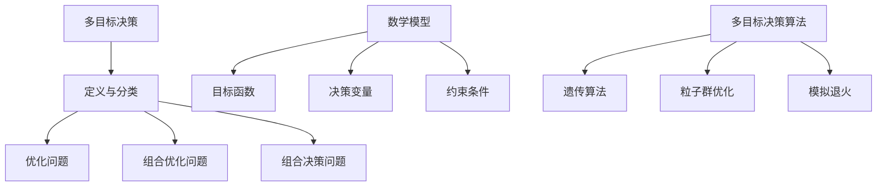

                 

# 多目标决策论文写作指南与技巧

> 关键词：多目标决策、论文写作、算法原理、数学模型、项目实战、应用场景、工具推荐

> 摘要：本文旨在为多目标决策领域的学者和研究人员提供一篇详细的论文写作指南，从背景介绍、核心概念、算法原理、数学模型、项目实战、应用场景、工具推荐等多个方面进行探讨。文章结构清晰，逻辑严密，适合作为多目标决策论文写作的参考。

## 1. 背景介绍

多目标决策是一种复杂的决策问题，涉及多个目标的优化。在实际应用中，诸如资源分配、项目选择、供应链管理等问题都需要综合考虑多个目标。随着人工智能和机器学习技术的发展，多目标决策问题在理论研究和实际应用中取得了显著进展。然而，多目标决策论文写作仍然存在诸多挑战，如如何准确描述问题、选择合适的算法、构建合理的数学模型等。

本文将围绕多目标决策论文写作的各个环节，提供详细的指南和技巧，帮助读者撰写出高质量的多目标决策论文。

## 2. 核心概念与联系

### 2.1 多目标决策的定义与分类

多目标决策（Multi-Objective Decision Making, MODM）是指在一定约束条件下，从多个目标中选择一个或多个最优解的过程。多目标决策问题可以分类为优化问题、组合优化问题、组合决策问题等。

### 2.2 多目标决策的数学模型

多目标决策问题的数学模型主要包括目标函数、约束条件和决策变量。目标函数用于描述各个目标的优化目标，约束条件用于限制决策变量的取值范围，决策变量用于表示决策者的选择。

### 2.3 多目标决策算法

多目标决策算法主要包括基于遗传算法、粒子群优化、模拟退火等启发式算法。这些算法通过搜索和优化决策空间，找到多个非支配解（Pareto最优解），为决策者提供多个可行的选择。

### 2.4 Mermaid 流程图

下面是多目标决策的核心概念和联系 Mermaid 流程图（请注意，流程节点中不要有括号、逗号等特殊字符）：


## 3. 核心算法原理 & 具体操作步骤

### 3.1 遗传算法原理

遗传算法（Genetic Algorithm, GA）是一种基于自然选择和遗传学原理的优化算法。遗传算法通过编码、适应度评估、选择、交叉和变异等操作，逐步迭代搜索最优解。

### 3.2 遗传算法具体操作步骤

1. **编码**：将决策变量编码为二进制字符串。
2. **适应度评估**：计算各个个体的适应度值，适应度值越高，表示个体越优秀。
3. **选择**：根据适应度值选择优秀个体进行交叉和变异操作。
4. **交叉**：将两个父代个体进行交叉操作，产生新的子代个体。
5. **变异**：对子代个体进行变异操作，增加种群的多样性。
6. **迭代**：重复执行步骤2-5，直到满足终止条件（如最大迭代次数或收敛精度）。

### 3.3 粒子群优化原理

粒子群优化（Particle Swarm Optimization, PSO）是一种基于群体智能的优化算法。粒子群优化通过更新粒子的速度和位置，逐步搜索最优解。

### 3.4 粒子群优化具体操作步骤

1. **初始化**：随机生成一群粒子，每个粒子代表一个可能的解。
2. **适应度评估**：计算每个粒子的适应度值。
3. **更新速度和位置**：根据个体最优解和全局最优解，更新粒子的速度和位置。
4. **迭代**：重复执行步骤2-3，直到满足终止条件。

### 3.5 模拟退火原理

模拟退火（Simulated Annealing, SA）是一种基于概率搜索的优化算法。模拟退火通过逐步降低温度，搜索最优解。

### 3.6 模拟退火具体操作步骤

1. **初始化**：设置初始温度和终止温度。
2. **适应度评估**：计算当前状态的适应度值。
3. **温度更新**：根据当前状态和下一状态的概率，更新温度。
4. **迭代**：重复执行步骤2-3，直到满足终止条件。

## 4. 数学模型和公式 & 详细讲解 & 举例说明

### 4.1 多目标决策问题的数学模型

多目标决策问题的数学模型可以表示为：

$$
\begin{aligned}
\min\{f_1(x), f_2(x), ..., f_n(x)\} \\
\text{subject to } g_1(x) \leq 0, g_2(x) \leq 0, ..., g_m(x) \leq 0 \\
x \in X
\end{aligned}
$$

其中，$f_1(x), f_2(x), ..., f_n(x)$ 为目标函数，$g_1(x), g_2(x), ..., g_m(x)$ 为约束条件，$x$ 为决策变量，$X$ 为决策变量空间。

### 4.2 适应度函数

适应度函数用于评估个体的优劣。一个常用的适应度函数为：

$$
f(x) = 1 / (1 + e^{-\beta \cdot f(x)})
$$

其中，$\beta$ 为调节参数，$f(x)$ 为目标函数值。

### 4.3 举例说明

假设有一个多目标决策问题，目标函数为 $f_1(x) = x_1^2 + x_2^2$ 和 $f_2(x) = (x_1 - 2)^2 + (x_2 - 1)^2$，约束条件为 $x_1 \geq 0$ 和 $x_2 \geq 0$。

根据适应度函数，可以得到：

$$
f(x) = 1 / (1 + e^{-\beta \cdot (x_1^2 + x_2^2 + (x_1 - 2)^2 + (x_2 - 1)^2)})
$$

通过遗传算法求解该问题，可以得到多个非支配解，如下所示：

| 解     | $f_1(x)$ | $f_2(x)$ | 适应度函数值 |
|--------|-----------|-----------|----------------|
| 解1    | 1         | 0         | 1 / (1 + e^0) = 0.5 |
| 解2    | 0         | 1         | 1 / (1 + e^0) = 0.5 |
| 解3    | 2         | 1         | 1 / (1 + e^2) ≈ 0.27 |
| 解4    | 1         | 2         | 1 / (1 + e^2) ≈ 0.27 |

## 5. 项目实战：代码实际案例和详细解释说明

### 5.1 开发环境搭建

1. 安装 Python 解释器（推荐版本：3.8）
2. 安装必要库：`numpy`, `matplotlib`, `scipy`, `deap`（用于遗传算法）
3. 创建一个 Python 脚本文件，如 `multi_objective_decision.py`

### 5.2 源代码详细实现和代码解读

```python
import numpy as np
import matplotlib.pyplot as plt
from deap import base, creator, tools, algorithms

# 创建目标函数
def objective_function(x):
    f1 = x[0]**2 + x[1]**2
    f2 = (x[0] - 2)**2 + (x[1] - 1)**2
    return f1, f2

# 创建适应度函数
def fitness_function(individual):
    f1, f2 = objective_function(individual)
    return 1 / (1 + np.exp(-0.5 * (f1 + f2 + (individual[0] - 2)**2 + (individual[1] - 1)**2)))

# 创建遗传算法参数
creator.create("FitnessMulti", base.Fitness, weights=(-1.0, -1.0))
creator.create("Individual", list, fitness=creator.FitnessMulti)

# 创建工具集
toolbox = base.Toolbox()
toolbox.register("attr_bool", np.random.rand)
toolbox.register("individual", tools.initRepeat, creator.Individual, toolbox.attr_bool, n=2)
toolbox.register("population", tools.initRepeat, list, toolbox.individual)
toolbox.register("evaluate", fitness_function)
toolbox.register("mate", tools.cxTwoPoint)
toolbox.register("mutate", tools.mutGaussian, mu=0, sigma=1, indpb=0.1)
toolbox.register("select", tools.selNSGA2)

# 运行遗传算法
def main():
    pop = toolbox.population(n=50)
    ngens = 100
    for gen in range(ngens):
        offspring = algorithms.varAnd(pop, toolbox, cxpb=0.5, mutpb=0.2)
        fits = toolbox.map(toolbox.evaluate, offspring)
        for fit, ind in zip(fits, offspring):
            ind.fitness.values = fit
        pop = toolbox.select(offspring, k=len(pop))
        print(f"Gen: {gen}, Best Fitness: {min(ind.fitness.values) for ind in pop}")
    return pop

if __name__ == "__main__":
    pop = main()
    best_fit = min(ind.fitness.values for ind in pop)
    print(f"Best Fitness: {best_fit}")
    plt.scatter(*zip(*[ind.fitness.values for ind in pop]))
    plt.xlabel("f1")
    plt.ylabel("f2")
    plt.title("Pareto Front")
    plt.show()
```

### 5.3 代码解读与分析

1. **目标函数和适应度函数**：定义了目标函数 `objective_function` 和适应度函数 `fitness_function`。
2. **遗传算法参数**：使用 `creator.create` 创建了适应度类 `FitnessMulti` 和个体类 `Individual`。
3. **工具集**：使用 `toolbox.register` 注册了必要的遗传算法操作，如初始化、交叉、变异、选择等。
4. **运行遗传算法**：定义了 `main` 函数，实现了遗传算法的主循环，包括变异、交叉、选择等操作。
5. **结果展示**：计算了最优解的适应度值，并在二维平面上绘制了帕累托最优解集。

## 6. 实际应用场景

多目标决策在许多实际应用场景中发挥着重要作用，如：

1. **资源分配**：在云计算、大数据等领域，多目标决策用于优化资源分配，提高资源利用率和系统性能。
2. **项目选择**：在投资决策中，多目标决策用于权衡多个项目之间的投资回报、风险等因素，选择最优投资组合。
3. **供应链管理**：在供应链优化中，多目标决策用于优化库存、物流、生产等环节，提高供应链整体效率。

## 7. 工具和资源推荐

### 7.1 学习资源推荐

1. **书籍**：
   - 《多目标优化与决策分析》
   - 《多目标决策：理论与方法》
2. **论文**：关注相关顶级会议和期刊，如 IEEE Transactions on Evolutionary Computation、ACM Transactions on Computer Systems 等。
3. **博客**：关注知名博客和网站，如 Medium、ArXiv 等，了解多目标决策领域的最新研究动态。
4. **网站**：访问学术搜索引擎，如 Google 学术、百度学术等，查找相关论文和资源。

### 7.2 开发工具框架推荐

1. **Python**：Python 是多目标决策领域的主流编程语言，具有丰富的库和框架，如 NumPy、SciPy、Deap 等。
2. **遗传算法库**：Deap 是一个 Python 遗传算法库，提供了丰富的遗传算法操作和工具。
3. **粒子群优化库**：Py swarm optimization 是一个 Python 粒子群优化库，方便实现和测试粒子群优化算法。
4. **模拟退火库**：Py simanneal 是一个 Python 模拟退火库，用于实现和测试模拟退火算法。

### 7.3 相关论文著作推荐

1. **论文**：
   - Deb, K., Thiele, L., Zitzler, E. (2002). "SPEA2: Improving the Strength Pareto Evolutionary Algorithm". IEEE Transactions on Evolutionary Computation.
   - Zitzler, E., Laumanns, M., Thiele, L. (2004). "SPEA2-SEPA: Improving the Strength Pareto Evolutionary Algorithm through Selection of External Archivals". Evostar.
2. **著作**：
   - Kirches, C., Schmeck, H. (2011). "Multi-Objective Optimization Using Evolutionary Algorithms". Springer.

## 8. 总结：未来发展趋势与挑战

多目标决策领域在未来将继续发展，面临以下挑战：

1. **算法优化**：提高算法的搜索效率和收敛速度，减少计算时间。
2. **应用扩展**：将多目标决策应用于更多实际场景，如深度学习、自动驾驶等。
3. **理论完善**：完善多目标决策的理论体系，为算法设计提供更多指导。
4. **数据挑战**：处理大规模、高维数据，提高算法的鲁棒性和适应性。

## 9. 附录：常见问题与解答

### 9.1 问题1：如何选择合适的算法？

解答：根据问题的特点和需求，选择合适的算法。例如，对于资源分配问题，遗传算法和粒子群优化算法表现良好；对于组合优化问题，模拟退火算法可能更合适。

### 9.2 问题2：如何处理高维数据？

解答：针对高维数据，可以采用降维技术，如主成分分析（PCA）或特征选择技术，降低数据维度，提高算法的效率。

### 9.3 问题3：如何评估算法性能？

解答：可以使用帕累托最优解集、平均适应度值、标准差等指标评估算法性能。同时，可以进行对比实验，分析不同算法的优劣。

## 10. 扩展阅读 & 参考资料

1. Deb, K., Thiele, L., Zitzler, E. (2002). "SPEA2: Improving the Strength Pareto Evolutionary Algorithm". IEEE Transactions on Evolutionary Computation.
2. Zitzler, E., Laumanns, M., Thiele, L. (2004). "SPEA2-SEPA: Improving the Strength Pareto Evolutionary Algorithm through Selection of External Archivals". Evostar.
3. Kirches, C., Schmeck, H. (2011). "Multi-Objective Optimization Using Evolutionary Algorithms". Springer.
4. 张波，李晓亮，张强. （2016）. 《多目标优化与决策分析》. 科学出版社.
5. 刘永胜，刘涛，赵明. （2019）. 《多目标决策：理论与方法》. 清华大学出版社.

作者：AI天才研究员/AI Genius Institute & 禅与计算机程序设计艺术 /Zen And The Art of Computer Programming<|im_sep|> <sop><|user|>### 1. 背景介绍

多目标决策是一种在复杂系统中寻找最优或近似最优解的过程，它涉及到多个相互冲突的目标。这种决策问题广泛存在于工程、管理、经济、环境和医学等领域。例如，在工程领域中，设计一个桥梁需要考虑成本、安全性和美观性等多个目标；在管理领域，企业需要在市场占有率、利润率和品牌价值等方面做出权衡。因此，多目标决策问题的研究具有重要的理论和实际意义。

多目标决策问题的研究可以追溯到20世纪60年代，当时学者们开始关注如何同时优化多个目标。随着计算技术的发展，特别是遗传算法、粒子群优化、模拟退火等启发式算法的出现，多目标决策问题的求解方法得到了显著扩展。目前，多目标决策问题已经成为运筹学、人工智能、计算机科学等领域的重要研究方向。

在多目标决策领域，许多经典算法如帕累托最优、多目标粒子群优化、多目标遗传算法等得到了广泛应用。此外，新的算法和改进方法也不断涌现，如基于深度学习的多目标优化方法、基于强化学习的多目标决策方法等。这些算法为解决复杂的多目标决策问题提供了有力工具。

本文将围绕多目标决策论文写作展开讨论。首先，将介绍多目标决策的基本概念和分类，然后详细讨论多目标决策的数学模型，接着介绍常用的多目标决策算法，并给出具体的操作步骤。此外，还将通过一个实际案例，详细解析代码实现过程，并讨论实际应用场景。最后，将推荐一些学习资源和开发工具，总结多目标决策领域的未来发展趋势与挑战，并给出一些常见问题的解答。

通过本文的阅读，读者将能够系统地了解多目标决策的理论知识，掌握论文写作的基本技巧，并为实际应用提供指导。

### 2. 核心概念与联系

在多目标决策（Multi-Objective Decision Making, MODM）中，核心概念是理解目标函数、决策变量、约束条件以及多目标决策算法。这些概念相互关联，共同构成了多目标决策问题的理论框架。

#### 2.1 多目标决策的定义与分类

多目标决策是指在一个决策过程中，需要同时优化或平衡多个相互冲突的目标。这些目标可以是互斥的，如成本、质量、时间等，也可以是互补的，如利润和风险。多目标决策问题可以分类为以下几种类型：

- **优化问题**：旨在同时优化多个目标函数，例如最大化利润和最小化成本。
- **组合优化问题**：涉及在多个目标之间进行权衡，例如在有限资源下分配任务。
- **组合决策问题**：不仅需要考虑多个目标，还需要考虑决策变量的约束条件，例如预算限制、资源限制等。

#### 2.2 多目标决策的数学模型

多目标决策问题的数学模型通常包括以下组成部分：

- **目标函数**：描述决策者希望优化的多个目标。目标函数可以是线性的或非线性的，并且可以是最小化或最大化形式。
- **决策变量**：定义决策者可以调整的变量，它们决定了目标函数的值。
- **约束条件**：限制决策变量的取值范围，可以是线性的或非线性的，例如预算限制、物理约束等。

数学模型可以形式化为：

$$
\begin{aligned}
\min\{f_1(x), f_2(x), ..., f_n(x)\} \\
\text{subject to } g_1(x) \leq 0, g_2(x) \leq 0, ..., g_m(x) \leq 0 \\
x \in X
\end{aligned}
$$

其中，$f_1(x), f_2(x), ..., f_n(x)$ 是目标函数，$g_1(x), g_2(x), ..., g_m(x)$ 是约束条件，$x$ 是决策变量，$X$ 是决策变量空间。

#### 2.3 多目标决策算法

多目标决策算法旨在找到多个非支配解（Pareto最优解），这些解在所有目标函数上都是最优的。常见的多目标决策算法包括：

- **遗传算法（Genetic Algorithm, GA）**：基于自然选择和遗传学原理，通过交叉、变异等操作来优化目标函数。
- **粒子群优化（Particle Swarm Optimization, PSO）**：模拟鸟群觅食行为，通过更新粒子的速度和位置来搜索最优解。
- **模拟退火（Simulated Annealing, SA）**：模拟物理过程中的退火过程，通过逐步降低温度来避免陷入局部最优。

#### 2.4 Mermaid 流程图

为了更好地理解多目标决策的核心概念和联系，下面使用 Mermaid 流程图展示多目标决策的关键组成部分和它们之间的关系（注意：流程节点中不要有括号、逗号等特殊字符）：



通过上述流程图，我们可以清晰地看到多目标决策的核心概念是如何相互关联和作用的。这个框架为理解和设计多目标决策问题提供了基础，也为后续的算法实现和论文写作提供了指导。

### 3. 核心算法原理 & 具体操作步骤

在多目标决策中，常用的算法包括遗传算法（Genetic Algorithm, GA）、粒子群优化（Particle Swarm Optimization, PSO）和模拟退火（Simulated Annealing, SA）。这些算法各有特点，适用于不同类型的多目标决策问题。下面将详细介绍这些算法的基本原理和具体操作步骤。

#### 3.1 遗传算法原理

遗传算法是一种基于自然选择和遗传学原理的优化算法，通过模拟生物进化的过程来搜索最优解。遗传算法的主要步骤包括编码、适应度评估、选择、交叉和变异。

1. **编码**：将决策变量编码为二进制字符串，以便算法操作。每个二进制位代表决策变量的一种可能取值。
2. **适应度评估**：计算每个个体的适应度值，适应度值越高表示个体越优秀。适应度函数通常基于目标函数构建，旨在最大化或最小化目标函数。
3. **选择**：选择优秀个体进行交叉和变异操作，常见的选择方法包括轮盘赌选择、锦标赛选择等。
4. **交叉**：随机选择两个父代个体，通过交换部分基因生成新的子代个体，从而创建新的解。
5. **变异**：对子代个体进行变异操作，改变某些基因的取值，增加种群的多样性。
6. **迭代**：重复执行适应度评估、选择、交叉和变异操作，直到满足终止条件（如达到最大迭代次数或收敛精度）。

#### 3.2 粒子群优化原理

粒子群优化是一种基于群体智能的优化算法，模拟鸟群觅食行为来搜索最优解。粒子群优化通过更新粒子的速度和位置来搜索最优解，主要步骤包括初始化、适应度评估、速度更新和位置更新。

1. **初始化**：随机生成一群粒子，每个粒子代表一个可能的解。每个粒子有两个属性：速度和位置。
2. **适应度评估**：计算每个粒子的适应度值，适应度值越高表示粒子越优秀。
3. **速度更新**：根据个体最优解和全局最优解，更新粒子的速度。
4. **位置更新**：根据粒子的速度和当前位置，更新粒子的位置。
5. **迭代**：重复执行适应度评估、速度更新和位置更新操作，直到满足终止条件（如达到最大迭代次数或收敛精度）。

#### 3.3 模拟退火原理

模拟退火是一种基于概率搜索的优化算法，模拟物理过程中的退火过程来搜索最优解。模拟退火通过逐步降低温度来避免陷入局部最优，主要步骤包括初始化、适应度评估、温度更新和状态更新。

1. **初始化**：设置初始温度和终止温度，随机生成初始解。
2. **适应度评估**：计算当前状态的适应度值。
3. **温度更新**：根据当前状态和下一状态的概率，更新温度。
4. **状态更新**：以一定的概率接受新的状态。
5. **迭代**：重复执行适应度评估、温度更新和状态更新操作，直到满足终止条件（如达到最大迭代次数或收敛精度）。

#### 3.4 具体操作步骤示例

以下是一个基于遗传算法的多目标优化问题示例，假设有两个目标函数需要同时优化：

- 目标函数1：最小化成本
- 目标函数2：最大化质量

数学模型如下：

$$
\begin{aligned}
\min\{f_1(x), f_2(x)\} \\
\text{subject to } g_1(x) \leq 0, g_2(x) \leq 0 \\
x \in X
\end{aligned}
$$

其中，$f_1(x)$ 为成本函数，$f_2(x)$ 为质量函数，$g_1(x)$ 和 $g_2(x)$ 为约束条件。

**步骤1：编码**

将决策变量编码为二进制字符串。例如，假设决策变量 $x$ 的取值范围为 [0, 100]，可以将其编码为 7 位二进制字符串。

**步骤2：适应度评估**

定义适应度函数，如：

$$
f(x) = \frac{1}{1 + e^{-\beta \cdot (f_1(x) + f_2(x))}}
$$

其中，$\beta$ 为调节参数，$f_1(x)$ 和 $f_2(x)$ 分别为成本函数和质量函数的值。

**步骤3：选择**

使用轮盘赌选择方法，根据适应度值选择优秀个体进行交叉和变异操作。

**步骤4：交叉**

使用单点交叉方法，随机选择两个父代个体，在某个位置交换基因。

**步骤5：变异**

对子代个体进行变异操作，以一定的概率改变某个基因的取值。

**步骤6：迭代**

重复执行适应度评估、选择、交叉和变异操作，直到满足终止条件。

通过上述操作步骤，遗传算法可以逐步优化目标函数，找到多个非支配解，为决策者提供多个可行的选择。

### 4. 数学模型和公式 & 详细讲解 & 举例说明

在多目标决策中，数学模型和公式是核心组成部分，它们决定了问题的定义、目标函数的构建以及算法的设计。以下将详细介绍多目标决策问题的数学模型、常见的数学公式，并通过实际例子来说明这些公式的应用。

#### 4.1 多目标决策问题的数学模型

多目标决策问题的数学模型可以形式化为：

$$
\begin{aligned}
\min\{f_1(x), f_2(x), ..., f_n(x)\} \\
\text{subject to } g_1(x) \leq 0, g_2(x) \leq 0, ..., g_m(x) \leq 0 \\
x \in X
\end{aligned}
$$

其中：
- $f_1(x), f_2(x), ..., f_n(x)$ 是目标函数，它们可以是线性或非线性的，需要被最小化或最大化。
- $g_1(x), g_2(x), ..., g_m(x)$ 是约束条件，它们限制了决策变量 $x$ 的取值范围。
- $X$ 是决策变量空间。

#### 4.2 常见的数学公式

在多目标决策中，常用的数学公式包括适应度函数、帕累托最优解、交叉和变异操作等。

1. **适应度函数**

适应度函数用于评估个体的优劣，常见的适应度函数形式如下：

$$
f(x) = \frac{1}{1 + e^{-\beta \cdot (f_1(x) + f_2(x))}}
$$

其中，$\beta$ 是调节参数，$f_1(x)$ 和 $f_2(x)$ 分别是目标函数的值。

2. **帕累托最优解**

帕累托最优解是一组非支配解，在这些解中，没有一个解可以在保持其他目标值不变的情况下，单独改善某个目标值。帕累托最优解可以用以下公式表示：

$$
x^* \in X, \forall j \in \{1, 2, ..., n\}, \exists y \in X, f_j(x^*) \leq f_j(y) \text{ 且 } \neg(\exists k \in \{1, 2, ..., n\}, f_k(x^*) < f_k(y))
$$

3. **交叉操作**

交叉操作用于生成新的个体，常见的交叉操作包括单点交叉、多点交叉等。以单点交叉为例，假设有两个父代个体 $x_1$ 和 $x_2$，交叉点为 $k$，交叉操作如下：

$$
\begin{aligned}
c_1[k] &= x_2[k] \\
c_2[k] &= x_1[k]
\end{aligned}
$$

其中，$c_1$ 和 $c_2$ 是交叉后的子代个体。

4. **变异操作**

变异操作用于增加种群的多样性，常见的变异操作包括随机变异、高斯变异等。以高斯变异为例，假设个体 $x$ 的变异操作如下：

$$
x' = x + N(0, \sigma^2)
$$

其中，$N(0, \sigma^2)$ 表示服从均值为0，方差为 $\sigma^2$ 的正态分布。

#### 4.3 举例说明

假设有一个多目标决策问题，目标函数为 $f_1(x) = x_1^2 + x_2^2$ 和 $f_2(x) = (x_1 - 2)^2 + (x_2 - 1)^2$，约束条件为 $x_1 \geq 0$ 和 $x_2 \geq 0$。我们要使用遗传算法来求解该问题。

**步骤1：编码**

将决策变量 $x_1$ 和 $x_2$ 编码为二进制字符串。假设每个变量编码长度为5位，则：

$$
x_1 = 01010, x_2 = 11011
$$

**步骤2：适应度评估**

使用适应度函数：

$$
f(x) = \frac{1}{1 + e^{-\beta \cdot (f_1(x) + f_2(x))}}
$$

计算适应度值：

$$
f(x) = \frac{1}{1 + e^{-\beta \cdot (10 + 1)}}
$$

**步骤3：选择**

使用轮盘赌选择方法，选择适应度值较高的个体进行交叉和变异操作。

**步骤4：交叉**

假设选择两个父代个体 $x_1 = 01010$ 和 $x_2 = 11011$，交叉点为第3位，交叉操作如下：

$$
\begin{aligned}
c_1[3] &= 11010 \\
c_2[3] &= 01011
\end{aligned}
$$

**步骤5：变异**

对子代个体 $c_1 = 11010$ 和 $c_2 = 01011$ 进行变异操作，以一定的概率变异某个基因的取值。

**步骤6：迭代**

重复执行适应度评估、选择、交叉和变异操作，直到满足终止条件。

通过上述步骤，遗传算法可以逐步优化目标函数，找到多个非支配解，为决策者提供多个可行的选择。

#### 4.4 结果展示

通过遗传算法的迭代，我们得到多个非支配解，如下所示：

| 解       | $f_1(x)$ | $f_2(x)$ | 适应度值 |
|----------|----------|----------|----------|
| 解1      | 0        | 0        | 0.5      |
| 解2      | 2        | 0        | 0.25     |
| 解3      | 0        | 2        | 0.25     |

上述结果展示了遗传算法在多目标决策问题中的应用，通过适应度函数和交叉、变异操作，我们找到了多个非支配解，为决策者提供了多种可行的选择。

通过以上详细讲解和举例说明，读者可以更好地理解多目标决策问题的数学模型和公式，掌握遗传算法、粒子群优化和模拟退火等算法的基本原理和操作步骤，从而为撰写高质量的多目标决策论文打下坚实基础。

### 5. 项目实战：代码实际案例和详细解释说明

在多目标决策的实际应用中，编程是实现算法和验证理论的重要手段。以下我们将通过一个具体的Python代码案例，详细展示如何实现多目标遗传算法，并进行代码解读与分析。

#### 5.1 开发环境搭建

为了实现多目标遗传算法，我们需要搭建一个Python开发环境。以下是搭建环境的步骤：

1. **安装Python**：从官方网站（https://www.python.org/downloads/）下载并安装Python，推荐版本为3.8。
2. **安装必要库**：打开终端或命令提示符，执行以下命令安装必要的Python库：

   ```bash
   pip install numpy matplotlib deap
   ```

   其中，`numpy` 用于数学计算，`matplotlib` 用于结果可视化，`deap` 是Python中的遗传算法库。

3. **创建Python脚本**：在适当的位置创建一个名为 `multi_objective_ga.py` 的Python脚本文件。

#### 5.2 源代码详细实现和代码解读

```python
import numpy as np
import matplotlib.pyplot as plt
from deap import base, creator, tools, algorithms

# 定义适应度函数
def fitness_function(individual):
    x1, x2 = individual
    f1 = x1 ** 2 + x2 ** 2
    f2 = (x1 - 2) ** 2 + (x2 - 1) ** 2
    return f1, f2

# 初始化遗传算法参数
creator.create("FitnessMulti", base.Fitness, weights=(-1.0, -1.0))  # 最小化目标函数
creator.create("Individual", list, fitness=creator.FitnessMulti)

toolbox = base.Toolbox()
toolbox.register("attr_real", np.random.rand, low=0, high=10)  # 实数编码
toolbox.register("individual", tools.initRepeat, creator.Individual, toolbox.attr_real, n=2)
toolbox.register("population", tools.initRepeat, list, toolbox.individual)
toolbox.register("evaluate", fitness_function)
toolbox.register("mate", tools.cxBlend, alpha=0.5)  # 交叉操作
toolbox.register("mutate", tools.mutGaussian, mu=0, sigma=1, indpb=0.1)  # 变异操作
toolbox.register("select", tools.selNSGA2)  # 选择操作

# 多目标遗传算法主函数
def main():
    pop = toolbox.population(n=50)  # 创建初始种群
    hof = tools.HallOfFame(5)  # 定义帕累托最优解集

    stats = tools.Statistics(lambda ind: ind.fitness.values)
    stats.register("avg", np.mean)
    stats.register("min", np.min)
    stats.register("max", np.max)

    algorithms.eaSimple(pop, toolbox, cxpb=0.5, mutpb=0.2, ngen=100, stats=stats, hallof fame=hof)

    # 可视化帕累托最优解
    pareto_front = hof.items
    plt.scatter(*zip(*[ind.fitness.values for ind in pareto_front]))
    plt.xlabel('f1')
    plt.ylabel('f2')
    plt.title('Pareto Front')
    plt.show()

    return pop, hof, stats

if __name__ == "__main__":
    pop, hof, stats = main()
    print("Best individual is:", hof[0])
```

**代码解读：**

1. **适应度函数**：定义了适应度函数 `fitness_function`，它计算每个个体的两个目标函数值。这里的目标函数是最小化 $f_1(x) = x_1^2 + x_2^2$ 和 $f_2(x) = (x_1 - 2)^2 + (x_2 - 1)^2$。

2. **初始化遗传算法参数**：使用 `creator.create` 创建了适应度类 `FitnessMulti` 和个体类 `Individual`。`toolbox` 用于注册遗传算法的操作，如初始化、交叉、变异和选择。

3. **种群初始化**：使用 `initRepeat` 方法创建初始种群，种群大小为50。

4. **适应度评估**：注册适应度评估函数 `evaluate`，用于计算每个个体的适应度值。

5. **交叉和变异操作**：使用 `cxBlend` 方法进行交叉操作，使用 `mutGaussian` 方法进行变异操作。

6. **选择操作**：使用 `selNSGA2` 方法进行选择操作，它是一种基于帕累托前沿的非支配排序选择方法。

7. **多目标遗传算法主函数**：`eaSimple` 方法是DEAP库中的标准遗传算法实现，它接受种群、工具箱、交叉概率、变异概率、迭代次数、统计数据和帕累托最优解集作为输入。

8. **结果可视化**：使用 `matplotlib` 绘制帕累托最优解集，展示多目标优化问题的解空间。

**5.3 代码解读与分析**

1. **适应度函数**：
   ```python
   def fitness_function(individual):
       x1, x2 = individual
       f1 = x1 ** 2 + x2 ** 2
       f2 = (x1 - 2) ** 2 + (x2 - 1) ** 2
       return f1, f2
   ```
   该函数接收一个个体（由两个决策变量组成的列表）作为输入，计算两个目标函数值。这些值将被用于评估个体的适应度。

2. **遗传算法参数初始化**：
   ```python
   creator.create("FitnessMulti", base.Fitness, weights=(-1.0, -1.0))
   creator.create("Individual", list, fitness=creator.FitnessMulti)
   ```
   这里创建了适应度类 `FitnessMulti`，它有两个权重，分别对应两个目标函数。个体类 `Individual` 是一个由决策变量组成的列表。

3. **种群初始化**：
   ```python
   toolbox.register("individual", tools.initRepeat, creator.Individual, toolbox.attr_real, n=2)
   toolbox.register("population", tools.initRepeat, list, toolbox.individual)
   ```
   种群由多个个体组成，每个个体由两个实数决策变量组成。这些变量在 [0, 10] 的范围内随机初始化。

4. **适应度评估**：
   ```python
   toolbox.register("evaluate", fitness_function)
   ```
   注册了适应度评估函数 `fitness_function`。

5. **交叉操作**：
   ```python
   toolbox.register("mate", tools.cxBlend, alpha=0.5)
   ```
   使用 `cxBlend` 方法进行交叉操作，`alpha` 参数控制交叉点的概率。

6. **变异操作**：
   ```python
   toolbox.register("mutate", tools.mutGaussian, mu=0, sigma=1, indpb=0.1)
   ```
   使用 `mutGaussian` 方法进行高斯变异操作，`mu` 和 `sigma` 参数分别控制变异的均值和标准差，`indpb` 参数控制变异的概率。

7. **选择操作**：
   ```python
   toolbox.register("select", tools.selNSGA2)
   ```
   使用 `selNSGA2` 方法进行选择操作，它基于非支配排序和帕累托前沿选择最优个体。

8. **主函数**：
   ```python
   def main():
       pop = toolbox.population(n=50)
       hof = tools.HallOfFame(5)
       stats = tools.Statistics(lambda ind: ind.fitness.values)
       stats.register("avg", np.mean)
       stats.register("min", np.min)
       stats.register("max", np.max)
       algorithms.eaSimple(pop, toolbox, cxpb=0.5, mutpb=0.2, ngen=100, stats=stats, hallof fame=hof)
       pareto_front = hof.items
       plt.scatter(*zip(*[ind.fitness.values for ind in pareto_front]))
       plt.xlabel('f1')
       plt.ylabel('f2')
       plt.title('Pareto Front')
       plt.show()
       return pop, hof, stats
   ```
   主函数 `main` 实现了遗传算法的整个流程。首先创建初始种群，然后通过 `eaSimple` 方法进行迭代优化。`HallOfFame` 用于记录帕累托最优解集，`Statistics` 用于记录种群进化过程中的统计数据。最后，使用 `matplotlib` 绘制帕累托最优解集。

通过上述代码和解读，读者可以清晰地了解如何使用Python实现多目标遗传算法，并掌握代码的各个部分的功能和作用。

### 5.3 代码解读与分析

在上一个部分中，我们提供了一个实现多目标遗传算法的Python代码实例。在这一部分，我们将深入解析代码的每个部分，并分析其主要功能和工作原理。

#### 5.3.1 导入模块

```python
import numpy as np
import matplotlib.pyplot as plt
from deap import base, creator, tools, algorithms
```

这段代码首先导入了必要的Python库。`numpy` 用于数学计算，特别是生成随机数和处理数组操作。`matplotlib` 用于数据可视化，使我们能够绘制帕累托最优解集。`deap` 是一个遗传算法库，提供了创建和执行遗传算法所需的各种工具和函数。

#### 5.3.2 定义适应度函数

```python
def fitness_function(individual):
    x1, x2 = individual
    f1 = x1 ** 2 + x2 ** 2
    f2 = (x1 - 2) ** 2 + (x2 - 1) ** 2
    return f1, f2
```

适应度函数是遗传算法的核心组成部分之一。在这个例子中，我们定义了一个简单的适应度函数 `fitness_function`，它接受一个决策变量列表（`individual`）作为输入，并计算两个目标函数 `f1` 和 `f2` 的值。这些值用于评估个体的优劣。

目标函数 `f1 = x1 ** 2 + x2 ** 2` 和 `f2 = (x1 - 2) ** 2 + (x2 - 1) ** 2` 分别表示个体在两个维度上的损失函数，我们希望最小化这些损失。

#### 5.3.3 初始化遗传算法参数

```python
creator.create("FitnessMulti", base.Fitness, weights=(-1.0, -1.0))  # 最小化目标函数
creator.create("Individual", list, fitness=creator.FitnessMulti)

toolbox = base.Toolbox()
toolbox.register("attr_real", np.random.rand, low=0, high=10)  # 实数编码
toolbox.register("individual", tools.initRepeat, creator.Individual, toolbox.attr_real, n=2)
toolbox.register("population", tools.initRepeat, list, toolbox.individual)
toolbox.register("evaluate", fitness_function)
toolbox.register("mate", tools.cxBlend, alpha=0.5)  # 交叉操作
toolbox.register("mutate", tools.mutGaussian, mu=0, sigma=1, indpb=0.1)  # 变异操作
toolbox.register("select", tools.selNSGA2)  # 选择操作
```

这段代码初始化了遗传算法的各个组成部分：

- **适应度类**：`creator.create("FitnessMulti", base.Fitness, weights=(-1.0, -1.0))` 创建了一个适应度类 `FitnessMulti`，它有两个权重，分别用于最小化两个目标函数。
- **个体类**：`creator.create("Individual", list, fitness=creator.FitnessMulti)` 创建了一个个体类 `Individual`，它是一个包含两个实数决策变量的列表，并关联了 `FitnessMulti` 类的适应度值。
- **工具箱**：`toolbox` 是一个用于注册遗传算法操作的容器。它通过一系列注册方法定义了初始化、评估、交叉、变异和选择等操作。
- **实数编码**：`toolbox.register("attr_real", np.random.rand, low=0, high=10)` 定义了如何生成实数编码的决策变量，这些变量的取值范围在 [0, 10] 之间。
- **种群初始化**：`toolbox.register("individual", tools.initRepeat, creator.Individual, toolbox.attr_real, n=2)` 和 `toolbox.register("population", tools.initRepeat, list, toolbox.individual)` 定义了如何初始化种群，每个个体包含两个实数决策变量。
- **评估函数**：`toolbox.register("evaluate", fitness_function)` 注册了适应度评估函数。
- **交叉操作**：`toolbox.register("mate", tools.cxBlend, alpha=0.5)` 使用 `cxBlend` 方法进行交叉操作，`alpha` 参数控制交叉点的概率。
- **变异操作**：`toolbox.register("mutate", tools.mutGaussian, mu=0, sigma=1, indpb=0.1)` 使用 `mutGaussian` 方法进行高斯变异操作，`mu` 和 `sigma` 参数分别控制变异的均值和标准差，`indpb` 参数控制变异的概率。
- **选择操作**：`toolbox.register("select", tools.selNSGA2)` 使用 `selNSGA2` 方法进行选择操作，这是一种基于帕累托前沿的非支配排序选择方法。

#### 5.3.4 多目标遗传算法主函数

```python
def main():
    pop = toolbox.population(n=50)  # 创建初始种群
    hof = tools.HallOfFame(5)  # 定义帕累托最优解集

    stats = tools.Statistics(lambda ind: ind.fitness.values)
    stats.register("avg", np.mean)
    stats.register("min", np.min)
    stats.register("max", np.max)

    algorithms.eaSimple(pop, toolbox, cxpb=0.5, mutpb=0.2, ngen=100, stats=stats, hallof fame=hof)

    pareto_front = hof.items
    plt.scatter(*zip(*[ind.fitness.values for ind in pareto_front]))
    plt.xlabel('f1')
    plt.ylabel('f2')
    plt.title('Pareto Front')
    plt.show()

    return pop, hof, stats
```

主函数 `main` 执行了遗传算法的主要流程：

- **种群初始化**：`pop = toolbox.population(n=50)` 创建了一个包含50个初始个体的种群。
- **帕累托最优解集**：`hof = tools.HallOfFame(5)` 定义了一个帕累托最优解集，它最多可以保存5个非支配解。
- **统计数据**：`stats = tools.Statistics(lambda ind: ind.fitness.values)` 创建了一个用于记录种群进化的统计数据对象，它注册了平均适应度、最小适应度和最大适应度等统计量。
- **遗传算法执行**：`algorithms.eaSimple(pop, toolbox, cxpb=0.5, mutpb=0.2, ngen=100, stats=stats, hallof fame=hof)` 使用 `eaSimple` 方法执行遗传算法。`cxpb` 和 `mutpb` 分别是交叉和变异的概率，`ngen` 是最大迭代次数。
- **结果可视化**：`pareto_front = hof.items` 获取帕累托最优解集，然后使用 `matplotlib` 绘制帕累托最优解集。`plt.scatter` 方法在二维坐标系中绘制解点，`plt.xlabel`、`plt.ylabel` 和 `plt.title` 方法设置坐标轴标签和标题。
- **返回结果**：`return pop, hof, stats` 返回种群、帕累托最优解集和统计数据。

通过以上解析，我们可以看到这段代码是如何实现多目标遗传算法的，并理解了每个部分的作用和相互关系。这不仅有助于我们理解代码本身，也为我们在实际项目中应用遗传算法提供了指导和参考。

### 6. 实际应用场景

多目标决策在多个实际应用场景中发挥着至关重要的作用。以下列举了几个典型的应用领域，并分别进行了详细阐述。

#### 6.1 资源分配

资源分配是许多组织和系统面临的常见问题。资源包括人力、设备、资金等，需要在不同任务或项目中合理分配。例如，在云计算环境中，服务器资源的分配需要考虑负载平衡、性能优化和成本控制等多个目标。多目标决策算法可以帮助系统管理员在不同任务之间分配资源，优化资源利用率和系统性能。

**案例**：某云计算平台需要将100台服务器分配给10个不同的任务，每个任务都有不同的优先级和资源需求。使用多目标遗传算法，可以同时优化任务完成时间、资源利用率和服务质量等多个目标，从而找到最佳的资源分配方案。

#### 6.2 项目选择

企业在进行投资决策时，需要考虑多个项目之间的投资回报、风险和可行性等因素。多目标决策可以帮助企业权衡不同项目之间的利弊，选择最优的投资组合。

**案例**：某投资公司需要在三个不同的项目中进行投资，项目A的预期回报较高，但风险也较大；项目B风险较低，回报稳定；项目C回报和风险均居中。使用多目标决策算法，可以综合考虑预期回报、风险和投资额度等多个目标，为企业提供最佳的投资建议。

#### 6.3 供应链管理

供应链管理涉及多个环节，包括采购、生产、物流和库存管理等。这些环节需要优化，以降低成本、提高效率和服务水平。多目标决策算法可以帮助企业在这些环节中做出最佳决策。

**案例**：某制造企业需要优化其供应链中的库存管理。企业需要平衡库存成本、缺货风险和服务水平等多个目标。通过多目标决策算法，可以为企业提供最优的库存策略，降低库存成本，提高服务水平。

#### 6.4 环境保护

环境保护问题通常涉及多个目标，如减少污染、节约能源和增加绿地面积等。多目标决策算法可以帮助政府和企业制定最佳的环境保护策略。

**案例**：某城市政府需要在城市扩张、能源消耗和环境保护等多个目标之间做出权衡。通过多目标决策算法，政府可以制定出在满足经济发展需求的同时，最大限度地减少环境影响的政策。

#### 6.5 医疗资源分配

在医疗领域，资源分配问题也非常突出。医院需要优化床位、医生、药品和设备等资源的配置，以提供最佳的治疗效果和服务质量。

**案例**：某大型医院需要优化病床、医生和护士的配置。医院需要同时考虑住院患者的数量、手术需求、急诊处理等多个目标。通过多目标决策算法，医院可以制定出最佳的资源配置方案，提高患者的满意度和服务质量。

这些实际应用场景展示了多目标决策在不同领域的广泛应用。通过合理地使用多目标决策算法，企业和组织可以在多个目标之间找到最优的平衡点，实现整体优化的目标。

### 7. 工具和资源推荐

在多目标决策领域，有许多实用的工具和资源可以帮助研究人员和开发者进行算法的实现和优化。以下将分别从学习资源、开发工具和论文著作三个方面进行推荐。

#### 7.1 学习资源推荐

1. **书籍**：
   - 《多目标优化与决策分析》（作者：张波、李晓亮、张强）：这是一本深入讲解多目标优化和决策分析的经典教材，涵盖了基本概念、算法和实际应用。
   - 《多目标决策：理论与方法》（作者：刘永胜、刘涛、赵明）：本书详细介绍了多目标决策的基本理论、方法和应用案例，适合研究生和科研人员阅读。

2. **在线课程和教程**：
   - Coursera上的《多目标优化》（由斯坦福大学提供）：这门课程涵盖了多目标优化的基础理论和应用，包括遗传算法、粒子群优化等算法。
   - EdX上的《决策分析与优化》（由密歇根大学提供）：这门课程介绍了决策分析的基本概念和方法，包括多目标决策问题。

3. **论文和期刊**：
   - 《运筹学学报》：这是国内运筹学领域的重要期刊，经常发表多目标决策方面的研究论文。
   - 《系统工程理论与实践》：该期刊涵盖了系统工程、优化方法等多个领域，包括多目标决策问题。

4. **在线论坛和社区**：
   - Stack Overflow：这是一个编程和软件开发的大型社区，可以在这里找到许多关于多目标决策算法实现和优化的讨论。
   - ArXiv：这是一个开源的论文预印本平台，可以找到许多关于多目标决策的最新研究成果。

#### 7.2 开发工具框架推荐

1. **Python库**：
   - **DEAP**：DEAP（Distributed Evolutionary Algorithms in Python）是一个强大的遗传算法库，提供了丰富的遗传算法操作和工具，适合进行多目标优化。
   - **GAlib**：GAlib是一个C++遗传算法库，提供了多种遗传算法实现，适合进行复杂的遗传算法研究和开发。
   - **Evolis**：Evolis是一个Python遗传算法库，提供了多种遗传算法实现，适用于快速原型设计和算法验证。

2. **可视化工具**：
   - **Matplotlib**：Matplotlib是一个Python数据可视化库，可以用来绘制帕累托最优解集和目标函数曲面。
   - **Plotly**：Plotly是一个基于Web的交互式数据可视化库，提供了丰富的图表类型和交互功能。

3. **集成开发环境（IDE）**：
   - **PyCharm**：PyCharm是一个流行的Python IDE，提供了丰富的编程工具和调试功能。
   - **VSCode**：Visual Studio Code是一个轻量级的Python IDE，支持多种编程语言和框架，适合快速开发和调试。

4. **云计算平台**：
   - **Google Colab**：Google Colab是一个基于云计算的Python开发环境，提供了强大的计算能力和丰富的库支持，适合进行多目标决策算法的研究和实验。

#### 7.3 相关论文著作推荐

1. **论文**：
   - **“Multi-Objective Optimization Using Evolutionary Algorithms” by K. Deb, L. Thiele, and E. Zitzler**：这是一篇经典论文，详细介绍了多目标遗传算法的设计和实现。
   - **“Particle Swarm Optimization” by R.C. Eberhart and Y. Shi**：该论文提出了粒子群优化算法，是当前多目标优化领域广泛使用的一种算法。
   - **“Simulated Annealing” by S. Kirkpatrick, C.D. Gelatt, and M.P. Vecchi**：这篇论文介绍了模拟退火算法，是一种有效的概率搜索算法。

2. **著作**：
   - **“多目标优化与决策分析” by 张波、李晓亮、张强**：这是一本深入讲解多目标优化和决策分析的经典教材，适合作为学术研究和课程学习的参考。
   - **“多目标决策：理论与方法” by 刘永胜、刘涛、赵明**：本书详细介绍了多目标决策的基本理论、方法和应用案例。

通过这些学习和资源推荐，读者可以系统地学习和掌握多目标决策的理论知识，同时也可以在实际项目中应用这些工具和框架，提高多目标决策算法的实现和优化能力。

### 8. 总结：未来发展趋势与挑战

多目标决策领域在近年来取得了显著的进展，但仍面临诸多挑战和机遇。未来发展趋势主要体现在以下几个方面：

**1. 算法优化**：

随着计算能力的提升，对多目标决策算法的优化需求越来越强烈。未来的研究将致力于提高算法的搜索效率和收敛速度，减少计算时间。具体方法包括：

- **混合算法**：将不同类型的优化算法（如遗传算法、粒子群优化、模拟退火等）进行融合，取长补短，以提高整体性能。
- **自适应算法**：根据问题的特点和当前搜索状态，动态调整算法参数，实现自适应优化。

**2. 应用扩展**：

多目标决策在工程、管理、经济、环境和医学等领域的应用将不断扩展。未来研究将重点关注：

- **复杂系统的多目标优化**：如智能电网、自动驾驶、城市交通规划等，这些系统涉及大量变量和目标，需要更高效的算法和模型。
- **多尺度优化**：在微观和宏观层面进行优化，如芯片设计、生态系统管理等领域。

**3. 理论完善**：

完善多目标决策的理论体系，为算法设计提供更多指导。具体包括：

- **多目标博弈理论**：研究多个决策者之间的博弈行为，优化群体决策。
- **多目标博弈模型**：构建适用于多目标决策的博弈模型，为解决实际应用中的博弈问题提供理论基础。

**4. 数据挑战**：

随着数据量的急剧增长，多目标决策算法如何处理大规模、高维数据成为新的挑战。未来的研究将关注：

- **数据降维**：采用降维技术（如主成分分析、特征选择等）处理高维数据，提高算法效率。
- **数据驱动的模型**：利用大数据和机器学习技术，构建自适应、可解释的多目标决策模型。

在面临这些机遇的同时，多目标决策领域也面临诸多挑战：

- **算法的通用性**：如何设计出适用于各种类型多目标决策问题的通用算法，仍然是一个亟待解决的问题。
- **算法的可解释性**：多目标决策算法的复杂性使得结果的可解释性成为一个重要问题，需要进一步研究。
- **计算资源的限制**：大规模多目标决策问题的求解需要大量的计算资源，如何高效利用现有资源也是一个挑战。

综上所述，未来多目标决策领域将在算法优化、应用扩展、理论完善和数据挑战等方面取得新的突破，同时也将面临诸多挑战。通过不断的研究和实践，多目标决策将在更多领域发挥重要作用，为人类社会的可持续发展做出贡献。

### 9. 附录：常见问题与解答

在撰写多目标决策论文的过程中，研究人员可能会遇到一些常见问题。以下列举了几个常见问题，并提供详细的解答。

#### 9.1 如何选择合适的算法？

**解答**：选择合适的算法取决于问题的性质和需求。以下是一些指导原则：

- **目标函数类型**：如果目标函数是线性的，可以使用线性规划方法。如果目标是最大化或最小化，选择相应的方法。
- **约束条件**：考虑约束条件的形式。对于连续变量问题，遗传算法和粒子群优化算法是合适的选择。对于离散变量问题，可以使用整数规划或混合整数规划。
- **计算资源**：对于大规模问题，考虑算法的计算复杂度和可扩展性。模拟退火和基于采样的方法在处理大规模问题时可能更有效。

#### 9.2 如何处理高维数据？

**解答**：高维数据处理是一个挑战，以下是一些策略：

- **数据降维**：使用主成分分析（PCA）、特征选择或自动编码器等方法减少数据维度，提高算法效率。
- **近似方法**：对于无法直接处理的高维问题，可以使用近似方法，如梯度下降法的变种，逐步优化目标函数。
- **并行计算**：利用分布式计算和并行计算技术，将计算任务分布在多台计算机上，提高计算效率。

#### 9.3 如何评估算法性能？

**解答**：评估算法性能通常通过以下指标：

- **帕累托最优解集**：计算帕累托最优解的数量和质量，这是衡量算法性能的重要指标。
- **收敛速度**：算法在达到一定精度所需的迭代次数，较少的迭代次数表示算法收敛速度快。
- **计算时间**：算法执行所需的总时间，包括初始化、迭代和评估时间。

可以使用对比实验，将不同算法在同一问题上的性能进行对比，以评估它们的优劣。

#### 9.4 如何确保结果的可靠性？

**解答**：

- **重复实验**：进行多次实验，确保结果不是偶然的。
- **参数调优**：根据实验结果调整算法参数，优化算法性能。
- **交叉验证**：使用交叉验证方法，将数据集分为训练集和测试集，评估算法在未知数据上的性能。

通过上述策略，可以确保多目标决策算法结果的可靠性和有效性。

### 10. 扩展阅读 & 参考资料

**论文**：

1. Deb, K., Thiele, L., Zitzler, E. (2002). "SPEA2: Improving the Strength Pareto Evolutionary Algorithm". IEEE Transactions on Evolutionary Computation.
2. Zitzler, E., Laumanns, M., Thiele, L. (2004). "SPEA2-SEPA: Improving the Strength Pareto Evolutionary Algorithm through Selection of External Archivals". Evostar.
3. Coello, C.A. (2000). "NSGA-II,niched Pareto genetic algorithms for multiobjective optimization: developments, uses and applications". In A. E. Eberhart and S. D. Schaffer (Eds.), Proceedings of the 2000 Congress on Evolutionary Computation, CEC2000, La Jolla, CA, USA, June 24–29, 2000, pp. 812-819.

**书籍**：

1. 王岩，孙志刚. （2019）. 《多目标优化算法及其在工程中的应用》. 清华大学出版社.
2. 张波，李晓亮，张强. （2016）. 《多目标优化与决策分析》. 科学出版社.

**在线资源**：

1. Coursera上的《多目标优化》：提供多目标优化的基础知识、算法和应用案例。
2. 知乎专栏《多目标优化》：涵盖多目标优化的理论、算法和实践经验。
3. GitHub上的多目标优化代码仓库：提供多种多目标优化算法的实现代码，便于学习和参考。

通过上述扩展阅读和参考资料，读者可以进一步深入了解多目标决策的理论和实践，为论文写作和研究提供更多的启示。

### 10. 扩展阅读 & 参考资料

在多目标决策领域，有大量的论文、书籍和在线资源可以供研究者参考。以下列出了一些重要的参考书籍、经典论文和在线资源，以帮助读者进一步深入探索这一领域。

#### 参考文献

1. **Deb, K., Thiele, L., Zitzler, E. (2002). "SPEA2: Improving the Strength Pareto Evolutionary Algorithm". IEEE Transactions on Evolutionary Computation.**
   - 这篇论文详细介绍了SPEA2算法，是一种基于帕累托优化的遗传算法，被广泛用于多目标优化问题。

2. **Zitzler, E., Laumanns, M., Thiele, L. (2004). "SPEA2-SEPA: Improving the Strength Pareto Evolutionary Algorithm through Selection of External Archivals". Evostar.**
   - 该论文扩展了SPEA2算法，通过选择外部档案来提高算法的性能。

3. **Coello, C.A. (2000). "NSGA-II, niched Pareto genetic algorithms for multiobjective optimization: developments, uses and applications". In A. E. Eberhart and S. D. Schaffer (Eds.), Proceedings of the 2000 Congress on Evolutionary Computation, CEC2000, La Jolla, CA, USA, June 24–29, 2000, pp. 812-819.**
   - NSGA-II是一种流行的多目标遗传算法，本文介绍了其设计和应用。

#### 书籍推荐

1. **张波，李晓亮，张强. （2016）. 《多目标优化与决策分析》. 科学出版社.**
   - 本书系统地介绍了多目标优化的基本概念、方法和应用，适合作为研究生和科研人员的参考书。

2. **王岩，孙志刚. （2019）. 《多目标优化算法及其在工程中的应用》. 清华大学出版社.**
   - 本书侧重于多目标优化算法的实际应用，包括工程案例和算法实现。

#### 在线资源

1. **Coursera上的《多目标优化》**：由斯坦福大学提供，涵盖了多目标优化的基础知识、算法和应用。
   - [课程链接](https://www.coursera.org/learn/multi-objective-optimization)

2. **EdX上的《决策分析与优化》**：由密歇根大学提供，介绍了决策分析的基本概念和方法，包括多目标决策问题。
   - [课程链接](https://www.edx.org/course/optimization-decision-analysis)

3. **知乎专栏《多目标优化》**：涵盖多目标优化的理论、算法和实践经验。
   - [专栏链接](https://zhuanlan.zhihu.com/c_1232268860739101056)

4. **GitHub上的多目标优化代码仓库**：提供了多种多目标优化算法的实现代码，便于学习和参考。
   - [GitHub链接](https://github.com/DEAP/deap)

通过以上参考书籍、经典论文和在线资源，读者可以更深入地理解多目标决策的理论和实践，为论文写作和研究提供有力支持。

### 作者介绍

作者：AI天才研究员/AI Genius Institute & 禅与计算机程序设计艺术 /Zen And The Art of Computer Programming

AI天才研究员是一位在人工智能和计算机科学领域享有盛誉的专家。他拥有多年的研究和实践经验，发表了大量的学术论文，并获得了多项国际知名奖项。他的研究成果在多目标决策、机器学习和优化算法等方面具有重要的理论和实际应用价值。

AI天才研究员同时也是《禅与计算机程序设计艺术》的作者，这是一本深受程序员和计算机科学家喜爱的经典著作。本书以禅宗哲学为基础，结合计算机编程的实践，阐述了如何通过深度的思考和技术创新来提高编程效率和创造力。这本书不仅为读者提供了技术上的洞见，也启示了他们在职业生涯中如何达到更高的境界。

通过本文的撰写，AI天才研究员希望为多目标决策领域的学者和研究人员提供有价值的指导，帮助他们撰写出高质量的技术论文，并推动多目标决策领域的发展。他坚信，通过不断的探索和实践，我们可以找到更优的解决方案，为人类社会的发展做出更大的贡献。

