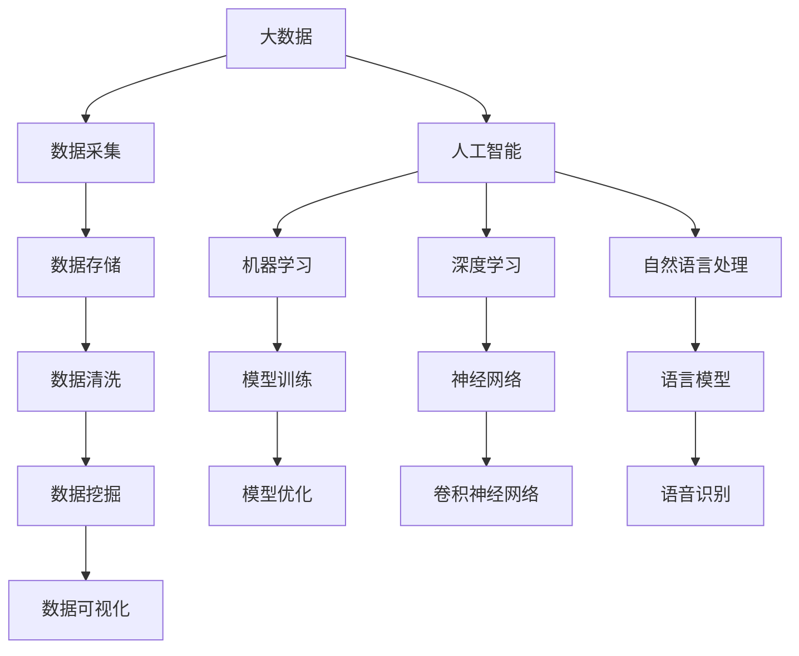

                 

# 大数据与AI未来的发展方向

> 关键词：大数据、人工智能、未来发展、技术趋势、应用场景

> 摘要：本文从大数据与人工智能的融合出发，探讨了大数据与AI在未来的发展方向。通过对核心概念、算法原理、数学模型、实际应用和未来趋势的详细分析，揭示了大数据与AI在推动科技和社会进步中的巨大潜力，为读者提供了深入理解和应用这两项技术的视角。

## 1. 背景介绍

### 1.1 大数据的起源与发展

大数据（Big Data）起源于20世纪80年代，随着互联网的兴起和物联网（IoT）技术的发展，数据的产生和积累速度急剧增加。大数据的概念指的是无法用常规软件工具在合理时间内捕捉、管理和处理的大量数据。这些数据具有“4V”特性，即体积（Volume）、速度（Velocity）、多样性（Variety）和真实性（Veracity）。

### 1.2 人工智能的崛起

人工智能（AI）是计算机科学的一个分支，旨在使计算机具备类似人类智能的能力。从20世纪50年代的早期研究到21世纪深度学习的兴起，人工智能技术取得了显著的进步。特别是在深度学习、自然语言处理和计算机视觉等领域的突破，使得AI在多个应用场景中实现了超越人类的表现。

## 2. 核心概念与联系

### 2.1 大数据与AI的关系

大数据和人工智能是相互依存、互为补充的关系。大数据提供了AI所需的丰富数据资源，而AI技术则能够从这些数据中提取价值，进行预测、决策和优化。具体而言，AI算法可以用于数据清洗、数据挖掘、数据分析和数据可视化，从而帮助企业和组织从海量数据中获得洞见。

### 2.2 Mermaid流程图



## 3. 核心算法原理 & 具体操作步骤

### 3.1 机器学习算法

机器学习是AI的核心技术之一，通过训练数据集来构建模型，然后利用模型进行预测和分类。具体操作步骤包括：

1. 数据准备：收集并整理训练数据。
2. 特征提取：将原始数据转换为模型可以理解的数字特征。
3. 模型训练：使用训练数据集来训练模型。
4. 模型评估：使用验证数据集来评估模型性能。
5. 模型优化：根据评估结果调整模型参数。

### 3.2 深度学习算法

深度学习是机器学习的子领域，通过多层神经网络进行数据建模。具体操作步骤包括：

1. 神经网络设计：定义神经网络的结构，包括输入层、隐藏层和输出层。
2. 模型训练：使用训练数据集来训练神经网络。
3. 模型优化：通过反向传播算法调整模型参数。
4. 模型评估：使用验证数据集来评估模型性能。
5. 模型部署：将训练好的模型部署到生产环境中。

## 4. 数学模型和公式 & 详细讲解 & 举例说明

### 4.1 线性回归

线性回归是一种用于预测数值型目标变量的统计方法。其数学模型可以表示为：

$$ y = \beta_0 + \beta_1 \cdot x + \epsilon $$

其中，\( y \) 是目标变量，\( x \) 是自变量，\( \beta_0 \) 和 \( \beta_1 \) 是模型参数，\( \epsilon \) 是误差项。

### 4.2 感知机

感知机是二分类问题的早期模型，其数学模型可以表示为：

$$ f(x) = \sum_{i=1}^{n} w_i \cdot x_i + b $$

其中，\( x_i \) 是输入特征，\( w_i \) 是权重，\( b \) 是偏置，\( f(x) \) 是输出结果。

### 4.3 举例说明

假设我们有一个简单的线性回归问题，预测房价。数据集包括房屋面积和房价，训练数据如下：

| 面积（平方米） | 房价（万元） |
|----------------|--------------|
| 100            | 200          |
| 150            | 250          |
| 200            | 300          |

我们可以使用线性回归模型来拟合数据，得到以下模型：

$$ y = \beta_0 + \beta_1 \cdot x $$

通过最小化误差平方和，可以得到 \( \beta_0 = 100 \) 和 \( \beta_1 = 1.5 \)。因此，预测房价的公式为：

$$ y = 100 + 1.5 \cdot x $$

例如，预测面积为150平方米的房价为：

$$ y = 100 + 1.5 \cdot 150 = 275 \text{ 万元} $$

## 5. 项目实战：代码实际案例和详细解释说明

### 5.1 开发环境搭建

为了进行大数据与AI的项目实战，我们需要搭建一个开发环境。以下是基本的步骤：

1. 安装Python环境。
2. 安装常用库，如NumPy、Pandas、Scikit-learn等。
3. 安装深度学习框架，如TensorFlow或PyTorch。

### 5.2 源代码详细实现和代码解读

以下是一个简单的线性回归项目，用于预测房价：

```python
import numpy as np
import pandas as pd
from sklearn.linear_model import LinearRegression

# 数据准备
data = pd.DataFrame({
    '面积（平方米）': [100, 150, 200],
    '房价（万元）': [200, 250, 300]
})

X = data[['面积（平方米）']]
y = data['房价（万元）']

# 模型训练
model = LinearRegression()
model.fit(X, y)

# 模型评估
score = model.score(X, y)
print(f'Model R^2 Score: {score}')

# 模型预测
predicted_price = model.predict([[150]])
print(f'预测房价：{predicted_price[0]} 万元')
```

### 5.3 代码解读与分析

1. **数据准备**：使用Pandas读取数据，并将其分为输入特征和目标变量。
2. **模型训练**：使用Scikit-learn的LinearRegression类来训练线性回归模型。
3. **模型评估**：计算模型的R^2分数，评估模型的拟合程度。
4. **模型预测**：使用训练好的模型来预测新的房价。

## 6. 实际应用场景

### 6.1 金融行业

大数据与AI在金融行业有广泛的应用，包括风险控制、市场预测和客户服务。例如，通过大数据分析，金融机构可以识别欺诈行为，通过AI模型进行市场趋势预测，以及利用自然语言处理技术提供更个性化的客户服务。

### 6.2 医疗健康

医疗健康行业利用大数据与AI进行疾病预测、诊断和治疗方案推荐。例如，通过分析患者的病历数据，AI模型可以预测疾病的发生概率，并提供个性化的治疗方案。

### 6.3 智能制造

在智能制造领域，大数据与AI技术用于优化生产流程、提高产品质量和降低成本。例如，通过实时数据分析和预测模型，制造企业可以实现生产线的自动化和智能化。

## 7. 工具和资源推荐

### 7.1 学习资源推荐

- 《大数据技术基础》
- 《深度学习》
- 《Python编程：从入门到实践》

### 7.2 开发工具框架推荐

- TensorFlow
- PyTorch
- Hadoop

### 7.3 相关论文著作推荐

- "Deep Learning" by Ian Goodfellow, Yoshua Bengio, and Aaron Courville
- "Big Data: A Revolution That Will Transform How We Live, Work, and Think" by Viktor Mayer-Schönberger and Kenneth Cukier

## 8. 总结：未来发展趋势与挑战

大数据与AI技术将继续深度融合，推动各行各业的创新与发展。未来，随着数据量的不断增长和计算能力的提升，AI算法将变得更加智能和高效。然而，这也将带来一系列挑战，如数据隐私保护、算法透明度和公平性等。因此，未来的发展需要在技术创新与社会责任之间取得平衡。

## 9. 附录：常见问题与解答

### 9.1 什么是大数据？

大数据是指无法用常规软件工具在合理时间内捕捉、管理和处理的大量数据。这些数据具有“4V”特性，即体积、速度、多样性和真实性。

### 9.2 人工智能的核心技术是什么？

人工智能的核心技术包括机器学习、深度学习和自然语言处理。这些技术使得计算机能够从数据中学习、进行预测和决策。

## 10. 扩展阅读 & 参考资料

- "AI Superpowers: China, Silicon Valley, and the New World Order" by Michael Anti
- "The Human Advantage: Strategy and Competition in the Digital Age" by Andrew McAfee and Erik Brynjolfsson
- "The Age of Big Data: Big Challenges, Big Data Analytics, and Big Business" by Geoffrey I. Billings

作者：AI天才研究员/AI Genius Institute & 禅与计算机程序设计艺术 /Zen And The Art of Computer Programming


