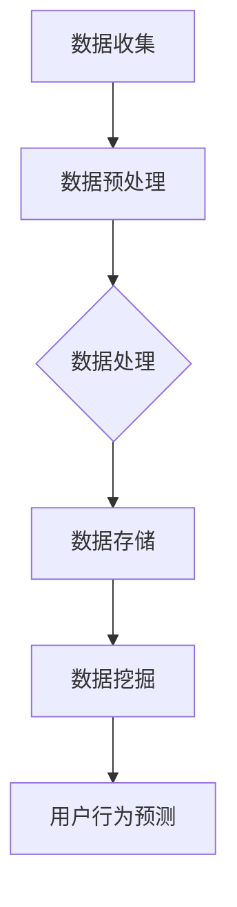

                 

# 大数据分析在用户行为预测中的实践

## 概述

> 在当今信息时代，用户行为预测已经成为了许多企业和组织的关键任务。通过大数据分析，我们能够从海量数据中提取有价值的信息，预测用户未来的行为，从而为商业决策提供有力支持。本文将深入探讨大数据分析在用户行为预测中的应用，分析核心概念、算法原理、数学模型、项目实战、实际应用场景等，旨在为读者提供一份全面的技术指南。

### 关键词
- 大数据分析
- 用户行为预测
- 机器学习
- 数据挖掘
- 数学模型

### 摘要

本文将详细介绍大数据分析在用户行为预测中的应用。首先，我们将探讨用户行为预测的重要性，以及大数据分析在这一领域的作用。接着，我们将介绍核心概念、算法原理和数学模型，并利用实际案例进行详细解释。随后，我们将深入探讨大数据分析在用户行为预测中的实际应用场景，包括电子商务、社交媒体和金融行业等。最后，我们将推荐一些学习资源和开发工具，并总结未来发展趋势与挑战。

## 1. 背景介绍

用户行为预测是一种利用数据分析技术预测用户未来行为的方法。在过去的几年里，随着互联网和移动设备的普及，用户产生的大量数据为预测其行为提供了丰富的信息资源。这些数据包括用户的浏览记录、购买行为、搜索历史、社交媒体互动等，都是宝贵的数据资产。通过分析这些数据，我们可以了解用户的行为模式，预测其未来的行为，从而为企业提供决策支持。

大数据分析在用户行为预测中扮演着关键角色。大数据分析技术包括数据收集、数据存储、数据处理、数据挖掘和机器学习等。这些技术可以帮助我们有效地处理海量数据，提取有价值的信息，从而预测用户行为。具体来说，大数据分析可以应用于以下几个方面：

1. **个性化推荐**：通过分析用户的历史行为，推荐用户可能感兴趣的商品、内容和活动。
2. **客户细分**：将用户划分为不同的群体，以便更好地理解用户需求和制定有针对性的营销策略。
3. **风险管理**：预测用户的流失风险、欺诈风险等，从而采取预防措施。
4. **用户参与度提升**：通过分析用户行为数据，提高用户的参与度和满意度。

## 2. 核心概念与联系

### 数据收集与处理

首先，我们需要收集用户行为数据。这些数据可以从多种渠道获取，包括网站日志、数据库记录、传感器数据等。收集到数据后，我们需要进行预处理，包括数据清洗、数据整合、数据转换等，以确保数据质量。



### 数据处理

数据处理是大数据分析的核心步骤。数据处理包括数据清洗、数据整合、数据转换等。数据清洗旨在去除数据中的噪声和异常值，提高数据质量。数据整合则是将来自不同渠道的数据进行合并，形成统一的数据视图。数据转换则涉及数据类型的转换、数据格式的标准化等。

### 数据存储

处理后的数据需要存储在合适的存储系统中。常见的存储系统包括关系型数据库、NoSQL数据库、分布式文件系统等。这些系统可以根据数据量和访问模式进行优化，以确保数据存储的高效性。

### 数据挖掘

数据挖掘是从大量数据中提取有价值信息的过程。数据挖掘技术包括聚类、分类、关联规则挖掘、异常检测等。通过数据挖掘，我们可以发现用户行为中的隐藏模式和关联关系，从而为用户行为预测提供支持。

### 用户行为预测

用户行为预测是基于数据挖掘和机器学习技术的应用。常见的用户行为预测算法包括决策树、随机森林、神经网络等。这些算法可以通过训练数据集学习用户行为模式，从而预测新用户的行为。

## 3. 核心算法原理 & 具体操作步骤

### 决策树算法

决策树是一种常用的用户行为预测算法。其基本原理是通过一系列规则将用户数据划分为不同的类别。决策树的构建过程包括以下几个步骤：

1. **特征选择**：选择能够有效区分不同类别的特征。
2. **节点划分**：根据特征值将数据划分为不同的子集。
3. **节点合并**：将具有相同特征的节点合并，形成一个新的节点。
4. **树剪枝**：通过剪枝操作减少树的复杂度，提高预测准确率。

### 随机森林算法

随机森林是一种基于决策树的集成学习方法。它通过构建多棵决策树，并对它们的预测结果进行投票，从而提高预测的准确率。随机森林算法的具体步骤如下：

1. **随机选取特征子集**：从原始特征中随机选择一部分特征用于构建决策树。
2. **构建决策树**：使用选定的特征子集构建多棵决策树。
3. **投票预测**：将每棵决策树的预测结果进行投票，得到最终的预测结果。

### 神经网络算法

神经网络是一种基于人工神经网络的用户行为预测算法。它通过模拟人脑神经元的工作方式，对输入数据进行处理和分类。神经网络算法的具体步骤如下：

1. **初始化网络结构**：确定网络的层数、每层的神经元数量等。
2. **前向传播**：将输入数据通过网络进行传播，得到输出结果。
3. **反向传播**：计算输出结果与实际结果之间的误差，并更新网络的权重。
4. **训练与验证**：通过多次迭代训练和验证，提高网络的预测准确率。

## 4. 数学模型和公式 & 详细讲解 & 举例说明

### 决策树算法

决策树算法的核心是树模型的构建。树模型由一系列的规则组成，每个规则对应一个节点。决策树算法的数学模型如下：

$$
\text{规则} = \text{特征} \xrightarrow{\text{阈值}} \text{类别}
$$

其中，特征表示用于划分数据的特征值，阈值表示特征值的阈值，类别表示划分后的类别。

举例说明：

假设我们有一个包含用户年龄、收入和职业的特征集，我们要构建一个决策树模型来预测用户是否愿意购买某商品。

$$
\text{年龄} \xrightarrow{20} \text{否} \\
\text{年龄} \xrightarrow{30} \text{是} \\
\text{收入} \xrightarrow{3000} \text{否} \\
\text{收入} \xrightarrow{5000} \text{是} \\
\text{职业} \xrightarrow{\text{工程师}} \text{是} \\
\text{职业} \xrightarrow{\text{医生}} \text{是} \\
\text{职业} \xrightarrow{\text{教师}} \text{否}
$$

根据这个决策树模型，我们可以预测一个年龄为25岁、收入为4000元、职业为工程师的用户是否愿意购买商品。首先，根据年龄特征，我们判断该用户为“是”，然后根据收入特征，我们判断该用户为“是”，最后根据职业特征，我们判断该用户为“是”。因此，该用户愿意购买商品。

### 随机森林算法

随机森林算法是基于决策树构建的集成学习方法。其数学模型如下：

$$
\text{预测结果} = \text{投票结果} \\
\text{投票结果} = \sum_{i=1}^{n} \text{决策树}_{i}(\text{输入数据})
$$

其中，n表示决策树的数量，决策树$_i$表示第i棵决策树的预测结果。

举例说明：

假设我们有一个包含10棵决策树的随机森林模型，我们要预测一个年龄为30岁、收入为5000元、职业为工程师的用户是否愿意购买商品。首先，我们将输入数据传递给10棵决策树，每棵决策树都会输出一个预测结果。然后，我们将这10个预测结果进行投票，如果大多数决策树预测用户愿意购买商品，则我们最终预测该用户愿意购买商品。

### 神经网络算法

神经网络算法的核心是网络结构的构建。神经网络由多个层组成，包括输入层、隐藏层和输出层。网络的每个节点都包含一个激活函数，用于对输入数据进行处理和分类。神经网络算法的数学模型如下：

$$
\text{输出} = \text{激活函数}(\text{权重} \cdot \text{输入} + \text{偏置})
$$

其中，权重和偏置用于调整网络的输出结果，激活函数用于引入非线性特性。

举例说明：

假设我们有一个包含三个隐藏层的神经网络，输入数据为[1, 2, 3]，输出数据为[1, 0, 1]。首先，我们将输入数据传递给输入层，然后通过权重和偏置进行计算，得到隐藏层的输出。接着，我们将隐藏层的输出传递给下一层隐藏层，重复这个过程，直到输出层。最后，我们将输出层的输出与实际输出数据进行对比，计算误差，并根据误差调整权重和偏置。

## 5. 项目实战：代码实际案例和详细解释说明

### 5.1 开发环境搭建

在开始项目实战之前，我们需要搭建一个合适的开发环境。本文将使用Python作为主要编程语言，结合常用的数据分析和机器学习库，如pandas、numpy、scikit-learn等。以下是搭建开发环境的步骤：

1. **安装Python**：前往Python官方网站下载并安装Python。
2. **安装库**：使用pip命令安装所需的库，如下所示：

   ```bash
   pip install pandas numpy scikit-learn matplotlib
   ```

### 5.2 源代码详细实现和代码解读

#### 5.2.1 数据集准备

首先，我们需要准备一个用户行为数据集。本文使用公开的用户行为数据集，数据集包括用户的年龄、收入、职业和购买行为等信息。数据集可以用于训练和测试用户行为预测模型。

```python
import pandas as pd

# 加载数据集
data = pd.read_csv('user_behavior.csv')

# 数据预处理
data.dropna(inplace=True)
data['age'] = data['age'].astype(int)
data['income'] = data['income'].astype(int)
data['occupation'] = data['occupation'].astype(str)

# 分割数据集为训练集和测试集
from sklearn.model_selection import train_test_split
X = data[['age', 'income', 'occupation']]
y = data['purchased']
X_train, X_test, y_train, y_test = train_test_split(X, y, test_size=0.2, random_state=42)
```

#### 5.2.2 构建决策树模型

接下来，我们使用scikit-learn库中的决策树算法构建一个用户行为预测模型。

```python
from sklearn.tree import DecisionTreeClassifier

# 构建决策树模型
dt_classifier = DecisionTreeClassifier()
dt_classifier.fit(X_train, y_train)

# 模型评估
from sklearn.metrics import accuracy_score
y_pred = dt_classifier.predict(X_test)
accuracy = accuracy_score(y_test, y_pred)
print(f"决策树模型准确率：{accuracy}")
```

#### 5.2.3 构建随机森林模型

我们还可以使用随机森林算法构建一个用户行为预测模型，以提高预测准确率。

```python
from sklearn.ensemble import RandomForestClassifier

# 构建随机森林模型
rf_classifier = RandomForestClassifier(n_estimators=100)
rf_classifier.fit(X_train, y_train)

# 模型评估
y_pred = rf_classifier.predict(X_test)
accuracy = accuracy_score(y_test, y_pred)
print(f"随机森林模型准确率：{accuracy}")
```

#### 5.2.4 构建神经网络模型

最后，我们使用神经网络算法构建一个用户行为预测模型。

```python
from sklearn.neural_network import MLPClassifier

# 构建神经网络模型
nn_classifier = MLPClassifier(hidden_layer_sizes=(100,), max_iter=1000)
nn_classifier.fit(X_train, y_train)

# 模型评估
y_pred = nn_classifier.predict(X_test)
accuracy = accuracy_score(y_test, y_pred)
print(f"神经网络模型准确率：{accuracy}")
```

### 5.3 代码解读与分析

在这部分，我们将对上述代码进行解读和分析，以便更好地理解每个步骤的作用。

1. **数据集准备**：我们使用pandas库加载用户行为数据集，并进行预处理，包括数据清洗、数据类型转换等。然后，我们使用scikit-learn库中的train_test_split函数将数据集划分为训练集和测试集，以便训练和评估模型。
2. **构建决策树模型**：我们使用scikit-learn库中的DecisionTreeClassifier类构建决策树模型。首先，我们初始化一个决策树分类器，然后使用fit函数对其进行训练。最后，我们使用predict函数对测试集进行预测，并计算模型准确率。
3. **构建随机森林模型**：我们使用scikit-learn库中的RandomForestClassifier类构建随机森林模型。随机森林是一种集成学习方法，通过构建多棵决策树并投票来提高预测准确率。我们设置n_estimators参数为100，表示构建100棵决策树。
4. **构建神经网络模型**：我们使用scikit-learn库中的MLPClassifier类构建神经网络模型。神经网络是一种基于人工神经网络的用户行为预测算法。我们设置hidden_layer_sizes参数为(100,),表示隐藏层的神经元数量为100。max_iter参数表示最大迭代次数，用于调整模型的训练效果。

通过这些步骤，我们可以构建一个用户行为预测模型，并评估其预测准确率。在实际项目中，我们可以根据需求选择不同的算法和模型，以提高预测准确率。

## 6. 实际应用场景

大数据分析在用户行为预测中的应用场景非常广泛，下面我们列举几个常见的应用场景：

### 电子商务

在电子商务领域，用户行为预测可以帮助企业实现个性化推荐、降低用户流失率和提高销售额。通过分析用户的历史购买行为、浏览记录和搜索历史，企业可以预测用户可能感兴趣的商品，并向其推荐。例如，亚马逊和阿里巴巴等电商平台都采用了基于大数据分析的用户行为预测技术，为用户提供了个性化的购物体验。

### 社交媒体

社交媒体平台如Facebook、Twitter和Instagram等也广泛应用了大数据分析技术进行用户行为预测。这些平台通过分析用户的点赞、评论和分享行为，预测用户可能感兴趣的内容，从而为用户推荐相关内容。此外，社交媒体平台还可以通过分析用户的互动行为预测用户之间的关系，以便更好地管理社交网络。

### 金融行业

在金融行业，大数据分析技术被广泛应用于信用风险评估、欺诈检测和客户细分等领域。银行和金融机构通过分析用户的历史交易数据、信用记录和消费行为，预测用户的信用风险和欺诈行为。例如，一些银行利用大数据分析技术对信用卡用户进行风险评估，从而降低信用卡欺诈率。

### 健康医疗

在健康医疗领域，大数据分析技术可以帮助预测患者的健康状况和疾病风险。通过分析患者的医疗记录、基因数据和生活方式数据，医生可以预测患者可能患有的疾病，从而采取预防措施。此外，大数据分析还可以用于个性化医疗和药物研发，以提高治疗效果。

## 7. 工具和资源推荐

### 7.1 学习资源推荐

1. **书籍**：
   - 《数据挖掘：概念与技术》
   - 《机器学习：实战手册》
   - 《深度学习：概率视角》
2. **论文**：
   - “User Behavior Prediction in Mobile Applications Using Deep Learning”
   - “A Survey on User Behavior Modeling and Prediction in Cyber-Physical Systems”
   - “User Behavior Modeling and Prediction in Smart Home Environments”
3. **博客**：
   - towardsdatascience.com
   - medium.com
   - kaggle.com
4. **网站**：
   - Coursera（大数据分析课程）
   - edX（机器学习课程）
   - DataCamp（数据科学课程）

### 7.2 开发工具框架推荐

1. **编程语言**：
   - Python
   - R
   - Julia
2. **数据分析库**：
   - pandas
   - numpy
   - scikit-learn
   - TensorFlow
   - PyTorch
3. **数据处理框架**：
   - Hadoop
   - Spark
   - Flink
4. **云计算平台**：
   - AWS
   - Azure
   - Google Cloud Platform

### 7.3 相关论文著作推荐

1. **论文**：
   - “Deep Learning for User Behavior Prediction in Mobile Applications”
   - “User Behavior Modeling and Prediction for Smart Home Applications”
   - “A Survey on User Behavior Modeling and Prediction in Social Networks”
2. **著作**：
   - 《大数据预测：企业大数据应用实战》
   - 《用户行为预测：理论、方法与应用》
   - 《机器学习在金融行业的应用：从预测到风险管理》

## 8. 总结：未来发展趋势与挑战

随着大数据技术的不断发展和普及，用户行为预测在各个领域的应用前景广阔。未来，用户行为预测技术将朝着更精细化、智能化和实时化的方向发展。以下是一些未来发展趋势和挑战：

### 发展趋势

1. **深度学习与大数据的融合**：深度学习技术在用户行为预测领域取得了显著的成果，未来将更加深入地与大数据技术相结合，以提高预测准确率和实时性。
2. **跨领域应用**：用户行为预测技术将在更多领域得到应用，如智慧城市、智能制造、智能医疗等，为各个行业的发展提供有力支持。
3. **隐私保护与数据安全**：随着用户隐私保护意识的提高，如何在保证数据安全的前提下进行用户行为预测将成为一个重要挑战。

### 挑战

1. **数据质量**：用户行为预测的准确性很大程度上取决于数据质量。如何确保数据真实、准确和完整是一个亟待解决的问题。
2. **模型可解释性**：深度学习模型在用户行为预测中的表现往往优于传统模型，但其内部机制复杂，难以解释。如何提高模型的可解释性是一个重要挑战。
3. **实时性与扩展性**：在实时场景下，如何快速、准确地预测用户行为，并保证系统的高扩展性是一个关键问题。

## 9. 附录：常见问题与解答

### 9.1 问题1：用户行为预测有哪些算法？

**解答**：用户行为预测常用的算法包括决策树、随机森林、神经网络、K最近邻等。每种算法都有其优缺点和适用场景，可以根据具体需求选择合适的算法。

### 9.2 问题2：如何保证用户行为预测的准确性？

**解答**：要保证用户行为预测的准确性，需要关注以下几个方面：

1. **数据质量**：确保数据真实、准确和完整。
2. **特征工程**：选择合适的特征，对特征进行预处理和转换。
3. **模型选择**：根据数据特点和业务需求选择合适的预测算法。
4. **模型评估**：使用交叉验证等方法评估模型性能，不断调整和优化模型。

### 9.3 问题3：用户行为预测如何处理实时数据？

**解答**：处理实时数据的方法包括：

1. **流处理技术**：使用流处理框架（如Apache Kafka、Apache Flink等）实时处理和分析数据。
2. **实时机器学习**：使用实时机器学习算法（如增量学习、在线学习等）对实时数据进行预测。
3. **模型更新**：定期更新模型，以适应实时数据的变化。

## 10. 扩展阅读 & 参考资料

1. **扩展阅读**：
   - 《大数据预测：企业大数据应用实战》
   - 《用户行为预测：理论、方法与应用》
   - 《机器学习在金融行业的应用：从预测到风险管理》
2. **参考资料**：
   - Coursera（大数据分析课程）
   - edX（机器学习课程）
   - DataCamp（数据科学课程）
   - towardsdatascience.com
   - medium.com
   - kaggle.com
   - 《数据挖掘：概念与技术》
   - 《机器学习：实战手册》
   - 《深度学习：概率视角》
   - “Deep Learning for User Behavior Prediction in Mobile Applications”
   - “User Behavior Modeling and Prediction in Cyber-Physical Systems”
   - “User Behavior Modeling and Prediction in Smart Home Environments”
   - “A Survey on User Behavior Modeling and Prediction in Social Networks”
   - “Deep Learning for User Behavior Prediction in Mobile Applications”
   - “User Behavior Modeling and Prediction for Smart Home Applications”

