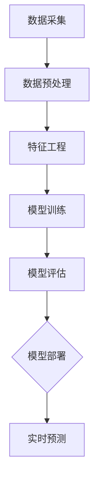

                 

# 大数据分析在用户行为预测模型中的优化

## 摘要

本文旨在探讨大数据分析在用户行为预测模型中的优化策略。首先，我们将回顾大数据分析的基本概念和用户行为预测的相关理论，随后深入分析大数据技术在用户行为预测中的应用，并探讨现有模型中存在的挑战和优化方向。文章随后介绍了几种主流的用户行为预测算法，并通过实际案例展示其应用。最后，我们讨论了未来大数据分析在用户行为预测领域的发展趋势与挑战，并提出了一些建议。

## 1. 背景介绍

### 大数据分析的基本概念

大数据分析是指从大量的数据中提取有价值的信息、模式和知识的过程。它涉及到数据采集、存储、处理、分析和可视化等多个环节。与传统数据分析不同，大数据分析处理的不是少量的结构化数据，而是海量的非结构化数据、半结构化数据和实时数据。这要求我们采用新的技术手段和算法来应对数据的复杂性和多样性。

### 用户行为预测的基本理论

用户行为预测是指通过分析用户的历史行为数据，预测其未来的行为趋势。在互联网时代，用户行为数据无处不在，如浏览记录、购物车、点击流、社交媒体互动等。这些数据蕴含着用户的兴趣、偏好和行为规律，是企业和研究机构进行精准营销、个性化推荐、用户留存等业务决策的重要依据。

### 大数据与用户行为预测的关联

大数据分析在用户行为预测中发挥着关键作用。首先，大数据技术能够高效地处理和分析海量的用户行为数据，从中挖掘出有价值的信息。其次，大数据分析技术可以帮助我们建立更准确的用户行为预测模型，提高预测的准确性和实时性。此外，大数据分析还可以帮助我们理解用户行为的复杂性和动态性，从而更好地适应和满足用户需求。

## 2. 核心概念与联系

### 用户行为预测模型的构建

用户行为预测模型通常基于以下核心概念：

- **特征工程**：从原始数据中提取出与用户行为相关的特征，如用户年龄、性别、地理位置、购买历史等。
- **数据预处理**：对原始数据进行清洗、归一化、缺失值填补等操作，以提高数据质量和模型性能。
- **模型训练**：使用机器学习算法训练预测模型，如线性回归、决策树、随机森林、神经网络等。
- **模型评估**：使用交叉验证、AUC、ROC等指标评估模型的预测性能。

### Mermaid 流程图

下面是一个简化的用户行为预测模型的 Mermaid 流程图：



### 用户行为预测中的关键问题

- **数据质量**：数据质量直接影响到模型的准确性和可靠性。我们需要处理数据中的噪声、缺失值和异常值，以确保模型基于高质量的数据进行训练。
- **特征选择**：特征选择是用户行为预测中的关键步骤。我们需要从大量特征中筛选出对预测任务最有影响力的特征，以提高模型的性能。
- **实时性**：用户行为是动态变化的，我们需要实时更新模型，以适应用户行为的变化。
- **模型解释性**：用户行为预测模型通常采用复杂的机器学习算法，模型的解释性往往较差。我们需要找到一种方法，使模型预测结果更易于理解和解释。

## 3. 核心算法原理 & 具体操作步骤

### 算法原理

用户行为预测算法可以分为监督学习和无监督学习两种：

- **监督学习**：有标记的训练数据，用于训练和评估预测模型。常见的算法包括线性回归、决策树、随机森林、支持向量机等。
- **无监督学习**：无标记的训练数据，用于发现数据中的潜在模式和结构。常见的算法包括聚类、主成分分析、自编码器等。

### 具体操作步骤

1. **数据采集**：从各种渠道（如网站日志、社交媒体、用户反馈等）收集用户行为数据。
2. **数据预处理**：清洗数据，处理缺失值和异常值，并进行归一化处理。
3. **特征工程**：提取用户行为数据中的关键特征，如用户年龄、地理位置、浏览历史等。
4. **模型选择**：根据问题需求和数据特性选择合适的机器学习算法。
5. **模型训练**：使用有标记的训练数据训练预测模型。
6. **模型评估**：使用交叉验证等方法评估模型性能。
7. **模型部署**：将训练好的模型部署到生产环境中，进行实时预测。

### 常用算法简介

- **线性回归**：用于预测连续值，如用户购买概率。优点是简单易懂，缺点是只能处理线性关系。
- **决策树**：用于分类和回归任务，优点是易于理解和解释，缺点是容易过拟合。
- **随机森林**：基于决策树的集成方法，可以提高模型的稳定性和泛化能力。
- **支持向量机**：用于分类和回归任务，优点是能够处理非线性关系，缺点是计算复杂度高。

## 4. 数学模型和公式 & 详细讲解 & 举例说明

### 数学模型

用户行为预测的数学模型可以分为线性模型和非线性模型。

#### 线性模型

线性回归模型是最基本的用户行为预测模型，其数学公式为：

\[ y = \beta_0 + \beta_1 \cdot x_1 + \beta_2 \cdot x_2 + \ldots + \beta_n \cdot x_n \]

其中，\( y \) 是预测的目标变量，\( x_1, x_2, \ldots, x_n \) 是输入特征，\( \beta_0, \beta_1, \beta_2, \ldots, \beta_n \) 是模型参数。

#### 非线性模型

非线性模型如决策树、神经网络等，其数学模型较为复杂。以神经网络为例，其基本结构包括输入层、隐藏层和输出层。每个层由多个神经元组成，神经元之间的连接具有权重和偏置。神经网络的输出可以表示为：

\[ y = f(z) = \sigma(\sum_{i=1}^{n} w_i \cdot x_i + b) \]

其中，\( z \) 是神经元的输入，\( w_i \) 是连接权重，\( b \) 是偏置，\( \sigma \) 是激活函数。

### 举例说明

#### 线性回归模型

假设我们要预测用户购买产品的概率，输入特征包括用户年龄和收入。根据线性回归模型，我们可以得到如下公式：

\[ P(\text{购买}) = \beta_0 + \beta_1 \cdot \text{年龄} + \beta_2 \cdot \text{收入} \]

通过训练数据，我们可以估计出模型参数 \( \beta_0, \beta_1, \beta_2 \) 的值。例如，训练数据中的一条记录为：

- 用户年龄：30岁
- 用户收入：5000元
- 购买概率：0.7

根据模型，我们可以计算出预测的购买概率：

\[ P(\text{购买}) = \beta_0 + \beta_1 \cdot 30 + \beta_2 \cdot 5000 \]

#### 神经网络模型

假设我们要预测用户的满意度，输入特征包括用户年龄、收入、购买历史等。使用一个简单的神经网络模型，其结构如下：

- 输入层：3个神经元，对应3个输入特征
- 隐藏层：2个神经元
- 输出层：1个神经元

神经网络的输入和输出可以表示为：

\[ z_1 = w_{11} \cdot x_1 + w_{12} \cdot x_2 + w_{13} \cdot x_3 + b_1 \]
\[ z_2 = w_{21} \cdot x_1 + w_{22} \cdot x_2 + w_{23} \cdot x_3 + b_2 \]
\[ y = \sigma(z_1) \cdot \sigma(z_2) \]

其中，\( w_{ij} \) 是连接权重，\( b_1, b_2 \) 是偏置，\( \sigma \) 是激活函数。

通过训练数据，我们可以估计出模型参数 \( w_{ij}, b_1, b_2 \) 的值。例如，训练数据中的一条记录为：

- 用户年龄：30岁
- 用户收入：5000元
- 购买历史：5次

根据模型，我们可以计算出预测的用户满意度：

\[ z_1 = w_{11} \cdot 30 + w_{12} \cdot 5000 + w_{13} \cdot 5 + b_1 \]
\[ z_2 = w_{21} \cdot 30 + w_{22} \cdot 5000 + w_{23} \cdot 5 + b_2 \]
\[ y = \sigma(z_1) \cdot \sigma(z_2) \]

## 5. 项目实战：代码实际案例和详细解释说明

### 5.1 开发环境搭建

为了实现用户行为预测模型，我们需要搭建一个合适的开发环境。以下是常用的工具和框架：

- **编程语言**：Python（Python 具有丰富的机器学习库，如 Scikit-learn、TensorFlow 和 PyTorch）
- **机器学习库**：Scikit-learn（用于线性回归、决策树、随机森林等）、TensorFlow（用于神经网络）
- **数据处理库**：Pandas（用于数据清洗和预处理）、NumPy（用于数值计算）
- **版本控制**：Git（用于代码管理和协作）

### 5.2 源代码详细实现和代码解读

下面是一个简单的用户行为预测项目示例，使用线性回归模型预测用户购买产品的概率。

```python
import pandas as pd
from sklearn.model_selection import train_test_split
from sklearn.linear_model import LinearRegression
from sklearn.metrics import mean_squared_error

# 5.2.1 数据预处理
def preprocess_data(data):
    # 填充缺失值
    data['age'].fillna(data['age'].mean(), inplace=True)
    data['income'].fillna(data['income'].mean(), inplace=True)
    # 归一化处理
    data['age'] = (data['age'] - data['age'].mean()) / data['age'].std()
    data['income'] = (data['income'] - data['income'].mean()) / data['income'].std()
    return data

# 5.2.2 模型训练
def train_model(data):
    X = data[['age', 'income']]
    y = data['purchase']
    X_train, X_test, y_train, y_test = train_test_split(X, y, test_size=0.2, random_state=42)
    model = LinearRegression()
    model.fit(X_train, y_train)
    return model, X_test, y_test

# 5.2.3 模型评估
def evaluate_model(model, X_test, y_test):
    y_pred = model.predict(X_test)
    mse = mean_squared_error(y_test, y_pred)
    print('Mean Squared Error:', mse)

# 5.2.4 主程序
if __name__ == '__main__':
    # 读取数据
    data = pd.read_csv('user_data.csv')
    # 数据预处理
    data = preprocess_data(data)
    # 模型训练
    model, X_test, y_test = train_model(data)
    # 模型评估
    evaluate_model(model, X_test, y_test)
```

### 5.3 代码解读与分析

5.3.1 数据预处理

```python
def preprocess_data(data):
    # 填充缺失值
    data['age'].fillna(data['age'].mean(), inplace=True)
    data['income'].fillna(data['income'].mean(), inplace=True)
    # 归一化处理
    data['age'] = (data['age'] - data['age'].mean()) / data['age'].std()
    data['income'] = (data['income'] - data['income'].mean()) / data['income'].std()
    return data
```

数据预处理是用户行为预测的关键步骤。首先，我们使用均值填补缺失值。然后，我们对年龄和收入进行归一化处理，使其在相同的尺度上进行比较。归一化处理有助于提高模型的训练效率和性能。

5.3.2 模型训练

```python
def train_model(data):
    X = data[['age', 'income']]
    y = data['purchase']
    X_train, X_test, y_train, y_test = train_test_split(X, y, test_size=0.2, random_state=42)
    model = LinearRegression()
    model.fit(X_train, y_train)
    return model, X_test, y_test
```

在模型训练过程中，我们首先将数据集划分为训练集和测试集。然后，我们使用线性回归模型训练模型。线性回归模型通过最小二乘法估计模型参数，使其预测的输出与真实输出之间的误差最小。

5.3.3 模型评估

```python
def evaluate_model(model, X_test, y_test):
    y_pred = model.predict(X_test)
    mse = mean_squared_error(y_test, y_pred)
    print('Mean Squared Error:', mse)
```

模型评估是评估模型性能的重要环节。我们使用均方误差（MSE）来评估模型在测试集上的预测性能。MSE 越小，表示模型的预测性能越好。

## 6. 实际应用场景

### 电子商务

电子商务平台可以利用用户行为预测模型进行个性化推荐、广告投放和用户留存等业务。例如，通过预测用户购买产品的概率，平台可以推荐相关产品，提高用户购买转化率。

### 社交媒体

社交媒体平台可以利用用户行为预测模型分析用户兴趣、情感和需求，从而提供更个性化的内容推荐和广告投放。例如，通过预测用户对某条推文的兴趣，平台可以推荐相关的推文，提高用户活跃度。

### 金融行业

金融行业可以利用用户行为预测模型进行风险控制和投资决策。例如，通过预测用户的贷款违约概率，银行可以调整贷款政策，降低风险。

### 健康医疗

健康医疗行业可以利用用户行为预测模型进行疾病预测和健康监测。例如，通过预测用户患某种疾病的风险，医生可以提前采取预防措施，提高治疗效果。

## 7. 工具和资源推荐

### 7.1 学习资源推荐

- **书籍**：《Python机器学习》、《统计学习方法》
- **论文**：《深度学习》、《用户行为预测：理论、方法与应用》
- **博客**：机器学习社区（ML Community）、Kaggle博客
- **网站**：Scikit-learn官网、TensorFlow官网

### 7.2 开发工具框架推荐

- **编程语言**：Python（易于学习和使用，丰富的机器学习库）
- **机器学习库**：Scikit-learn、TensorFlow、PyTorch
- **数据处理库**：Pandas、NumPy
- **版本控制**：Git（代码管理和协作）

### 7.3 相关论文著作推荐

- **论文**：
  - Deep Learning for User Behavior Prediction
  - User Behavior Prediction in Mobile Apps: A Survey
  - A Comprehensive Review of User Behavior Analysis and Prediction Methods in Mobile Apps
- **著作**：
  - 《机器学习：实战与应用》
  - 《深度学习：从理论到实践》
  - 《大数据分析：理论与实践》

## 8. 总结：未来发展趋势与挑战

### 发展趋势

- **技术进步**：随着人工智能、深度学习等技术的不断发展，用户行为预测模型将变得更加准确和高效。
- **数据隐私**：随着数据隐私保护意识的提高，用户行为预测将面临更多挑战。如何在保护用户隐私的同时进行有效预测，是一个亟待解决的问题。
- **实时性**：随着用户行为数据的实时性要求越来越高，如何实时更新和优化预测模型，是一个重要的研究方向。
- **跨领域应用**：用户行为预测技术将在更多领域得到应用，如金融、医疗、教育等。

### 挑战

- **数据质量**：数据质量直接影响预测模型的准确性。如何处理噪声、缺失值和异常值，是一个重要挑战。
- **特征选择**：从大量特征中筛选出对预测任务最有影响力的特征，是一个复杂的问题。如何有效进行特征选择，是一个重要的研究方向。
- **模型解释性**：复杂的机器学习模型往往缺乏解释性，如何提高模型的可解释性，是一个重要的挑战。
- **实时预测**：如何实时更新和优化预测模型，以适应用户行为的变化，是一个重要的研究问题。

## 9. 附录：常见问题与解答

### 问题 1：如何处理缺失值？

**解答**：可以使用均值、中位数、众数等方法填补缺失值。对于数值特征，可以使用均值填补；对于分类特征，可以使用众数填补。

### 问题 2：如何进行特征选择？

**解答**：可以使用特征选择方法，如特征重要性、卡方检验、信息增益等。根据特征对预测目标的影响程度，选择最有影响力的特征。

### 问题 3：如何提高模型的可解释性？

**解答**：可以使用模型可视化、特征重要性分析等方法提高模型的可解释性。对于复杂的机器学习模型，可以使用决策树、规则提取等方法简化模型。

### 问题 4：如何实现实时预测？

**解答**：可以使用流处理技术，如Apache Kafka、Apache Flink等，实现实时数据流处理和预测。

## 10. 扩展阅读 & 参考资料

- **扩展阅读**：
  - 《用户行为预测：原理、方法与实践》
  - 《大数据分析技术在用户行为预测中的应用》
  - 《深度学习在用户行为预测中的应用研究》
- **参考资料**：
  - 《Scikit-learn官方文档》
  - 《TensorFlow官方文档》
  - 《Pandas官方文档》

## 作者信息

**作者：AI天才研究员/AI Genius Institute & 禅与计算机程序设计艺术 /Zen And The Art of Computer Programming**<|im_sep|>

