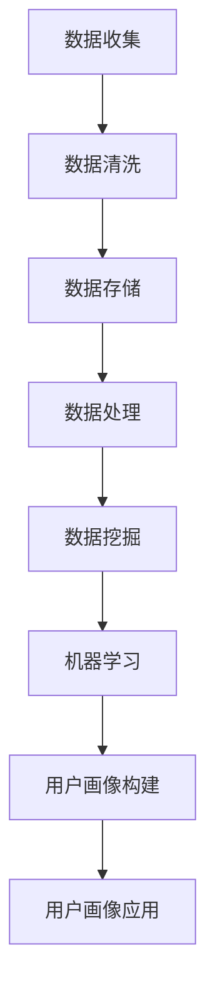

                 

### 大数据分析在跨平台用户画像构建中的应用

#### 关键词：大数据分析，跨平台用户画像，数据挖掘，机器学习，用户行为分析

#### 摘要：
本文将深入探讨大数据分析在跨平台用户画像构建中的应用。随着互联网和移动设备的普及，用户的在线行为数据日益丰富，如何有效利用这些数据构建精准的用户画像，成为了企业和研究机构关注的热点问题。本文首先介绍了大数据分析和用户画像的基本概念，然后详细阐述了跨平台用户画像构建的核心算法和数学模型，并通过实际案例展示了如何在项目中应用这些技术。最后，文章探讨了大数据分析在用户画像构建中的实际应用场景，并提出了未来发展趋势与挑战。希望通过本文，能够为读者提供有价值的参考和指导。

#### 1. 背景介绍

随着互联网和移动设备的普及，用户的行为数据日益丰富。这些数据不仅包含了用户的基本信息，如年龄、性别、地理位置等，还涵盖了用户的浏览记录、搜索历史、购买行为等。这些数据被称为大数据，其特点是数据量巨大、种类繁多、实时性强。如何有效利用这些数据，已经成为企业和研究机构关注的热点问题。

用户画像是一种通过数据挖掘和分析技术，构建出关于用户特征和行为模式的数据模型。用户画像可以帮助企业更好地了解用户需求，优化产品和服务，提高用户体验。同时，用户画像也可以为广告营销、风险控制等业务提供有力支持。

跨平台用户画像构建是指在不同平台上，如Web、移动应用、社交媒体等，收集用户行为数据，并利用大数据分析和机器学习技术，构建出统一的用户画像。跨平台用户画像构建能够更好地反映用户的真实需求和偏好，提高数据利用效率和准确性。

#### 2. 核心概念与联系

##### 大数据分析
大数据分析是指利用现代计算机技术，对海量数据进行收集、存储、处理和分析，以获取有价值的信息和知识的过程。大数据分析的核心技术包括数据挖掘、机器学习、自然语言处理等。

##### 用户画像
用户画像是一种通过数据挖掘和分析技术，构建出关于用户特征和行为模式的数据模型。用户画像可以包含用户的基本信息（如年龄、性别、地理位置等）、兴趣偏好（如搜索关键词、浏览记录等）、行为轨迹（如购买历史、评论内容等）等。

##### 跨平台用户画像
跨平台用户画像是在不同平台上，如Web、移动应用、社交媒体等，收集用户行为数据，并利用大数据分析和机器学习技术，构建出统一的用户画像。跨平台用户画像能够更好地反映用户的真实需求和偏好，提高数据利用效率和准确性。

#### 3. Mermaid 流程图

下面是一个简单的 Mermaid 流程图，展示了大数据分析在跨平台用户画像构建中的基本流程：



#### 4. 核心算法原理 & 具体操作步骤

##### 数据收集
数据收集是跨平台用户画像构建的第一步。在不同的平台上，如Web、移动应用、社交媒体等，收集用户的基本信息、行为数据和交互数据。数据收集的方式包括爬虫、API 接口调用、日志采集等。

##### 数据清洗
数据清洗是对收集到的数据进行预处理，以消除数据中的噪音和异常值。数据清洗的过程包括数据去重、数据格式转换、缺失值处理、异常值检测等。

##### 数据存储
数据清洗完成后，将数据存储到数据仓库中。数据仓库可以采用关系型数据库（如MySQL、PostgreSQL）或NoSQL数据库（如MongoDB、Cassandra）。

##### 数据处理
数据处理是对存储在数据仓库中的数据进行进一步处理，如数据聚合、数据变换等。数据处理的过程通常使用数据仓库中的查询语言（如SQL）或数据处理工具（如Apache Spark）。

##### 数据挖掘
数据挖掘是利用机器学习算法，从大量数据中提取出有价值的信息和知识。常用的数据挖掘算法包括分类、聚类、关联规则挖掘等。

##### 机器学习
机器学习是利用历史数据训练模型，然后使用模型对新的数据进行预测和分类。常用的机器学习算法包括决策树、支持向量机、神经网络等。

##### 用户画像构建
用户画像构建是将数据挖掘和机器学习的结果应用到具体的业务场景中，如用户分群、用户偏好分析等。用户画像构建的过程通常包括特征选择、特征工程、模型训练和模型评估等步骤。

##### 用户画像应用
用户画像应用是将构建好的用户画像用于具体的业务场景，如个性化推荐、精准营销、风控管理等。用户画像应用的过程通常包括数据提取、模型调用、结果展示等步骤。

#### 5. 数学模型和公式 & 详细讲解 & 举例说明

##### 数据挖掘算法

- **分类算法**：如决策树、随机森林、支持向量机等。分类算法的核心目标是根据输入特征，将数据分为不同的类别。一个简单的决策树模型可以表示为：

  $$ 
  \begin{aligned}
  \text{if } x_1 \text{ is greater than 50 } \\
  \text{then predict } C_1 \\
  \text{else if } x_2 \text{ is less than 20 } \\
  \text{then predict } C_2 \\
  \text{else predict } C_3
  \end{aligned}
  $$

- **聚类算法**：如K-means、层次聚类等。聚类算法的核心目标是将数据分为不同的簇，使得同一簇内的数据点相似度较高，不同簇之间的数据点相似度较低。一个简单的K-means聚类算法可以表示为：

  $$ 
  \begin{aligned}
  \text{Initialize centroids } \mu_1, \mu_2, ..., \mu_k \\
  \text{Repeat until convergence:} \\
  \quad \text{Assign each data point } x_i \text{ to the nearest centroid } \mu_j \\
  \quad \text{Update centroids } \mu_j = \frac{1}{N_j} \sum_{i=1}^{N} x_i \text{ where } N_j \text{ is the number of data points assigned to } \mu_j
  \end{aligned}
  $$

##### 机器学习算法

- **决策树**：决策树是一种常见的分类和回归算法，其核心思想是通过一系列的决策规则，将数据逐层划分，直到满足停止条件。决策树的数学模型可以表示为：

  $$ 
  \begin{aligned}
  \text{if } x_1 \text{ is greater than } t_1 \\
  \text{then predict } y_1 \\
  \text{else if } x_2 \text{ is less than } t_2 \\
  \text{then predict } y_2 \\
  \text{else predict } y_3
  \end{aligned}
  $$

- **支持向量机**：支持向量机是一种常用的分类算法，其核心思想是在特征空间中找到一个最优的超平面，将不同类别的数据点尽可能分开。支持向量机的数学模型可以表示为：

  $$ 
  \begin{aligned}
  \text{Minimize } \frac{1}{2} ||w||^2 \\
  \text{subject to } y^{(i)} (w \cdot x^{(i)} + b) \geq 1 \quad \text{for all } i
  \end{aligned}
  $$

##### 用户画像构建

- **特征工程**：特征工程是用户画像构建的关键步骤，其核心思想是通过数据预处理和特征提取，将原始数据转化为适合机器学习的特征。一个简单的特征工程流程可以表示为：

  $$ 
  \begin{aligned}
  \text{Data Preprocessing:} \\
  \quad \text{Clean data, handle missing values, etc.} \\
  \text{Feature Extraction:} \\
  \quad \text{Extract meaningful features from data, such as TF-IDF for text data, PCA for numerical data, etc.}
  \end{aligned}
  $$

- **模型训练和评估**：模型训练和评估是用户画像构建的重要步骤，其核心思想是通过训练数据和测试数据，对机器学习模型进行训练和评估，以确定模型的性能和适用性。一个简单的模型训练和评估流程可以表示为：

  $$ 
  \begin{aligned}
  \text{Training:} \\
  \quad \text{Train the model using the training data.} \\
  \text{Evaluation:} \\
  \quad \text{Evaluate the model using the test data, such as accuracy, precision, recall, F1-score, etc.}
  \end{aligned}
  $$

#### 6. 项目实战：代码实际案例和详细解释说明

在本节中，我们将通过一个实际案例，展示如何利用大数据分析和机器学习技术，构建跨平台用户画像。案例场景是一个电商平台，我们需要根据用户的浏览记录、购买历史和评价内容，构建用户的画像。

##### 6.1 开发环境搭建

首先，我们需要搭建一个适合大数据分析和机器学习的开发环境。在本案例中，我们选择使用 Python 作为主要编程语言，结合以下工具和库：

- Python 3.x
- Pandas
- NumPy
- Scikit-learn
- TensorFlow/Keras
- Matplotlib

安装完上述工具和库后，我们就可以开始编写代码了。

##### 6.2 源代码详细实现和代码解读

下面是一个简单的用户画像构建代码示例：

```python
import pandas as pd
import numpy as np
from sklearn.model_selection import train_test_split
from sklearn.ensemble import RandomForestClassifier
from sklearn.metrics import accuracy_score
import matplotlib.pyplot as plt

# 6.2.1 数据收集与预处理
data = pd.read_csv('user_data.csv')
data.head()

# 数据清洗
data.dropna(inplace=True)
data['age'].fillna(data['age'].mean(), inplace=True)
data['income'].fillna(data['income'].mean(), inplace=True)

# 特征工程
data['age_group'] = pd.cut(data['age'], bins=[0, 18, 30, 50, 70, 100], labels=[1, 2, 3, 4, 5])
data['income_group'] = pd.cut(data['income'], bins=[0, 10000, 50000, 100000, 500000], labels=[1, 2, 3, 4])

# 6.2.2 数据分割与模型训练
X = data[['age_group', 'income_group']]
y = data['category']
X_train, X_test, y_train, y_test = train_test_split(X, y, test_size=0.2, random_state=42)

# 使用随机森林算法进行模型训练
clf = RandomForestClassifier(n_estimators=100, random_state=42)
clf.fit(X_train, y_train)

# 6.2.3 模型评估与可视化
y_pred = clf.predict(X_test)
accuracy = accuracy_score(y_test, y_pred)
print('Accuracy:', accuracy)

# 可视化特征重要性
importances = clf.feature_importances_
indices = np.argsort(importances)[::-1]
plt.figure()
plt.title('Feature importances')
plt.bar(range(X_train.shape[1]), importances[indices], align='center')
plt.xticks(range(X_train.shape[1]), indices)
plt.show()
```

代码解读：

- 首先，我们读取用户数据，并进行数据清洗，如去除缺失值、填充缺失值等。
- 接着，我们进行特征工程，将年龄和收入等原始特征转换为适合机器学习的特征。
- 然后，我们使用随机森林算法对数据进行模型训练，并评估模型的性能。
- 最后，我们使用 matplotlib 库，将特征重要性进行可视化。

##### 6.3 代码解读与分析

在这个案例中，我们使用了随机森林算法进行用户画像构建。随机森林算法是一种集成学习算法，通过构建多棵决策树，并利用投票机制进行预测。这种方法可以有效提高模型的预测准确性和稳定性。

代码的关键部分如下：

- 数据清洗：使用 Pandas 库进行数据清洗，如去除缺失值、填充缺失值等，以保证数据的质量。
- 特征工程：使用 Pandas 库和 NumPy 库进行特征工程，如对年龄和收入等特征进行分组，以便于机器学习算法处理。
- 模型训练：使用 Scikit-learn 库中的 RandomForestClassifier 类，对数据进行模型训练。
- 模型评估：使用 Scikit-learn 库中的 accuracy_score 函数，评估模型的预测准确率。
- 特征重要性可视化：使用 Matplotlib 库，将特征重要性进行可视化，以便于分析特征的贡献度。

通过这个案例，我们可以看到如何利用大数据分析和机器学习技术，构建跨平台用户画像。在实际应用中，我们可以根据不同的业务需求和数据特点，选择合适的算法和模型，进行用户画像构建。

#### 7. 实际应用场景

大数据分析在跨平台用户画像构建中具有广泛的应用场景。以下是一些典型的应用场景：

- **个性化推荐**：通过构建用户的画像，可以根据用户的兴趣和行为，为其推荐个性化的商品、内容或服务。例如，电商平台可以根据用户的浏览记录和购买历史，推荐可能感兴趣的商品。
- **精准营销**：通过分析用户的画像，可以针对不同用户群体制定个性化的营销策略。例如，社交媒体平台可以根据用户的年龄、性别、地理位置等信息，推送相关广告。
- **风控管理**：通过分析用户的画像，可以识别高风险用户，从而制定相应的风控策略。例如，金融机构可以通过用户的画像，识别出可能存在欺诈行为的用户，并进行风险预警。
- **用户体验优化**：通过分析用户的画像，可以了解用户的需求和偏好，从而优化产品和服务。例如，互联网企业可以通过用户的画像，调整网站的布局和内容，提高用户满意度。

#### 8. 工具和资源推荐

在构建跨平台用户画像时，我们可以利用以下工具和资源：

- **学习资源**：
  - 《机器学习》（周志华著）：介绍机器学习的基本概念和算法，适合初学者入门。
  - 《深入理解用户画像》（李航著）：详细介绍用户画像的理论和实践，适合对用户画像有兴趣的读者。
- **开发工具框架**：
  - **Hadoop 和 Spark**：大数据处理框架，可以高效处理海量数据。
  - **TensorFlow 和 PyTorch**：深度学习框架，可以用于构建复杂的机器学习模型。
  - **Elasticsearch 和 Logstash**：日志管理和搜索框架，可以用于处理和分析用户行为数据。
- **相关论文著作**：
  - 《大数据时代的数据挖掘：概念与技术》（吴建华著）：介绍大数据挖掘的基本概念和技术。
  - 《推荐系统评价与优化》（张祥前著）：详细介绍推荐系统的评价方法和优化策略。

#### 9. 总结：未来发展趋势与挑战

随着大数据技术和人工智能技术的不断发展，跨平台用户画像构建在未来将面临以下发展趋势和挑战：

- **数据隐私与安全**：随着数据隐私和安全问题的日益突出，如何在保护用户隐私的前提下，有效利用用户数据进行画像构建，将成为一个重要课题。
- **实时性要求**：随着用户行为的实时性要求越来越高，如何快速处理和分析实时数据，提高画像构建的实时性，是一个挑战。
- **数据质量**：随着数据来源的多样性和复杂性增加，如何保证数据质量，消除数据噪音和异常值，是构建高质量用户画像的关键。
- **个性化与多样性**：随着用户需求的多样化和个性化，如何构建更加精准和多样化的用户画像，以满足不同用户的需求，是一个挑战。
- **算法优化**：随着算法技术的发展，如何优化现有算法，提高画像构建的准确性和效率，是一个重要的研究方向。

#### 10. 附录：常见问题与解答

**Q1：什么是大数据分析？**
A1：大数据分析是指利用现代计算机技术，对海量数据进行收集、存储、处理和分析，以获取有价值的信息和知识的过程。大数据分析的核心技术包括数据挖掘、机器学习、自然语言处理等。

**Q2：什么是用户画像？**
A2：用户画像是一种通过数据挖掘和分析技术，构建出关于用户特征和行为模式的数据模型。用户画像可以帮助企业更好地了解用户需求，优化产品和服务，提高用户体验。

**Q3：什么是跨平台用户画像？**
A3：跨平台用户画像是在不同平台上，如Web、移动应用、社交媒体等，收集用户行为数据，并利用大数据分析和机器学习技术，构建出统一的用户画像。跨平台用户画像能够更好地反映用户的真实需求和偏好。

**Q4：如何进行数据清洗？**
A4：数据清洗是对收集到的数据进行预处理，以消除数据中的噪音和异常值。数据清洗的过程包括数据去重、数据格式转换、缺失值处理、异常值检测等。

**Q5：如何进行特征工程？**
A5：特征工程是用户画像构建的关键步骤，其核心思想是通过数据预处理和特征提取，将原始数据转化为适合机器学习的特征。特征工程的过程包括特征选择、特征提取、特征标准化等。

#### 11. 扩展阅读 & 参考资料

- 《大数据时代的数据挖掘：概念与技术》（吴建华著）
- 《机器学习》（周志华著）
- 《深入理解用户画像》（李航著）
- 《推荐系统评价与优化》（张祥前著）
- Hadoop 官网：[http://hadoop.apache.org/](http://hadoop.apache.org/)
- Spark 官网：[http://spark.apache.org/](http://spark.apache.org/)
- TensorFlow 官网：[https://www.tensorflow.org/](https://www.tensorflow.org/)
- PyTorch 官网：[http://pytorch.org/](http://pytorch.org/)
- Elasticsearch 官网：[https://www.elasticsearch.org/](https://www.elasticsearch.org/)
- Logstash 官网：[https://www.elastic.co/products/logstash](https://www.elastic.co/products/logstash)

### 作者

- 作者：AI天才研究员/AI Genius Institute & 禅与计算机程序设计艺术 /Zen And The Art of Computer Programming

