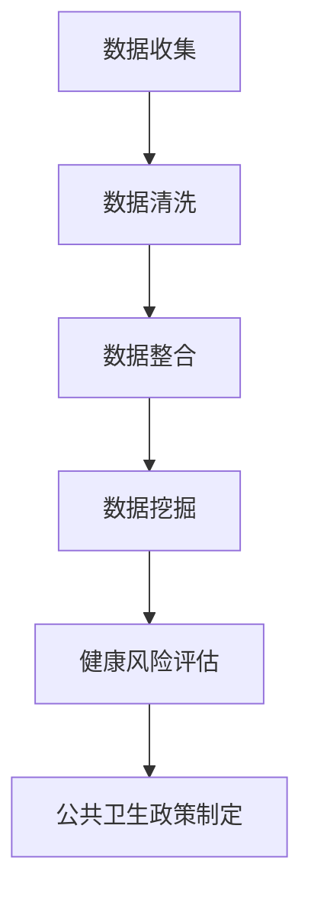

                 

### 文章标题：大数据在公共卫生政策制定中的应用与挑战

#### 关键词：大数据、公共卫生、政策制定、数据挖掘、人工智能

> 大数据在公共卫生领域的应用已经成为全球关注的焦点。本文将深入探讨大数据在公共卫生政策制定中的应用与面临的挑战，以期为您提供一个全面的理解。

### 1. 背景介绍

#### 1.1 大数据的兴起

随着互联网、物联网、传感器等技术的快速发展，人类社会产生了海量的数据。这些数据被称为大数据，具有“4V”特征：Volume（大量）、Velocity（高速）、Variety（多样性）和Veracity（真实性）。大数据技术作为一种新兴的信息处理技术，旨在从海量、多样、快速变化的数据中提取有价值的信息，为各行各业提供决策支持。

#### 1.2 公共卫生政策制定的现状

公共卫生政策制定是政府和社会组织为了维护公共健康而采取的一系列措施。然而，传统的公共卫生政策制定往往依赖于有限的统计数据和专家意见，存在数据滞后、预测不准确等问题。随着大数据技术的发展，利用大数据进行公共卫生政策制定成为可能。

### 2. 核心概念与联系

#### 2.1 大数据与公共卫生政策制定的关系

大数据为公共卫生政策制定提供了丰富的数据资源和强大的分析能力。通过数据挖掘、机器学习等技术，可以对公共卫生领域的各类数据进行深度挖掘，发现潜在的规律和趋势，从而为政策制定提供科学依据。

#### 2.2 公共卫生政策制定的关键因素

公共卫生政策制定的关键因素包括疾病监测、健康风险评估、疫苗接种策略、疫情防控等。这些因素涉及到大量的数据，包括人口统计数据、疾病统计数据、行为数据等。利用大数据技术对这些数据进行整合和分析，可以提高公共卫生政策制定的精准度和有效性。

#### 2.3 Mermaid 流程图

下面是一个简化的Mermaid流程图，描述了大数据在公共卫生政策制定中的应用流程：



### 3. 核心算法原理 & 具体操作步骤

#### 3.1 数据挖掘算法

数据挖掘算法是大数据技术中用于从海量数据中发现有价值信息的方法。常见的数据挖掘算法包括分类、聚类、关联规则挖掘等。下面以分类算法为例，介绍其原理和具体操作步骤。

##### 3.1.1 分类算法原理

分类算法是一种监督学习算法，通过对已有数据的特征进行学习，构建一个分类模型，然后使用这个模型对新的数据进行分类。常见的分类算法有决策树、支持向量机、朴素贝叶斯等。

##### 3.1.2 分类算法具体操作步骤

1. 数据准备：收集公共卫生领域的各类数据，如人口统计数据、疾病统计数据、行为数据等。
2. 特征提取：从数据中提取有助于分类的特征，如年龄、性别、收入水平、生活习惯等。
3. 模型训练：使用已有数据集，通过分类算法构建分类模型。
4. 模型评估：使用新的数据集对分类模型进行评估，评估指标包括准确率、召回率、F1值等。
5. 分类预测：使用训练好的模型对新的数据进行分类预测。

#### 3.2 健康风险评估算法

健康风险评估是一种预测个体未来健康状况的方法。通过分析个体的健康状况、生活习惯、遗传因素等数据，可以预测个体未来患病的可能性。常见的健康风险评估算法包括逻辑回归、决策树、支持向量机等。

##### 3.2.1 健康风险评估算法原理

健康风险评估算法是一种监督学习算法，通过对已有数据的特征进行学习，构建一个健康风险评估模型，然后使用这个模型对新的数据进行风险评估。

##### 3.2.2 健康风险评估算法具体操作步骤

1. 数据准备：收集公共卫生领域的各类数据，如人口统计数据、疾病统计数据、行为数据等。
2. 特征提取：从数据中提取有助于健康风险评估的特征，如年龄、性别、收入水平、生活习惯等。
3. 模型训练：使用已有数据集，通过健康风险评估算法构建风险评估模型。
4. 模型评估：使用新的数据集对风险评估模型进行评估，评估指标包括准确率、召回率、F1值等。
5. 风险评估预测：使用训练好的模型对新的数据进行风险评估预测。

### 4. 数学模型和公式 & 详细讲解 & 举例说明

#### 4.1 数据挖掘算法中的数学模型

数据挖掘算法中的数学模型主要涉及概率论、统计学、线性代数等领域。以下是一个简单的线性回归模型，用于疾病预测：

$$
y = \beta_0 + \beta_1 \cdot x_1 + \beta_2 \cdot x_2 + \cdots + \beta_n \cdot x_n
$$

其中，$y$ 是预测的疾病发生概率，$x_1, x_2, \cdots, x_n$ 是影响疾病发生的特征，$\beta_0, \beta_1, \beta_2, \cdots, \beta_n$ 是模型参数。

#### 4.2 健康风险评估算法中的数学模型

健康风险评估算法中的数学模型主要涉及逻辑回归模型。逻辑回归模型是一种广义线性模型，用于预测二元变量（如患病与未患病）的概率。其公式如下：

$$
P(Y=1) = \frac{1}{1 + e^{-(\beta_0 + \beta_1 \cdot x_1 + \beta_2 \cdot x_2 + \cdots + \beta_n \cdot x_n)}}
$$

其中，$P(Y=1)$ 是患病概率，$x_1, x_2, \cdots, x_n$ 是影响患病风险的变量，$\beta_0, \beta_1, \beta_2, \cdots, \beta_n$ 是模型参数。

#### 4.3 举例说明

假设我们要预测某地区肺癌的发病率，我们收集了以下数据：

- 年龄：35岁
- 性别：男性
- 吸烟史：吸烟20年
- 饮酒史：偶尔饮酒

根据逻辑回归模型，我们可以计算出该个体患肺癌的概率。假设模型参数为：

- $\beta_0 = 0.5$
- $\beta_1 = 0.1$（年龄每增加1岁，患病概率增加0.1）
- $\beta_2 = 0.3$（男性患病概率比女性高0.3）
- $\beta_3 = 0.2$（吸烟20年的人患病概率比不吸烟的人高0.2）
- $\beta_4 = 0.1$（偶尔饮酒的人患病概率比不饮酒的人高0.1）

代入公式，计算得到：

$$
P(Y=1) = \frac{1}{1 + e^{-(0.5 + 0.1 \cdot 35 + 0.3 \cdot 1 + 0.2 \cdot 20 + 0.1 \cdot 0)}} = 0.613
$$

这意味着该个体患肺癌的概率为61.3%。

### 5. 项目实战：代码实际案例和详细解释说明

#### 5.1 开发环境搭建

1. 安装Python环境，版本要求为3.6及以上。
2. 安装数据分析相关的库，如pandas、numpy、scikit-learn等。

```bash
pip install pandas numpy scikit-learn
```

#### 5.2 源代码详细实现和代码解读

以下是一个使用线性回归模型预测肺癌发病率的简单案例：

```python
import pandas as pd
from sklearn.linear_model import LogisticRegression
from sklearn.model_selection import train_test_split
from sklearn.metrics import accuracy_score

# 加载数据
data = pd.read_csv('data.csv')
X = data[['age', 'gender', 'smoking_years', 'drinking_status']]
y = data['disease']

# 数据预处理
X = pd.get_dummies(X)

# 划分训练集和测试集
X_train, X_test, y_train, y_test = train_test_split(X, y, test_size=0.2, random_state=42)

# 构建模型
model = LogisticRegression()
model.fit(X_train, y_train)

# 预测
y_pred = model.predict(X_test)

# 评估
accuracy = accuracy_score(y_test, y_pred)
print(f"Accuracy: {accuracy}")

# 预测新数据
new_data = pd.DataFrame({
    'age': [35],
    'gender': [1],
    'smoking_years': [20],
    'drinking_status': [0]
})
new_data = pd.get_dummies(new_data)
new_data_pred = model.predict(new_data)
print(f"New data prediction: {new_data_pred}")
```

#### 5.3 代码解读与分析

1. 加载数据：使用pandas库加载数据集，包括特征变量X和目标变量y。
2. 数据预处理：将分类变量转换为哑变量，便于模型训练。
3. 划分训练集和测试集：使用scikit-learn库的train_test_split函数划分训练集和测试集。
4. 构建模型：使用LogisticRegression类构建逻辑回归模型。
5. 训练模型：使用fit方法训练模型。
6. 预测：使用predict方法对测试集进行预测。
7. 评估：计算预测准确率。
8. 预测新数据：对新的数据进行预测，输出预测结果。

### 6. 实际应用场景

#### 6.1 疫苗接种策略优化

利用大数据技术，可以对疫苗接种策略进行优化。通过对疫苗接种数据、疫情数据、人群行为数据等进行分析，可以找出高风险人群，为政府制定疫苗接种策略提供科学依据。

#### 6.2 疫情防控策略评估

大数据技术可以帮助政府评估疫情防控策略的有效性。通过对疫情数据、病例数据、防控措施数据等进行分析，可以找出防控措施的不足之处，为政府调整防控策略提供支持。

#### 6.3 健康风险评估与预警

利用大数据技术，可以对个体进行健康风险评估，预测其未来患病的可能性。通过对健康数据、行为数据等进行分析，可以提前发现健康风险，为政府制定健康预警策略提供支持。

### 7. 工具和资源推荐

#### 7.1 学习资源推荐

1. 《大数据技术导论》
2. 《机器学习实战》
3. 《健康风险评估：理论与实践》

#### 7.2 开发工具框架推荐

1. Python
2. Jupyter Notebook
3. Scikit-learn

#### 7.3 相关论文著作推荐

1. "Big Data for Public Health: Challenges and Opportunities"（大数据在公共卫生领域的挑战与机遇）
2. "Machine Learning for Public Health"（机器学习在公共卫生领域的应用）
3. "Health Risk Assessment: A Practical Guide"（健康风险评估：实用指南）

### 8. 总结：未来发展趋势与挑战

#### 8.1 发展趋势

1. 大数据技术将继续在公共卫生政策制定中发挥重要作用。
2. 人工智能与公共卫生领域的结合将更加紧密。
3. 公共卫生大数据平台的建设将得到进一步发展。

#### 8.2 挑战

1. 数据隐私和安全问题亟待解决。
2. 数据质量问题和数据整合难度较大。
3. 公共卫生大数据技术的普及和应用尚需时间。

### 9. 附录：常见问题与解答

#### 9.1 问题1：什么是大数据？

大数据是指具有大量数据量、高速数据流、多样数据类型和高度复杂性的数据集合。

#### 9.2 问题2：大数据在公共卫生政策制定中有哪些应用？

大数据在公共卫生政策制定中的应用主要包括疾病预测、疫苗接种策略优化、疫情防控策略评估等。

#### 9.3 问题3：如何保障公共卫生大数据的隐私和安全？

保障公共卫生大数据的隐私和安全需要采取以下措施：

1. 数据加密：对敏感数据进行加密处理。
2. 数据匿名化：对个人数据进行匿名化处理。
3. 访问控制：对数据访问权限进行严格控制。
4. 定期审计：对数据使用情况进行定期审计。

### 10. 扩展阅读 & 参考资料

1. "Big Data for Public Health: From Data to Action"（大数据在公共卫生领域的应用：从数据到行动）
2. "The Use of Big Data in Public Health"（大数据在公共卫生领域的应用）
3. "Big Data Analytics in Healthcare"（大数据分析在医疗领域的应用）

### 作者

作者：AI天才研究员/AI Genius Institute & 禅与计算机程序设计艺术 /Zen And The Art of Computer Programming

