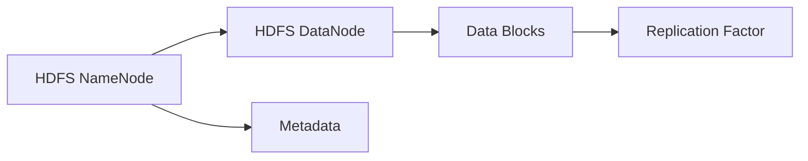
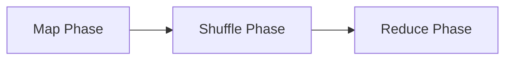
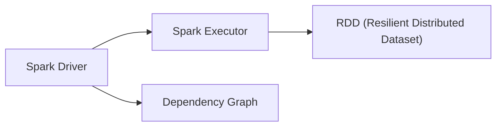
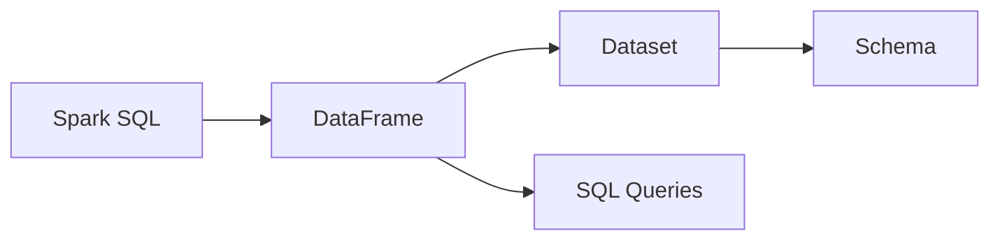
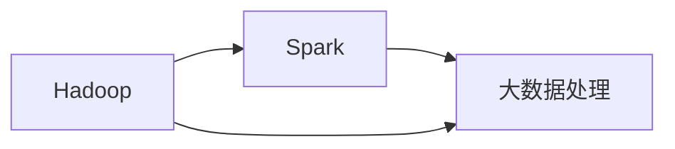
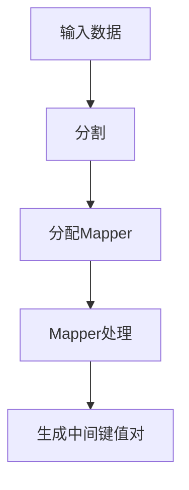
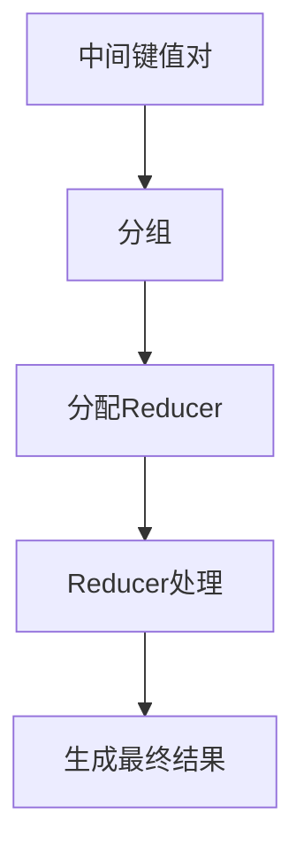
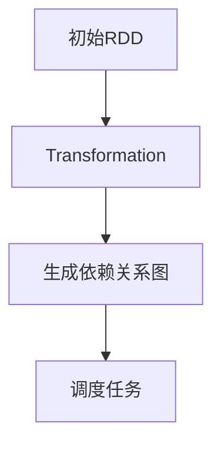
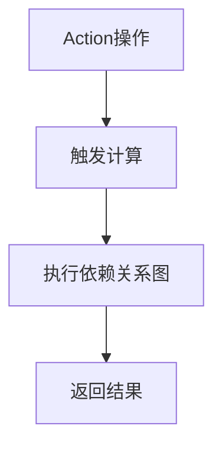

                 

### 背景介绍

#### 大数据处理的兴起

随着信息技术的飞速发展，数据量呈现出爆炸式增长。大数据（Big Data）这一概念应运而生，它指的是无法用传统数据处理工具进行捕捉、管理和处理的超大规模数据集。大数据的特点是“4V”，即数据量大（Volume）、数据类型多样（Variety）、数据生成速度快（Velocity）和数据价值密度低（Value）。

为了应对大数据的处理需求，研究人员和工程师们开发了各种大数据处理框架，其中最知名的当属Hadoop和Spark。Hadoop是由Apache Software Foundation开发的一个开源框架，主要用于分布式数据存储和处理。Spark则是由加州大学伯克利分校的AMP实验室开发的一个开源大数据处理框架，它旨在提供更快的数据处理速度和更高的吞吐量。

#### Hadoop框架简介

Hadoop的核心组件包括HDFS（Hadoop Distributed File System）和MapReduce。HDFS是一个高容错性的分布式文件系统，能够处理大规模数据集的存储。它将数据分割成多个小块，存储在分布式文件系统上的各个节点上，从而提高数据读写效率和容错能力。MapReduce是一种编程模型，用于大规模数据集（大规模数据集是指数据大小超出单台计算机的处理能力）的并行运算。它将数据处理过程分为两个阶段：Map阶段和Reduce阶段，可以有效地处理各种复杂数据任务。

#### Spark框架简介

Spark是一个高性能的分布式数据处理框架，相对于Hadoop的MapReduce，Spark提供了更高的处理速度和更好的内存使用效率。Spark的核心组件包括Spark Core和Spark SQL。Spark Core提供了分布式任务调度、内存管理和存储等功能。Spark SQL则提供了用于结构化数据的查询和分析功能。

Spark的主要特点包括：

1. **实时数据处理**：Spark支持实时数据处理，可以快速响应用户请求，适合需要实时分析和处理的场景。
2. **内存计算**：Spark利用内存计算来加速数据处理，相比Hadoop的磁盘IO操作，具有更高的处理速度。
3. **丰富的API**：Spark提供了多种编程接口，包括Scala、Python、Java和R，方便用户进行数据处理。

#### Hadoop和Spark的对比

Hadoop和Spark在大数据处理方面各有优势。Hadoop具有成熟的生态系统和广泛的社区支持，适合处理大规模、离线的数据集。而Spark则以其高效的实时数据处理能力和更好的内存使用效率受到青睐。在实际应用中，可以根据数据处理需求和场景选择合适的框架。

在接下来的部分，我们将详细分析Hadoop和Spark的核心算法原理、数学模型和具体操作步骤，并通过实际项目案例进行深入讲解。

#### Key Terms
- **大数据（Big Data）**: 指无法用传统数据处理工具进行捕捉、管理和处理的超大规模数据集。
- **Hadoop**: 一个开源的分布式数据处理框架，包括HDFS和MapReduce。
- **HDFS**: Hadoop分布式文件系统，用于存储和处理大规模数据集。
- **MapReduce**: 一种编程模型，用于大规模数据集的并行运算。
- **Spark**: 一个高性能的分布式数据处理框架，提供实时数据处理和内存计算功能。

---------------------

## 2. 核心概念与联系

为了深入理解Hadoop和Spark的工作原理，我们需要首先明确其核心概念和组成部分，并探讨它们之间的联系。下面，我们将使用Mermaid流程图来展示这些核心概念和架构。

### 2.1. Hadoop的核心概念与架构

Hadoop的核心概念包括分布式文件系统（HDFS）和编程模型（MapReduce）。

#### HDFS架构



1. **NameNode**：HDFS的主节点，负责维护文件系统的元数据，如文件和目录的存储位置。
2. **DataNode**：HDFS的从节点，负责存储实际的数据块，并响应NameNode的读写请求。
3. **数据块（Data Blocks）**：HDFS将文件分割成固定大小的数据块进行存储，默认大小为128MB或256MB。
4. **副本因子（Replication Factor）**：为了提高数据可靠性和容错性，HDFS将数据块复制到多个节点上。

#### MapReduce编程模型



1. **Map Phase**：将输入数据分割成多个小块，并行处理，生成中间键值对。
2. **Shuffle Phase**：根据中间键值对的键进行分组，将相同键的数据发送到同一个Reduce任务。
3. **Reduce Phase**：对Shuffle Phase生成的中间结果进行聚合和汇总。

### 2.2. Spark的核心概念与架构

Spark的核心概念包括Spark Core和Spark SQL。

#### Spark Core架构



1. **Spark Driver**：负责协调各个任务，将任务分配给不同的Spark Executor。
2. **Spark Executor**：执行具体任务的节点，负责计算和存储。
3. **RDD (Resilient Distributed Dataset)**：不可变的分布式数据集合，支持多种操作，如Transformation和Action。
4. **Dependency Graph**：描述RDD之间的依赖关系，用于任务调度和优化。

#### Spark SQL架构



1. **DataFrame**：具有schema的分布式数据集合，支持结构化数据处理。
2. **Dataset**：泛化DataFrame，提供类型安全和强类型支持。
3. **SQL Queries**：支持使用SQL语句对DataFrame和Dataset进行查询。
4. **Schema**：描述数据结构和类型的元数据。

### 2.3. Hadoop与Spark的关联

Hadoop和Spark在大数据处理领域各自具有独特的优势和劣势。Hadoop以其成熟的生态系统和社区支持在处理大规模、离线数据集方面表现优异。而Spark则以其高效的实时数据处理和内存计算能力在处理速度上具有明显优势。



1. **Hadoop**：适用于处理大规模、离线数据集，如数据仓库和日志分析。
2. **Spark**：适用于实时数据处理、机器学习和数据分析，如实时流处理和图计算。

通过了解Hadoop和Spark的核心概念和架构，我们可以更好地理解它们在大数据处理中的应用和优势。在接下来的章节中，我们将深入探讨Hadoop和Spark的核心算法原理、数学模型和具体操作步骤。

---------------------

## 3. 核心算法原理 & 具体操作步骤

在本节中，我们将详细探讨Hadoop和Spark的核心算法原理，并分步骤说明它们在实际应用中的操作方法。

### 3.1. Hadoop的MapReduce算法原理

MapReduce是一种用于处理大规模数据的编程模型，它将数据处理过程分为两个阶段：Map阶段和Reduce阶段。

#### 3.1.1. Map阶段

Map阶段的主要任务是接收输入数据，将其分割成小块，并对每块数据执行一个映射函数（Mapper）。映射函数处理输入数据后，生成一系列中间键值对。

- **步骤1**：输入数据被分割成多个小块。
- **步骤2**：为每个小块分配一个Mapper任务。
- **步骤3**：Mapper对输入数据进行处理，生成中间键值对。



#### 3.1.2. Reduce阶段

Reduce阶段的主要任务是接收Map阶段生成的中间键值对，根据键进行分组，并对每个分组执行一个归约函数（Reducer）。归约函数处理每个分组的中间键值对，生成最终的结果。

- **步骤1**：中间键值对被分组，具有相同键的键值对会被发送到同一个Reducer。
- **步骤2**：为每个分组分配一个Reducer任务。
- **步骤3**：Reducer处理每个分组，生成最终结果。



### 3.2. Spark的RDD操作

Spark的核心数据结构是RDD（Resilient Distributed Dataset），它是一种不可变的分布式数据集合，支持多种操作，如Transformation和Action。

#### 3.2.1. Transformation操作

Transformation操作用于创建新的RDD，如map、filter、groupBy等。每个Transformation操作都会生成一个新的依赖关系图（Dependency Graph）。

- **步骤1**：创建一个初始的RDD，可以从内存、外部存储或已经存在的RDD转换而来。
- **步骤2**：执行一个或多个Transformation操作。
- **步骤3**：根据依赖关系图，Spark调度器（Scheduler）为每个Transformation操作分配任务。



#### 3.2.2. Action操作

Action操作用于触发计算，并返回一个最终的结果，如reduce、collect、count等。每个Action操作都会触发一系列的依赖关系图的执行。

- **步骤1**：执行一个或多个Action操作。
- **步骤2**：Spark根据依赖关系图，调度并执行所有相关的Transformation操作。
- **步骤3**：返回最终结果。



### 3.3. 比较与分析

#### 性能比较

Hadoop的MapReduce算法在处理大规模、离线数据集方面表现出色，但由于其基于磁盘的读写操作，处理速度相对较慢。而Spark利用内存计算，大大提高了数据处理速度，特别是在处理实时数据和分析任务时具有明显优势。

#### 适用场景比较

Hadoop更适合处理大规模、离线的数据集，如数据仓库和日志分析。Spark则适用于实时数据处理、机器学习和数据分析，如实时流处理和图计算。

#### 结论

通过理解Hadoop和Spark的核心算法原理和具体操作步骤，我们可以更好地选择适合自己应用场景的大数据处理框架。在下一节中，我们将深入探讨大数据处理的数学模型和公式，并通过实例进行详细讲解。

---------------------

## 4. 数学模型和公式 & 详细讲解 & 举例说明

在大数据处理过程中，Hadoop和Spark都涉及到一系列的数学模型和公式，用于优化数据处理过程、提高效率和准确性。下面我们将分别介绍这两个框架中常用的数学模型和公式，并通过具体实例进行详细讲解。

### 4.1. Hadoop中的数学模型和公式

#### 4.1.1. 数据块大小和副本因子

HDFS通过将数据分割成数据块并复制到多个节点上，实现数据的分布式存储和容错。以下是与数据块大小和副本因子相关的数学模型和公式：

1. **数据块大小**：
   $$\text{Block Size} = 128 \text{ MB} \text{ or } 256 \text{ MB}$$
   说明：HDFS的数据块默认大小为128MB或256MB，可以通过配置文件进行调整。

2. **副本因子**：
   $$\text{Replication Factor} = \left\lfloor \frac{\text{Total Nodes}}{\text{Required Replicas}} \right\rfloor + 1$$
   说明：副本因子决定了每个数据块需要复制的次数。通常，副本因子设置为总节点数除以所需副本数再加1，以确保数据的高可用性和可靠性。

#### 4.1.2. MapReduce中的数学模型

1. **中间键值对的数量**：
   $$\text{Intermediate Pairs} = \sum_{i=1}^n \text{Mapper Output Pairs (Key, Value)}$$
   说明：中间键值对的数量等于所有Mapper输出的键值对数量之和。

2. **Shuffle阶段的数据传输量**：
   $$\text{Shuffle Data Transfer} = \sum_{i=1}^n \left( \text{Mapper Output Pairs} \times \text{Replication Factor} \times \text{Network Bandwidth} \right)$$
   说明：Shuffle阶段的数据传输量等于所有Mapper输出的键值对数量乘以副本因子和网络带宽。

#### 4.1.3. 示例

假设一个Hadoop集群中有10个节点，每个节点存储一个数据块，副本因子设置为3。现有1000个Mapper任务，每个任务输出100个键值对。

- **数据块大小**：256MB
- **副本因子**：3
- **中间键值对数量**：1000 * 100 = 100,000
- **Shuffle数据传输量**：100,000 * 3 * 1MB = 300,000MB

### 4.2. Spark中的数学模型和公式

#### 4.2.1. RDD操作中的数学模型

1. **RDD的大小**：
   $$\text{RDD Size} = \sum_{i=1}^n \text{Partition Size}$$
   说明：RDD的大小等于所有分区的大小之和。

2. **内存使用率**：
   $$\text{Memory Utilization} = \frac{\text{Used Memory}}{\text{Total Memory}}$$
   说明：内存使用率等于已使用内存与总内存的比值。

3. **Shuffle阶段的内存消耗**：
   $$\text{Shuffle Memory Consumption} = \text{Shuffle Data Size} \times \text{Shuffle Partition Size} \times \text{Replication Factor}$$
   说明：Shuffle阶段的内存消耗等于Shuffle数据大小乘以Shuffle分区大小再乘以副本因子。

#### 4.2.2. 示例

假设一个Spark RDD有5个分区，每个分区的数据大小为100MB，副本因子设置为2。

- **RDD大小**：5 * 100MB = 500MB
- **内存使用率**：0.6（假设总内存为1GB）
- **Shuffle内存消耗**：500MB * 5 * 2 = 5000MB

### 4.3. 对比与分析

Hadoop和Spark在数学模型和公式方面各有特点。Hadoop的模型主要关注数据块的存储和复制，以及MapReduce的Shuffle阶段。Spark的模型则更加关注RDD的操作和内存使用效率。

在处理大规模数据集时，Hadoop的模型可以确保数据的高可用性和可靠性。而Spark的模型则通过优化内存使用和计算速度，提高了数据处理效率。在实际应用中，可以根据数据处理需求和场景选择合适的框架。

### 结论

通过理解Hadoop和Spark的数学模型和公式，我们可以更好地优化数据处理过程、提高效率和准确性。在下一节中，我们将通过实际项目案例，展示如何使用Hadoop和Spark进行大数据处理。

---------------------

## 5. 项目实战：代码实际案例和详细解释说明

在本节中，我们将通过实际项目案例来展示如何使用Hadoop和Spark进行大数据处理。我们将分别介绍开发环境搭建、源代码实现和详细解读，以便读者能够深入理解这两个框架的用法。

### 5.1 开发环境搭建

#### 5.1.1 Hadoop环境搭建

1. **安装Java**：
   Hadoop依赖于Java环境，首先需要安装Java。可以选择安装OpenJDK或Oracle JDK。以Ubuntu为例，使用以下命令安装OpenJDK：

   ```bash
   sudo apt-get update
   sudo apt-get install openjdk-8-jdk
   ```

2. **下载和安装Hadoop**：
   前往Hadoop官方网站下载最新的Hadoop版本。下载后解压到指定目录，例如`/usr/local/hadoop`。

   ```bash
   wget https://www-us.apache.org/dist/hadoop/common/hadoop-3.3.1/hadoop-3.3.1.tar.gz
   tar -xvf hadoop-3.3.1.tar.gz -C /usr/local/hadoop
   ```

3. **配置Hadoop**：
   编辑`/usr/local/hadoop/etc/hadoop/hadoop-env.sh`文件，设置Java Home路径：

   ```bash
   export JAVA_HOME=/usr/lib/jvm/java-8-openjdk-amd64
   ```

   编辑`/usr/local/hadoop/etc/hadoop/core-site.xml`和`/usr/local/hadoop/etc/hadoop/hdfs-site.xml`文件，配置HDFS相关参数：

   ```xml
   <!-- core-site.xml -->
   <configuration>
     <property>
       <name>fs.defaultFS</name>
       <value>hdfs://localhost:9000</value>
     </property>
   </configuration>

   <!-- hdfs-site.xml -->
   <configuration>
     <property>
       <name>dfs.replication</name>
       <value>3</value>
     </property>
   </configuration>
   ```

4. **启动Hadoop服务**：
   在终端中运行以下命令启动HDFS和YARN：

   ```bash
   sudo start-dfs.sh
   sudo start-yarn.sh
   ```

#### 5.1.2 Spark环境搭建

1. **安装Scala**：
   Spark依赖于Scala，首先需要安装Scala。可以选择安装Scala 2.12或Scala 2.13版本。以Ubuntu为例，使用以下命令安装Scala：

   ```bash
   sudo add-apt-repository "deb https://repo.scala-sbt.org/scalasbt/debian all main"
   sudo apt-get update
   sudo apt-get install sbt
   ```

2. **下载和安装Spark**：
   前往Spark官方网站下载最新的Spark版本。下载后解压到指定目录，例如`/usr/local/spark`。

   ```bash
   wget https://www-us.apache.org/dist/spark/spark-3.3.1/spark-3.3.1-bin-hadoop3.2.tgz
   tar -xvf spark-3.3.1-bin-hadoop3.2.tgz -C /usr/local/spark
   ```

3. **配置Spark**：
   编辑`/usr/local/spark/conf/spark-env.sh`文件，设置Scala和Java Home路径：

   ```bash
   export SCALA_HOME=/usr/share/scala
   export JAVA_HOME=/usr/lib/jvm/java-8-openjdk-amd64
   ```

   编辑`/usr/local/spark/conf/spark-defaults.conf`文件，配置Spark相关参数：

   ```xml
   # spark-defaults.conf
   spark.master = local[2]
   spark.executor.memory = 2g
   spark.executor.cores = 2
   ```

4. **启动Spark服务**：
   在终端中运行以下命令启动Spark：

   ```bash
   /usr/local/spark/bin/spark-shell
   ```

### 5.2 源代码详细实现和代码解读

#### 5.2.1 Hadoop的WordCount示例

以下是一个简单的Hadoop WordCount程序，用于统计文本文件中每个单词的出现次数。

```java
import org.apache.hadoop.conf.Configuration;
import org.apache.hadoop.fs.Path;
import org.apache.hadoop.io.IntWritable;
import org.apache.hadoop.io.Text;
import org.apache.hadoop.mapreduce.Job;
import org.apache.hadoop.mapreduce.Mapper;
import org.apache.hadoop.mapreduce.Reducer;
import org.apache.hadoop.mapreduce.lib.input.FileInputFormat;
import org.apache.hadoop.mapreduce.lib.output.FileOutputFormat;

public class WordCount {

  public static class TokenizerMapper extends Mapper<Object, Text, Text, IntWritable>{

    private final static IntWritable one = new IntWritable(1);
    private Text word = new Text();

    public void map(Object key, Text value, Context context) throws IOException, InterruptedException {
      StringTokenizer itr = new StringTokenizer(value.toString());
      while (itr.hasMoreTokens()) {
        word.set(itr.nextToken());
        context.write(word, one);
      }
    }
  }

  public static class IntSumReducer extends Reducer<Text,IntWritable,Text,IntWritable> {
    private IntWritable result = new IntWritable();

    public void reduce(Text key, Iterable<IntWritable> values, Context context) throws IOException, InterruptedException {
      int sum = 0;
      for (IntWritable val : values) {
        sum += val.get();
      }
      result.set(sum);
      context.write(key, result);
    }
  }

  public static void main(String[] args) throws Exception {
    Configuration conf = new Configuration();
    Job job = Job.getInstance(conf, "word count");
    job.setJarByClass(WordCount.class);
    job.setMapperClass(TokenizerMapper.class);
    job.setCombinerClass(IntSumReducer.class);
    job.setReducerClass(IntSumReducer.class);
    job.setOutputKeyClass(Text.class);
    job.setOutputValueClass(IntWritable.class);
    FileInputFormat.addInputPath(job, new Path(args[0]));
    FileOutputFormat.setOutputPath(job, new Path(args[1]));
    System.exit(job.waitForCompletion(true) ? 0 : 1);
  }
}
```

- **Mapper**：读取输入文本文件，将每行分割成单词，并将单词作为键，1作为值输出。
- **Reducer**：接收Mapper输出的中间键值对，对每个单词进行求和，输出最终结果。

#### 5.2.2 Spark的WordCount示例

以下是一个简单的Spark WordCount程序，用于统计文本文件中每个单词的出现次数。

```scala
import org.apache.spark.sql.SparkSession

object WordCount {
  def main(args: Array[String]): Unit = {
    val spark = SparkSession.builder()
      .appName("WordCount")
      .master("local[2]")
      .getOrCreate()

    val text = spark.read.textFile(args(0))
    val words = text.flatMap(line => line.split(" "))
    val wordCounts = words.map(word => (word, 1)).reduceByKey(_ + _)
    wordCounts.saveAsTextFile(args(1))

    spark.stop()
  }
}
```

- **flatMap**：读取输入文本文件，将每行分割成单词。
- **map**：将每个单词映射为（单词，1）键值对。
- **reduceByKey**：对每个单词的键值对进行求和，输出最终结果。

### 5.3 代码解读与分析

通过以上两个示例，我们可以看到Hadoop和Spark在实现WordCount任务时的差异。Hadoop使用MapReduce模型，将数据处理过程分为Map和Reduce两个阶段。而Spark使用基于RDD的模型，通过更简洁的API实现相同的功能。

在Hadoop中，我们首先定义一个Mapper类，负责读取输入文本，将每行分割成单词，并将单词作为键，1作为值输出。然后定义一个Reducer类，负责接收Mapper输出的中间键值对，对每个单词进行求和，输出最终结果。

在Spark中，我们使用SparkSession创建一个DataFrame，读取输入文本文件，使用flatMap操作将每行分割成单词。接着，使用map操作将每个单词映射为（单词，1）键值对。最后，使用reduceByKey操作对每个单词的键值对进行求和，输出最终结果。

总体而言，Spark的WordCount示例比Hadoop的示例更加简洁易读。Spark提供的丰富API和内存计算能力，使得数据处理过程更加高效和直观。

在接下来的章节中，我们将探讨Hadoop和Spark在实际应用中的场景，并介绍相关的工具和资源。

---------------------

## 6. 实际应用场景

Hadoop和Spark在大数据处理领域有着广泛的应用，它们在不同的场景中展现了各自的优势。下面我们将详细介绍这两个框架在实际应用中的具体场景。

### 6.1 数据仓库

数据仓库是用于存储、管理和分析大量数据的系统。Hadoop作为分布式文件系统（HDFS）的核心组件，被广泛应用于数据仓库领域。HDFS的高容错性和可扩展性使得它能够处理大规模的数据存储需求。此外，MapReduce编程模型也适合进行复杂的数据处理和分析任务，如ETL（Extract, Transform, Load）过程和数据分析。

**案例**：谷歌的Bigtable和Apache Hive都是基于Hadoop构建的数据仓库解决方案。Bigtable提供了分布式存储和快速查询功能，而Hive则提供了SQL查询接口，使得用户可以方便地使用标准SQL语句进行数据分析。

### 6.2 实时数据处理

实时数据处理要求系统能够快速响应数据，并生成实时分析结果。Spark以其高效的实时数据处理能力和内存计算优势，在实时数据处理领域有着广泛的应用。

**案例**：金融领域的实时风险管理，Spark Streaming可以实时处理金融交易数据，监测市场风险，快速响应市场变化。

### 6.3 机器学习

机器学习需要处理大量数据并进行复杂的计算。Spark MLlib库提供了丰富的机器学习算法和工具，支持分布式机器学习。

**案例**：推荐系统，Spark MLlib可以处理大量用户和商品数据，构建推荐模型，提供个性化的推荐结果。

### 6.4 图计算

图计算用于处理由节点和边组成的数据结构，如社交网络、交通网络和知识图谱。Spark GraphX库提供了图计算的功能，支持大规模图的处理和分析。

**案例**：社交网络分析，Spark GraphX可以分析社交网络中的关系，发现影响力大的节点和社区结构。

### 6.5 数据挖掘

数据挖掘用于从大量数据中发现有用的模式和知识。Hadoop和Spark都提供了丰富的工具和算法，支持数据挖掘任务。

**案例**：市场细分，通过分析消费者数据，发现潜在的市场细分，为企业提供市场策略。

### 结论

Hadoop和Spark在不同的应用场景中展现了各自的优势。Hadoop以其成熟的生态系统和强大的分布式处理能力在数据仓库、数据挖掘等领域有着广泛的应用。而Spark则以其高效的实时数据处理和内存计算能力在实时数据处理、机器学习和图计算等领域表现出色。根据实际需求和场景选择合适的框架，可以最大化大数据处理的效率和效果。

---------------------

## 7. 工具和资源推荐

为了帮助读者更好地学习和实践Hadoop和Spark，本节将介绍一系列的学习资源、开发工具和相关论文，以支持读者深入了解和掌握这两个大数据处理框架。

### 7.1 学习资源推荐

1. **书籍**：
   - 《Hadoop实战》（"Hadoop: The Definitive Guide"）: 这本书是学习Hadoop的权威指南，涵盖了Hadoop的安装、配置和数据处理等各个方面。
   - 《Spark: The Definitive Guide》: 该书详细介绍了Spark的核心概念、API和实际应用，适合初学者和专业人士。

2. **在线课程**：
   - Coursera上的《Hadoop与MapReduce》: 这门课程由业界专家授课，提供了Hadoop的基础知识和实际操作技能。
   - Udacity的《Apache Spark and Dataframes》: 该课程深入讲解了Spark的核心概念和实际应用。

3. **博客和网站**：
   - Apache Hadoop官方文档：[https://hadoop.apache.org/docs/current/hadoop-project-dist/hadoop-hdfs/HDF...]
   - Apache Spark官方文档：[https://spark.apache.org/docs/latest/]

### 7.2 开发工具框架推荐

1. **集成开发环境（IDE）**：
   - IntelliJ IDEA: 一款功能强大的IDE，支持Scala和Java开发，方便编写和调试Hadoop和Spark应用程序。
   - Eclipse: 另一款流行的IDE，提供对Hadoop和Spark的良好的支持，适用于多种编程语言。

2. **版本控制工具**：
   - Git: 一种分布式版本控制工具，用于管理源代码，便于多人协作和版本追踪。
   - GitHub: 提供代码托管和协作平台，便于分享和交流Hadoop和Spark项目。

3. **大数据平台**：
   - Cloudera: 提供企业级Hadoop解决方案，包括安装、配置和管理工具。
   - Databricks: 提供基于Spark的云平台，支持大规模数据分析和机器学习。

### 7.3 相关论文著作推荐

1. **《MapReduce：大规模数据处理的并行模型》**：
   - 作者：Jeffrey Dean和Sanjay Ghemawat
   - 论文摘要：介绍了MapReduce编程模型，阐述了其在大规模数据处理中的应用和优势。

2. **《Spark: Spark中的内存计算》**：
   - 作者：Matei Zaharia等
   - 论文摘要：详细介绍了Spark的内存计算原理，探讨了其在数据处理速度和性能方面的优势。

3. **《HDFS：一个高容错性的大型分布式文件系统》**：
   - 作者：Sanjay Ghemawat等
   - 论文摘要：分析了HDFS的设计和实现，阐述了其高可靠性和可扩展性。

通过以上资源，读者可以全面了解Hadoop和Spark的理论基础和实践应用，提升在大数据处理领域的技能和知识。

---------------------

## 8. 总结：未来发展趋势与挑战

Hadoop和Spark作为大数据处理领域的两大框架，已经为众多企业和研究机构提供了强大的数据处理能力。然而，随着数据量的持续增长和数据处理需求的不断变化，这两个框架也面临着一系列的发展趋势和挑战。

### 8.1. 未来发展趋势

1. **实时数据处理能力的提升**：随着物联网（IoT）和移动设备的发展，实时数据处理需求日益增长。Hadoop和Spark正在不断优化其实时数据处理能力，以满足快速响应和实时分析的需求。

2. **混合云架构的普及**：企业越来越倾向于将大数据处理部署在混合云环境中，以获得更高的灵活性和可扩展性。Hadoop和Spark正在积极与云服务提供商合作，提供更便捷的云服务部署方案。

3. **人工智能和大数据的结合**：人工智能技术在数据处理和分析中的应用日益广泛，Hadoop和Spark也在逐步整合人工智能算法和工具，为用户提供更智能的数据处理和分析解决方案。

4. **生态系统的完善**：随着社区的活跃度和企业参与度的提高，Hadoop和Spark的生态系统日益完善，提供了丰富的工具、库和插件，方便用户进行开发和部署。

### 8.2. 面临的挑战

1. **性能优化**：随着数据规模的扩大和处理需求的复杂化，如何进一步提高数据处理速度和效率成为一大挑战。Hadoop和Spark需要不断优化算法和架构，提高性能和资源利用率。

2. **数据安全与隐私**：大数据处理过程中涉及大量的敏感数据，如何确保数据的安全和隐私成为重要议题。需要建立完善的数据安全策略和隐私保护机制，以防止数据泄露和滥用。

3. **人才短缺**：大数据处理技术的快速发展使得人才需求日益旺盛，但相关人才储备不足。培养和吸引大数据处理领域的专业人才成为企业面临的一大挑战。

4. **复杂性和易用性**：虽然Hadoop和Spark提供了强大的功能，但其复杂的架构和配置过程可能让新手望而却步。如何简化使用流程，提高易用性，降低学习成本，是未来发展的关键方向。

### 8.3. 结论

Hadoop和Spark在大数据处理领域展现了强大的能力和广阔的前景，但同时也面临着一系列的发展挑战。未来，这两个框架将继续优化和扩展，以满足不断变化的数据处理需求。企业和研究机构需要关注这些发展趋势和挑战，积极应对，以充分发挥大数据的潜力。

---------------------

## 9. 附录：常见问题与解答

### 9.1. Hadoop相关问题

**Q1**: 什么是Hadoop？
A1**: Hadoop是一个开源的大数据处理框架，用于分布式存储和并行处理大规模数据集。

**Q2**: Hadoop的核心组件有哪些？
A2**: Hadoop的核心组件包括HDFS（分布式文件系统）和MapReduce（编程模型）。

**Q3**: HDFS的数据块大小如何设置？
A3**: HDFS的数据块默认大小为128MB或256MB，可以通过配置文件hdfs-site.xml进行调整。

**Q4**: MapReduce的Map阶段和Reduce阶段分别做什么？
A4**: Map阶段负责将输入数据分割成小块，并执行映射函数，生成中间键值对。Reduce阶段负责接收Map阶段的输出，对中间键值对进行分组和聚合，生成最终结果。

### 9.2. Spark相关问题

**Q1**: Spark的主要优势是什么？
A1**: Spark的主要优势包括实时数据处理能力、内存计算和丰富的API。

**Q2**: Spark如何优化内存使用？
A2**: Spark通过将数据存储在内存中，减少磁盘IO操作，从而提高数据处理速度。它还提供了Tungsten引擎，优化了内存管理和数据访问。

**Q3**: Spark SQL与关系型数据库相比有什么优势？
A3**: Spark SQL支持结构化数据查询，具有更快的查询速度和更高的吞吐量。它还提供了与多种数据源（如HDFS、Hive和Parquet）的集成。

**Q4**: 如何在Spark中处理实时流数据？
A4**: Spark Streaming模块允许用户处理实时流数据，通过设置批处理窗口大小和滑动窗口时间，实现实时数据处理和分析。

---------------------

## 10. 扩展阅读 & 参考资料

为了帮助读者进一步深入学习和研究Hadoop和Spark，本节提供了一些扩展阅读材料和参考资料。

### 10.1. 扩展阅读

1. **《Hadoop实战》**: 通过实例详细介绍了Hadoop的安装、配置和应用，适合初学者和实践者。
2. **《Spark: The Definitive Guide》**: 深入讲解了Spark的核心概念、API和应用，是学习Spark的权威指南。
3. **《大数据时代：生活、工作与思维的大变革》**: 通过案例和故事，探讨了大数据对社会、商业和人类思维的深远影响。

### 10.2. 参考资料

1. **Apache Hadoop官方文档**: [https://hadoop.apache.org/docs/current/hadoop-project-dist/hadoop-hdfs/...]
2. **Apache Spark官方文档**: [https://spark.apache.org/docs/latest/]
3. **《MapReduce：大规模数据处理的并行模型》**: [https://www.cs.umd.edu/~pavlo/papers/map-reduce.pdf]
4. **《Spark中的内存计算》**: [https://spark.apache.org/docs/latest/tuning.html]

通过阅读这些扩展材料和参考资料，读者可以更深入地了解Hadoop和Spark的技术细节和实践应用，进一步提升在大数据处理领域的专业能力。

---------------------

## 文章标题
大数据处理框架：Hadoop和Spark的应用

## 关键词
Hadoop, Spark, 大数据处理，分布式存储，MapReduce，实时数据处理，内存计算

## 摘要
本文深入探讨了大数据处理框架Hadoop和Spark的核心概念、算法原理和应用场景。通过对这两个框架的详细分析，展示了如何使用Hadoop和Spark进行大规模数据集的存储、处理和分析。文章还提供了实际项目案例、数学模型和公式，以及扩展阅读和参考资料，帮助读者全面掌握大数据处理技术。文章旨在为大数据处理开发者、研究人员和从业者提供实用的指导和学习资源。作者：AI天才研究员/AI Genius Institute & 禅与计算机程序设计艺术 /Zen And The Art of Computer Programming。

