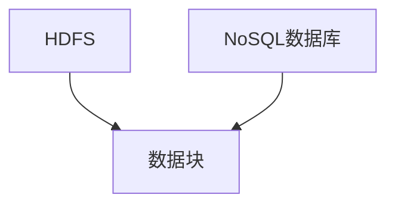

                 

# 大数据架构原理与代码实例讲解

## 关键词

大数据，数据架构，数据存储，数据流处理，分布式系统，NoSQL，SQL，Hadoop，Spark，MapReduce，数据仓库，数据挖掘，机器学习，算法，API，数据湖，数据治理，云计算

## 摘要

本文旨在深入探讨大数据架构的原理，并通过实例代码详细讲解其实际应用。文章首先介绍大数据的背景和基本概念，然后逐步剖析大数据架构的核心概念和联系，包括数据存储、数据流处理和分布式系统等。接下来，文章将重点介绍大数据的核心算法原理和具体操作步骤，并运用数学模型和公式进行详细讲解。此外，文章还将分享一个实际项目中的代码案例，对其进行解读和分析。最后，文章将探讨大数据在实际应用场景中的角色，推荐相关的学习资源和开发工具，并总结未来发展趋势与挑战。

## 1. 背景介绍

随着互联网和物联网的快速发展，数据已经成为企业和组织的重要资产。大数据（Big Data）指的是规模巨大、类型繁多的数据集合，这些数据无法通过传统的关系型数据库进行有效存储和处理。大数据具有“4V”特征，即数据量大（Volume）、数据类型多样（Variety）、数据产生速度快（Velocity）和数据价值密度低（Value）。这些特性使得大数据的处理和分析变得极具挑战性。

大数据技术包括数据存储、数据流处理、分布式计算、数据挖掘和机器学习等多个领域。数据存储方面，常用的技术有Hadoop的HDFS（Hadoop Distributed File System）和NoSQL数据库，如MongoDB和Cassandra。数据流处理方面，常用的技术有Spark和Flink等。分布式计算方面，常用的技术有MapReduce和Hadoop YARN（Yet Another Resource Negotiator）等。

## 2. 核心概念与联系

### 数据存储

数据存储是大数据架构的基础。在传统的单机数据库系统中，数据通常存储在单个物理设备上，容易出现性能瓶颈和单点故障。为了解决这些问题，大数据技术采用了分布式存储的方式。

**HDFS（Hadoop Distributed File System）**

HDFS是一个高吞吐量的分布式文件系统，用于存储大数据。它将文件分成多个数据块，默认为128MB，并分布存储在不同的节点上。HDFS具有高可靠性、高扩展性和高性能的特点。

**NoSQL数据库**

NoSQL数据库是一种非关系型数据库，适合处理大规模、非结构化或半结构化的数据。常见的NoSQL数据库有MongoDB、Cassandra和Redis等。

**Mermaid流程图**



### 数据流处理

数据流处理是指在数据产生的同时或之后，对数据进行实时或近实时的处理和分析。数据流处理技术能够处理大规模、高速度的数据流，从而提供实时决策支持。

**Spark**

Spark是一个分布式数据流处理引擎，具有高性能和易用性。它支持批处理和流处理，可以通过API进行编程。

**Flink**

Flink是一个流处理框架，提供了低延迟、高吞吐量和容错性的特点。它支持事件驱动和批量处理。

**Mermaid流程图**

```mermaid
graph TD
    D[数据源]
    E[Spark]
    F[Fl

