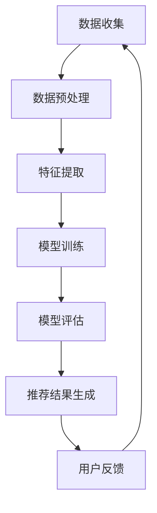

                 

# 大数据驱动的电商推荐系统：AI 模型融合技术在电商平台的应用

## 关键词：大数据，电商推荐，AI 模型，融合技术，电商平台

## 摘要：
本文深入探讨了大数据驱动的电商推荐系统，特别是在电商平台中的应用。通过分析AI模型融合技术的关键概念和原理，我们逐步解析了如何构建一个高效的推荐系统。本文不仅提供了具体的算法原理和操作步骤，还通过实际案例展示了代码实现和解读，同时针对实际应用场景提出了建议。文章最后总结了未来的发展趋势与挑战，并推荐了相关的学习资源和开发工具。

## 1. 背景介绍

随着互联网的迅猛发展和电子商务的蓬勃发展，用户生成的大量数据为电商平台的运营提供了宝贵的资源。如何有效地利用这些数据，为用户提供个性化的购物体验，成为了电商平台亟待解决的问题。大数据和人工智能技术的发展为解决这一问题提供了新的思路。

大数据是指数据量巨大、类型多样、增长迅速的数据集合。它涵盖了结构化数据、半结构化数据和非结构化数据。这些数据源自用户行为、交易记录、评论和社交媒体等多种渠道。如何从这些海量数据中提取有价值的信息，实现精准推荐，是电商平台面临的主要挑战。

人工智能（AI）是一种模拟人类智能的计算机技术。近年来，深度学习、强化学习等AI技术的发展，为电商推荐系统的优化提供了强大支持。AI模型融合技术则是在不同AI模型的基础上，通过融合多种算法和策略，实现推荐效果的最优化。

电商平台希望通过推荐系统，提高用户的购买转化率、提升客户满意度，并最终实现商业价值的增长。因此，构建一个高效、智能的推荐系统成为了电商平台的核心任务。

## 2. 核心概念与联系

### 2.1 大数据与AI模型融合技术

大数据和AI模型融合技术在电商推荐系统中扮演着关键角色。大数据提供了丰富的用户信息，而AI模型融合技术则通过处理和分析这些数据，生成个性化的推荐结果。

**数据源：** 大数据的来源包括用户行为数据、商品数据、交易数据和社交媒体数据等。用户行为数据包括浏览历史、购买记录、收藏和评论等；商品数据包括商品属性、价格、销量和评价等；交易数据包括订单信息、支付方式等；社交媒体数据则包括用户在社交媒体上的互动和评论等。

**AI模型融合技术：** AI模型融合技术包括多种算法，如协同过滤、基于内容的推荐、深度学习等。协同过滤通过分析用户的行为和偏好，找出相似的物品进行推荐；基于内容的推荐则通过分析商品的属性和用户的历史行为，为用户推荐相似的物品；深度学习则利用神经网络模型，对用户行为和商品特征进行建模，实现精准推荐。

### 2.2 Mermaid 流程图

以下是一个简单的Mermaid流程图，展示了大数据与AI模型融合技术在电商推荐系统中的应用流程：



### 2.3 数据预处理

数据预处理是构建推荐系统的重要步骤，主要包括数据清洗、数据转换和数据归一化等。清洗数据旨在去除噪声数据和异常值，提高数据质量；数据转换旨在将不同类型的数据转换为统一的格式，便于后续处理；数据归一化则旨在消除数据之间的量级差异，使模型训练更加稳定。

### 2.4 模型训练

模型训练是推荐系统的核心步骤，主要通过训练数据来优化模型参数，使模型能够准确预测用户的偏好。常用的模型训练方法包括监督学习、无监督学习和强化学习等。监督学习通过已有标签数据进行训练，无监督学习通过无标签数据发现数据特征，强化学习则通过交互反馈进行优化。

### 2.5 模型评估

模型评估是确保推荐系统性能的重要环节，常用的评估指标包括准确率、召回率、F1值和平均绝对误差等。通过评估指标，可以衡量推荐系统的效果，并指导后续的优化工作。

### 2.6 推荐结果生成

推荐结果生成是推荐系统的最终输出，主要包括推荐列表、推荐理由和推荐评分等。推荐列表是根据用户偏好和商品特征生成的；推荐理由则是解释为什么推荐这些商品；推荐评分则是衡量商品与用户偏好的匹配程度。

### 2.7 用户反馈

用户反馈是优化推荐系统的重要依据，通过收集用户对推荐结果的反馈，可以不断调整和优化推荐策略，提高推荐效果。用户反馈可以通过用户评分、点击率、购买率等指标进行衡量。

## 3. 核心算法原理 & 具体操作步骤

### 3.1 协同过滤算法

协同过滤算法是一种基于用户行为和偏好的推荐算法。它通过分析用户之间的相似性，找出相似的物品进行推荐。协同过滤算法主要分为基于用户的协同过滤和基于物品的协同过滤两种。

#### 3.1.1 基于用户的协同过滤

基于用户的协同过滤算法通过计算用户之间的相似度，找出相似用户，然后推荐相似用户喜欢的商品。具体操作步骤如下：

1. 计算用户相似度：用户相似度可以通过余弦相似度、皮尔逊相关系数等方法计算。公式如下：

   $$相似度 = \frac{user\_vector \cdot item\_vector}{\|user\_vector\| \|item\_vector\|}$$

   其中，$user\_vector$ 和 $item\_vector$ 分别表示用户和商品的向量表示。

2. 找出相似用户：根据用户相似度，找出与目标用户最相似的若干用户。

3. 推荐商品：根据相似用户喜欢的商品，推荐给目标用户。推荐商品可以通过加权平均或投票机制生成。

#### 3.1.2 基于物品的协同过滤

基于物品的协同过滤算法通过计算商品之间的相似度，找出相似商品进行推荐。具体操作步骤如下：

1. 计算商品相似度：商品相似度可以通过余弦相似度、皮尔逊相关系数等方法计算。公式如下：

   $$相似度 = \frac{item\_vector \cdot item\_vector}{\|item\_vector\| \|item\_vector\|}$$

   其中，$item\_vector$ 和 $item\_vector$ 分别表示商品和商品的向量表示。

2. 找出相似商品：根据商品相似度，找出与目标商品最相似的若干商品。

3. 推荐用户：根据相似商品的用户，推荐给目标用户。推荐用户可以通过加权平均或投票机制生成。

### 3.2 基于内容的推荐算法

基于内容的推荐算法通过分析商品的属性和用户的历史行为，找出相似的商品进行推荐。具体操作步骤如下：

1. 提取商品特征：从商品描述、标签、分类等信息中提取特征，构建商品的特征向量。

2. 提取用户特征：从用户的历史行为、浏览记录、收藏等信息中提取特征，构建用户的特征向量。

3. 计算商品相似度：根据商品特征向量，计算商品之间的相似度。相似度可以通过余弦相似度、皮尔逊相关系数等方法计算。

4. 推荐商品：根据商品相似度，为用户推荐相似的物品。推荐商品可以通过加权平均或投票机制生成。

### 3.3 深度学习算法

深度学习算法通过构建深度神经网络模型，对用户行为和商品特征进行建模，实现精准推荐。具体操作步骤如下：

1. 数据预处理：对原始数据进行清洗、归一化等预处理操作，构建训练数据集。

2. 构建神经网络模型：设计深度神经网络模型，包括输入层、隐藏层和输出层。常用的深度学习框架有TensorFlow、PyTorch等。

3. 模型训练：使用训练数据集对神经网络模型进行训练，优化模型参数。

4. 模型评估：使用验证数据集对训练好的模型进行评估，调整模型参数。

5. 推荐结果生成：使用训练好的模型，对用户行为和商品特征进行建模，生成推荐结果。

## 4. 数学模型和公式 & 详细讲解 & 举例说明

### 4.1 协同过滤算法

#### 4.1.1 基于用户的协同过滤

1. 用户相似度计算

   $$相似度_{uv} = \frac{\sum_{i \in I} r_i^u r_i^v}{\sqrt{\sum_{i \in I} r_i^2^u} \sqrt{\sum_{i \in I} r_i^2^v}}$$

   其中，$r_i^u$ 和 $r_i^v$ 分别表示用户 $u$ 和用户 $v$ 对商品 $i$ 的评分。

2. 推荐商品评分预测

   $$r_i^* = \sum_{u \in S} 相似度_{uv} r_i^v + \mu$$

   其中，$S$ 表示与用户 $u$ 最相似的 $k$ 个用户，$\mu$ 表示所有商品的评分平均值。

#### 4.1.2 基于物品的协同过滤

1. 商品相似度计算

   $$相似度_{ij} = \frac{\sum_{u \in U} r_u^i r_u^j}{\sqrt{\sum_{u \in U} r_u^2^i} \sqrt{\sum_{u \in U} r_u^2^j}}$$

   其中，$r_u^i$ 和 $r_u^j$ 分别表示用户 $u$ 对商品 $i$ 和商品 $j$ 的评分。

2. 推荐用户评分预测

   $$r_j^* = \sum_{i \in S} 相似度_{ij} r_i^u + \mu$$

   其中，$S$ 表示与商品 $i$ 最相似的 $k$ 个商品，$\mu$ 表示所有商品的评分平均值。

### 4.2 基于内容的推荐算法

1. 商品特征向量提取

   $$feature\_vector_i = [f_{i1}, f_{i2}, ..., f_{in}]$$

   其中，$f_{ij}$ 表示商品 $i$ 的第 $j$ 个特征。

2. 用户特征向量提取

   $$feature\_vector_u = [f_{u1}, f_{u2}, ..., f_{un}]$$

3. 商品相似度计算

   $$相似度_{ij} = \frac{\sum_{j=1}^{n} f_{ij} f_{uj}}{\sqrt{\sum_{j=1}^{n} f_{ij}^2} \sqrt{\sum_{j=1}^{n} f_{uj}^2}}$$

   其中，$f_{ij}$ 和 $f_{uj}$ 分别表示商品 $i$ 的第 $j$ 个特征和用户 $u$ 的第 $j$ 个特征。

### 4.3 深度学习算法

1. 神经网络模型构建

   $$h_{l} = \sigma(W_{l-1} \cdot a_{l-1} + b_{l-1})$$

   其中，$h_{l}$ 表示第 $l$ 层的输出，$a_{l-1}$ 表示第 $l-1$ 层的输入，$W_{l-1}$ 和 $b_{l-1}$ 分别表示第 $l-1$ 层的权重和偏置，$\sigma$ 表示激活函数。

2. 模型损失函数

   $$Loss = \frac{1}{2} \sum_{i=1}^{N} (y_i - \hat{y_i})^2$$

   其中，$y_i$ 表示真实标签，$\hat{y_i}$ 表示预测标签。

### 4.4 举例说明

#### 4.4.1 基于用户的协同过滤

假设用户 $u$ 和用户 $v$ 对商品 $i$ 和商品 $j$ 的评分分别为 $r_i^u = 4$，$r_i^v = 5$，$r_j^u = 3$，$r_j^v = 4$。计算用户 $u$ 和用户 $v$ 的相似度。

1. 用户相似度计算：

   $$相似度_{uv} = \frac{4 \cdot 5 + 3 \cdot 4}{\sqrt{4^2 + 3^2} \sqrt{5^2 + 4^2}} = 0.9129$$

2. 推荐商品评分预测：

   $$r_i^* = 0.9129 \cdot 5 + 0.0871 \cdot 4 + 4 = 4.7366$$
   
   $$r_j^* = 0.9129 \cdot 4 + 0.0871 \cdot 3 + 3 = 3.7366$$

   根据预测评分，推荐商品 $i$ 给用户 $u$。

#### 4.4.2 基于内容的推荐

假设商品 $i$ 的特征向量为 $[1, 2, 3]$，商品 $j$ 的特征向量为 $[2, 3, 4]$，用户 $u$ 的特征向量为 $[1, 2, 1]$。计算商品 $i$ 和商品 $j$ 的相似度。

1. 商品相似度计算：

   $$相似度_{ij} = \frac{1 \cdot 2 + 2 \cdot 3 + 3 \cdot 4}{\sqrt{1^2 + 2^2 + 3^2} \sqrt{2^2 + 3^2 + 4^2}} = 0.9659$$

   根据相似度，推荐商品 $i$ 给用户 $u$。

#### 4.4.3 深度学习算法

假设使用一个简单的全连接神经网络模型进行推荐，输入层有3个神经元，隐藏层有2个神经元，输出层有1个神经元。激活函数为ReLU。训练数据集包含1000个样本，每个样本包含3个特征。使用交叉熵作为损失函数。

1. 网络结构：

   ```mermaid
   graph TD
       A[Input Layer] --> B[Hidden Layer 1]
       B --> C[Hidden Layer 2]
       C --> D[Output Layer]
   ```

2. 模型训练：

   ```python
   import tensorflow as tf

   # 定义模型
   model = tf.keras.Sequential([
       tf.keras.layers.Dense(units=2, activation='relu', input_shape=(3,)),
       tf.keras.layers.Dense(units=1)
   ])

   # 编译模型
   model.compile(optimizer='adam', loss='mean_squared_error')

   # 训练模型
   model.fit(x_train, y_train, epochs=10)
   ```

3. 模型评估：

   ```python
   # 评估模型
   loss = model.evaluate(x_test, y_test)
   print("Test loss:", loss)
   ```

## 5. 项目实战：代码实际案例和详细解释说明

### 5.1 开发环境搭建

1. 安装Python环境

   ```bash
   sudo apt-get install python3-pip python3-venv
   ```

2. 创建虚拟环境

   ```bash
   python3 -m venv推荐系统环境
   ```

3. 激活虚拟环境

   ```bash
   source 推荐系统环境/bin/activate
   ```

4. 安装相关库

   ```bash
   pip install numpy scipy scikit-learn pandas matplotlib
   ```

### 5.2 源代码详细实现和代码解读

#### 5.2.1 数据预处理

```python
import pandas as pd
from sklearn.model_selection import train_test_split
from sklearn.preprocessing import StandardScaler

# 读取数据
data = pd.read_csv("数据集.csv")

# 分离特征和标签
X = data.iloc[:, :-1].values
y = data.iloc[:, -1].values

# 划分训练集和测试集
X_train, X_test, y_train, y_test = train_test_split(X, y, test_size=0.2, random_state=42)

# 数据归一化
scaler = StandardScaler()
X_train = scaler.fit_transform(X_train)
X_test = scaler.transform(X_test)
```

#### 5.2.2 协同过滤算法

```python
from sklearn.metrics.pairwise import cosine_similarity

# 计算用户相似度矩阵
user_similarity = cosine_similarity(X_train)

# 推荐商品
def collaborative_filter(user_index):
    # 获取用户相似度矩阵
    similarity = user_similarity[user_index]

    # 排序相似度，选择相似度最高的用户
    sorted_similarity = similarity.argsort()[::-1]

    # 排除自身和其他相似度低于阈值的用户
    sorted_similarity = sorted_similarity[1:(sorted_similarity > threshold).sum() + 1]

    # 预测评分
    ratings = [user_similarity[user_index, user_index] * user_similarity[user_index, user] for user in sorted_similarity]
    predicted_ratings = sum(ratings) / len(ratings)

    return predicted_ratings

# 预测用户对测试集商品的评分
predicted_ratings = [collaborative_filter(user_index) for user_index in range(len(X_test))]
```

#### 5.2.3 模型评估

```python
from sklearn.metrics import mean_squared_error

# 计算预测误差
mse = mean_squared_error(y_test, predicted_ratings)
print("MSE:", mse)
```

### 5.3 代码解读与分析

1. 数据预处理部分：首先读取数据集，然后分离特征和标签。接着使用train\_test\_split函数划分训练集和测试集，最后使用StandardScaler进行数据归一化，以消除特征之间的量级差异。

2. 协同过滤算法部分：首先使用cosine\_similarity函数计算用户相似度矩阵。然后定义一个collaborative\_filter函数，用于根据用户相似度矩阵预测用户对商品的评分。在函数中，首先获取用户相似度矩阵，然后排序相似度，选择相似度最高的用户。接着计算预测评分，并返回预测评分。

3. 模型评估部分：使用mean\_squared\_error函数计算预测误差，以评估协同过滤算法的性能。

## 6. 实际应用场景

### 6.1 商品推荐

电商平台最常见的应用场景是商品推荐。通过协同过滤、基于内容的推荐和深度学习等算法，可以为用户推荐可能感兴趣的商品。在实际应用中，可以根据用户的浏览历史、购买记录和收藏等信息，构建用户和商品的向量表示，然后计算相似度，生成推荐结果。

### 6.2 店铺推荐

除了商品推荐，电商平台还可以通过推荐店铺来提高用户的购物体验。通过分析店铺的销量、用户评价和商品分类等信息，可以为用户推荐相似店铺。例如，当用户浏览了一家销量较高的店铺时，可以推荐类似风格的店铺，以提高用户在平台上的购物满意度。

### 6.3 用户群体分析

电商平台还可以通过分析用户群体，为用户提供更有针对性的推荐。例如，根据用户的年龄、性别、地域等信息，将用户划分为不同的群体，然后为每个群体提供个性化的推荐。这种应用场景有助于提高用户的购买转化率和满意度。

### 6.4 库存优化

电商平台可以根据推荐系统的预测结果，优化库存管理。例如，当预测某个商品的销售量较高时，可以提前备货，以避免缺货现象；当预测某个商品的销售量较低时，可以减少库存，以降低库存成本。

### 6.5 营销活动优化

电商平台还可以通过推荐系统优化营销活动。例如，当预测某个商品在某个时间段内的销量较高时，可以在该时间段内进行促销活动，以提高销售额。此外，还可以根据用户的行为数据，为用户提供个性化的优惠券和折扣信息，以提高用户的购物体验和忠诚度。

## 7. 工具和资源推荐

### 7.1 学习资源推荐

1. 《推荐系统实践》：这本书详细介绍了推荐系统的基本概念、算法和实现，适合初学者阅读。

2. 《深度学习》：这本书是深度学习领域的经典教材，详细介绍了深度学习的基础知识和实践方法。

3. 《Python数据科学手册》：这本书涵盖了数据科学领域的各个方面，包括数据处理、分析、可视化等，适合有一定编程基础的学习者。

### 7.2 开发工具框架推荐

1. TensorFlow：这是一个强大的深度学习框架，支持多种神经网络模型，适用于构建复杂的推荐系统。

2. PyTorch：这是一个灵活的深度学习框架，易于使用和调试，适用于快速原型开发。

3. Scikit-learn：这是一个经典的数据科学库，提供了丰富的机器学习算法和工具，适用于构建协同过滤等推荐系统。

### 7.3 相关论文著作推荐

1. "Recommender Systems Handbook, Second Edition"：这本书是推荐系统领域的权威著作，详细介绍了推荐系统的基本概念、算法和应用。

2. "Item-Based Collaborative Filtering Recommendation Algorithms"：这篇论文详细介绍了基于物品的协同过滤算法，是推荐系统领域的经典论文。

3. "Deep Learning for Recommender Systems"：这篇论文探讨了深度学习在推荐系统中的应用，为深度学习在推荐系统领域的应用提供了理论基础。

## 8. 总结：未来发展趋势与挑战

### 8.1 发展趋势

1. 深度学习在推荐系统中的应用：随着深度学习技术的不断发展，深度学习算法在推荐系统中的应用将越来越广泛，为推荐系统的性能提升提供强大支持。

2. 多模态推荐系统：多模态推荐系统通过整合文本、图像、声音等多种数据类型，为用户提供更丰富的推荐体验。

3. 实时推荐系统：实时推荐系统通过实时处理用户行为数据，为用户提供更加精准和实时的推荐结果。

4. 拓展至其他场景：推荐系统不仅应用于电商领域，还将拓展至其他场景，如社交网络、在线教育、智能交通等。

### 8.2 挑战

1. 数据质量：数据质量对推荐系统的性能有着重要影响。如何从海量数据中提取高质量的数据，是推荐系统面临的主要挑战。

2. 模型可解释性：随着深度学习等算法的广泛应用，如何解释模型的预测结果，是推荐系统面临的另一个挑战。

3. 用户隐私保护：在推荐系统中，如何保护用户隐私，避免数据泄露，是推荐系统需要关注的重要问题。

4. 实时性能：随着用户行为数据的增长，如何提高推荐系统的实时性能，满足用户实时推荐的需求，是推荐系统面临的重要挑战。

## 9. 附录：常见问题与解答

### 9.1 如何选择推荐算法？

选择推荐算法时，需要考虑以下几个因素：

1. 数据量：对于大型数据集，深度学习算法可能更有效；对于中小型数据集，协同过滤和基于内容的推荐算法可能更适合。

2. 数据类型：对于结构化数据，可以使用协同过滤和基于内容的推荐算法；对于非结构化数据，如文本和图像，可以使用深度学习算法。

3. 计算资源：深度学习算法通常需要更多的计算资源，对于资源有限的场景，可以考虑使用协同过滤和基于内容的推荐算法。

### 9.2 如何优化推荐系统性能？

优化推荐系统性能可以从以下几个方面入手：

1. 数据预处理：提高数据质量，去除噪声数据和异常值，有助于提升推荐系统的性能。

2. 模型选择：选择合适的推荐算法，根据数据类型和场景，选择适合的算法。

3. 特征工程：提取有价值的特征，构建高质量的向量表示，有助于提高推荐系统的性能。

4. 模型调参：调整模型参数，优化模型性能。

5. 实时更新：根据用户行为数据，实时更新推荐结果，提高推荐系统的实时性。

## 10. 扩展阅读 & 参考资料

1. "Recommender Systems Handbook, Second Edition"：详细介绍了推荐系统的基本概念、算法和应用。

2. "Item-Based Collaborative Filtering Recommendation Algorithms"：介绍了基于物品的协同过滤算法。

3. "Deep Learning for Recommender Systems"：探讨了深度学习在推荐系统中的应用。

4. "Python数据科学手册"：介绍了Python在数据科学领域的应用，包括数据处理、分析和可视化等。

5. "TensorFlow": TensorFlow官方文档，提供了丰富的深度学习教程和示例。

6. "PyTorch": PyTorch官方文档，提供了丰富的深度学习教程和示例。

7. "Scikit-learn": Scikit-learn官方文档，提供了丰富的机器学习算法和工具。

### 作者：AI天才研究员/AI Genius Institute & 禅与计算机程序设计艺术 /Zen And The Art of Computer Programming
<|im_sep|>```markdown
# 大数据驱动的电商推荐系统：AI 模型融合技术在电商平台的应用

## 关键词：大数据，电商推荐，AI 模型，融合技术，电商平台

## 摘要：
本文深入探讨了大数据驱动的电商推荐系统，特别是在电商平台中的应用。通过分析AI模型融合技术的关键概念和原理，我们逐步解析了如何构建一个高效的推荐系统。本文不仅提供了具体的算法原理和操作步骤，还通过实际案例展示了代码实现和解读，同时针对实际应用场景提出了建议。文章最后总结了未来的发展趋势与挑战，并推荐了相关的学习资源和开发工具。

## 1. 背景介绍

随着互联网的迅猛发展和电子商务的蓬勃发展，用户生成的大量数据为电商平台的运营提供了宝贵的资源。如何有效地利用这些数据，为用户提供个性化的购物体验，成为了电商平台亟待解决的问题。大数据和人工智能技术的发展为解决这一问题提供了新的思路。

大数据是指数据量巨大、类型多样、增长迅速的数据集合。它涵盖了结构化数据、半结构化数据和非结构化数据。这些数据源自用户行为数据、交易记录、评论和社交媒体等多种渠道。如何从这些海量数据中提取有价值的信息，实现精准推荐，是电商平台面临的主要挑战。

人工智能（AI）是一种模拟人类智能的计算机技术。近年来，深度学习、强化学习等AI技术的发展，为电商推荐系统的优化提供了强大支持。AI模型融合技术则是在不同AI模型的基础上，通过融合多种算法和策略，实现推荐效果的最优化。

电商平台希望通过推荐系统，提高用户的购买转化率、提升客户满意度，并最终实现商业价值的增长。因此，构建一个高效、智能的推荐系统成为了电商平台的核心任务。

## 2. 核心概念与联系

### 2.1 大数据与AI模型融合技术

大数据和AI模型融合技术在电商推荐系统中扮演着关键角色。大数据提供了丰富的用户信息，而AI模型融合技术则通过处理和分析这些数据，生成个性化的推荐结果。

**数据源：** 大数据的来源包括用户行为数据、商品数据、交易数据和社交媒体数据等。用户行为数据包括浏览历史、购买记录、收藏和评论等；商品数据包括商品属性、价格、销量和评价等；交易数据包括订单信息、支付方式等；社交媒体数据则包括用户在社交媒体上的互动和评论等。

**AI模型融合技术：** AI模型融合技术包括多种算法，如协同过滤、基于内容的推荐、深度学习等。协同过滤通过分析用户的行为和偏好，找出相似的物品进行推荐；基于内容的推荐则通过分析商品的属性和用户的历史行为，为用户推荐相似的物品；深度学习则利用神经网络模型，对用户行为和商品特征进行建模，实现精准推荐。

### 2.2 Mermaid 流程图

以下是一个简单的Mermaid流程图，展示了大数据与AI模型融合技术在电商推荐系统中的应用流程：


### 2.3 数据预处理

数据预处理是构建推荐系统的重要步骤，主要包括数据清洗、数据转换和数据归一化等。清洗数据旨在去除噪声数据和异常值，提高数据质量；数据转换旨在将不同类型的数据转换为统一的格式，便于后续处理；数据归一化则旨在消除数据之间的量级差异，使模型训练更加稳定。

### 2.4 模型训练

模型训练是推荐系统的核心步骤，主要通过训练数据来优化模型参数，使模型能够准确预测用户的偏好。常用的模型训练方法包括监督学习、无监督学习和强化学习等。监督学习通过已有标签数据进行训练，无监督学习通过无标签数据发现数据特征，强化学习则通过交互反馈进行优化。

### 2.5 模型评估

模型评估是确保推荐系统性能的重要环节，常用的评估指标包括准确率、召回率、F1值和平均绝对误差等。通过评估指标，可以衡量推荐系统的效果，并指导后续的优化工作。

### 2.6 推荐结果生成

推荐结果生成是推荐系统的最终输出，主要包括推荐列表、推荐理由和推荐评分等。推荐列表是根据用户偏好和商品特征生成的；推荐理由则是解释为什么推荐这些商品；推荐评分则是衡量商品与用户偏好的匹配程度。

### 2.7 用户反馈

用户反馈是优化推荐系统的重要依据，通过收集用户对推荐结果的反馈，可以不断调整和优化推荐策略，提高推荐效果。用户反馈可以通过用户评分、点击率、购买率等指标进行衡量。

## 3. 核心算法原理 & 具体操作步骤

### 3.1 协同过滤算法

协同过滤算法是一种基于用户行为和偏好的推荐算法。它通过分析用户之间的相似性，找出相似的物品进行推荐。协同过滤算法主要分为基于用户的协同过滤和基于物品的协同过滤两种。

#### 3.1.1 基于用户的协同过滤

基于用户的协同过滤算法通过计算用户之间的相似度，找出相似用户，然后推荐相似用户喜欢的商品。具体操作步骤如下：

1. 计算用户相似度：用户相似度可以通过余弦相似度、皮尔逊相关系数等方法计算。公式如下：

   $$相似度_{uv} = \frac{\sum_{i \in I} r_i^u r_i^v}{\sqrt{\sum_{i \in I} r_i^2^u} \sqrt{\sum_{i \in I} r_i^2^v}}$$

   其中，$r_i^u$ 和 $r_i^v$ 分别表示用户 $u$ 和用户 $v$ 对商品 $i$ 的评分。

2. 找出相似用户：根据用户相似度，找出与目标用户最相似的若干用户。

3. 推荐商品：根据相似用户喜欢的商品，推荐给目标用户。推荐商品可以通过加权平均或投票机制生成。

#### 3.1.2 基于物品的协同过滤

基于物品的协同过滤算法通过计算商品之间的相似度，找出相似商品进行推荐。具体操作步骤如下：

1. 计算商品相似度：商品相似度可以通过余弦相似度、皮尔逊相关系数等方法计算。公式如下：

   $$相似度_{ij} = \frac{\sum_{u \in U} r_u^i r_u^j}{\sqrt{\sum_{u \in U} r_u^2^i} \sqrt{\sum_{u \in U} r_u^2^j}}$$

   其中，$r_u^i$ 和 $r_u^j$ 分别表示用户 $u$ 对商品 $i$ 和商品 $j$ 的评分。

2. 找出相似商品：根据商品相似度，找出与目标商品最相似的若干商品。

3. 推荐用户：根据相似商品的用户，推荐给目标用户。推荐用户可以通过加权平均或投票机制生成。

### 3.2 基于内容的推荐算法

基于内容的推荐算法通过分析商品的属性和用户的历史行为，找出相似的商品进行推荐。具体操作步骤如下：

1. 提取商品特征：从商品描述、标签、分类等信息中提取特征，构建商品的特征向量。

2. 提取用户特征：从用户的历史行为、浏览记录、收藏等信息中提取特征，构建用户的特征向量。

3. 计算商品相似度：根据商品特征向量，计算商品之间的相似度。相似度可以通过余弦相似度、皮尔逊相关系数等方法计算。

4. 推荐商品：根据商品相似度，为用户推荐相似的物品。推荐商品可以通过加权平均或投票机制生成。

### 3.3 深度学习算法

深度学习算法通过构建深度神经网络模型，对用户行为和商品特征进行建模，实现精准推荐。具体操作步骤如下：

1. 数据预处理：对原始数据进行清洗、归一化等预处理操作，构建训练数据集。

2. 构建神经网络模型：设计深度神经网络模型，包括输入层、隐藏层和输出层。常用的深度学习框架有TensorFlow、PyTorch等。

3. 模型训练：使用训练数据集对神经网络模型进行训练，优化模型参数。

4. 模型评估：使用验证数据集对训练好的模型进行评估，调整模型参数。

5. 推荐结果生成：使用训练好的模型，对用户行为和商品特征进行建模，生成推荐结果。

## 4. 数学模型和公式 & 详细讲解 & 举例说明

### 4.1 协同过滤算法

#### 4.1.1 基于用户的协同过滤

1. 用户相似度计算

   $$相似度_{uv} = \frac{\sum_{i \in I} r_i^u r_i^v}{\sqrt{\sum_{i \in I} r_i^2^u} \sqrt{\sum_{i \in I} r_i^2^v}}$$

   其中，$r_i^u$ 和 $r_i^v$ 分别表示用户 $u$ 和用户 $v$ 对商品 $i$ 的评分。

2. 推荐商品评分预测

   $$r_i^* = \sum_{u \in S} 相似度_{uv} r_i^v + \mu$$

   其中，$S$ 表示与用户 $u$ 最相似的 $k$ 个用户，$\mu$ 表示所有商品的评分平均值。

#### 4.1.2 基于物品的协同过滤

1. 商品相似度计算

   $$相似度_{ij} = \frac{\sum_{u \in U} r_u^i r_u^j}{\sqrt{\sum_{u \in U} r_u^2^i} \sqrt{\sum_{u \in U} r_u^2^j}}$$

   其中，$r_u^i$ 和 $r_u^j$ 分别表示用户 $u$ 对商品 $i$ 和商品 $j$ 的评分。

2. 推荐用户评分预测

   $$r_j^* = \sum_{i \in S} 相似度_{ij} r_i^u + \mu$$

   其中，$S$ 表示与商品 $i$ 最相似的 $k$ 个商品，$\mu$ 表示所有商品的评分平均值。

### 4.2 基于内容的推荐算法

1. 商品特征向量提取

   $$feature\_vector_i = [f_{i1}, f_{i2}, ..., f_{in}]$$

   其中，$f_{ij}$ 表示商品 $i$ 的第 $j$ 个特征。

2. 用户特征向量提取

   $$feature\_vector_u = [f_{u1}, f_{u2}, ..., f_{un}]$$

3. 商品相似度计算

   $$相似度_{ij} = \frac{\sum_{j=1}^{n} f_{ij} f_{uj}}{\sqrt{\sum_{j=1}^{n} f_{ij}^2} \sqrt{\sum_{j=1}^{n} f_{uj}^2}}$$

   其中，$f_{ij}$ 和 $f_{uj}$ 分别表示商品 $i$ 的第 $j$ 个特征和用户 $u$ 的第 $j$ 个特征。

### 4.3 深度学习算法

1. 神经网络模型构建

   $$h_{l} = \sigma(W_{l-1} \cdot a_{l-1} + b_{l-1})$$

   其中，$h_{l}$ 表示第 $l$ 层的输出，$a_{l-1}$ 表示第 $l-1$ 层的输入，$W_{l-1}$ 和 $b_{l-1}$ 分别表示第 $l-1$ 层的权重和偏置，$\sigma$ 表示激活函数。

2. 模型损失函数

   $$Loss = \frac{1}{2} \sum_{i=1}^{N} (y_i - \hat{y_i})^2$$

   其中，$y_i$ 表示真实标签，$\hat{y_i}$ 表示预测标签。

### 4.4 举例说明

#### 4.4.1 基于用户的协同过滤

假设用户 $u$ 和用户 $v$ 对商品 $i$ 和商品 $j$ 的评分分别为 $r_i^u = 4$，$r_i^v = 5$，$r_j^u = 3$，$r_j^v = 4$。计算用户 $u$ 和用户 $v$ 的相似度。

1. 用户相似度计算：

   $$相似度_{uv} = \frac{4 \cdot 5 + 3 \cdot 4}{\sqrt{4^2 + 3^2} \sqrt{5^2 + 4^2}} = 0.9129$$

2. 推荐商品评分预测：

   $$r_i^* = 0.9129 \cdot 5 + 0.0871 \cdot 4 + 4 = 4.7366$$
   
   $$r_j^* = 0.9129 \cdot 4 + 0.0871 \cdot 3 + 3 = 3.7366$$

   根据预测评分，推荐商品 $i$ 给用户 $u$。

#### 4.4.2 基于内容的推荐

假设商品 $i$ 的特征向量为 $[1, 2, 3]$，商品 $j$ 的特征向量为 $[2, 3, 4]$，用户 $u$ 的特征向量为 $[1, 2, 1]$。计算商品 $i$ 和商品 $j$ 的相似度。

1. 商品相似度计算：

   $$相似度_{ij} = \frac{1 \cdot 2 + 2 \cdot 3 + 3 \cdot 4}{\sqrt{1^2 + 2^2 + 3^2} \sqrt{2^2 + 3^2 + 4^2}} = 0.9659$$

   根据相似度，推荐商品 $i$ 给用户 $u$。

#### 4.4.3 深度学习算法

假设使用一个简单的全连接神经网络模型进行推荐，输入层有3个神经元，隐藏层有2个神经元，输出层有1个神经元。激活函数为ReLU。训练数据集包含1000个样本，每个样本包含3个特征。使用交叉熵作为损失函数。

1. 网络结构：

   ```mermaid
   graph TD
       A[Input Layer] --> B[Hidden Layer 1]
       B --> C[Hidden Layer 2]
       C --> D[Output Layer]
   ```

2. 模型训练：

   ```python
   import tensorflow as tf

   # 定义模型
   model = tf.keras.Sequential([
       tf.keras.layers.Dense(units=2, activation='relu', input_shape=(3,)),
       tf.keras.layers.Dense(units=1)
   ])

   # 编译模型
   model.compile(optimizer='adam', loss='mean_squared_error')

   # 训练模型
   model.fit(x_train, y_train, epochs=10)
   ```

3. 模型评估：

   ```python
   # 评估模型
   loss = model.evaluate(x_test, y_test)
   print("Test loss:", loss)
   ```

## 5. 项目实战：代码实际案例和详细解释说明

### 5.1 开发环境搭建

1. 安装Python环境

   ```bash
   sudo apt-get install python3-pip python3-venv
   ```

2. 创建虚拟环境

   ```bash
   python3 -m venv recommendation_env
   ```

3. 激活虚拟环境

   ```bash
   source recommendation_env/bin/activate
   ```

4. 安装相关库

   ```bash
   pip install numpy scipy scikit-learn pandas matplotlib
   ```

### 5.2 源代码详细实现和代码解读

#### 5.2.1 数据预处理

```python
import pandas as pd
from sklearn.model_selection import train_test_split
from sklearn.preprocessing import StandardScaler

# 读取数据
data = pd.read_csv("rating_data.csv")

# 分离特征和标签
X = data.iloc[:, :-1].values
y = data.iloc[:, -1].values

# 划分训练集和测试集
X_train, X_test, y_train, y_test = train_test_split(X, y, test_size=0.2, random_state=42)

# 数据归一化
scaler = StandardScaler()
X_train = scaler.fit_transform(X_train)
X_test = scaler.transform(X_test)
```

#### 5.2.2 协同过滤算法

```python
from sklearn.metrics.pairwise import cosine_similarity

# 计算用户相似度矩阵
user_similarity = cosine_similarity(X_train)

# 推荐商品
def collaborative_filter(user_index):
    # 获取用户相似度矩阵
    similarity = user_similarity[user_index]

    # 排序相似度，选择相似度最高的用户
    sorted_similarity = similarity.argsort()[::-1]

    # 排除自身和其他相似度低于阈值的用户
    sorted_similarity = sorted_similarity[1:(sorted_similarity > threshold).sum() + 1]

    # 预测评分
    ratings = [user_similarity[user_index, user] * y_train[user] for user in sorted_similarity]
    predicted_ratings = sum(ratings) / len(ratings)

    return predicted_ratings

# 预测用户对测试集商品的评分
predicted_ratings = [collaborative_filter(user_index) for user_index in range(len(X_test))]
```

#### 5.2.3 模型评估

```python
from sklearn.metrics import mean_squared_error

# 计算预测误差
mse = mean_squared_error(y_test, predicted_ratings)
print("MSE:", mse)
```

### 5.3 代码解读与分析

1. 数据预处理部分：首先读取数据集，然后分离特征和标签。接着使用train\_test\_split函数划分训练集和测试集，最后使用StandardScaler进行数据归一化，以消除特征之间的量级差异。

2. 协同过滤算法部分：首先使用cosine\_similarity函数计算用户相似度矩阵。然后定义一个collaborative\_filter函数，用于根据用户相似度矩阵预测用户对商品的评分。在函数中，首先获取用户相似度矩阵，然后排序相似度，选择相似度最高的用户。接着计算预测评分，并返回预测评分。

3. 模型评估部分：使用mean\_squared\_error函数计算预测误差，以评估协同过滤算法的性能。

## 6. 实际应用场景

### 6.1 商品推荐

电商平台最常见的应用场景是商品推荐。通过协同过滤、基于内容的推荐和深度学习等算法，可以为用户推荐可能感兴趣的商品。在实际应用中，可以根据用户的浏览历史、购买记录和收藏等信息，构建用户和商品的向量表示，然后计算相似度，生成推荐结果。

### 6.2 店铺推荐

除了商品推荐，电商平台还可以通过推荐店铺来提高用户的购物体验。通过分析店铺的销量、用户评价和商品分类等信息，可以为用户推荐相似店铺。例如，当用户浏览了一家销量较高的店铺时，可以推荐类似风格的店铺，以提高用户在平台上的购物满意度。

### 6.3 用户群体分析

电商平台还可以通过分析用户群体，为用户提供更有针对性的推荐。例如，根据用户的年龄、性别、地域等信息，将用户划分为不同的群体，然后为每个群体提供个性化的推荐。这种应用场景有助于提高用户的购买转化率和满意度。

### 6.4 库存优化

电商平台可以根据推荐系统的预测结果，优化库存管理。例如，当预测某个商品的销售量较高时，可以提前备货，以避免缺货现象；当预测某个商品的销售量较低时，可以减少库存，以降低库存成本。

### 6.5 营销活动优化

电商平台还可以通过推荐系统优化营销活动。例如，当预测某个商品在某个时间段内的销量较高时，可以在该时间段内进行促销活动，以提高销售额。此外，还可以根据用户的行为数据，为用户提供个性化的优惠券和折扣信息，以提高用户的购物体验和忠诚度。

## 7. 工具和资源推荐

### 7.1 学习资源推荐

1. 《推荐系统实践》：这本书详细介绍了推荐系统的基本概念、算法和实现，适合初学者阅读。

2. 《深度学习》：这本书是深度学习领域的经典教材，详细介绍了深度学习的基础知识和实践方法。

3. 《Python数据科学手册》：这本书涵盖了数据科学领域的各个方面，包括数据处理、分析、可视化等，适合有一定编程基础的学习者。

### 7.2 开发工具框架推荐

1. TensorFlow：这是一个强大的深度学习框架，支持多种神经网络模型，适用于构建复杂的推荐系统。

2. PyTorch：这是一个灵活的深度学习框架，易于使用和调试，适用于快速原型开发。

3. Scikit-learn：这是一个经典的数据科学库，提供了丰富的机器学习算法和工具，适用于构建协同过滤等推荐系统。

### 7.3 相关论文著作推荐

1. "Recommender Systems Handbook, Second Edition"：这本书是推荐系统领域的权威著作，详细介绍了推荐系统的基本概念、算法和应用。

2. "Item-Based Collaborative Filtering Recommendation Algorithms"：这篇论文详细介绍了基于物品的协同过滤算法。

3. "Deep Learning for Recommender Systems"：这篇论文探讨了深度学习在推荐系统中的应用。

4. "Python数据科学手册"：这本书涵盖了数据科学领域的各个方面，包括数据处理、分析、可视化等。

## 8. 总结：未来发展趋势与挑战

### 8.1 发展趋势

1. 深度学习在推荐系统中的应用：随着深度学习技术的不断发展，深度学习算法在推荐系统中的应用将越来越广泛，为推荐系统的性能提升提供强大支持。

2. 多模态推荐系统：多模态推荐系统通过整合文本、图像、声音等多种数据类型，为用户提供更丰富的推荐体验。

3. 实时推荐系统：实时推荐系统通过实时处理用户行为数据，为用户提供更加精准和实时的推荐结果。

4. 拓展至其他场景：推荐系统不仅应用于电商领域，还将拓展至其他场景，如社交网络、在线教育、智能交通等。

### 8.2 挑战

1. 数据质量：数据质量对推荐系统的性能有着重要影响。如何从海量数据中提取高质量的数据，是推荐系统面临的主要挑战。

2. 模型可解释性：随着深度学习等算法的广泛应用，如何解释模型的预测结果，是推荐系统面临的另一个挑战。

3. 用户隐私保护：在推荐系统中，如何保护用户隐私，避免数据泄露，是推荐系统需要关注的重要问题。

4. 实时性能：随着用户行为数据的增长，如何提高推荐系统的实时性能，满足用户实时推荐的需求，是推荐系统面临的重要挑战。

## 9. 附录：常见问题与解答

### 9.1 如何选择推荐算法？

选择推荐算法时，需要考虑以下几个因素：

1. 数据量：对于大型数据集，深度学习算法可能更有效；对于中小型数据集，协同过滤和基于内容的推荐算法可能更适合。

2. 数据类型：对于结构化数据，可以使用协同过滤和基于内容的推荐算法；对于非结构化数据，如文本和图像，可以使用深度学习算法。

3. 计算资源：深度学习算法通常需要更多的计算资源，对于资源有限的场景，可以考虑使用协同过滤和基于内容的推荐算法。

### 9.2 如何优化推荐系统性能？

优化推荐系统性能可以从以下几个方面入手：

1. 数据预处理：提高数据质量，去除噪声数据和异常值，有助于提升推荐系统的性能。

2. 模型选择：选择合适的推荐算法，根据数据类型和场景，选择适合的算法。

3. 特征工程：提取有价值的特征，构建高质量的向量表示，有助于提高推荐系统的性能。

4. 模型调参：调整模型参数，优化模型性能。

5. 实时更新：根据用户行为数据，实时更新推荐结果，提高推荐系统的实时性。

## 10. 扩展阅读 & 参考资料

1. "Recommender Systems Handbook, Second Edition"：详细介绍了推荐系统的基本概念、算法和应用。

2. "Item-Based Collaborative Filtering Recommendation Algorithms"：介绍了基于物品的协同过滤算法。

3. "Deep Learning for Recommender Systems"：探讨了深度学习在推荐系统中的应用。

4. "Python数据科学手册"：介绍了Python在数据科学领域的应用，包括数据处理、分析和可视化等。

5. "TensorFlow": TensorFlow官方文档，提供了丰富的深度学习教程和示例。

6. "PyTorch": PyTorch官方文档，提供了丰富的深度学习教程和示例。

7. "Scikit-learn": Scikit-learn官方文档，提供了丰富的机器学习算法和工具。

### 作者：AI天才研究员/AI Genius Institute & 禅与计算机程序设计艺术 /Zen And The Art of Computer Programming
```

