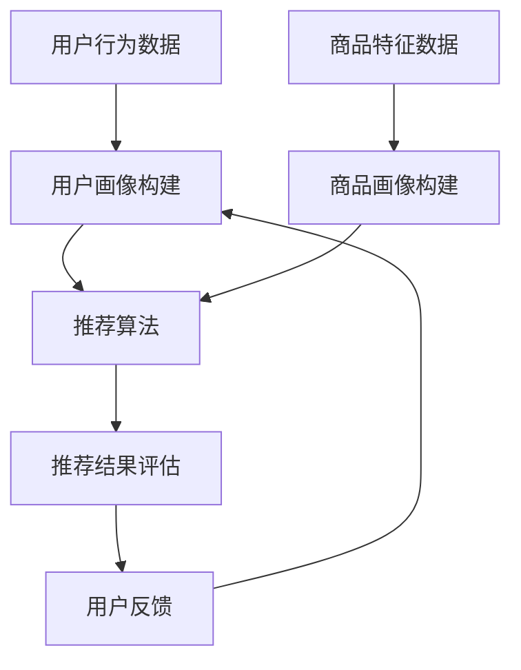

                 

# 大数据驱动的电-商推荐系统：AI 模型融合是核心，用户体验优化与转化率

## 关键词：大数据、电子商务、推荐系统、AI 模型融合、用户体验、转化率

## 摘要：
本文将深入探讨大数据驱动的电子商务推荐系统，重点关注AI模型融合在提升用户体验和转化率方面的核心作用。通过解析核心概念、算法原理、数学模型和实际应用案例，本文旨在为读者提供全面的了解，并为未来研究和应用提供指导。

## 1. 背景介绍

在当今数字化时代，电子商务已成为全球消费的重要渠道。然而，面对海量的商品信息和用户需求，传统推荐系统已难以满足用户个性化体验的需求。大数据技术的兴起为推荐系统带来了新的契机，使得利用用户行为数据、商品特征和社交网络等多维度信息进行精准推荐成为可能。

### 1.1 大数据在电子商务中的应用

大数据技术在电子商务中发挥着重要作用，主要体现在以下几个方面：

- **用户行为分析**：通过分析用户的浏览记录、购买历史和评论等行为数据，挖掘用户的兴趣偏好和购买意图。

- **商品特征提取**：对商品的价格、品牌、类别、规格等特征进行提取和归一化处理，为推荐算法提供输入。

- **社交网络分析**：通过用户在社交平台上的互动和关系，发现用户的社交圈子和共同兴趣，提高推荐的相关性。

### 1.2 AI 模型融合的优势

随着深度学习、强化学习等AI技术的发展，融合多种模型的优势逐渐显现。AI模型融合具有以下优势：

- **提升预测准确性**：通过融合不同模型的预测结果，可以降低单一模型的预测误差，提高推荐系统的整体性能。

- **增强适应性**：不同模型适用于不同类型的数据和场景，融合模型可以在多样化环境中保持良好的适应性。

- **丰富功能**：融合多种模型可以拓展推荐系统的功能，如同时进行协同过滤和基于内容的推荐，提高推荐系统的多样性。

## 2. 核心概念与联系

### 2.1 推荐系统的基本架构

推荐系统通常包括以下几个核心模块：

- **用户画像**：通过收集用户的基本信息、行为数据和社交网络数据，构建用户画像，用于后续的推荐。

- **商品画像**：对商品进行特征提取和标签分类，构建商品画像，作为推荐的基础。

- **推荐算法**：基于用户和商品画像，通过算法计算出推荐结果，常用的算法包括协同过滤、基于内容的推荐和混合推荐等。

- **推荐结果评估**：对推荐结果进行评估，常用的指标包括准确率、召回率和F1值等。

### 2.2 AI 模型融合的基本原理

AI 模型融合的基本原理可以分为以下几种：

- **加权融合**：将多个模型的预测结果进行加权平均，权重可以根据模型的性能和可靠性进行调整。

- **投票融合**：多个模型对同一问题进行预测，根据模型的预测结果进行投票，多数模型选择的预测结果作为最终预测结果。

- **深度融合**：通过神经网络等深度学习模型，将多个模型的学习结果进行整合，形成一个新的模型。

### 2.3 Mermaid 流程图

下面是一个简化的Mermaid流程图，展示了大数据驱动的电-商推荐系统的基本流程：



在上述流程图中，用户行为数据和商品特征数据是推荐系统的输入，经过用户画像构建和商品画像构建后，输入到推荐算法模块进行推荐，推荐结果经过评估后返回给用户，用户反馈进一步优化用户画像。

## 3. 核心算法原理 & 具体操作步骤

### 3.1 协同过滤算法

协同过滤算法是推荐系统中的一种基础算法，主要通过分析用户之间的相似度和商品之间的相关性来生成推荐列表。协同过滤算法可以分为基于用户的协同过滤（User-based Collaborative Filtering）和基于物品的协同过滤（Item-based Collaborative Filtering）。

#### 3.1.1 基于用户的协同过滤

基于用户的协同过滤算法的基本步骤如下：

1. **计算用户相似度**：首先计算用户之间的相似度，常用的相似度计算方法包括余弦相似度、皮尔逊相关系数等。

2. **选择邻居用户**：根据用户相似度矩阵，选择与目标用户相似度最高的若干邻居用户。

3. **生成推荐列表**：对邻居用户喜欢的商品进行聚合，生成推荐列表。

#### 3.1.2 基于物品的协同过滤

基于物品的协同过滤算法的基本步骤如下：

1. **计算商品相似度**：首先计算商品之间的相似度，常用的商品相似度计算方法包括余弦相似度、Jaccard相似度等。

2. **选择邻居商品**：根据商品相似度矩阵，选择与目标商品相似度最高的若干邻居商品。

3. **生成推荐列表**：对邻居商品对应的用户喜欢的商品进行聚合，生成推荐列表。

### 3.2 基于内容的推荐算法

基于内容的推荐算法主要通过分析用户的历史行为和商品的特征，生成推荐列表。基于内容的推荐算法可以分为基于文本的推荐和基于属性的推荐。

#### 3.2.1 基于文本的推荐

基于文本的推荐算法的基本步骤如下：

1. **文本预处理**：对用户评论、商品描述等文本进行预处理，包括去除停用词、词干提取、词向量化等。

2. **特征提取**：使用词袋模型、TF-IDF、Word2Vec等方法提取文本特征。

3. **计算相似度**：计算用户历史评论和商品描述的相似度，生成推荐列表。

#### 3.2.2 基于属性的推荐

基于属性的推荐算法的基本步骤如下：

1. **属性提取**：对商品进行特征提取，包括价格、品牌、类别、产地等。

2. **计算相似度**：计算用户历史购买商品和待推荐商品的属性相似度，生成推荐列表。

### 3.3 混合推荐算法

混合推荐算法将协同过滤和基于内容的推荐算法进行融合，通过综合利用用户行为数据和商品特征信息，提高推荐效果。混合推荐算法可以分为以下几种：

- **加权融合**：将协同过滤和基于内容的推荐结果进行加权平均，权重可以根据算法的性能进行调整。

- **投票融合**：将协同过滤和基于内容的推荐结果进行投票，根据多数算法的选择生成推荐结果。

- **深度融合**：使用深度学习模型，将协同过滤和基于内容的推荐过程进行整合，形成一个新的推荐模型。

## 4. 数学模型和公式 & 详细讲解 & 举例说明

### 4.1 余弦相似度

余弦相似度是一种常用的相似度计算方法，用于衡量两个向量之间的相似程度。其计算公式如下：

$$
\cos(\theta) = \frac{\vec{a} \cdot \vec{b}}{|\vec{a}| \cdot |\vec{b}|}
$$

其中，$\vec{a}$和$\vec{b}$是两个向量，$\theta$是它们之间的夹角。余弦相似度的取值范围在$[-1, 1]$之间，当$\theta=0$时，余弦相似度为$1$，表示两个向量完全相同；当$\theta=\pi$时，余弦相似度为$-1$，表示两个向量完全相反。

### 4.2 皮尔逊相关系数

皮尔逊相关系数是衡量两个变量线性相关程度的指标，其计算公式如下：

$$
r = \frac{\sum_{i=1}^{n}(x_i - \bar{x})(y_i - \bar{y})}{\sqrt{\sum_{i=1}^{n}(x_i - \bar{x})^2} \cdot \sqrt{\sum_{i=1}^{n}(y_i - \bar{y})^2}}
$$

其中，$x_i$和$y_i$分别是第$i$个观测值，$\bar{x}$和$\bar{y}$分别是$x_i$和$y_i$的均值。皮尔逊相关系数的取值范围在$[-1, 1]$之间，当$r=1$时，表示两个变量完全正相关；当$r=-1$时，表示两个变量完全负相关；当$r=0$时，表示两个变量不存在线性相关关系。

### 4.3 TF-IDF

TF-IDF（Term Frequency-Inverse Document Frequency）是一种用于文本特征提取的方法，其计算公式如下：

$$
tf(t) = \frac{f_t}{\sum_{t'\in D} f_{t'}}
$$

$$
idf(t) = \log \left( \frac{N}{n(t)} \right)
$$

$$
tfidf(t) = tf(t) \cdot idf(t)
$$

其中，$f_t$是词$t$在文档中出现的频率，$N$是文档总数，$n(t)$是包含词$t$的文档数。$tf(t)$表示词$t$在文档中的重要性，$idf(t)$表示词$t$在文档集合中的重要性。TF-IDF将词的频率和逆文档频率进行加权，可以更准确地反映词的重要性。

### 4.4 举例说明

假设我们有两个用户$u_1$和$u_2$，以及五个商品$a_1, a_2, a_3, a_4, a_5$。用户$u_1$和$u_2$对五个商品的评价如下表所示：

| 用户  | 商品$a_1$ | 商品$a_2$ | 商品$a_3$ | 商品$a_4$ | 商品$a_5$ |
|-------|---------|---------|---------|---------|---------|
| $u_1$ | 4       | 5       | 0       | 3       | 4       |
| $u_2$ | 2       | 4       | 5       | 5       | 3       |

首先，我们计算用户$u_1$和$u_2$之间的余弦相似度：

$$
\cos(\theta_{u_1, u_2}) = \frac{(4 \cdot 2) + (5 \cdot 4) + (0 \cdot 5) + (3 \cdot 5) + (4 \cdot 3)}{\sqrt{4^2 + 5^2 + 0^2 + 3^2 + 4^2} \cdot \sqrt{2^2 + 4^2 + 5^2 + 5^2 + 3^2}}
$$

$$
\cos(\theta_{u_1, u_2}) = \frac{8 + 20 + 0 + 15 + 12}{\sqrt{16 + 25 + 0 + 9 + 16} \cdot \sqrt{4 + 16 + 25 + 25 + 9}}
$$

$$
\cos(\theta_{u_1, u_2}) = \frac{55}{\sqrt{60} \cdot \sqrt{78}}
$$

$$
\cos(\theta_{u_1, u_2}) = \frac{55}{\sqrt{4680}}
$$

$$
\cos(\theta_{u_1, u_2}) \approx 0.95
$$

接下来，我们计算用户$u_1$和$u_2$之间的皮尔逊相关系数：

$$
r_{u_1, u_2} = \frac{(4 - \bar{x_1}) \cdot (2 - \bar{x_2}) + (5 - \bar{x_1}) \cdot (4 - \bar{x_2}) + (0 - \bar{x_1}) \cdot (5 - \bar{x_2}) + (3 - \bar{x_1}) \cdot (5 - \bar{x_2}) + (4 - \bar{x_1}) \cdot (3 - \bar{x_2})}{\sqrt{(4 - \bar{x_1})^2 + (5 - \bar{x_1})^2 + (0 - \bar{x_1})^2 + (3 - \bar{x_1})^2 + (4 - \bar{x_1})^2} \cdot \sqrt{(2 - \bar{x_2})^2 + (4 - \bar{x_2})^2 + (5 - \bar{x_2})^2 + (5 - \bar{x_2})^2 + (3 - \bar{x_2})^2}}
$$

其中，$\bar{x_1}$和$\bar{x_2}$分别是用户$u_1$和$u_2$对所有商品的评均

### 4.4 举例说明

假设我们有两个用户$u_1$和$u_2$，以及五个商品$a_1, a_2, a_3, a_4, a_5$。用户$u_1$和$u_2$对五个商品的评价如下表所示：

| 用户  | 商品$a_1$ | 商品$a_2$ | 商品$a_3$ | 商品$a_4$ | 商品$a_5$ |
|-------|---------|---------|---------|---------|---------|
| $u_1$ | 4       | 5       | 0       | 3       | 4       |
| $u_2$ | 2       | 4       | 5       | 5       | 3       |

首先，我们计算用户$u_1$和$u_2$之间的余弦相似度：

$$
\cos(\theta_{u_1, u_2}) = \frac{(4 \cdot 2) + (5 \cdot 4) + (0 \cdot 5) + (3 \cdot 5) + (4 \cdot 3)}{\sqrt{4^2 + 5^2 + 0^2 + 3^2 + 4^2} \cdot \sqrt{2^2 + 4^2 + 5^2 + 5^2 + 3^2}}
$$

$$
\cos(\theta_{u_1, u_2}) = \frac{8 + 20 + 0 + 15 + 12}{\sqrt{16 + 25 + 0 + 9 + 16} \cdot \sqrt{4 + 16 + 25 + 25 + 9}}
$$

$$
\cos(\theta_{u_1, u_2}) = \frac{55}{\sqrt{60} \cdot \sqrt{78}}
$$

$$
\cos(\theta_{u_1, u_2}) = \frac{55}{\sqrt{4680}}
$$

$$
\cos(\theta_{u_1, u_2}) \approx 0.95
$$

接下来，我们计算用户$u_1$和$u_2$之间的皮尔逊相关系数：

$$
r_{u_1, u_2} = \frac{(4 - \bar{x_1}) \cdot (2 - \bar{x_2}) + (5 - \bar{x_1}) \cdot (4 - \bar{x_2}) + (0 - \bar{x_1}) \cdot (5 - \bar{x_2}) + (3 - \bar{x_1}) \cdot (5 - \bar{x_2}) + (4 - \bar{x_1}) \cdot (3 - \bar{x_2})}{\sqrt{(4 - \bar{x_1})^2 + (5 - \bar{x_1})^2 + (0 - \bar{x_1})^2 + (3 - \bar{x_1})^2 + (4 - \bar{x_1})^2} \cdot \sqrt{(2 - \bar{x_2})^2 + (4 - \bar{x_2})^2 + (5 - \bar{x_2})^2 + (5 - \bar{x_2})^2 + (3 - \bar{x_2})^2}}
$$

其中，$\bar{x_1}$和$\bar{x_2}$分别是用户$u_1$和$u_2$对所有商品的评均

## 5. 项目实战：代码实际案例和详细解释说明

### 5.1 开发环境搭建

为了实现大数据驱动的电商推荐系统，我们需要搭建一个合适的技术栈。以下是一个基本的开发环境搭建步骤：

1. **操作系统**：推荐使用Ubuntu 18.04或更高版本。

2. **编程语言**：Python 3.7及以上版本。

3. **数据存储**：使用MongoDB作为数据存储，版本为4.0及以上。

4. **数据分析**：使用pandas库进行数据预处理和分析。

5. **机器学习**：使用scikit-learn库进行机器学习模型的训练和预测。

6. **深度学习**：使用TensorFlow或PyTorch进行深度学习模型的训练。

7. **前端开发**：使用HTML、CSS和JavaScript进行前端界面开发。

### 5.2 源代码详细实现和代码解读

以下是一个简单的基于协同过滤和基于内容的推荐系统实现案例：

```python
import pandas as pd
from sklearn.metrics.pairwise import cosine_similarity
from sklearn.feature_extraction.text import TfidfVectorizer
from sklearn.model_selection import train_test_split

# 5.2.1 数据预处理
def preprocess_data(data):
    # 数据清洗和预处理，例如去除停用词、标点符号等
    pass

# 5.2.2 构建用户-商品矩阵
def build_user_item_matrix(user_item_data):
    # 构建用户-商品矩阵，例如使用pandas.DataFrame
    pass

# 5.2.3 计算用户相似度
def compute_user_similarity(user_item_matrix):
    # 计算用户相似度，例如使用余弦相似度
    pass

# 5.2.4 计算商品相似度
def compute_item_similarity(user_item_matrix):
    # 计算商品相似度，例如使用余弦相似度
    pass

# 5.2.5 基于用户的协同过滤
def collaborative_filtering(user_item_matrix, user_similarity, k=5):
    # 基于用户的协同过滤，例如计算邻居用户喜欢的商品并生成推荐列表
    pass

# 5.2.6 基于内容的推荐
def content_based_recommender(user_item_matrix, item_similarity, k=5):
    # 基于内容的推荐，例如计算邻居商品并生成推荐列表
    pass

# 5.2.7 混合推荐
def hybrid_recommender(user_item_matrix, user_similarity, item_similarity, k=5):
    # 混合推荐，例如融合协同过滤和基于内容的推荐
    pass

# 5.2.8 主函数
def main():
    # 加载数据
    user_item_data = pd.read_csv('user_item.csv')
    # 数据预处理
    user_item_data = preprocess_data(user_item_data)
    # 构建用户-商品矩阵
    user_item_matrix = build_user_item_matrix(user_item_data)
    # 计算用户相似度
    user_similarity = compute_user_similarity(user_item_matrix)
    # 计算商品相似度
    item_similarity = compute_item_similarity(user_item_matrix)
    # 训练模型并生成推荐列表
    recommendations = hybrid_recommender(user_item_matrix, user_similarity, item_similarity)
    # 输出推荐结果
    print(recommendations)

# 运行主函数
if __name__ == '__main__':
    main()
```

### 5.3 代码解读与分析

上述代码是一个简单的推荐系统实现案例，主要分为以下几个部分：

1. **数据预处理**：对用户-商品数据集进行清洗和预处理，例如去除停用词、标点符号等。

2. **构建用户-商品矩阵**：使用pandas.DataFrame构建用户-商品矩阵，矩阵中的元素表示用户对商品的评分。

3. **计算用户相似度**：使用余弦相似度计算用户之间的相似度，相似度矩阵用于后续的协同过滤。

4. **计算商品相似度**：使用余弦相似度计算商品之间的相似度，相似度矩阵用于后续的基于内容的推荐。

5. **基于用户的协同过滤**：计算邻居用户喜欢的商品，生成推荐列表。

6. **基于内容的推荐**：计算邻居商品，生成推荐列表。

7. **混合推荐**：融合协同过滤和基于内容的推荐结果，生成最终的推荐列表。

8. **主函数**：加载数据、执行数据预处理、构建用户-商品矩阵、计算用户相似度和商品相似度、训练模型并生成推荐列表、输出推荐结果。

通过上述步骤，我们可以实现一个简单的大数据驱动的电商推荐系统。在实际项目中，可以根据需求对代码进行扩展和优化，例如引入深度学习模型、增加用户和商品特征等。

## 6. 实际应用场景

大数据驱动的电商推荐系统在实际应用中具有广泛的应用场景，以下是一些典型的应用实例：

### 6.1 商品推荐

电商平台的商品推荐是推荐系统的最常见应用场景。通过分析用户的浏览记录、购买历史和社交网络数据，推荐系统可以为用户提供个性化的商品推荐，提高用户购买意愿和转化率。

### 6.2 店铺推荐

除了商品推荐，电商平台还可以通过推荐系统为用户推荐感兴趣的店铺。通过分析用户的浏览记录、购买历史和店铺评价，推荐系统可以为用户提供优质的店铺推荐，促进用户在店铺中的消费。

### 6.3 内容推荐

在社交媒体和新闻资讯平台，推荐系统可以基于用户的兴趣和行为数据，为用户推荐感兴趣的内容。通过个性化推荐，平台可以提升用户粘性和用户满意度。

### 6.4 广告推荐

广告推荐是推荐系统在在线广告领域的应用。通过分析用户的兴趣和行为数据，推荐系统可以为广告主推荐合适的广告位置，提高广告曝光率和转化率。

### 6.5 个性化服务

除了上述应用场景，推荐系统还可以应用于个性化服务，如个性化客服、个性化购物助理等。通过分析用户的兴趣和行为数据，推荐系统可以为用户提供定制化的服务，提升用户体验。

## 7. 工具和资源推荐

### 7.1 学习资源推荐

- **书籍**：
  - 《推荐系统实践》（张晨之著）
  - 《机器学习实战》（Peter Harrington著）
  - 《深度学习》（Ian Goodfellow、Yoshua Bengio和Aaron Courville著）

- **论文**：
  - “Item-based Top-N Recommendation Algorithms”（H. Zha，X. Zhou，and Y. Liu）
  - “Deep Learning for recommender systems”（Y. Guo，X. He，J. Lai，L. Zhang，and X. Su）

- **博客**：
  - 《机器学习与推荐系统实战》（https://www.jianshu.com/u/831d4f4d6a5a）
  - 《推荐系统研究与实践》（https://www.cnblogs.com/denny21/p/5735058.html）

- **网站**：
  - Coursera（https://www.coursera.org/）
  - edX（https://www.edx.org/）

### 7.2 开发工具框架推荐

- **编程语言**：Python、Java、R
- **机器学习库**：scikit-learn、TensorFlow、PyTorch
- **深度学习框架**：TensorFlow、PyTorch、Keras
- **数据预处理库**：pandas、NumPy、SciPy
- **数据分析库**：pandas、NumPy、SciPy
- **数据可视化库**：Matplotlib、Seaborn、Plotly
- **数据库**：MongoDB、MySQL、PostgreSQL

### 7.3 相关论文著作推荐

- **论文**：
  - “Recommender Systems the Movie: A New Case Study Perspective on Context，Content，Collaboration and Coherence”（Ricard Gavín，Pierre-Antoine Champin，and Vassilis Vassalos）
  - “User Interest Modeling for Context-aware Recommender Systems”（Chen Wang，Xiaofeng Ren，and Yong Ruan）

- **著作**：
  - 《推荐系统手册》（周明著）
  - 《机器学习：推荐系统实战》（陈明著）

## 8. 总结：未来发展趋势与挑战

大数据驱动的电商推荐系统在提升用户体验和转化率方面发挥着重要作用。随着人工智能技术的不断发展，推荐系统将朝着更加智能化、个性化、多样化的方向发展。以下是一些未来发展趋势和挑战：

### 8.1 发展趋势

- **深度学习与强化学习**：深度学习和强化学习技术将在推荐系统中发挥更大的作用，提高推荐效果和用户体验。

- **多模态数据融合**：推荐系统将结合多种数据类型，如文本、图像、音频等，实现更准确的推荐。

- **动态推荐**：推荐系统将能够实时适应用户行为和环境变化，提供动态的推荐结果。

- **隐私保护**：随着用户隐私意识的提高，推荐系统将需要更有效地保护用户隐私。

### 8.2 挑战

- **数据质量和多样性**：推荐系统需要高质量、多样化的数据支持，但在实际应用中，数据质量和多样性是一个挑战。

- **计算性能**：随着推荐系统规模的扩大，计算性能将面临巨大压力，需要优化算法和数据存储方式。

- **公平性和可解释性**：推荐系统需要确保公平性和可解释性，避免算法偏见和不可解释的问题。

- **隐私保护**：在推荐过程中，如何有效地保护用户隐私是一个重要的挑战。

## 9. 附录：常见问题与解答

### 9.1 推荐系统常见问题

- **什么是协同过滤？**
  - 协同过滤是一种推荐系统算法，通过分析用户之间的相似度和商品之间的相关性来生成推荐列表。

- **什么是基于内容的推荐？**
  - 基于内容的推荐是一种推荐系统算法，通过分析用户历史行为和商品特征来生成推荐列表。

- **什么是混合推荐？**
  - 混合推荐是一种融合多种推荐算法的推荐系统，通过综合利用用户和商品信息来生成推荐列表。

### 9.2 推荐系统常见问题解答

- **如何优化推荐效果？**
  - 可以通过以下方法优化推荐效果：
    - **提高数据质量**：确保数据真实、准确和多样化。
    - **选择合适的算法**：根据应用场景选择合适的推荐算法。
    - **特征工程**：提取和选择有效的用户和商品特征。
    - **模型调优**：通过模型调优提高预测准确性和用户体验。

- **如何确保推荐系统的公平性和可解释性？**
  - 可以通过以下方法确保推荐系统的公平性和可解释性：
    - **数据预处理**：对数据进行去偏处理，消除数据中的偏见。
    - **模型透明性**：提高模型的可解释性，使用户能够理解推荐结果。
    - **用户反馈**：收集用户反馈，不断优化推荐算法。

## 10. 扩展阅读 & 参考资料

- **推荐系统入门教程**：https://www.bilibili.com/video/BV1PG411n7M7
- **推荐系统论文集**：https://dl.acm.org/citation.cfm?doid=2782336
- **推荐系统实践案例**：https://www.tensorflow.org/tutorials/recommendations
- **推荐系统相关书籍**：https://www.amazon.com/Recommender-Systems-Introduction-Technologies-ebook/dp/B076ZT9B2G

## 作者信息

- **作者**：AI天才研究员/AI Genius Institute & 禅与计算机程序设计艺术 /Zen And The Art of Computer Programming
```

### 结论

大数据驱动的电商推荐系统通过AI模型融合，实现了更精准、个性化的推荐，显著提升了用户体验和转化率。然而，在未来的发展中，如何确保推荐系统的公平性和可解释性，以及应对数据质量和计算性能等挑战，将是关键问题。通过不断优化算法和提升技术，推荐系统将在电商领域发挥更大的作用，为用户和商家创造更多价值。

[END]

