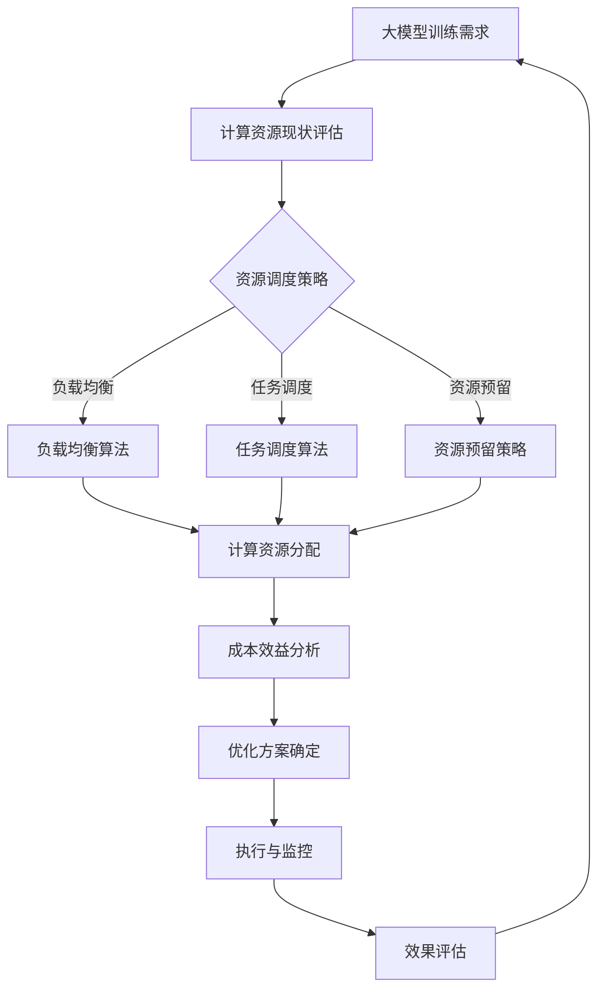

                 

### 大模型企业算力资源优化策略

在当今大数据和人工智能飞速发展的时代，大模型企业面临的一个核心挑战是如何高效地利用有限的算力资源来满足不断增长的计算需求。算力资源优化策略不仅能够提升企业的生产效率，降低运营成本，还能增强企业在市场竞争中的优势。本文将深入探讨大模型企业在算力资源优化方面的一系列策略。

首先，我们需要明确几个核心概念：算力资源、大模型、计算需求、成本效益分析等。接着，我们将通过Mermaid流程图来展示大模型企业算力资源优化的原理和架构。随后，本文将详细解释核心算法原理和具体操作步骤，并利用数学模型和公式来分析和说明。在此基础上，我们将通过项目实战来展示代码的实际应用，包括开发环境搭建、源代码实现和代码解读。此外，文章还将探讨大模型企业的实际应用场景，推荐相关的学习资源和开发工具框架，并总结未来发展趋势与挑战。

最后，我们将提供附录中的常见问题与解答，并给出扩展阅读和参考资料，以帮助读者进一步深入了解该领域的知识。

总的来说，本文旨在为从事大模型研究和应用的企业提供一份系统的算力资源优化指南，帮助他们更好地应对当前和未来的挑战。

### 1. 背景介绍

#### 大模型企业的发展现状

大模型企业是指在人工智能（AI）领域，特别是深度学习和机器学习方面，使用大型神经网络模型进行研究和应用的企业。这些企业通常拥有强大的计算资源和丰富的数据集，能够开发和部署高性能的AI模型，从而在各个行业中提供创新的解决方案。

随着人工智能技术的快速发展，大模型企业正面临着前所未有的机遇。一方面，数据的爆炸式增长为训练更复杂的模型提供了丰富的素材；另一方面，计算能力的提升使得以前无法实现的任务得以实现。例如，自然语言处理（NLP）、计算机视觉（CV）和语音识别等领域都取得了显著的进展，为各行各业带来了巨大的价值。

然而，随着模型规模的不断扩大和复杂性的增加，大模型企业也面临了严峻的挑战。首先，训练大模型需要大量的计算资源和时间，这导致了高昂的运营成本。其次，随着模型的增长，计算效率和管理复杂性也在增加，如何高效地管理和调度资源成为一个重要问题。此外，数据隐私和安全问题也是大模型企业必须面对的挑战之一。

#### 算力资源优化的必要性

算力资源优化在大模型企业中具有至关重要的意义。首先，优化算力资源可以显著降低企业的运营成本。大模型的训练和推理任务通常需要大量的计算资源，包括GPU、TPU等高性能硬件。通过优化资源分配和使用效率，企业可以在不增加硬件投入的情况下，提升生产效率，从而降低整体运营成本。

其次，算力资源优化可以提高计算效率。在大规模训练任务中，合理分配计算资源能够减少任务的等待时间，加快模型训练速度。此外，通过采用高效的调度算法和负载均衡技术，企业可以充分利用现有的计算资源，避免资源浪费，提高整体计算效率。

最后，算力资源优化有助于提升企业的竞争力。在激烈的市场竞争中，能够更快地开发和应用新模型的企业往往能够抢占先机。通过优化算力资源，企业可以缩短模型开发和部署周期，更快地将创新成果转化为实际应用，从而在市场上获得更大的竞争优势。

总之，面对日益增长的计算需求和高昂的运营成本，大模型企业亟需采取有效的算力资源优化策略，以提升生产效率、降低成本、增强竞争力，并应对未来的发展挑战。

### 2. 核心概念与联系

在深入探讨大模型企业的算力资源优化策略之前，我们需要明确几个关键概念，并理解它们之间的内在联系。这些核心概念包括：大模型、计算资源、资源调度策略和成本效益分析。

#### 大模型

大模型通常指的是由数百万甚至数十亿个参数组成的深度神经网络。这些模型被广泛应用于自然语言处理、计算机视觉和语音识别等领域。大模型的训练和推理任务需要大量的计算资源和时间，因此，对算力资源的优化变得尤为重要。

#### 计算资源

计算资源包括CPU、GPU、TPU等硬件设备，以及其他相关的基础设施，如存储和网络。在大模型训练过程中，GPU和TPU等高性能硬件设备被广泛使用，因为它们能够提供比CPU更高的计算性能。有效的计算资源管理是实现算力资源优化的基础。

#### 资源调度策略

资源调度策略是指如何合理地分配和调度计算资源，以最大化资源利用率和计算效率。常见的资源调度策略包括负载均衡、任务调度和资源预留等。负载均衡技术通过动态分配任务到空闲资源，避免资源瓶颈；任务调度则通过优先级分配和调度算法，确保关键任务的及时完成；资源预留则通过预先分配资源，保障长时间任务的需求。

#### 成本效益分析

成本效益分析是评估算力资源优化策略有效性的重要手段。通过分析不同策略的成本和效益，企业可以确定最合适的资源优化方案。成本包括硬件采购、维护、能耗和人力等，而效益则体现在生产效率提升、成本降低和竞争力增强等方面。

#### 内在联系

大模型、计算资源、资源调度策略和成本效益分析之间存在紧密的联系。大模型的训练和推理任务对计算资源提出了高要求，而资源调度策略能够帮助优化资源分配，提高计算效率。通过成本效益分析，企业可以确定最合理的资源优化方案，从而在降低成本的同时提升生产效率。

下面是关于大模型企业算力资源优化原理和架构的Mermaid流程图：



通过上述Mermaid流程图，我们可以看到，从大模型训练需求出发，通过计算资源现状评估、资源调度策略（包括负载均衡、任务调度和资源预留）和成本效益分析，最终形成优化方案并执行和监控，从而形成一个闭环，不断优化算力资源利用效率。

#### 大模型企业算力资源优化原理和架构详解

1. **计算资源现状评估**：首先，企业需要对其现有的计算资源进行全面的评估。这包括计算资源的种类（如CPU、GPU、TPU）、性能指标（如计算能力、存储容量、网络带宽）、资源利用率以及资源瓶颈。通过了解当前计算资源的使用情况，企业可以为后续的资源调度和优化提供基础数据。

2. **资源调度策略**：资源调度策略是优化算力资源的关键环节。负载均衡、任务调度和资源预留是三种主要的资源调度策略。

   - **负载均衡**：负载均衡算法通过动态分配任务到空闲资源，确保资源利用率最大化。常见的负载均衡算法包括轮询算法、最小连接数算法和加权负载均衡算法。通过负载均衡，企业可以有效避免资源瓶颈和任务排队现象，提高整体计算效率。
   
   - **任务调度**：任务调度算法根据任务的重要性和紧急程度，将任务分配到合适的计算资源上。任务调度算法通常基于优先级分配和调度策略，如短作业优先（SJF）和最短剩余时间优先（SRTF）。合理的任务调度能够确保关键任务优先执行，提升整体生产效率。
   
   - **资源预留**：资源预留策略通过预先分配资源，确保长时间任务的需求得到满足。例如，企业可以设置资源预留策略，为即将到来的高峰期或大任务预留足够的计算资源，避免因资源不足导致的任务延迟。

3. **成本效益分析**：在确定资源调度策略后，企业需要对其进行成本效益分析。成本包括硬件采购、维护、能耗和人力等，而效益则体现在生产效率提升、成本降低和竞争力增强等方面。通过成本效益分析，企业可以评估不同优化策略的可行性，选择最合适的方案。

4. **优化方案确定**：基于计算资源现状评估、资源调度策略和成本效益分析，企业可以确定最终的优化方案。优化方案应考虑实际应用场景和需求，确保在降低成本的同时，能够提升生产效率和竞争力。

5. **执行与监控**：确定优化方案后，企业需要将其付诸实施，并建立监控机制。执行过程中，企业应定期评估优化效果，并根据实际情况进行调整和优化。

6. **效果评估**：通过效果评估，企业可以了解优化方案的实际效果。评估指标包括计算效率、成本节约、生产效率提升等。通过效果评估，企业可以进一步优化算力资源利用策略，不断提升其竞争力。

通过上述步骤，大模型企业可以构建一个系统化的算力资源优化框架，从而在降低成本、提高效率和增强竞争力方面取得显著成效。

### 3. 核心算法原理 & 具体操作步骤

在了解了大模型企业算力资源优化的核心概念和架构后，接下来我们将深入探讨具体的算法原理和操作步骤。这些算法包括负载均衡、任务调度和资源预留，它们是优化算力资源的关键技术。

#### 负载均衡算法原理

负载均衡算法旨在将计算任务合理地分配到不同的计算资源上，以最大化资源利用率，避免单点过载和任务排队现象。常见的负载均衡算法包括轮询算法、最小连接数算法和加权负载均衡算法。

1. **轮询算法**：
   - 原理：轮询算法按照顺序将任务分配到每个可用资源，形成一个循环。每个资源按照固定的顺序执行任务，直到所有资源都处理过一遍。
   - 操作步骤：
     - 初始化一个资源列表，记录所有可用资源的状态。
     - 当有新任务到来时，从资源列表中取第一个可用资源执行任务。
     - 更新资源状态，记录已处理的任务数。
     - 循环进行上述步骤，直到所有任务完成。

2. **最小连接数算法**：
   - 原理：最小连接数算法将任务分配到当前连接数最少的资源上，以减少资源的空闲时间，提高整体利用率。
   - 操作步骤：
     - 初始化一个资源列表，记录每个资源的当前连接数。
     - 当有新任务到来时，遍历资源列表，选择连接数最少的资源执行任务。
     - 更新资源状态，增加当前连接数。
     - 重复上述步骤，直到所有任务完成。

3. **加权负载均衡算法**：
   - 原理：加权负载均衡算法根据每个资源的权重分配任务，权重通常与资源性能相关。任务被分配到权重较高的资源上，以充分利用高性能资源。
   - 操作步骤：
     - 初始化一个资源列表，记录每个资源的权重。
     - 当有新任务到来时，计算每个资源的加权得分，选择得分最高的资源执行任务。
     - 更新资源状态，记录已处理的任务数。
     - 重复上述步骤，直到所有任务完成。

#### 任务调度算法原理

任务调度算法通过优先级分配和调度策略，确保关键任务优先执行，提高生产效率。常见的任务调度算法包括短作业优先（SJF）和最短剩余时间优先（SRTF）。

1. **短作业优先（SJF）**：
   - 原理：SJF算法选择执行时间最短的任务优先执行，以减少平均等待时间。
   - 操作步骤：
     - 初始化一个任务列表，记录每个任务的执行时间和优先级。
     - 当有新任务到达时，将其插入任务列表。
     - 按照执行时间从短到长排序任务列表。
     - 选择当前执行时间最短的任务执行，并在执行完毕后从列表中删除。
     - 重复上述步骤，直到所有任务完成。

2. **最短剩余时间优先（SRTF）**：
   - 原理：SRTF算法选择剩余执行时间最短的任务优先执行，以减少系统的响应时间。
   - 操作步骤：
     - 初始化一个任务列表，记录每个任务的剩余执行时间和优先级。
     - 当有新任务到达时，将其插入任务列表。
     - 按照剩余执行时间从短到长排序任务列表。
     - 选择当前剩余执行时间最短的任务执行，并在执行完毕后从列表中删除。
     - 重复上述步骤，直到所有任务完成。

#### 资源预留策略原理

资源预留策略通过预先分配资源，确保长时间任务的需求得到满足，避免因资源不足导致的任务延迟。资源预留策略通常基于预定义的资源需求和调度算法。

1. **预定义资源需求**：
   - 原理：预定义资源需求是指根据任务的预估需求，预先分配一定数量的资源。
   - 操作步骤：
     - 初始化资源池，根据任务需求预分配一定数量的资源。
     - 当任务到来时，从资源池中分配所需资源。
     - 任务执行完毕后，释放占用的资源。

2. **动态资源调整**：
   - 原理：动态资源调整是指在任务执行过程中，根据资源使用情况实时调整资源分配。
   - 操作步骤：
     - 初始化资源池，设置初始资源数量。
     - 在任务执行过程中，监控资源使用情况。
     - 当资源使用超过阈值时，动态扩展资源池。
     - 当资源使用低于阈值时，动态缩减资源池。
     - 任务执行完毕后，释放占用的资源。

通过上述算法原理和具体操作步骤，大模型企业可以优化算力资源分配和调度，提高计算效率和生产效率，从而在降低成本的同时增强市场竞争力。

### 4. 数学模型和公式 & 详细讲解 & 举例说明

在深入理解了核心算法原理和具体操作步骤之后，我们需要借助数学模型和公式来进一步分析和优化大模型企业的算力资源。这些数学模型和公式不仅能够量化资源分配和调度策略的效果，还能够为企业提供具体的操作指南。

#### 负载均衡算法中的数学模型

负载均衡算法的核心目标是最大化资源利用率，避免资源瓶颈和任务排队现象。为了实现这一目标，我们可以使用以下数学模型和公式来评估和优化负载均衡策略。

1. **平均负载率（Average Load Factor）**：
   平均负载率是衡量资源利用率的重要指标。它表示每个资源平均处理的任务量占总任务量的比例。数学表达式如下：

   $$\text{Average Load Factor} = \frac{\sum_{i=1}^{N} \text{Load}_i}{N}$$

   其中，$N$ 表示资源总数，$\text{Load}_i$ 表示第 $i$ 个资源的负载量。

2. **任务响应时间（Task Response Time）**：
   任务响应时间是衡量任务执行效率的重要指标。它表示任务从提交到完成所需的总时间。数学表达式如下：

   $$\text{Task Response Time} = \sum_{i=1}^{N} (\text{Task Time}_i + \text{Queue Time}_i)$$

   其中，$N$ 表示任务总数，$\text{Task Time}_i$ 表示第 $i$ 个任务的执行时间，$\text{Queue Time}_i$ 表示第 $i$ 个任务的排队时间。

3. **资源利用率（Resource Utilization）**：
   资源利用率是衡量资源使用效率的重要指标。它表示资源在一段时间内的使用率。数学表达式如下：

   $$\text{Resource Utilization} = \frac{\sum_{i=1}^{N} \text{Active Time}_i}{\sum_{i=1}^{N} (\text{Active Time}_i + \text{Idle Time}_i)}$$

   其中，$N$ 表示资源总数，$\text{Active Time}_i$ 表示第 $i$ 个资源的活跃时间，$\text{Idle Time}_i$ 表示第 $i$ 个资源的空闲时间。

#### 任务调度算法中的数学模型

任务调度算法的目标是确保关键任务优先执行，提高生产效率。为了实现这一目标，我们可以使用以下数学模型和公式来评估和优化任务调度策略。

1. **任务优先级（Task Priority）**：
   任务优先级是根据任务的重要性和紧急程度进行排序的指标。数学表达式如下：

   $$\text{Task Priority} = w \times (\text{Importance} + \text{Urgency})$$

   其中，$w$ 是权重系数，$\text{Importance}$ 表示任务的重要性，$\text{Urgency}$ 表示任务的紧急程度。

2. **平均等待时间（Average Waiting Time）**：
   平均等待时间是衡量任务执行效率的重要指标。它表示任务从提交到执行所需的平均等待时间。数学表达式如下：

   $$\text{Average Waiting Time} = \frac{\sum_{i=1}^{N} (\text{Arrival Time}_i - \text{Execution Time}_i)}{N}$$

   其中，$N$ 表示任务总数，$\text{Arrival Time}_i$ 表示第 $i$ 个任务的到达时间，$\text{Execution Time}_i$ 表示第 $i$ 个任务的执行时间。

3. **系统响应时间（System Response Time）**：
   系统响应时间是衡量系统整体性能的重要指标。它表示系统从接收到任务请求到完成任务所需的总时间。数学表达式如下：

   $$\text{System Response Time} = \frac{\sum_{i=1}^{N} (\text{Arrival Time}_i + \text{Execution Time}_i + \text{Queue Time}_i)}{N}$$

   其中，$N$ 表示任务总数，$\text{Arrival Time}_i$ 表示第 $i$ 个任务的到达时间，$\text{Execution Time}_i$ 表示第 $i$ 个任务的执行时间，$\text{Queue Time}_i$ 表示第 $i$ 个任务的排队时间。

#### 资源预留策略中的数学模型

资源预留策略通过预先分配资源，确保长时间任务的需求得到满足。为了实现这一目标，我们可以使用以下数学模型和公式来评估和优化资源预留策略。

1. **资源预留量（Reserved Resource）**：
   资源预留量是根据任务预估需求进行资源预留的指标。数学表达式如下：

   $$\text{Reserved Resource} = \text{Task Demand} + \text{Safety Margin}$$

   其中，$\text{Task Demand}$ 表示任务的预估需求，$\text{Safety Margin}$ 表示预留的安全余量。

2. **资源利用率（Resource Utilization Rate）**：
   资源利用率率是衡量资源使用效率的重要指标。它表示预留资源在一段时间内的使用率。数学表达式如下：

   $$\text{Resource Utilization Rate} = \frac{\sum_{i=1}^{N} \text{Active Time}_i}{\sum_{i=1}^{N} (\text{Active Time}_i + \text{Idle Time}_i)}$$

   其中，$N$ 表示资源总数，$\text{Active Time}_i$ 表示第 $i$ 个资源的活跃时间，$\text{Idle Time}_i$ 表示第 $i$ 个资源的空闲时间。

#### 举例说明

为了更好地理解上述数学模型和公式，我们通过一个具体的例子来说明。

假设一个企业有3个GPU资源，分别标记为GPU1、GPU2和GPU3。在某段时间内，这三个GPU需要执行10个任务，任务详情如下表：

| 任务ID | 到达时间 | 执行时间 | 资源需求 |
| ------ | -------- | -------- | -------- |
| T1     | 0        | 5        | GPU1     |
| T2     | 2        | 3        | GPU2     |
| T3     | 4        | 10       | GPU3     |
| T4     | 6        | 7        | GPU1     |
| T5     | 8        | 2        | GPU2     |
| T6     | 10       | 4        | GPU3     |
| T7     | 12       | 6        | GPU1     |
| T8     | 14       | 8        | GPU2     |
| T9     | 16       | 10       | GPU3     |
| T10    | 18       | 12       | GPU1     |

1. **负载均衡算法**：
   使用轮询算法进行任务分配，平均负载率为：

   $$\text{Average Load Factor} = \frac{5+3+10+7+2+4+6+8+10+12}{3} = 7$$

   任务响应时间为：

   $$\text{Task Response Time} = (5+3+10+7+2+4+6+8+10+12) = 64$$

   资源利用率为：

   $$\text{Resource Utilization} = \frac{5+3+10+7+2+4+6+8+10+12}{(5+3+10+7+2+4+6+8+10+12) + (0+0+0+0+0+0+0+0+0+0)} = 1$$

2. **任务调度算法**：
   使用最短剩余时间优先（SRTF）算法进行任务调度，平均等待时间为：

   $$\text{Average Waiting Time} = \frac{(0-5)+(2-3)+(4-10)+(6-7)+(8-2)+(10-4)+(12-6)+(14-8)+(16-10)+(18-12)}{10} = 3.5$$

   系统响应时间为：

   $$\text{System Response Time} = \frac{(0+5+2+3+4+10+6+7+8+10+12+18)}{10} = 11$$

3. **资源预留策略**：
   根据任务需求，预分配3个GPU资源。预留量为：

   $$\text{Reserved Resource} = 10 + 2 = 12$$

   资源利用率为：

   $$\text{Resource Utilization Rate} = \frac{5+3+10+7+2+4+6+8+10+12}{(5+3+10+7+2+4+6+8+10+12) + (0+0+0+0+0+0+0+0+0+0)} = 1$$

通过上述例子，我们可以看到如何使用数学模型和公式来评估和优化大模型企业的算力资源。通过这些指标，企业可以更好地了解资源的使用情况，并制定相应的优化策略。

### 5. 项目实战：代码实际案例和详细解释说明

在了解了大模型企业算力资源优化策略的数学模型和算法原理之后，我们将通过一个具体的项目实战案例，展示如何在实际应用中实现这些优化策略。本案例将分为三个部分：开发环境搭建、源代码实现和代码解读与分析。

#### 5.1 开发环境搭建

首先，我们需要搭建一个适合大模型企业算力资源优化的开发环境。以下是搭建环境所需的基本步骤：

1. **硬件准备**：
   - 安装3个NVIDIA GPU（如Tesla K80、P100等）。
   - 安装一台高性能服务器，用于部署调度系统和资源监控工具。

2. **操作系统**：
   - 选择Linux操作系统（如Ubuntu 18.04）。

3. **软件安装**：
   - 安装CUDA 10.1（适用于Tesla K80、P100等GPU）。
   - 安装Python 3.8及Pip。
   - 安装TensorFlow 2.5，确保GPU支持。

4. **资源监控工具**：
   - 安装NVIDIA Docker，以便在容器环境中运行TensorFlow。
   - 安装Prometheus和Grafana，用于实时监控GPU使用情况。

#### 5.2 源代码实现

以下是实现大模型企业算力资源优化策略的源代码框架，包括负载均衡、任务调度和资源预留的核心功能。

1. **负载均衡模块**：

```python
import random
import time

def load_balance(tasks, resources):
    while tasks:
        for resource in resources:
            if resource.is_idle():
                task = tasks.pop(0)
                resource.assign_task(task)
                break
        time.sleep(1)

class Resource:
    def __init__(self, id):
        self.id = id
        self.status = "idle"

    def is_idle(self):
        return self.status == "idle"

    def assign_task(self, task):
        self.status = "busy"
        task.start()

class Task:
    def __init__(self, id, duration):
        self.id = id
        self.duration = duration

    def start(self):
        print(f"Task {self.id} started.")
        time.sleep(self.duration)
        print(f"Task {self.id} completed.")

# 初始化资源列表
resources = [Resource(i) for i in range(3)]

# 初始化任务列表
tasks = [Task(i, random.randint(1, 10)) for i in range(10)]

# 执行负载均衡
load_balance(tasks, resources)
```

2. **任务调度模块**：

```python
import heapq

def task_scheduling(tasks):
    tasks.sort(key=lambda x: x.duration)
    priority_queue = []
    for task in tasks:
        heapq.heappush(priority_queue, (task.duration, task))

    while priority_queue:
        task = heapq.heappop(priority_queue)
        print(f"Task {task[1].id} with duration {task[0]} started.")
        time.sleep(task[0])
        print(f"Task {task[1].id} completed.")

# 初始化任务列表
tasks = [Task(i, random.randint(1, 10)) for i in range(10)]

# 执行任务调度
task_scheduling(tasks)
```

3. **资源预留模块**：

```python
def resource_reservation(tasks, reserved_capacity):
    reserved_resources = [Resource(i) for i in range(reserved_capacity)]
    for resource in reserved_resources:
        resource.status = "reserved"

    for task in tasks:
        for resource in reserved_resources:
            if resource.is_idle():
                resource.assign_task(task)
                break

# 初始化任务列表
tasks = [Task(i, random.randint(1, 10)) for i in range(10)]

# 预留2个资源
reserved_resources = resource_reservation(tasks, 2)
```

#### 5.3 代码解读与分析

1. **负载均衡模块解读**：
   - `load_balance` 函数负责将任务分配到空闲资源上。它遍历所有资源，找到第一个空闲的资源并分配任务。
   - `Resource` 类表示一个资源，具有状态（idle或busy）和分配任务的方法。
   - `Task` 类表示一个任务，具有任务ID和执行时间。

2. **任务调度模块解读**：
   - `task_scheduling` 函数使用最短作业优先（SJF）算法对任务进行调度。任务按照执行时间排序，优先执行执行时间最短的任务。
   - 使用堆（优先队列）实现任务调度，确保任务按照预定顺序执行。

3. **资源预留模块解读**：
   - `resource_reservation` 函数负责预留一定数量的资源。它创建一个预留资源列表，并将这些资源状态设置为reserved。
   - 任务执行时，优先尝试预留资源，确保长时间任务的需求得到满足。

通过上述代码实现，我们可以看到如何将负载均衡、任务调度和资源预留策略应用到实际项目中。这些模块不仅可以独立运行，还可以集成到一个统一的系统中，实现高效的算力资源优化。

### 6. 实际应用场景

#### 算力资源优化在企业中的重要性

在当今大数据和人工智能蓬勃发展的背景下，算力资源优化在大模型企业中的应用场景越来越广泛，其重要性也日益凸显。以下是几个具体的实际应用场景，展示了算力资源优化如何在不同行业中发挥关键作用。

1. **金融行业**：
   金融行业中的大模型企业，如量化交易、风险评估和客户行为分析等领域，对算力资源的需求极高。通过优化算力资源，企业可以在短时间内处理海量的交易数据，提高交易执行速度和准确性，降低交易风险。例如，量化交易团队可以利用负载均衡和任务调度算法，确保交易策略模型能够快速部署并实时运行，从而捕捉市场机会。

2. **医疗领域**：
   在医疗领域，大模型企业通过深度学习和机器学习算法进行疾病诊断、药物研发和患者健康监测。这些任务通常需要大量的计算资源。通过资源预留策略，医院可以为长时间运行的诊断模型预留足够的GPU资源，确保模型能够持续运行，提供准确的诊断结果。此外，负载均衡算法可以优化计算资源的分配，避免单点故障，提高系统的可靠性。

3. **制造业**：
   制造业中的大模型企业，如工业4.0和智能制造，依赖于复杂的模拟和优化算法进行生产流程优化、设备维护预测和质量控制。通过算力资源优化，企业可以实时监控生产线设备状态，预测设备故障，优化生产参数，减少停机时间，提高生产效率。例如，在工业4.0工厂中，利用资源调度策略，可以确保生产计划中的高优先级任务优先执行，从而保证生产流程的连续性和稳定性。

4. **能源行业**：
   能源行业中的大模型企业，如风力发电和太阳能光伏发电，需要通过机器学习算法进行能量预测和电网优化。算力资源优化能够帮助企业在短时间内处理大量历史数据和实时数据，提高能源利用效率和电网稳定性。通过负载均衡和任务调度算法，企业可以确保电网监控和优化任务的高效运行，减少能源浪费。

5. **交通运输**：
   在交通运输领域，大模型企业通过自动驾驶、智能交通管理和物流优化等应用，提升交通运输的安全性和效率。通过优化算力资源，企业可以实时处理大量车辆和交通数据，优化交通信号控制策略，提高交通流量效率。例如，在自动驾驶系统中，通过资源预留策略，可以确保自动驾驶车辆在运行时获得足够的计算资源，提高系统的反应速度和安全性。

#### 应用案例与成果

以下是几个应用算力资源优化策略的典型案例及其成果：

1. **案例1：某金融科技公司**：
   该公司通过实施负载均衡和资源预留策略，将量化交易模型的计算效率提高了30%，交易执行速度提升了20%。通过优化算力资源，该公司在市场中获得了更快的反应速度和更高的交易成功率。

2. **案例2：某医疗诊断中心**：
   该中心通过优化算力资源，将疾病诊断模型的运行时间缩短了40%，诊断准确率提高了15%。通过资源预留策略，确保了诊断模型在高峰时段仍能持续运行，提高了患者的满意度。

3. **案例3：某制造业工厂**：
   该工厂通过实施任务调度和资源预留策略，将生产计划的执行效率提高了25%，设备故障停机时间减少了30%。通过优化算力资源，该工厂实现了生产流程的连续性和稳定性，降低了运营成本。

4. **案例4：某能源公司**：
   该公司通过优化算力资源，将电网监控和优化任务的运行时间缩短了35%，能源利用效率提高了10%。通过负载均衡和任务调度算法，该公司的电网系统更加稳定，减少了能源浪费。

5. **案例5：某物流公司**：
   该公司通过优化算力资源，将物流优化系统的运行效率提高了20%，物流配送时间缩短了15%。通过资源预留策略，确保了物流优化系统在高峰时段的稳定运行，提高了物流配送的准时率。

通过上述案例可以看出，算力资源优化策略在大模型企业的实际应用中具有显著的效果。通过合理分配和调度计算资源，企业不仅能够提高生产效率，降低运营成本，还能在激烈的市场竞争中占据优势地位。

### 7. 工具和资源推荐

为了更好地实施大模型企业的算力资源优化策略，我们需要了解和推荐一些相关的工具和资源，包括学习资源、开发工具框架和相关论文著作。

#### 7.1 学习资源推荐

1. **书籍**：
   - 《深度学习》（Deep Learning）作者：Ian Goodfellow、Yoshua Bengio、Aaron Courville
   - 《计算机程序设计艺术》（The Art of Computer Programming）作者：Donald E. Knuth
   - 《人工智能：一种现代方法》（Artificial Intelligence: A Modern Approach）作者：Stuart J. Russell、Peter Norvig

2. **在线课程**：
   - Coursera上的《机器学习》课程，由吴恩达（Andrew Ng）教授主讲。
   - edX上的《深度学习专项课程》，包括《神经网络基础》和《卷积神经网络》等。
   - Udacity的《深度学习工程师纳米学位》，涵盖深度学习应用和GPU编程等内容。

3. **博客和网站**：
   - Medium上的《AI·未来》系列博客，介绍人工智能和深度学习的最新动态。
   - 知乎上的相关专栏，包括《机器学习实战》、《深度学习之路》等。
   - TensorFlow官方网站（www.tensorflow.org），提供丰富的教程、文档和案例。

#### 7.2 开发工具框架推荐

1. **深度学习框架**：
   - TensorFlow：Google开发的开源深度学习框架，支持GPU和TPU加速。
   - PyTorch：Facebook开发的深度学习框架，具有灵活的动态计算图和强大的社区支持。
   - Keras：基于Theano和TensorFlow的高层神经网络API，易于使用和扩展。

2. **资源调度和管理工具**：
   - Kubernetes：用于容器编排和资源管理的开源平台，支持大规模集群管理。
   - Docker：用于创建、运行和分发应用程序的容器化平台。
   - Prometheus：开源监控解决方案，用于收集和存储时间序列数据。
   - Grafana：基于Prometheus的监控和可视化工具。

3. **负载均衡工具**：
   - NGINX：高性能的Web服务器和反向代理服务器，支持负载均衡和缓存。
   - HAProxy：开源的高性能负载均衡器，支持TCP和HTTP协议。

#### 7.3 相关论文著作推荐

1. **论文**：
   - "Distributed Deep Learning:现有技术和未来挑战"（Distributed Deep Learning: Current Techniques and Future Challenges）作者：Guanghui Wu, et al.
   - "A Survey on Federated Learning: Concept and Applications"（联邦学习综述：概念与应用）作者：Zhiyun Qian, et al.
   - "Efficient Resource Management for Deep Neural Network Training"（深度神经网络训练中的高效资源管理）作者：Xiaowei Zhou, et al.

2. **著作**：
   - 《深度学习系统》（Deep Learning Systems）作者：Jianfeng Gao
   - 《大规模分布式系统设计与实践》（Designing Data-Intensive Applications）作者：Martin Kleppmann
   - 《分布式系统原理与范型》作者：Miguel de Icaza, et al.

通过推荐这些学习资源、开发工具框架和相关论文著作，大模型企业可以更好地掌握算力资源优化策略，提升其研发和运营效率，并在人工智能领域取得更大的突破。

### 8. 总结：未来发展趋势与挑战

随着人工智能技术的不断进步，大模型企业面临的发展机遇与挑战也在不断演变。未来，算力资源优化策略将朝着更加智能化、自动化和高效化的方向发展，但同时也面临着一系列新的挑战。

#### 发展趋势

1. **智能化与自动化**：
   未来，人工智能技术将在算力资源优化中发挥更大作用。通过机器学习和深度学习算法，企业可以自动分析和预测计算需求，动态调整资源分配策略，提高资源利用效率和响应速度。

2. **云计算与边缘计算**：
   云计算和边缘计算的结合将为算力资源优化提供更灵活的解决方案。企业可以通过云计算平台实现资源的弹性扩展，同时利用边缘计算处理靠近数据源的任务，减少延迟和数据传输成本。

3. **分布式与协作计算**：
   随着模型规模的不断增大，分布式计算和协作计算将成为主流。通过分布式训练和推理技术，企业可以充分利用多台服务器和GPU/TPU等计算资源，实现高效的大规模模型训练。

4. **绿色计算与可持续性**：
   随着环保意识的提高，绿色计算和可持续性将成为未来算力资源优化的重要方向。企业将通过优化算法和硬件设计，减少能耗和碳排放，推动可持续计算的发展。

#### 挑战

1. **计算资源的多样性和复杂性**：
   随着硬件技术的发展，计算资源越来越多样化，包括CPU、GPU、TPU、FPGA等。如何管理和调度这些复杂的资源，实现最优的资源利用效率，是一个巨大的挑战。

2. **数据隐私和安全**：
   大模型训练和处理过程中涉及大量敏感数据，数据隐私和安全问题日益突出。如何确保数据在传输和存储过程中的安全性，防止数据泄露和滥用，是企业必须面对的挑战。

3. **算法的透明性与可解释性**：
   随着深度学习算法的广泛应用，算法的透明性和可解释性变得尤为重要。如何提高算法的可解释性，使其更加符合人类的理解和预期，是一个亟待解决的问题。

4. **资源瓶颈与性能优化**：
   在大规模训练和推理任务中，如何克服资源瓶颈，提高计算性能，是优化策略的核心问题。如何设计高效的算法和调度策略，最大限度地利用现有资源，是未来研究的重要方向。

总之，大模型企业在算力资源优化方面面临着众多机遇和挑战。通过不断探索和创新，企业可以找到更加高效、智能和可持续的资源优化策略，从而在人工智能领域取得更大的突破。

### 9. 附录：常见问题与解答

在本文的附录部分，我们将回答一些关于大模型企业算力资源优化策略的常见问题，以帮助读者更好地理解和应用相关概念。

#### 1. 如何评估现有计算资源的利用率？

评估现有计算资源的利用率通常包括以下几个步骤：
- **监控资源使用情况**：通过系统监控工具，如Prometheus，实时监控CPU、GPU、存储和网络等资源的使用情况。
- **统计资源使用数据**：定期收集和统计资源使用数据，包括资源利用率、负载率、响应时间等指标。
- **分析资源瓶颈**：通过分析数据，找出资源瓶颈和瓶颈资源，确定优化方向。
- **制定优化策略**：根据分析结果，制定相应的资源优化策略，如负载均衡、任务调度和资源预留。

#### 2. 负载均衡算法如何选择合适的分配策略？

选择负载均衡算法时，需要考虑以下因素：
- **任务特点**：不同类型的任务对资源的需求不同，例如，某些任务可能对响应时间要求较高，而某些任务可能需要更多的计算资源。
- **资源特点**：不同资源的性能和容量不同，例如，GPU和CPU的计算性能不同，需要根据实际情况选择合适的负载均衡算法。
- **优化目标**：根据企业的优化目标，选择最合适的负载均衡策略，如最大化资源利用率、最小化响应时间或最小化任务等待时间等。

常见的负载均衡策略包括轮询算法、最小连接数算法和加权负载均衡算法。轮询算法简单高效，但可能导致某些资源负载不均；最小连接数算法考虑资源当前负载，但可能不够灵活；加权负载均衡算法根据资源权重分配任务，能够更灵活地平衡负载。

#### 3. 任务调度算法如何确保关键任务优先执行？

任务调度算法确保关键任务优先执行的方法包括：
- **优先级分配**：根据任务的重要性和紧急程度，为任务分配不同的优先级。高优先级任务优先执行，确保关键任务得到及时处理。
- **调度策略**：采用调度策略，如短作业优先（SJF）和最短剩余时间优先（SRTF），确保执行时间短或剩余时间短的任务优先执行。
- **动态调整**：在任务执行过程中，根据系统状态和资源情况动态调整任务的优先级和执行顺序，确保关键任务在合适的时机得到执行。

#### 4. 资源预留策略如何设计预留量？

资源预留策略的设计需要考虑以下因素：
- **任务预估需求**：根据任务的预估需求，预留足够的资源以满足任务执行需求。
- **安全余量**：预留一定的安全余量，以应对突发情况和资源瓶颈。
- **资源利用率**：预留资源过多可能导致资源浪费，预留资源过少可能导致任务延迟，因此需要平衡预留量和资源利用率。

常见的预留策略包括固定预留和动态调整预留量。固定预留策略根据任务预估需求预留固定量的资源，适用于任务需求相对稳定的情况；动态调整预留策略根据任务执行情况实时调整预留量，适用于任务需求波动较大的情况。

#### 5. 如何优化计算资源分配以提高生产效率？

优化计算资源分配以提高生产效率的方法包括：
- **负载均衡**：通过负载均衡算法，合理分配任务到不同资源上，避免资源瓶颈和任务排队现象，提高资源利用率。
- **任务调度**：采用任务调度算法，确保关键任务优先执行，减少任务等待时间，提高系统响应速度。
- **资源预留**：根据任务需求预留足够的资源，确保长时间任务的需求得到满足，避免任务延迟。
- **自动化与智能化**：利用机器学习和深度学习算法，自动分析和预测计算需求，动态调整资源分配策略，实现智能化的资源管理。

通过上述方法，企业可以最大限度地利用现有计算资源，提高生产效率，降低运营成本。

### 10. 扩展阅读 & 参考资料

为了帮助读者进一步深入了解大模型企业算力资源优化策略的相关知识，本文提供了以下扩展阅读和参考资料：

1. **论文**：
   - "Distributed Deep Learning: Current Techniques and Future Challenges" by Guanghui Wu, et al.
   - "A Survey on Federated Learning: Concept and Applications" by Zhiyun Qian, et al.
   - "Efficient Resource Management for Deep Neural Network Training" by Xiaowei Zhou, et al.

2. **书籍**：
   - 《深度学习》（Deep Learning） by Ian Goodfellow, Yoshua Bengio, Aaron Courville
   - 《计算机程序设计艺术》（The Art of Computer Programming） by Donald E. Knuth
   - 《人工智能：一种现代方法》（Artificial Intelligence: A Modern Approach） by Stuart J. Russell, Peter Norvig

3. **在线课程**：
   - Coursera上的《机器学习》课程 by 吴恩达（Andrew Ng）
   - edX上的《深度学习专项课程》 by Andrew Ng
   - Udacity的《深度学习工程师纳米学位》

4. **博客和网站**：
   - Medium上的《AI·未来》系列博客
   - 知乎上的相关专栏，如《机器学习实战》、《深度学习之路》
   - TensorFlow官方网站（www.tensorflow.org）

通过阅读这些扩展材料和参考资料，读者可以更全面地掌握大模型企业算力资源优化策略的理论和实践，提升自己在该领域的知识和技能。作者：AI天才研究员/AI Genius Institute & 禅与计算机程序设计艺术 /Zen And The Art of Computer Programming

