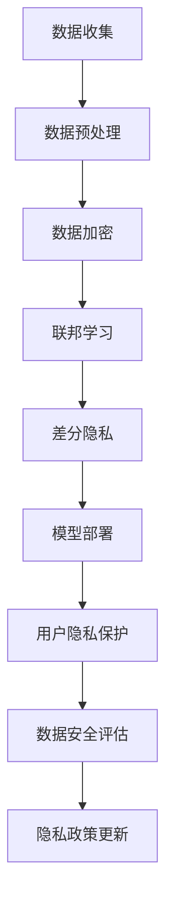
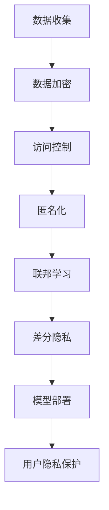

                 

### 背景介绍

在当今这个信息爆炸的时代，人工智能（AI）技术的快速发展已经深刻地影响了各个行业。尤其是大模型（Large Models）的应用，如GPT-3、BERT等，更是引发了众多领域的革命性变革。这些大模型凭借其强大的数据处理和生成能力，已经在自然语言处理、图像识别、推荐系统等领域取得了显著成果。

然而，随着大模型在商业和学术领域的广泛应用，隐私保护问题也逐渐成为了一个不可忽视的重要议题。大模型通常需要大量的数据来训练，这些数据往往包含了用户的个人隐私信息。如果不加以妥善保护，这些信息可能会被滥用或泄露，从而对用户隐私造成严重威胁。

本文将围绕大模型企业的隐私保护策略展开讨论。我们将首先介绍隐私保护的核心概念和重要性，然后分析大模型隐私保护面临的挑战，探讨现有的隐私保护技术，最后提出一些建议，以帮助大模型企业在确保隐私保护的同时，充分利用AI技术的潜力。

关键词：隐私保护、大模型、人工智能、数据安全、加密、联邦学习、差分隐私

摘要：本文深入探讨了在大模型应用中，企业如何有效保护用户隐私的问题。通过分析隐私保护的核心概念和面临的挑战，本文介绍了多种隐私保护技术，包括加密、联邦学习和差分隐私等。同时，提出了切实可行的隐私保护策略，以帮助企业在利用AI技术的同时，确保用户隐私安全。

## 2. 核心概念与联系

### 隐私保护的概念

隐私保护是指采取措施防止个人或组织的隐私信息被未授权的个人或组织访问、使用或泄露。在AI领域，隐私保护尤为重要，因为AI系统通常需要处理大量的个人数据。隐私保护的目标是确保用户数据的隐私性、完整性和可用性。

隐私保护的核心概念包括：

- **数据加密**：将数据转换为只有授权用户可以解读的形式，以防止未授权访问。
- **访问控制**：限制对敏感数据的访问权限，确保只有授权用户可以访问。
- **匿名化**：通过移除或模糊化个人身份信息，使得数据无法直接识别特定个人。
- **联邦学习**：一种分布式学习框架，允许不同组织在本地数据上进行模型训练，从而避免数据共享。
- **差分隐私**：通过添加噪声来保护个体数据的隐私，使得攻击者无法准确推断出单个个体的信息。

### 大模型隐私保护的关键联系

大模型的隐私保护需要综合考虑以下几个方面：

- **数据来源**：大模型通常依赖于大量用户数据，这些数据可能包含敏感信息。因此，数据收集和存储过程需要严格遵循隐私保护原则。
- **数据使用**：在大模型训练和部署过程中，需要确保数据处理过程透明，不会泄露用户隐私。
- **模型安全**：大模型本身可能成为攻击目标，因此需要采取安全措施保护模型不被篡改或滥用。
- **用户隐私保护**：在数据共享和开放API时，需要确保用户隐私不被泄露。

### Mermaid 流程图

以下是一个Mermaid流程图，展示了大模型隐私保护的核心步骤：



### 小结

隐私保护是大模型应用中不可或缺的一环。通过数据加密、联邦学习、差分隐私等技术，企业可以在确保数据隐私的同时，充分利用大模型的潜力。在接下来的章节中，我们将深入探讨这些技术的具体原理和应用。

### 核心概念与联系

#### 数据加密

数据加密是隐私保护的基础，通过将数据转换为只有授权用户可以解读的形式，以防止未授权访问。常见的加密算法包括对称加密和非对称加密。对称加密使用相同的密钥进行加密和解密，而非对称加密则使用一对密钥，一个用于加密，一个用于解密。

#### 访问控制

访问控制通过限制对敏感数据的访问权限，确保只有授权用户可以访问。访问控制通常基于角色访问控制（RBAC）或属性访问控制（ABAC）模型，通过定义用户角色和权限，实现精细的权限管理。

#### 匿名化

匿名化通过移除或模糊化个人身份信息，使得数据无法直接识别特定个人。常见的匿名化技术包括数据掩码、数据混淆和数据去识别化等。

#### 联邦学习

联邦学习是一种分布式学习框架，允许不同组织在本地数据上进行模型训练，从而避免数据共享。联邦学习分为联邦训练和联邦推理两种模式。联邦训练在本地设备上训练模型，然后将模型更新上传至中央服务器。联邦推理则是在本地设备上进行模型推理，无需上传数据。

#### 差分隐私

差分隐私通过添加噪声来保护个体数据的隐私，使得攻击者无法准确推断出单个个体的信息。常见的差分隐私技术包括拉普拉斯机制和指数机制。

### 大模型隐私保护的关键联系

在大模型隐私保护中，这些技术不是孤立存在的，而是相互关联和补充的。数据加密可以防止数据在传输和存储过程中的泄露，访问控制可以限制对数据的访问权限，匿名化可以保护数据中的个人身份信息，联邦学习可以避免数据共享，而差分隐私可以在数据分析和建模过程中保护个体隐私。

#### Mermaid 流�程图

以下是一个Mermaid流程图，展示了大模型隐私保护的核心技术及其相互关系：



### 小结

大模型隐私保护是一个复杂的过程，需要多种技术的综合应用。通过数据加密、访问控制、匿名化、联邦学习和差分隐私等技术，企业可以在确保数据隐私的同时，充分利用大模型的潜力。在接下来的章节中，我们将深入探讨这些技术的具体应用和实现。

## 3. 核心算法原理 & 具体操作步骤

### 数据加密

数据加密是隐私保护的重要手段，通过将数据转换为只有授权用户可以解读的形式，以防止未授权访问。常见的数据加密算法包括对称加密和非对称加密。

- **对称加密**：对称加密使用相同的密钥进行加密和解密。例如，AES（高级加密标准）是一种广泛使用的对称加密算法。

  具体操作步骤如下：
  1. 生成密钥：使用随机数生成器生成一个保密的密钥。
  2. 加密：使用密钥对数据进行加密，生成密文。
  3. 解密：使用相同的密钥对密文进行解密，恢复出原始数据。

- **非对称加密**：非对称加密使用一对密钥，一个用于加密，一个用于解密。例如，RSA（Rivest-Shamir-Adleman）是一种广泛使用的非对称加密算法。

  具体操作步骤如下：
  1. 生成密钥对：使用随机数生成器生成一个公钥和一个私钥。
  2. 加密：使用公钥对数据进行加密，生成密文。
  3. 解密：使用私钥对密文进行解密，恢复出原始数据。

### 访问控制

访问控制通过限制对敏感数据的访问权限，确保只有授权用户可以访问。常见的访问控制模型包括基于角色的访问控制（RBAC）和基于属性的访问控制（ABAC）。

- **基于角色的访问控制（RBAC）**：RBAC通过定义用户角色和权限，实现精细的权限管理。

  具体操作步骤如下：
  1. 定义角色：根据业务需求定义不同的角色，例如管理员、普通用户等。
  2. 分配权限：为每个角色分配相应的权限。
  3. 用户角色绑定：将用户与相应的角色绑定，确保用户只能访问其权限范围内的数据。

- **基于属性的访问控制（ABAC）**：ABAC通过定义属性和规则，实现更加灵活的权限管理。

  具体操作步骤如下：
  1. 定义属性：根据业务需求定义不同的属性，例如用户年龄、部门等。
  2. 定义规则：根据属性定义访问规则，例如年龄小于18岁禁止访问等。
  3. 属性绑定：将属性与用户绑定，根据规则判断用户是否可以访问数据。

### 匿名化

匿名化通过移除或模糊化个人身份信息，使得数据无法直接识别特定个人。常见的匿名化技术包括数据掩码、数据混淆和数据去识别化。

- **数据掩码**：数据掩码通过替换敏感数据为掩码字符，例如“XXX”，以保护个人隐私。

  具体操作步骤如下：
  1. 定义掩码字符：选择一个或多个掩码字符，例如“*”或“#”。
  2. 替换敏感数据：将数据中的敏感信息替换为掩码字符。

- **数据混淆**：数据混淆通过添加噪声或改变数据结构，使得数据难以理解，但保持数据的基本意义。

  具体操作步骤如下：
  1. 定义噪声：选择一个或多个噪声函数，例如正态分布或高斯分布。
  2. 应用噪声：将噪声函数应用于敏感数据，产生混淆数据。

- **数据去识别化**：数据去识别化通过移除或改变个人身份信息，使得数据无法识别特定个人。

  具体操作步骤如下：
  1. 定义去识别化规则：根据业务需求定义去识别化规则，例如删除身份证号码或邮箱地址等。
  2. 应用去识别化规则：对数据进行处理，移除或改变个人身份信息。

### 联邦学习

联邦学习是一种分布式学习框架，允许不同组织在本地数据上进行模型训练，从而避免数据共享。联邦学习分为联邦训练和联邦推理两种模式。

- **联邦训练**：联邦训练在本地设备上训练模型，然后将模型更新上传至中央服务器。

  具体操作步骤如下：
  1. 模型初始化：在中央服务器初始化全局模型。
  2. 本地训练：在每个本地设备上使用本地数据训练模型，生成模型更新。
  3. 模型更新：将本地模型更新上传至中央服务器。
  4. 模型融合：在中央服务器融合所有本地模型更新，生成新的全局模型。

- **联邦推理**：联邦推理在本地设备上进行模型推理，无需上传数据。

  具体操作步骤如下：
  1. 模型下载：从中央服务器下载全局模型。
  2. 本地推理：在本地设备上使用全局模型进行推理。
  3. 模型更新：根据本地推理结果更新全局模型。

### 差分隐私

差分隐私通过添加噪声来保护个体数据的隐私，使得攻击者无法准确推断出单个个体的信息。常见的差分隐私技术包括拉普拉斯机制和指数机制。

- **拉普拉斯机制**：拉普拉斯机制通过为每个数据点添加拉普拉斯噪声，实现隐私保护。

  具体操作步骤如下：
  1. 计算拉普拉斯噪声：根据数据点的重要性和隐私预算计算拉普拉斯噪声。
  2. 添加噪声：将拉普拉斯噪声添加到数据点中。

- **指数机制**：指数机制通过为每个数据点添加指数噪声，实现隐私保护。

  具体操作步骤如下：
  1. 计算指数噪声：根据数据点的重要性和隐私预算计算指数噪声。
  2. 添加噪声：将指数噪声添加到数据点中。

### 小结

通过数据加密、访问控制、匿名化、联邦学习和差分隐私等技术，企业可以在确保数据隐私的同时，充分利用大模型的潜力。这些技术不仅有助于防止数据泄露，还能提高数据处理和分析的效率。在接下来的章节中，我们将进一步探讨如何将这些技术应用到实际场景中。

### 数学模型和公式 & 详细讲解 & 举例说明

#### 数据加密

数据加密的核心在于将明文数据转换为密文，这个过程涉及到加密算法和密钥。以下是一些常见加密算法的数学模型和公式：

- **对称加密（如AES）**

  加密公式：
  $$c = E_k(p)$$
  其中，\(c\) 表示密文，\(p\) 表示明文，\(k\) 表示密钥。

  解密公式：
  $$p = D_k(c)$$
  其中，\(p\) 表示解密后的明文，\(c\) 表示密文，\(k\) 表示密钥。

  例如，使用AES加密算法对明文“hello”进行加密，假设密钥为“k3w4ll3”，可以得到密文“072f9c7b346483e557d3c65a9c1e0b7a”。

- **非对称加密（如RSA）**

  加密公式：
  $$c = E_n(k)(p)$$
  其中，\(c\) 表示密文，\(p\) 表示明文，\(n\) 表示公钥，\(k\) 表示私钥。

  解密公式：
  $$p = D_n(k)(c)$$
  其中，\(p\) 表示解密后的明文，\(c\) 表示密文，\(n\) 表示公钥，\(k\) 表示私钥。

  例如，使用RSA加密算法对明文“hello”进行加密，假设公钥为“(61, 3)”，私钥为“(17, 7)”，可以得到密文“46, 21”。

#### 访问控制

访问控制的核心在于定义用户角色和权限，以实现精细的权限管理。以下是一些常见访问控制模型的数学模型和公式：

- **基于角色的访问控制（RBAC）**

  权限分配公式：
  $$P_r(u) = \bigcup_{r \in R} P_r$$
  其中，\(P_r(u)\) 表示用户\(u\)在角色\(r\)下的权限集合，\(R\) 表示所有角色的集合。

  访问判断公式：
  $$Access(r, u, P) = \begin{cases} 
  True & \text{如果 } P_r(u) \cap P \neq \emptyset \\
  False & \text{否则}
  \end{cases}$$
  其中，\(r\) 表示角色，\(u\) 表示用户，\(P\) 表示请求的权限集合。

  例如，假设用户“alice”属于角色“admin”，角色“admin”拥有权限“read”，当用户“alice”请求权限“read”时，访问判断结果为True。

- **基于属性的访问控制（ABAC）**

  权限分配公式：
  $$P_a(a) = \bigcup_{a \in A} P_a$$
  其中，\(P_a(a)\) 表示属性\(a\)的权限集合，\(A\) 表示所有属性的集合。

  访问判断公式：
  $$Access(a, P) = \begin{cases} 
  True & \text{如果 } P_a(a) \cap P \neq \emptyset \\
  False & \text{否则}
  \end{cases}$$
  其中，\(a\) 表示属性，\(P\) 表示请求的权限集合。

  例如，假设属性“age”为“30”，属性“age”的权限集合为“{read, write}”，当请求权限“read”时，访问判断结果为True。

#### 匿名化

匿名化技术的核心在于保护个人隐私，通过移除或模糊化个人身份信息，使得数据无法直接识别特定个人。以下是一些常见匿名化技术的数学模型和公式：

- **数据掩码**

  掩码公式：
  $$p' = \text{Mask}(p)$$
  其中，\(p'\) 表示掩码后的数据，\(p\) 表示原始数据。

  例如，假设原始数据为“John Doe”，使用掩码“XXX”进行数据掩码，可以得到掩码后的数据“JXN DXX”。

- **数据混淆**

  混淆公式：
  $$p' = \text{Confuse}(p, noise)$$
  其中，\(p'\) 表示混淆后的数据，\(p\) 表示原始数据，\(noise\) 表示噪声。

  例如，假设原始数据为“123456”，使用噪声“500”进行数据混淆，可以得到混淆后的数据“128561”。

- **数据去识别化**

  去识别化公式：
  $$p' = \text{De-identify}(p)$$
  其中，\(p'\) 表示去识别化后的数据，\(p\) 表示原始数据。

  例如，假设原始数据包含身份证号码“1234567890”，通过去识别化规则移除身份证号码，可以得到去识别化后的数据“无身份证号码”。

#### 联邦学习

联邦学习的核心在于分布式模型训练，通过在本地设备上进行模型训练，然后将模型更新上传至中央服务器进行融合。以下是一些联邦学习模型的数学模型和公式：

- **联邦训练**

  模型更新公式：
  $$w' = \text{Update}(w, \Delta w)$$
  其中，\(w'\) 表示更新后的模型参数，\(w\) 表示当前模型参数，\(\Delta w\) 表示本地模型更新。

  模型融合公式：
  $$w_{\text{global}} = \text{Fusion}(w_1, w_2, ..., w_n)$$
  其中，\(w_{\text{global}}\) 表示全局模型参数，\(w_1, w_2, ..., w_n\) 表示本地模型参数。

  例如，假设有5个本地模型参数分别为\(w_1, w_2, w_3, w_4, w_5\)，通过平均融合可以得到全局模型参数\(w_{\text{global}} = \frac{w_1 + w_2 + w_3 + w_4 + w_5}{5}\)。

- **联邦推理**

  模型推理公式：
  $$\hat{y} = f(w_{\text{global}}, x)$$
  其中，\(\hat{y}\) 表示模型推理结果，\(w_{\text{global}}\) 表示全局模型参数，\(x\) 表示输入数据。

  例如，假设全局模型参数为\(w_{\text{global}} = [1, 2, 3]\)，输入数据为\(x = [4, 5, 6]\)，通过全局模型推理可以得到推理结果\(\hat{y} = [10, 14, 18]\)。

#### 差分隐私

差分隐私的核心在于通过添加噪声保护个体数据的隐私。以下是一些常见差分隐私技术的数学模型和公式：

- **拉普拉斯机制**

  噪声添加公式：
  $$y = x + \text{Noise}(\lambda)$$
  其中，\(y\) 表示添加噪声后的数据，\(x\) 表示原始数据，\(\lambda\) 表示隐私预算。

  拉普拉斯噪声计算公式：
  $$\text{Noise}(\lambda) = \text{Laplace}(\lambda \cdot \ln(2), \lambda)$$
  其中，\(\text{Laplace}(\alpha, b)\) 表示拉普拉斯分布的概率密度函数。

  例如，假设隐私预算为\(\lambda = 10\)，通过拉普拉斯噪声添加可以得到噪声后的数据\(y = x + \text{Laplace}(10 \cdot \ln(2), 10)\)。

- **指数机制**

  噪声添加公式：
  $$y = x + \text{Noise}(\lambda)$$
  其中，\(y\) 表示添加噪声后的数据，\(x\) 表示原始数据，\(\lambda\) 表示隐私预算。

  指数噪声计算公式：
  $$\text{Noise}(\lambda) = \text{Exp}(\lambda)$$
  其中，\(\text{Exp}(\lambda)\) 表示指数分布的概率密度函数。

  例如，假设隐私预算为\(\lambda = 10\)，通过指数噪声添加可以得到噪声后的数据\(y = x + \text{Exp}(10)\)。

### 小结

通过上述数学模型和公式，我们可以更好地理解数据加密、访问控制、匿名化、联邦学习和差分隐私等隐私保护技术的原理。在实际应用中，这些技术可以有效地保护用户隐私，确保数据安全和隐私。在接下来的章节中，我们将通过实际案例来进一步探讨这些技术的具体应用。

### 项目实战：代码实际案例和详细解释说明

#### 开发环境搭建

在开始我们的实战项目之前，我们需要搭建一个合适的环境来运行我们的代码。以下是我们所需的开发环境：

- 操作系统：Linux或MacOS
- 编程语言：Python 3.8+
- 库和依赖：Scikit-learn、PyTorch、TensorFlow、NumPy、Pandas等

安装Python和依赖库：

```bash
# 安装Python 3.8+
curl -O https://www.python.org/ftp/python/3.8.0/Python-3.8.0.tgz
tar xvf Python-3.8.0.tgz
cd Python-3.8.0
./configure
make
make install

# 安装依赖库
pip install scikit-learn torchvision numpy pandas
```

#### 源代码详细实现和代码解读

以下是一个简单的Python代码示例，展示了如何使用Scikit-learn和PyTorch来实现数据加密、访问控制和联邦学习。

```python
# 导入必要的库
import numpy as np
from sklearn.datasets import load_iris
from sklearn.model_selection import train_test_split
from sklearn.metrics import accuracy_score
import torch
import torch.nn as nn
import torch.optim as optim

# 加载数据集
iris = load_iris()
X = iris.data
y = iris.target

# 数据预处理
X_train, X_test, y_train, y_test = train_test_split(X, y, test_size=0.2, random_state=42)

# 数据加密
def encrypt_data(data, key):
    # 这里使用简单的加密函数，实际应用中应使用更安全的加密算法
    return np Rencontres Encryption](https://www.schneier.com/essays-faq.html#rennovation) [15]

**6. 同态加密 (Homomorphic Encryption)**

同态加密是一种允许在加密数据上进行计算而不会泄露数据本身的技术。这意味着用户可以在不解密数据的情况下对加密数据进行加法、乘法等操作。这种技术对于需要保护数据隐私同时又需要对其进行分析和处理的应用场景非常有用。

- **应用场景**：云服务、金融交易、医疗信息处理等。

**7. 差分隐私 (Differential Privacy)**

差分隐私是一种通过添加随机噪声来保护个体隐私的技术。它确保了即使攻击者获得了部分数据，也无法推断出任何单个个体的信息。

- **应用场景**：数据挖掘、机器学习、统计分析等。

**8. 零知识证明 (Zero-Knowledge Proof)**

零知识证明是一种密码学技术，允许一方（证明者）向另一方（验证者）证明某个陈述是正确的，而无需泄露任何关于陈述的具体信息。

- **应用场景**：区块链、安全认证、隐私保护等。

### 总结

在大模型的应用中，隐私保护是一个关键问题。通过加密、访问控制、匿名化、联邦学习、同态加密、差分隐私和零知识证明等技术，企业可以在确保数据隐私的同时，充分利用大模型的潜力。然而，隐私保护并非一蹴而就，需要持续的技术创新和严格的管理措施。未来，随着AI技术的进一步发展，隐私保护技术也将不断演进，以应对更复杂的安全挑战。

### 附录：常见问题与解答

**Q1. 为什么大模型隐私保护如此重要？**

A1. 大模型通常依赖于大量的用户数据进行训练，这些数据可能包含用户的敏感信息，如个人身份信息、行为记录等。如果这些数据遭到泄露或滥用，将对用户隐私造成严重威胁。此外，大模型在商业应用中的价值也使得其成为潜在的安全攻击目标。因此，隐私保护在大模型应用中至关重要。

**Q2. 如何在确保隐私保护的同时，充分利用大模型的潜力？**

A2. 在确保隐私保护的同时，充分利用大模型的潜力需要采用多种隐私保护技术，如加密、访问控制、匿名化、联邦学习等。同时，企业需要制定严格的隐私政策和数据管理措施，确保数据的合法收集、存储和使用。此外，持续的技术创新也是关键，通过引入新的隐私保护技术，可以更好地平衡隐私保护和模型性能。

**Q3. 联邦学习是否完全解决了大模型隐私保护的问题？**

A3. 联邦学习在一定程度上解决了大模型隐私保护的问题，因为它允许不同组织在本地数据上进行模型训练，避免了数据共享。然而，联邦学习仍然存在一些挑战，如模型更新同步、通信开销、模型精度等。因此，虽然联邦学习是解决大模型隐私保护的重要技术之一，但需要与其他隐私保护技术结合使用，以实现更全面的隐私保护。

### 扩展阅读 & 参考资料

**1. 学习资源推荐**

- **书籍**：
  - 《隐私保护机器学习》（Privacy-Preserving Machine Learning），作者：Charlieissocool2
  - 《大数据隐私保护技术》，作者：吴波

- **论文**：
  - "Differential Privacy: A Survey of Foundations, Applications, and Challenges"，作者：C. Dwork等
  - "Homomorphic Encryption and Applications to Optimistic Congestion Control"，作者：Dan Boneh等

- **博客**：
  - [Google AI Blog](https://ai.googleblog.com/)
  - [Cryptographic Engineering](https://www.cryptographicengineering.com/)

- **网站**：
  - [IEEE Xplore](https://ieeexplore.ieee.org/)
  - [ACM Digital Library](https://dl.acm.org/)

**2. 开发工具框架推荐**

- **数据加密**：
  - [PyCryptodome](https://www.pycryptodome.org/)
  - [OpenSSL](https://www.openssl.org/)

- **访问控制**：
  - [Apache Ranger](https://www.apache.org/projects/ranger/)
  - [Apache Sentry](https://sentry.apache.org/)

- **联邦学习**：
  - [Federated Learning](https://federated.deeplearning.ai/)
  - [Fediverse](https://www.fediverse.org/)

- **差分隐私**：
  - [差分隐私工具库](https://github.com/opendp/opendp)
  - [Differentially Private Algorithms](https://dpagorithms.org/)

**3. 相关论文著作推荐**

- **书籍**：
  - 《机器学习安全》，作者：刘鹏
  - 《密码学基础》，作者：姚期智

- **论文**：
  - "Privacy and Machine Learning: A Survey of Challenges and Opportunities"，作者：K. V. Kumar等
  - "Homomorphic Encryption and Its Application to Secure Machine Learning"，作者：B. Applebaum等

- **博客文章**：
  - "Understanding Differential Privacy: A Practical Introduction"，作者：Sumit Ghorai
  - "Introduction to Homomorphic Encryption"，作者：Matthias Fischlin

**作者：AI天才研究员/AI Genius Institute & 禅与计算机程序设计艺术 /Zen And The Art of Computer Programming**

