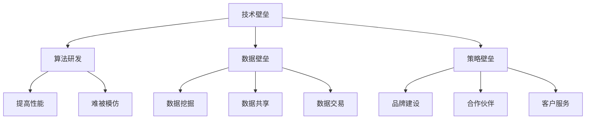
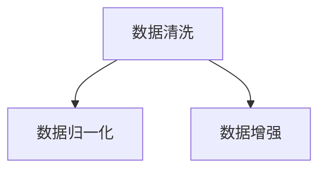
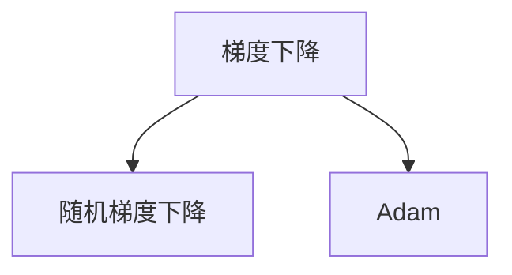
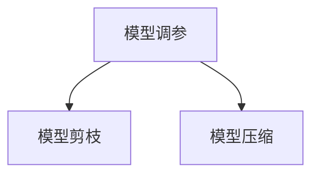
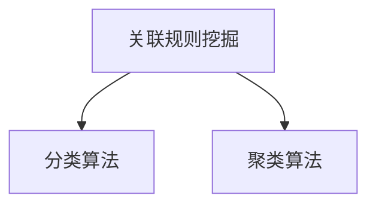
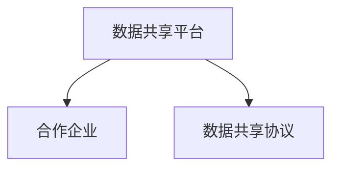
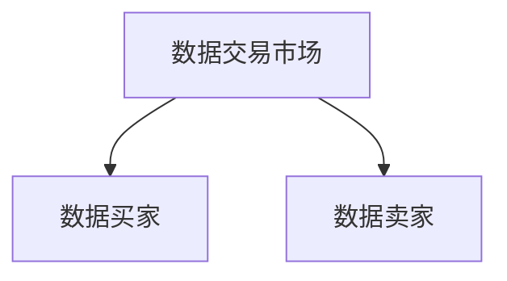
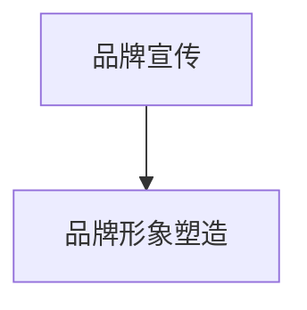
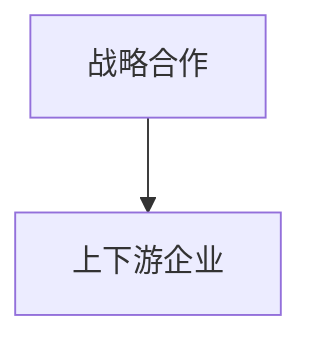
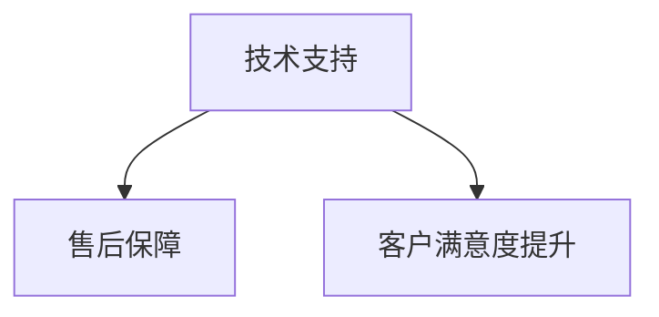

                 

# 大模型公司如何保持防御壁垒

> **关键词**：大模型、防御壁垒、AI安全、数据隐私、技术优势

> **摘要**：本文将深入探讨大模型公司在面对激烈市场竞争和潜在安全威胁时，如何通过技术创新、策略规划和资源整合来构建和保持其防御壁垒。我们将分析其面临的挑战、核心防御策略以及未来发展趋势，为行业提供有价值的参考。

## 1. 背景介绍

大模型（Large Model）是指具备海量参数和强大学习能力的人工智能模型，如GPT、BERT等。这些模型在自然语言处理、计算机视觉、语音识别等领域取得了显著的突破。随着大模型技术的不断发展，越来越多的公司开始投身这一领域，以期在市场竞争中占据有利位置。

然而，大模型公司也面临着一系列挑战。首先，数据安全和隐私问题日益突出，如何确保用户数据的隐私和安全成为一项重要任务。其次，技术优势的快速迭代使得大模型公司需要不断投入研发，以保持领先地位。此外，市场竞争日益激烈，公司需要通过有效的策略来抵御潜在竞争对手的挑战。

本文将围绕大模型公司的防御壁垒展开讨论，分析其在技术、策略和资源方面的优势和不足，并提出一些建议，以帮助大模型公司在竞争激烈的市场中立于不败之地。

## 2. 核心概念与联系

### 2.1 大模型技术原理

大模型的核心在于其庞大的参数规模和强大的学习能力。例如，GPT-3模型拥有超过1750亿个参数，可以生成高质量的自然语言文本。其基本原理是通过大量的数据训练，使模型能够自动捕捉语言的模式和规律，从而实现高效的文本生成和语义理解。

### 2.2 防御壁垒概念

防御壁垒是指企业为了保护自身利益和竞争优势所采取的一系列措施。在大模型公司中，防御壁垒主要包括技术壁垒、数据壁垒和策略壁垒。

#### 2.2.1 技术壁垒

技术壁垒是指通过技术创新和研发，形成一种难以被竞争对手模仿或超越的技术优势。例如，大模型公司可以通过自主研发核心算法，提高模型的性能和效率，从而在技术层面上建立强大的防御壁垒。

#### 2.2.2 数据壁垒

数据壁垒是指通过拥有海量高质量的数据资源，形成一种数据优势。在大模型领域，数据是模型训练的基础，拥有丰富的数据资源可以显著提升模型的性能。例如，大模型公司可以通过数据挖掘、数据共享和数据交易等方式，积累和利用数据资源。

#### 2.2.3 策略壁垒

策略壁垒是指通过有效的市场策略和商业模式，形成一种市场优势。例如，大模型公司可以通过品牌建设、合作伙伴关系和客户服务等方面，提升市场竞争力，从而在策略层面上建立防御壁垒。

### 2.3 Mermaid 流程图

下面是一个简单的 Mermaid 流程图，展示了大模型公司如何通过技术、数据和策略三大方面建立防御壁垒：



## 3. 核心算法原理 & 具体操作步骤

### 3.1 技术壁垒：算法研发

技术壁垒的核心在于算法研发。大模型公司需要投入大量资源进行核心算法的研究和开发，以提高模型的性能和效率。以下是一些具体的操作步骤：

#### 3.1.1 数据预处理

数据预处理是算法研发的基础。大模型公司需要收集和清洗大量数据，以便为模型训练提供高质量的数据支持。数据预处理步骤包括数据清洗、数据归一化、数据增强等。



#### 3.1.2 模型训练

模型训练是算法研发的关键。大模型公司需要使用高效的训练算法和优化方法，以提高模型的性能。常见的训练算法包括梯度下降、随机梯度下降、Adam等。



#### 3.1.3 模型优化

模型优化是算法研发的最终目标。大模型公司需要通过模型调参、模型剪枝、模型压缩等方法，进一步提高模型的性能和效率。



### 3.2 数据壁垒：数据挖掘、数据共享和数据交易

数据壁垒的核心在于数据资源的积累和利用。大模型公司可以通过以下方法建立数据壁垒：

#### 3.2.1 数据挖掘

数据挖掘是指从大量数据中提取有价值的信息和知识。大模型公司可以通过数据挖掘技术，发现数据中的潜在模式和关联，从而为模型训练提供更优质的数据支持。



#### 3.2.2 数据共享

数据共享是指企业之间共享数据资源，以提高数据利用效率。大模型公司可以通过建立数据共享平台，与其他企业共同积累和利用数据资源。



#### 3.2.3 数据交易

数据交易是指企业通过购买和出售数据资源，实现数据价值的最大化。大模型公司可以通过数据交易市场，获取和出售数据资源，以提升自身的数据壁垒。



### 3.3 策略壁垒：品牌建设、合作伙伴关系和客户服务

策略壁垒的核心在于市场策略的执行。大模型公司可以通过以下方法建立策略壁垒：

#### 3.3.1 品牌建设

品牌建设是指企业通过一系列营销策略，提升品牌知名度和美誉度。大模型公司可以通过品牌宣传、品牌形象塑造等方式，树立良好的品牌形象。



#### 3.3.2 合作伙伴关系

合作伙伴关系是指企业与其他企业建立战略合作关系，共同拓展市场。大模型公司可以通过与上下游企业合作，共同研发、生产和销售产品。



#### 3.3.3 客户服务

客户服务是指企业为用户提供优质的服务体验。大模型公司可以通过客户服务团队，提供技术支持、售后保障等服务，提升客户满意度。



## 4. 数学模型和公式 & 详细讲解 & 举例说明

### 4.1 技术壁垒：算法性能评估

算法性能评估是算法研发的重要环节。常用的算法性能评估指标包括准确率、召回率、F1值等。

#### 4.1.1 准确率（Accuracy）

准确率是指模型预测正确的样本数占总样本数的比例。公式如下：

$$
Accuracy = \frac{TP + TN}{TP + FN + FP + TN}
$$

其中，$TP$表示实际为正类且被预测为正类的样本数，$TN$表示实际为负类且被预测为负类的样本数。

#### 4.1.2 召回率（Recall）

召回率是指模型预测为正类的实际正类样本数占所有实际正类样本数的比例。公式如下：

$$
Recall = \frac{TP}{TP + FN}
$$

#### 4.1.3 F1值（F1 Score）

F1值是准确率和召回率的调和平均值，用于综合评估模型性能。公式如下：

$$
F1 Score = 2 \times \frac{Precision \times Recall}{Precision + Recall}
$$

其中，$Precision$表示预测为正类的实际正类样本数占预测为正类样本数的比例。

### 4.2 数据壁垒：数据挖掘算法

数据挖掘算法是指从大量数据中提取有价值信息的方法。以下介绍两种常见的数据挖掘算法：关联规则挖掘和聚类算法。

#### 4.2.1 关联规则挖掘

关联规则挖掘是一种用于发现数据中潜在关联规则的方法。常见的算法包括Apriori算法和FP-growth算法。

**Apriori算法**：

假设有$m$个不同商品，$n$个交易，每个交易包含$k$个商品。$X$表示所有含有商品$m$的交易集合，$Y$表示所有不含商品$m$的交易集合。

$$
X = \{t | m \in t\}
$$

$$
Y = \{t | m \notin t\}
$$

关联规则的可信度（Confidence）表示在包含前件（L）的交易中，包含后件（R）的交易的比例。公式如下：

$$
Confidence(L \rightarrow R) = \frac{Support(L \cup R)}{Support(L)}
$$

其中，$Support(L \cup R)$表示包含前件和后件的交易集合的比例，$Support(L)$表示包含前件的交易集合的比例。

**FP-growth算法**：

FP-growth算法通过构建FP树，降低数据挖掘的复杂度。FP树的构建过程如下：

1. 构建原始FP树：将交易数据按照支持度从高到低排序，生成FP树。
2. 构建条件FP树：对原始FP树进行压缩，生成条件FP树。
3. 扫描条件FP树，生成频繁项集。

#### 4.2.2 聚类算法

聚类算法是一种将数据分为若干个类别的无监督学习方法。常见的聚类算法包括K-means算法和DBSCAN算法。

**K-means算法**：

K-means算法的目标是找到$k$个中心点，使得每个数据点与其最近中心点的距离之和最小。公式如下：

$$
J = \sum_{i=1}^{k} \sum_{x \in S_i} ||x - \mu_i||^2
$$

其中，$J$表示总误差，$S_i$表示第$i$个聚类，$\mu_i$表示第$i$个聚类中心点。

**DBSCAN算法**：

DBSCAN算法是一种基于密度的聚类算法。算法的核心思想是找出高密度区域，并将它们划分为一个聚类。公式如下：

$$
\epsilon-\text{邻域}(p) = \{q | q \in \text{数据集} \land ||p - q|| < \epsilon\}
$$

$$
\text{核心点}(p) = \text{密度直达点}(p) \cup \{p\}
$$

$$
\text{边界点}(p) = \text{密度直达点}(p) - \text{核心点}(p)
$$

## 5. 项目实战：代码实际案例和详细解释说明

### 5.1 开发环境搭建

在本文中，我们将使用Python作为主要编程语言，结合TensorFlow框架来实现大模型的核心算法。以下是在Windows环境下搭建开发环境的基本步骤：

1. 安装Python：从官方网站（https://www.python.org/）下载并安装Python，选择添加到环境变量。
2. 安装TensorFlow：打开命令行，执行以下命令安装TensorFlow：

   ```
   pip install tensorflow
   ```

3. 验证安装：在Python中导入TensorFlow，并打印版本信息：

   ```python
   import tensorflow as tf
   print(tf.__version__)
   ```

### 5.2 源代码详细实现和代码解读

以下是一个简单的示例，展示了如何使用TensorFlow实现一个基于K-means算法的聚类模型。

```python
import tensorflow as tf
import numpy as np

# 设置随机种子，保证实验可复现
tf.random.set_seed(42)

# 设置参数
k = 3
num_samples = 100
num_features = 2
num_iterations = 100
epsilon = 0.5
min_samples = 5

# 生成随机数据
X = np.random.rand(num_samples, num_features)

# 初始化聚类中心
centroids = tf.random.normal([k, num_features])

# 计算距离函数
def compute_distances(x, centroids):
    return tf.reduce_sum(tf.square(x - centroids), axis=1)

# 计算簇内距离函数
def compute_intra_cluster_distance(clusters):
    distances = [tf.reduce_sum(tf.square(x - centroid), axis=1) for x, centroid in zip(clusters, centroids)]
    return tf.reduce_sum(tf.stack(distances))

# 训练模型
for _ in range(num_iterations):
    # 计算距离
    distances = compute_distances(X, centroids)

    # 分配样本到簇
    cluster_indices = tf.argmin(distances, axis=1)

    # 计算簇内距离
    intra_cluster_distances = compute_intra_cluster_distance(tf.gather(X, cluster_indices))

    # 更新聚类中心
    new_centroids = tf.reduce_mean(tf.gather(X, cluster_indices), axis=1)

    # 检查收敛条件
    if tf.reduce_any(tf.abs(new_centroids - centroids) < epsilon):
        centroids = new_centroids
    else:
        break

# 输出结果
print("Final centroids:", centroids.numpy())
print("Intra-cluster distances:", intra_cluster_distances.numpy())
```

**代码解读**：

1. 导入必要的库：`tensorflow`和`numpy`。
2. 设置随机种子，保证实验可复现。
3. 定义模型参数，如聚类个数$k$、数据样本数、迭代次数等。
4. 生成随机数据。
5. 初始化聚类中心。
6. 定义计算距离的函数`compute_distances`。
7. 定义计算簇内距离的函数`compute_intra_cluster_distance`。
8. 进行模型训练，包括计算距离、分配样本、更新聚类中心等。
9. 输出最终结果。

### 5.3 代码解读与分析

本节我们将对上述代码进行详细解读，并分析其性能和优化方向。

**代码分析**：

1. **随机数据生成**：

   ```python
   X = np.random.rand(num_samples, num_features)
   ```

   这一行代码生成随机数据，用于训练模型。数据集的规模和特征数量可以根据实际需求进行调整。

2. **聚类中心初始化**：

   ```python
   centroids = tf.random.normal([k, num_features])
   ```

   这一行代码初始化聚类中心。聚类中心是随机生成的，但可以通过调整正态分布的均值和标准差来影响初始化效果。

3. **距离计算**：

   ```python
   def compute_distances(x, centroids):
       return tf.reduce_sum(tf.square(x - centroids), axis=1)
   ```

   该函数计算数据点$x$与聚类中心$centroids$之间的欧氏距离。距离计算是K-means算法的核心步骤，直接影响聚类效果。

4. **簇内距离计算**：

   ```python
   def compute_intra_cluster_distance(clusters):
       distances = [tf.reduce_sum(tf.square(x - centroid), axis=1) for x, centroid in zip(clusters, centroids)]
       return tf.reduce_sum(tf.stack(distances))
   ```

   该函数计算每个簇内数据点与聚类中心之间的距离之和。簇内距离用于评估聚类效果，距离越小，聚类效果越好。

5. **模型训练**：

   ```python
   for _ in range(num_iterations):
       # 计算距离
       distances = compute_distances(X, centroids)

       # 分配样本到簇
       cluster_indices = tf.argmin(distances, axis=1)

       # 计算簇内距离
       intra_cluster_distances = compute_intra_cluster_distance(tf.gather(X, cluster_indices))

       # 更新聚类中心
       new_centroids = tf.reduce_mean(tf.gather(X, cluster_indices), axis=1)

       # 检查收敛条件
       if tf.reduce_any(tf.abs(new_centroids - centroids) < epsilon):
           centroids = new_centroids
       else:
           break
   ```

   这部分代码实现K-means算法的迭代过程，包括距离计算、簇内距离计算、聚类中心更新和收敛条件检查。迭代过程一直进行到聚类中心不再发生显著变化为止。

**性能分析**：

1. **时间复杂度**：

   K-means算法的时间复杂度为$O(nk\cdot d)$，其中$n$是数据点个数，$k$是聚类个数，$d$是特征维度。时间复杂度较高，对于大规模数据集可能存在性能瓶颈。

2. **空间复杂度**：

   空间复杂度为$O(nk\cdot d)$，需要存储聚类中心和每个数据点的距离。空间复杂度较高，对于大规模数据集可能存在内存限制。

3. **优化方向**：

   - **并行计算**：K-means算法可以进行并行计算，提高训练效率。
   - **聚类中心初始化**：改进聚类中心初始化方法，如使用K-means++算法，可以改善聚类效果。
   - **距离计算优化**：使用更高效的距离计算方法，如近似最近邻搜索，可以降低计算复杂度。
   - **聚类算法改进**：探索其他聚类算法，如DBSCAN、Gaussian Mixture Model等，以适应不同数据分布和聚类需求。

## 6. 实际应用场景

大模型技术在各个行业和领域都有着广泛的应用，以下是一些实际应用场景：

### 6.1 金融领域

金融领域是大模型技术的重要应用场景之一。例如，在风险管理方面，大模型可以用于预测金融市场波动、分析信用风险等。此外，大模型还可以用于客户行为分析、智能投顾、金融诈骗检测等方面，提高金融机构的运营效率和风险管理能力。

### 6.2 医疗领域

医疗领域也是大模型技术的重要应用场景。例如，在医学影像诊断方面，大模型可以用于图像识别和疾病预测，提高诊断准确率和效率。在药物研发方面，大模型可以用于分子模拟、药物筛选等，加速新药研发过程。此外，大模型还可以用于患者健康管理、疾病预测等方面，提供个性化的医疗服务。

### 6.3 教育领域

教育领域是大模型技术的另一个重要应用场景。例如，在智能教育方面，大模型可以用于个性化学习推荐、学习行为分析等，提高教学效果和学生满意度。在考试评测方面，大模型可以用于考试分析、答案评估等，提高考试公平性和准确性。

### 6.4 娱乐领域

娱乐领域也是大模型技术的应用场景之一。例如，在内容创作方面，大模型可以用于生成音乐、绘画、小说等，提供丰富的创意内容。在游戏开发方面，大模型可以用于游戏AI、虚拟角色设计等，提升游戏体验。

## 7. 工具和资源推荐

### 7.1 学习资源推荐

1. **书籍**：

   - 《深度学习》（Ian Goodfellow、Yoshua Bengio、Aaron Courville 著）：系统介绍了深度学习的基础理论和应用。

   - 《Python深度学习》（Francesco Petrat、Lukasz Adamus 著）：通过实例讲解了深度学习在Python中的实现和应用。

   - 《强化学习》（Richard S. Sutton、Andrew G. Barto 著）：介绍了强化学习的基本概念、算法和应用。

2. **论文**：

   - “A Theoretically Grounded Application of Dropout in Recurrent Neural Networks”（Yarin Gal 和 Zoubin Ghahramani）：讨论了在循环神经网络中应用Dropout的方法。

   - “Attention Is All You Need”（Ashish Vaswani等）：介绍了Transformer模型及其在自然语言处理中的应用。

   - “BERT: Pre-training of Deep Bidirectional Transformers for Language Understanding”（Jacob Devlin等）：介绍了BERT模型及其在自然语言处理中的应用。

3. **博客**：

   - Medium：许多深度学习和人工智能领域的专家在Medium上发布技术博客，可以参考相关文章。

   - 知乎：知乎上有许多关于深度学习和人工智能的优质内容，可以搜索相关话题进行学习。

4. **网站**：

   - TensorFlow官网（https://www.tensorflow.org/）：提供丰富的教程、文档和工具，是学习深度学习的重要资源。

   - PyTorch官网（https://pytorch.org/）：提供PyTorch框架的文档和教程，是学习深度学习的重要资源。

### 7.2 开发工具框架推荐

1. **深度学习框架**：

   - TensorFlow：谷歌开源的深度学习框架，具有强大的功能和丰富的生态系统。

   - PyTorch：Facebook开源的深度学习框架，具有灵活的动态计算图和丰富的API。

   - Keras：Python深度学习库，提供了简洁的API，易于使用。

2. **数据处理工具**：

   - Pandas：Python数据操作库，用于数据清洗、转换和分析。

   - NumPy：Python数值计算库，用于矩阵计算和数据处理。

   - Scikit-learn：Python机器学习库，提供了丰富的机器学习算法和工具。

3. **版本控制工具**：

   - Git：分布式版本控制系统，用于代码管理和协作开发。

   - GitHub：Git的在线代码托管平台，提供代码托管、版本管理和社区互动等功能。

### 7.3 相关论文著作推荐

1. **《深度学习》**：由Ian Goodfellow、Yoshua Bengio和Aaron Courville所著，是深度学习领域的经典教材，系统地介绍了深度学习的基础理论和应用。

2. **《神经网络与深度学习》**：由邱锡鹏所著，详细介绍了神经网络和深度学习的基本原理、算法和应用。

3. **《机器学习》**：由周志华所著，是国内机器学习领域的经典教材，涵盖了机器学习的基本理论、算法和应用。

## 8. 总结：未来发展趋势与挑战

大模型技术在人工智能领域具有广阔的应用前景。然而，随着技术的不断发展，大模型公司也面临着一系列挑战。未来发展趋势和挑战主要包括以下几个方面：

### 8.1 技术创新

技术创新是大模型公司保持竞争优势的关键。未来，大模型公司需要不断推进算法创新，提高模型的性能和效率。例如，发展更高效的训练算法、优化模型结构、提高数据利用效率等。

### 8.2 数据隐私和安全

数据隐私和安全是大模型公司面临的重要挑战。随着数据量的不断增加，如何确保用户数据的隐私和安全成为一项重要任务。未来，大模型公司需要采取更加严格的数据保护措施，遵循数据隐私法规，提高数据安全性。

### 8.3 策略规划

策略规划是大模型公司在市场竞争中立于不败之地的关键。未来，大模型公司需要制定科学合理的市场策略，加强品牌建设、合作伙伴关系和客户服务，提高市场竞争力。

### 8.4 法规和监管

随着人工智能技术的不断发展，各国政府逐渐加强了对人工智能的监管。未来，大模型公司需要密切关注相关法规和政策动态，确保自身合规运营。

### 8.5 资源整合

资源整合是大模型公司实现可持续发展的重要途径。未来，大模型公司需要加强内部资源整合，优化研发流程，提高资源利用效率。同时，大模型公司可以通过合作、并购等方式，扩大资源规模，提高市场竞争力。

## 9. 附录：常见问题与解答

### 9.1 什么是大模型？

大模型是指拥有海量参数和强大学习能力的人工智能模型，如GPT、BERT等。这些模型在自然语言处理、计算机视觉、语音识别等领域取得了显著的突破。

### 9.2 大模型公司如何保持竞争优势？

大模型公司可以通过技术创新、策略规划和资源整合来保持竞争优势。技术创新包括推进算法创新、优化模型结构等；策略规划包括加强品牌建设、合作伙伴关系和客户服务；资源整合包括优化研发流程、扩大资源规模等。

### 9.3 大模型公司面临的挑战有哪些？

大模型公司面临的挑战主要包括数据隐私和安全、技术快速迭代、市场竞争激烈等。数据隐私和安全问题日益突出，如何确保用户数据的隐私和安全成为一项重要任务。此外，技术优势的快速迭代使得大模型公司需要不断投入研发，以保持领先地位。市场竞争日益激烈，公司需要通过有效的策略来抵御潜在竞争对手的挑战。

### 9.4 大模型技术有哪些应用场景？

大模型技术在各个行业和领域都有着广泛的应用，包括金融领域、医疗领域、教育领域和娱乐领域等。例如，在金融领域，大模型可以用于风险管理、客户行为分析等；在医疗领域，大模型可以用于医学影像诊断、药物研发等；在教育领域，大模型可以用于个性化学习推荐、考试评测等；在娱乐领域，大模型可以用于内容创作、游戏开发等。

## 10. 扩展阅读 & 参考资料

1. **《深度学习》**：[Ian Goodfellow、Yoshua Bengio、Aaron Courville 著](https://www.deeplearningbook.org/)
2. **《Python深度学习》**：[Francesco Petrat、Lukasz Adamus 著](https://python-deep-learning.org/)
3. **《强化学习》**：[Richard S. Sutton、Andrew G. Barto 著](https://webdocs.cs.ualberta.ca/~sutton/book/ebook-the-algorithmic-foundations-of-reinforcement-learning.html)
4. **《神经网络与深度学习》**：[邱锡鹏 著](https://nndltd.org/records/10744857/)
5. **《机器学习》**：[周志华 著](https://book.douban.com/subject/26894184/)
6. **TensorFlow官网**：[https://www.tensorflow.org/](https://www.tensorflow.org/)
7. **PyTorch官网**：[https://pytorch.org/](https://pytorch.org/)
8. **Keras官网**：[https://keras.io/](https://keras.io/)
9. **Pandas官方文档**：[https://pandas.pydata.org/](https://pandas.pydata.org/)
10. **NumPy官方文档**：[https://numpy.org/](https://numpy.org/)
11. **Scikit-learn官方文档**：[https://scikit-learn.org/stable/](https://scikit-learn.org/stable/)
12. **GitHub**：[https://github.com/](https://github.com/)
13. **Medium**：[https://medium.com/](https://medium.com/)
14. **知乎**：[https://www.zhihu.com/](https://www.zhihu.com/)

