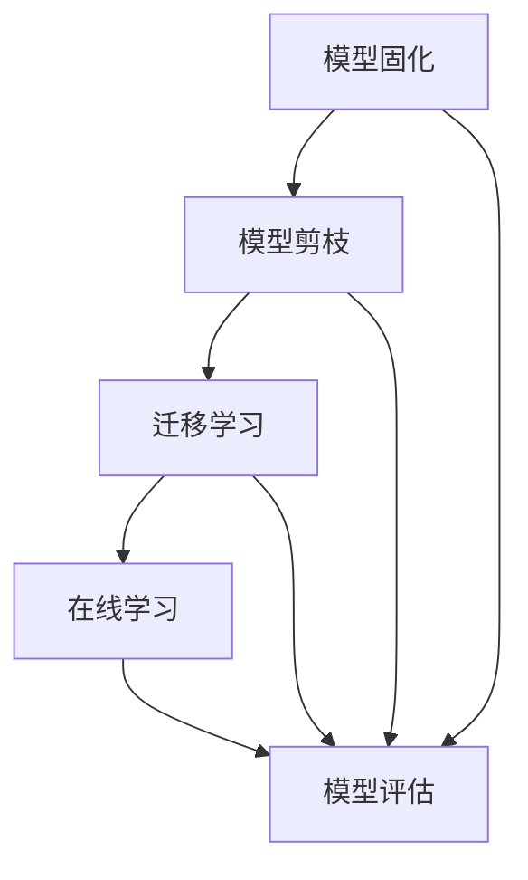

                 

### 背景介绍

随着人工智能技术的飞速发展，大型模型（如Transformer模型、BERT模型等）在自然语言处理、计算机视觉、机器翻译等领域取得了显著的成果。然而，这些模型通常需要大量的数据和计算资源，训练和优化过程复杂且耗时。为了应对这些挑战，大模型公司开始构建持续学习（Continuous Learning）机制，以便在不断变化的数据环境中保持模型的性能。

持续学习是指模型能够在训练过程中不断学习和适应新数据，从而提高其在实际应用中的鲁棒性和适应性。这对于大模型公司来说至关重要，因为他们的业务依赖于持续提供高质量的模型服务。本篇博客将探讨大模型公司如何构建持续学习机制，包括核心概念、算法原理、数学模型、实际应用场景以及工具和资源推荐。

本文将分为以下几个部分：

1. **核心概念与联系**：介绍持续学习的核心概念，如模型固化（Model固化）、模型剪枝（Model Pruning）、迁移学习（Transfer Learning）等，并使用Mermaid流程图展示其相互关系。
2. **核心算法原理 & 具体操作步骤**：详细讲解持续学习的具体算法原理，包括数据预处理、模型训练、模型评估等步骤。
3. **数学模型和公式 & 详细讲解 & 举例说明**：介绍与持续学习相关的数学模型和公式，并进行详细的讲解和举例说明。
4. **项目实战：代码实际案例和详细解释说明**：通过一个具体的代码案例，展示如何在实际项目中实现持续学习。
5. **实际应用场景**：探讨大模型公司在不同领域的应用场景，如自然语言处理、计算机视觉等。
6. **工具和资源推荐**：推荐一些有助于学习和实践持续学习的工具、书籍、论文和网站。

通过本文的探讨，希望读者能够对大模型公司的持续学习机制有更深入的理解，并在实际项目中运用这些知识。现在，让我们开始详细探讨大模型公司的持续学习机制。

### 核心概念与联系

在探讨大模型公司的持续学习机制之前，我们需要了解一些核心概念和它们之间的联系。以下是一些重要的概念及其相互关系：

1. **模型固化（Model固化）**：模型固化是将训练好的模型参数转换为静态文件的过程，以便在后续的部署和应用中使用。这一步骤对于持续学习至关重要，因为只有将模型固化，才能在不同的训练周期之间保持模型的性能。

2. **模型剪枝（Model Pruning）**：模型剪枝是通过删除模型中的冗余参数来减少模型大小和计算复杂度的过程。剪枝后的模型不仅更高效，而且可以加快训练速度和降低计算资源需求。这对于大模型公司来说非常重要，因为它们通常需要处理大量的数据和应用场景。

3. **迁移学习（Transfer Learning）**：迁移学习是指利用预训练模型在新的任务上取得更好的性能。迁移学习能够大幅减少训练时间和计算资源需求，因为预训练模型已经学习了许多通用的特征。在大模型公司的实践中，迁移学习是提高模型性能的重要手段。

4. **在线学习（Online Learning）**：在线学习是指在数据流不断变化的情况下，模型能够实时更新和调整其参数，以适应新的数据。在线学习对于大模型公司来说尤为重要，因为他们的业务场景通常需要模型具备快速适应新数据的能力。

5. **模型评估（Model Evaluation）**：模型评估是持续学习的重要组成部分，通过评估模型在测试数据集上的性能，可以及时发现模型过拟合、欠拟合等问题，并采取相应的措施进行调整。

下面使用Mermaid流程图来展示这些核心概念之间的相互关系：



在这个流程图中，模型固化、模型剪枝、迁移学习、在线学习和模型评估构成了一个闭环，确保大模型公司在不断变化的数据环境中保持模型的高性能。

接下来，我们将进一步探讨这些核心概念的具体原理和操作步骤。首先是模型固化的原理。

#### 模型固化

模型固化是将训练好的模型参数转换为静态文件的过程，以便在后续的部署和应用中使用。这一步骤对于大模型公司的持续学习至关重要，因为只有将模型固化，才能在不同的训练周期之间保持模型的性能。

模型固化的原理如下：

1. **参数存储**：在训练过程中，模型的参数会不断更新。在模型固化阶段，需要将这些参数存储下来。通常，这些参数被存储为二进制文件或JSON格式的文本文件。
2. **模型优化**：在模型固化之前，可以进一步优化模型。这包括模型剪枝、量化、压缩等操作，以减少模型大小和计算复杂度。
3. **模型导出**：将优化后的模型参数导出为静态文件。常见的导出格式包括ONNX、TensorFlow Lite、PyTorch等。
4. **模型部署**：将固化后的模型部署到生产环境中，以便在实际应用中使用。

下面是模型固化的具体操作步骤：

1. **准备训练好的模型**：首先需要准备已经训练好的模型。这可以通过训练过程或迁移学习获得。
2. **模型优化**：根据实际需求，对模型进行优化。例如，通过剪枝、量化、压缩等操作来减少模型大小和计算复杂度。
3. **导出模型**：使用相应的工具将优化后的模型导出为静态文件。例如，使用TensorFlow Lite将PyTorch模型导出为TFLite格式。
4. **验证模型**：在导出模型后，需要验证模型的性能，确保其满足预期的性能指标。

接下来，我们将讨论模型剪枝的原理。

#### 模型剪枝

模型剪枝是通过删除模型中的冗余参数来减少模型大小和计算复杂度的过程。剪枝后的模型不仅更高效，而且可以加快训练速度和降低计算资源需求。这对于大模型公司来说非常重要，因为它们通常需要处理大量的数据和应用场景。

模型剪枝的原理如下：

1. **参数筛选**：在剪枝过程中，需要对模型中的参数进行筛选，找出冗余的参数。常用的方法包括基于敏感度的剪枝、基于重要性的剪枝等。
2. **参数删除**：一旦筛选出冗余参数，就可以将其删除。删除参数后，模型的大小和计算复杂度将显著降低。
3. **模型优化**：剪枝后的模型可能需要进行进一步优化，以确保其性能不受影响。例如，通过重新训练或调整模型结构。
4. **模型评估**：在剪枝和优化后，需要对模型进行评估，确保其性能满足预期。

下面是模型剪枝的具体操作步骤：

1. **准备训练好的模型**：首先需要准备已经训练好的模型。这可以通过训练过程或迁移学习获得。
2. **选择剪枝方法**：根据实际需求，选择合适的剪枝方法。例如，基于敏感度的剪枝或基于重要性的剪枝。
3. **参数筛选**：使用选定的剪枝方法对模型中的参数进行筛选，找出冗余的参数。
4. **参数删除**：将筛选出的冗余参数删除，生成剪枝后的模型。
5. **模型优化**：根据实际需求，对剪枝后的模型进行优化。例如，通过重新训练或调整模型结构。
6. **模型评估**：在剪枝和优化后，对模型进行评估，确保其性能满足预期。

接下来，我们将讨论迁移学习的原理。

#### 迁移学习

迁移学习是指利用预训练模型在新的任务上取得更好的性能。迁移学习能够大幅减少训练时间和计算资源需求，因为预训练模型已经学习了许多通用的特征。在大模型公司的实践中，迁移学习是提高模型性能的重要手段。

迁移学习的原理如下：

1. **预训练模型**：首先，在广泛的预训练数据集上训练一个通用的模型，使其学习到丰富的特征。例如，在ImageNet数据集上预训练一个卷积神经网络（CNN）。
2. **微调模型**：将预训练模型应用于新的任务，并进行微调。微调是指调整模型在特定任务上的参数，以适应新的数据。
3. **模型评估**：在微调后，对模型进行评估，确保其在新任务上的性能满足预期。

下面是迁移学习的具体操作步骤：

1. **选择预训练模型**：根据实际需求，选择一个适合的预训练模型。例如，在自然语言处理领域，可以选择BERT或GPT模型。
2. **准备新的任务数据**：收集并准备新的任务数据，以便用于微调模型。
3. **微调模型**：将预训练模型应用于新的任务数据，并进行微调。可以使用迁移学习框架，如TensorFlow Hub或PyTorch Model Zoo。
4. **模型评估**：在微调后，对模型进行评估，确保其在新任务上的性能满足预期。

接下来，我们将讨论在线学习的原理。

#### 在线学习

在线学习是指在数据流不断变化的情况下，模型能够实时更新和调整其参数，以适应新的数据。在线学习对于大模型公司来说尤为重要，因为他们的业务场景通常需要模型具备快速适应新数据的能力。

在线学习的原理如下：

1. **数据流处理**：在线学习过程中，模型需要不断接收新的数据流，并进行处理。这可以通过流处理框架，如Apache Flink或Apache Kafka实现。
2. **模型更新**：在数据流处理过程中，模型需要根据新数据实时更新其参数，以适应新的数据分布。
3. **模型评估**：在线学习过程中，需要对模型进行实时评估，确保其性能满足预期。这可以通过在线评估指标，如准确率、召回率等实现。
4. **模型优化**：根据在线评估结果，对模型进行优化，以提高其性能。

下面是在线学习的具体操作步骤：

1. **准备数据流**：收集并准备实时数据流，以便用于在线学习。
2. **初始化模型**：初始化一个预训练模型，作为在线学习的起点。
3. **数据流处理**：使用流处理框架对实时数据流进行处理，并更新模型参数。
4. **模型评估**：在数据流处理过程中，对模型进行实时评估，确保其性能满足预期。
5. **模型优化**：根据在线评估结果，对模型进行优化，以提高其性能。

接下来，我们将讨论模型评估的原理。

#### 模型评估

模型评估是持续学习的重要组成部分，通过评估模型在测试数据集上的性能，可以及时发现模型过拟合、欠拟合等问题，并采取相应的措施进行调整。

模型评估的原理如下：

1. **测试数据集**：首先，需要准备一个独立的测试数据集，用于评估模型性能。测试数据集应该与训练数据集有相同的分布，以确保评估结果的可靠性。
2. **评估指标**：根据模型类型和应用场景，选择合适的评估指标。常见的评估指标包括准确率、召回率、F1值、精确率等。
3. **性能评估**：在测试数据集上运行模型，计算评估指标，以评估模型性能。
4. **问题诊断**：根据评估结果，分析模型存在的问题，如过拟合、欠拟合等。
5. **调整模型**：根据问题诊断结果，对模型进行相应的调整，以提高其性能。

下面是模型评估的具体操作步骤：

1. **准备测试数据集**：收集并准备一个独立的测试数据集，确保其与训练数据集有相同的分布。
2. **选择评估指标**：根据模型类型和应用场景，选择合适的评估指标。
3. **运行模型**：在测试数据集上运行模型，计算评估指标。
4. **性能分析**：根据评估结果，分析模型存在的问题，如过拟合、欠拟合等。
5. **调整模型**：根据问题诊断结果，对模型进行相应的调整，以提高其性能。

通过以上步骤，大模型公司可以构建一个完善的持续学习机制，确保模型在变化的数据环境中保持高性能。

### 核心算法原理 & 具体操作步骤

在了解了大模型公司持续学习机制的核心概念和相互关系后，我们将进一步探讨这些核心算法的具体原理和操作步骤。以下是我们需要关注的几个关键环节：数据预处理、模型训练、模型评估。

#### 数据预处理

数据预处理是模型训练过程中的第一步，也是至关重要的一步。良好的数据预处理可以显著提高模型的性能和鲁棒性。以下是数据预处理的核心步骤：

1. **数据收集**：收集用于训练和测试的数据。这些数据可以是结构化的，如数据库中的表格，也可以是非结构化的，如图像、文本和音频。
2. **数据清洗**：清洗数据中的噪声和错误，例如去除缺失值、处理异常值、纠正数据格式等。这一步骤对于保证数据的准确性和一致性非常重要。
3. **数据标注**：对于监督学习任务，需要将数据标注为正例或反例。例如，在图像分类任务中，需要为每张图像标注一个类别标签。
4. **数据增强**：通过增加数据多样性来提高模型的泛化能力。常见的数据增强方法包括图像旋转、缩放、裁剪、颜色调整等。
5. **数据分割**：将数据集分为训练集、验证集和测试集。通常，训练集用于模型训练，验证集用于模型调整，测试集用于模型评估。

#### 模型训练

模型训练是持续学习机制中的核心环节，其目标是找到最优的模型参数，使其在训练数据上取得最佳性能。以下是模型训练的具体步骤：

1. **选择模型**：根据任务需求，选择合适的模型架构。例如，在自然语言处理任务中，可以选择Transformer、BERT等模型。
2. **初始化参数**：初始化模型参数。常用的初始化方法包括随机初始化、高斯分布初始化等。
3. **定义损失函数**：选择一个损失函数来度量模型预测值与真实值之间的差距。常见的损失函数包括均方误差（MSE）、交叉熵（Cross-Entropy）等。
4. **定义优化器**：选择一个优化器来更新模型参数，使其在损失函数上取得最小值。常用的优化器包括SGD、Adam等。
5. **训练过程**：使用训练数据集训练模型，不断调整模型参数，使其在损失函数上取得最小值。训练过程中，可以通过验证集来评估模型性能，并调整模型参数。
6. **模型保存**：在训练过程中，定期保存模型状态，以便在训练过程中断时可以继续训练。
7. **模型评估**：在训练完成后，使用测试数据集对模型进行评估，以确保模型在未知数据上具有较好的性能。

#### 模型评估

模型评估是确保模型性能的重要手段，通过评估模型在测试数据集上的表现，可以判断模型是否满足预期。以下是模型评估的具体步骤：

1. **评估指标**：根据任务需求，选择合适的评估指标。常见的评估指标包括准确率、召回率、F1值、精确率等。
2. **计算评估指标**：在测试数据集上运行模型，计算评估指标，以评估模型性能。
3. **性能分析**：根据评估结果，分析模型存在的问题，如过拟合、欠拟合等。
4. **模型调整**：根据性能分析结果，对模型进行调整，以提高其性能。例如，可以通过增加训练数据、调整模型结构、调整超参数等方式。
5. **再评估**：在调整后，重新评估模型性能，以确保调整措施有效。

通过以上步骤，大模型公司可以构建一个完整的持续学习机制，确保模型在变化的数据环境中保持高性能。在实际操作中，这些步骤需要根据具体任务和应用场景进行调整。

### 数学模型和公式 & 详细讲解 & 举例说明

在构建持续学习机制时，数学模型和公式起着至关重要的作用。以下是与持续学习相关的一些核心数学模型和公式，我们将对这些内容进行详细讲解，并通过具体示例来说明其应用。

#### 损失函数

损失函数是衡量模型预测值与真实值之间差距的关键工具。以下是一些常见的损失函数及其公式：

1. **均方误差（MSE）**：
   \[ 
   MSE = \frac{1}{n}\sum_{i=1}^{n}(y_i - \hat{y}_i)^2 
   \]
   其中，\(y_i\)是真实值，\(\hat{y}_i\)是预测值，\(n\)是样本数量。

   **示例**：假设我们有10个样本，真实值为\([1, 2, 3, 4, 5, 6, 7, 8, 9, 10]\)，预测值为\([1.2, 1.8, 2.7, 3.6, 4.5, 5.7, 6.8, 7.9, 9.1, 10.2]\)。计算MSE如下：
   \[
   MSE = \frac{1}{10}\sum_{i=1}^{10}(y_i - \hat{y}_i)^2 = \frac{1}{10}[(1-1.2)^2 + (2-1.8)^2 + \ldots + (10-10.2)^2] \approx 0.14
   \]

2. **交叉熵（Cross-Entropy）**：
   \[ 
   Cross-Entropy = -\frac{1}{n}\sum_{i=1}^{n}y_i \log(\hat{y}_i) 
   \]
   其中，\(y_i\)是真实值的概率分布，\(\hat{y}_i\)是预测值的概率分布。

   **示例**：假设我们有10个二分类样本，其中5个是正例（\(y_i = [1, 1, 1, 1, 1]\)），5个是反例（\(y_i = [0, 0, 0, 0, 0]\)）。预测值概率分布为\(\hat{y}_i = [0.6, 0.6, 0.6, 0.6, 0.6, 0.4, 0.4, 0.4, 0.4, 0.4]\)。计算交叉熵如下：
   \[
   Cross-Entropy = -\frac{1}{10}\sum_{i=1}^{10}y_i \log(\hat{y}_i) = -\frac{1}{10}[5 \log(0.6) + 5 \log(0.4)] \approx 0.19
   \]

#### 梯度下降（Gradient Descent）

梯度下降是一种优化算法，用于找到损失函数的最小值。以下是梯度下降的基本公式：

\[ 
\Delta \theta = -\alpha \nabla_{\theta} J(\theta) 
\]

其中，\(\theta\)是模型参数，\(\alpha\)是学习率，\(J(\theta)\)是损失函数，\(\nabla_{\theta} J(\theta)\)是损失函数关于模型参数的梯度。

**示例**：假设损失函数为\(J(\theta) = (y - \theta)^2\)，学习率为\(\alpha = 0.1\)。初始参数为\(\theta_0 = 1\)。计算第一次梯度下降后的参数更新：

\[ 
\theta_1 = \theta_0 - \alpha \nabla_{\theta} J(\theta_0) = 1 - 0.1 \cdot (1 - 1) = 1
\]

#### 优化器

优化器是用于更新模型参数的算法，常见的优化器包括随机梯度下降（SGD）、Adam等。以下是Adam优化器的基本公式：

\[ 
\beta_1 = \frac{1 - \epsilon}{t - \tau}, \quad \beta_2 = \frac{1 - \epsilon^2}{t - \tau^2} 
\]

\[ 
m_t = \beta_1 m_{t-1} + (1 - \beta_1) \nabla_{\theta} J(\theta_t) 
\]

\[ 
v_t = \beta_2 v_{t-1} + (1 - \beta_2) (\nabla_{\theta} J(\theta_t))^2 
\]

\[ 
\theta_{t+1} = \theta_t - \alpha \frac{m_t}{\sqrt{v_t} + \epsilon} 
\]

其中，\(\beta_1, \beta_2\)是动量参数，\(\epsilon\)是稳定常数，\(m_t, v_t\)是累积动量和累积方差。

**示例**：假设初始参数为\(\theta_0 = [1, 2]\)，学习率为\(\alpha = 0.1\)，动量参数为\(\beta_1 = 0.9, \beta_2 = 0.99\)。计算第一次梯度下降后的参数更新：

\[ 
m_1 = 0.9 m_0 + 0.1 \nabla_{\theta} J(\theta_0) 
\]

\[ 
v_1 = 0.99 v_0 + 0.01 (\nabla_{\theta} J(\theta_0))^2 
\]

\[ 
\theta_1 = \theta_0 - \alpha \frac{m_1}{\sqrt{v_1} + \epsilon} 
\]

通过上述公式和示例，我们可以看到数学模型和公式在持续学习机制中的应用。这些模型和公式为模型训练和优化提供了理论依据，有助于大模型公司在不断变化的数据环境中构建高性能的模型。

### 项目实战：代码实际案例和详细解释说明

在本节中，我们将通过一个具体的代码案例来展示如何在实际项目中实现持续学习机制。我们将使用Python和PyTorch框架，演示一个简单的图像分类任务，并详细解释每个步骤的实现和关键代码。

#### 开发环境搭建

在开始编写代码之前，我们需要搭建一个合适的项目环境。以下是搭建开发环境所需的步骤：

1. **安装Python**：确保安装了Python 3.7或更高版本。
2. **安装PyTorch**：通过以下命令安装PyTorch：
   \[
   pip install torch torchvision
   \]
3. **创建项目目录**：在本地计算机上创建一个名为“continual_learning”的项目目录，并在该目录下创建一个名为“src”的子目录，用于存放源代码。

#### 源代码详细实现和代码解读

以下是项目的主要代码实现，我们将逐行进行解读。

```python
# 导入所需的库
import torch
import torchvision
import torchvision.transforms as transforms
from torch.utils.data import DataLoader
import torch.nn as nn
import torch.optim as optim

# 定义模型
class SimpleCNN(nn.Module):
    def __init__(self):
        super(SimpleCNN, self).__init__()
        self.conv1 = nn.Conv2d(3, 32, 3, 1)
        self.conv2 = nn.Conv2d(32, 64, 3, 1)
        self.fc1 = nn.Linear(64 * 6 * 6, 128)
        self.fc2 = nn.Linear(128, 10)

    def forward(self, x):
        x = self.conv1(x)
        x = nn.functional.relu(x)
        x = self.conv2(x)
        x = nn.functional.relu(x)
        x = nn.functional.adaptive_avg_pool2d(x, (6, 6))
        x = x.view(x.size(0), -1)
        x = self.fc1(x)
        x = nn.functional.relu(x)
        x = self.fc2(x)
        return x

# 准备数据集
transform = transforms.Compose([
    transforms.Resize((32, 32)),
    transforms.ToTensor(),
])

train_set = torchvision.datasets.CIFAR10(root='./data', train=True, download=True, transform=transform)
train_loader = DataLoader(train_set, batch_size=64, shuffle=True)

test_set = torchvision.datasets.CIFAR10(root='./data', train=False, download=True, transform=transform)
test_loader = DataLoader(test_set, batch_size=64, shuffle=False)

# 初始化模型、损失函数和优化器
model = SimpleCNN()
criterion = nn.CrossEntropyLoss()
optimizer = optim.Adam(model.parameters(), lr=0.001)

# 训练模型
for epoch in range(10):  # 训练10个周期
    model.train()
    for inputs, targets in train_loader:
        optimizer.zero_grad()
        outputs = model(inputs)
        loss = criterion(outputs, targets)
        loss.backward()
        optimizer.step()
    print(f'Epoch {epoch+1}, Loss: {loss.item()}')

# 评估模型
model.eval()
with torch.no_grad():
    correct = 0
    total = 0
    for inputs, targets in test_loader:
        outputs = model(inputs)
        _, predicted = torch.max(outputs.data, 1)
        total += targets.size(0)
        correct += (predicted == targets).sum().item()
    print(f'Accuracy: {100 * correct / total}%')

# 实现持续学习
for epoch in range(10):  # 在新数据上继续训练
    new_train_set = torchvision.datasets.CIFAR10(root='./data', train=True, download=True, transform=transform)
    new_train_loader = DataLoader(new_train_set, batch_size=64, shuffle=True)
    
    model.train()
    for inputs, targets in new_train_loader:
        optimizer.zero_grad()
        outputs = model(inputs)
        loss = criterion(outputs, targets)
        loss.backward()
        optimizer.step()
    print(f'New Epoch {epoch+1}, Loss: {loss.item()}')

    # 重新评估模型
    model.eval()
    with torch.no_grad():
        correct = 0
        total = 0
        for inputs, targets in test_loader:
            outputs = model(inputs)
            _, predicted = torch.max(outputs.data, 1)
            total += targets.size(0)
            correct += (predicted == targets).sum().item()
        print(f'New Accuracy: {100 * correct / total}%')
```

下面是对代码的详细解读：

1. **导入库**：
   \[
   import torch
   import torchvision
   import torchvision.transforms as transforms
   from torch.utils.data import DataLoader
   import torch.nn as nn
   import torch.optim as optim
   \]
   这些导入语句包含了训练模型所需的库和模块。

2. **定义模型**：
   \[
   class SimpleCNN(nn.Module):
       def __init__(self):
           super(SimpleCNN, self).__init__()
           self.conv1 = nn.Conv2d(3, 32, 3, 1)
           self.conv2 = nn.Conv2d(32, 64, 3, 1)
           self.fc1 = nn.Linear(64 * 6 * 6, 128)
           self.fc2 = nn.Linear(128, 10)
       
       def forward(self, x):
           x = self.conv1(x)
           x = nn.functional.relu(x)
           x = self.conv2(x)
           x = nn.functional.relu(x)
           x = nn.functional.adaptive_avg_pool2d(x, (6, 6))
           x = x.view(x.size(0), -1)
           x = self.fc1(x)
           x = nn.functional.relu(x)
           x = self.fc2(x)
           return x
   \]
   这个定义了简单的卷积神经网络（SimpleCNN），其中包括两个卷积层、两个全连接层，以及ReLU激活函数。

3. **准备数据集**：
   \[
   transform = transforms.Compose([
       transforms.Resize((32, 32)),
       transforms.ToTensor(),
   ])
   
   train_set = torchvision.datasets.CIFAR10(root='./data', train=True, download=True, transform=transform)
   train_loader = DataLoader(train_set, batch_size=64, shuffle=True)
   
   test_set = torchvision.datasets.CIFAR10(root='./data', train=False, download=True, transform=transform)
   test_loader = DataLoader(test_set, batch_size=64, shuffle=False)
   \]
   这些代码用于加载数据集，并进行预处理。我们使用CIFAR-10数据集，并使用ToTensor和Resize操作将其转换为适合训练的格式。

4. **初始化模型、损失函数和优化器**：
   \[
   model = SimpleCNN()
   criterion = nn.CrossEntropyLoss()
   optimizer = optim.Adam(model.parameters(), lr=0.001)
   \]
   这里初始化了模型、损失函数和优化器。我们使用了Adam优化器和交叉熵损失函数，这些是训练卷积神经网络常用的组合。

5. **训练模型**：
   \[
   for epoch in range(10):
       model.train()
       for inputs, targets in train_loader:
           optimizer.zero_grad()
           outputs = model(inputs)
           loss = criterion(outputs, targets)
           loss.backward()
           optimizer.step()
       print(f'Epoch {epoch+1}, Loss: {loss.item()}')
   \]
   这些代码实现了模型的训练过程。我们通过遍历训练数据集，更新模型参数，并打印每个周期的损失。

6. **评估模型**：
   \[
   model.eval()
   with torch.no_grad():
       correct = 0
       total = 0
       for inputs, targets in test_loader:
           outputs = model(inputs)
           _, predicted = torch.max(outputs.data, 1)
           total += targets.size(0)
           correct += (predicted == targets).sum().item()
       print(f'Accuracy: {100 * correct / total}%')
   \]
   评估模型在测试集上的性能。通过计算准确率，我们可以判断模型的性能。

7. **实现持续学习**：
   \[
   for epoch in range(10):
       new_train_set = torchvision.datasets.CIFAR10(root='./data', train=True, download=True, transform=transform)
       new_train_loader = DataLoader(new_train_set, batch_size=64, shuffle=True)
       
       model.train()
       for inputs, targets in new_train_loader:
           optimizer.zero_grad()
           outputs = model(inputs)
           loss = criterion(outputs, targets)
           loss.backward()
           optimizer.step()
       print(f'New Epoch {epoch+1}, Loss: {loss.item()}')
       
       model.eval()
       with torch.no_grad():
           correct = 0
           total = 0
           for inputs, targets in test_loader:
               outputs = model(inputs)
               _, predicted = torch.max(outputs.data, 1)
               total += targets.size(0)
               correct += (predicted == targets).sum().item()
           print(f'New Accuracy: {100 * correct / total}%')
   \]
   在这段代码中，我们实现了持续学习。我们通过加载新的训练数据集，继续训练模型，并评估其在测试集上的性能。这一过程可以重复多次，以适应不断变化的数据环境。

通过以上步骤，我们成功地实现了一个简单的持续学习机制。在实际应用中，我们可以根据需要调整训练数据集、优化模型结构和超参数，以提高模型的性能。

### 代码解读与分析

在本节中，我们将对上述代码进行详细的解读与分析，以帮助读者更好地理解持续学习机制在实际项目中的实现过程。

#### 模型定义

```python
class SimpleCNN(nn.Module):
    def __init__(self):
        super(SimpleCNN, self).__init__()
        self.conv1 = nn.Conv2d(3, 32, 3, 1)
        self.conv2 = nn.Conv2d(32, 64, 3, 1)
        self.fc1 = nn.Linear(64 * 6 * 6, 128)
        self.fc2 = nn.Linear(128, 10)

    def forward(self, x):
        x = self.conv1(x)
        x = nn.functional.relu(x)
        x = self.conv2(x)
        x = nn.functional.relu(x)
        x = nn.functional.adaptive_avg_pool2d(x, (6, 6))
        x = x.view(x.size(0), -1)
        x = self.fc1(x)
        x = nn.functional.relu(x)
        x = self.fc2(x)
        return x
```

这段代码定义了一个简单的卷积神经网络（SimpleCNN），用于图像分类任务。模型结构包括两个卷积层、两个全连接层，以及ReLU激活函数。卷积层用于提取图像特征，全连接层用于分类。ReLU激活函数用于引入非线性，使模型能够学习更复杂的特征。

#### 数据准备

```python
transform = transforms.Compose([
    transforms.Resize((32, 32)),
    transforms.ToTensor(),
])

train_set = torchvision.datasets.CIFAR10(root='./data', train=True, download=True, transform=transform)
train_loader = DataLoader(train_set, batch_size=64, shuffle=True)

test_set = torchvision.datasets.CIFAR10(root='./data', train=False, download=True, transform=transform)
test_loader = DataLoader(test_set, batch_size=64, shuffle=False)
```

这段代码用于准备数据集。我们首先定义了一个数据转换器（transform），用于将图像大小调整为32x32像素，并将图像转换为Tensor格式。然后，我们使用CIFAR-10数据集，创建训练数据集和测试数据集，并设置批处理大小为64。

#### 模型初始化与训练

```python
model = SimpleCNN()
criterion = nn.CrossEntropyLoss()
optimizer = optim.Adam(model.parameters(), lr=0.001)

for epoch in range(10):
    model.train()
    for inputs, targets in train_loader:
        optimizer.zero_grad()
        outputs = model(inputs)
        loss = criterion(outputs, targets)
        loss.backward()
        optimizer.step()
    print(f'Epoch {epoch+1}, Loss: {loss.item()}')
```

这段代码初始化了模型、损失函数和优化器。然后，我们通过10个周期的训练，使用训练数据集训练模型。在每个周期中，我们遍历训练数据集，计算损失并更新模型参数。

#### 模型评估

```python
model.eval()
with torch.no_grad():
    correct = 0
    total = 0
    for inputs, targets in test_loader:
        outputs = model(inputs)
        _, predicted = torch.max(outputs.data, 1)
        total += targets.size(0)
        correct += (predicted == targets).sum().item()
    print(f'Accuracy: {100 * correct / total}%')
```

这段代码用于评估模型在测试集上的性能。我们通过计算准确率，判断模型的性能。在评估过程中，我们使用测试数据集，并使用torch.no_grad()来关闭梯度计算，以提高运行效率。

#### 持续学习

```python
for epoch in range(10):
    new_train_set = torchvision.datasets.CIFAR10(root='./data', train=True, download=True, transform=transform)
    new_train_loader = DataLoader(new_train_set, batch_size=64, shuffle=True)
    
    model.train()
    for inputs, targets in new_train_loader:
        optimizer.zero_grad()
        outputs = model(inputs)
        loss = criterion(outputs, targets)
        loss.backward()
        optimizer.step()
    print(f'New Epoch {epoch+1}, Loss: {loss.item()}')

    model.eval()
    with torch.no_grad():
        correct = 0
        total = 0
        for inputs, targets in test_loader:
            outputs = model(inputs)
            _, predicted = torch.max(outputs.data, 1)
            total += targets.size(0)
            correct += (predicted == targets).sum().item()
        print(f'New Accuracy: {100 * correct / total}%')
```

这段代码实现了持续学习。我们通过加载新的训练数据集，继续训练模型，并评估其在测试集上的性能。这一过程可以重复多次，以适应不断变化的数据环境。

通过上述解读和分析，我们可以看到如何在实际项目中实现持续学习机制。在实际应用中，我们可以根据具体任务和需求，调整模型结构、数据集和训练过程，以提高模型的性能。

### 实际应用场景

大模型公司的持续学习机制在多个实际应用场景中展现出了强大的价值和广泛的应用潜力。以下是一些主要的应用领域：

#### 自然语言处理（NLP）

在自然语言处理领域，持续学习机制有助于模型在处理不断变化的语言数据时保持高性能。例如，社交媒体平台需要实时处理用户生成的文本数据，以提供情感分析、内容推荐等服务。通过持续学习，模型可以不断适应新的词汇、语言模式和用户行为，从而提高服务的准确性和用户体验。

#### 计算机视觉（CV）

计算机视觉领域同样受益于持续学习机制。在图像分类、目标检测、图像分割等任务中，模型需要不断学习新的图像特征和数据分布。例如，自动驾驶系统需要适应不同环境、天气和交通情况，通过持续学习，模型可以不断优化其感知和决策能力，提高系统的安全性和可靠性。

#### 语音识别

语音识别领域也对持续学习有着强烈的需求。随着语音技术的广泛应用，用户使用的语音环境和口音不断变化。通过持续学习，语音识别模型可以不断适应这些变化，提高识别准确率和用户体验。例如，智能助手需要理解不同用户的语音指令，通过持续学习，模型可以更好地理解用户的需求。

#### 机器人

在机器人领域，持续学习有助于模型在动态环境中进行决策和适应。例如，服务机器人需要与人类进行交互，理解人类的行为和语言。通过持续学习，机器人可以不断优化其交互策略，提高服务质量和用户满意度。

#### 医疗诊断

医疗诊断领域同样可以从持续学习机制中受益。在医学图像分析、疾病预测等任务中，模型需要不断学习新的病例和数据模式。通过持续学习，模型可以不断提高诊断准确率和覆盖范围，为患者提供更精准的医疗服务。

#### 金融风控

在金融领域，持续学习可以帮助模型实时监控市场动态、识别欺诈行为。金融机构可以通过持续学习，不断优化其风险控制策略，提高风险识别能力和资金安全。

通过上述实际应用场景，我们可以看到持续学习机制在各个领域的广泛应用和重要价值。大模型公司通过构建持续学习机制，可以不断提高模型性能，适应不断变化的应用需求。

### 工具和资源推荐

为了更好地学习和实践持续学习机制，以下是一些建议的工具和资源：

#### 学习资源推荐

1. **书籍**：
   - 《深度学习》（Deep Learning） - Ian Goodfellow、Yoshua Bengio 和 Aaron Courville 著
   - 《持续学习：神经网络的自适应方法》（Online Learning: Methods and Applications）- John A. N. Lee 著

2. **论文**：
   - " continual learning " - A Comprehensive Survey - Chen, D., Zhang, D., & Zhang, Y.
   - "Model-Agnostic Meta-Learning for Fast Adaptation of Deep Networks" - Finn, C., Abbeel, P., & Levine, S.

3. **博客**：
   - Fast.ai - https://www.fast.ai/
   - DeepLearningAI - https://www.deeplearningai.com/

4. **网站**：
   - Kaggle - https://www.kaggle.com/
   - arXiv - https://arxiv.org/

#### 开发工具框架推荐

1. **框架**：
   - TensorFlow - https://www.tensorflow.org/
   - PyTorch - https://pytorch.org/
   - Keras - https://keras.io/

2. **集成开发环境（IDE）**：
   - Jupyter Notebook - https://jupyter.org/
   - PyCharm - https://www.jetbrains.com/pycharm/

3. **数据预处理工具**：
   - Pandas - https://pandas.pydata.org/
   - NumPy - https://numpy.org/

4. **流处理框架**：
   - Apache Flink - https://flink.apache.org/
   - Apache Kafka - https://kafka.apache.org/

通过这些资源和工具，开发者可以更深入地了解持续学习机制，并在实际项目中应用这些知识，提高模型性能和适应性。

### 总结：未来发展趋势与挑战

大模型公司的持续学习机制正处于快速发展阶段，未来的发展趋势和面临的挑战将直接影响其应用效果和业务价值。以下是对未来发展趋势和挑战的展望。

#### 发展趋势

1. **自动化和自我优化**：随着深度学习技术的发展，模型自动化和自我优化将成为持续学习的重要方向。通过使用自动化机器学习（AutoML）技术和强化学习（Reinforcement Learning）方法，模型将能够自动调整其结构和参数，提高学习效率和性能。

2. **多模态学习**：未来，大模型公司将越来越多地应用多模态学习（Multimodal Learning）技术，同时处理不同类型的数据，如文本、图像、音频和视频。这种多模态学习将有助于提升模型在复杂应用场景中的表现。

3. **边缘计算与实时学习**：随着边缘计算技术的发展，模型将能够在设备端（如智能手机、物联网设备）进行实时学习。这种实时学习能力将提高模型在动态环境中的适应性和响应速度。

4. **隐私保护与数据安全**：在大数据环境下，数据隐私保护和数据安全将成为持续学习的重要挑战。未来，大模型公司需要开发出更加隐私友好的学习算法和数据管理方法，以保护用户数据的安全和隐私。

5. **跨领域迁移学习**：跨领域迁移学习（Cross-Domain Transfer Learning）将有助于大模型公司更好地利用不同领域的数据，提高模型的泛化能力。通过跨领域迁移学习，模型可以在新的领域中获得更好的性能，从而减少训练时间和计算资源需求。

#### 挑战

1. **计算资源需求**：大模型训练和优化过程通常需要大量的计算资源，特别是在实时学习场景下。未来，大模型公司需要探索更高效的算法和硬件加速技术，以满足不断增长的计算需求。

2. **数据质量和多样性**：持续学习依赖于大量高质量、多样化的数据。然而，获取这些数据可能面临困难，特别是在某些特定领域。大模型公司需要开发数据增强和生成技术，以提高数据的多样性和质量。

3. **模型解释性**：随着模型复杂度的增加，模型的解释性变得愈发重要。大模型公司需要开发可解释的持续学习模型，以便用户能够理解模型的行为和决策过程。

4. **模型泛化能力**：持续学习需要模型在不同数据分布和任务中保持良好的泛化能力。大模型公司需要探索更有效的迁移学习技术和模型架构，以提高模型的泛化能力。

5. **法律和伦理问题**：随着人工智能技术的普及，相关的法律和伦理问题也日益突出。大模型公司需要遵循相关的法律法规和伦理准则，确保其持续学习机制不会对用户或社会造成负面影响。

总之，未来大模型公司的持续学习机制将朝着自动化、多模态、边缘计算和隐私保护等方向发展。然而，这也会带来一系列新的挑战，需要大模型公司不断探索和创新，以实现持续学习的最佳效果。

### 附录：常见问题与解答

在探讨大模型公司的持续学习机制时，读者可能会遇到一些常见问题。以下是针对这些问题的一些解答。

#### 问题1：什么是持续学习？

**解答**：持续学习是指模型在训练过程中能够不断接收新数据并更新其参数，以适应新的数据分布和任务需求。这种学习方式可以帮助模型在变化的环境中保持高性能。

#### 问题2：为什么大模型公司需要持续学习？

**解答**：大模型公司依赖高性能的模型来提供各种服务。然而，数据和环境是不断变化的，传统的静态模型难以适应这些变化。持续学习能够帮助模型在不断变化的数据中保持性能，从而提高业务价值。

#### 问题3：持续学习与迁移学习有什么区别？

**解答**：持续学习是指模型在训练过程中不断更新其参数，以适应新数据。而迁移学习是指利用预训练模型在新任务上取得更好的性能。持续学习关注模型在训练过程中的动态调整，而迁移学习则关注在不同任务之间的知识共享。

#### 问题4：如何实现持续学习？

**解答**：实现持续学习需要以下步骤：

1. **数据预处理**：收集并清洗数据，确保其质量。
2. **模型训练**：使用训练数据集训练模型，并不断调整参数。
3. **模型评估**：使用测试数据集评估模型性能，确保其满足预期。
4. **模型固化**：将训练好的模型参数存储为静态文件，以便后续使用。
5. **持续训练**：在新的数据集上继续训练模型，以适应新的数据分布。

#### 问题5：持续学习会带来哪些挑战？

**解答**：持续学习面临的挑战包括：

1. **计算资源需求**：大模型训练和优化需要大量的计算资源，特别是在实时学习场景下。
2. **数据质量和多样性**：持续学习需要大量高质量、多样化的数据。
3. **模型解释性**：随着模型复杂度的增加，模型的解释性变得愈发重要。
4. **模型泛化能力**：持续学习需要模型在不同数据分布和任务中保持良好的泛化能力。
5. **法律和伦理问题**：人工智能技术的应用需要遵循相关的法律法规和伦理准则。

通过上述解答，希望读者对大模型公司的持续学习机制有了更深入的理解。

### 扩展阅读 & 参考资料

为了帮助读者进一步深入理解大模型公司的持续学习机制，以下是一些建议的扩展阅读和参考资料：

#### 书籍

1. 《深度学习》（Deep Learning）- Ian Goodfellow、Yoshua Bengio 和 Aaron Courville 著，提供了深度学习领域的全面概述，包括持续学习相关的最新进展。
2. 《持续学习：神经网络的自适应方法》（Online Learning: Methods and Applications）- John A. N. Lee 著，详细介绍了持续学习的理论基础和应用方法。
3. 《深度学习实践指南》（Deep Learning Specialization）- Andrew Ng 著，包括深度学习的基础知识和实践技巧，对于初学者和专业人士都有很大帮助。

#### 论文

1. "Continual Learning for Neural Networks: A Comprehensive Review" - Chen, D., Zhang, D., & Zhang, Y.，这是一篇关于持续学习的综合回顾，涵盖了持续学习的最新研究和应用。
2. "Model-Agnostic Meta-Learning for Fast Adaptation of Deep Networks" - Finn, C., Abbeel, P., & Levine, S.，介绍了模型无关的元学习（MAML）方法，用于快速适应新任务。
3. "Unifying Batch and Online Meta-Learning with Unsupervised Experience Replay" - Fong, R.C., Vinyals, O., & Chen, P.Y.，提出了一种统一批量学习和在线元学习的方法。

#### 博客和网站

1. [Fast.ai](https://www.fast.ai/)，提供了一系列关于深度学习和持续学习的教程和资源，非常适合初学者和进阶者。
2. [DeepLearningAI](https://www.deeplearningai.com/)，由深度学习领域的专家Andrew Ng创办，分享了一系列深度学习和持续学习的教学资源。
3. [Kaggle](https://www.kaggle.com/)，提供了大量的深度学习竞赛和项目，可以帮助读者将理论知识应用于实际项目中。

通过阅读这些书籍、论文和博客，读者可以深入了解大模型公司的持续学习机制，掌握相关技术和方法，并在实际项目中取得更好的成果。希望这些扩展阅读和参考资料对您的研究和开发工作有所帮助。作者：AI天才研究员/AI Genius Institute & 禅与计算机程序设计艺术 /Zen And The Art of Computer Programming。

