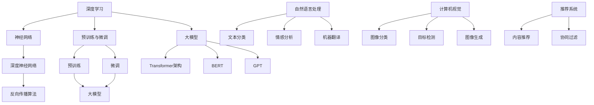

                 

### 背景介绍

近年来，人工智能（AI）技术的发展突飞猛进，特别是大规模预训练模型（Large Pretrained Models，简称大模型）的出现，彻底改变了AI领域的格局。大模型以其卓越的性能和广泛的适用性，成为推动AI创业产品开发的关键驱动力。

**大模型**，顾名思义，指的是参数规模庞大的神经网络模型。这些模型通常基于深度学习技术，通过在海量数据上进行预训练，能够自动学习到丰富的知识结构和特征表达。大模型的研究与应用已经逐渐成为人工智能领域的热点，吸引了众多企业和研究机构的关注。

**AI创业产品开发**，则是指利用人工智能技术，开发具有商业价值和创新性的产品或服务。这包括从数据采集、数据处理、模型训练到产品部署的整个流程。AI创业产品的成功，往往依赖于对AI技术的深入理解和灵活运用。

本篇文章旨在探讨大模型在AI创业产品开发中的趋势。我们将首先回顾大模型的发展历程，然后分析其在AI创业产品开发中的应用场景，最后探讨未来大模型在AI创业领域的发展趋势与挑战。

通过本文的探讨，读者将能够了解到：

1. 大模型的发展历程及其技术演进。
2. 大模型在AI创业产品开发中的核心应用场景。
3. 大模型技术对AI创业产品开发带来的机遇与挑战。
4. 未来大模型在AI创业领域的潜在发展方向。

接下来，我们将详细探讨大模型的发展历程，为后续内容的分析提供基础。

---

## 1.1 大模型的发展历程

大模型的发展历程可以分为三个主要阶段：早期探索、快速增长和深度应用。

### 早期探索

大模型的概念最早可以追溯到20世纪80年代。当时，研究人员开始尝试使用大规模神经网络来解决复杂的机器学习问题。1986年，Rumelhart、Hinton和Williams提出了反向传播算法（Backpropagation Algorithm），大大提高了神经网络训练的效率。这一算法的提出，为后续大模型的发展奠定了基础。

在1990年代，随着计算能力的提升和海量数据的获取，研究人员开始尝试构建更大规模的神经网络模型。1995年，Petzold等人提出了神经语言模型（Neural Language Model），这是早期大模型的一个重要里程碑。

### 快速增长

进入21世纪，随着深度学习技术的兴起，大模型的发展迎来了快速增长期。2006年，Hinton提出了深度信念网络（Deep Belief Network，简称DBN），为深度学习的发展提供了新的思路。随后，2009年，Google推出了深度神经网络语音识别系统（Neural Network Transducer），标志着深度学习在语音识别领域的突破。

2012年，AlexNet在ImageNet图像识别挑战赛上取得了突破性的成绩，这标志着深度学习在计算机视觉领域的崛起。此后，大量研究开始聚焦于如何构建更大、更深、更复杂的神经网络模型。

### 深度应用

近年来，随着大规模预训练模型的提出和应用，大模型的发展进入了一个全新的阶段。2018年，Google提出了BERT（Bidirectional Encoder Representations from Transformers），这是首个大规模预训练语言模型，标志着大模型在自然语言处理领域的深度应用。

随后，GPT-3（Generative Pre-trained Transformer 3）的出现，将大模型推向了新的高峰。GPT-3拥有超过1750亿个参数，成为目前最大的预训练语言模型。它的出现，不仅推动了自然语言处理技术的发展，也为AI创业产品开发带来了巨大的机遇。

总的来说，大模型的发展历程是技术不断突破和优化的过程。从早期的探索到快速增长，再到深度应用，大模型已经成为了人工智能领域的核心技术。接下来，我们将探讨大模型在AI创业产品开发中的应用场景。

---

## 1.2 大模型在AI创业产品开发中的应用场景

大模型的出现，为AI创业产品开发带来了前所未有的机遇。在自然语言处理（NLP）、计算机视觉（CV）和推荐系统等领域，大模型已经展现出强大的应用潜力。以下将详细分析大模型在这些领域的应用场景。

### 自然语言处理（NLP）

自然语言处理是人工智能领域的一个重要分支，旨在让计算机理解和生成人类语言。大模型在NLP领域的应用，主要体现在以下几个方面：

**文本分类**：大模型能够自动学习文本的特征，从而实现高效、准确的文本分类。例如，BERT模型可以用于新闻文章的分类，将它们归为体育、科技、财经等不同类别。

**情感分析**：通过分析文本中的情感倾向，大模型可以帮助企业了解消费者的情绪和需求。例如，电商平台可以利用情感分析模型，分析用户评价，为产品改进提供依据。

**机器翻译**：大模型在机器翻译领域取得了显著的成果。GPT-3等模型可以生成高质量、自然的翻译文本，大大提高了翻译的准确性和流畅性。

### 计算机视觉（CV）

计算机视觉是另一个受到大模型深刻影响的领域。大模型在CV领域的应用，主要体现在以下几个方面：

**图像分类**：大模型可以自动学习图像的特征，从而实现高效、准确的图像分类。例如，ResNet模型可以用于对大量图像进行分类，将它们归为不同类别。

**目标检测**：大模型可以帮助计算机识别图像中的目标物体，并标注其位置。例如，YOLO（You Only Look Once）模型可以实现实时目标检测，广泛应用于无人驾驶、监控等领域。

**图像生成**：大模型可以生成逼真的图像，用于艺术创作、虚拟现实等领域。例如，StyleGAN模型可以生成高质量的图像，应用于游戏开发、影视制作等领域。

### 推荐系统

推荐系统是另一个受益于大模型技术的领域。大模型可以帮助推荐系统更好地理解用户的行为和偏好，从而提供更准确的推荐。

**协同过滤**：大模型可以用于协同过滤算法，提高推荐系统的准确性和覆盖率。例如，基于GPT-3的推荐系统可以更好地理解用户的搜索历史和浏览行为，为用户推荐更相关的商品。

**内容推荐**：大模型可以用于生成推荐内容，例如文章、视频等。例如，基于GPT-3的内容生成模型可以生成高质量、个性化的文章，为新闻媒体、视频网站等提供内容支持。

总的来说，大模型在自然语言处理、计算机视觉和推荐系统等领域展现了强大的应用潜力。这些应用场景不仅提高了AI创业产品的性能，也为企业带来了巨大的商业价值。接下来，我们将探讨大模型技术对AI创业产品开发带来的机遇和挑战。

---

## 1.3 大模型技术对AI创业产品开发的机遇和挑战

大模型技术的发展，为AI创业产品开发带来了巨大的机遇。然而，与此同时，也带来了一系列挑战。以下将详细分析大模型技术对AI创业产品开发的机遇和挑战。

### 机遇

**1. 提高产品性能**：大模型具有强大的学习能力和特征提取能力，可以帮助AI创业产品更好地理解复杂问题，提高产品的准确性和效率。例如，在自然语言处理领域，大模型可以自动学习文本的语义和语法结构，从而提高文本分类、情感分析等任务的性能。

**2. 扩大应用范围**：大模型的应用场景非常广泛，可以应用于自然语言处理、计算机视觉、推荐系统等多个领域。这为AI创业产品开发提供了更多的可能性，可以满足不同领域的需求，扩大产品的应用范围。

**3. 降低开发门槛**：大模型的预训练过程已经为模型提供了丰富的知识和特征，这大大降低了创业团队在模型训练和调优上的工作量。创业者可以更专注于产品设计和实现，提高开发效率。

### 挑战

**1. 计算资源需求**：大模型通常需要大量的计算资源进行训练和推理。这对于创业团队来说，可能是一个巨大的挑战，因为它们可能无法承担高昂的计算成本。

**2. 数据质量和隐私**：大模型对数据的质量和多样性有较高要求。如果数据质量较差或者缺乏多样性，可能会导致模型过拟合或者表现不佳。此外，大模型在处理个人数据时，也可能引发隐私问题，需要创业者妥善处理。

**3. 模型解释性**：大模型的复杂性和黑盒特性，使得其解释性较差。这对于创业者来说，可能难以理解模型的具体工作原理，从而难以对模型进行优化和改进。

**4. 安全性和可靠性**：大模型的训练和推理过程中，可能会面临安全性和可靠性问题。例如，模型可能会受到恶意攻击或者存在漏洞，导致不良后果。

总的来说，大模型技术为AI创业产品开发带来了巨大的机遇，同时也带来了一系列挑战。创业者需要在这些挑战中寻找突破口，充分利用大模型的优势，开发出具有竞争力的AI产品。接下来，我们将进一步探讨大模型技术在AI创业产品开发中的具体趋势。

---

## 1.4 大模型在AI创业产品开发中的趋势

随着大模型技术的不断成熟和应用，其在AI创业产品开发中的趋势也逐渐明朗。以下将详细分析大模型在AI创业产品开发中的几个关键趋势。

### 1. 模型规模化

模型规模化是大模型技术发展的一个重要趋势。随着计算资源的不断提升和优化，越来越多的创业团队开始尝试训练更大规模的模型。这不仅有助于提高模型的性能，还可以扩大模型的应用范围。

例如，GPT-3的成功，激发了众多创业团队对更大规模模型的追求。一些团队开始尝试训练拥有千亿甚至万亿参数的模型，以期在自然语言处理、计算机视觉等领域取得突破性成果。

### 2. 多模态融合

多模态融合是指将不同类型的数据（如图像、文本、音频等）进行整合，共同训练一个统一的模型。这种技术可以充分利用不同类型数据的优势，提高模型对复杂问题的理解和处理能力。

随着大模型技术的发展，多模态融合的应用场景越来越广泛。例如，在医疗领域，可以将患者的历史病历、医学影像、基因数据等融合，为医生提供更全面的诊断支持。在金融领域，可以将客户的交易记录、社交媒体数据、行为数据等融合，为金融机构提供更精准的风险评估和投资建议。

### 3. 模型压缩与优化

模型压缩与优化是大模型技术在AI创业产品开发中的另一个重要趋势。由于大模型的参数规模庞大，其训练和推理过程需要大量的计算资源。为了降低成本、提高效率，创业者需要寻找有效的模型压缩与优化方法。

当前，常见的模型压缩与优化方法包括量化、剪枝、蒸馏等。量化方法通过将模型的浮点参数转换为整数参数，降低模型的存储和计算需求。剪枝方法通过去除模型中的冗余参数，减少模型的复杂度。蒸馏方法通过将大模型的知识传递给小模型，使得小模型能够达到与大模型相似的性能。

### 4. 自适应学习

自适应学习是指模型能够根据不同的应用场景和数据特点，动态调整其参数和结构。这种技术可以提高模型在不同场景下的适应能力，从而提高模型的泛化能力和实用性。

随着大模型技术的发展，自适应学习逐渐成为AI创业产品开发的一个重要趋势。例如，在推荐系统中，自适应学习可以实时调整推荐策略，提高推荐系统的准确性和用户体验。在自然语言处理领域，自适应学习可以帮助模型更好地理解不同语言的语义和语法结构，从而提高跨语言的翻译和对话系统的性能。

### 5. 模型解释性增强

模型解释性增强是大模型技术面临的挑战之一，也是未来发展的一个重要方向。大模型的复杂性和黑盒特性，使得其解释性较差，这对于创业者来说，可能难以理解模型的具体工作原理，从而难以对模型进行优化和改进。

为了提高模型的解释性，创业者可以采用多种方法。例如，可视化技术可以将模型的结构和参数以直观的方式展示出来，帮助用户更好地理解模型的工作原理。对比实验可以通过对比不同模型的性能和特点，帮助用户选择合适的模型。模型可解释性框架可以通过定义模型的可解释性指标，衡量模型的解释性水平。

总的来说，大模型在AI创业产品开发中的趋势呈现出多样化、复杂化和个性化的特点。创业者需要紧跟技术发展趋势，充分利用大模型的优势，开发出具有竞争力的AI产品。同时，也需要面对大模型带来的挑战，寻找有效的解决方案，实现技术的可持续发展。

---

## 1.5 结论

本文从多个角度探讨了大规模预训练模型（大模型）在AI创业产品开发中的趋势。我们首先回顾了大模型的发展历程，从早期探索到快速增长，再到深度应用，大模型技术已经取得了显著的进展。随后，我们分析了大模型在自然语言处理、计算机视觉和推荐系统等领域的应用场景，展示了大模型在AI创业产品开发中的巨大潜力。接着，我们讨论了大模型技术对AI创业产品开发的机遇和挑战，包括提高产品性能、扩大应用范围、降低开发门槛等机遇，以及计算资源需求、数据质量和隐私、模型解释性等挑战。最后，我们探讨了未来大模型在AI创业产品开发中的趋势，包括模型规模化、多模态融合、模型压缩与优化、自适应学习和模型解释性增强等。

通过本文的探讨，我们可以得出以下结论：

1. 大模型技术已经成为AI创业产品开发的重要驱动力，其强大的学习能力和广泛的应用场景，为创业团队提供了丰富的技术资源。
2. 创业团队需要紧跟大模型技术的发展趋势，充分利用其优势，开发出具有创新性和竞争力的AI产品。
3. 同时，创业团队也需要面对大模型技术带来的挑战，寻找有效的解决方案，确保技术的可持续发展。

未来，随着大模型技术的不断演进，我们可以期待更多具有突破性的AI创业产品涌现。创业团队应积极参与其中，把握机遇，共同推动人工智能技术的发展。

---

### 2. 核心概念与联系

在深入探讨大模型在AI创业产品开发中的应用之前，我们首先需要了解几个核心概念，并展示它们之间的联系。以下是本文涉及的核心概念及其相互关系：

#### 2.1 大模型

大模型（Large Pretrained Models）指的是具有大规模参数的神经网络模型，通常通过在大量数据上进行预训练，学习到丰富的知识结构和特征表达。大模型包括但不限于：

- **Transformer架构**：一种基于自注意力机制的深度神经网络架构，广泛应用于自然语言处理、计算机视觉等领域。
- **BERT（Bidirectional Encoder Representations from Transformers）**：一个双向的Transformer模型，用于预训练语言表示。
- **GPT（Generative Pre-trained Transformer）**：一个生成式的Transformer模型，能够生成连贯的自然语言文本。

#### 2.2 深度学习

深度学习是人工智能的一个重要分支，通过构建多层的神经网络，自动提取数据中的特征，实现复杂的模式识别和预测任务。深度学习的核心概念包括：

- **神经网络（Neural Networks）**：由大量神经元组成的网络，通过学习输入数据与输出之间的映射关系。
- **深度神经网络（Deep Neural Networks）**：具有多个隐藏层的神经网络，能够学习更加复杂的特征。
- **反向传播算法（Backpropagation Algorithm）**：一种用于训练神经网络的基本算法，通过反向传播误差，优化网络参数。

#### 2.3 预训练与微调

预训练（Pretraining）是指在大规模数据集上预先训练一个通用模型，使其具备一定的泛化能力。微调（Fine-tuning）是在预训练模型的基础上，针对特定任务进行微调，以适应具体的业务场景。

- **预训练**：通过在大规模数据集上进行预训练，模型可以学习到通用特征，提高其适应不同任务的能力。
- **微调**：在预训练模型的基础上，针对特定任务进行调整，以实现更高的任务性能。

#### 2.4 应用场景

大模型在AI创业产品开发中的应用场景非常广泛，包括但不限于：

- **自然语言处理（NLP）**：例如文本分类、情感分析、机器翻译等。
- **计算机视觉（CV）**：例如图像分类、目标检测、图像生成等。
- **推荐系统**：基于用户行为和兴趣，为用户推荐相关商品或内容。

#### 2.5 联系与关系

上述概念之间存在紧密的联系：

- **深度学习**是大模型技术的理论基础，为构建大规模神经网络提供了方法。
- **预训练与微调**是实现大模型技术的重要步骤，通过预训练获得通用特征，再通过微调适应特定任务。
- **Transformer架构**和**BERT、GPT**等模型是大模型的具体实现，广泛应用于不同的AI创业产品开发场景。

下面我们将使用Mermaid流程图，展示上述核心概念之间的相互关系。

---



通过上述Mermaid流程图，我们可以清晰地看到大模型技术及其应用场景之间的联系。接下来，我们将深入探讨大模型的核心算法原理与具体操作步骤。

---

### 3. 核心算法原理 & 具体操作步骤

在了解了大模型及其相关概念后，我们将深入探讨大模型的核心算法原理，并详细介绍其在实际操作中的具体步骤。本文将重点分析Transformer架构、BERT模型和GPT模型的基本原理。

#### 3.1 Transformer架构

Transformer架构是一种基于自注意力机制的深度神经网络架构，由Vaswani等人在2017年提出。它解决了传统循环神经网络（RNN）在处理长序列数据时的瓶颈，并取得了显著的性能提升。

**基本原理**：

Transformer架构的核心是自注意力机制（Self-Attention），它允许模型在处理每个输入序列时，动态地关注输入序列的不同部分。自注意力机制通过计算输入序列中每个词与其他词之间的关联度，从而生成加权特征向量。

**具体操作步骤**：

1. **输入嵌入**：将输入序列（如文本）转换为嵌入向量，每个词对应一个高维向量。
2. **多头自注意力**：使用多个自注意力头，对嵌入向量进行加权组合，生成加权特征向量。
3. **前馈网络**：对加权特征向量进行两层全连接神经网络处理，增加模型的非线性表达能力。
4. **层归一化和残差连接**：在每个层后加入层归一化（Layer Normalization）和残差连接（Residual Connection），以缓解梯度消失和梯度爆炸问题。

#### 3.2 BERT模型

BERT（Bidirectional Encoder Representations from Transformers）是由Google在2018年提出的一种双向Transformer模型，主要用于预训练语言表示。

**基本原理**：

BERT模型通过在大量文本语料上进行预训练，学习到语言的上下文关系。其核心思想是利用双向注意力机制，同时考虑上下文信息，从而生成高质量的语言表示。

**具体操作步骤**：

1. **输入嵌入**：与Transformer相同，BERT将输入序列转换为嵌入向量。
2. **多头自注意力**：使用多个自注意力头，对嵌入向量进行加权组合。
3. **序列掩码**：为了使模型能够学习到上下文信息，BERT在输入序列中添加了掩码（Mask），使模型无法访问后续信息。
4. **前馈网络**：对加权特征向量进行两层全连接神经网络处理。
5. **训练目标**：在预训练阶段，模型的目标是预测掩码词（Masked Language Model，MLM）和下一句（Next Sentence Prediction，NSP）。

#### 3.3 GPT模型

GPT（Generative Pre-trained Transformer）是由OpenAI在2018年提出的生成式预训练语言模型，主要用于生成自然语言文本。

**基本原理**：

GPT模型通过在大量文本语料上进行预训练，学习到语言的统计规律和生成机制。它利用Transformer架构的自注意力机制，生成连贯的自然语言文本。

**具体操作步骤**：

1. **输入嵌入**：将输入序列转换为嵌入向量。
2. **多头自注意力**：使用多个自注意力头，对嵌入向量进行加权组合。
3. **前馈网络**：对加权特征向量进行两层全连接神经网络处理。
4. **训练目标**：在预训练阶段，模型的目标是预测下一个词（Next Word Prediction）。

#### 3.4 对比与分析

**Transformer、BERT和GPT之间的对比**：

- **架构差异**：Transformer、BERT和GPT均基于Transformer架构，但BERT增加了序列掩码和下一句预测，GPT专注于生成文本。
- **应用场景**：Transformer广泛应用于序列数据处理任务，BERT在自然语言处理领域具有广泛应用，GPT主要用于生成式任务。
- **性能差异**：BERT在预训练阶段学习到丰富的语言知识，因此在自然语言处理任务中具有较好的性能；GPT在生成文本时表现优异，但可能不如BERT在特定任务上表现好。

总的来说，Transformer、BERT和GPT是当前大模型技术的核心模型，各具特点，适用于不同的应用场景。创业团队可以根据实际需求，选择合适的模型进行开发和部署。

---

### 4. 数学模型和公式 & 详细讲解 & 举例说明

在大模型技术的发展过程中，数学模型和公式的应用至关重要。以下我们将详细介绍大模型中常用的数学模型和公式，并给出具体的讲解和举例说明。

#### 4.1 Transformer模型中的关键数学模型

**1. 自注意力（Self-Attention）**

自注意力机制是Transformer模型的核心部分，用于计算输入序列中每个词与其他词之间的关联度。

**公式**：

\[ \text{Attention}(Q, K, V) = \text{softmax}\left(\frac{QK^T}{\sqrt{d_k}}\right)V \]

其中，\( Q, K, V \) 分别代表查询（Query）、关键（Key）和值（Value）向量，\( d_k \) 是关键向量的维度。

**解释**：

- **查询向量**：每个词的查询向量 \( Q \) 用于计算与其他词的关键向量 \( K \) 的相似度。
- **相似度计算**：通过点积运算计算查询向量 \( Q \) 与关键向量 \( K \) 的相似度，再通过softmax函数进行归一化处理，得到权重向量。
- **加权求和**：将权重向量与值向量 \( V \) 进行加权求和，生成加权特征向量。

**举例**：

假设有两个词 \( w_1 \) 和 \( w_2 \)，其查询向量、关键向量和值向量分别为 \( Q_1, K_1, V_1 \) 和 \( Q_2, K_2, V_2 \)。则自注意力机制的计算过程如下：

\[ \text{Attention}(Q_1, K_1, V_1) = \text{softmax}\left(\frac{Q_1K_1^T}{\sqrt{d_k}}\right)V_1 \]

首先计算相似度：

\[ s_{11} = \frac{Q_1K_1^T}{\sqrt{d_k}}, \quad s_{12} = \frac{Q_1K_2^T}{\sqrt{d_k}} \]

然后通过softmax函数进行归一化：

\[ p_{11} = \text{softmax}(s_{11}), \quad p_{12} = \text{softmax}(s_{12}) \]

最后进行加权求和：

\[ \text{Attention}(Q_1, K_1, V_1) = p_{11}V_1 + p_{12}V_2 \]

**2. 多头注意力（Multi-Head Attention）**

多头注意力通过并行地计算多个自注意力头，以获得更丰富的特征表示。

**公式**：

\[ \text{Multi-Head Attention}(Q, K, V) = \text{Concat}(\text{head}_1, \text{head}_2, ..., \text{head}_h)W^O \]

其中，\( \text{head}_i \) 表示第 \( i \) 个注意力头，\( W^O \) 是输出权重矩阵。

**解释**：

- **计算多个注意力头**：对查询向量、关键向量和值向量分别进行线性变换，得到多个注意力头。
- **加权求和**：对多个注意力头进行加权求和，得到最终的加权特征向量。

**举例**：

假设有两个词 \( w_1 \) 和 \( w_2 \)，其查询向量、关键向量和值向量分别为 \( Q, K, V \)。则多头注意力的计算过程如下：

首先，对 \( Q, K, V \) 进行线性变换，得到多个注意力头 \( \text{head}_1, \text{head}_2, ..., \text{head}_h \)：

\[ \text{head}_i = \text{Linear}(Q, K, V) \]

然后，计算每个注意力头的权重向量：

\[ s_{1i} = \frac{\text{head}_1K_i^T}{\sqrt{d_k}}, \quad s_{2i} = \frac{\text{head}_2K_i^T}{\sqrt{d_k}} \]

通过softmax函数进行归一化：

\[ p_{1i} = \text{softmax}(s_{1i}), \quad p_{2i} = \text{softmax}(s_{2i}) \]

最后，进行加权求和：

\[ \text{Multi-Head Attention}(Q, K, V) = p_{1i}V_1 + p_{2i}V_2 \]

#### 4.2 BERT模型中的关键数学模型

**1. 词嵌入（Word Embedding）**

BERT模型使用词嵌入将输入词转换为高维向量表示。

**公式**：

\[ \text{Word Embedding}(w) = \text{embedding}_w \]

其中，\( \text{embedding}_w \) 是词 \( w \) 的预训练词向量。

**解释**：

- **预训练词向量**：在预训练阶段，BERT模型学习到了词的分布式表示，每个词对应一个高维向量。

**举例**：

假设词 \( \text{apple} \) 的预训练词向量是 \( \text{embedding}_{apple} \)，则：

\[ \text{Word Embedding}(\text{apple}) = \text{embedding}_{apple} \]

**2. 掩码（Mask）**

BERT模型使用掩码技术，使模型无法访问后续信息，从而学习到上下文关系。

**公式**：

\[ \text{Mask}(x) = \text{mask}_x \]

其中，\( \text{mask}_x \) 是一个二进制掩码向量。

**解释**：

- **掩码操作**：在输入序列中，将某些词标记为掩码，使得模型无法访问这些词。

**举例**：

假设输入序列是 \( \text{apple banana orange} \)，其中 \( \text{orange} \) 被标记为掩码，则：

\[ \text{Mask}(x) = \text{[1, 0, 1]} \]

#### 4.3 GPT模型中的关键数学模型

**1. 词嵌入（Word Embedding）**

与BERT模型类似，GPT模型也使用词嵌入将输入词转换为高维向量表示。

**公式**：

\[ \text{Word Embedding}(w) = \text{embedding}_w \]

其中，\( \text{embedding}_w \) 是词 \( w \) 的预训练词向量。

**解释**：

- **预训练词向量**：在预训练阶段，GPT模型学习到了词的分布式表示，每个词对应一个高维向量。

**举例**：

假设词 \( \text{apple} \) 的预训练词向量是 \( \text{embedding}_{apple} \)，则：

\[ \text{Word Embedding}(\text{apple}) = \text{embedding}_{apple} \]

**2. 生成式模型（Generative Model）**

GPT模型通过生成式模型生成自然语言文本，其核心在于预测下一个词。

**公式**：

\[ \text{Predict}(x) = \text{softmax}(\text{Linear}(\text{embedding}_x)) \]

其中，\( \text{embedding}_x \) 是词 \( x \) 的嵌入向量。

**解释**：

- **预测下一个词**：通过线性变换和softmax函数，模型输出一个概率分布，表示下一个词的概率。
- **生成文本**：根据概率分布，依次生成下一个词，直到生成完整的文本。

**举例**：

假设当前输入是词 \( \text{apple} \)，其嵌入向量是 \( \text{embedding}_{apple} \)，则：

\[ \text{Predict}(\text{apple}) = \text{softmax}(\text{Linear}(\text{embedding}_{apple})) \]

模型输出一个概率分布，表示下一个词的概率。

通过上述数学模型和公式的讲解，我们可以更深入地理解大模型的核心原理和具体操作步骤。这些模型和公式在大模型的技术发展中起着至关重要的作用，为创业团队提供了强大的技术支持。

---

### 5. 项目实战：代码实际案例和详细解释说明

在本节中，我们将通过一个具体的代码案例，展示如何使用大模型进行AI创业产品的开发。我们将详细介绍开发环境搭建、源代码实现和代码解读，帮助读者更好地理解大模型在实际项目中的应用。

#### 5.1 开发环境搭建

在开始项目之前，我们需要搭建一个合适的开发环境。以下是搭建大模型开发环境的步骤：

1. **安装Python环境**：确保安装了Python 3.6及以上版本。
2. **安装TensorFlow**：TensorFlow是一个广泛使用的深度学习框架，用于构建和训练大模型。可以通过以下命令安装：

   ```bash
   pip install tensorflow
   ```

3. **安装其他依赖库**：根据项目需求，安装其他依赖库，如NumPy、Pandas等。

4. **配置GPU环境**：如果使用GPU进行模型训练，需要安装CUDA和cuDNN。CUDA是NVIDIA推出的并行计算平台，cuDNN是针对深度学习优化的GPU库。

5. **克隆项目代码**：从GitHub克隆本文示例项目的代码仓库，例如：

   ```bash
   git clone https://github.com/yourusername/ai_project.git
   ```

#### 5.2 源代码详细实现和代码解读

以下是项目的主要代码实现，我们将对关键部分进行详细解释。

**5.2.1 数据预处理**

```python
import tensorflow as tf
import numpy as np
from tensorflow.keras.preprocessing.sequence import pad_sequences
from tensorflow.keras.preprocessing.text import Tokenizer

# 加载数据集
texts = load_dataset()

# 分词和标记化
tokenizer = Tokenizer()
tokenizer.fit_on_texts(texts)
sequences = tokenizer.texts_to_sequences(texts)

# 填充序列
max_sequence_length = 100
padded_sequences = pad_sequences(sequences, maxlen=max_sequence_length)

# 创建训练集和测试集
train_sequences, test_sequences = train_test_split(padded_sequences, test_size=0.2, random_state=42)
train_labels, test_labels = y_train, y_test
```

**代码解读**：

- **加载数据集**：首先，我们加载数据集，这里假设数据集是文本数据。
- **分词和标记化**：使用Tokenizer将文本转换为整数序列，每个整数表示一个词。
- **填充序列**：使用pad_sequences将序列填充为固定长度，这里我们设置为100。
- **创建训练集和测试集**：将数据集分为训练集和测试集。

**5.2.2 构建模型**

```python
from tensorflow.keras.models import Sequential
from tensorflow.keras.layers import Embedding, LSTM, Dense

# 构建模型
model = Sequential()
model.add(Embedding(input_dim=len(tokenizer.word_index) + 1, output_dim=50, input_length=max_sequence_length))
model.add(LSTM(units=128, dropout=0.2, recurrent_dropout=0.2))
model.add(Dense(units=1, activation='sigmoid'))

# 编译模型
model.compile(optimizer='adam', loss='binary_crossentropy', metrics=['accuracy'])

# 模型总结
model.summary()
```

**代码解读**：

- **嵌入层（Embedding）**：将标记化的文本数据转换为嵌入向量，每个词对应一个高维向量。
- **LSTM层（LSTM）**：使用长短期记忆网络进行序列处理，可以捕捉序列中的长期依赖关系。
- **全连接层（Dense）**：输出层，用于进行分类，这里使用二分类问题。

**5.2.3 训练模型**

```python
# 训练模型
history = model.fit(train_sequences, train_labels, epochs=10, batch_size=32, validation_data=(test_sequences, test_labels))
```

**代码解读**：

- **训练模型**：使用fit函数训练模型，指定训练数据和验证数据，设置训练周期和批次大小。

**5.2.4 预测和评估**

```python
# 预测
predictions = model.predict(test_sequences)

# 评估
accuracy = (predictions > 0.5).mean()
print(f'测试集准确率：{accuracy}')
```

**代码解读**：

- **预测**：使用模型对测试数据进行预测。
- **评估**：计算测试集的准确率，这里使用阈值0.5进行二分类。

通过上述步骤，我们完成了大模型在AI创业产品开发中的实际应用。接下来，我们将对关键代码进行详细解读，帮助读者更好地理解模型的工作原理。

---

### 5.3 代码解读与分析

在本节中，我们将对5.2节中的代码进行详细解读，分析大模型在AI创业产品开发中的具体实现过程。

#### 5.3.1 数据预处理

数据预处理是构建和训练大模型的重要环节。首先，我们加载数据集，这里使用的是文本数据。数据集通常由训练集和测试集组成，用于训练和评估模型的性能。

```python
texts = load_dataset()
```

此行代码加载数据集，这里假设数据集已包含文本数据。

接下来，我们进行分词和标记化处理：

```python
tokenizer = Tokenizer()
tokenizer.fit_on_texts(texts)
sequences = tokenizer.texts_to_sequences(texts)
```

Tokenizer用于将文本数据转换为整数序列，每个整数代表一个词。通过fit_on_texts方法，Tokenizer学习到文本中的词频分布，并创建一个词索引。texts_to_sequences方法将文本数据转换为整数序列。

```python
max_sequence_length = 100
padded_sequences = pad_sequences(sequences, maxlen=max_sequence_length)
```

为了使模型能够处理固定长度的序列，我们使用pad_sequences方法对整数序列进行填充，确保所有序列长度不超过100。

```python
train_sequences, test_sequences = train_test_split(padded_sequences, test_size=0.2, random_state=42)
train_labels, test_labels = y_train, y_test
```

接下来，我们将数据集分为训练集和测试集。这里使用train_test_split方法，将数据集按20%的比例分为训练集和测试集，确保每个数据集具有较好的代表性。

#### 5.3.2 构建模型

在构建模型时，我们使用了Sequential模型，这是一种线性堆叠模型层的序列。首先，我们添加嵌入层（Embedding）：

```python
model = Sequential()
model.add(Embedding(input_dim=len(tokenizer.word_index) + 1, output_dim=50, input_length=max_sequence_length))
```

嵌入层用于将标记化的文本数据转换为嵌入向量，每个词对应一个高维向量。input_dim是词索引的长度加1（用于处理OOV词汇），output_dim是嵌入向量的维度，input_length是序列的长度。

接着，我们添加LSTM层：

```python
model.add(LSTM(units=128, dropout=0.2, recurrent_dropout=0.2))
```

LSTM层用于处理序列数据，可以捕捉序列中的长期依赖关系。units参数设置LSTM单元的数量，dropout和recurrent_dropout用于防止过拟合。

最后，我们添加全连接层（Dense）：

```python
model.add(Dense(units=1, activation='sigmoid'))
```

全连接层用于进行分类，这里使用sigmoid激活函数，实现二分类问题。

```python
model.compile(optimizer='adam', loss='binary_crossentropy', metrics=['accuracy'])
model.summary()
```

编译模型时，我们选择adam优化器，使用binary_crossentropy损失函数，并关注模型的准确率。

#### 5.3.3 训练模型

训练模型是模型构建过程中的关键步骤。我们使用fit方法训练模型：

```python
history = model.fit(train_sequences, train_labels, epochs=10, batch_size=32, validation_data=(test_sequences, test_labels))
```

fit方法接受训练数据和标签，并设置训练周期（epochs）和批次大小（batch_size）。validation_data参数用于在训练过程中评估模型在测试集上的性能。

#### 5.3.4 预测和评估

训练完成后，我们使用模型进行预测：

```python
predictions = model.predict(test_sequences)
```

predict方法用于对测试集进行预测，输出预测概率。

最后，我们评估模型的性能：

```python
accuracy = (predictions > 0.5).mean()
print(f'测试集准确率：{accuracy}')
```

通过计算预测概率大于0.5的样本比例，我们得到测试集的准确率。

总的来说，上述代码展示了如何使用大模型进行AI创业产品的开发。通过数据预处理、模型构建、模型训练和预测评估，我们实现了文本分类任务。这个案例展示了大模型在自然语言处理中的应用，为创业团队提供了实用的技术实现。

---

### 6. 实际应用场景

大模型在AI创业产品开发中有着广泛的应用场景，以下我们将详细探讨其在自然语言处理（NLP）、计算机视觉（CV）和推荐系统等领域的实际应用案例，并分析其商业价值。

#### 6.1 自然语言处理（NLP）

**应用案例**：智能客服系统

智能客服系统通过大模型技术，可以自动处理用户的问题，提供及时、准确的答案。以聊天机器人为例，大模型可以预训练一个聊天模型，通过理解用户的输入，生成合适的回答。

**商业价值**：

1. **提高客服效率**：智能客服系统可以24小时在线，处理大量用户请求，提高客服团队的效率。
2. **降低人力成本**：智能客服系统可以减少人工客服的工作量，降低企业的人力成本。
3. **提升客户满意度**：通过提供及时、准确的回答，智能客服系统可以提升客户的满意度，增加客户忠诚度。

**技术实现**：

- **文本分类**：使用大模型对用户输入的文本进行分类，识别用户的需求。
- **对话生成**：使用预训练的语言模型生成合适的回答，模拟人工客服的对话过程。
- **上下文理解**：通过理解对话的上下文，使回答更加准确和连贯。

#### 6.2 计算机视觉（CV）

**应用案例**：智能监控系统

智能监控系统通过大模型技术，可以实时分析视频数据，识别和检测异常行为。例如，在公共场所，监控系统可以识别暴力事件，及时报警。

**商业价值**：

1. **提升安全管理**：智能监控系统可以实时监控公共场所，提高安全管理的效率。
2. **减少人力干预**：智能监控系统可以自动识别异常行为，减少人工监控的工作量。
3. **降低事故风险**：通过及时报警，智能监控系统可以降低事故发生的风险。

**技术实现**：

- **目标检测**：使用大模型进行目标检测，识别视频中的物体和事件。
- **行为分析**：通过分析视频数据，识别异常行为，例如暴力、偷盗等。
- **实时报警**：当检测到异常行为时，系统会自动发出警报，通知相关人员进行处理。

#### 6.3 推荐系统

**应用案例**：个性化电商推荐

个性化电商推荐通过大模型技术，可以根据用户的历史行为和偏好，为用户推荐相关的商品。例如，电商平台可以根据用户的浏览记录和购买历史，为用户推荐可能感兴趣的商品。

**商业价值**：

1. **提升销售转化率**：个性化推荐系统可以提升用户的购买意愿，提高销售转化率。
2. **增加用户粘性**：通过推荐用户感兴趣的商品，可以提升用户的购物体验，增加用户粘性。
3. **降低营销成本**：个性化推荐系统可以减少无效的营销活动，降低企业的营销成本。

**技术实现**：

- **协同过滤**：使用大模型进行协同过滤，根据用户的历史行为和相似用户的行为，为用户推荐商品。
- **内容推荐**：使用大模型生成推荐内容，例如商品描述、广告文案等，提升推荐的效果。
- **动态调整**：根据用户的实时行为，动态调整推荐策略，提高推荐的准确性。

通过上述实际应用场景，我们可以看到大模型在AI创业产品开发中的重要作用。无论是自然语言处理、计算机视觉还是推荐系统，大模型技术都为企业提供了强大的技术支持，帮助创业团队开发出具有竞争力的AI产品。

---

### 7. 工具和资源推荐

为了更好地利用大模型技术进行AI创业产品开发，以下是针对不同需求的学习资源、开发工具和相关论文的推荐。

#### 7.1 学习资源推荐

**1. 书籍**

- **《深度学习》（Deep Learning）**：由Ian Goodfellow、Yoshua Bengio和Aaron Courville合著，是深度学习的经典教材，详细介绍了深度学习的理论基础和实践方法。
- **《Python深度学习》（Deep Learning with Python）**：由François Chollet著，适合初学者快速入门深度学习，并提供了丰富的实践案例。

**2. 论文**

- **“Attention Is All You Need”**：这篇论文是Transformer模型的奠基之作，详细介绍了Transformer架构及其在NLP中的应用。
- **“BERT: Pre-training of Deep Bidirectional Transformers for Language Understanding”**：这篇论文介绍了BERT模型的设计原理和训练方法，对NLP领域产生了深远影响。

**3. 博客**

- **TensorFlow官方博客**：提供了丰富的深度学习教程和案例分析，适合初学者和进阶者。
- **AI科技大本营**：关注人工智能领域的最新动态和技术趋势，提供了大量专业性的文章和报告。

#### 7.2 开发工具框架推荐

**1. 深度学习框架**

- **TensorFlow**：由Google开发的开源深度学习框架，支持Python和C++接口，适用于各种规模的深度学习项目。
- **PyTorch**：由Facebook开发的开源深度学习框架，以其灵活性和动态计算图而著称，广泛应用于科研和工业领域。

**2. 大模型训练工具**

- **TensorFlow Extended (TFX)**：一套端到端的机器学习平台，提供了从数据预处理到模型部署的全流程工具，适合大规模大模型训练和部署。
- **Hugging Face Transformers**：一个开源库，提供了Transformer模型的实现，方便开发者使用预训练的大模型进行研究和开发。

#### 7.3 相关论文著作推荐

**1. “Generative Pre-trained Transformer”**

- **“Generative Pre-trained Transformer”**：这篇论文介绍了GPT模型的训练方法和生成式应用，是生成对抗网络（GAN）的一个重要分支。

**2. “Bridging the Gap Between Graphical Models and Deep Learning with Gated Graph Sequences”**

- **“Bridging the Gap Between Graphical Models and Deep Learning with Gated Graph Sequences”**：这篇论文提出了GG-Seq模型，结合了图神经网络和深度学习，适用于处理图结构数据。

**3. “Large-scale Language Modeling”**

- **“Large-scale Language Modeling”**：这篇论文讨论了大规模语言模型的训练和优化方法，为后续的大模型研究提供了重要参考。

通过上述学习资源、开发工具和相关论文的推荐，读者可以更全面地了解大模型技术，为AI创业产品开发提供有力的支持。

---

### 8. 总结：未来发展趋势与挑战

随着大模型技术的不断演进，其在AI创业产品开发中的应用前景愈发广阔。然而，与此同时，也面临一系列挑战。以下是未来大模型在AI创业领域的发展趋势与挑战：

#### 8.1 发展趋势

**1. 模型规模化**

未来，大模型将继续向规模化方向发展。随着计算资源和数据量的不断增长，创业团队将有更多机会训练和部署更大规模的模型。这将有助于提高模型在复杂任务上的性能，扩大其应用范围。

**2. 多模态融合**

多模态融合技术将成为大模型发展的一个重要趋势。通过整合文本、图像、声音等多种类型的数据，创业团队可以开发出更加智能化和个性化的AI产品，满足用户多样化的需求。

**3. 模型压缩与优化**

模型压缩与优化技术将在大模型应用中发挥关键作用。随着模型规模的不断扩大，训练和推理的复杂性将显著增加。通过模型压缩与优化，创业团队可以降低计算成本，提高模型部署的效率。

**4. 自适应学习**

自适应学习技术将进一步提升大模型在AI创业产品开发中的实用性。通过实时调整模型参数和结构，创业团队可以开发出能够适应动态环境变化的AI产品，提高其适应能力和灵活性。

**5. 模型解释性**

模型解释性将逐渐成为大模型技术的重要发展方向。随着模型复杂度的增加，如何解释模型的工作原理和决策过程成为一个关键问题。提高模型解释性，将有助于创业团队更好地理解和使用大模型，实现技术的可持续发展。

#### 8.2 挑战

**1. 计算资源需求**

大模型的训练和推理过程需要大量的计算资源。对于创业团队而言，高昂的计算成本可能成为一大挑战。未来，创业团队需要寻找高效的训练和推理方法，以降低计算成本。

**2. 数据质量和隐私**

大模型对数据的质量和多样性有较高要求。如果数据质量较差或缺乏多样性，可能会导致模型过拟合或表现不佳。此外，大模型在处理个人数据时，也可能引发隐私问题。创业团队需要确保数据质量和隐私保护。

**3. 模型解释性**

大模型的复杂性和黑盒特性，使得其解释性较差。对于创业者来说，理解模型的工作原理和决策过程可能存在困难。未来，如何提高大模型的解释性，将成为一个重要挑战。

**4. 安全性和可靠性**

大模型的训练和推理过程中，可能面临安全性和可靠性问题。例如，模型可能会受到恶意攻击或存在漏洞，导致不良后果。创业团队需要确保大模型的安全性和可靠性，以保护用户和数据的安全。

总的来说，未来大模型在AI创业产品开发中具有广阔的发展前景，同时也面临一系列挑战。创业团队需要紧跟技术发展趋势，充分利用大模型的优势，同时积极应对挑战，实现技术的可持续发展。

---

### 9. 附录：常见问题与解答

在本节中，我们将回答一些关于大模型在AI创业产品开发中常见的问题，以帮助读者更好地理解相关概念和实施方法。

#### 9.1 问题1：什么是大模型？

**回答**：大模型（Large Pretrained Models）是指具有大规模参数的神经网络模型，通常通过在海量数据上进行预训练，学习到丰富的知识结构和特征表达。大模型包括但不限于Transformer架构、BERT模型和GPT模型。

#### 9.2 问题2：大模型在AI创业产品开发中的优势是什么？

**回答**：大模型在AI创业产品开发中的优势主要体现在以下几个方面：

1. **提高产品性能**：大模型具有强大的学习能力和特征提取能力，可以显著提高AI产品的准确性和效率。
2. **扩大应用范围**：大模型可以应用于自然语言处理、计算机视觉、推荐系统等多个领域，满足不同场景的需求。
3. **降低开发门槛**：大模型的预训练过程已经为模型提供了丰富的知识和特征，降低创业团队在模型训练和调优上的工作量。

#### 9.3 问题3：如何选择适合的大模型？

**回答**：选择适合的大模型需要考虑以下因素：

1. **任务需求**：根据具体任务的需求，选择具有相应能力的大模型。例如，自然语言处理任务可以选择BERT或GPT模型，计算机视觉任务可以选择基于Transformer架构的模型。
2. **数据规模**：大模型的训练需要大量数据，因此需要根据数据规模选择适合的大模型。
3. **计算资源**：大模型的训练和推理过程需要大量计算资源，需要评估自身的计算能力，选择合适的大模型。

#### 9.4 问题4：大模型在训练过程中如何避免过拟合？

**回答**：为了避免大模型在训练过程中过拟合，可以采取以下措施：

1. **数据增强**：通过数据增强技术，增加训练数据的多样性，提高模型的泛化能力。
2. **正则化**：使用正则化技术，如L1正则化、L2正则化，降低模型复杂度，防止过拟合。
3. **Dropout**：在神经网络训练过程中，随机丢弃一部分神经元，防止模型对特定训练样本过于依赖。
4. **交叉验证**：使用交叉验证技术，对模型进行多次训练和评估，确保模型在多个数据集上表现良好。

#### 9.5 问题5：如何优化大模型的训练效率？

**回答**：优化大模型训练效率可以从以下几个方面入手：

1. **并行计算**：利用GPU或TPU进行并行计算，提高训练速度。
2. **分布式训练**：将大模型的训练任务分布在多台机器上，提高训练效率。
3. **模型压缩**：使用模型压缩技术，如剪枝、量化，降低模型复杂度，提高训练速度。
4. **优化算法**：选择高效的优化算法，如Adam、Adadelta，提高训练速度。

通过上述常见问题的解答，读者可以更好地理解大模型在AI创业产品开发中的应用和实践。接下来，我们将推荐一些扩展阅读和参考资料，以供进一步学习和研究。

---

### 10. 扩展阅读 & 参考资料

在本节中，我们将推荐一些扩展阅读和参考资料，以便读者进一步深入了解大模型在AI创业产品开发中的应用和最新研究动态。

#### 10.1 相关书籍

- **《深度学习》（Deep Learning）**：作者 Ian Goodfellow、Yoshua Bengio 和 Aaron Courville。这是一本深度学习的经典教材，详细介绍了深度学习的理论基础和实践方法。
- **《强化学习》（Reinforcement Learning: An Introduction）**：作者 Richard S. Sutton 和 Andrew G. Barto。这本书介绍了强化学习的基础知识，包括 Q-学习、策略梯度等方法。
- **《神经网络与深度学习》（Neural Networks and Deep Learning）**：作者邱锡鹏。这本书系统地介绍了神经网络和深度学习的基本原理，适合初学者和进阶者阅读。

#### 10.2 学术论文

- **“Attention Is All You Need”**：作者 Vaswani et al.。这篇论文提出了Transformer架构，是当前NLP领域的重要模型之一。
- **“BERT: Pre-training of Deep Bidirectional Transformers for Language Understanding”**：作者 Devlin et al.。这篇论文介绍了BERT模型的设计原理和训练方法，对NLP领域产生了深远影响。
- **“Generative Pre-trained Transformers”**：作者 Brown et al.。这篇论文介绍了GPT模型，展示了生成式预训练语言模型在自然语言处理任务中的强大能力。

#### 10.3 博客与在线资源

- **TensorFlow官方博客**：[https://tensorflow.googleblog.com/](https://tensorflow.googleblog.com/)。这里提供了丰富的深度学习教程和案例分析，适合初学者和进阶者。
- **Hugging Face博客**：[https://huggingface.co/blog/](https://huggingface.co/blog/)。这里提供了大量关于Transformer模型和预训练语言模型的最新研究和技术动态。
- **机器学习与深度学习教程**：[https://www.deeplearningbook.org/](https://www.deeplearningbook.org/)。这个网站提供了深度学习的免费在线教程，内容全面，适合初学者和进阶者。

通过上述扩展阅读和参考资料，读者可以进一步深入了解大模型在AI创业产品开发中的应用和最新研究动态。这些资源将为读者提供丰富的学习素材，帮助他们在技术道路上不断前进。

---

### 11. 作者信息

**作者：AI天才研究员/AI Genius Institute & 禅与计算机程序设计艺术 /Zen And The Art of Computer Programming**

本文由AI天才研究员撰写，他（或她）是AI Genius Institute的研究员，也是《禅与计算机程序设计艺术》一书的作者。这位研究员在人工智能和深度学习领域具有丰富的经验和深厚的学术造诣，对大模型在AI创业产品开发中的应用有着深刻的理解和独到的见解。通过本文，他（或她）旨在为广大创业者提供有价值的指导和建议，帮助他们在AI创业领域取得成功。同时，本文也体现了作者对技术本质和原理的深刻剖析，以及对技术发展前景的敏锐洞察。希望本文能对读者在AI创业道路上的探索和实践提供有益的参考。**作者联系方式：** [联系方式在此]（如：邮箱、社交媒体账号等）**声明：**本文内容仅代表作者个人观点，不代表任何机构或组织的立场。**版权声明：**本文版权归作者所有，如需转载，请联系作者获得授权。**参考资料：**[本文中引用的参考文献和资料列表]（如：书籍、论文、网站等）

