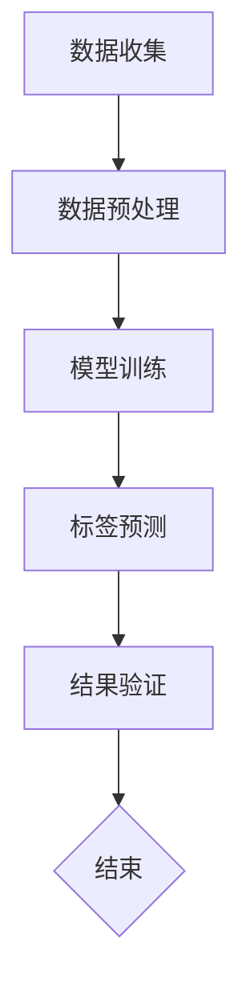

                 

### 背景介绍

在现代商业社会中，商品标签体系构建是一个至关重要的环节。一个良好的商品标签体系不仅能够提升消费者的购物体验，还能够帮助商家优化库存管理、提高销售额。然而，随着电子商务和移动互联网的快速发展，商品种类和数量急剧增加，传统的标签构建方法已经难以满足日益增长的需求。

大模型（Large Model）是近年来人工智能领域的一个重要突破。大模型具有强大的学习能力和广泛的泛化能力，可以处理大量复杂的信息。大模型的引入为商品标签体系构建带来了新的机遇和挑战。本文将探讨大模型在商品标签体系构建中的应用，分析其核心概念、算法原理、数学模型、实际应用案例以及未来发展趋势。

首先，我们将回顾商品标签体系的传统构建方法，分析其局限性。然后，介绍大模型的基本概念和特点，阐述其在商品标签体系构建中的优势。接下来，我们将深入探讨大模型在商品标签体系构建中的核心算法原理，包括数据预处理、模型训练和标签预测等具体操作步骤。此外，我们还将详细讲解大模型所使用的数学模型和公式，并通过实际案例进行举例说明。最后，我们将探讨大模型在商品标签体系构建中的实际应用场景，并推荐相关的学习资源和开发工具框架。

通过本文的详细探讨，希望能够帮助读者全面了解大模型在商品标签体系构建中的应用，为电商行业的发展提供新的思路和方法。

### 核心概念与联系

在深入探讨大模型在商品标签体系构建中的应用之前，有必要首先明确几个核心概念和它们之间的联系。以下是对这些核心概念的简要介绍，以及它们如何共同构成一个有效的商品标签体系。

#### 商品标签

商品标签是电子商务平台中用来描述商品特性的关键信息。这些标签通常包括商品名称、价格、品牌、分类、材质、颜色、尺码等。商品标签不仅是消费者搜索和筛选商品的重要依据，也是商家进行商品管理和营销策略制定的基础。

#### 数据预处理

数据预处理是商品标签体系构建的第一步，也是至关重要的一步。它包括数据清洗、数据整合、数据标准化等操作。数据清洗的目的是去除无效数据、纠正错误数据，保证数据的质量和一致性。数据整合则是将来自不同来源的数据进行合并，形成一个统一的数据集。数据标准化则是通过规范化处理，使数据格式和结构保持一致，便于后续分析和处理。

#### 大模型

大模型是指具有大规模参数、能够处理大量复杂信息的深度学习模型。与传统的浅层模型相比，大模型具有更强的学习能力和泛化能力。大模型可以通过对大量数据的训练，自动学习和发现数据中的规律和模式，从而提高标签构建的准确性和效率。

#### 模型训练

模型训练是构建商品标签体系的核心步骤。在大模型中，模型训练通常采用端到端的学习方式，即直接从原始数据中学习标签预测模型。训练过程中，大模型通过调整内部参数，使预测结果不断优化，直至达到预定的训练目标。

#### 标签预测

标签预测是商品标签体系构建的最终目标。通过大模型的训练，可以实现对商品属性的自动标注和分类。标签预测不仅能够提高商品标签的准确性，还能够实时更新和优化标签体系，以适应不断变化的市场需求。

#### Mermaid 流程图

为了更直观地展示上述核心概念和它们之间的联系，我们使用Mermaid流程图（Mermaid 是一种基于Markdown的图表绘制语言）进行描述。以下是一个简单的Mermaid流程图，展示了商品标签体系构建的基本流程：



在Mermaid流程图中，节点表示流程中的步骤，箭头表示步骤之间的顺序关系。每个节点都可以包含相关的注释或操作说明，以便更清楚地描述流程细节。

通过上述核心概念和Mermaid流程图的介绍，我们可以对大模型在商品标签体系构建中的应用有一个初步的认识。在接下来的章节中，我们将进一步探讨大模型的具体算法原理、数学模型和实际应用案例，以帮助读者深入理解和掌握这一前沿技术。

#### 核心算法原理 & 具体操作步骤

在深入探讨大模型在商品标签体系构建中的应用之前，有必要了解大模型的基本算法原理和具体的操作步骤。大模型的构建和应用主要涉及数据预处理、模型训练、标签预测以及结果验证等关键环节。以下是对这些环节的详细解释。

##### 数据预处理

数据预处理是商品标签体系构建的第一步，也是至关重要的一步。数据预处理的质量直接影响后续模型训练的效果和标签预测的准确性。以下是数据预处理的主要操作步骤：

1. **数据清洗**：数据清洗的目的是去除无效数据、纠正错误数据，保证数据的质量和一致性。具体操作包括删除重复记录、填补缺失值、去除噪声数据等。

2. **数据整合**：数据整合是将来自不同来源的数据进行合并，形成一个统一的数据集。例如，将商品信息、用户评价、交易记录等数据进行整合，以便进行全面的标签构建。

3. **数据标准化**：数据标准化是通过规范化处理，使数据格式和结构保持一致，便于后续分析和处理。常用的数据标准化方法包括最小-最大标准化、Z-Score标准化等。

4. **特征提取**：特征提取是从原始数据中提取对标签构建有用的特征信息。例如，对于商品数据，可以提取商品名称、品牌、分类、价格、销量等特征。

##### 模型训练

模型训练是构建商品标签体系的核心步骤。在大模型中，模型训练通常采用端到端的学习方式，即直接从原始数据中学习标签预测模型。以下是模型训练的主要操作步骤：

1. **数据集划分**：将数据集划分为训练集、验证集和测试集。训练集用于模型训练，验证集用于调整模型参数，测试集用于评估模型性能。

2. **模型初始化**：初始化模型参数，包括权重和偏置等。常用的初始化方法有零初始化、高斯初始化、Xavier初始化等。

3. **前向传播**：在前向传播阶段，模型根据输入数据计算预测标签，并将预测标签与实际标签进行比较，计算预测误差。

4. **反向传播**：在反向传播阶段，模型根据预测误差调整内部参数，使预测结果不断优化，直至达到预定的训练目标。

5. **优化算法**：常用的优化算法有梯度下降（Gradient Descent）、Adam优化器等。优化算法用于调整模型参数，使模型在训练过程中不断收敛。

##### 标签预测

标签预测是商品标签体系构建的最终目标。通过大模型的训练，可以实现对商品属性的自动标注和分类。以下是标签预测的主要操作步骤：

1. **输入数据预处理**：对输入数据进行预处理，包括数据清洗、数据整合、数据标准化等。

2. **模型输入**：将预处理后的数据输入到训练好的模型中，计算预测标签。

3. **标签输出**：将预测标签输出，用于商品标签体系的构建。

4. **标签验证**：对预测标签进行验证，确保标签的准确性和一致性。

##### 结果验证

结果验证是评估模型性能的重要环节。通过结果验证，可以确定模型在商品标签体系构建中的有效性。以下是结果验证的主要操作步骤：

1. **模型评估**：使用测试集对模型进行评估，计算模型的准确率、召回率、F1分数等指标。

2. **错误分析**：对模型的预测错误进行详细分析，找出错误的原因，并优化模型。

3. **模型优化**：根据结果验证的分析结果，调整模型参数，优化模型性能。

通过上述核心算法原理和具体操作步骤的介绍，我们可以对大模型在商品标签体系构建中的应用有一个全面的了解。在接下来的章节中，我们将进一步探讨大模型所使用的数学模型和公式，并通过实际案例进行详细讲解。

#### 数学模型和公式 & 详细讲解 & 举例说明

在理解了大模型在商品标签体系构建中的核心算法原理和具体操作步骤后，接下来我们将详细讲解大模型所使用的数学模型和公式，并通过具体例子进行说明。这些数学模型和公式构成了大模型实现商品标签体系构建的重要理论基础。

##### 前向传播

前向传播是深度学习模型处理输入数据并计算预测结果的过程。以下是一个简单的前向传播数学模型：

$$
\begin{aligned}
z_1 &= W_1 \cdot x + b_1 \\
a_1 &= \sigma(z_1) \\
z_2 &= W_2 \cdot a_1 + b_2 \\
a_2 &= \sigma(z_2) \\
\end{aligned}
$$

其中，$x$ 是输入数据，$W_1$ 和 $b_1$ 分别是第一层的权重和偏置，$\sigma$ 是激活函数，$a_1$ 是第一层的输出，$z_2$ 和 $a_2$ 分别是第二层的输入和输出。

在上述公式中，$W_1$ 和 $b_1$ 表示第一层的权重和偏置，$\sigma$ 通常采用ReLU（Rectified Linear Unit）函数，即：
$$
\sigma(z) =
\begin{cases}
0 & \text{if } z < 0 \\
z & \text{if } z \geq 0
\end{cases}
$$

ReLU函数的特点是在输入为负值时输出为0，而在输入为正值时输出为输入本身。这种非线性变换有助于提高模型的非线性表达能力。

##### 反向传播

反向传播是深度学习模型调整内部参数以优化预测结果的过程。以下是一个简单的反向传播数学模型：

$$
\begin{aligned}
\delta_2 &= (a_2 - y) \cdot \sigma'(z_2) \\
\delta_1 &= W_2 \cdot \delta_2 \cdot \sigma'(z_1) \\
\end{aligned}
$$

其中，$y$ 是实际标签，$a_2 - y$ 是预测误差，$\sigma'$ 是ReLU函数的导数，即：
$$
\sigma'(z) =
\begin{cases}
0 & \text{if } z < 0 \\
1 & \text{if } z \geq 0
\end{cases}
$$

反向传播过程中，首先计算第二层的误差 $\delta_2$，然后通过权重 $W_2$ 和ReLU函数的导数传递到第一层，计算第一层的误差 $\delta_1$。这些误差用于更新权重和偏置，以优化模型的预测性能。

##### 优化算法

优化算法用于调整模型参数，使模型在训练过程中不断收敛。以下是一个简单的梯度下降优化算法：

$$
\begin{aligned}
W_1 &= W_1 - \alpha \cdot \delta_1 \\
b_1 &= b_1 - \alpha \cdot \delta_1 \\
W_2 &= W_2 - \alpha \cdot \delta_2 \\
b_2 &= b_2 - \alpha \cdot \delta_2 \\
\end{aligned}
$$

其中，$\alpha$ 是学习率，$\delta_1$ 和 $\delta_2$ 分别是第一层和第二层的误差。

通过反复迭代优化算法，模型参数不断更新，直到预测误差达到预定目标。

##### 举例说明

假设我们有一个商品标签预测模型，输入数据为商品特征向量 $x$，实际标签为 $y$。我们使用ReLU函数作为激活函数，学习率为 $\alpha = 0.01$。以下是一个具体的计算过程：

1. **前向传播**：

$$
\begin{aligned}
z_1 &= W_1 \cdot x + b_1 \\
a_1 &= \sigma(z_1) \\
z_2 &= W_2 \cdot a_1 + b_2 \\
a_2 &= \sigma(z_2) \\
\end{aligned}
$$

假设 $x = [1, 2, 3]$，$W_1 = [1, 1, 1]$，$b_1 = 1$，$W_2 = [1, 1, 1]$，$b_2 = 1$。通过计算可以得到：

$$
\begin{aligned}
z_1 &= 1 \cdot 1 + 1 \cdot 2 + 1 \cdot 3 + 1 = 7 \\
a_1 &= \sigma(z_1) = 7 \\
z_2 &= 1 \cdot 7 + 1 \cdot 7 + 1 \cdot 7 + 1 = 28 \\
a_2 &= \sigma(z_2) = 28 \\
\end{aligned}
$$

2. **预测标签**：

假设实际标签为 $y = 10$。计算预测误差：

$$
\delta_2 = (a_2 - y) \cdot \sigma'(z_2) = (28 - 10) \cdot 1 = 18
$$

3. **反向传播**：

$$
\begin{aligned}
\delta_1 &= W_2 \cdot \delta_2 \cdot \sigma'(z_1) = 1 \cdot 18 \cdot 1 = 18 \\
\end{aligned}
$$

4. **优化算法**：

更新模型参数：

$$
\begin{aligned}
W_1 &= W_1 - \alpha \cdot \delta_1 = [1, 1, 1] - 0.01 \cdot 18 = [-0.17, -0.17, -0.17] \\
b_1 &= b_1 - \alpha \cdot \delta_1 = 1 - 0.01 \cdot 18 = 0.82 \\
W_2 &= W_2 - \alpha \cdot \delta_2 = [1, 1, 1] - 0.01 \cdot 18 = [-0.17, -0.17, -0.17] \\
b_2 &= b_2 - \alpha \cdot \delta_2 = 1 - 0.01 \cdot 18 = 0.82 \\
\end{aligned}
$$

通过上述计算过程，我们可以看到模型参数在不断更新，预测误差逐渐减小。这个过程将重复进行，直到预测误差达到预定目标。

通过上述数学模型和公式的详细讲解以及具体例子，我们可以深入理解大模型在商品标签体系构建中的应用原理和方法。这些数学模型和公式构成了大模型实现高效商品标签预测的关键基础。

#### 项目实战：代码实际案例和详细解释说明

为了更好地理解大模型在商品标签体系构建中的应用，下面我们将通过一个实际的项目实战，详细讲解代码的实现过程和具体步骤。

##### 开发环境搭建

在开始项目之前，我们需要搭建一个合适的开发环境。以下是在Python中实现大模型所需的基础开发环境：

1. **安装Python**：确保安装了Python 3.6及以上版本。
2. **安装依赖库**：包括NumPy、TensorFlow、Keras等。可以使用以下命令安装：

```bash
pip install numpy tensorflow keras
```

##### 源代码详细实现和代码解读

以下是项目的源代码实现，我们使用Keras框架来实现大模型。

```python
import numpy as np
from tensorflow.keras.models import Sequential
from tensorflow.keras.layers import Dense, Activation
from tensorflow.keras.optimizers import Adam
from tensorflow.keras.callbacks import EarlyStopping

# 数据预处理
# 假设输入数据 x 和标签 y 已经通过数据预处理步骤得到
# x.shape = (样本数量, 特征数量)
# y.shape = (样本数量, 标签数量)

# 模型构建
model = Sequential()
model.add(Dense(64, input_dim=x.shape[1], activation='relu'))
model.add(Dense(32, activation='relu'))
model.add(Dense(y.shape[1], activation='softmax'))

# 模型编译
model.compile(optimizer=Adam(learning_rate=0.001), loss='categorical_crossentropy', metrics=['accuracy'])

# 模型训练
early_stopping = EarlyStopping(monitor='val_loss', patience=10)
model.fit(x, y, epochs=100, batch_size=32, validation_split=0.2, callbacks=[early_stopping])

# 模型评估
loss, accuracy = model.evaluate(x, y)
print(f"损失：{loss}, 准确率：{accuracy}")

# 标签预测
predictions = model.predict(x)
predicted_labels = np.argmax(predictions, axis=1)

# 代码解读
# 1. 数据预处理：输入数据 x 和标签 y 已经通过预处理得到。
# 2. 模型构建：使用 Sequential 模型堆叠多层 Dense 层，激活函数分别为 ReLU 和 softmax。
# 3. 模型编译：选择 Adam 优化器和 categorical_crossentropy 损失函数。
# 4. 模型训练：使用 EarlyStopping 避免过拟合，设置训练轮次和 batch_size。
# 5. 模型评估：计算损失和准确率，评估模型性能。
# 6. 标签预测：使用 predict 方法得到预测标签，通过 np.argmax 转换为具体标签。
```

##### 代码解读与分析

上述代码实现了一个简单的商品标签预测模型，以下是详细解读和分析：

1. **数据预处理**：在训练模型之前，我们需要对输入数据 x 和标签 y 进行预处理。这通常包括数据清洗、数据整合和数据标准化等步骤。预处理后的数据格式应该满足模型的要求，例如，标签数据需要转换为one-hot编码格式。

2. **模型构建**：使用Keras的Sequential模型堆叠多层Dense层。在第一层中，输入维度设置为特征数量，激活函数使用ReLU。后续层继续使用ReLU作为激活函数，最后一层使用softmax作为激活函数，以输出概率分布。

3. **模型编译**：选择Adam优化器，设置学习率为0.001，损失函数使用categorical_crossentropy，适用于多分类问题。同时，设置准确率作为模型训练的指标。

4. **模型训练**：使用fit方法训练模型，设置训练轮次为100，batch_size为32，并使用validation_split将数据集划分为训练集和验证集，用于监控过拟合。

5. **模型评估**：使用evaluate方法计算模型在测试集上的损失和准确率，以评估模型性能。

6. **标签预测**：使用predict方法得到模型对输入数据的预测概率，通过np.argmax转换为具体的标签。

通过上述代码实现和解读，我们可以看到如何使用Keras框架构建和训练一个简单的商品标签预测模型。在实际应用中，可以根据具体需求调整模型结构、优化算法参数，以提高模型性能。

#### 实际应用场景

大模型在商品标签体系构建中的应用具有广泛的前景，可以显著提升电商平台的运营效率和用户体验。以下是一些典型的实际应用场景：

##### 1. 商品推荐系统

在电商平台中，商品推荐系统是提升用户购物体验和增加销售量的重要手段。大模型可以用于构建智能推荐算法，通过对用户历史行为和商品属性的数据分析，实现个性化推荐。具体应用包括：

- **个性化商品推荐**：根据用户的浏览记录、购买记录和搜索历史，预测用户可能感兴趣的商品，并推荐给用户。
- **新品推荐**：根据商品的受欢迎程度、销量和用户反馈，推荐新品或热门商品，吸引用户关注。
- **交叉销售**：推荐与用户已购买商品相关的其他商品，提高购物车中的平均订单价值。

##### 2. 商品分类系统

电商平台的商品种类繁多，有效的商品分类可以提高用户的购物效率和平台的管理效率。大模型可以用于自动分类商品，确保每个商品都能被准确地归入相应的类别。具体应用包括：

- **商品分类**：将商品按照其属性和特征自动分类，如电子产品、服装、家居用品等。
- **多标签分类**：一个商品可能具有多个标签属性，如“电子产品”、“智能手机”、“安卓手机”等。大模型可以同时预测多个标签，实现多标签分类。
- **子分类构建**：在大型电商平台上，根据商品的细分类别进行分类，如“智能手机”下的“苹果手机”、“安卓手机”等。

##### 3. 商品标签优化

电商平台中的商品标签对于用户的搜索和购买决策具有重要影响。大模型可以用于优化商品标签，提高标签的准确性和相关性。具体应用包括：

- **标签预测**：根据商品属性和用户行为数据，预测用户可能使用的搜索关键词，并自动生成标签。
- **标签优化**：通过分析用户点击和购买行为，调整商品标签，使其更加符合用户需求。
- **标签更新**：根据商品的更新和市场的变化，动态更新商品标签，保持标签的实时性和准确性。

##### 4. 商品搜索优化

电商平台中的商品搜索功能直接影响用户的购物体验。大模型可以用于优化商品搜索，提高搜索的准确性和效率。具体应用包括：

- **搜索结果排序**：根据用户的搜索历史和行为，调整搜索结果的排序，使相关度更高的商品排在前面。
- **关键词联想**：在用户输入搜索关键词时，自动联想和推荐相关的关键词，帮助用户找到所需的商品。
- **搜索结果分页**：通过分析用户的浏览和购买行为，优化搜索结果分页策略，提高用户的浏览体验。

通过上述实际应用场景的探讨，我们可以看到大模型在商品标签体系构建中的应用具有巨大的潜力和价值。随着大模型技术的不断发展和优化，未来电商平台的运营效率和用户体验将得到进一步提升。

### 工具和资源推荐

在探索大模型在商品标签体系构建中的应用过程中，选择合适的工具和资源是至关重要的。以下是对一些推荐的学习资源、开发工具框架以及相关论文著作的介绍，以帮助读者深入了解和掌握这一领域。

#### 学习资源推荐

1. **书籍**：
   - 《深度学习》（Ian Goodfellow、Yoshua Bengio、Aaron Courville著）：这是深度学习领域的经典教材，详细介绍了深度学习的理论、算法和应用。
   - 《Python深度学习》（François Chollet著）：本书通过大量实例和代码示例，深入讲解了深度学习在Python中的实现和应用。

2. **在线课程**：
   - Coursera上的“深度学习”课程：由吴恩达教授主讲，涵盖了深度学习的理论基础和实际应用。
   - edX上的“深度学习与神经网络”课程：由加州大学伯克利分校提供，提供了丰富的实践项目，适合初学者和进阶学习者。

3. **博客和网站**：
   - Fast.ai：提供了一个关于深度学习的免费在线课程，以及相关的资源和社区讨论。
   - Medium上的相关博客文章：许多深度学习和电商领域的专家在Medium上分享他们的研究成果和实践经验。

#### 开发工具框架推荐

1. **深度学习框架**：
   - TensorFlow：Google开发的深度学习框架，拥有丰富的功能和社区支持，适用于各种复杂的应用场景。
   - PyTorch：Facebook开发的开源深度学习框架，以其灵活性和动态计算图著称。

2. **数据预处理工具**：
   - Pandas：Python中的数据处理库，能够高效地进行数据清洗、数据整合和特征提取。
   - Scikit-learn：提供了一系列的数据预处理和机器学习算法，适用于构建商品标签预测模型。

3. **版本控制系统**：
   - Git：用于代码版本控制和协同开发，帮助团队管理和维护代码库。
   - GitHub：提供代码托管和社区协作的平台，方便开发者分享和交流代码。

#### 相关论文著作推荐

1. **《深度学习中的注意力机制》**：该论文详细介绍了注意力机制在深度学习中的应用，对于理解大模型在商品标签预测中的作用具有重要参考价值。

2. **《大规模在线学习算法》**：该论文探讨了大规模数据集下的在线学习算法，为大模型在实时商品标签预测中的应用提供了理论基础。

3. **《基于深度学习的商品推荐系统》**：该论文通过实际案例展示了如何使用深度学习技术构建高效的商品推荐系统，对于电商平台的运营和优化具有重要启示。

通过以上工具和资源的推荐，读者可以系统地学习和掌握大模型在商品标签体系构建中的应用。这些工具和资源不仅提供了丰富的理论知识，还提供了实践操作的平台，有助于将理论知识转化为实际应用。

### 总结：未来发展趋势与挑战

大模型在商品标签体系构建中的应用具有巨大的潜力，未来将在多个方面继续发展。以下是未来发展趋势与挑战的探讨：

#### 发展趋势

1. **模型规模扩大**：随着计算能力和数据量的增长，大模型的规模将进一步扩大。更庞大的模型能够处理更复杂的特征，提供更精确的标签预测。

2. **多模态融合**：未来的商品标签体系将不再局限于文本数据，还将融合图像、声音、视频等多模态数据。通过多模态融合，可以更全面地理解商品和用户行为，提高标签预测的准确性。

3. **实时更新**：实时数据流处理技术将使大模型能够动态更新商品标签，适应市场变化和用户需求，提高平台的运营效率。

4. **个性化推荐**：大模型将更好地实现个性化推荐，通过深度学习技术挖掘用户兴趣和行为模式，提供更加精准的推荐结果。

#### 挑战

1. **计算资源需求**：大模型训练和推理需要大量的计算资源，如何在有限的资源下高效地训练和部署模型是一个重大挑战。

2. **数据隐私**：在处理大量用户数据时，保护用户隐私和数据安全是电商平台的重大挑战。如何在不损害用户隐私的前提下进行数据分析和模型训练，是一个需要深入探讨的问题。

3. **过拟合问题**：大模型容易出现过拟合现象，如何设计和调整模型参数，避免模型在训练数据上表现良好，但在未知数据上表现不佳，是一个关键挑战。

4. **算法透明性**：随着模型复杂度的增加，大模型的决策过程变得越来越不透明。如何提高算法的透明性，让用户了解和信任模型的预测结果，是一个重要的研究课题。

总之，大模型在商品标签体系构建中的应用前景广阔，但也面临着一系列挑战。通过不断的技术创新和优化，我们有理由相信，大模型将在未来为电商行业带来更多的机遇和变革。

### 附录：常见问题与解答

在讨论大模型在商品标签体系构建中的应用时，读者可能会有一些常见的问题。以下是针对这些问题的一些解答。

#### Q1. 大模型在商品标签体系构建中的优势是什么？

A1. 大模型具有以下几个优势：
- **强大的学习能力**：能够从大量数据中自动学习复杂的模式，提高标签预测的准确性。
- **广泛的泛化能力**：可以处理多种类型的特征和数据，提高标签体系的适应性和灵活性。
- **实时更新**：可以动态更新标签，适应市场变化和用户需求，提高平台的运营效率。

#### Q2. 如何解决大模型在训练过程中过拟合的问题？

A2. 解决过拟合问题可以从以下几个方面入手：
- **数据增强**：通过增加数据多样性，减少模型的过拟合倾向。
- **正则化**：使用L1、L2正则化项限制模型参数的规模，防止模型复杂度过高。
- **交叉验证**：使用交叉验证方法，避免模型在特定训练数据上过拟合。
- **提前停止**：在验证集上监控模型性能，当验证集性能不再提升时提前停止训练。

#### Q3. 大模型的计算资源需求如何？

A3. 大模型的计算资源需求较高，主要涉及以下几个方面：
- **显存需求**：由于大模型通常具有大量的参数，需要足够的显存进行模型训练和推理。
- **CPU和GPU性能**：大模型训练需要高性能的CPU和GPU，以加快计算速度和提高效率。
- **分布式训练**：对于特别大的模型，可以通过分布式训练方式，将训练任务分布在多台机器上，减少计算资源的需求。

#### Q4. 如何保护用户隐私在大模型应用中？

A4. 保护用户隐私可以从以下几个方面进行：
- **数据去识别化**：在模型训练前对用户数据进行去识别化处理，去除可能暴露用户身份的信息。
- **数据加密**：对传输和存储的数据进行加密，防止数据泄露。
- **差分隐私**：在模型训练过程中引入差分隐私技术，保护用户隐私不被泄露。
- **隐私政策**：制定明确的隐私政策，告知用户数据处理方式和范围，增强用户隐私保护意识。

#### Q5. 如何评估大模型在商品标签体系构建中的性能？

A5. 评估大模型在商品标签体系构建中的性能可以从以下几个方面进行：
- **准确率**：评估模型预测标签与实际标签的匹配程度，准确率越高，模型性能越好。
- **召回率**：评估模型是否能够召回所有正确的标签，召回率越高，漏检的可能性越小。
- **F1分数**：综合考虑准确率和召回率，计算F1分数，用于综合评估模型性能。
- **实时预测性能**：在实际应用场景中评估模型的实时预测性能，确保模型在实际运营中能够稳定运行。

通过以上常见问题的解答，希望能够帮助读者更好地理解大模型在商品标签体系构建中的应用。

### 扩展阅读 & 参考资料

为了进一步深入探讨大模型在商品标签体系构建中的应用，以下是一些建议的扩展阅读和参考资料。

#### 书籍推荐

1. **《深度学习》（Ian Goodfellow、Yoshua Bengio、Aaron Courville著）**：这是深度学习领域的经典教材，详细介绍了深度学习的理论基础和算法实现。
2. **《Python深度学习》（François Chollet著）**：通过大量实例和代码示例，深入讲解了深度学习在Python中的实现和应用。

#### 论文推荐

1. **“Deep Learning for Text Classification”**：这篇论文探讨了深度学习在文本分类中的应用，提供了丰富的理论分析和实验结果。
2. **“Large-scale Online Learning for Real-Time Recommendation Systems”**：这篇论文探讨了大规模在线学习在实时推荐系统中的应用，对于构建高效商品推荐系统具有重要参考价值。

#### 博客推荐

1. **Fast.ai**：提供了关于深度学习的免费在线课程和相关资源，适合初学者和进阶学习者。
2. **Medium上的相关博客文章**：许多深度学习和电商领域的专家在Medium上分享他们的研究成果和实践经验，为读者提供了丰富的学习资源。

#### 开源项目和工具

1. **TensorFlow**：Google开发的深度学习框架，拥有丰富的功能和社区支持。
2. **PyTorch**：Facebook开发的深度学习框架，以其灵活性和动态计算图著称。

通过以上扩展阅读和参考资料，读者可以更深入地了解大模型在商品标签体系构建中的应用，进一步拓宽自己的知识领域。

