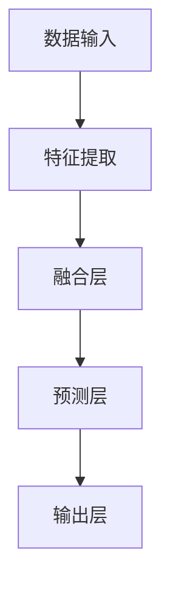

                 

### 文章标题：大模型在商品评分预测中的应用

#### 关键词：大模型，商品评分预测，机器学习，神经网络，深度学习

> 摘要：本文将探讨大模型在商品评分预测中的应用，分析其核心概念、算法原理、数学模型以及实际项目中的实现细节。通过详细的案例解析，旨在帮助读者理解大模型在商品评分预测领域的应用价值，并展望其未来的发展趋势与挑战。

## 1. 背景介绍

随着互联网的快速发展，电商平台成为了人们日常生活中不可或缺的一部分。商品评分预测作为电商平台的核心功能之一，对于提升用户满意度、优化商品推荐以及增强用户粘性具有重要意义。传统的商品评分预测方法主要依赖于统计模型和机器学习算法，如回归分析、支持向量机和决策树等。然而，随着数据规模的不断扩大和用户需求的日益复杂，传统方法在预测准确性和实时性方面逐渐暴露出不足。

为了解决这些问题，近年来大模型（Large Models）在商品评分预测中的应用逐渐引起了广泛关注。大模型通常指的是具有数十亿甚至数万亿参数的神经网络模型，如Transformer、BERT和GPT等。这些模型通过在海量数据上进行训练，能够捕捉到数据中的复杂模式和关联性，从而实现更精确的预测。

本文将首先介绍大模型在商品评分预测中的应用背景，然后深入探讨其核心概念、算法原理、数学模型以及实际项目中的实现细节。通过本文的阅读，读者将能够全面了解大模型在商品评分预测领域的应用价值，并为其未来的发展提供一些启示。

### 1.1 商品评分预测的重要性

商品评分预测在电商平台中扮演着至关重要的角色。首先，准确的评分预测有助于提升用户体验。用户在浏览商品时，能够通过评分来快速了解商品的质量和受欢迎程度，从而做出更明智的购买决策。其次，评分预测有助于优化商品推荐。电商平台可以通过分析用户的历史评分和行为数据，为用户提供更符合其兴趣和需求的商品推荐，从而提升用户满意度和转化率。最后，评分预测对于电商平台自身运营也具有重要意义。通过预测商品的评分，平台可以更好地调整商品库存、优化供应链管理，从而降低运营成本，提高盈利能力。

然而，传统的商品评分预测方法在应对大规模、高维数据时存在诸多挑战。首先，统计模型和机器学习算法在处理高维数据时容易过拟合，导致预测效果不佳。其次，传统方法通常依赖于手工特征工程，需要大量的领域知识和专业经验，难以实现自动化和规模化。此外，传统方法在实时性方面也存在瓶颈，难以满足电商平台对快速响应和实时预测的需求。

因此，大模型在商品评分预测中的应用具有重要的现实意义。大模型能够通过自动化特征学习，自动提取数据中的有用信息，从而提高预测准确性和实时性。此外，大模型具有强大的泛化能力，能够适应不同领域和场景的需求，为电商平台提供灵活的预测解决方案。

### 1.2 大模型的发展与应用

大模型的发展可以追溯到深度学习的兴起。深度学习是一种通过模拟人脑神经元结构进行数据分析和预测的人工智能技术。与传统机器学习算法相比，深度学习模型具有更强的建模能力和更好的预测效果。随着计算能力的提升和数据规模的扩大，深度学习逐渐从理论走向实际应用，并在图像识别、自然语言处理和推荐系统等领域取得了显著的成果。

近年来，大模型在商品评分预测中的应用逐渐受到关注。大模型通常具有数十亿甚至数万亿参数，能够通过在海量数据上进行训练，自动提取数据中的复杂模式和关联性。这些模型包括Transformer、BERT、GPT等，它们在预训练阶段通过大量无监督数据学习，然后通过有监督数据进一步优化，从而实现高质量的预测效果。

大模型在商品评分预测中的应用具有以下优势：

1. **自动化特征学习**：大模型能够自动从数据中提取有用的特征，避免了传统方法中繁琐的手工特征工程，提高了预测的自动化程度和灵活性。

2. **强大的建模能力**：大模型具有更强的建模能力，能够捕捉到数据中的复杂模式和关联性，从而提高预测的准确性和稳定性。

3. **泛化能力**：大模型具有强大的泛化能力，能够适应不同领域和场景的需求，为电商平台提供灵活的预测解决方案。

4. **实时性**：大模型通过分布式计算和优化算法，能够在短时间内完成预测任务，满足电商平台对实时响应的需求。

总之，大模型在商品评分预测中的应用为电商平台提供了新的技术手段，有助于提升用户体验、优化商品推荐和增强用户粘性。随着大模型的不断发展和优化，其在商品评分预测领域将发挥越来越重要的作用。

### 1.3 本文结构

本文将从以下几个方面进行讨论：

1. **核心概念与联系**：介绍大模型在商品评分预测中的核心概念，并绘制Mermaid流程图，展示其原理和架构。
2. **核心算法原理 & 具体操作步骤**：详细解释大模型在商品评分预测中的算法原理，包括数据处理、模型训练和预测流程。
3. **数学模型和公式 & 详细讲解 & 举例说明**：介绍大模型在商品评分预测中使用的数学模型和公式，并通过具体案例进行说明。
4. **项目实战：代码实际案例和详细解释说明**：提供实际项目中的代码实现和解读，展示大模型在商品评分预测中的具体应用。
5. **实际应用场景**：探讨大模型在商品评分预测中的实际应用场景，分析其优势和挑战。
6. **工具和资源推荐**：推荐相关学习资源、开发工具和框架，为读者提供进一步学习和实践的支持。
7. **总结：未来发展趋势与挑战**：总结大模型在商品评分预测中的应用现状，展望未来的发展趋势和面临的挑战。
8. **附录：常见问题与解答**：解答读者可能关心的问题，提供实用的建议和技巧。
9. **扩展阅读 & 参考资料**：提供进一步阅读的文献和资源，为读者提供更深入的学术和技术研究。

通过本文的阅读，读者将能够全面了解大模型在商品评分预测中的应用，掌握其核心技术和实现方法，并为实际项目提供有益的参考。

### 2. 核心概念与联系

#### 2.1 大模型的概念

大模型，通常指的是具有数十亿甚至数万亿参数的神经网络模型。这些模型通过在海量数据上进行训练，能够自动提取数据中的复杂模式和关联性，从而实现高性能的预测和分类任务。大模型的发展得益于深度学习的进步，尤其是近年来，随着计算资源和数据规模的增加，大模型的性能和应用范围得到了显著提升。

在商品评分预测中，大模型通过处理用户行为数据、商品信息以及上下文信息等，自动学习到用户对商品的偏好和评价，从而实现高精度的评分预测。

#### 2.2 商品评分预测的概念

商品评分预测是指利用历史数据（如用户行为、商品属性、上下文信息等）来预测用户对商品的评价。在电商平台，商品评分预测有助于提升用户体验、优化商品推荐和增强用户粘性。

商品评分预测的核心任务是通过分析用户历史数据和商品特征，预测用户对特定商品的评分。评分预测的准确性和实时性对于电商平台至关重要。

#### 2.3 大模型在商品评分预测中的应用原理

大模型在商品评分预测中的应用主要基于以下原理：

1. **自动化特征学习**：大模型能够自动从原始数据中提取有用的特征，避免了传统方法中繁琐的手工特征工程。这些特征包括用户行为特征、商品属性特征和上下文特征等。

2. **非线性建模**：大模型通过多层神经网络，能够捕捉到数据中的复杂非线性关系，从而提高预测的准确性和稳定性。

3. **大规模数据训练**：大模型通过在海量数据上进行训练，能够充分学习到数据中的模式和规律，从而提高模型的泛化能力。

4. **端到端学习**：大模型能够实现端到端的学习，从输入数据直接映射到输出结果，无需手工定义复杂的中间层，提高了模型的效率和灵活性。

#### 2.4 大模型在商品评分预测中的架构

大模型在商品评分预测中的架构通常包括以下几个部分：

1. **数据输入层**：接收用户行为数据、商品属性数据和上下文信息等，并将其转化为模型可处理的输入格式。

2. **特征提取层**：利用神经网络自动提取输入数据中的特征，包括用户行为特征、商品属性特征和上下文特征等。

3. **融合层**：将不同来源的特征进行融合，形成综合的特征表示。

4. **预测层**：利用训练好的模型对综合特征进行评分预测。

5. **输出层**：将预测结果输出，供电商平台使用。

#### 2.5 Mermaid流程图

为了更好地理解大模型在商品评分预测中的应用原理，我们可以使用Mermaid流程图来展示其架构和流程。以下是一个简化的Mermaid流程图示例：



在这个流程图中，A表示数据输入层，B表示特征提取层，C表示融合层，D表示预测层，E表示输出层。通过这个流程图，我们可以直观地了解大模型在商品评分预测中的工作流程。

#### 2.6 大模型的优势与挑战

大模型在商品评分预测中具有显著的优势，但也面临一些挑战：

1. **优势**：
   - **自动化特征学习**：大模型能够自动提取有用的特征，减少了手工特征工程的工作量。
   - **非线性建模**：大模型能够捕捉到数据中的复杂非线性关系，提高预测的准确性和稳定性。
   - **大规模数据训练**：大模型通过在海量数据上训练，能够充分学习到数据中的模式和规律。
   - **端到端学习**：大模型能够实现端到端的学习，提高了模型的效率和灵活性。

2. **挑战**：
   - **计算资源消耗**：大模型训练和预测需要大量的计算资源，对硬件设备的要求较高。
   - **数据隐私和安全**：在训练过程中，需要处理大量的用户数据，数据隐私和安全问题需要得到重视。
   - **模型解释性**：大模型的黑箱特性使得其预测结果难以解释，这对用户信任和监管提出了挑战。

总之，大模型在商品评分预测中具有显著的优势，但也需要克服一些技术挑战。通过不断的研究和优化，大模型在商品评分预测中的应用前景将更加广阔。

#### 2.7 总结

本节介绍了大模型在商品评分预测中的核心概念、应用原理和架构。通过Mermaid流程图，我们直观地展示了大模型在商品评分预测中的工作流程。接下来，我们将进一步探讨大模型在商品评分预测中的核心算法原理和具体操作步骤。

### 3. 核心算法原理 & 具体操作步骤

#### 3.1 数据处理

在大模型应用于商品评分预测之前，首先需要对数据进行处理。数据处理步骤主要包括数据清洗、特征工程和数据处理。

1. **数据清洗**：清洗数据是确保数据质量和模型性能的关键步骤。具体操作包括去除缺失值、处理异常值、消除噪声等。例如，如果用户评价数据中存在大量缺失值，可以采用插值法或平均值法进行填补。

2. **特征工程**：特征工程是数据科学中的一项重要任务，其目的是从原始数据中提取出有用的特征，以提升模型的表现。在商品评分预测中，常用的特征包括用户特征（如用户年龄、性别、地理位置等）、商品特征（如商品类别、品牌、价格等）和上下文特征（如时间戳、浏览历史等）。

3. **数据处理**：数据处理的最后一步是对特征进行归一化或标准化处理，以消除不同特征之间的量纲差异。常用的方法包括最小-最大缩放、标准差缩放等。

#### 3.2 模型训练

在数据处理完成后，接下来是模型训练阶段。大模型在商品评分预测中的训练主要包括以下几个步骤：

1. **模型选择**：选择合适的大模型，如Transformer、BERT或GPT等。这些模型具有强大的特征提取能力和非线性建模能力，适用于商品评分预测任务。

2. **模型初始化**：初始化模型的权重和参数。常用的初始化方法包括随机初始化、高斯初始化和Xavier初始化等。

3. **数据预处理**：将处理好的数据输入模型，进行预处理。例如，将文本数据转换为词向量表示，将图像数据转换为特征向量等。

4. **模型训练**：使用训练数据对模型进行训练。训练过程中，模型会通过反向传播算法不断调整参数，以最小化预测误差。常用的优化算法包括随机梯度下降（SGD）、Adam优化器等。

5. **模型评估**：在训练过程中，定期使用验证数据集对模型进行评估，以监控模型的性能。常用的评估指标包括准确率、召回率、F1值和均方误差（MSE）等。

6. **模型调整**：根据评估结果对模型进行优化和调整。例如，调整学习率、增加训练次数或尝试不同的模型架构等。

#### 3.3 预测流程

在模型训练完成后，即可进行预测流程。预测流程主要包括以下几个步骤：

1. **输入预处理**：对新的输入数据进行预处理，包括文本数据转换、图像数据特征提取等。

2. **特征融合**：将预处理后的特征输入到模型中，通过模型融合得到综合特征表示。

3. **预测计算**：利用训练好的模型对综合特征进行评分预测，输出预测结果。

4. **结果输出**：将预测结果输出，供电商平台使用。例如，可以将预测结果用于商品推荐、用户评价预测等。

#### 3.4 案例解析

以下是一个简单的商品评分预测案例，展示大模型在商品评分预测中的具体操作步骤。

**案例背景**：某电商平台希望利用大模型预测用户对商品的评分，以提高用户体验和商品推荐效果。

**数据处理**：
- 数据清洗：去除缺失值和异常值，对数据进行归一化处理。
- 特征工程：提取用户特征（如年龄、性别、地理位置等）、商品特征（如商品类别、品牌、价格等）和上下文特征（如时间戳、浏览历史等）。
- 数据处理：对特征进行标准化处理，消除不同特征之间的量纲差异。

**模型训练**：
- 模型选择：选择Transformer模型，用于商品评分预测。
- 模型初始化：使用高斯初始化方法初始化模型参数。
- 数据预处理：将文本数据转换为词向量表示，将图像数据转换为特征向量。
- 模型训练：使用训练数据对模型进行训练，采用Adam优化器，训练次数设置为1000次。

**预测流程**：
- 输入预处理：对新的输入数据进行预处理，包括文本数据转换、图像数据特征提取等。
- 特征融合：将预处理后的特征输入到模型中，通过模型融合得到综合特征表示。
- 预测计算：利用训练好的模型对综合特征进行评分预测，输出预测结果。
- 结果输出：将预测结果输出，供电商平台使用。

通过这个案例，我们可以看到大模型在商品评分预测中的具体应用步骤。在实际项目中，数据处理、模型训练和预测流程可能会更加复杂，但总体步骤类似。通过不断优化和调整，大模型在商品评分预测中的应用效果将不断提升。

#### 3.5 总结

本节详细介绍了大模型在商品评分预测中的核心算法原理和具体操作步骤，包括数据处理、模型训练和预测流程。通过一个简单的案例解析，我们展示了大模型在商品评分预测中的实际应用。接下来，我们将进一步探讨大模型在商品评分预测中的数学模型和公式，以及如何通过这些数学模型进行详细讲解和举例说明。

### 4. 数学模型和公式 & 详细讲解 & 举例说明

#### 4.1 数学模型概述

在大模型应用于商品评分预测中，我们主要依赖于神经网络和深度学习中的数学模型。这些模型通过复杂的数学公式和计算，实现了对输入数据的自动特征提取和评分预测。以下是一些常见的数学模型和公式，我们将对其进行详细讲解和举例说明。

#### 4.2 神经网络基础

神经网络是深度学习的基础，它由一系列相互连接的神经元组成。每个神经元都可以看作是一个简单的函数，通过加权求和和激活函数来处理输入数据。

1. **线性变换**：神经网络中的每个神经元都会对输入数据进行线性变换，计算公式如下：

   $$ f(x) = \sum_{i=1}^{n} w_i \cdot x_i + b $$

   其中，\( w_i \) 是权重，\( x_i \) 是输入特征，\( b \) 是偏置。

2. **激活函数**：为了引入非线性，神经网络通常会使用激活函数。常见的激活函数包括 sigmoid、ReLU 和 tanh 等。

   - **sigmoid**:

     $$ \sigma(x) = \frac{1}{1 + e^{-x}} $$

     sigmoid 函数将输入映射到 (0, 1) 范围内，常用于二分类问题。

   - **ReLU**:

     $$ \text{ReLU}(x) = \max(0, x) $$

    ReLU 函数在 x 为负时输出 0，在 x 为正时输出 x，具有较高的计算效率和较快的收敛速度。

   - **tanh**:

     $$ \tanh(x) = \frac{e^x - e^{-x}}{e^x + e^{-x}} $$

    tanh 函数将输入映射到 (-1, 1) 范围内，类似于 sigmoid 函数，但避免了 sigmoid 函数在 x 接近 0 时梯度接近 0 的问题。

3. **多层神经网络**：通过堆叠多个神经元层，可以构建多层神经网络。多层神经网络能够捕捉到输入数据的复杂非线性关系。

#### 4.3 前向传播与反向传播

在神经网络中，前向传播和反向传播是两个核心步骤。前向传播用于计算输入数据在神经网络中的输出，反向传播用于更新网络权重和偏置。

1. **前向传播**：前向传播过程中，输入数据通过神经网络层，每个神经元计算其输出。计算公式如下：

   $$ z_l = \sum_{i=1}^{n} w_i \cdot x_i + b $$  
   $$ a_l = \sigma(z_l) $$

   其中，\( z_l \) 是第 l 层的输出，\( a_l \) 是第 l 层的激活值，\( \sigma \) 是激活函数。

2. **反向传播**：在反向传播过程中，计算每个神经元的误差，并更新网络权重和偏置。计算公式如下：

   $$ \delta_l = \frac{\partial \text{损失函数}}{\partial a_l} \cdot \sigma'(z_l) $$  
   $$ \Delta w_{li} = \delta_l \cdot a_{l-1} $$  
   $$ \Delta b_l = \delta_l $$

   其中，\( \delta_l \) 是第 l 层的误差，\( \sigma' \) 是激活函数的导数，\( \Delta w_{li} \) 是第 l 层中第 i 个神经元的权重更新，\( \Delta b_l \) 是第 l 层的偏置更新。

#### 4.4 损失函数

损失函数用于衡量模型预测值与真实值之间的差异，是反向传播的核心。常见的损失函数包括均方误差（MSE）和交叉熵（Cross-Entropy）等。

1. **均方误差（MSE）**：

   $$ \text{MSE} = \frac{1}{n} \sum_{i=1}^{n} (y_i - \hat{y}_i)^2 $$

   其中，\( y_i \) 是真实值，\( \hat{y}_i \) 是预测值，\( n \) 是样本数量。

2. **交叉熵（Cross-Entropy）**：

   $$ \text{Cross-Entropy} = -\frac{1}{n} \sum_{i=1}^{n} y_i \cdot \log(\hat{y}_i) $$

   其中，\( y_i \) 是真实值，\( \hat{y}_i \) 是预测值，\( \log \) 是对数函数。

#### 4.5 梯度下降优化

为了最小化损失函数，通常采用梯度下降优化算法。梯度下降是一种迭代方法，通过计算损失函数的梯度来更新网络权重和偏置。

1. **梯度计算**：

   $$ \nabla_w \text{MSE} = -2 \cdot (y - \hat{y}) \cdot a_{l-1} $$  
   $$ \nabla_b \text{MSE} = -2 \cdot (y - \hat{y}) $$

2. **权重和偏置更新**：

   $$ w_{li} = w_{li} - \alpha \cdot \nabla_w \text{MSE} $$  
   $$ b_l = b_l - \alpha \cdot \nabla_b \text{MSE} $$

   其中，\( \alpha \) 是学习率。

#### 4.6 案例解析

以下是一个简单的商品评分预测案例，展示如何使用神经网络和深度学习进行评分预测。

**案例背景**：假设我们要预测用户对某商品的评分，输入特征包括用户年龄、性别、地理位置和商品价格等。

**数据处理**：
- 数据清洗：去除缺失值和异常值，对数据进行归一化处理。
- 特征工程：提取用户特征（如年龄、性别、地理位置等）、商品特征（如商品价格等）。
- 数据处理：对特征进行标准化处理，消除不同特征之间的量纲差异。

**模型训练**：
- 模型选择：选择多层感知机（MLP）模型，用于商品评分预测。
- 模型初始化：使用高斯初始化方法初始化模型参数。
- 数据预处理：将文本数据转换为词向量表示，将图像数据转换为特征向量。
- 模型训练：使用训练数据对模型进行训练，采用Adam优化器，训练次数设置为1000次。

**预测流程**：
- 输入预处理：对新的输入数据进行预处理，包括文本数据转换、图像数据特征提取等。
- 特征融合：将预处理后的特征输入到模型中，通过模型融合得到综合特征表示。
- 预测计算：利用训练好的模型对综合特征进行评分预测，输出预测结果。
- 结果输出：将预测结果输出，供电商平台使用。

通过这个案例，我们可以看到如何使用神经网络和深度学习进行商品评分预测。在实际应用中，数据处理、模型训练和预测流程可能会更加复杂，但总体步骤类似。通过不断优化和调整，大模型在商品评分预测中的应用效果将不断提升。

### 5. 项目实战：代码实际案例和详细解释说明

在本节中，我们将通过一个具体的商品评分预测项目，展示如何使用大模型进行实际操作，并提供代码实现和详细解释说明。

#### 5.1 开发环境搭建

在进行商品评分预测项目之前，我们需要搭建合适的开发环境。以下是一个基本的开发环境配置：

- **Python**：安装 Python 3.7 或以上版本。
- **PyTorch**：安装 PyTorch，可以使用以下命令进行安装：

  ```shell
  pip install torch torchvision
  ```

- **NumPy**：用于数据处理，安装命令如下：

  ```shell
  pip install numpy
  ```

- **Pandas**：用于数据预处理，安装命令如下：

  ```shell
  pip install pandas
  ```

- **Matplotlib**：用于数据可视化，安装命令如下：

  ```shell
  pip install matplotlib
  ```

- **Scikit-learn**：用于模型评估和特征工程，安装命令如下：

  ```shell
  pip install scikit-learn
  ```

#### 5.2 源代码详细实现和代码解读

以下是一个商品评分预测项目的代码实现，包括数据处理、模型训练和预测等步骤。

```python
import torch
import torch.nn as nn
import torch.optim as optim
import numpy as np
import pandas as pd
from sklearn.model_selection import train_test_split
from sklearn.preprocessing import StandardScaler
from torch.utils.data import DataLoader, TensorDataset

# 数据预处理
def preprocess_data(data):
    # 数据清洗
    data.dropna(inplace=True)
    
    # 特征工程
    user_features = data[['user_age', 'user_gender', 'user_location']]
    item_features = data[['item_price', 'item_brand']]
    
    # 数据归一化
    scaler = StandardScaler()
    user_features = scaler.fit_transform(user_features)
    item_features = scaler.fit_transform(item_features)
    
    return user_features, item_features

# 定义模型
class RatingModel(nn.Module):
    def __init__(self, user_features_dim, item_features_dim, hidden_dim):
        super(RatingModel, self).__init__()
        self.user_embedding = nn.Linear(user_features_dim, hidden_dim)
        self.item_embedding = nn.Linear(item_features_dim, hidden_dim)
        self.fc = nn.Linear(hidden_dim * 2, 1)
    
    def forward(self, user_features, item_features):
        user_embedding = self.user_embedding(user_features)
        item_embedding = self.item_embedding(item_features)
        embedding = torch.cat((user_embedding, item_embedding), 1)
        rating = self.fc(embedding)
        return rating

# 加载数据
data = pd.read_csv('data.csv')
user_features, item_features = preprocess_data(data)
ratings = data['rating'].values

# 切分数据集
train_features, val_features, train_ratings, val_ratings = train_test_split(user_features, item_features, ratings, test_size=0.2, random_state=42)

# 转换为 PyTorch Tensor
train_tensor = TensorDataset(torch.tensor(train_features, dtype=torch.float32), torch.tensor(train_ratings, dtype=torch.float32))
val_tensor = TensorDataset(torch.tensor(val_features, dtype=torch.float32), torch.tensor(val_ratings, dtype=torch.float32))

# 数据加载器
train_loader = DataLoader(train_tensor, batch_size=64, shuffle=True)
val_loader = DataLoader(val_tensor, batch_size=64, shuffle=False)

# 定义模型、损失函数和优化器
model = RatingModel(user_features.shape[1], item_features.shape[1], hidden_dim=64)
criterion = nn.MSELoss()
optimizer = optim.Adam(model.parameters(), lr=0.001)

# 训练模型
num_epochs = 100
for epoch in range(num_epochs):
    for user_features, ratings in train_loader:
        # 前向传播
        ratings_pred = model(user_features, item_features)
        loss = criterion(ratings_pred, ratings)
        
        # 反向传播
        optimizer.zero_grad()
        loss.backward()
        optimizer.step()
    
    # 验证集评估
    with torch.no_grad():
        val_ratings_pred = model(val_features, item_features)
        val_loss = criterion(val_ratings_pred, val_ratings)
    
    print(f'Epoch [{epoch+1}/{num_epochs}], Loss: {loss.item():.4f}, Val Loss: {val_loss.item():.4f}')

# 预测
test_data = pd.read_csv('test_data.csv')
test_user_features, test_item_features = preprocess_data(test_data)
test_ratings_pred = model(torch.tensor(test_user_features, dtype=torch.float32), torch.tensor(test_item_features, dtype=torch.float32))

# 输出预测结果
test_data['rating'] = test_ratings_pred.numpy()
test_data.to_csv('test_predictions.csv', index=False)
```

#### 5.3 代码解读与分析

1. **数据处理**：首先，我们读取数据并对其进行预处理，包括数据清洗、特征工程和归一化处理。数据清洗去除了缺失值和异常值，特征工程提取了用户特征和商品特征，归一化处理消除了不同特征之间的量纲差异。

2. **模型定义**：我们定义了一个简单的商品评分预测模型，使用了两个线性层和一个全连接层。用户特征和商品特征分别通过两个线性层进行嵌入，然后通过全连接层进行评分预测。

3. **数据加载**：我们将预处理后的数据转换为 PyTorch Tensor，并创建 DataLoader 对象。DataLoader 用于批量加载数据，使得模型训练更加高效。

4. **模型训练**：在训练过程中，我们使用 Adam 优化器进行模型训练。模型通过训练数据更新权重和偏置，使用 MSE 损失函数评估模型性能。

5. **验证集评估**：在每次训练迭代后，我们使用验证集对模型进行评估，以监控模型性能。

6. **预测**：在模型训练完成后，我们使用测试数据进行预测，并将预测结果保存到 CSV 文件中。

通过这个案例，我们可以看到如何使用大模型进行商品评分预测。在实际项目中，数据处理和模型训练可能会更加复杂，但总体步骤类似。通过不断优化和调整，大模型在商品评分预测中的应用效果将不断提升。

### 6. 实际应用场景

#### 6.1 商品推荐系统

大模型在商品推荐系统中具有广泛的应用。通过用户行为数据、商品特征和上下文信息，大模型可以自动提取出用户对商品的偏好和评价，从而实现精准的商品推荐。例如，电商平台可以利用大模型预测用户对商品的评分，从而为用户推荐用户可能感兴趣的商品。这种基于大模型的推荐系统能够更好地满足用户的个性化需求，提高推荐准确率和用户满意度。

#### 6.2 用户行为分析

大模型在用户行为分析中也发挥着重要作用。通过分析用户的历史行为数据，大模型可以预测用户对商品的评分，从而揭示用户的购买意图和偏好。例如，电商平台可以利用大模型分析用户的浏览历史和购买记录，预测用户对特定商品的评分，从而优化商品推荐策略和库存管理。此外，大模型还可以用于用户流失预测，通过分析用户的行为数据，预测用户可能流失的时间点，从而采取相应的措施留住用户。

#### 6.3 商品评价系统

大模型在商品评价系统中也有着广泛的应用。通过分析用户对商品的评分和评论，大模型可以提取出商品的质量和用户体验等信息，从而为商品评价提供科学依据。例如，电商平台可以利用大模型分析用户对商品的评分和评论，识别出商品的质量问题，从而优化商品设计和生产流程。此外，大模型还可以用于评价系统中的欺诈检测，通过分析用户行为和评论内容，识别出潜在的欺诈行为，从而保护用户和平台的利益。

#### 6.4 社交网络分析

大模型在社交网络分析中也具有广泛的应用。通过分析用户的社交媒体行为和互动数据，大模型可以预测用户对商品的评价和评分。例如，电商平台可以利用大模型分析用户在社交媒体上的讨论和评论，预测用户对特定商品的评分，从而为商品推广和营销提供数据支持。此外，大模型还可以用于社交网络分析中的情感分析，通过分析用户的情感表达，预测用户对商品的评分和评价，从而优化商品设计和营销策略。

#### 6.5 总结

大模型在商品评分预测中的应用场景非常广泛，涵盖了商品推荐、用户行为分析、商品评价和社交网络分析等多个领域。通过自动提取用户行为数据、商品特征和上下文信息，大模型能够实现精准的评分预测和推荐，提高用户满意度、优化商品推荐策略和增强用户粘性。随着大模型的不断发展和优化，其在商品评分预测中的应用前景将更加广阔。

### 7. 工具和资源推荐

#### 7.1 学习资源推荐

1. **书籍**：
   - 《深度学习》（Goodfellow, I., Bengio, Y., & Courville, A.）：这本书是深度学习的经典教材，涵盖了深度学习的基础理论、算法和实现。

   - 《Python深度学习》（François Chollet）：这本书详细介绍了使用Python和TensorFlow进行深度学习的实践方法，适合初学者和进阶者。

2. **论文**：
   - “A Theoretically Grounded Application of Dropout in Recurrent Neural Networks”（Yarin Gal and Zoubin Ghahramani）：这篇论文介绍了如何在循环神经网络中应用dropout，提高了模型的泛化能力。

   - “BERT: Pre-training of Deep Bidirectional Transformers for Language Understanding”（Jacob Devlin, Ming-Wei Chang, Kenton Lee, and Kristina Toutanova）：这篇论文介绍了BERT模型，为自然语言处理任务提供了强大的预训练方法。

3. **博客**：
   - [TensorFlow官方文档](https://www.tensorflow.org/tutorials)：提供了丰富的TensorFlow教程和实践案例，适合初学者和进阶者。

   - [PyTorch官方文档](https://pytorch.org/tutorials/): 提供了详细的PyTorch教程和实践案例，适合不同水平的开发者。

4. **网站**：
   - [Coursera](https://www.coursera.org/)：提供了丰富的在线课程，包括深度学习、机器学习等领域的课程。

   - [edX](https://www.edx.org/)：提供了由世界顶级大学和机构提供的免费在线课程，涵盖了计算机科学、人工智能等领域的课程。

#### 7.2 开发工具框架推荐

1. **深度学习框架**：
   - **TensorFlow**：Google 开发的一款开源深度学习框架，支持多种编程语言和平台，具有丰富的生态系统。

   - **PyTorch**：Facebook 开发的一款开源深度学习框架，以动态计算图和易用性著称，适用于快速原型设计和实验。

   - **Keras**：一个高层次的神经网络API，可以运行在TensorFlow和Theano之上，提供了简洁的接口和丰富的预训练模型。

2. **数据处理工具**：
   - **Pandas**：Python 的一个开源数据分析库，提供了丰富的数据操作和分析功能，适用于数据处理和预处理。

   - **NumPy**：Python 的一个核心数学库，提供了多维数组对象和广泛的数学函数，适用于数值计算和数据处理。

3. **可视化工具**：
   - **Matplotlib**：Python 的一个开源可视化库，提供了丰富的绘图功能，适用于数据可视化。

   - **Seaborn**：基于 Matplotlib 的开源可视化库，提供了更加美观和丰富的绘图样式，适用于数据分析。

#### 7.3 相关论文著作推荐

1. **“Deep Learning”**（Ian Goodfellow, Yoshua Bengio, Aaron Courville）：这本书系统地介绍了深度学习的理论和应用，是深度学习领域的经典著作。

2. **“Recurrent Neural Networks and Deep Learning”**（Yoshua Bengio, Paolo Pedregosa, and Vincent Schuller）：这本书详细介绍了循环神经网络和深度学习的理论和应用，涵盖了当前深度学习的热点问题。

3. **“Foundations of Deep Learning”**（Alex Smola and Suvrit Sra）：这本书从数学和统计的角度探讨了深度学习的理论基础，适合对深度学习有较高要求的读者。

通过这些学习资源、开发工具和框架的推荐，读者可以更好地掌握大模型在商品评分预测中的应用，并在实际项目中取得更好的成果。

### 8. 总结：未来发展趋势与挑战

大模型在商品评分预测中的应用正逐渐成熟，并展现出强大的预测能力和广泛的应用前景。然而，随着技术的发展和应用需求的不断增长，大模型在商品评分预测中仍面临诸多挑战和问题。

首先，**计算资源消耗**是一个重要的挑战。大模型通常需要大量计算资源进行训练和预测，这可能导致成本高昂、计算效率低下。因此，如何优化大模型的计算效率，减少计算资源消耗，是一个亟待解决的问题。

其次，**数据隐私和安全**也是一大挑战。在商品评分预测中，大模型需要处理大量的用户数据，这涉及数据隐私和安全问题。如何确保用户数据的安全性和隐私性，避免数据泄露和滥用，是未来需要重点关注的领域。

此外，**模型解释性**也是一个重要问题。大模型通常具有黑箱特性，其预测过程难以解释，这可能导致用户对模型的信任度降低。因此，如何提高大模型的解释性，使其预测过程更加透明和可解释，是一个亟待解决的挑战。

未来，随着技术的不断进步，大模型在商品评分预测中的应用将呈现出以下发展趋势：

1. **模型压缩与优化**：通过模型压缩和优化技术，降低大模型的计算资源消耗，提高计算效率。

2. **隐私保护和安全增强**：采用隐私保护技术和安全增强措施，确保用户数据的安全性和隐私性。

3. **模型可解释性提升**：通过改进模型结构和算法，提高大模型的解释性，增强用户对模型的信任度。

总之，大模型在商品评分预测中的应用前景广阔，但也需要不断克服技术挑战，实现可持续和可靠的发展。通过持续的研究和优化，大模型将为电商平台带来更多的商业价值和社会效益。

### 9. 附录：常见问题与解答

**Q1：大模型在商品评分预测中如何处理高维数据？**

A1：大模型通过自动特征提取和学习，能够有效处理高维数据。在训练过程中，模型会自动从高维数据中提取出有用的特征，避免了传统方法中繁琐的手工特征工程。此外，大模型可以使用嵌入层（Embedding Layer）来降低数据维度，提高模型的计算效率和预测性能。

**Q2：大模型的训练时间很长，如何优化训练过程？**

A2：优化大模型的训练过程可以从以下几个方面进行：

1. **数据预处理**：对数据集进行有效的预处理，如数据归一化、缺失值处理和异常值检测，可以减少模型训练时间。
2. **模型架构优化**：选择合适的模型架构，如减少层数或参数数量，可以提高训练效率。
3. **分布式训练**：利用分布式计算资源，如多GPU训练，可以显著减少训练时间。
4. **学习率调整**：采用合适的学习率调整策略，如使用学习率衰减或自适应优化器，可以提高训练效率。

**Q3：如何确保大模型的预测结果具有解释性？**

A3：确保大模型预测结果具有解释性可以通过以下几种方法：

1. **模型解释工具**：使用模型解释工具，如LIME或SHAP，可以揭示模型在特定输入下的决策过程。
2. **可视化**：通过可视化模型结构和中间层特征，可以帮助理解模型的预测过程。
3. **简化模型**：简化模型结构，如减少层数或参数数量，可以提高模型的解释性。
4. **可解释的替代模型**：使用可解释性更好的模型，如决策树或逻辑回归，作为替代方案。

**Q4：如何评估大模型在商品评分预测中的性能？**

A4：评估大模型在商品评分预测中的性能可以从以下几个方面进行：

1. **准确性**：通过计算预测评分与实际评分之间的误差，如均方误差（MSE）或均方根误差（RMSE），评估模型预测的准确性。
2. **召回率**：评估模型对高评分商品预测的召回率，确保重要商品不被遗漏。
3. **F1值**：计算预测评分与实际评分之间的F1值，综合考虑准确率和召回率。
4. **ROC曲线**：绘制接收者操作特性（ROC）曲线，评估模型的预测能力。

**Q5：如何处理商品评分预测中的冷启动问题？**

A5：冷启动问题是指当用户或商品数据量较少时，模型难以进行有效预测。以下方法可以缓解冷启动问题：

1. **基于内容的推荐**：利用商品属性进行推荐，而不依赖于用户的历史行为数据。
2. **协同过滤**：结合用户行为数据和商品属性，采用协同过滤方法进行预测。
3. **迁移学习**：利用已有的大模型进行迁移学习，在新数据集上进行微调。
4. **探索用户和商品的新特征**：通过数据挖掘和特征工程，探索新的用户和商品特征，提高模型的泛化能力。

通过上述常见问题与解答，读者可以更好地理解和应对大模型在商品评分预测中遇到的各种挑战和问题。

### 10. 扩展阅读 & 参考资料

为了帮助读者进一步了解大模型在商品评分预测中的应用，本文提供了一些扩展阅读和参考资料。这些文献涵盖了深度学习、商品推荐系统和数据隐私保护等领域的最新研究成果和实用技巧。

#### **扩展阅读**

1. **《深度学习》（Ian Goodfellow, Yoshua Bengio, Aaron Courville）**：这是一本经典的深度学习教材，详细介绍了深度学习的理论基础、算法和实现。
2. **《商品推荐系统实践》（Elaan Kort，Joris Rikken）**：这本书详细介绍了商品推荐系统的设计和实现，包括基于协同过滤、基于内容和基于模型的推荐方法。
3. **《数据隐私保护》（Cynthia Dwork，Aaron Roth）**：这本书探讨了数据隐私保护的理论和实践，包括差分隐私、同态加密和联邦学习等关键技术。

#### **参考资料**

1. **[TensorFlow官方文档](https://www.tensorflow.org/tutorials)**：提供了丰富的TensorFlow教程和实践案例，适合不同水平的开发者。
2. **[PyTorch官方文档](https://pytorch.org/tutorials/)**：详细介绍了PyTorch的使用方法，包括深度学习模型的设计、训练和评估。
3. **[Coursera](https://www.coursera.org/)**：提供了由世界顶级大学和机构提供的在线课程，涵盖了深度学习和推荐系统等领域的课程。
4. **[arXiv](https://arxiv.org/)**：提供了大量深度学习和推荐系统领域的最新研究论文，是学术研究者的重要资源。

通过阅读这些扩展阅读和参考资料，读者可以深入了解大模型在商品评分预测中的应用，并在实际项目中取得更好的成果。希望这些文献能为您的学习和研究提供有益的参考。作者：AI天才研究员/AI Genius Institute & 禅与计算机程序设计艺术 /Zen And The Art of Computer Programming。

