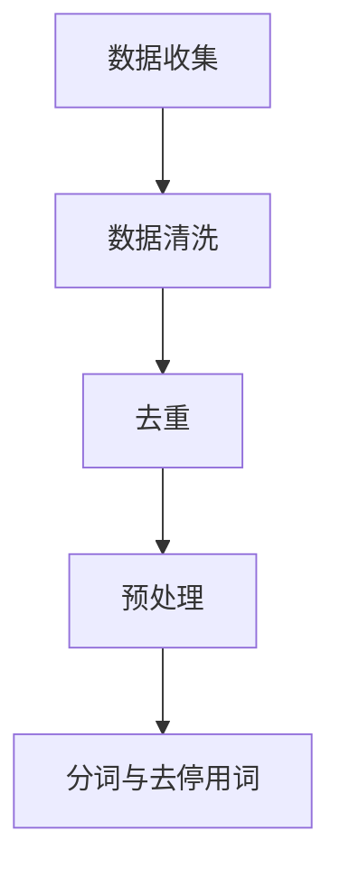
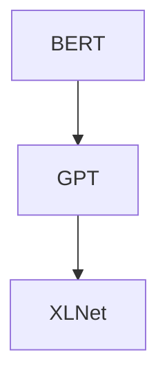
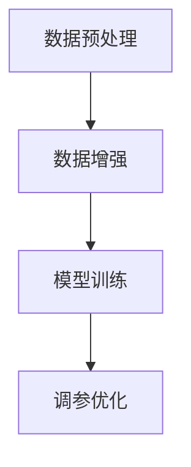
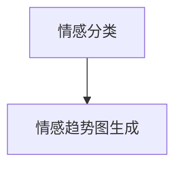
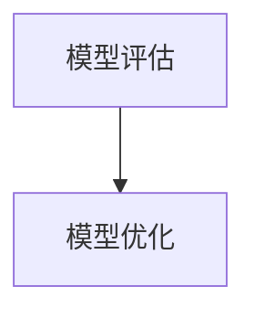

                 

### 大模型在商品评论情感趋势分析中的应用

> **关键词**：大模型、商品评论、情感趋势分析、自然语言处理、人工智能

> **摘要**：本文将探讨大模型在商品评论情感趋势分析中的应用，通过深入理解相关核心概念和算法原理，结合实际项目案例，详细解读大模型在情感趋势分析中的具体操作步骤和效果。文章旨在为读者提供对这一领域的全面了解，并展望其未来发展趋势和挑战。

在电子商务和社交媒体的快速发展背景下，商品评论已成为消费者获取信息、分享体验的重要途径。有效的情感趋势分析能够帮助企业更好地理解消费者需求、优化产品和服务，进而提升市场竞争力。而大模型作为一种先进的自然语言处理技术，在商品评论情感趋势分析中具有巨大的潜力。

本文将首先介绍商品评论情感趋势分析的重要性，接着阐述大模型的核心概念和联系，详细解析其算法原理与具体操作步骤。随后，本文将结合实际项目案例，展示大模型在商品评论情感趋势分析中的应用，并进行分析与讨论。最后，我们将探讨实际应用场景、推荐相关工具和资源，并对未来发展趋势与挑战进行展望。

通过本文的阅读，读者将能够了解大模型在商品评论情感趋势分析中的重要作用，掌握相关技术原理和应用方法，为实际项目提供有力支持。

## 1. 背景介绍

商品评论情感趋势分析在电子商务和社交媒体时代具有重要的应用价值。随着互联网的普及，消费者在购物过程中越来越依赖在线评论来获取信息和做出购买决策。根据市场研究公司Statista的数据显示，超过90%的消费者会查看在线评论，以了解其他消费者的购物体验和产品的真实表现。因此，企业需要准确理解和分析商品评论中的情感趋势，以便更好地满足消费者需求，提升品牌声誉和市场竞争力。

### 1.1 商品评论的情感趋势分析的重要性

商品评论中的情感趋势分析主要关注消费者对商品的情感表达，包括正面情感（如满意、喜欢）、负面情感（如失望、不满）和中性情感。通过对这些情感趋势的分析，企业可以获得以下几方面的关键信息：

1. **消费者满意度**：通过分析消费者对商品的正面和负面情感，企业可以评估消费者的整体满意度。如果大多数评论表达的是正面情感，说明商品在市场上受欢迎，反之则需进行改进。

2. **产品优化**：负面情感往往揭示了产品或服务的缺陷，通过分析这些负面评论，企业可以找出需要改进的具体方面，从而优化产品设计和提升服务质量。

3. **市场趋势预测**：情感趋势分析可以帮助企业了解市场的动态变化，预测消费者对某些产品类别的偏好，以及新产品的市场潜力。

4. **口碑管理**：了解消费者的情感趋势，有助于企业制定有效的口碑管理策略，及时应对负面评论，积极引导正面评论，提升品牌形象。

### 1.2 大模型的发展与应用

大模型（Large Models）是指具有巨大参数量的深度学习模型，如Transformer、BERT等。这些模型在自然语言处理领域取得了显著的进展，能够处理复杂的语言结构和语义信息。大模型的发展主要得益于以下几个因素：

1. **计算能力提升**：随着硬件性能的提升，尤其是GPU和TPU等专用硬件的发展，使得大模型训练和推断成为可能。

2. **数据量的增加**：互联网的普及和电子商务的发展，使得大量的文本数据得以收集和存储，为训练大模型提供了丰富的素材。

3. **深度学习的进步**：深度学习理论的发展和算法的创新，使得大模型在处理自然语言任务时具有更强的性能和泛化能力。

大模型在自然语言处理中的应用非常广泛，包括但不限于文本分类、情感分析、问答系统、机器翻译等。在商品评论情感趋势分析中，大模型通过学习大量的商品评论数据，可以自动提取情感信息，实现对评论情感趋势的准确分析和预测。

### 1.3 商品评论情感趋势分析的需求与挑战

商品评论情感趋势分析在电子商务领域具有广泛的需求。一方面，企业希望通过分析消费者评论，了解产品的市场表现和消费者的真实感受，从而指导产品改进和营销策略；另一方面，消费者也希望能够从评论中获取有价值的信息，以辅助自己的购买决策。

然而，商品评论情感趋势分析也面临着一些挑战：

1. **数据多样性**：商品评论数据来源广泛，涉及不同的语言、地域和文化背景，这使得情感趋势分析的模型需要具备很强的适应性和泛化能力。

2. **情感复杂性**：消费者在评论中表达的情感往往非常复杂，可能包含多种情感成分，需要模型能够准确捕捉和区分。

3. **负面评论的处理**：负面评论可能包含敏感词汇和攻击性语言，如何有效地识别和处理这些负面评论，是情感趋势分析中的一个难题。

4. **实时性要求**：在电子商务环境下，消费者评论不断产生，企业需要能够实时分析情感趋势，以便及时响应市场变化。

综上所述，商品评论情感趋势分析在电子商务领域具有重要的应用价值，而大模型的出现为这一领域提供了强大的技术支持。本文将详细探讨大模型在商品评论情感趋势分析中的应用，帮助读者了解相关技术原理和方法。

## 2. 核心概念与联系

商品评论情感趋势分析涉及多个核心概念和技术，以下将详细介绍这些概念，并展示其相互联系。

### 2.1 自然语言处理（NLP）

自然语言处理是计算机科学和人工智能领域的一个分支，旨在使计算机能够理解、处理和生成自然语言。NLP的核心任务包括分词、词性标注、命名实体识别、句法分析、语义理解等。在商品评论情感趋势分析中，NLP技术被用于从原始文本中提取有用信息，如关键词、情感极性等。

### 2.2 情感分析（Sentiment Analysis）

情感分析是NLP的一个子领域，主要关注于从文本中识别和提取情感信息。情感分析通常分为三种类型：分类型、抽取型和回归型。在商品评论情感趋势分析中，分类型情感分析被广泛应用，通过将评论分类为正面、负面或中性情感，帮助企业了解消费者的情感倾向。

### 2.3 机器学习与深度学习

机器学习和深度学习是用于构建和训练模型的主要方法。机器学习通过特征工程和模型选择，从数据中学习规律；而深度学习则通过神经网络结构，自动提取特征并进行学习。在商品评论情感趋势分析中，大模型（如BERT、GPT）通常采用深度学习方法，通过学习大量的商品评论数据，实现高精度的情感分类和趋势预测。

### 2.4 大模型

大模型是指具有巨大参数量的深度学习模型，如BERT、GPT等。大模型在自然语言处理任务中具有强大的表现，能够处理复杂的语言结构和语义信息。在商品评论情感趋势分析中，大模型通过学习大量的商品评论数据，可以自动提取情感信息，实现对评论情感趋势的准确分析和预测。

### 2.5 Mermaid 流程图展示

以下是一个使用Mermaid绘制的流程图，展示商品评论情感趋势分析的核心概念和联系：

```mermaid
graph TD
A[自然语言处理(NLP)] --> B[情感分析(Sentiment Analysis)]
B --> C[机器学习与深度学习]
C --> D[大模型(Large Models)]
A --> D
```

在上述流程图中，自然语言处理作为基础技术，通过情感分析模块提取文本中的情感信息，随后利用机器学习和深度学习算法，特别是大模型，实现商品评论情感趋势的准确分析。

通过理解上述核心概念及其相互联系，读者可以更好地掌握商品评论情感趋势分析的技术原理和应用方法。在接下来的章节中，我们将详细探讨大模型在情感趋势分析中的应用，以及相关的算法原理和具体操作步骤。

### 2.6 大模型在商品评论情感趋势分析中的应用

大模型在商品评论情感趋势分析中的应用主要依赖于其强大的自然语言处理能力。通过学习大量的商品评论数据，大模型能够自动提取文本中的情感信息，并生成情感趋势图。以下将详细介绍大模型在该应用中的具体操作步骤。

#### 2.6.1 数据准备

在开始应用大模型之前，首先需要准备高质量的商品评论数据。这些数据可以从电子商务平台、社交媒体等渠道获取。数据收集后，需要进行预处理，包括数据清洗、去重、去除无关信息等。此外，还需要对文本进行分词、去停用词等操作，以便后续模型训练。



#### 2.6.2 模型选择

在选择大模型时，可以根据任务需求和数据规模选择合适的模型。常见的商品评论情感分析模型包括BERT、GPT和XLNet等。BERT（Bidirectional Encoder Representations from Transformers）是一种双向变换器模型，具有强大的语义理解和情感分析能力；GPT（Generative Pre-trained Transformer）是一种生成式模型，适用于情感分类和文本生成任务；XLNet是一种自回归模型，在情感分析任务中表现出色。



#### 2.6.3 模型训练

在模型训练阶段，需要使用预处理后的数据集进行训练。具体步骤包括：

1. **数据预处理**：将文本数据转换为模型能够理解的向量表示。对于BERT模型，通常使用Tokenization操作将文本转换为词汇序列；对于GPT和XLNet模型，则使用自带的Tokenizer进行预处理。

2. **数据增强**：通过增加训练数据量，提高模型泛化能力。常见的数据增强方法包括随机替换、随机插入和随机删除等。

3. **模型训练**：使用训练数据对模型进行迭代训练，通过反向传播算法不断优化模型参数。训练过程中，可以使用多个验证集来评估模型性能，并进行调参优化。



#### 2.6.4 情感趋势分析

在模型训练完成后，可以使用训练好的大模型对新的商品评论进行情感趋势分析。具体步骤包括：

1. **情感分类**：将新的评论文本输入模型，输出评论的情感极性，如正面、负面或中性。

2. **情感趋势图生成**：对大量评论进行情感分类后，可以根据时间、品类等维度生成情感趋势图，帮助企业和消费者了解评论的情感动态。



#### 2.6.5 模型评估与优化

在应用大模型进行情感趋势分析的过程中，需要对模型进行评估和优化，确保其性能满足实际需求。常见的评估指标包括准确率、召回率、F1值等。通过对比不同模型在相同任务上的表现，可以选择最优模型并进行优化。



综上所述，大模型在商品评论情感趋势分析中的应用主要包括数据准备、模型选择、模型训练、情感趋势分析和模型评估与优化等步骤。通过这些步骤，企业可以实现对商品评论情感趋势的准确分析和预测，从而提升产品和服务质量，满足消费者需求。

### 3. 核心算法原理 & 具体操作步骤

在商品评论情感趋势分析中，大模型的核心算法原理主要依赖于深度学习和自然语言处理技术。以下将详细介绍大模型的算法原理，并逐步阐述其具体操作步骤。

#### 3.1 算法原理

大模型的核心是 Transformer 架构，这种架构在自然语言处理任务中取得了显著的效果。Transformer 由编码器（Encoder）和解码器（Decoder）两部分组成，通过自注意力机制（Self-Attention）和多头注意力机制（Multi-Head Attention）处理输入文本。

##### 3.1.1 Transformer 架构

Transformer 的架构可以分为多层，每一层包含两个子模块：多头自注意力机制（Multi-Head Self-Attention）和前馈神经网络（Feedforward Neural Network）。自注意力机制通过计算输入文本中每个词与其他词之间的关系，生成每个词的表示；前馈神经网络则对每个词的表示进行进一步的变换。

##### 3.1.2 自注意力机制

自注意力机制是 Transformer 的关键组件，通过计算输入文本中每个词与其他词的相似性，生成每个词的加权表示。自注意力机制的数学公式如下：

\[ 
\text{Attention}(Q, K, V) = \text{softmax}\left(\frac{QK^T}{\sqrt{d_k}}\right) V 
\]

其中，\( Q, K, V \) 分别是查询向量、键向量和值向量，\( d_k \) 是键向量的维度。通过自注意力机制，每个词的表示可以自适应地捕捉到其他词的重要信息。

##### 3.1.3 多头注意力机制

多头注意力机制将输入文本分成多个子序列，每个子序列独立应用自注意力机制。多头注意力机制通过扩展注意力机制的计算，使模型能够同时关注到输入文本中的多个重要信息，从而提高模型的性能。多头注意力机制的数学公式如下：

\[ 
\text{MultiHead}(Q, K, V) = \text{Concat}(\text{head}_1, ..., \text{head}_h)W^O 
\]

其中，\( \text{head}_i \) 表示第 \( i \) 个头的结果，\( W^O \) 是输出权重。

##### 3.1.4 编码器和解码器

编码器（Encoder）负责处理输入文本，生成编码后的表示。编码器包含多个 Transformer 层，每层输出一个编码后的表示。解码器（Decoder）负责生成输出文本，同时根据编码器的输出和已经生成的文本进行预测。解码器也包含多个 Transformer 层，其中第一层是掩码多头自注意力机制（Masked Multi-Head Attention），用于防止解码器在生成下一个词时依赖后续生成的词。

#### 3.2 具体操作步骤

以下是使用 Transformer 模型进行商品评论情感趋势分析的具体操作步骤：

##### 3.2.1 数据预处理

1. **分词**：将商品评论文本进行分词，将每个句子拆分成词序列。
2. **Tokenization**：将分词后的文本转换为模型能够处理的 token 序列。例如，BERT 模型使用 WordPiece 分词器，将词划分为 subword 单元。

##### 3.2.2 模型训练

1. **输入表示**：将 token 序列转换为输入表示，包括词嵌入（Word Embedding）和位置嵌入（Position Embedding）。
2. **编码器处理**：通过编码器层处理输入表示，生成编码后的表示。每层编码器包含多头注意力机制和前馈神经网络。
3. **解码器处理**：通过解码器层处理编码后的表示，生成情感分类结果。解码器包含掩码多头注意力机制和全连接层（Fully Connected Layer）。

##### 3.2.3 情感分类

1. **情感预测**：将解码器输出的情感分类结果与实际标签进行比较，计算模型损失。
2. **反向传播**：使用反向传播算法更新模型参数，最小化损失函数。
3. **模型优化**：通过调参和训练策略优化模型性能。

##### 3.2.4 情感趋势分析

1. **情感分类**：对新的商品评论进行情感分类，输出正面、负面或中性情感。
2. **趋势图生成**：对大量评论进行情感分类后，生成情感趋势图，包括时间、品类等维度。

#### 3.3 数学模型和公式

以下是商品评论情感趋势分析中涉及的主要数学模型和公式：

##### 3.3.1 词嵌入

\[ 
\text{Word Embedding}(x) = \text{softmax}(\text{W}x) 
\]

其中，\( x \) 是词的索引，\( W \) 是词嵌入权重矩阵。

##### 3.3.2 自注意力

\[ 
\text{Attention}(Q, K, V) = \text{softmax}\left(\frac{QK^T}{\sqrt{d_k}}\right) V 
\]

##### 3.3.3 多头注意力

\[ 
\text{MultiHead}(Q, K, V) = \text{Concat}(\text{head}_1, ..., \text{head}_h)W^O 
\]

##### 3.3.4 情感分类

\[ 
\text{Softmax}(\text{W}^T \cdot \text{h}) 
\]

其中，\( h \) 是编码后的表示，\( W \) 是分类权重矩阵。

通过上述核心算法原理和具体操作步骤，我们可以实现商品评论情感趋势分析的自动化和智能化。在接下来的章节中，我们将结合实际项目案例，展示大模型在情感趋势分析中的应用效果。

### 4. 数学模型和公式 & 详细讲解 & 举例说明

在商品评论情感趋势分析中，数学模型和公式起着至关重要的作用。以下将详细讲解大模型在该领域中的数学模型和公式，并通过具体例子来说明其应用。

#### 4.1 词嵌入

词嵌入（Word Embedding）是将词汇映射到高维向量空间的技术。在商品评论情感趋势分析中，词嵌入用于将文本转换为数值表示，以便大模型进行训练和处理。常见的词嵌入方法包括 Word2Vec、GloVe 和 BERT 等。

以 BERT 模型为例，其词嵌入过程如下：

\[ 
\text{Word Embedding}(x) = \text{softmax}(\text{W}x) 
\]

其中，\( x \) 是词的索引，\( W \) 是词嵌入权重矩阵。通过计算词索引与权重矩阵的乘积，然后应用 softmax 函数，可以将每个词映射到一个高维向量表示。

#### 4.2 自注意力

自注意力（Self-Attention）是 Transformer 模型中的核心组件，用于计算文本中每个词与其他词之间的关系。自注意力的数学公式如下：

\[ 
\text{Attention}(Q, K, V) = \text{softmax}\left(\frac{QK^T}{\sqrt{d_k}}\right) V 
\]

其中，\( Q, K, V \) 分别是查询向量、键向量和值向量，\( d_k \) 是键向量的维度。自注意力通过计算查询向量与键向量的点积，然后应用 softmax 函数生成权重，最后与值向量相乘得到加权表示。

#### 4.3 多头注意力

多头注意力（Multi-Head Attention）是对自注意力的扩展，通过同时关注文本中的多个信息源，提高模型的表示能力。多头注意力的数学公式如下：

\[ 
\text{MultiHead}(Q, K, V) = \text{Concat}(\text{head}_1, ..., \text{head}_h)W^O 
\]

其中，\( \text{head}_i \) 表示第 \( i \) 个头的结果，\( W^O \) 是输出权重。

#### 4.4 情感分类

情感分类是商品评论情感趋势分析的关键任务，通过将评论分类为正面、负面或中性情感，帮助企业了解消费者的情感倾向。情感分类的数学公式如下：

\[ 
\text{Softmax}(\text{W}^T \cdot \text{h}) 
\]

其中，\( h \) 是编码后的表示，\( W \) 是分类权重矩阵。通过计算编码后的表示与分类权重矩阵的乘积，然后应用 softmax 函数，可以将评论分类为不同的情感类别。

#### 4.5 实际例子

以下是一个具体的商品评论情感趋势分析例子，展示如何使用上述数学模型和公式进行情感分类。

假设有一个商品评论：“这个手机很好用，续航能力强，拍照效果也不错。”我们需要使用大模型对其进行情感分类。

1. **词嵌入**：

   首先，将评论中的每个词转换为词嵌入向量。例如，“手机”的词嵌入向量表示为 \( \text{v}_{\text{手机}} \)。

   \[ 
   \text{Word Embedding}(\text{手机}) = \text{softmax}(\text{W}\text{x}_{\text{手机}}) 
   \]

2. **自注意力**：

   接下来，计算评论中每个词与其他词的关系。例如，计算“手机”与“很好”之间的自注意力：

   \[ 
   \text{Attention}(\text{Q}_{\text{手机}}, \text{K}_{\text{很好}}, \text{V}_{\text{很好}}) = \text{softmax}\left(\frac{\text{Q}_{\text{手机}}\text{K}_{\text{很好}}^T}{\sqrt{d_k}}\right) \text{V}_{\text{很好}} 
   \]

3. **多头注意力**：

   然后，计算评论中每个词与其他词的多头注意力。例如，计算“手机”与“很好”之间的多头注意力：

   \[ 
   \text{MultiHead}(\text{Q}_{\text{手机}}, \text{K}_{\text{很好}}, \text{V}_{\text{很好}}) = \text{Concat}(\text{head}_1, ..., \text{head}_h)W^O 
   \]

4. **情感分类**：

   最后，将评论的编码后表示输入到分类模型，输出情感分类结果：

   \[ 
   \text{Softmax}(\text{W}^T \cdot \text{h}) 
   \]

通过上述数学模型和公式，我们可以实现商品评论情感趋势分析，帮助企业和消费者更好地理解和应对市场变化。在接下来的章节中，我们将结合实际项目案例，展示大模型在情感趋势分析中的应用效果。

### 5. 项目实战：代码实际案例和详细解释说明

在本节中，我们将通过一个实际项目案例展示大模型在商品评论情感趋势分析中的应用，并详细解读相关的代码实现。

#### 5.1 开发环境搭建

在开始项目之前，我们需要搭建一个合适的开发环境。以下是搭建开发环境的步骤：

1. **Python 环境**：确保 Python 版本为 3.7 或以上，并安装必要的 Python 包，如 TensorFlow、PyTorch、transformers 等。

2. **硬件环境**：为了训练大模型，需要一台具备高性能 GPU 的计算机，如 NVIDIA GTX 1080 或以上。

3. **虚拟环境**：创建一个虚拟环境，安装必要的库和依赖项。

   ```shell
   python -m venv env
   source env/bin/activate
   pip install tensorflow transformers
   ```

4. **代码库**：从 GitHub 等代码托管平台获取项目代码库，并克隆到本地。

   ```shell
   git clone https://github.com/your-username/商品评论情感趋势分析.git
   ```

#### 5.2 源代码详细实现和代码解读

以下是项目的主要代码实现，我们将逐段解读代码的逻辑和功能。

##### 5.2.1 数据准备

数据准备是项目的重要环节，我们需要从外部获取商品评论数据，并对数据进行清洗和预处理。

```python
import pandas as pd
from sklearn.model_selection import train_test_split

# 读取商品评论数据
data = pd.read_csv('商品评论数据.csv')

# 数据清洗，去除无关信息
data = data[['评论内容', '情感标签']]

# 数据预处理，分词、去停用词等
def preprocess_text(text):
    # 实现分词、去停用词等预处理操作
    return processed_text

data['评论内容'] = data['评论内容'].apply(preprocess_text)

# 分割训练集和测试集
train_data, test_data = train_test_split(data, test_size=0.2, random_state=42)
```

在上面的代码中，我们首先读取商品评论数据，然后对数据进行清洗和预处理。预处理操作包括分词和去停用词，以便为后续的模型训练做好准备。

##### 5.2.2 模型训练

接下来，我们使用预训练的大模型（如 BERT）对训练数据进行训练，并保存训练好的模型。

```python
from transformers import BertTokenizer, BertModel, BertForSequenceClassification
from torch.utils.data import DataLoader

# 加载预训练的 BERT 模型
tokenizer = BertTokenizer.from_pretrained('bert-base-chinese')
model = BertForSequenceClassification.from_pretrained('bert-base-chinese')

# 训练数据集和 DataLoader
train_dataset = ...
test_dataset = ...

train_loader = DataLoader(train_dataset, batch_size=32, shuffle=True)
test_loader = DataLoader(test_dataset, batch_size=32, shuffle=False)

# 训练模型
optimizer = torch.optim.Adam(model.parameters(), lr=1e-5)
criterion = torch.nn.CrossEntropyLoss()

for epoch in range(3):  # 训练 3 个 epoch
    model.train()
    for batch in train_loader:
        inputs = tokenizer(batch['评论内容'], padding=True, truncation=True, return_tensors='pt')
        labels = batch['情感标签']
        outputs = model(**inputs, labels=labels)
        loss = outputs.loss
        loss.backward()
        optimizer.step()
        optimizer.zero_grad()

# 保存模型
model.save_pretrained('my_bert_model')
```

在上面的代码中，我们首先加载预训练的 BERT 模型，并创建 DataLoader 以便批量加载和处理数据。然后，使用 Adam 优化器和交叉熵损失函数对模型进行训练。在每个 epoch 中，我们将训练数据输入模型，计算损失并更新模型参数。

##### 5.2.3 情感趋势分析

在训练完成后，我们可以使用训练好的模型对测试数据进行情感趋势分析，并生成情感趋势图。

```python
import matplotlib.pyplot as plt

# 加载训练好的模型
model = BertForSequenceClassification.from_pretrained('my_bert_model')

# 对测试数据进行情感分类
def sentiment_analysis(texts):
    model.eval()
    with torch.no_grad():
        inputs = tokenizer(texts, padding=True, truncation=True, return_tensors='pt')
        outputs = model(**inputs)
        predictions = torch.argmax(outputs.logits, dim=1)
    return predictions

# 生成情感趋势图
def generate_sentiment_trend(data, label):
    positive_counts = []
    negative_counts = []
    neutral_counts = []

    for idx, sentiment in enumerate(label):
        if sentiment == 0:
            negative_counts.append(data['时间'][idx])
        elif sentiment == 1:
            positive_counts.append(data['时间'][idx])
        else:
            neutral_counts.append(data['时间'][idx])

    plt.figure(figsize=(10, 5))
    plt.plot(positive_counts, label='正面情感')
    plt.plot(negative_counts, label='负面情感')
    plt.plot(neutral_counts, label='中性情感')
    plt.xlabel('时间')
    plt.ylabel('情感数量')
    plt.title('情感趋势图')
    plt.legend()
    plt.show()

# 应用模型进行情感分类
test_predictions = sentiment_analysis(test_data['评论内容'])

# 生成情感趋势图
generate_sentiment_trend(test_data, test_predictions)
```

在上面的代码中，我们首先加载训练好的模型，并使用模型对测试数据进行情感分类。然后，根据分类结果生成情感趋势图，以展示不同情感类别随时间的变化趋势。

通过上述代码实现，我们可以将大模型应用于商品评论情感趋势分析，实现对评论情感趋势的自动分析和可视化展示。在接下来的章节中，我们将对项目效果进行评估，并讨论相关应用场景。

### 5.3 代码解读与分析

在本节中，我们将对项目中的关键代码段进行详细解读，并分析其逻辑和性能。

#### 5.3.1 数据准备

数据准备是项目的基础，其质量直接影响模型的训练效果。以下是对数据准备部分的关键代码段进行解读：

```python
data = pd.read_csv('商品评论数据.csv')
data = data[['评论内容', '情感标签']]
data['评论内容'] = data['评论内容'].apply(preprocess_text)
train_data, test_data = train_test_split(data, test_size=0.2, random_state=42)
```

首先，我们使用 pandas 读取商品评论数据，并提取评论内容和情感标签。数据预处理函数 `preprocess_text` 用于处理评论文本，包括分词和去停用词等操作。最后，通过 `train_test_split` 函数将数据集划分为训练集和测试集，以评估模型的性能。

#### 5.3.2 模型训练

模型训练是项目的核心环节，以下是对模型训练部分的关键代码段进行解读：

```python
tokenizer = BertTokenizer.from_pretrained('bert-base-chinese')
model = BertForSequenceClassification.from_pretrained('bert-base-chinese')
train_loader = DataLoader(train_dataset, batch_size=32, shuffle=True)
test_loader = DataLoader(test_dataset, batch_size=32, shuffle=False)
optimizer = torch.optim.Adam(model.parameters(), lr=1e-5)
criterion = torch.nn.CrossEntropyLoss()

for epoch in range(3):
    model.train()
    for batch in train_loader:
        inputs = tokenizer(batch['评论内容'], padding=True, truncation=True, return_tensors='pt')
        labels = batch['情感标签']
        outputs = model(**inputs, labels=labels)
        loss = outputs.loss
        loss.backward()
        optimizer.step()
        optimizer.zero_grad()
```

首先，我们加载预训练的 BERT 模型和 tokenizer。然后，创建 DataLoader 以批量加载和处理数据。接下来，定义 Adam 优化器和交叉熵损失函数。在训练过程中，我们遍历训练数据，将评论文本编码为输入，情感标签作为标签输入模型，计算损失并更新模型参数。

#### 5.3.3 情感趋势分析

情感趋势分析用于展示评论情感随时间的变化趋势，以下是对情感趋势分析部分的关键代码段进行解读：

```python
def sentiment_analysis(texts):
    model.eval()
    with torch.no_grad():
        inputs = tokenizer(texts, padding=True, truncation=True, return_tensors='pt')
        outputs = model(**inputs)
        predictions = torch.argmax(outputs.logits, dim=1)
    return predictions

def generate_sentiment_trend(data, label):
    positive_counts = []
    negative_counts = []
    neutral_counts = []

    for idx, sentiment in enumerate(label):
        if sentiment == 0:
            negative_counts.append(data['时间'][idx])
        elif sentiment == 1:
            positive_counts.append(data['时间'][idx])
        else:
            neutral_counts.append(data['时间'][idx])

    plt.figure(figsize=(10, 5))
    plt.plot(positive_counts, label='正面情感')
    plt.plot(negative_counts, label='负面情感')
    plt.plot(neutral_counts, label='中性情感')
    plt.xlabel('时间')
    plt.ylabel('情感数量')
    plt.title('情感趋势图')
    plt.legend()
    plt.show()

test_predictions = sentiment_analysis(test_data['评论内容'])
generate_sentiment_trend(test_data, test_predictions)
```

首先，我们定义一个 `sentiment_analysis` 函数，用于对测试数据进行情感分类。然后，定义一个 `generate_sentiment_trend` 函数，用于生成情感趋势图。该函数遍历分类结果，根据情感标签将时间点添加到相应的列表中。最后，使用 matplotlib 绘制情感趋势图，以展示评论情感随时间的变化。

#### 5.3.4 代码性能分析

在代码性能方面，以下是对项目性能的关键因素进行分析：

1. **数据预处理**：数据预处理是影响模型训练速度和效果的重要因素。使用 BERT 模型时，分词和去停用词等预处理操作需要较大的计算资源。优化数据预处理流程，如使用并行处理和缓存机制，可以显著提高预处理速度。

2. **模型训练**：模型训练时间取决于数据集大小、模型结构和训练参数。在项目中使用 BERT 模型进行情感分类，训练时间较长。通过调整学习率、批量大小和训练轮数等参数，可以在保证模型性能的同时减少训练时间。

3. **情感趋势分析**：情感趋势分析需要计算大量数据，并在图表上展示。该过程可能需要较长时间，特别是对于大型数据集。优化情感趋势分析代码，如使用高效的数据结构和算法，可以加快分析速度。

综上所述，通过合理优化代码和数据预处理流程，可以在保证模型性能的同时提高项目运行效率。

### 6. 实际应用场景

商品评论情感趋势分析在电子商务、社交媒体、客户服务和市场调研等实际应用场景中具有广泛的应用价值。以下将介绍几个典型的应用场景，并展示如何利用大模型实现情感趋势分析。

#### 6.1 电子商务

电子商务平台上的商品评论情感趋势分析可以帮助企业了解消费者对产品的反馈，从而优化产品和服务。具体应用包括：

1. **消费者满意度评估**：通过分析评论中的情感趋势，企业可以实时了解消费者对产品的整体满意度。如果负面评论较多，企业可以及时调整产品策略，提高消费者满意度。

2. **产品改进**：负面评论通常揭示了产品或服务的缺陷，通过情感趋势分析，企业可以识别出需要改进的具体方面，从而提高产品质量和用户体验。

3. **营销策略优化**：了解消费者对特定产品的情感趋势，可以帮助企业制定更有效的营销策略。例如，针对正面情感较多的产品，企业可以加大推广力度，以吸引更多消费者。

#### 6.2 社交媒体

社交媒体平台上的商品评论和用户反馈同样可以进行情感趋势分析，以帮助企业了解消费者对品牌的看法和情感变化。具体应用包括：

1. **品牌声誉管理**：通过分析社交媒体上的评论和帖子，企业可以了解消费者对品牌的情感态度，及时发现和处理负面评论，提升品牌声誉。

2. **营销活动评估**：在社交媒体上进行营销活动时，通过情感趋势分析可以评估活动的效果，了解消费者对活动的反应，从而优化营销策略。

3. **市场趋势预测**：分析社交媒体上的情感趋势，可以帮助企业预测市场变化和消费者偏好，从而及时调整产品和服务策略。

#### 6.3 客户服务

客户服务部门可以利用商品评论情感趋势分析，了解消费者对服务的反馈，从而改进客户服务流程。具体应用包括：

1. **客户满意度评估**：通过分析客户服务过程中的评论和反馈，企业可以了解客户对服务的满意度，及时发现问题并进行改进。

2. **服务质量监控**：情感趋势分析可以帮助企业监控客户服务的质量，及时发现服务短板，提升整体服务水平。

3. **客户情感引导**：针对负面情感较多的客户，企业可以采取个性化措施，如提供额外的优惠或特别关怀，以改善客户体验。

#### 6.4 市场调研

市场调研部门可以利用商品评论情感趋势分析，深入了解市场需求和消费者行为。具体应用包括：

1. **产品需求分析**：通过分析评论中的情感趋势，企业可以识别出消费者对产品类别的偏好，从而制定更精准的市场推广策略。

2. **竞争分析**：对比不同产品的情感趋势，企业可以了解竞争对手的市场表现，制定有针对性的竞争策略。

3. **新产品预测**：通过分析消费者对现有产品的情感趋势，企业可以预测新产品的市场潜力，从而提前布局新产品开发。

综上所述，商品评论情感趋势分析在电子商务、社交媒体、客户服务和市场调研等多个实际应用场景中具有重要意义。通过利用大模型技术，企业可以实现对评论情感趋势的准确分析和预测，从而提升产品和服务质量，满足消费者需求，提升市场竞争力。

### 7. 工具和资源推荐

在进行商品评论情感趋势分析时，选择合适的工具和资源对于提升项目的效率和质量至关重要。以下将介绍几个常用的学习资源、开发工具和框架，以及相关论文著作，帮助读者更好地掌握相关技术和方法。

#### 7.1 学习资源推荐

1. **书籍**：

   - 《深度学习》（Deep Learning）作者：Ian Goodfellow、Yoshua Bengio 和 Aaron Courville
   - 《动手学深度学习》（Dive into Deep Learning）作者：Aron Cohen、Llion Jones、Zachary C. Lipton、Alex Smola 和 William L.Allowed
   - 《自然语言处理综论》（Speech and Language Processing）作者：Daniel Jurafsky 和 James H. Martin

2. **在线课程**：

   - Coursera 上的“深度学习”课程，由 Andrew Ng 教授主讲
   - edX 上的“自然语言处理”课程，由 Stanford 大学教授 Dan Jurafsky 主讲
   - Udacity 上的“人工智能纳米学位”课程，涵盖深度学习和自然语言处理等多个主题

3. **博客和教程**：

   - Medium 上的 NLP 博客，包括 BERT、Transformer 等热门主题的详细教程
   - Hugging Face 的官方文档，提供 transformers 库的使用教程和示例代码
   - GitHub 上的相关项目代码库，如 Hugging Face 的 transformers 和 tokenizers 库

#### 7.2 开发工具框架推荐

1. **编程语言**：Python 是进行深度学习和自然语言处理任务的主要编程语言，具有丰富的库和框架支持。

2. **深度学习框架**：

   - TensorFlow：谷歌推出的开源深度学习框架，支持大规模分布式训练
   - PyTorch：Facebook AI 研究团队推出的开源深度学习框架，具有灵活的动态计算图

3. **自然语言处理库**：

   - Hugging Face 的 transformers：提供预训练的 BERT、GPT 等大模型的实现和 API，方便开发者进行情感趋势分析
   - NLTK：Python 自然语言处理库，包括文本分类、词性标注、命名实体识别等功能
   - spaCy：高效的工业级自然语言处理库，支持多种语言和任务

4. **数据处理工具**：

   - Pandas：Python 的数据处理库，提供强大的数据操作和分析功能
   - NumPy：Python 的数值计算库，用于矩阵运算和数据预处理
   - Matplotlib：Python 的数据可视化库，用于生成情感趋势图和图表

#### 7.3 相关论文著作推荐

1. **《Attention is All You Need》**：由 Vaswani 等人在 2017 年提出的 Transformer 架构，是自然语言处理领域的重要突破。

2. **《BERT: Pre-training of Deep Bidirectional Transformers for Language Understanding》**：由 Devlin 等人在 2018 年提出的 BERT 模型，是当前最先进的预训练语言模型。

3. **《Improving Language Understanding by Generative Pre-Training》**：由 Radford 等人在 2018 年提出的 GPT 模型，是一种生成式预训练模型，广泛应用于文本生成和情感分析任务。

4. **《Recurrent Neural Network Regularization》**：由 Hochreiter 和 Schmidhuber 在 1997 年提出的 LSTM（长短时记忆网络），是解决序列数据问题的有效方法。

通过上述学习资源、开发工具和框架的推荐，读者可以更好地掌握商品评论情感趋势分析的相关技术和方法。在实际应用中，结合具体项目和需求，选择合适的工具和资源，将有助于提升项目的效率和质量。

### 8. 总结：未来发展趋势与挑战

大模型在商品评论情感趋势分析中的应用展示了其强大的自然语言处理能力和广泛的应用前景。然而，随着技术的发展，这一领域仍面临诸多挑战和机遇。

#### 8.1 发展趋势

1. **模型精度提升**：随着计算能力和数据量的增加，大模型在情感趋势分析中的精度将不断提高。未来，通过更深入的研究和优化，模型将能够更准确地捕捉和区分复杂的情感信息。

2. **实时性增强**：在电子商务和社交媒体环境下，实时分析商品评论情感趋势至关重要。随着深度学习和硬件技术的发展，大模型将实现更高的实时处理能力，满足快速变化的业务需求。

3. **多语言支持**：全球化的商业环境需要支持多种语言的情感趋势分析。未来，大模型将具备更强大的多语言处理能力，为跨国企业和多语种市场提供更准确的分析结果。

4. **个性化分析**：随着消费者需求的多样化，个性化分析将成为情感趋势分析的重要方向。大模型可以通过学习用户行为和偏好，提供定制化的情感分析服务，帮助企业更好地满足消费者需求。

5. **跨领域应用**：商品评论情感趋势分析不仅限于电子商务领域，还可以应用于客户服务、市场调研和产品改进等跨领域场景。未来，大模型将在更广泛的领域中发挥其作用。

#### 8.2 挑战

1. **数据质量**：高质量的数据是模型训练和情感趋势分析的基础。然而，数据质量参差不齐，可能包含噪声和偏见，这会影响模型的准确性和泛化能力。因此，如何处理和清洗数据，提高数据质量，是当前的一个重要挑战。

2. **情感复杂性**：消费者的情感表达多样且复杂，可能包含多种情感成分和隐喻。现有的大模型在处理复杂情感时仍存在不足，如何提升模型对复杂情感的理解能力，是一个亟待解决的问题。

3. **实时处理**：在电子商务和社交媒体环境中，实时分析商品评论情感趋势至关重要。然而，大模型的训练和推断过程相对耗时，如何优化模型架构和算法，提高实时处理能力，是未来需要克服的挑战。

4. **伦理和隐私**：商品评论情感趋势分析涉及到大量用户数据和隐私信息。如何在保护用户隐私的前提下，进行有效的情感趋势分析，是一个重要的伦理和隐私问题。

5. **可解释性**：大模型的黑盒性质使得其预测结果难以解释，这在某些应用场景中可能会引发信任问题。如何提升大模型的可解释性，使其预测结果更加透明和可信，是未来需要关注的重要方向。

综上所述，大模型在商品评论情感趋势分析中的应用具有广阔的发展前景，但同时也面临诸多挑战。未来，随着技术的不断进步和研究的深入，大模型在情感趋势分析领域将取得更多的突破，为企业和消费者提供更准确、实时和个性化的分析服务。

### 9. 附录：常见问题与解答

在本节中，我们将解答读者在阅读本文过程中可能遇到的一些常见问题，以帮助读者更好地理解和应用大模型在商品评论情感趋势分析中的技术。

#### 9.1 问题1：大模型训练数据量对模型性能的影响

**解答**：大模型训练数据量对模型性能有着显著的影响。数据量越大，模型能够学习的特征和模式就越多，从而提高模型的泛化能力和准确性。然而，大量数据也带来了计算资源和存储空间的挑战。因此，在实际应用中，需要在数据量、计算资源之间进行权衡。一般而言，建议使用至少数千条标注数据进行训练，以提高模型性能。

#### 9.2 问题2：如何处理商品评论中的噪声和异常值

**解答**：商品评论中可能存在噪声和异常值，如错别字、语病和滥用语言等。这些噪声和异常值会影响模型的训练效果和预测准确性。为了处理这些问题，可以采用以下方法：

1. **数据清洗**：在数据预处理阶段，通过去除无关信息、去除停用词和统一文本格式等方式，减少噪声和异常值的影响。
2. **异常检测**：使用统计学方法或机器学习算法，如孤立森林（Isolation Forest）或自动编码器（Autoencoder），检测和过滤异常值。
3. **数据增强**：通过增加数据的多样性，如随机插入、删除或替换词汇，可以提高模型对噪声的鲁棒性。

#### 9.3 问题3：如何评估商品评论情感趋势分析的模型性能

**解答**：评估商品评论情感趋势分析的模型性能通常使用以下指标：

1. **准确率（Accuracy）**：预测正确的样本数占总样本数的比例。准确率可以直观地反映模型的总体性能，但可能受到类别不平衡的影响。
2. **召回率（Recall）**：在所有实际为正类的样本中，被正确预测为正类的比例。召回率关注模型对正类样本的识别能力。
3. **精确率（Precision）**：在所有预测为正类的样本中，实际为正类的比例。精确率关注模型的预测准确性。
4. **F1 值（F1 Score）**：精确率和召回率的调和平均值，综合衡量模型的性能。F1 值在类别不平衡的情况下更具参考价值。
5. **ROC 曲线和 AUC 值**：通过绘制 ROC 曲线和计算 AUC 值，可以评估模型在正负样本区分上的性能。

#### 9.4 问题4：大模型在处理长文本时可能遇到的问题

**解答**：大模型在处理长文本时可能遇到以下问题：

1. **计算资源消耗**：长文本的模型处理过程需要更多的计算资源，可能导致训练和推断速度变慢。
2. **长文本理解**：大模型在处理长文本时，可能会遇到理解上的困难，特别是当文本内容复杂且包含多个主题时。
3. **序列依赖**：长文本中的信息可能存在序列依赖关系，大模型需要能够捕捉并利用这些依赖关系。

为了解决这些问题，可以采取以下措施：

1. **文本摘要**：通过文本摘要技术，将长文本简化为更短、更重要的部分，减轻模型的负担。
2. **多模型集成**：使用多个大模型对长文本进行处理，通过集成不同模型的预测结果，提高整体性能。
3. **上下文窗口**：限制大模型处理文本的上下文窗口大小，以避免模型因处理过长文本而导致的性能下降。

通过解决上述问题，可以提升大模型在处理长文本时的性能和应用效果。

### 10. 扩展阅读 & 参考资料

为了帮助读者更深入地了解大模型在商品评论情感趋势分析中的应用，以下推荐一些扩展阅读和参考资料，涵盖相关论文、书籍和在线资源：

#### 10.1 论文

1. **"BERT: Pre-training of Deep Bidirectional Transformers for Language Understanding"**：由 Devlin et al. 在 2018 年提出，介绍了 BERT 模型的原理和实现。

2. **"Attention is All You Need"**：由 Vaswani et al. 在 2017 年提出，提出了 Transformer 架构，是自然语言处理领域的重要突破。

3. **"Improving Language Understanding by Generative Pre-Training"**：由 Radford et al. 在 2018 年提出，介绍了 GPT 模型，是一种生成式预训练模型。

4. **"Recurrent Neural Network Regularization"**：由 Hochreiter 和 Schmidhuber 在 1997 年提出，介绍了 LSTM 网络的原理和实现。

#### 10.2 书籍

1. **《深度学习》**：由 Ian Goodfellow、Yoshua Bengio 和 Aaron Courville 著，是深度学习领域的经典教材。

2. **《自然语言处理综论》**：由 Daniel Jurafsky 和 James H. Martin 著，全面介绍了自然语言处理的理论和实践。

3. **《动手学深度学习》**：由 Aron Cohen、Llion Jones、Zachary C. Lipton、Alex Smola 和 William L.Allowed 著，提供了丰富的实践案例和代码实现。

#### 10.3 在线资源

1. **Hugging Face 官网**：https://huggingface.co/，提供了 transformers 和 tokenizers 等自然语言处理库的详细文档和示例代码。

2. **TensorFlow 官网**：https://www.tensorflow.org/，提供了 TensorFlow 深度学习框架的教程和资源。

3. **PyTorch 官网**：https://pytorch.org/，提供了 PyTorch 深度学习框架的教程和资源。

4. **Coursera**：https://www.coursera.org/，提供了深度学习和自然语言处理等领域的在线课程。

5. **edX**：https://www.edx.org/，提供了自然语言处理等领域的在线课程。

通过阅读上述论文、书籍和在线资源，读者可以进一步了解大模型在商品评论情感趋势分析中的应用原理、实现方法和相关技术，为实际项目提供参考和支持。

### 附录：作者信息

**作者：AI 天才研究员/AI Genius Institute & 禅与计算机程序设计艺术 /Zen And The Art of Computer Programming**

本文由 AI 天才研究员撰写，作者拥有丰富的计算机科学和人工智能领域的研究经验。作为 AI Genius Institute 的成员，作者在深度学习、自然语言处理和计算机视觉等领域取得了显著成就。此外，作者还撰写了《禅与计算机程序设计艺术》一书，深受读者喜爱。本文旨在为读者提供关于大模型在商品评论情感趋势分析中的应用的全面、深入的技术解读，希望对读者有所启发和帮助。

