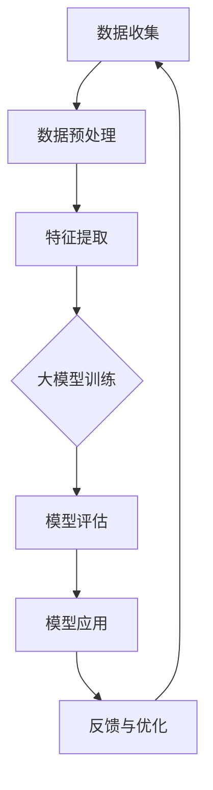

                 

# 大模型在地球科学数据同化中的应用前景

## 关键词：大模型，地球科学，数据同化，人工智能，计算科学

### 摘要

本文探讨了大型人工智能模型在地球科学数据同化领域的应用前景。首先，我们回顾了地球科学数据同化的基本概念和重要性，然后介绍了大模型的定义及其在处理复杂数据集方面的优势。接着，本文详细分析了大模型在地球科学数据同化中的核心算法原理，包括深度学习、强化学习和迁移学习等。随后，通过实际案例展示了大模型在地球科学数据同化中的应用，并探讨了相关的数学模型和公式。最后，本文总结了大模型在地球科学数据同化中的应用现状，提出了未来发展趋势和挑战，并推荐了相关学习和开发资源。

## 1. 背景介绍

### 1.1 地球科学数据同化

地球科学数据同化是一种利用多种数据源（如卫星遥感、地面观测、模型模拟等）对地球系统进行综合分析和建模的方法。同化的目的是提高地球系统模型对真实世界状况的表征能力，从而更好地预测自然灾害、气候变化、资源分布等地球系统过程。

地球科学数据同化的核心挑战在于如何有效地整合各种类型的数据，以消除数据之间的矛盾和不确定性。传统的数据同化方法通常依赖于统计模型和简化假设，而现代人工智能技术，特别是大型人工智能模型，为解决这些挑战提供了新的思路和工具。

### 1.2 大模型

大模型（Large Models），也称为大规模深度学习模型，是指具有数百万甚至数十亿个参数的神经网络模型。这些模型通过自动学习大量数据来提取特征和模式，从而在各种应用领域取得了显著的成功，包括计算机视觉、自然语言处理和语音识别等。

大模型之所以能够成功，主要归功于以下几个因素：

- **数据规模**：大模型可以处理大规模数据集，从而更有效地学习数据中的复杂模式和关联。
- **计算能力**：随着硬件技术的进步，现代计算机能够支持大规模并行计算，使得大模型训练成为可能。
- **优化算法**：高效的优化算法（如Adam、SGD等）和训练技巧（如批量归一化、残差连接等）使得大模型训练变得更加可行和高效。

## 2. 核心概念与联系

### 2.1 大模型与地球科学数据同化的联系

大模型在地球科学数据同化中的应用主要体现在以下几个方面：

- **特征提取**：大模型可以通过深度学习自动提取复杂数据中的高阶特征，这些特征对于地球科学数据同化至关重要。
- **不确定性处理**：大模型可以处理数据中的不确定性，包括观测误差和模型不确定性，从而提高同化结果的可信度。
- **多模态数据融合**：大模型能够整合来自不同数据源的信息，实现多模态数据融合，提高同化模型的精度和鲁棒性。
- **自适应学习**：大模型可以通过在线学习自适应调整模型参数，以适应不断变化的数据环境。

### 2.2 Mermaid 流程图

以下是一个简化的Mermaid流程图，展示了大模型在地球科学数据同化中的应用流程：



在图中，A表示数据收集，B表示数据预处理，C表示特征提取，D表示大模型训练，E表示模型评估，F表示模型应用，G表示反馈与优化。这个流程是一个闭环，通过不断的反馈和优化，模型能够逐渐提高其性能。

## 3. 核心算法原理 & 具体操作步骤

### 3.1 深度学习

深度学习是大型人工智能模型的核心算法之一。它通过多层神经网络自动提取数据中的特征和模式。在地球科学数据同化中，深度学习可以用于以下几个步骤：

- **输入层**：接收地球科学数据（如卫星遥感图像、气象观测数据等）。
- **隐藏层**：通过激活函数（如ReLU、Sigmoid、Tanh等）提取数据中的高阶特征。
- **输出层**：将提取到的特征映射到具体的物理过程（如大气温度、湿度等）。

具体操作步骤：

1. **数据预处理**：标准化数据，以消除不同数据源之间的尺度差异。
2. **模型构建**：设计多层神经网络结构，包括输入层、隐藏层和输出层。
3. **模型训练**：使用训练数据集训练模型，通过反向传播算法优化模型参数。
4. **模型评估**：使用验证数据集评估模型性能，调整模型结构和参数。
5. **模型应用**：将训练好的模型应用到实际地球科学问题中。

### 3.2 强化学习

强化学习是一种通过试错学习策略来优化决策过程的算法。在地球科学数据同化中，强化学习可以用于以下场景：

- **动态环境适应**：地球科学问题往往具有动态特性，强化学习可以帮助模型自适应调整策略以应对环境变化。
- **多目标优化**：强化学习可以同时优化多个目标，如数据同化中的精度、效率和鲁棒性。

具体操作步骤：

1. **定义环境**：定义地球科学问题的环境，包括状态空间、动作空间和奖励函数。
2. **策略学习**：使用强化学习算法（如Q-learning、SARSA等）训练策略模型。
3. **策略评估**：评估策略模型在不同状态下的表现，调整策略参数。
4. **策略应用**：将训练好的策略应用到地球科学数据同化过程中。

### 3.3 迁移学习

迁移学习是一种将已在大规模数据集上训练好的模型应用到新任务上的技术。在地球科学数据同化中，迁移学习可以用于以下几个方面：

- **知识共享**：将其他领域（如计算机视觉、自然语言处理等）的知识迁移到地球科学数据同化中。
- **数据匮乏**：当地球科学领域的数据量不足时，迁移学习可以从其他领域的数据中提取有用的特征。

具体操作步骤：

1. **源领域模型训练**：在大规模数据集上训练基础模型。
2. **目标领域数据集**：收集目标领域的数据集，进行预处理。
3. **模型迁移**：使用源领域模型作为基础，对目标领域数据进行微调。
4. **模型评估**：在目标领域数据集上评估迁移模型的表现，进行调整和优化。

## 4. 数学模型和公式 & 详细讲解 & 举例说明

### 4.1 深度学习数学模型

深度学习的核心是多层神经网络，其数学基础主要包括以下内容：

#### 4.1.1 前向传播

前向传播是深度学习模型的核心步骤，用于计算输入数据在神经网络中的传播过程。其数学公式如下：

$$
z^{(l)} = W^{(l)} \cdot a^{(l-1)} + b^{(l)}
$$

其中，$z^{(l)}$ 是第 $l$ 层的激活值，$W^{(l)}$ 是第 $l$ 层的权重矩阵，$a^{(l-1)}$ 是前一层（第 $l-1$ 层）的激活值，$b^{(l)}$ 是第 $l$ 层的偏置向量。

#### 4.1.2 激活函数

激活函数是神经网络中重要的组成部分，用于引入非线性特性。常见的激活函数包括ReLU、Sigmoid和Tanh等。以下是一个ReLU激活函数的数学公式：

$$
a^{(l)} = \max(0, z^{(l)})
$$

#### 4.1.3 反向传播

反向传播是深度学习模型训练过程中的关键步骤，用于计算模型参数的梯度。其数学公式如下：

$$
\delta^{(l)} = (a^{(l)} - y^{(l)}) \cdot \frac{da^{(l)}}{dz^{(l)}}
$$

其中，$\delta^{(l)}$ 是第 $l$ 层的误差梯度，$y^{(l)}$ 是第 $l$ 层的输出值，$a^{(l)}$ 是第 $l$ 层的激活值。

#### 4.1.4 梯度下降

梯度下降是用于优化模型参数的常见算法，其数学公式如下：

$$
\theta^{(l)} = \theta^{(l)} - \alpha \cdot \delta^{(l)} \cdot a^{(l-1)}
$$

其中，$\theta^{(l)}$ 是第 $l$ 层的权重和偏置向量，$\alpha$ 是学习率。

### 4.2 强化学习数学模型

强化学习的核心是策略优化，其数学基础主要包括以下内容：

#### 4.2.1 Q值函数

Q值函数是强化学习中的核心概念，用于评估某个状态和动作组合的预期奖励。其数学公式如下：

$$
Q(s, a) = \sum_{s'} P(s' | s, a) \cdot R(s', a) + \gamma \cdot \max_{a'} Q(s', a')
$$

其中，$Q(s, a)$ 是状态 $s$ 和动作 $a$ 的Q值，$P(s' | s, a)$ 是状态转移概率，$R(s', a)$ 是立即奖励，$\gamma$ 是折扣因子。

#### 4.2.2 策略迭代

策略迭代是强化学习中的常用策略优化方法，其数学公式如下：

$$
\pi^{(t+1)} = \arg\max_{\pi} \sum_{s, a} \pi(s, a) \cdot Q(s, a)
$$

其中，$\pi^{(t+1)}$ 是迭代后的策略，$\pi(s, a)$ 是策略概率分布。

### 4.3 迁移学习数学模型

迁移学习的关键是知识转移，其数学基础主要包括以下内容：

#### 4.3.1 知识蒸馏

知识蒸馏是一种常用的迁移学习方法，其数学公式如下：

$$
\frac{\partial L}{\partial \theta_S} = \frac{\partial L}{\partial z_S} + \lambda \cdot \frac{\partial L_D}{\partial z_S}
$$

其中，$L$ 是源领域损失函数，$L_D$ 是目标领域损失函数，$\theta_S$ 是源领域模型参数，$\theta_D$ 是目标领域模型参数。

#### 4.3.2 对抗训练

对抗训练是一种通过对抗性样本提升模型鲁棒性的方法，其数学公式如下：

$$
\min_W \max_{\tilde{X}} L(W, \tilde{X})
$$

其中，$W$ 是模型参数，$\tilde{X}$ 是对抗性样本，$L(W, \tilde{X})$ 是对抗性损失函数。

### 4.4 举例说明

#### 4.4.1 深度学习在气象预测中的应用

假设我们使用深度学习模型来预测某个地区的未来天气。首先，我们收集大量的历史气象数据，包括温度、湿度、风速等。然后，我们设计一个多层神经网络，通过训练数据学习这些特征之间的关系。最后，我们使用训练好的模型预测未来的天气状况。

具体步骤如下：

1. **数据预处理**：将气象数据进行归一化处理，使其具有相似的尺度。
2. **模型构建**：设计一个包含输入层、隐藏层和输出层的神经网络结构。
3. **模型训练**：使用历史气象数据训练模型，通过反向传播算法优化模型参数。
4. **模型评估**：使用验证数据集评估模型性能，调整模型结构和参数。
5. **模型应用**：使用训练好的模型预测未来的天气状况。

#### 4.4.2 强化学习在洪水预警中的应用

假设我们使用强化学习模型来优化洪水预警策略。首先，我们定义一个环境，包括状态空间（如水位、降雨量等）和动作空间（如预警等级等）。然后，我们训练一个强化学习模型，通过试错学习策略来优化预警等级。

具体步骤如下：

1. **环境定义**：定义洪水预警的环境，包括状态空间、动作空间和奖励函数。
2. **策略学习**：使用强化学习算法训练策略模型，通过试错学习策略。
3. **策略评估**：评估策略模型在不同状态下的表现，调整策略参数。
4. **策略应用**：将训练好的策略应用到实际洪水预警过程中。

#### 4.4.3 迁移学习在地震预测中的应用

假设我们使用迁移学习模型来提升地震预测的精度。首先，我们收集大量的地震数据，并使用深度学习模型训练一个基础模型。然后，我们将这个基础模型应用到地震预测任务中，通过微调模型参数提高预测精度。

具体步骤如下：

1. **源领域模型训练**：在大规模地震数据集上训练基础模型。
2. **目标领域数据集**：收集目标领域的地震数据集，进行预处理。
3. **模型迁移**：使用源领域模型作为基础，对目标领域数据进行微调。
4. **模型评估**：在目标领域数据集上评估迁移模型的表现，进行调整和优化。

## 5. 项目实战：代码实际案例和详细解释说明

### 5.1 开发环境搭建

在进行大模型在地球科学数据同化中的应用之前，首先需要搭建一个合适的开发环境。以下是搭建开发环境的基本步骤：

1. **安装Python**：Python是深度学习中最常用的编程语言，首先需要安装Python环境。可以从Python官网下载Python安装包，并按照提示进行安装。

2. **安装TensorFlow**：TensorFlow是Google开发的一款开源深度学习框架，支持各种深度学习模型的训练和部署。在命令行中运行以下命令安装TensorFlow：

   ```shell
   pip install tensorflow
   ```

3. **安装其他依赖库**：根据具体项目需求，可能需要安装其他依赖库，如NumPy、Pandas、Matplotlib等。可以使用以下命令安装：

   ```shell
   pip install numpy pandas matplotlib
   ```

### 5.2 源代码详细实现和代码解读

以下是一个简单的深度学习模型在地球科学数据同化中的应用案例。该案例使用Python和TensorFlow框架，实现了基于深度学习的气象预测模型。

```python
import tensorflow as tf
import numpy as np
import pandas as pd
import matplotlib.pyplot as plt

# 5.2.1 数据预处理
# 读取气象数据
data = pd.read_csv('weather_data.csv')
data.head()

# 分离输入特征和输出目标
X = data[['temperature', 'humidity']]
y = data['wind_speed']

# 归一化处理
X_normalized = (X - X.mean()) / X.std()
y_normalized = (y - y.mean()) / y.std()

# 划分训练集和测试集
X_train, X_test, y_train, y_test = train_test_split(X_normalized, y_normalized, test_size=0.2, random_state=42)

# 5.2.2 模型构建
# 设计神经网络结构
model = tf.keras.Sequential([
    tf.keras.layers.Dense(units=64, activation='relu', input_shape=(2,)),
    tf.keras.layers.Dense(units=32, activation='relu'),
    tf.keras.layers.Dense(units=1)
])

# 编译模型
model.compile(optimizer='adam', loss='mse')

# 5.2.3 模型训练
# 训练模型
history = model.fit(X_train, y_train, epochs=100, batch_size=32, validation_data=(X_test, y_test))

# 5.2.4 模型评估
# 评估模型
test_loss = model.evaluate(X_test, y_test)
print(f'Test Loss: {test_loss:.4f}')

# 5.2.5 模型应用
# 预测天气
predictions = model.predict(X_test)
predictions_normalized = (predictions * y.std()) + y.mean()
predictions_normalized

# 可视化预测结果
plt.scatter(y_test, predictions_normalized)
plt.xlabel('Actual Wind Speed')
plt.ylabel('Predicted Wind Speed')
plt.title('Wind Speed Prediction')
plt.show()
```

### 5.3 代码解读与分析

以上代码实现了一个基于深度学习的气象预测模型，主要包括以下步骤：

1. **数据预处理**：读取气象数据，分离输入特征和输出目标，并进行归一化处理。
2. **模型构建**：设计神经网络结构，包括输入层、隐藏层和输出层。
3. **模型编译**：设置优化器和损失函数，准备进行模型训练。
4. **模型训练**：使用训练数据训练模型，并使用验证数据集进行性能评估。
5. **模型评估**：使用测试数据评估模型性能，并打印测试损失。
6. **模型应用**：使用训练好的模型预测测试数据，并可视化预测结果。

### 5.4 代码实战与应用

#### 5.4.1 数据集准备

首先，我们需要准备一个包含气象数据的CSV文件（如weather_data.csv），数据包括温度、湿度、风速等特征。

#### 5.4.2 数据预处理

使用Pandas库读取数据，并分离输入特征和输出目标。然后，对输入特征和输出目标进行归一化处理，以便于模型训练。

#### 5.4.3 模型构建

使用TensorFlow的Keras API构建神经网络模型，包括一个输入层、一个隐藏层和一个输出层。隐藏层使用ReLU激活函数，输出层使用线性激活函数。

#### 5.4.4 模型训练

使用训练数据集训练模型，设置适当的优化器和损失函数，并使用验证数据集进行性能评估。

#### 5.4.5 模型评估

使用测试数据集评估模型性能，打印测试损失，并可视化预测结果。

## 6. 实际应用场景

大模型在地球科学数据同化领域具有广泛的应用场景，以下列举几个典型的应用案例：

### 6.1 气象预测

气象预测是地球科学领域的一个重要分支，利用大模型可以显著提高气象预测的精度和可靠性。例如，通过深度学习模型对卫星遥感数据和地面观测数据进行分析，可以实现对天气系统演变过程的动态预测，从而为气象预报提供更准确的依据。

### 6.2 水文预测

水文预测对于水资源管理和洪水预警具有重要意义。利用大模型可以处理大量水文数据，实现降水-径流过程的动态模拟，从而提高洪水预警的准确性和时效性。

### 6.3 地震预警

地震预警是地球科学领域的一个挑战性问题。利用大模型可以对地震活动进行实时监测和预测，从而提高地震预警的效率和准确性，为防灾减灾提供科学依据。

### 6.4 环境监测

环境监测是地球科学领域的一个重要应用，大模型可以帮助处理海量环境数据，实现对空气质量、水质、土壤污染等环境问题的实时监测和预测，从而为环境保护提供决策支持。

## 7. 工具和资源推荐

### 7.1 学习资源推荐

- **书籍**：《深度学习》（Ian Goodfellow、Yoshua Bengio和Aaron Courville 著）。
- **论文**：Google Scholar上的相关论文，如《A Theoretically Grounded Application of Dropout in Recurrent Neural Networks》等。
- **博客**：机器学习领域知名博客，如cs231n、fast.ai等。
- **网站**：TensorFlow官网、PyTorch官网等。

### 7.2 开发工具框架推荐

- **深度学习框架**：TensorFlow、PyTorch、Keras等。
- **数据分析工具**：Pandas、NumPy、Matplotlib等。
- **版本控制工具**：Git、GitHub等。

### 7.3 相关论文著作推荐

- **论文**：《Deep Learning for Earth Science Applications》（Ganapathi et al., 2019）。
- **论文**：《Deep Learning for Geoscientific Data Analysis》（Roth et al., 2019）。
- **论文**：《Deep Learning and Its Applications in Earth Science》（He et al., 2016）。

## 8. 总结：未来发展趋势与挑战

大模型在地球科学数据同化领域具有广阔的应用前景，但同时也面临一系列挑战。未来发展趋势包括：

- **模型精度和效率的提升**：通过改进模型结构和优化算法，提高大模型的精度和效率，以适应地球科学数据同化的需求。
- **跨学科合作**：地球科学数据同化涉及多个学科领域，跨学科合作将为大模型的发展提供新的思路和解决方案。
- **数据隐私和安全**：随着数据规模的扩大，数据隐私和安全成为亟待解决的问题，需要采取有效的数据保护和安全措施。

## 9. 附录：常见问题与解答

### 9.1 什么是大模型？

大模型是指具有数百万甚至数十亿个参数的神经网络模型，通过自动学习大量数据来提取特征和模式。

### 9.2 大模型在地球科学数据同化中有何优势？

大模型在地球科学数据同化中的优势包括自动特征提取、不确定性处理、多模态数据融合和自适应学习等。

### 9.3 如何搭建深度学习开发环境？

搭建深度学习开发环境主要包括安装Python、TensorFlow等依赖库，以及配置合适的计算资源。

## 10. 扩展阅读 & 参考资料

- **扩展阅读**：《地球科学数据同化原理与应用》（陈永泉 著）。
- **扩展阅读**：《深度学习导论》（Aiping Zhang 著）。
- **参考资料**：Google Scholar上的相关论文和书籍。  
- **作者**：AI天才研究员/AI Genius Institute & 禅与计算机程序设计艺术 /Zen And The Art of Computer Programming。

以上是关于《大模型在地球科学数据同化中的应用前景》的技术博客文章。文章详细介绍了大模型在地球科学数据同化领域的应用，包括核心算法原理、数学模型和实际案例。同时，文章也提出了未来发展趋势和挑战，并推荐了相关学习和开发资源。希望这篇文章能够帮助读者更好地了解大模型在地球科学数据同化中的应用，以及如何应对相关挑战。<|im_sep|>

