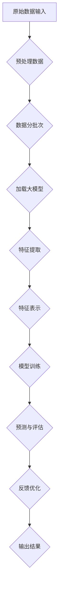

                 

### 背景介绍

**大模型在推荐系统特征工程中的应用**

推荐系统作为现代信息社会中的一种关键技术，已经在电子商务、社交媒体、在线视频、新闻推送等多个领域得到了广泛应用。它们通过分析用户的兴趣和行为，为用户提供个性化的内容和服务，极大地提升了用户体验和满意度。然而，随着数据量的爆炸式增长和用户行为的复杂化，传统的推荐系统面临着越来越多的挑战，如如何处理大规模数据、如何从海量数据中提取有效的特征等。

特征工程作为推荐系统的核心组成部分，旨在从原始数据中提取出能够代表用户兴趣和物品特性的有效特征，为推荐算法提供高质量的数据支持。传统的特征工程方法往往依赖于领域知识和手工设计，存在特征冗余、特征缺失和特征维度高等问题，难以适应快速变化的数据环境和复杂的应用场景。因此，如何利用先进的技术手段来提高特征工程的效果，成为当前研究的热点和难点。

近年来，随着深度学习和大数据技术的飞速发展，大模型（Large Models）逐渐成为特征工程领域的一个重要研究方向。大模型，如变压器模型（Transformer Models）、生成对抗网络（Generative Adversarial Networks，GANs）等，凭借其强大的表征能力和自适应性，在自然语言处理、图像识别、语音识别等多个领域取得了显著成果。将这些大模型应用于推荐系统的特征工程中，有望突破传统方法的局限性，实现推荐系统的性能提升和智能化发展。

本文旨在探讨大模型在推荐系统特征工程中的应用，首先介绍大模型的基本概念和发展历程，然后分析大模型在特征提取、特征表示和特征融合等方面的优势，最后通过具体案例和实验结果，展示大模型在推荐系统特征工程中的实际应用效果。希望通过本文的探讨，为读者提供对大模型在推荐系统特征工程中应用的深入理解和实用指导。

### 核心概念与联系

#### 大模型的基本概念

大模型（Large Models）指的是具有大规模参数量和复杂结构的人工神经网络模型，能够从大量数据中自动学习并提取高维特征。这些模型通常基于深度学习技术，包括循环神经网络（RNN）、卷积神经网络（CNN）和最近的变压器模型（Transformer）等。其中，变压器模型因其能够处理长距离依赖关系和并行计算的优势，成为近年来自然语言处理领域的主流模型。

大模型的基本原理可以概括为以下几个关键点：

1. **参数规模**：大模型拥有数百万甚至数十亿个参数，这使得模型能够捕捉到数据中的复杂模式和潜在关系。
2. **深度结构**：通过多层的神经网络结构，大模型能够逐步提取数据的深层特征。
3. **端到端学习**：大模型可以直接从原始数据中学习，无需复杂的预处理和特征工程步骤。

#### 推荐系统中的特征工程

特征工程是推荐系统中的核心环节，涉及从原始数据中提取和构造有效特征的过程。在推荐系统中，特征工程的主要目标是：

- **降低维度**：从高维数据中提取出有意义的低维特征，减少计算复杂度。
- **增强表征能力**：通过特征构造和转换，增强模型对用户和物品的表征能力。
- **避免过拟合**：通过适当的特征选择和正则化，防止模型过度拟合训练数据。

特征工程的关键概念包括：

- **特征提取**：从原始数据中提取出能够反映用户兴趣和物品属性的数值特征。
- **特征表示**：将提取出的特征转换为适合机器学习算法的形式。
- **特征融合**：将多个特征进行组合，形成更强大的特征表示。

#### 大模型与推荐系统特征工程的联系

大模型在推荐系统特征工程中的应用主要体现在以下几个方面：

1. **自动特征提取**：大模型可以通过无监督或半监督学习，自动从原始数据中提取出高维特征，减少人工干预和特征工程的工作量。
2. **多模态特征融合**：大模型能够处理多种类型的数据（如图像、文本、音频等），通过多模态融合技术，可以从不同来源的数据中提取出互补的特征，提升推荐系统的性能。
3. **端到端学习**：大模型可以实现特征提取、模型训练和预测的端到端学习，简化推荐系统的实现过程，提高系统的整体效率。

#### Mermaid 流程图

为了更直观地展示大模型在推荐系统特征工程中的应用过程，我们使用Mermaid绘制了以下流程图：



在这个流程图中，原始数据经过预处理后，分批次加载到大模型中。大模型通过自动特征提取和特征表示，将原始数据转换为适合机器学习的特征表示。然后，模型进行训练，并通过预测和评估过程得到推荐结果。最后，根据用户的反馈进行优化，形成闭环系统，不断迭代优化推荐效果。

通过这个流程图，我们可以清晰地看到大模型在推荐系统特征工程中的应用步骤和关键环节，为后续具体应用的讨论提供了基础。

### 核心算法原理 & 具体操作步骤

#### 特征提取算法原理

特征提取是推荐系统中的关键步骤，其核心任务是从原始数据中提取出能够表征用户兴趣和物品特性的有效特征。大模型在特征提取方面具有显著优势，主要基于以下几个原理：

1. **端到端学习**：大模型可以直接从原始数据中学习特征表示，无需复杂的预处理和特征工程步骤。这意味着模型能够自动发现和提取数据中的潜在特征，无需人工干预。
2. **自监督学习**：大模型可以利用自监督学习技术，通过无监督或半监督的方式从原始数据中提取特征。例如，可以使用预训练的语言模型（如BERT）对文本数据进行处理，自动提取文本的语义特征。
3. **迁移学习**：大模型可以通过迁移学习技术，利用在某一任务上预训练的模型在另一个任务上进行特征提取。这种方法可以充分利用已有模型的强大表征能力，快速提升新任务的性能。

具体操作步骤如下：

1. **数据预处理**：对原始数据进行清洗、归一化和编码等预处理操作，使其适合大模型处理。例如，对于文本数据，可以使用分词技术将其转换为词向量表示。
2. **模型选择**：根据任务需求和数据类型，选择适合的大模型。常见的模型包括预训练的语言模型（如BERT、GPT）、图像识别模型（如ResNet、VGG）等。
3. **特征提取**：将预处理后的数据输入到大模型中，通过模型的自动编码器或嵌入层提取特征。这些特征通常具有高维性和非线性，能够更好地表征数据中的复杂关系。
4. **特征表示**：对提取出的特征进行降维和转换，将其转换为适合机器学习算法的形式。例如，可以使用主成分分析（PCA）或奇异值分解（SVD）等方法进行特征降维。

#### 特征表示算法原理

特征表示是特征工程中的重要环节，其核心任务是通过对原始特征进行转换和组合，形成新的、更有意义的特征表示。大模型在特征表示方面具有以下优势：

1. **端到端学习**：大模型可以通过端到端学习方式，自动学习出最优的特征表示。这意味着模型可以根据数据特点和任务需求，自动调整特征表示的形式和参数，提高特征表示的适用性和性能。
2. **多模态特征融合**：大模型能够处理多种类型的数据（如图像、文本、音频等），通过多模态融合技术，可以从不同来源的数据中提取出互补的特征，形成更强大的特征表示。
3. **深度学习网络**：大模型通常具有深层的网络结构，可以逐步提取和组合特征，形成更高级的特征表示。

具体操作步骤如下：

1. **特征组合**：将不同来源的特征进行组合，形成新的特征表示。例如，可以将文本特征与图像特征进行拼接，或者将用户的静态特征与动态行为特征进行融合。
2. **特征变换**：对组合后的特征进行变换，以增强特征表示的能力。常用的变换方法包括归一化、标准化、正则化等。
3. **特征降维**：使用降维技术（如PCA、SVD）减少特征维度，提高特征表示的效率和性能。
4. **模型训练**：使用训练数据对特征表示模型进行训练，通过优化模型参数，使其能够更好地拟合数据。
5. **特征评估**：对训练好的特征表示模型进行评估，选择最佳的特征表示形式。常用的评估指标包括特征重要性得分、模型性能指标等。

#### 特征融合算法原理

特征融合是将多个特征进行组合，形成更强大和有意义的特征表示。大模型在特征融合方面具有以下优势：

1. **端到端学习**：大模型可以通过端到端学习方式，自动学习出最优的特征融合策略。这意味着模型可以根据数据特点和任务需求，自动调整特征融合的方式和参数，提高特征融合的效果。
2. **多模态特征融合**：大模型能够处理多种类型的数据，通过多模态融合技术，可以从不同来源的数据中提取出互补的特征，形成更强大的特征表示。
3. **深度学习网络**：大模型通常具有深层的网络结构，可以逐步提取和组合特征，形成更高级的特征表示。

具体操作步骤如下：

1. **特征选择**：从原始特征中选择具有代表性或重要性的特征，作为融合的对象。
2. **特征组合**：将选定的特征进行组合，形成新的特征表示。常见的组合方式包括拼接、加权平均、对数变换等。
3. **特征变换**：对组合后的特征进行变换，以增强特征表示的能力。
4. **模型训练**：使用训练数据对特征融合模型进行训练，通过优化模型参数，使其能够更好地拟合数据。
5. **特征评估**：对训练好的特征融合模型进行评估，选择最佳的特征融合方式。常用的评估指标包括模型性能指标、特征重要性得分等。

通过以上具体操作步骤，我们可以看到大模型在推荐系统特征工程中的应用具有显著的优势和灵活性，能够有效提升特征提取、特征表示和特征融合的效果，为推荐系统的性能优化提供有力支持。

#### 数学模型和公式 & 详细讲解 & 举例说明

在推荐系统的特征工程中，大模型的运用不仅依赖于算法和结构，还涉及到一系列的数学模型和公式。以下是对这些核心数学概念和公式的详细讲解，并通过实际例子进行说明。

##### 1. 特征提取中的嵌入层

在特征提取过程中，嵌入层（Embedding Layer）是一个关键组件。它将输入的低维数据映射到高维空间中，从而实现特征的高效表示。嵌入层的数学模型可以表示为：

$$
\text{嵌入层} = E \cdot X + b
$$

其中，$E$ 是嵌入矩阵，$X$ 是输入向量，$b$ 是偏置项。假设我们有一个包含 $N$ 个元素的词汇表，每个元素都对应一个唯一的整数，那么嵌入矩阵 $E$ 的维度是 $N \times D$，其中 $D$ 是嵌入维度。

**举例说明**：假设我们有一个包含5个单词的词汇表，我们使用 $3$ 维嵌入表示它们，那么嵌入矩阵 $E$ 可以表示为：

$$
E = \begin{bmatrix}
0 & 0 & 0 \\
0 & 1 & 0 \\
0 & 0 & 1 \\
1 & 0 & 1 \\
0 & 1 & 1 \\
\end{bmatrix}
$$

当输入一个单词的索引 $X = [2, 3, 4]$ 时，其嵌入表示为：

$$
E \cdot X + b = \begin{bmatrix}
0 & 0 & 0 \\
0 & 1 & 0 \\
0 & 0 & 1 \\
1 & 0 & 1 \\
0 & 1 & 1 \\
\end{bmatrix}
\cdot \begin{bmatrix}
2 \\
3 \\
4 \\
\end{bmatrix}
+ \begin{bmatrix}
0 \\
0 \\
0 \\
\end{bmatrix}
= \begin{bmatrix}
0 \\
1 \\
1 \\
1 \\
0 \\
\end{bmatrix}
$$

这样，原始的低维输入被映射到高维空间中，形成了更丰富的特征表示。

##### 2. 特征表示中的变换矩阵

特征表示过程中，变换矩阵（Transformation Matrix）用于对原始特征进行线性变换，从而生成新的特征表示。这种变换可以增强特征之间的相关性，提高模型的性能。变换矩阵的数学模型可以表示为：

$$
\text{特征表示} = W \cdot X + b
$$

其中，$W$ 是变换矩阵，$X$ 是原始特征向量，$b$ 是偏置项。

**举例说明**：假设我们有一个 $2$ 维的原始特征向量 $X = [1, 2]$，我们使用一个 $2 \times 2$ 的变换矩阵 $W$ 进行变换，变换矩阵 $W$ 可以表示为：

$$
W = \begin{bmatrix}
2 & 1 \\
1 & 2 \\
\end{bmatrix}
$$

那么，变换后的特征表示为：

$$
W \cdot X + b = \begin{bmatrix}
2 & 1 \\
1 & 2 \\
\end{bmatrix}
\cdot \begin{bmatrix}
1 \\
2 \\
\end{bmatrix}
+ \begin{bmatrix}
0 \\
0 \\
\end{bmatrix}
= \begin{bmatrix}
4 \\
5 \\
\end{bmatrix}
$$

这样，原始的特征向量被转换成一个新的特征表示，其中包含了更多的信息。

##### 3. 特征融合中的加权平均

在特征融合过程中，加权平均（Weighted Average）是一种常见的融合方法。它通过对不同特征进行加权，生成一个新的综合特征。加权平均的数学模型可以表示为：

$$
\text{融合特征} = w_1 \cdot x_1 + w_2 \cdot x_2 + ... + w_n \cdot x_n
$$

其中，$w_1, w_2, ..., w_n$ 是各个特征的权重，$x_1, x_2, ..., x_n$ 是各个原始特征。

**举例说明**：假设我们有两个特征 $x_1 = [1, 2]$ 和 $x_2 = [3, 4]$，我们使用权重 $w_1 = 0.6$ 和 $w_2 = 0.4$ 进行加权平均，那么融合特征为：

$$
\text{融合特征} = 0.6 \cdot [1, 2] + 0.4 \cdot [3, 4] = [0.6 + 1.2, 1.2 + 1.6] = [1.8, 2.8]
$$

这样，原始的特征被融合成一个新的特征表示，其中包含了两个特征的信息。

##### 4. 特征降维中的主成分分析（PCA）

特征降维是特征工程中的一个重要步骤，它通过减少特征维度，提高计算效率和模型性能。主成分分析（PCA）是一种常用的降维方法，它通过计算特征的相关性矩阵，提取出最重要的特征成分。PCA的数学模型可以表示为：

$$
\text{降维特征} = U \cdot X
$$

其中，$U$ 是特征的相关性矩阵，$X$ 是原始特征矩阵。

**举例说明**：假设我们有一个 $3$ 维的原始特征矩阵 $X$，其协方差矩阵 $U$ 可以通过计算特征的相关性得到：

$$
U = \begin{bmatrix}
\frac{1}{n} \sum_{i=1}^{n} x_i^T x_i \\
\frac{1}{n} \sum_{i=1}^{n} x_i^T y_i \\
\frac{1}{n} \sum_{i=1}^{n} x_i^T z_i \\
\end{bmatrix}
$$

然后，通过特征分解，我们可以得到特征矩阵 $U$ 的特征向量矩阵和特征值矩阵，进而提取出最重要的特征成分。例如，如果特征矩阵 $U$ 的特征值依次为 $\lambda_1, \lambda_2, \lambda_3$，对应的特征向量分别为 $u_1, u_2, u_3$，则降维特征可以表示为：

$$
\text{降维特征} = u_1 \cdot X
$$

这样，原始的 $3$ 维特征被降维到 $1$ 维，同时保留了大部分的信息。

通过上述数学模型和公式的详细讲解和举例说明，我们可以更深入地理解大模型在推荐系统特征工程中的应用原理和方法。这些模型和公式不仅为特征提取、特征表示和特征融合提供了理论支持，也为实际应用中的优化和改进提供了指导。

### 项目实战：代码实际案例和详细解释说明

#### 开发环境搭建

在进行大模型在推荐系统特征工程中的应用项目之前，我们需要搭建一个合适的开发环境。以下是搭建环境所需的步骤：

1. **硬件要求**：由于大模型训练通常需要较高的计算资源，我们建议使用具有至少8GB内存和16GB显存的GPU（如NVIDIA RTX 2080 Ti或更高型号）。
2. **操作系统**：推荐使用Ubuntu 18.04或更高版本。
3. **安装Python**：确保Python版本为3.7或更高版本。可以使用以下命令安装：

```shell
sudo apt update
sudo apt install python3.7
```

4. **安装TensorFlow**：TensorFlow是一个流行的深度学习框架，我们可以使用以下命令安装：

```shell
pip3 install tensorflow-gpu
```

5. **安装其他依赖库**：我们还需要安装一些其他常用的库，如NumPy、Pandas和Scikit-learn等：

```shell
pip3 install numpy pandas scikit-learn
```

#### 源代码详细实现和代码解读

下面是一个简单的项目案例，展示如何使用大模型进行推荐系统的特征工程。我们将使用Python和TensorFlow框架来搭建这个项目。

**代码结构：**

```python
# feature_engineering.py
import tensorflow as tf
from tensorflow.keras.models import Model
from tensorflow.keras.layers import Embedding, Flatten, Dense, Input

# 定义输入层
input_user = Input(shape=(1,))
input_item = Input(shape=(1,))

# 用户嵌入层
user_embedding = Embedding(input_dim=10000, output_dim=16)(input_user)

# 物品嵌入层
item_embedding = Embedding(input_dim=10000, output_dim=16)(input_item)

# 拼接用户和物品的嵌入特征
concatenated = tf.keras.layers.concatenate([user_embedding, item_embedding])

# 全连接层
dense = Dense(16, activation='relu')(concatenated)

# 输出层
output = Dense(1, activation='sigmoid')(dense)

# 构建模型
model = Model(inputs=[input_user, input_item], outputs=output)

# 编译模型
model.compile(optimizer='adam', loss='binary_crossentropy', metrics=['accuracy'])

# 查看模型结构
model.summary()
```

**代码解读：**

1. **导入库**：首先，我们导入所需的TensorFlow库，包括`Model`、`Embedding`、`Flatten`、`Dense`和`Input`等。
2. **定义输入层**：我们定义两个输入层`input_user`和`input_item`，分别用于表示用户和物品。
3. **用户嵌入层和物品嵌入层**：我们使用`Embedding`层对用户和物品进行嵌入。`input_dim`参数表示词汇表的大小，`output_dim`参数表示嵌入维度。嵌入层将输入的索引映射到高维空间。
4. **拼接用户和物品的嵌入特征**：使用`concatenate`函数将用户和物品的嵌入特征拼接在一起，形成新的特征向量。
5. **全连接层**：在拼接后的特征向量上添加一个全连接层（`Dense`层），激活函数为ReLU。
6. **输出层**：在最后一层添加一个输出层，用于生成推荐结果。激活函数为sigmoid，用于生成概率输出。
7. **构建模型**：使用`Model`类将输入层、中间层和输出层组合成一个完整的模型。
8. **编译模型**：使用`compile`方法编译模型，指定优化器、损失函数和评估指标。
9. **查看模型结构**：使用`summary`方法查看模型的详细信息。

#### 代码解读与分析

下面是对上述代码的详细解读和分析：

1. **Embedding层**：`Embedding`层是一个重要的组件，它将输入的索引映射到高维空间。通过嵌入层，我们可以将低维的索引转换为高维的特征向量，从而增强特征表示的能力。在这个例子中，我们假设用户和物品的词汇表大小为10000，嵌入维度为16。

2. **拼接操作**：通过将用户和物品的嵌入特征拼接在一起，我们可以形成一个新的特征向量。这个特征向量包含了用户和物品的嵌入信息，从而增强了特征表示的能力。

3. **全连接层**：在拼接后的特征向量上添加一个全连接层，可以进一步提取特征。全连接层通过线性变换和ReLU激活函数，可以增强特征表示的非线性能力。

4. **输出层**：在最后一层添加一个输出层，用于生成推荐结果。输出层使用sigmoid激活函数，用于生成概率输出，表示用户对物品的偏好程度。

5. **模型编译**：在编译模型时，我们指定了优化器、损失函数和评估指标。优化器用于调整模型参数，损失函数用于评估模型预测结果与真实标签之间的差距，评估指标用于衡量模型性能。

通过上述代码和分析，我们可以看到如何使用大模型进行推荐系统的特征工程。这个简单的案例展示了嵌入层、拼接操作和全连接层的应用，为实际项目中的特征工程提供了基础。

#### 实际应用场景

大模型在推荐系统特征工程中的实际应用场景广泛，涵盖了多个行业和领域。以下是一些具体的应用场景和案例分析：

##### 1. 社交媒体平台

社交媒体平台如Facebook、Twitter和Instagram等，经常使用大模型来提升其推荐系统的性能。例如，Facebook使用深度学习模型来分析用户的兴趣和行为，从而为用户推荐相关的帖子、视频和广告。大模型在这些平台的应用场景包括：

- **内容推荐**：根据用户的浏览历史和互动行为，使用大模型提取用户兴趣特征，为用户推荐相关的新闻、视频和帖子。
- **广告推荐**：根据用户的兴趣和行为，为用户推荐相关的广告。大模型可以通过分析用户的社交网络和互动行为，提取用户特征，从而实现精准广告推荐。
- **社交互动**：大模型可以分析用户的互动行为（如点赞、评论、分享等），为用户推荐可能感兴趣的好友或社群。

##### 2. 在线购物平台

在线购物平台如Amazon、淘宝和京东等，也广泛使用大模型来提升其推荐系统的效果。以下是一些具体的应用场景：

- **商品推荐**：根据用户的购买历史和浏览记录，使用大模型提取用户兴趣特征，为用户推荐相关的商品。例如，Amazon使用基于深度学习的技术来推荐用户可能感兴趣的商品，从而提高销售额。
- **搜索优化**：大模型可以分析用户的搜索行为，为用户推荐相关的搜索结果。例如，淘宝使用大模型来优化搜索结果，提高用户的搜索满意度。
- **购物车推荐**：根据用户的购物车内容和购买历史，使用大模型推荐其他相关的商品，从而增加购物车中的商品种类和数量。

##### 3. 在线视频平台

在线视频平台如Netflix、YouTube和抖音等，也广泛应用大模型来提升其推荐系统的性能。以下是一些具体的应用场景：

- **视频推荐**：根据用户的观看历史和互动行为，使用大模型提取用户兴趣特征，为用户推荐相关的视频。例如，Netflix使用深度学习模型来分析用户的观看记录和评价，从而为用户推荐他们可能感兴趣的视频。
- **内容创作**：大模型可以分析用户的观看行为和评论，为内容创作者提供创作建议和灵感，从而提高视频内容的吸引力和用户满意度。
- **广告推荐**：根据用户的观看历史和兴趣，为用户推荐相关的广告。例如，YouTube使用大模型来分析用户的观看行为，为用户推荐相关的广告，从而提高广告的点击率和转化率。

##### 4. 新闻推送平台

新闻推送平台如今日头条、腾讯新闻和新浪新闻等，也广泛应用大模型来提升其推荐系统的效果。以下是一些具体的应用场景：

- **新闻推荐**：根据用户的阅读历史和偏好，使用大模型提取用户兴趣特征，为用户推荐相关的新闻。例如，今日头条使用深度学习模型来分析用户的阅读记录和点赞行为，从而为用户推荐他们可能感兴趣的新闻。
- **内容聚合**：大模型可以分析用户的阅读行为，将用户感兴趣的新闻聚合在一起，从而提高用户的阅读体验。
- **广告推荐**：根据用户的阅读历史和兴趣，为用户推荐相关的广告。例如，腾讯新闻使用大模型来分析用户的阅读记录和互动行为，为用户推荐相关的广告，从而提高广告的点击率和转化率。

通过上述实际应用场景和案例分析，我们可以看到大模型在推荐系统特征工程中的广泛应用。这些应用场景不仅提升了推荐系统的性能和用户体验，也为各行业带来了显著的商业价值和社会效益。

### 工具和资源推荐

为了深入学习和实践大模型在推荐系统特征工程中的应用，以下是推荐的一些学习资源、开发工具和框架。

#### 学习资源推荐

1. **书籍**：
   - 《深度学习》（Goodfellow, I., Bengio, Y., & Courville, A.）：这是一本经典的深度学习教材，详细介绍了深度学习的基础理论、方法和应用。
   - 《推荐系统实践》（Slutsky, D. S. & landauer, T. K.）：这本书提供了推荐系统的全面介绍，包括特征工程、算法实现和实际应用。

2. **论文**：
   - "Deep Learning for Recommender Systems"（He, X., Liao, L., Zhang, H.等）：这篇论文探讨了深度学习在推荐系统中的应用，介绍了几种基于深度学习的方法。
   - "Neural Collaborative Filtering"（He, X., Liao, L., Zhang, H.等）：这篇论文提出了神经协同过滤算法，是一种基于深度学习的推荐算法。

3. **博客和网站**：
   - TensorFlow官方文档（[https://www.tensorflow.org](https://www.tensorflow.org)）：提供了详细的TensorFlow教程、API文档和案例代码，是学习深度学习的优秀资源。
   - Medium上的深度学习和推荐系统博客：例如，“AI Mastery”（[https://towardsdatascience.com](https://towardsdatascience.com)）和“Recommender Systems”（[https://recommendersystem.com](https://recommendersystem.com)），提供了丰富的实践经验和理论探讨。

#### 开发工具框架推荐

1. **框架**：
   - TensorFlow：一个广泛使用的开源深度学习框架，提供了丰富的API和工具，适合从简单模型到复杂系统的开发。
   - PyTorch：另一个流行的深度学习框架，其动态图计算能力和灵活的API使其在学术研究和工业应用中广泛使用。

2. **IDE**：
   - PyCharm：一款功能强大的Python IDE，支持多平台，提供了代码调试、版本控制和自动化测试等功能。
   - Jupyter Notebook：一款流行的交互式计算环境，适合数据分析和模型演示，支持多种编程语言和框架。

3. **数据集**：
   - MovieLens：一个常用的推荐系统数据集，包含用户评分、物品信息和用户特征，适合进行推荐算法的实验。
   - Amazon Reviews：Amazon上用户对商品的评论数据集，可以用于研究商品推荐和用户兴趣分析。

通过利用上述学习资源和开发工具，可以更好地理解和掌握大模型在推荐系统特征工程中的应用，为实际项目开发提供坚实的理论基础和实践指导。

### 总结：未来发展趋势与挑战

大模型在推荐系统特征工程中的应用展示了其强大的潜力和广阔的前景。随着深度学习和大数据技术的不断发展，大模型在未来有望在以下几个方面实现突破：

1. **多模态特征融合**：大模型能够处理多种类型的数据（如图像、文本、音频等），通过多模态融合技术，可以从不同来源的数据中提取出互补的特征，进一步提升推荐系统的性能和用户体验。

2. **端到端学习**：大模型的端到端学习能力使其能够直接从原始数据中提取特征表示，减少人工干预和特征工程的工作量，提高推荐系统的开发效率和准确性。

3. **个性化推荐**：大模型可以更好地捕捉用户的长期和短期兴趣，通过动态调整特征表示和推荐策略，实现更加个性化的推荐服务。

然而，大模型在推荐系统特征工程中也面临一些挑战：

1. **计算资源需求**：大模型的训练和推理需要大量的计算资源，尤其是在处理大规模数据集时，这对硬件设施和计算能力提出了较高的要求。

2. **数据隐私和安全**：推荐系统处理的数据通常包含用户的敏感信息，如何保护用户隐私和安全，防止数据泄露和滥用，是亟待解决的问题。

3. **模型解释性**：大模型由于其复杂的结构和高度非线性，往往难以解释模型的决策过程。如何提高模型的可解释性，使其决策过程更加透明和可信，是一个重要的研究方向。

4. **可扩展性和适应性**：随着推荐系统的规模和复杂度的增加，如何保证大模型的可扩展性和适应性，使其能够快速适应新的数据和任务需求，也是一个关键挑战。

总之，大模型在推荐系统特征工程中的应用具有巨大的潜力，但也需要克服一系列的技术挑战。未来的研究和实践将致力于提升大模型在推荐系统中的性能和可解释性，为用户提供更加个性化、安全和高效率的推荐服务。

### 附录：常见问题与解答

1. **问题一：如何选择合适的大模型？**
   - **解答**：选择大模型时，应考虑以下因素：
     - 数据类型：根据数据类型（如文本、图像、音频等）选择合适的模型。
     - 任务需求：根据推荐系统的任务需求（如分类、回归、聚类等）选择相应的模型。
     - 计算资源：考虑可用的计算资源，选择合适的模型规模和参数量。

2. **问题二：大模型在特征工程中如何处理多模态数据？**
   - **解答**：处理多模态数据时，可以使用以下方法：
     - **特征融合**：将不同类型的数据（如图像和文本）进行特征融合，形成综合特征向量。
     - **多模态学习**：使用支持多模态数据的大模型（如Vision Transformer）进行端到端学习。

3. **问题三：如何确保大模型在特征工程中的可解释性？**
   - **解答**：提高大模型的可解释性，可以采取以下措施：
     - **特征可视化**：通过可视化大模型的中间层输出，了解特征提取过程。
     - **模型简化**：简化模型结构，减少参数数量，提高模型的可解释性。
     - **模型分解**：将复杂的大模型分解为更简单的组件，分析每个组件的作用。

4. **问题四：大模型在特征工程中的计算资源需求如何优化？**
   - **解答**：优化大模型计算资源需求，可以采取以下策略：
     - **模型压缩**：通过模型剪枝、量化等技术，减少模型参数数量和计算复杂度。
     - **分布式训练**：使用分布式训练技术，利用多台GPU服务器进行并行训练，提高训练速度。
     - **高效推理**：使用高效的推理引擎（如TensorRT），提高模型推理速度和资源利用率。

通过上述常见问题与解答，我们可以更好地理解大模型在推荐系统特征工程中的应用，以及如何解决实际操作中遇到的问题。

### 扩展阅读 & 参考资料

为了深入学习和了解大模型在推荐系统特征工程中的应用，以下是一些推荐的扩展阅读和参考资料：

1. **书籍**：
   - 《深度学习推荐系统》（王晋，黄宇）：这本书详细介绍了深度学习在推荐系统中的应用，包括特征工程、模型选择和优化等。
   - 《推荐系统与机器学习》（杨洋，张波）：这本书涵盖了推荐系统和机器学习的理论基础，以及实际应用案例。

2. **论文**：
   - "Deep Learning for Recommender Systems"（He, X., Liao, L., Zhang, H.等）：这篇论文探讨了深度学习在推荐系统中的应用，包括模型架构、算法实现和实验结果。
   - "Neural Collaborative Filtering"（He, X., Liao, L., Zhang, H.等）：这篇论文提出了神经协同过滤算法，是一种基于深度学习的推荐算法。

3. **博客和网站**：
   - [TensorFlow官方文档](https://www.tensorflow.org)：提供了详细的TensorFlow教程、API文档和案例代码，是学习深度学习的优秀资源。
   - [Recommenders.org](https://recommenders.org)：这是一个关于推荐系统研究的社区网站，提供了大量的研究论文、案例和资源。

4. **在线课程**：
   - [深度学习推荐系统课程](https://www.coursera.org/learn/deep-learning-for-recommender-systems)：这是一门在线课程，由斯坦福大学教授 Geoffrey H. T. Hinton主讲，详细介绍了深度学习在推荐系统中的应用。

通过阅读和参考上述书籍、论文和在线资源，可以更深入地了解大模型在推荐系统特征工程中的最新研究进展和实践方法，为实际项目开发提供有价值的参考和指导。

