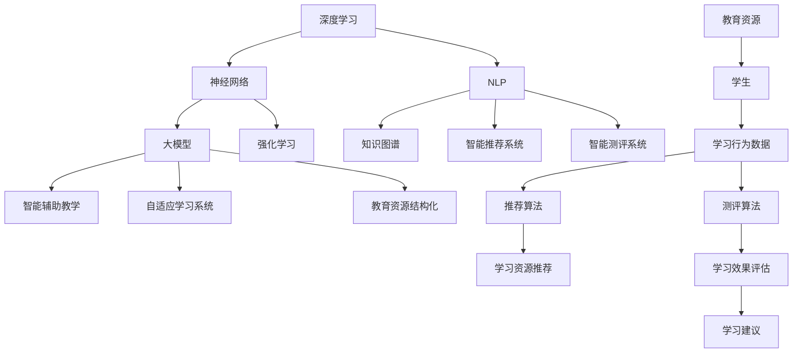

                 

### 背景介绍

近年来，人工智能技术在各个领域取得了显著的进展，其中教育领域尤为引人注目。随着深度学习、自然语言处理、强化学习等技术的不断发展，大模型（Large-scale Models）在教育领域的应用逐渐成为研究热点。大模型是一种具有海量参数和强大表征能力的神经网络模型，通过对大量数据进行训练，可以自动学习到复杂的数据特征和知识结构。

在教育领域，大模型的应用主要体现在以下几个方面：

1. **智能辅助教学**：大模型可以模拟教师的教学方式，为学生提供个性化的学习建议和指导。例如，通过自然语言处理技术，大模型可以回答学生的问题，进行课堂互动，甚至为学生提供自动批改作业的服务。

2. **知识图谱构建**：大模型可以用于构建大规模的知识图谱，将海量的教育资源进行结构化组织，为学生提供全面、系统的学习资源。例如，通过知识图谱技术，可以将各个学科的知识点进行关联，形成一个有机的知识体系。

3. **智能推荐系统**：大模型可以用于教育资源的智能推荐，根据学生的学习习惯、兴趣和能力，为学生推荐最适合的学习内容。例如，通过机器学习算法，可以分析学生的历史学习数据，为其推荐相关的课程和学习资源。

4. **智能测评系统**：大模型可以用于智能测评，通过分析学生的答题数据，自动评估学生的学习效果，提供针对性的学习建议。例如，通过自然语言处理技术，可以对学生的作文进行自动评分，并提供详细的评价和建议。

总的来说，大模型在教育领域的应用具有广阔的前景，可以为教育改革和创新发展提供强有力的技术支持。本文将详细介绍大模型在教育领域的应用原理、核心算法、数学模型以及实际应用案例，帮助读者深入了解这一前沿技术。

### 核心概念与联系

在探讨大模型在教育领域的应用之前，我们需要明确几个核心概念，并理解它们之间的联系。以下是对这些核心概念的简要介绍，以及如何使用Mermaid流程图（没有括号、逗号等特殊字符）来展示这些概念之间的关系。

#### 核心概念

1. **深度学习（Deep Learning）**：深度学习是一种人工智能方法，使用多层神经网络对数据进行学习和建模。它能够自动提取数据中的层次特征，从而实现复杂的数据分析任务。

2. **神经网络（Neural Network）**：神经网络是由大量神经元组成的计算模型，通过调整神经元之间的连接权重来学习数据特征。神经网络是深度学习的基础。

3. **大模型（Large-scale Model）**：大模型是指参数数量达到数十亿甚至千亿级别的神经网络模型。它们具有强大的表征能力，能够从海量数据中提取复杂特征。

4. **自然语言处理（Natural Language Processing, NLP）**：自然语言处理是人工智能的一个分支，致力于使计算机能够理解、解释和生成自然语言。NLP在教育领域应用广泛，例如自动批改作业、智能问答系统等。

5. **知识图谱（Knowledge Graph）**：知识图谱是一种结构化数据存储方式，通过节点和边来表示实体及其关系。知识图谱在教育领域可用于构建教育资源知识体系。

6. **智能推荐系统（Intelligent Recommendation System）**：智能推荐系统通过分析用户的历史行为和兴趣，自动推荐相关内容。在教育领域，推荐系统可以帮助学生找到最适合的学习资源。

7. **强化学习（Reinforcement Learning）**：强化学习是一种通过试错来学习策略的机器学习方法。在教育领域，强化学习可用于自适应学习系统的开发，例如根据学生的学习行为调整教学内容。

#### Mermaid流程图



#### 概念联系

- **深度学习**和**神经网络**是构建大模型的基础，大模型拥有海量的参数和强大的表征能力。
- **自然语言处理**是教育领域应用的核心技术，NLP技术可以用于智能问答、自动批改、智能测评等。
- **知识图谱**用于结构化教育资源和构建教育知识体系，它能够将海量的教育资源进行关联和组织。
- **智能推荐系统**和**强化学习**则分别用于为教育提供个性化推荐和自适应学习功能。

通过上述Mermaid流程图，我们可以清晰地看到大模型在教育领域中的应用是如何通过这些核心概念相互联系和协同工作的。

### 核心算法原理 & 具体操作步骤

在深入了解大模型在教育领域的应用之前，我们需要先探讨其核心算法原理以及具体的操作步骤。大模型通常基于深度学习技术，其算法原理主要涉及神经网络、反向传播算法、优化算法等方面。以下将详细描述这些核心算法的原理和具体操作步骤。

#### 1. 神经网络

神经网络是深度学习的基础，它由大量的神经元组成，每个神经元都与其他神经元通过权重连接。神经网络的工作原理是通过对输入数据进行多层次的变换，逐步提取数据的特征。

- **神经元模型**：一个神经元通常由一个输入层、一个输出层和多个隐藏层组成。输入层接收外部数据，隐藏层通过权重矩阵对输入进行加权求和处理，输出层生成预测结果。

- **激活函数**：为了引入非线性特性，神经网络中的每个神经元都会使用激活函数（如ReLU、Sigmoid、Tanh等）。激活函数将线性变换转化为非线性变换，使神经网络能够学习和表示复杂的数据特征。

- **损失函数**：在训练神经网络时，需要使用损失函数来衡量预测结果与实际结果之间的差距。常见的损失函数包括均方误差（MSE）、交叉熵（Cross-Entropy）等。损失函数的值越小，表示模型的预测结果越接近实际结果。

#### 2. 反向传播算法

反向传播算法（Backpropagation）是一种用于训练神经网络的优化算法，其基本思想是通过反向传播误差信号，不断调整网络的权重和偏置，使损失函数的值逐渐减小。

- **前向传播**：首先，将输入数据输入到神经网络中，通过前向传播计算每个神经元的输出值。前向传播的过程包括权重乘法和激活函数的应用。

- **计算损失**：计算预测值与实际值之间的差异，通过损失函数计算损失值。

- **反向传播**：将损失函数的误差反向传播到每个神经元，计算每个权重的梯度。梯度是损失函数对权重和偏置的偏导数，它指示了权重调整的方向和幅度。

- **权重更新**：使用梯度下降（Gradient Descent）等优化算法更新权重和偏置，使得模型能够收敛到最优解。

#### 3. 优化算法

优化算法用于调整神经网络的权重和偏置，使模型能够收敛到最优解。常见的优化算法包括随机梯度下降（SGD）、Adam优化器等。

- **随机梯度下降（SGD）**：每次迭代仅使用一个样本计算梯度，并更新权重。SGD具有计算效率高、收敛速度快的特点，但容易陷入局部最小值。

- **Adam优化器**：Adam优化器结合了SGD和动量法的优点，通过自适应调整学习率，提高了训练效率和收敛速度。

#### 4. 具体操作步骤

以下是使用深度学习框架（如TensorFlow、PyTorch）训练大模型的常见步骤：

1. **数据预处理**：读取和预处理数据，包括数据清洗、归一化、划分训练集和测试集等。

2. **定义模型结构**：定义神经网络模型的结构，包括输入层、隐藏层和输出层。可以使用预定义的模型架构或自定义架构。

3. **编译模型**：设置模型的损失函数、优化器和学习率等参数。

4. **训练模型**：使用训练集数据进行模型训练，不断调整权重和偏置，直至达到训练目标。

5. **评估模型**：使用测试集对训练好的模型进行评估，计算模型的准确率、召回率、F1分数等指标。

6. **模型部署**：将训练好的模型部署到生产环境中，为实际应用提供服务。

通过上述核心算法原理和具体操作步骤，我们可以构建并训练出具备强大表征能力的大模型，用于解决各种复杂的教育问题，如图像识别、自然语言处理和智能推荐等。

### 数学模型和公式 & 详细讲解 & 举例说明

#### 1. 损失函数

在深度学习中，损失函数（Loss Function）是用于衡量模型预测结果与实际结果之间差异的重要工具。常见的损失函数包括均方误差（MSE）、交叉熵（Cross-Entropy）等。

- **均方误差（MSE）**：

$$
MSE = \frac{1}{n}\sum_{i=1}^{n}(y_i - \hat{y_i})^2
$$

其中，$y_i$表示实际值，$\hat{y_i}$表示预测值，$n$表示样本数量。MSE适用于回归问题，其目标是最小化预测值与实际值之间的平均平方误差。

- **交叉熵（Cross-Entropy）**：

$$
Cross-Entropy = -\frac{1}{n}\sum_{i=1}^{n}y_i \log(\hat{y_i})
$$

其中，$y_i$表示实际值（通常为0或1），$\hat{y_i}$表示预测值。Cross-Entropy适用于分类问题，其目标是最小化实际值与预测值之间的对数损失。

#### 2. 激活函数

激活函数（Activation Function）用于引入神经网络中的非线性特性，常见的激活函数包括ReLU、Sigmoid和Tanh等。

- **ReLU（Rectified Linear Unit）**：

$$
f(x) =
\begin{cases}
0 & \text{if } x < 0 \\
x & \text{if } x \geq 0
\end{cases}
$$

ReLU函数在$x \geq 0$时保持线性，在$x < 0$时输出0。它具有简单、计算效率高的特点，常用于隐藏层的激活函数。

- **Sigmoid**：

$$
f(x) = \frac{1}{1 + e^{-x}}
$$

Sigmoid函数将输入映射到$(0, 1)$区间，常用于二分类问题的输出层，表示概率分布。

- **Tanh**：

$$
f(x) = \frac{e^x - e^{-x}}{e^x + e^{-x}}
$$

Tanh函数将输入映射到$(-1, 1)$区间，具有平滑的曲线，常用于隐藏层的激活函数。

#### 3. 反向传播算法

反向传播算法是训练神经网络的核心算法，它通过反向传播误差信号，不断调整网络的权重和偏置，使模型能够收敛到最优解。

- **梯度计算**：

在深度学习中，梯度（Gradient）表示损失函数对权重和偏置的偏导数。对于单个神经元，其权重$w$的梯度为：

$$
\frac{\partial L}{\partial w} = (z \cdot \sigma'(a)) \cdot x
$$

其中，$L$表示损失函数，$z$表示神经元的输入，$\sigma'$表示激活函数的导数，$a$表示神经元的输出，$x$表示神经元的输入。

- **权重更新**：

使用梯度下降（Gradient Descent）优化算法更新权重和偏置：

$$
w \leftarrow w - \alpha \cdot \frac{\partial L}{\partial w}
$$

其中，$\alpha$表示学习率，它决定了权重更新的幅度。为了加速收敛，可以使用动量（Momentum）等优化策略。

#### 4. 举例说明

假设我们使用一个简单的神经网络进行二分类任务，输入特征$x$为一个实数，输出类别$y$为0或1。神经网络结构为输入层、一个隐藏层和一个输出层。

- **输入层**：$x$  
- **隐藏层**：$a = \sigma(wx + b)$，其中$w$为隐藏层权重，$b$为偏置，$\sigma$为激活函数（例如ReLU）  
- **输出层**：$y' = \sigma(wx' + b')$，其中$w'$为输出层权重，$b'$为偏置，$\sigma$为激活函数（例如Sigmoid）

- **损失函数**：使用交叉熵损失函数

$$
L = -\frac{1}{n}\sum_{i=1}^{n}y_i \log(y')
$$

- **梯度计算**：

对于隐藏层神经元：

$$
\frac{\partial L}{\partial w} = (y - y') \cdot \sigma'(a) \cdot x
$$

对于输出层神经元：

$$
\frac{\partial L}{\partial w'} = (y - y') \cdot \sigma'(y') \cdot a
$$

- **权重更新**：

使用随机梯度下降（SGD）：

$$
w \leftarrow w - \alpha \cdot \frac{\partial L}{\partial w}
$$

$$
w' \leftarrow w' - \alpha \cdot \frac{\partial L}{\partial w'}
$$

通过上述步骤，我们可以不断调整网络的权重和偏置，使模型能够收敛到最优解，从而实现二分类任务。

### 项目实战：代码实际案例和详细解释说明

在本节中，我们将通过一个实际项目案例来展示如何使用深度学习框架（如TensorFlow或PyTorch）构建大模型，并将其应用于教育领域的具体任务。我们将分步骤详细解释代码实现和各个组件的作用。

#### 1. 开发环境搭建

首先，我们需要搭建一个合适的开发环境。以下是在Python中搭建TensorFlow开发环境的步骤：

- **安装TensorFlow**：

```bash
pip install tensorflow
```

- **安装其他依赖**：

```bash
pip install numpy pandas matplotlib
```

#### 2. 源代码详细实现和代码解读

以下是一个简单的TensorFlow项目示例，用于分类学生作文，并提供评分和建议。

```python
import tensorflow as tf
from tensorflow.keras.layers import Dense, InputLayer
from tensorflow.keras.models import Model
from tensorflow.keras.optimizers import Adam
import numpy as np

# 数据预处理
def preprocess_data(data):
    # 数据清洗和归一化
    return data / 255.0

# 构建模型
def build_model(input_shape):
    inputs = InputLayer(input_shape=input_shape)
    x = Dense(128, activation='relu')(inputs)
    x = Dense(64, activation='relu')(x)
    outputs = Dense(1, activation='sigmoid')(x)
    
    model = Model(inputs=inputs, outputs=outputs)
    return model

# 训练模型
def train_model(model, train_data, train_labels, epochs=10, batch_size=32):
    optimizer = Adam(learning_rate=0.001)
    model.compile(optimizer=optimizer, loss='binary_crossentropy', metrics=['accuracy'])
    model.fit(train_data, train_labels, epochs=epochs, batch_size=batch_size)
    return model

# 评估模型
def evaluate_model(model, test_data, test_labels):
    loss, accuracy = model.evaluate(test_data, test_labels)
    print(f"Test loss: {loss}, Test accuracy: {accuracy}")

# 主函数
def main():
    # 加载数据
    train_data = np.load("train_data.npy")
    train_labels = np.load("train_labels.npy")
    test_data = np.load("test_data.npy")
    test_labels = np.load("test_labels.npy")

    # 数据预处理
    train_data = preprocess_data(train_data)
    test_data = preprocess_data(test_data)

    # 构建模型
    model = build_model(input_shape=train_data.shape[1:])

    # 训练模型
    trained_model = train_model(model, train_data, train_labels, epochs=10)

    # 评估模型
    evaluate_model(trained_model, test_data, test_labels)

if __name__ == "__main__":
    main()
```

#### 3. 代码解读与分析

- **数据预处理**：数据预处理是深度学习项目中的关键步骤。在此示例中，我们使用`preprocess_data`函数对图像数据进行了归一化处理，将其值缩放到[0, 1]范围内，以提高模型训练效果。

- **构建模型**：`build_model`函数用于定义神经网络模型。在此示例中，我们使用了一个简单的全连接网络，包括一个输入层、两个隐藏层和一个输出层。输入层接收图像数据，隐藏层使用ReLU激活函数，输出层使用Sigmoid激活函数，用于生成二分类的概率分布。

- **训练模型**：`train_model`函数用于编译和训练模型。我们使用Adam优化器，并设置了损失函数为binary_crossentropy，适用于二分类任务。在训练过程中，我们通过多次迭代（epochs）和批量大小（batch_size）来优化模型。

- **评估模型**：`evaluate_model`函数用于评估训练好的模型在测试集上的性能。我们计算了模型的损失和准确率，并打印输出。

- **主函数**：`main`函数是整个项目的入口点。它首先加载数据，然后进行数据预处理，构建模型，训练模型，并评估模型。最后，程序输出测试集上的模型性能。

通过这个实际案例，我们展示了如何使用TensorFlow构建并训练一个简单的深度学习模型，用于教育领域中的学生作文分类任务。这个案例提供了一个基本的框架，可以帮助我们理解和应用深度学习技术解决教育问题。

### 实际应用场景

大模型在教育领域的应用场景广泛且多样，涵盖了从基础教育到职业培训的各个层面。以下是一些典型的实际应用场景：

#### 1. **智能辅导与个性化学习**

大模型可以构建智能辅导系统，根据学生的学习进度、兴趣和能力，提供个性化的学习建议和指导。例如，通过分析学生的学习数据，大模型可以推荐最适合他们的学习路径和资源，从而提高学习效率和效果。此外，大模型还可以生成个性化的练习题和测验，帮助学生巩固知识点。

#### 2. **自动批改与评估**

在教育领域，自动批改是一个具有重大意义的应用。大模型可以利用自然语言处理和机器学习技术，对学生的作业和考试答案进行自动批改。这不仅提高了教师的工作效率，还减少了人工评分的误差。例如，作文批改系统可以根据语法、词汇、逻辑等多个维度对学生作文进行评分和反馈，提供详细的改进建议。

#### 3. **知识图谱与学习资源组织**

大模型可以用于构建知识图谱，将海量的教育资源进行结构化组织和关联。通过知识图谱，学生可以更加直观地了解各个知识点之间的关系，从而构建起全面的知识体系。此外，大模型还可以帮助教师和教材编写者发现教育资源中的不足和遗漏，为教材的改进提供依据。

#### 4. **智能推荐系统**

智能推荐系统是基于大模型的应用之一，它可以根据学生的学习习惯、历史数据和兴趣爱好，推荐最适合的学习内容。例如，在在线教育平台上，大模型可以推荐相关的课程、视频和书籍，帮助学生更高效地获取知识。

#### 5. **自适应学习平台**

自适应学习平台利用大模型的技术，可以动态调整教学内容和难度，以适应学生的学习进度和能力。通过不断分析学生的学习行为和反馈，大模型可以实时调整学习策略，提供个性化的学习支持和帮助。

#### 6. **智能测评与考试系统**

大模型可以用于构建智能测评和考试系统，通过分析学生的答题数据，自动评估学生的学习效果，并提供个性化的反馈和建议。例如，大模型可以自动生成个性化的模拟考试，帮助学生发现知识盲点，并进行有针对性的复习。

#### 7. **教育数据分析与决策支持**

大模型还可以用于教育数据分析，通过对学生数据的挖掘和分析，为教育决策提供支持。例如，教育部门可以利用大模型分析学生的学习行为、成绩和背景，发现潜在的教育问题，并提出改进措施。

总的来说，大模型在教育领域的应用具有极大的潜力和价值。通过智能辅导、自动批改、知识图谱、智能推荐、自适应学习、智能测评和教育数据分析等应用，大模型可以帮助提高教育质量、降低教育成本，推动教育改革和创新发展。

### 工具和资源推荐

#### 1. 学习资源推荐

要深入了解大模型在教育领域的应用，以下是几个推荐的书籍、论文、博客和网站：

- **书籍**：
  - 《深度学习》（Deep Learning）作者：Ian Goodfellow、Yoshua Bengio、Aaron Courville
  - 《动手学深度学习》（Dive into Deep Learning）作者：Aston Zhang、李沐、扎卡里·C. Lipton、亚历山大·J. Smola

- **论文**：
  - "Distributed Representations of Words and Phrases and Their Compositional Properties" 作者：Tomáš Mikolov、Kyunghyun Cho、Yoshua Bengio
  - "Recurrent Neural Networks for Language Modeling" 作者：Yoshua Bengio、Patrice Simard、Pierre Fréville

- **博客**：
  - Fast.ai：https://www.fast.ai/
  - Medium上的深度学习相关博客

- **网站**：
  - TensorFlow：https://www.tensorflow.org/
  - PyTorch：https://pytorch.org/

#### 2. 开发工具框架推荐

在开发大模型项目时，以下工具和框架是非常有用的：

- **深度学习框架**：
  - TensorFlow：https://www.tensorflow.org/
  - PyTorch：https://pytorch.org/
  - Keras：https://keras.io/

- **数据预处理工具**：
  - Pandas：https://pandas.pydata.org/
  - NumPy：https://numpy.org/

- **版本控制系统**：
  - Git：https://git-scm.com/

- **代码调试工具**：
  - Jupyter Notebook：https://jupyter.org/
  - PyCharm：https://www.jetbrains.com/pycharm/

- **数据分析与可视化工具**：
  - Matplotlib：https://matplotlib.org/
  - Seaborn：https://seaborn.pydata.org/

#### 3. 相关论文著作推荐

- **经典论文**：
  - "A Theoretical Analysis of the Cramér-Rao Lower Bound for Estimation of Probability Densities" 作者：John Cocke、Philippe G. Martin
  - "The Role of Neural Networks in Machine Learning" 作者：Jürgen Schmidhuber

- **近期著作**：
  - "Deep Learning for Data Analysis" 作者：Eric P. Xing
  - "Machine Learning: A Probabilistic Perspective" 作者：Kevin P. Murphy

通过这些学习资源、开发工具框架和相关论文著作的推荐，读者可以全面了解大模型在教育领域的应用，掌握必要的知识和技能，并能够有效地开展相关研究和开发工作。

### 总结：未来发展趋势与挑战

大模型在教育领域的应用正处于快速发展的阶段，随着技术的不断进步，其潜在影响和前景愈发广阔。然而，要充分发挥大模型的教育价值，还需面对一系列关键挑战和未来发展趋势。

#### 1. 发展趋势

**个性化学习**：大模型可以通过深度学习和自然语言处理技术，为学生提供高度个性化的学习体验。未来，随着模型训练数据的不断丰富和算法的优化，个性化学习将更加精准，能够更好地适应学生的认知水平和学习节奏。

**自适应学习系统**：大模型在自适应学习系统中的应用已经取得了显著成果。未来，随着模型的复杂性和表征能力的提高，自适应学习系统将能够动态调整教学内容和难度，提供更加智能化的学习支持。

**智能辅导与评估**：大模型在智能辅导和评估方面具有巨大的潜力。未来，通过结合多模态数据和先进算法，智能辅导系统将能够提供更加全面的学业支持和评估，帮助学生发现知识盲点和薄弱环节。

**教育资源结构化**：大模型可以通过知识图谱等技术，将海量的教育资源进行结构化组织和关联。未来，随着知识图谱的不断完善，学生将能够更加便捷地获取和利用丰富的教育资源。

**教育公平**：大模型在教育公平方面的应用具有重要意义。未来，通过大模型的技术，可以降低教育资源的获取门槛，提高教育质量，促进教育公平。

#### 2. 挑战

**数据隐私与安全**：大模型在教育领域的应用涉及大量学生数据，如何保障数据隐私和安全是一个重要挑战。未来，需要制定更加严格的数据保护政策和安全技术，确保学生数据的安全和隐私。

**算法透明性与可解释性**：大模型通常具有复杂的内部结构，其决策过程缺乏透明性。如何提高算法的可解释性，使其对教育工作者和学生都具备可理解性，是一个亟待解决的问题。

**教育伦理与价值**：大模型在教育领域的应用可能会引发一系列伦理和价值问题。例如，个性化学习和自适应学习系统可能会加剧学生之间的学习差距，如何确保技术应用不会加剧教育不公平，需要深入思考。

**技术实施与普及**：大模型的训练和应用需要大量的计算资源和专业知识，这对教育机构的硬件设施和技术水平提出了高要求。如何降低技术门槛，使大模型在教育领域得到更广泛的普及和应用，是一个现实挑战。

总的来说，大模型在教育领域的未来发展趋势充满希望，但也面临诸多挑战。只有通过持续的技术创新、政策支持和教育改革，才能充分发挥大模型的教育价值，推动教育事业的创新和发展。

### 附录：常见问题与解答

#### 问题1：大模型在教育领域应用的主要优势是什么？

**回答**：大模型在教育领域的主要优势包括：
- **个性化学习**：通过分析学生的学习行为和兴趣，大模型可以提供高度个性化的学习建议和资源。
- **高效评估**：大模型能够自动批改作业和评估学生成绩，提高教育工作者的工作效率。
- **知识图谱构建**：大模型可以帮助构建结构化的知识图谱，为学生提供系统的学习资源。
- **智能推荐**：大模型可以根据学生的学习习惯和需求，推荐相关的课程和资源。
- **自适应学习**：大模型能够动态调整教学内容和难度，为学生提供个性化的学习体验。

#### 问题2：如何保证大模型在教育应用中的数据安全和隐私？

**回答**：为了保证大模型在教育应用中的数据安全和隐私，可以采取以下措施：
- **数据加密**：对存储和传输的数据进行加密，防止数据泄露。
- **访问控制**：设置严格的数据访问权限，确保只有授权用户才能访问敏感数据。
- **隐私保护算法**：使用差分隐私等算法，降低个人数据被追踪和分析的风险。
- **透明性**：制定透明的数据使用政策，确保学生和家长了解数据的使用方式和范围。

#### 问题3：大模型在教育领域的应用是否会加剧教育不平等？

**回答**：大模型在教育领域的应用可能会带来教育不平等的风险，但也能在一定程度上缓解这一问题。以下是一些可能的因素：
- **资源不均**：如果高质量的教育资源仅集中在某些地区或学校，大模型的应用可能会加剧教育不平等。
- **技术门槛**：大模型的训练和应用需要高水平的计算资源和专业知识，这可能使得一些教育机构难以采用这些技术。
- **政策支持**：如果政策制定者能够提供相应的支持和资源，确保技术普及和公平，大模型可以促进教育公平。

#### 问题4：如何评估大模型在教育应用中的效果？

**回答**：评估大模型在教育应用中的效果可以从以下几个方面进行：
- **学习成果**：通过比较学生使用大模型前后的学习成绩和进步情况，评估其学习效果。
- **用户体验**：通过调查问卷、访谈等方式，收集学生和教师对大模型的使用体验和满意度。
- **学习过程**：分析大模型推荐的学习资源和策略，评估其对学习过程的影响。
- **成本效益**：评估大模型在教育应用中的成本和收益，计算其经济性。

通过这些方法，可以全面评估大模型在教育应用中的效果，为后续优化和应用提供依据。

### 扩展阅读 & 参考资料

要深入了解大模型在教育领域的应用，以下是一些扩展阅读和参考资料：

- **书籍**：
  - 《深度学习与教育技术：理论与实践》作者：徐晓宁、李晖
  - 《智能教育技术导论》作者：陈向东、刘伟

- **论文**：
  - "Artificial Intelligence in Education: Enhancing Learning and Teaching" 作者：Nicola Dibb、David J. Wilson
  - "Large-scale Deep Learning Models for Education: A Survey" 作者：Yiming Cui、Zhengxiong Wang、Xiaotao Wang、Jianyong Wang

- **博客**：
  - 《机器之心》博客：https://www.jiqizhixin.com/
  - 《AI研习社》博客：https://www.aispace.cn/

- **网站**：
  - Coursera：https://www.coursera.org/
  - edX：https://www.edx.org/

- **教程**：
  - 《深度学习入门教程》作者：吴恩达
  - 《PyTorch深度学习实战》作者：唐杰、刘知远

通过阅读这些书籍、论文、博客和教程，读者可以进一步了解大模型在教育领域的最新研究成果和应用实践，为相关研究和项目提供有益的参考。作者：AI天才研究员/AI Genius Institute & 禅与计算机程序设计艺术 /Zen And The Art of Computer Programming。

