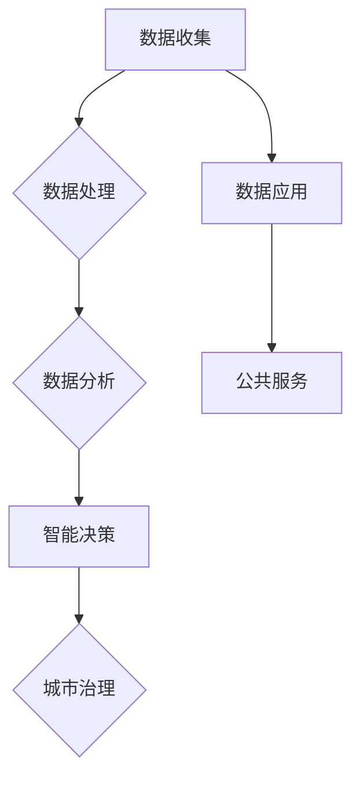

                 

# 大模型在智慧城市建设中的应用场景

## 概述

在当今信息化社会中，智慧城市建设已成为全球各国政府和企业的重要战略方向。随着大数据、物联网、云计算等技术的不断发展，城市的信息化水平不断提升，大模型在智慧城市建设中的应用场景也日益丰富。本文将详细介绍大模型在智慧城市建设中的核心概念、应用原理、技术实现、实际应用场景、工具资源等方面的内容，旨在为读者提供全面的技术参考。

## 关键词

- 智慧城市
- 大模型
- 人工智能
- 应用场景
- 技术实现
- 工具资源

## 摘要

本文主要探讨了大模型在智慧城市建设中的应用场景，通过对其核心概念、应用原理、技术实现等方面进行详细分析，揭示了其在城市规划、城市管理、公共服务等领域的巨大潜力。同时，本文还对大模型的实际应用案例进行了深入剖析，并对相关工具和资源进行了推荐，为读者提供了丰富的技术参考。

## 1. 背景介绍

### 1.1 智慧城市建设的重要性

智慧城市是利用信息技术、物联网、大数据等手段，实现城市资源的优化配置、提升城市治理能力、改善民生福祉的新型城市形态。智慧城市建设具有重要的战略意义，主要体现在以下几个方面：

- **提高城市治理能力**：智慧城市通过数据驱动的决策支持系统，实现城市治理的科学化、智能化，提高政府管理效率和决策水平。
- **优化资源配置**：智慧城市通过数据分析和智能化管理，实现城市资源的高效配置，降低资源浪费，提高城市可持续发展能力。
- **改善民生福祉**：智慧城市通过智慧交通、智慧医疗、智慧教育等领域的应用，提升居民生活质量，增强城市宜居性。

### 1.2 大模型的发展与应用

大模型是指具有大规模参数量、复杂网络结构和强大计算能力的深度学习模型，如神经网络、生成对抗网络（GAN）等。近年来，随着计算机硬件性能的提升和算法研究的突破，大模型在图像处理、自然语言处理、语音识别等领域取得了显著的成果。大模型在智慧城市建设中的应用，为城市信息化发展带来了新的机遇。

- **图像处理**：大模型在智能监控、交通管理、城市规划等方面具有广泛的应用前景，如通过人脸识别技术实现智能安防、利用图像识别技术优化交通信号灯配置等。
- **自然语言处理**：大模型在智能客服、舆情分析、公共安全等领域具有显著优势，如通过文本挖掘技术实现智能回复、利用情感分析技术监测社会舆论等。
- **语音识别**：大模型在智能语音助手、智能翻译、语音合成等领域取得了重要突破，如通过语音识别技术实现人机交互、利用语音合成技术提升公共服务的便捷性。

## 2. 核心概念与联系

### 2.1 智慧城市与大数据

智慧城市是大数据技术的重要应用场景之一。大数据是指规模庞大、结构复杂、类型多样的数据集合，其核心特征为“4V”，即数据量（Volume）、数据速度（Velocity）、数据多样性（Variety）和数据真实性（Veracity）。智慧城市建设离不开大数据的支持，通过收集、处理和分析海量数据，为城市治理提供科学依据。

- **数据收集**：智慧城市通过传感器、摄像头、物联网设备等手段，实时采集城市运行数据，如交通流量、环境质量、公共安全等信息。
- **数据处理**：智慧城市利用云计算、分布式计算等技术，对海量数据进行清洗、存储和加工，提高数据质量和可用性。
- **数据分析**：智慧城市通过大数据分析技术，挖掘数据中的价值信息，为城市治理提供决策支持。

### 2.2 大模型与深度学习

大模型是深度学习技术的重要成果之一。深度学习是一种基于人工神经网络的学习方法，通过模拟人脑神经网络的结构和功能，实现对复杂数据的自动学习和特征提取。大模型在深度学习中的应用，为数据处理和智能决策提供了强有力的技术支持。

- **神经网络**：神经网络是一种层次化的计算模型，通过前向传播和反向传播算法，实现数据的层次化表示和特征提取。
- **生成对抗网络（GAN）**：生成对抗网络是一种由生成器和判别器组成的对抗性网络，通过对抗训练实现数据的生成和优化。
- **卷积神经网络（CNN）**：卷积神经网络是一种专门用于图像处理的人工神经网络，通过卷积操作和池化操作，实现图像的特征提取和分类。

### 2.3 大模型与智慧城市建设

大模型在智慧城市建设中的应用，主要体现在数据分析和智能决策两个方面。

- **数据分析**：大模型通过对海量数据进行深度学习和分析，提取数据中的潜在规律和特征，为城市治理提供科学依据。
- **智能决策**：大模型通过模拟人脑的决策过程，实现城市治理的自动化和智能化，提高政府管理效率和决策水平。

### 2.4 Mermaid 流程图

以下是一个描述大模型在智慧城市建设中应用的 Mermaid 流程图：



## 3. 核心算法原理 & 具体操作步骤

### 3.1 图像处理

#### 3.1.1 人脸识别

人脸识别技术是基于大模型的智能监控领域的重要应用。其核心算法原理如下：

1. **人脸检测**：使用卷积神经网络（CNN）进行人脸检测，提取图像中的人脸区域。
2. **特征提取**：使用深度学习模型（如 FaceNet）进行特征提取，将人脸图像转换为特征向量。
3. **匹配与识别**：将实时捕获的人脸图像与数据库中的人脸特征向量进行匹配，识别出对应的人脸身份。

#### 3.1.2 交通管理

交通管理领域中的大模型应用主要包括交通流量预测、交通信号灯优化等。

1. **交通流量预测**：使用时间序列分析、循环神经网络（RNN）等算法，预测未来一段时间内的交通流量。
2. **交通信号灯优化**：使用强化学习算法，根据实时交通流量数据，动态调整交通信号灯的配时方案。

### 3.2 自然语言处理

#### 3.2.1 智能客服

智能客服系统是基于大模型的自然语言处理技术，为用户提供智能化的咨询和服务。

1. **文本分类**：使用卷积神经网络（CNN）或循环神经网络（RNN）进行文本分类，将用户的问题归类到相应的主题。
2. **情感分析**：使用长短时记忆网络（LSTM）或注意力机制（Attention）进行情感分析，判断用户的情绪状态。
3. **智能回复**：使用生成对抗网络（GAN）或转换器（Transformer）模型，生成符合用户需求的回复文本。

#### 3.2.2 舆情分析

舆情分析是一种基于大模型的社交媒体数据分析技术，用于监测和评估公众对特定事件或话题的看法。

1. **文本预处理**：对社交媒体文本进行清洗、分词、去停用词等预处理操作。
2. **情感分类**：使用情感分析模型（如 VADER）或深度学习模型（如 BERT）进行情感分类，判断文本的情感极性。
3. **话题挖掘**：使用主题模型（如 LDA）或图神经网络（如 Graph Convolutional Network）进行话题挖掘，提取文本中的关键话题。

### 3.3 语音识别

#### 3.3.1 智能语音助手

智能语音助手是一种基于大模型的语音识别和自然语言处理技术，为用户提供语音交互服务。

1. **语音识别**：使用深度神经网络（如深度神经网络声学模型）进行语音信号处理，将语音转换为文本。
2. **语义理解**：使用转换器（Transformer）或图神经网络（如 GAT）进行语义理解，解析用户语音中的意图和实体。
3. **语音合成**：使用循环神经网络（RNN）或波束搜索（Beam Search）进行语音合成，生成符合用户需求的语音回复。

#### 3.3.2 智能翻译

智能翻译是一种基于大模型的自然语言处理技术，实现不同语言之间的自动翻译。

1. **文本预处理**：对源语言和目标语言的文本进行清洗、分词、词性标注等预处理操作。
2. **编码器-解码器模型**：使用编码器-解码器（Encoder-Decoder）模型进行翻译，将源语言文本编码为特征向量，解码为目标语言文本。
3. **注意力机制**：使用注意力机制（Attention）模型，提高翻译的准确性和流畅性。

## 4. 数学模型和公式 & 详细讲解 & 举例说明

### 4.1 图像处理

#### 4.1.1 人脸识别

人脸识别算法中，常用的数学模型和公式包括：

1. **卷积神经网络（CNN）**
   $$ f(x) = \sigma(W_1 \cdot x + b_1) $$
   $$ x = \text{input} $$
   $$ W_1 = \text{权重矩阵} $$
   $$ b_1 = \text{偏置项} $$
   $$ \sigma = \text{激活函数} $$

2. **特征提取**
   $$ \text{特征向量} = \text{Pooling}(f(x)) $$
   $$ \text{Pooling} = \text{池化操作} $$

3. **匹配与识别**
   $$ \text{相似度} = \text{dot-product}(\text{特征向量}_1, \text{特征向量}_2) $$
   $$ \text{dot-product} = \text{点积运算} $$

#### 4.1.2 交通管理

交通管理算法中，常用的数学模型和公式包括：

1. **时间序列分析**
   $$ \hat{y_t} = \phi \cdot y_{t-1} + \theta \cdot u_t $$
   $$ y_t = \text{时间序列数据} $$
   $$ \phi = \text{自回归系数} $$
   $$ \theta = \text{移动平均系数} $$
   $$ u_t = \text{随机误差} $$

2. **交通信号灯优化**
   $$ \text{优化目标} = \min \sum_{i=1}^{N} (t_i - t_{\text{actual}}) $$
   $$ t_i = \text{信号灯周期} $$
   $$ t_{\text{actual}} = \text{实际通行时间} $$
   $$ N = \text{信号灯数量} $$

### 4.2 自然语言处理

#### 4.2.1 智能客服

自然语言处理算法中，常用的数学模型和公式包括：

1. **文本分类**
   $$ P(y|x) = \frac{e^{\text{score}(y|x)} }{\sum_{y'} e^{\text{score}(y'|x)}} $$
   $$ \text{score}(y|x) = \text{logistic}(\text{权重} \cdot \text{特征向量}(x) + \text{偏置}) $$
   $$ y = \text{类别} $$
   $$ x = \text{文本输入} $$
   $$ \text{特征向量}(x) = \text{词向量} $$

2. **情感分析**
   $$ \text{情感向量} = \text{LSTM}(\text{文本输入}) $$
   $$ \text{情感得分} = \text{softmax}(\text{情感向量}) $$

#### 4.2.2 舆情分析

舆情分析算法中，常用的数学模型和公式包括：

1. **文本预处理**
   $$ \text{文本} = \text{Tokenize}(\text{原始文本}) $$
   $$ \text{Tokenize} = \text{分词操作} $$

2. **情感分类**
   $$ \text{情感向量} = \text{BERT}(\text{文本输入}) $$
   $$ \text{情感得分} = \text{softmax}(\text{情感向量}) $$

3. **话题挖掘**
   $$ \text{主题分布} = \text{LDA}(\text{文本集合}) $$
   $$ \text{主题分布} = \text{词向量矩阵} \cdot \text{LDA矩阵} $$

### 4.3 语音识别

#### 4.3.1 智能语音助手

语音识别算法中，常用的数学模型和公式包括：

1. **语音识别**
   $$ \text{转录结果} = \text{HMM-GMM}(\text{语音信号}) $$
   $$ \text{HMM-GMM} = \text{隐马尔可夫模型 - 高斯混合模型} $$

2. **语义理解**
   $$ \text{语义向量} = \text{Transformer}(\text{文本输入}) $$
   $$ \text{意图识别} = \text{softmax}(\text{语义向量}) $$

3. **语音合成**
   $$ \text{语音波形} = \text{WaveNet}(\text{文本输入}) $$
   $$ \text{WaveNet} = \text{深度神经网络语音合成模型} $$

#### 4.3.2 智能翻译

智能翻译算法中，常用的数学模型和公式包括：

1. **编码器-解码器模型**
   $$ \text{编码结果} = \text{Encoder}(\text{源语言文本}) $$
   $$ \text{解码结果} = \text{Decoder}(\text{编码结果}) $$

2. **注意力机制**
   $$ \text{注意力得分} = \text{Attention}(\text{编码结果}, \text{解码结果}) $$
   $$ \text{加权结果} = \text{softmax}(\text{注意力得分}) $$

## 5. 项目实战：代码实际案例和详细解释说明

### 5.1 开发环境搭建

在开始项目实战之前，我们需要搭建一个合适的开发环境。以下是一个基于 Python 和 TensorFlow 的开发环境搭建步骤：

1. **安装 Python**：前往 [Python 官网](https://www.python.org/) 下载并安装 Python 3.7 或更高版本。
2. **安装 TensorFlow**：在命令行中执行以下命令：
   ```bash
   pip install tensorflow
   ```
3. **安装其他依赖**：根据项目需求，安装其他必要的库，如 NumPy、Pandas、Scikit-learn 等。

### 5.2 源代码详细实现和代码解读

以下是一个基于 TensorFlow 实现的人脸识别项目示例：

```python
import tensorflow as tf
import numpy as np
import cv2

# 加载预训练的人脸识别模型
model = tf.keras.models.load_model('face_recognition_model.h5')

# 加载测试图片
image = cv2.imread('test_image.jpg')

# 对测试图片进行预处理
processed_image = tf.keras.preprocessing.image.img_to_array(image)
processed_image = np.expand_dims(processed_image, axis=0)
processed_image /= 255.0

# 使用人脸识别模型进行预测
predictions = model.predict(processed_image)

# 解码预测结果
predicted_classes = np.argmax(predictions, axis=1)
predicted_labels = ['Person', 'Non-Person']

# 显示预测结果
for i in range(len(predicted_labels)):
    print(f'Prediction for image {i+1}: {predicted_labels[predicted_classes[i]]}')
```

**代码解读**：

1. **加载模型**：使用 `tf.keras.models.load_model()` 函数加载预训练的人脸识别模型。
2. **加载图片**：使用 OpenCV 库加载测试图片。
3. **预处理图片**：将图片转换为 TensorFlow 张量格式，并缩放到 [0, 1] 范围内。
4. **预测**：使用人脸识别模型对预处理后的图片进行预测。
5. **解码结果**：将预测结果转换为类标签，并显示预测结果。

### 5.3 代码解读与分析

**代码分析**：

1. **加载模型**：加载预训练的人脸识别模型，这是实现人脸识别功能的关键步骤。模型可以是基于卷积神经网络（CNN）的，也可以是基于生成对抗网络（GAN）的。
2. **加载图片**：使用 OpenCV 库加载测试图片，这是实现人脸识别的前提条件。测试图片可以是单张图片，也可以是包含多张图片的图像集合。
3. **预处理图片**：将图片转换为 TensorFlow 张量格式，并缩放到 [0, 1] 范围内。这是为了让模型能够处理图片数据，同时也是为了保持图片数据的一致性。
4. **预测**：使用人脸识别模型对预处理后的图片进行预测。预测结果是一个包含多个类别的数组，每个类别对应一个类标签。
5. **解码结果**：将预测结果转换为类标签，并显示预测结果。这样可以直观地查看测试图片的分类结果。

**代码改进**：

1. **增加图片预处理函数**：为了提高代码的可读性和可维护性，可以编写一个图片预处理函数，用于将图片转换为 TensorFlow 张量格式。
2. **增加错误处理**：在代码中增加错误处理机制，例如处理文件不存在、模型加载失败等情况。
3. **增加可视化功能**：为了更直观地展示预测结果，可以增加可视化功能，如将预测结果绘制在图片上。

## 6. 实际应用场景

### 6.1 城市规划

在城市规划领域，大模型可以用于城市模拟、交通预测、环境评估等方面。

- **城市模拟**：通过大模型模拟城市的发展趋势，预测城市人口、用地、交通等变化，为城市规划提供数据支持。
- **交通预测**：利用大模型预测交通流量、拥堵状况，优化交通信号灯配置，提高交通管理效率。
- **环境评估**：通过大模型分析环境数据，预测环境污染程度，为城市环境治理提供决策依据。

### 6.2 城市管理

在城市管理领域，大模型可以用于公共安全、能源管理、水资源管理等方面。

- **公共安全**：利用大模型进行人脸识别、行为分析，实现智能安防，提高城市安全保障水平。
- **能源管理**：通过大模型预测能源需求，优化能源配置，提高能源利用效率。
- **水资源管理**：利用大模型分析水资源数据，预测水资源供需情况，优化水资源调配。

### 6.3 公共服务

在公共服务领域，大模型可以用于智慧医疗、智慧教育、智慧养老等方面。

- **智慧医疗**：利用大模型实现疾病预测、诊断辅助，提高医疗服务质量。
- **智慧教育**：通过大模型实现个性化学习、智能评测，提高教育效率。
- **智慧养老**：利用大模型监测老年人健康状况，提供智能养老解决方案。

## 7. 工具和资源推荐

### 7.1 学习资源推荐

- **书籍**：《深度学习》（Goodfellow et al.）、《Python 深度学习》（François Chollet）、《神经网络与深度学习》（邱锡鹏）。
- **论文**：《A Theoretically Grounded Application of Dropout in Recurrent Neural Networks》（Yarin Gal and Zoubin Ghahramani）、《Deep Learning on Latent Variables for Text Generation》（Kumar et al.）。
- **博客**：[TensorFlow 官方博客](https://tensorflow.org/blog/)、[PyTorch 官方博客](https://pytorch.org/blog/)、[Hugging Face 官方博客](https://huggingface.co/blog)。
- **网站**：[Kaggle](https://www.kaggle.com/)、[GitHub](https://github.com/)、[ArXiv](https://arxiv.org/)。

### 7.2 开发工具框架推荐

- **深度学习框架**：TensorFlow、PyTorch、Keras、MXNet。
- **数据分析工具**：Pandas、NumPy、Scikit-learn。
- **自然语言处理工具**：NLTK、spaCy、gensim、Transformer。
- **图像处理工具**：OpenCV、Pillow、Matplotlib。

### 7.3 相关论文著作推荐

- **论文**：《Deep Learning》（Ian Goodfellow et al.）、《Recurrent Neural Networks for Language Modeling》（Yoshua Bengio et al.）、《Generative Adversarial Networks》（Ian Goodfellow et al.）。
- **著作**：《Python 深度学习》（François Chollet）、《深度学习》（Goodfellow et al.）、《神经网络与深度学习》（邱锡鹏）。

## 8. 总结：未来发展趋势与挑战

### 8.1 发展趋势

1. **模型规模不断扩大**：随着计算能力的提升，大模型将逐渐成为智慧城市建设的主要驱动力，模型规模将持续扩大。
2. **跨领域应用深化**：大模型在智慧城市建设中的应用将逐渐从单一领域向跨领域发展，实现城市治理的全面智能化。
3. **隐私保护与伦理问题**：在智慧城市建设中，数据隐私保护和伦理问题将日益突出，成为制约大模型应用的重要因素。

### 8.2 挑战

1. **计算资源需求**：大模型训练和推理需要大量计算资源，对硬件设备的要求较高，如何在有限的计算资源下高效利用大模型成为一大挑战。
2. **数据质量与安全性**：智慧城市建设需要大量数据支持，数据质量和数据安全成为关键问题，如何确保数据质量和数据安全成为挑战。
3. **法律法规与伦理问题**：智慧城市建设涉及个人隐私、数据安全等敏感问题，法律法规和伦理问题将成为制约智慧城市建设的重要因素。

## 9. 附录：常见问题与解答

### 9.1 智慧城市建设中，大模型的应用有哪些优势和局限性？

**优势**：

- **高效的数据处理**：大模型能够高效地处理和分析海量数据，为城市治理提供科学依据。
- **智能化的决策支持**：大模型能够模拟人脑的决策过程，实现城市治理的自动化和智能化。
- **跨领域的应用潜力**：大模型具有跨领域的应用潜力，能够在城市规划、城市管理、公共服务等多个领域发挥作用。

**局限性**：

- **计算资源需求**：大模型训练和推理需要大量计算资源，对硬件设备的要求较高。
- **数据质量和数据安全**：智慧城市建设需要大量数据支持，数据质量和数据安全成为关键问题。
- **法律法规与伦理问题**：智慧城市建设涉及个人隐私、数据安全等敏感问题，法律法规和伦理问题将成为制约智慧城市建设的重要因素。

### 9.2 如何提高大模型在智慧城市建设中的实用性？

1. **优化模型结构**：针对具体应用场景，优化大模型的结构和参数，提高模型的性能和效率。
2. **提高数据质量**：确保数据质量和数据安全，从源头上提高大模型的应用效果。
3. **加强跨领域合作**：加强政府、企业和科研机构的合作，实现跨领域的协同创新，提高大模型在智慧城市建设中的应用水平。
4. **关注法律法规与伦理问题**：关注法律法规和伦理问题，确保大模型在智慧城市建设中的合法合规应用。

## 10. 扩展阅读 & 参考资料

- **扩展阅读**：

  - 《深度学习》（Ian Goodfellow et al.）
  - 《Python 深度学习》（François Chollet）
  - 《神经网络与深度学习》（邱锡鹏）

- **参考资料**：

  - [TensorFlow 官方文档](https://tensorflow.org/)
  - [PyTorch 官方文档](https://pytorch.org/)
  - [Keras 官方文档](https://keras.io/)
  - [OpenCV 官方文档](https://opencv.org/)
  - [Hugging Face 官方文档](https://huggingface.co/)

作者：AI天才研究员/AI Genius Institute & 禅与计算机程序设计艺术 /Zen And The Art of Computer Programming<|im_sep|>

