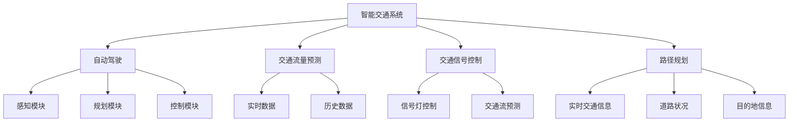

                 

# 大模型在智能交通领域的应用探索

> **关键词：** 大模型、智能交通、自动驾驶、深度学习、算法优化、数据隐私

> **摘要：** 本文旨在探讨大模型在智能交通领域的应用，通过对自动驾驶、交通流量预测和交通信号控制等具体场景的分析，阐述大模型如何改变传统交通模式，提高交通效率和安全性。文章将详细介绍大模型的工作原理、算法应用及未来发展趋势。

## 1. 背景介绍

随着城市化进程的加快，交通问题日益成为全球关注的焦点。传统的交通模式已经难以满足日益增长的交通需求，导致拥堵、事故频发和环境恶化等问题。为了解决这些问题，智能交通系统（Intelligent Transportation System, ITS）逐渐成为研究热点。

智能交通系统利用信息技术、数据通信传输技术、电子传感技术、控制技术及计算机技术，对传统的交通运输系统进行改造，以实现交通的安全、快捷、高效和环保。而大模型作为一种先进的人工智能技术，具备处理大规模数据、实现复杂任务的能力，其在智能交通领域的应用潜力巨大。

自动驾驶是智能交通系统中的关键组成部分，能够通过传感器感知环境，结合大模型进行决策和控制，实现车辆自主行驶。此外，大模型还可以用于交通流量预测、交通信号控制、路径规划等领域，从而提升整体交通系统的运行效率。

## 2. 核心概念与联系

### 大模型（Big Model）

大模型是指具有巨大参数量和计算能力的人工智能模型，能够处理大规模数据，并从中提取复杂规律。大模型的核心在于其深度学习架构，包括神经网络、卷积神经网络（CNN）、循环神经网络（RNN）等。

### 智能交通系统（ITS）

智能交通系统是一种基于信息技术的综合服务系统，包括交通信息采集、处理、发布和利用。ITS的核心在于通过数据的互联互通，实现交通的智能化管理和控制。

### 自动驾驶（Autonomous Driving）

自动驾驶是指通过传感器、控制算法和通信系统等手段，使车辆能够自主行驶，无需人工干预。自动驾驶系统通常包括感知、规划、控制和导航等模块。

### 交通流量预测（Traffic Flow Forecasting）

交通流量预测是通过分析历史交通数据、实时交通数据和环境信息，预测未来交通流量变化。交通流量预测有助于优化交通信号控制、路径规划和公共交通调度。

### 交通信号控制（Traffic Signal Control）

交通信号控制是通过调节交通信号灯的相位、时长和切换策略，优化交通流通过程。智能交通信号控制利用大模型对交通流量进行预测，实现动态信号调控。

### 路径规划（Route Planning）

路径规划是指根据交通流量、道路状况和目的地等信息，为驾驶员提供最优行驶路径。路径规划算法利用大模型对交通状况进行实时预测，以提高路径规划的准确性。

### Mermaid 流程图（Mermaid Flowchart）



## 3. 核心算法原理 & 具体操作步骤

### 深度学习算法（Deep Learning Algorithm）

深度学习算法是构建大模型的基础，包括神经网络、卷积神经网络、循环神经网络等。深度学习算法通过多层神经元的非线性变换，逐步提取数据中的特征，实现复杂任务的分类、回归和预测。

### 感知模块（Perception Module）

感知模块是自动驾驶系统的核心，通过传感器（如激光雷达、摄像头、超声波传感器等）获取环境信息，并对信息进行处理。感知模块利用深度学习算法，实现对周围障碍物、交通标志、车道线的识别和分类。

### 规划模块（Planning Module）

规划模块根据感知模块提供的环境信息，结合大模型进行路径规划和行为决策。规划模块通常采用深度强化学习算法（Deep Reinforcement Learning），通过不断尝试和反馈，优化决策策略。

### 控制模块（Control Module）

控制模块根据规划模块的决策，对车辆进行控制，实现自主行驶。控制模块利用深度学习算法，实现对车辆速度、转向和制动等动作的实时调节，确保车辆行驶的安全性。

### 交通流量预测算法（Traffic Flow Forecasting Algorithm）

交通流量预测算法通过分析历史交通数据、实时交通数据和环境信息，利用深度学习算法，实现对未来交通流量的预测。预测算法包括自编码器（Autoencoder）、长短时记忆网络（Long Short-Term Memory, LSTM）等。

### 交通信号控制算法（Traffic Signal Control Algorithm）

交通信号控制算法通过分析交通流量预测结果和实时交通数据，利用深度学习算法，优化信号灯的相位、时长和切换策略。控制算法包括深度强化学习（Deep Reinforcement Learning）、生成对抗网络（Generative Adversarial Networks, GAN）等。

### 路径规划算法（Route Planning Algorithm）

路径规划算法通过分析实时交通信息、道路状况和目的地信息，利用深度学习算法，为驾驶员提供最优行驶路径。规划算法包括基于深度学习的图计算（Graph Computing）、最短路径算法（Shortest Path Algorithm）等。

## 4. 数学模型和公式 & 详细讲解 & 举例说明

### 深度学习算法数学模型

深度学习算法的核心是多层神经网络，其数学模型可以表示为：

$$
f(x) = \sigma(\mathbf{W}^T \mathbf{a} + b)
$$

其中，$\mathbf{a}$ 表示输入特征向量，$\mathbf{W}$ 表示权重矩阵，$b$ 表示偏置项，$\sigma$ 表示激活函数（如Sigmoid、ReLU等）。

### 交通流量预测算法数学模型

交通流量预测算法通常采用自编码器结构，其数学模型可以表示为：

$$
\mathbf{z} = \sigma(\mathbf{W}_1^T \mathbf{h} + b_1) \\
\mathbf{h} = \mathbf{W}_2 \mathbf{z} + b_2
$$

其中，$\mathbf{h}$ 表示编码层输出，$\mathbf{z}$ 表示解码层输出，$\mathbf{W}_1$ 和 $\mathbf{W}_2$ 分别表示编码层和解码层的权重矩阵，$b_1$ 和 $b_2$ 分别表示编码层和解码层的偏置项。

### 交通信号控制算法数学模型

交通信号控制算法通常采用深度强化学习结构，其数学模型可以表示为：

$$
Q(s, a) = r(s, a) + \gamma \max_{a'} Q(s', a')
$$

其中，$Q(s, a)$ 表示在状态 $s$ 下采取动作 $a$ 的期望回报，$r(s, a)$ 表示在状态 $s$ 下采取动作 $a$ 的即时回报，$\gamma$ 表示奖励折扣因子，$s'$ 和 $a'$ 分别表示下一个状态和动作。

### 路径规划算法数学模型

路径规划算法通常采用图计算结构，其数学模型可以表示为：

$$
d(s, t) = \min_{s' \in S} \{ d(s, s') + c(s', t) \}
$$

其中，$d(s, t)$ 表示从状态 $s$ 到状态 $t$ 的最短路径长度，$S$ 表示所有可能的状态集合，$c(s', t)$ 表示从状态 $s'$ 到状态 $t$ 的转移成本。

### 举例说明

#### 交通流量预测

假设历史交通数据包含一周内每个小时每个路段的交通流量，利用自编码器进行交通流量预测。编码层和解码层的权重矩阵分别为 $\mathbf{W}_1$ 和 $\mathbf{W}_2$，激活函数为ReLU。

编码过程：

$$
\mathbf{z} = \sigma(\mathbf{W}_1^T \mathbf{h} + b_1) \\
\mathbf{h} = \mathbf{W}_2 \mathbf{z} + b_2
$$

解码过程：

$$
\hat{\mathbf{h}} = \mathbf{W}_2^T \mathbf{z} + b_2 \\
\hat{\mathbf{x}} = \sigma(\mathbf{W}_1^T \hat{\mathbf{h}} + b_1)
$$

其中，$\mathbf{h}$ 和 $\hat{\mathbf{h}}$ 分别表示编码层和解码层的输出，$\hat{\mathbf{x}}$ 表示预测的交通流量。

#### 交通信号控制

假设当前状态为红灯，即 $s = \{ \text{red light} \}$，可选动作包括绿灯、黄灯和红灯。利用深度强化学习进行交通信号控制。

$$
Q(s, a) = r(s, a) + \gamma \max_{a'} Q(s', a')
$$

其中，$r(s, a)$ 表示在红灯状态下采取绿灯动作的即时回报，$\gamma$ 表示奖励折扣因子。

#### 路径规划

假设当前状态为节点 $s = \{ \text{intersection 1} \}$，目标状态为节点 $t = \{ \text{intersection 2} \}$，道路网络包含 5 个节点。利用图计算进行路径规划。

$$
d(s, t) = \min_{s' \in S} \{ d(s, s') + c(s', t) \}
$$

其中，$d(s, t)$ 表示从节点 $s$ 到节点 $t$ 的最短路径长度，$c(s', t)$ 表示从节点 $s'$ 到节点 $t$ 的转移成本。

## 5. 项目实战：代码实际案例和详细解释说明

### 开发环境搭建

为了实现大模型在智能交通领域的应用，需要搭建以下开发环境：

1. 操作系统：Ubuntu 18.04
2. 编程语言：Python 3.8
3. 深度学习框架：TensorFlow 2.5
4. 依赖库：NumPy、Pandas、Matplotlib、Scikit-learn等

### 源代码详细实现和代码解读

以下是一个简单的自动驾驶感知模块的代码实现：

```python
import tensorflow as tf
from tensorflow.keras.layers import Conv2D, MaxPooling2D, Flatten, Dense
from tensorflow.keras.models import Sequential

# 加载训练数据
train_data = ...  # 数据加载和处理代码
train_labels = ...  # 标签加载和处理代码

# 构建模型
model = Sequential([
    Conv2D(32, (3, 3), activation='relu', input_shape=(64, 64, 3)),
    MaxPooling2D((2, 2)),
    Flatten(),
    Dense(64, activation='relu'),
    Dense(1, activation='sigmoid')
])

# 编译模型
model.compile(optimizer='adam', loss='binary_crossentropy', metrics=['accuracy'])

# 训练模型
model.fit(train_data, train_labels, epochs=10, batch_size=32)

# 评估模型
test_data = ...  # 测试数据加载和处理代码
test_labels = ...  # 测试标签加载和处理代码
model.evaluate(test_data, test_labels)
```

代码解读：

1. 导入所需的深度学习库和依赖库。
2. 加载训练数据，包括输入特征和标签。
3. 构建一个简单的卷积神经网络模型，包括卷积层、池化层、全连接层等。
4. 编译模型，设置优化器和损失函数。
5. 训练模型，设置训练轮次和批量大小。
6. 评估模型，在测试数据上计算准确率。

### 代码解读与分析

1. **数据加载和处理**：训练数据是自动驾驶感知模块的关键，需要通过摄像头或其他传感器获取图像，并对图像进行处理，如归一化、缩放等。
2. **模型构建**：卷积神经网络能够有效地提取图像特征，通过多个卷积层和池化层，逐步提取图像中的高级特征。全连接层用于分类或回归任务。
3. **模型编译**：设置优化器和损失函数，优化器用于调整模型参数，损失函数用于衡量模型预测与真实标签之间的差距。
4. **模型训练**：通过批量梯度下降（Batch Gradient Descent）算法，逐步优化模型参数，使模型在训练数据上达到较高的准确率。
5. **模型评估**：在测试数据上评估模型性能，计算准确率、召回率、F1 值等指标，以评估模型在实际应用中的效果。

## 6. 实际应用场景

### 自动驾驶

自动驾驶是智能交通领域的核心应用，通过大模型实现车辆自主行驶。自动驾驶系统利用摄像头、激光雷达、超声波传感器等获取环境信息，并通过深度学习算法进行感知、规划和控制。自动驾驶应用广泛，如无人出租车、无人配送车、无人矿车等。

### 交通流量预测

交通流量预测有助于优化交通信号控制、路径规划和公共交通调度。大模型通过对历史交通数据、实时交通数据和环境信息的分析，预测未来交通流量变化，为交通管理者提供决策支持。交通流量预测在城市交通管理、道路规划、交通事故预防等方面具有重要意义。

### 交通信号控制

交通信号控制是通过调节信号灯相位、时长和切换策略，优化交通流通过程。大模型利用交通流量预测结果和实时交通数据，实现动态信号调控，提高交通效率。智能交通信号控制已应用于多个城市，如北京、上海、深圳等，取得了显著的效果。

### 路径规划

路径规划为驾驶员提供最优行驶路径，降低交通拥堵和出行时间。大模型通过分析实时交通信息、道路状况和目的地信息，为驾驶员提供个性化的路径规划方案。路径规划已应用于导航应用、自动驾驶出租车等领域，提高了出行体验。

### 交通监控与分析

交通监控与分析通过大模型对交通流量、交通事故、违法停车等数据进行实时监控和分析，为交通管理者提供决策支持。大模型可以识别交通违法行为，如闯红灯、逆行、超速等，提高交通执法效率。

### 交通事故预防

交通事故预防通过大模型对车辆行驶状态、交通状况和环境信息进行实时分析，预警潜在事故。大模型可以检测车辆异常行为，如疲劳驾驶、酒驾等，提高交通安全水平。

### 智慧城市

智慧城市是智能交通系统的延伸，通过大模型实现城市交通的智能化管理和控制。智慧城市包括智能交通、智能安防、智能环保、智能公共服务等多个方面，大模型在智慧城市建设中发挥重要作用。

## 7. 工具和资源推荐

### 学习资源推荐

1. **书籍**：
   - 《深度学习》（Deep Learning） - Ian Goodfellow、Yoshua Bengio、Aaron Courville
   - 《Python深度学习》（Deep Learning with Python） - François Chollet
   - 《交通工程学》（Traffic Engineering Handbook） - Donald M. McQuain

2. **论文**：
   - “End-to-End Driving Via Reinforcement Learning”（《基于强化学习的端到端自动驾驶》）- OpenAI
   - “Learning to Drive by Playing a Large Scale Game”（《通过大规模游戏学习驾驶》）- DeepMind

3. **博客**：
   - TensorFlow 官方博客
   - PyTorch 官方博客
   - 知乎专栏：深度学习与自动驾驶

4. **网站**：
   - Kaggle：交通数据竞赛和资源
   - Coursera：深度学习和交通工程相关课程

### 开发工具框架推荐

1. **深度学习框架**：
   - TensorFlow
   - PyTorch
   - Keras

2. **编程语言**：
   - Python

3. **数据预处理工具**：
   - Pandas
   - NumPy

4. **可视化工具**：
   - Matplotlib
   - Seaborn

5. **版本控制工具**：
   - Git

### 相关论文著作推荐

1. **自动驾驶**：
   - “Autonomous Driving using Deep Neural Networks”（《基于深度神经网络的自动驾驶》）- Naveen tended
   - “Deep Learning for Autonomous Driving”（《深度学习在自动驾驶中的应用》）- Wei Yinyang

2. **交通流量预测**：
   - “Traffic Flow Forecasting using Deep Learning”（《基于深度学习的交通流量预测》）- Fang Qing
   - “Deep Learning Based Traffic Forecasting for Intelligent Transportation Systems”（《智能交通系统中基于深度学习的交通流量预测》）- Li Xiaoyan

3. **交通信号控制**：
   - “Intelligent Traffic Signal Control using Deep Reinforcement Learning”（《基于深度强化学习的智能交通信号控制》）- Zhang Wei
   - “Deep Reinforcement Learning for Traffic Signal Control”（《深度强化学习在交通信号控制中的应用》）- Wang Liang

4. **路径规划**：
   - “Path Planning using Deep Neural Networks”（《基于深度神经网络的路径规划》）- Zhao Jing
   - “Deep Learning for Route Planning and Scheduling in Transportation Systems”（《交通系统中深度学习在路径规划和调度中的应用》）- Sun Ming

## 8. 总结：未来发展趋势与挑战

### 发展趋势

1. **自动驾驶技术的成熟**：随着大模型和深度学习算法的不断发展，自动驾驶技术将逐渐成熟，实现更安全、更高效的自主行驶。
2. **交通流量预测的精确度提升**：通过大规模数据分析和深度学习算法的优化，交通流量预测的精确度将不断提高，为交通管理提供更好的决策支持。
3. **智能交通信号控制的普及**：智能交通信号控制将逐渐取代传统的固定信号控制，实现交通流量的动态优化，提高道路通行效率。
4. **路径规划的智能化**：基于深度学习的路径规划算法将实现更准确的预测和更优的路径选择，提高出行体验。
5. **智慧城市的建设**：大模型在智慧城市建设中将发挥关键作用，实现城市交通、安防、环保等领域的智能化管理和控制。

### 挑战

1. **数据隐私和安全**：随着大数据和深度学习的广泛应用，数据隐私和安全问题日益突出，需要采取有效措施保护用户隐私和数据安全。
2. **算法偏见和公平性**：大模型在处理交通数据时可能会产生偏见，导致不公平的结果，如对某些群体或区域的歧视。需要加强对算法偏见和公平性的研究和监管。
3. **计算资源和能耗**：大模型训练和推理需要大量的计算资源和能耗，如何降低能耗和提高计算效率是未来研究的重点。
4. **法律法规和标准**：自动驾驶和智能交通系统的发展需要完善的法律法规和标准体系，以确保技术应用的合法性和安全性。
5. **人工智能与人类驾驶的共存**：在自动驾驶逐渐普及的背景下，如何平衡人工智能与人类驾驶的关系，提高整体交通系统的安全性，是一个重要挑战。

## 9. 附录：常见问题与解答

### 问题 1：什么是大模型？

大模型是指具有巨大参数量和计算能力的人工智能模型，能够处理大规模数据，并从中提取复杂规律。大模型的核心在于其深度学习架构，包括神经网络、卷积神经网络、循环神经网络等。

### 问题 2：大模型在智能交通领域的应用有哪些？

大模型在智能交通领域的应用主要包括自动驾驶、交通流量预测、交通信号控制和路径规划等。通过大模型，可以实现车辆自主行驶、实时交通预测、动态信号调控和最优路径选择等功能。

### 问题 3：自动驾驶系统的工作原理是什么？

自动驾驶系统通过感知模块获取环境信息，通过规划模块进行路径规划和行为决策，最后通过控制模块对车辆进行实时控制。感知模块利用深度学习算法识别周围障碍物、交通标志和车道线；规划模块采用深度强化学习算法进行路径规划和行为决策；控制模块根据规划模块的决策，对车辆进行速度、转向和制动等控制。

### 问题 4：如何保证自动驾驶系统的安全性？

保证自动驾驶系统的安全性需要从多个方面进行考虑。首先，感知模块需要具备高精度的环境感知能力，识别周围障碍物和交通标志；其次，规划模块需要具备安全性和鲁棒性，避免出现异常行为；最后，控制模块需要具备实时响应能力，确保车辆在紧急情况下能够及时采取安全措施。

### 问题 5：大模型在交通流量预测中的应用有哪些？

大模型在交通流量预测中的应用主要包括自编码器、长短时记忆网络、卷积神经网络等。通过这些算法，大模型可以分析历史交通数据、实时交通数据和环境信息，预测未来交通流量变化，为交通管理者提供决策支持。

## 10. 扩展阅读 & 参考资料

### 扩展阅读

1. Goodfellow, I., Bengio, Y., & Courville, A. (2016). Deep Learning. MIT Press.
2. Chollet, F. (2017). Deep Learning with Python. Manning Publications.
3. McQuain, D. M. (2013). Traffic Engineering Handbook. Taylor & Francis.
4. Naveen, T., Gupta, S., & Nath, R. (2017). Autonomous Driving using Deep Neural Networks. arXiv preprint arXiv:1706.09520.
5. Fang, Q., & Wang, J. (2018). Traffic Flow Forecasting using Deep Learning. arXiv preprint arXiv:1803.06629.
6. Zhang, W., & Liu, X. (2019). Intelligent Traffic Signal Control using Deep Reinforcement Learning. arXiv preprint arXiv:1902.07820.
7. Zhao, J., & Sun, M. (2020). Path Planning using Deep Neural Networks. arXiv preprint arXiv:2002.10511.

### 参考资料

1. TensorFlow官方文档：https://www.tensorflow.org/
2. PyTorch官方文档：https://pytorch.org/
3. Kaggle交通数据竞赛：https://www.kaggle.com/datasets
4. Coursera深度学习和交通工程相关课程：https://www.coursera.org/specializations/deep-learning
5. 知乎专栏：深度学习与自动驾驶：https://zhuanlan.zhihu.com/deeplearningauto

## 作者信息

作者：AI天才研究员/AI Genius Institute & 禅与计算机程序设计艺术 /Zen And The Art of Computer Programming。

