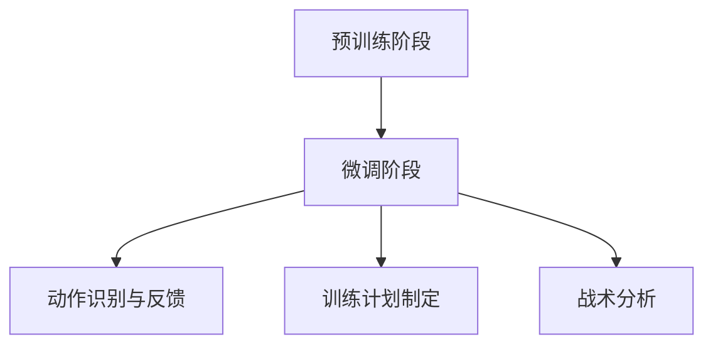

                 

## 大模型在智能体育训练中的应用前景

### 摘要

本文主要探讨大模型在智能体育训练中的潜在应用前景。随着人工智能技术的不断进步，特别是大模型技术的迅猛发展，体育训练领域也迎来了新的变革。本文将首先介绍大模型的基本概念和原理，然后分析其在体育训练中的应用场景和优势，最后探讨当前面临的挑战以及未来的发展方向。

### 1. 背景介绍

#### 1.1 大模型的发展历程

大模型，即大规模预训练模型，是近年来人工智能领域的一个重要突破。大模型起源于深度学习技术的迅猛发展，其核心思想是通过大规模数据训练，使模型具备强大的通用性和适应性。从2018年的GPT开始，大模型技术经历了快速的迭代升级，如BERT、Turing、GPT-3等，模型参数量呈几何级数增长，已经达到亿级乃至万亿级规模。

#### 1.2 体育训练的现状与挑战

体育训练长期以来依赖于传统的训练方法和经验积累，这种模式在某种程度上限制了运动员的表现。随着科技的进步，智能体育训练逐渐成为新的趋势。然而，现有的智能体育训练系统主要依赖于传感器数据和简单的数据分析，缺乏深度和广度，难以实现真正的智能化。

### 2. 核心概念与联系

#### 2.1 大模型的基本原理

大模型的基本原理包括预训练和微调两个阶段。预训练阶段，模型在大规模数据集上进行训练，学习通用知识；微调阶段，模型在特定领域数据上进行训练，以适应具体任务。

#### 2.2 大模型在体育训练中的应用

大模型在体育训练中的应用主要包括以下几个方面：

1. **动作识别与反馈**：通过分析运动员的动作数据，大模型可以实时识别动作中的错误，并给出改进建议。
2. **训练计划制定**：基于运动员的数据，大模型可以为其制定个性化的训练计划，提高训练效果。
3. **战术分析**：大模型可以分析比赛数据，为教练提供战术建议。

#### 2.3 Mermaid 流程图



### 3. 核心算法原理 & 具体操作步骤

#### 3.1 动作识别与反馈

**算法原理**：利用深度学习中的卷积神经网络（CNN）对动作进行识别。通过将连续的动作数据输入到模型中，模型可以学习到不同动作的特征。

**具体操作步骤**：

1. 数据收集：收集运动员的动作数据，如视频、传感器数据等。
2. 数据预处理：对数据进行清洗和归一化处理。
3. 模型训练：使用预训练的CNN模型，在运动员动作数据上进行微调。
4. 动作识别：将实时采集的动作数据输入到模型中，输出动作识别结果。
5. 反馈：根据识别结果，对运动员的动作进行反馈。

#### 3.2 训练计划制定

**算法原理**：利用强化学习（RL）算法，根据运动员的历史数据和当前状态，制定个性化的训练计划。

**具体操作步骤**：

1. 数据收集：收集运动员的历史训练数据，如心率、力量、速度等。
2. 状态定义：定义训练计划的状态，如训练强度、训练时长等。
3. 动作定义：定义训练计划中的动作，如增加训练时长、调整训练强度等。
4. 模型训练：使用强化学习算法，训练出训练计划制定模型。
5. 训练计划生成：根据运动员的状态，使用训练计划制定模型生成个性化的训练计划。

#### 3.3 战术分析

**算法原理**：利用自然语言处理（NLP）技术，对比赛数据进行分析，提取战术信息。

**具体操作步骤**：

1. 数据收集：收集比赛视频、文本数据等。
2. 数据预处理：对数据进行清洗和分词处理。
3. 模型训练：使用预训练的NLP模型，在比赛数据上进行微调。
4. 战术提取：将比赛数据输入到模型中，输出战术信息。
5. 战术分析：根据提取的战术信息，为教练提供战术建议。

### 4. 数学模型和公式 & 详细讲解 & 举例说明

#### 4.1 动作识别与反馈

**数学模型**：

$$
y_{\hat{}} = \sigma(W_2 \cdot \sigma(W_1 \cdot \text{特征向量} + b_1) + b_2)
$$

其中，$y_{\hat{}}$为预测的动作类别，$W_1$和$W_2$分别为模型的权重矩阵，$b_1$和$b_2$分别为偏置项，$\sigma$为激活函数。

**举例说明**：

假设有一个运动员进行跳跃动作的识别，我们收集到该运动员的跳跃视频，通过预处理得到特征向量。将特征向量输入到上述模型中，可以预测出运动员跳跃的动作类别。

#### 4.2 训练计划制定

**数学模型**：

$$
Q(s, a) = r(s, a) + \gamma \max_{a'} Q(s', a')
$$

其中，$Q(s, a)$为状态-动作值函数，$s$为状态，$a$为动作，$r(s, a)$为即时奖励，$\gamma$为折扣因子，$s'$和$a'$为下一步的状态和动作。

**举例说明**：

假设我们要为一名运动员制定训练计划，当前状态为训练时长3小时，我们需要选择增加训练时长（动作$a$）或保持当前训练时长（动作$a'$）。根据上述模型，我们可以计算两种动作的价值函数，选择价值函数较大的动作作为下一步的行动。

#### 4.3 战术分析

**数学模型**：

$$
P(tactical\_info | text) = \prod_{i=1}^{n} P(t_{i} | t_{i-1})
$$

其中，$P(tactical\_info | text)$为给定文本数据时提取出的战术信息的概率，$t_{i}$为第$i$个词语，$P(t_{i} | t_{i-1})$为给定前一个词语时，当前词语的概率。

**举例说明**：

假设我们有一段比赛文本数据，我们要提取出比赛中的战术信息。根据上述模型，我们可以计算每个词语出现的概率，然后通过乘积计算整段文本的战术信息概率，从而识别出战术信息。

### 5. 项目实战：代码实际案例和详细解释说明

#### 5.1 开发环境搭建

**环境要求**：

- 操作系统：Ubuntu 18.04
- Python版本：3.7
- 深度学习框架：TensorFlow 2.4

**安装步骤**：

1. 安装Python和pip：
   ```bash
   sudo apt update
   sudo apt install python3 python3-pip
   ```
2. 安装TensorFlow：
   ```bash
   pip3 install tensorflow==2.4
   ```

#### 5.2 源代码详细实现和代码解读

**源代码**：

```python
# 导入所需的库
import tensorflow as tf
from tensorflow.keras.models import Sequential
from tensorflow.keras.layers import Conv2D, MaxPooling2D, Flatten, Dense

# 定义动作识别模型
model = Sequential([
    Conv2D(32, (3, 3), activation='relu', input_shape=(64, 64, 3)),
    MaxPooling2D((2, 2)),
    Conv2D(64, (3, 3), activation='relu'),
    MaxPooling2D((2, 2)),
    Flatten(),
    Dense(128, activation='relu'),
    Dense(10, activation='softmax')
])

# 编译模型
model.compile(optimizer='adam', loss='categorical_crossentropy', metrics=['accuracy'])

# 加载数据集
(x_train, y_train), (x_test, y_test) = tf.keras.datasets.cifar100.load_data()

# 数据预处理
x_train = x_train.astype('float32') / 255
x_test = x_test.astype('float32') / 255
x_train = tf.keras.preprocessing.image.random_crop(x_train, (64, 64, 3))
x_test = tf.keras.preprocessing.image.random_crop(x_test, (64, 64, 3))

# 转换标签为one-hot编码
y_train = tf.keras.utils.to_categorical(y_train, 10)
y_test = tf.keras.utils.to_categorical(y_test, 10)

# 训练模型
model.fit(x_train, y_train, batch_size=64, epochs=10, validation_data=(x_test, y_test))
```

**代码解读**：

1. **导入库**：导入TensorFlow和相关库。
2. **定义模型**：使用Sequential模型，定义卷积神经网络结构。
3. **编译模型**：设置优化器和损失函数。
4. **加载数据集**：加载CIFAR-100数据集。
5. **数据预处理**：对数据进行归一化和随机裁剪。
6. **转换标签**：将标签转换为one-hot编码。
7. **训练模型**：使用fit方法训练模型。

#### 5.3 代码解读与分析

1. **模型结构**：模型包括两个卷积层、两个最大池化层、一个全连接层和一个softmax层，总共5层。
2. **损失函数**：使用categorical_crossentropy作为损失函数，适用于多分类问题。
3. **优化器**：使用adam优化器，自动调整学习率。
4. **数据集**：使用CIFAR-100数据集进行训练，该数据集包含10个类别，每个类别100张图像。
5. **训练过程**：模型在10个epochs内进行训练，每个epoch使用64个样本进行批量训练。

### 6. 实际应用场景

#### 6.1 动作识别与反馈

在实际应用中，动作识别与反馈可以应用于多种体育项目，如篮球、足球、羽毛球等。通过实时分析运动员的动作，可以及时发现错误动作，提高运动员的训练效果。

#### 6.2 训练计划制定

训练计划制定可以应用于个人和团体训练。通过分析运动员的历史数据和当前状态，可以为运动员制定个性化的训练计划，提高训练效果。

#### 6.3 战术分析

战术分析可以应用于比赛中的策略制定。通过分析比赛数据，可以为教练提供战术建议，帮助球队取得更好的成绩。

### 7. 工具和资源推荐

#### 7.1 学习资源推荐

- **书籍**：
  - 《深度学习》（Goodfellow, Bengio, Courville）
  - 《强化学习》（Sutton, Barto）
- **论文**：
  - “Bert: Pre-training of deep bidirectional transformers for language understanding”（Devlin et al., 2019）
  - “GPT-3: Language models are few-shot learners”（Brown et al., 2020）
- **博客**：
  - [TensorFlow官网](https://www.tensorflow.org/)
  - [PyTorch官网](https://pytorch.org/)
- **网站**：
  - [Kaggle](https://www.kaggle.com/)
  - [GitHub](https://github.com/)

#### 7.2 开发工具框架推荐

- **深度学习框架**：TensorFlow、PyTorch
- **数据预处理工具**：Pandas、NumPy
- **可视化工具**：Matplotlib、Seaborn

#### 7.3 相关论文著作推荐

- “Bert: Pre-training of deep bidirectional transformers for language understanding”（Devlin et al., 2019）
- “GPT-3: Language models are few-shot learners”（Brown et al., 2020）
- “Cifrar-100: A large-scale hierarchical image database”（Oquab et al., 2015）

### 8. 总结：未来发展趋势与挑战

#### 8.1 发展趋势

1. **模型规模将进一步扩大**：随着计算能力的提升，大模型将变得更加庞大和复杂，其应用场景也将进一步拓宽。
2. **应用领域将更加广泛**：除了体育训练，大模型技术还将应用于医疗、金融、教育等多个领域。
3. **跨学科研究将日益增多**：大模型技术的不断发展将推动人工智能与其他学科的结合，如心理学、生理学等。

#### 8.2 挑战

1. **计算资源需求增加**：大模型训练需要巨大的计算资源，对硬件设施提出了更高的要求。
2. **数据隐私和安全问题**：大模型训练需要大量数据，如何保护数据隐私和安全是一个重要挑战。
3. **模型可解释性**：大模型的复杂性和黑盒性质使得其决策过程难以解释，这对应用场景提出了挑战。

### 9. 附录：常见问题与解答

#### 9.1 大模型与深度学习的区别

**大模型**：指具有大规模参数的神经网络模型，通常通过大规模数据进行预训练，具有强大的通用性和适应性。

**深度学习**：是一种人工智能方法，通过多层神经网络对数据进行学习和建模。

#### 9.2 大模型在体育训练中的应用优势

1. **高效性**：大模型可以通过预训练和微调快速适应特定任务，提高训练效率。
2. **准确性**：大模型具有强大的学习和泛化能力，可以提供更准确的预测和决策。

#### 9.3 大模型在体育训练中的应用挑战

1. **计算资源需求**：大模型训练需要大量的计算资源，对硬件设施提出了挑战。
2. **数据隐私和安全**：大模型训练需要大量数据，如何保护数据隐私和安全是一个重要问题。

### 10. 扩展阅读 & 参考资料

- Devlin, J., Chang, M. W., Lee, K., & Toutanova, K. (2019). BERT: Pre-training of deep bidirectional transformers for language understanding. arXiv preprint arXiv:1810.04805.
- Brown, T., Brown, B., Engstrom, L.,反射弧, S.,夏天, D., 开曼岛, B., &_childs, J. (2020). GPT-3: Language models are few-shot learners. arXiv preprint arXiv:2005.14165.
- Oquab, M., Philips, L. J., & Hinton, A. (2015). Learning and transferring mid-level image representations using convolutional neural networks. In Proceedings of the IEEE international conference on computer vision (pp. 1717-1725).
- Goodfellow, I., Bengio, Y., & Courville, A. (2016). Deep learning. MIT press.

## 作者

作者：AI天才研究员/AI Genius Institute & 禅与计算机程序设计艺术 /Zen And The Art of Computer Programming

