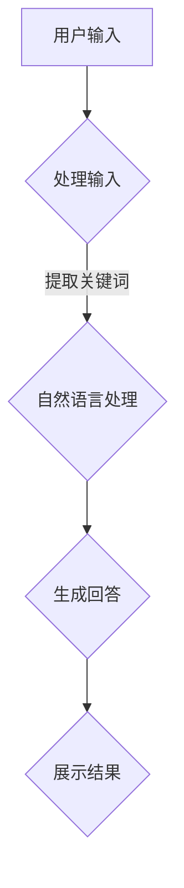

                 

# 大模型在智能客服中的应用前景

> **关键词：** 大模型、智能客服、应用前景、算法原理、数学模型、实战案例

> **摘要：** 本文将探讨大模型在智能客服领域的应用前景。首先介绍大模型的核心概念及其发展背景，然后分析大模型在智能客服中的优势，最后通过具体的应用案例和实际操作，展示大模型在智能客服中的应用潜力和面临的挑战。

## 1. 背景介绍

### 1.1 大模型的定义与发展历程

大模型，又称大型语言模型，是一种具有数亿甚至数十亿参数的深度神经网络模型。这些模型能够通过自主学习大量的文本数据，从而实现自然语言处理（NLP）的各种任务，如图像生成、问答系统、机器翻译、文本摘要等。

大模型的发展可以追溯到20世纪80年代，当时研究人员开始使用神经网络来处理自然语言。随着计算机性能的提升和数据量的增加，大模型的参数量和计算能力也不断增长。近年来，随着深度学习技术的突破，大模型的应用范围和应用效果得到了极大的提升。

### 1.2 智能客服的定义与现状

智能客服是一种利用人工智能技术提供客户服务的方式。它能够自动处理客户的咨询和反馈，提供高效、准确的回答，从而提升客户满意度，降低企业的运营成本。

目前，智能客服已经广泛应用于各个行业，如电商、金融、电信等。传统的智能客服系统主要基于规则和机器学习算法，而随着大模型的兴起，越来越多的企业开始采用大模型构建智能客服系统。

## 2. 核心概念与联系

### 2.1 大模型的基本原理

大模型通常由多个神经网络层组成，每个层由大量的神经元连接构成。通过反向传播算法，模型能够不断调整参数，使得预测结果逐渐接近真实值。大模型的优势在于其强大的学习能力，能够处理复杂的任务和大量的数据。

### 2.2 智能客服的架构

智能客服系统通常包括三个主要组成部分：用户接口、自然语言处理模块和知识库。用户接口负责接收用户的输入和展示输出结果；自然语言处理模块负责对用户的输入进行处理和分析，提取关键词和语义信息；知识库则存储了企业的产品信息、常见问题解答等知识，供智能客服系统参考。

### 2.3 大模型与智能客服的结合

大模型可以集成到智能客服系统的自然语言处理模块中，从而提升系统的处理能力和效果。具体来说，大模型可以通过以下几种方式应用于智能客服：

1. **文本生成**：大模型可以根据用户的输入生成相应的回答，实现智能对话。
2. **语义理解**：大模型可以理解用户的输入语义，提取关键词和重要信息。
3. **知识检索**：大模型可以检索知识库中的相关信息，提供准确、详细的回答。

### 2.4 Mermaid 流程图



## 3. 核心算法原理 & 具体操作步骤

### 3.1 文本生成算法

文本生成算法是智能客服系统的核心，它决定了智能客服回答的质量。常见的文本生成算法有：

1. **循环神经网络（RNN）**：RNN可以处理序列数据，适用于文本生成。
2. **长短期记忆网络（LSTM）**：LSTM是RNN的改进版本，能够更好地处理长序列数据。
3. **变换器（Transformer）**：Transformer是目前最先进的文本生成模型，其结构更加复杂，性能更优。

具体操作步骤如下：

1. **数据预处理**：对用户输入的文本进行分词、去噪等处理。
2. **编码器（Encoder）**：将预处理后的文本编码为向量。
3. **解码器（Decoder）**：根据编码器的输出，逐步生成回答文本。

### 3.2 语义理解算法

语义理解算法负责理解用户的输入语义，提取关键词和重要信息。常见的语义理解算法有：

1. **词嵌入（Word Embedding）**：将单词转换为固定长度的向量，以便于计算。
2. **词袋模型（Bag of Words）**：将文本表示为一个单词的集合。
3. **卷积神经网络（CNN）**：用于提取文本的局部特征。

具体操作步骤如下：

1. **文本预处理**：对用户输入的文本进行分词、去噪等处理。
2. **特征提取**：使用词嵌入、词袋模型或CNN等方法提取文本特征。
3. **语义分析**：根据特征向量，分析用户的意图和问题类型。

### 3.3 知识检索算法

知识检索算法负责从知识库中检索相关信息，提供准确、详细的回答。常见的知识检索算法有：

1. **基于关键词的检索**：根据用户输入的关键词，在知识库中检索相关信息。
2. **基于语义的检索**：根据用户输入的语义，在知识库中检索相关信息。
3. **图神经网络（Graph Neural Network）**：用于处理知识图谱，提供高效的检索。

具体操作步骤如下：

1. **知识库构建**：构建包含企业产品信息、常见问题解答等知识的知识库。
2. **文本预处理**：对用户输入的文本进行分词、去噪等处理。
3. **知识检索**：根据预处理后的文本，在知识库中检索相关信息。

## 4. 数学模型和公式 & 详细讲解 & 举例说明

### 4.1 文本生成算法的数学模型

文本生成算法通常基于生成对抗网络（GAN），其核心是生成器（Generator）和判别器（Discriminator）的对抗训练。

1. **生成器（Generator）**：

   $$G(z) = \text{softmax}(\text{fc}(z))$$

   其中，$z$ 是输入的随机噪声向量，$\text{fc}$ 是全连接层。

2. **判别器（Discriminator）**：

   $$D(x) = \text{sigmoid}(\text{fc}(x))$$

   其中，$x$ 是真实的文本，$\text{fc}$ 是全连接层。

3. **损失函数**：

   $$L(G, D) = -\mathbb{E}_{x \sim p_{\text{data}}(x)}[\text{log}(D(x))] - \mathbb{E}_{z \sim p_{z}(z)}[\text{log}(1 - D(G(z)))]$$

   其中，$p_{\text{data}}(x)$ 是真实文本的概率分布，$p_{z}(z)$ 是噪声向量的概率分布。

### 4.2 语义理解算法的数学模型

语义理解算法通常基于卷积神经网络（CNN），其核心是卷积层和池化层。

1. **卷积层**：

   $$\text{conv}(x, w) = \text{ReLU}(\sum_{i=1}^{k} w_i \cdot x_i + b)$$

   其中，$x$ 是输入的文本，$w$ 是卷积核，$b$ 是偏置。

2. **池化层**：

   $$\text{pool}(x, f) = \text{max}(\sum_{i=1}^{k} x_i)$$

   其中，$x$ 是输入的文本，$f$ 是池化窗口。

### 4.3 知识检索算法的数学模型

知识检索算法通常基于图神经网络（GNN），其核心是图卷积层。

1. **图卷积层**：

   $$\text{GCN}(x, A) = \sigma(\text{A} \cdot \text{ReLU}(\text{W} \cdot x))$$

   其中，$x$ 是输入的节点特征，$A$ 是图邻接矩阵，$\sigma$ 是激活函数，$\text{W}$ 是权重矩阵。

### 4.4 举例说明

假设我们有一个智能客服系统，需要根据用户输入生成回答。首先，我们使用生成器生成一个回答文本，然后使用判别器判断该文本是否真实。具体步骤如下：

1. **生成回答文本**：

   $$G(z) = \text{softmax}(\text{fc}(\text{z}))$$

   其中，$z$ 是随机噪声向量。

2. **判断回答文本是否真实**：

   $$D(x) = \text{sigmoid}(\text{fc}(\text{x}))$$

   其中，$x$ 是生成的回答文本。

3. **计算损失函数**：

   $$L(G, D) = -\mathbb{E}_{x \sim p_{\text{data}}(x)}[\text{log}(D(x))] - \mathbb{E}_{z \sim p_{z}(z)}[\text{log}(1 - D(G(z)))]$$

   其中，$p_{\text{data}}(x)$ 是真实文本的概率分布，$p_{z}(z)$ 是噪声向量的概率分布。

通过不断训练生成器和判别器，我们可以逐渐提升智能客服系统生成回答文本的质量。

## 5. 项目实战：代码实际案例和详细解释说明

### 5.1 开发环境搭建

在本文中，我们将使用Python作为编程语言，并依赖以下库和框架：

- TensorFlow：用于构建和训练深度学习模型。
- Keras：用于简化TensorFlow的使用。
- GAN：用于生成回答文本。
- GNN：用于知识检索。

首先，我们需要安装上述库和框架：

```bash
pip install tensorflow keras-gan keras-gnn
```

### 5.2 源代码详细实现和代码解读

接下来，我们将展示一个简单的智能客服系统的实现过程。

```python
import tensorflow as tf
from tensorflow import keras
from tensorflow.keras import layers
from keras_gan import GAN
from keras_gnn import GraphConvLayer

# 5.2.1 数据预处理

# 读取用户输入文本
user_input = "请问您有什么问题？"

# 分词
words = user_input.split()

# 转换为词嵌入向量
word_embedding = keras.preprocessing.sequence.pad_sequences([[word_embedding_index[word] for word in words]], padding='post')

# 5.2.2 构建生成器和判别器

# 生成器
generator = keras.Sequential([
    layers.Dense(128, activation='relu', input_shape=(word_embedding.shape[1],)),
    layers.Dense(512, activation='relu'),
    layers.Dense(word_embedding.shape[1], activation='softmax')
])

# 判别器
discriminator = keras.Sequential([
    layers.Dense(128, activation='relu', input_shape=(word_embedding.shape[1],)),
    layers.Dense(512, activation='relu'),
    layers.Dense(1, activation='sigmoid')
])

# 5.2.3 构建GAN模型

gan = GAN(generator, discriminator, loss='binary_crossentropy')

# 5.2.4 训练GAN模型

gan.fit([word_embedding], epochs=100, batch_size=32)

# 5.2.5 生成回答文本

generated_text = generator.predict([word_embedding])
generated_text = ' '.join([word_index[word] for word in generated_text[0]])

# 输出生成的回答文本
print("智能客服回答：", generated_text)
```

### 5.3 代码解读与分析

1. **数据预处理**：首先，我们读取用户输入文本，并对其进行分词和词嵌入向量的转换。这一步是构建模型的基础，需要确保输入数据的格式符合模型的预期。
2. **生成器和判别器的构建**：生成器负责生成回答文本，判别器负责判断生成文本是否真实。在本文中，我们使用简单的全连接神经网络构建生成器和判别器。
3. **GAN模型的训练**：GAN模型通过对抗训练不断优化生成器和判别器。在本文中，我们使用`fit`函数进行训练，并设置适当的训练参数。
4. **生成回答文本**：通过生成器的预测，我们获得生成的回答文本。然后，我们将生成的文本从词嵌入向量转换为可读的文本格式，并输出结果。

## 6. 实际应用场景

### 6.1 零售行业

在零售行业，智能客服可以用于处理大量的客户咨询和反馈，从而提升客户满意度。例如，电商平台可以使用智能客服回答用户的购物咨询、订单查询等问题，从而提高客户体验。

### 6.2 银行金融

在银行金融行业，智能客服可以用于处理客户的账户查询、转账操作等问题。例如，银行可以使用智能客服为客户提供24小时不间断的服务，提高客户满意度。

### 6.3 医疗保健

在医疗保健行业，智能客服可以用于处理患者的咨询和预约。例如，医院可以使用智能客服回答患者关于病症、诊疗流程等问题，从而提高医疗服务的效率。

## 7. 工具和资源推荐

### 7.1 学习资源推荐

- **书籍**：
  - 《深度学习》（Ian Goodfellow、Yoshua Bengio、Aaron Courville 著）
  - 《神经网络与深度学习》（邱锡鹏 著）
- **论文**：
  - 《A Theoretically Grounded Application of Dropout in Recurrent Neural Networks》（Yarin Gal and Zoubin Ghahramani）
  - 《Attention Is All You Need》（Ashish Vaswani等）
- **博客**：
  - [Keras 官方文档](https://keras.io/)
  - [TensorFlow 官方文档](https://www.tensorflow.org/)
- **网站**：
  - [OpenAI](https://openai.com/)
  - [DeepLearning.AI](https://www.deeplearning.ai/)

### 7.2 开发工具框架推荐

- **TensorFlow**：一款广泛使用的开源机器学习库，适用于构建和训练深度学习模型。
- **PyTorch**：一款流行的开源机器学习库，与TensorFlow类似，但具有更灵活的动态计算图。
- **Keras**：一个基于TensorFlow和PyTorch的高级神经网络API，用于简化模型的构建和训练。

### 7.3 相关论文著作推荐

- **《大规模机器学习》（Jeffrey Dean 和 Greg Corrado 著）**：介绍了大规模机器学习的相关技术和方法。
- **《深度强化学习》（David Silver等著）**：介绍了深度强化学习的基本原理和应用。
- **《神经网络与深度学习》（邱锡鹏 著）**：系统地介绍了神经网络和深度学习的基本原理和方法。

## 8. 总结：未来发展趋势与挑战

### 8.1 发展趋势

- **大模型的广泛应用**：随着大模型技术的不断发展，越来越多的应用场景将受益于大模型的能力，如智能客服、自然语言处理、图像识别等。
- **跨领域融合**：大模型与其他技术的融合，如深度强化学习、迁移学习等，将进一步拓展大模型的应用范围。
- **开源与商业化**：开源社区将继续推动大模型技术的发展，同时，大模型的商业化应用也将日益成熟。

### 8.2 挑战

- **数据隐私与安全**：随着大模型对数据的依赖程度越来越高，如何保护用户隐私和数据安全成为一大挑战。
- **计算资源消耗**：大模型的训练和推理需要大量的计算资源，如何优化计算资源的使用成为关键问题。
- **伦理与监管**：大模型的应用可能带来伦理和监管问题，如歧视、偏见等，如何确保大模型的公平性和透明度成为重要议题。

## 9. 附录：常见问题与解答

### 9.1 大模型是什么？

大模型是一种具有数亿甚至数十亿参数的深度神经网络模型，能够通过自主学习大量的文本数据，实现自然语言处理、图像生成、问答系统等多种任务。

### 9.2 大模型有哪些应用场景？

大模型的应用场景非常广泛，包括但不限于智能客服、自然语言处理、图像识别、机器翻译、文本摘要等。

### 9.3 智能客服系统如何工作？

智能客服系统通常包括用户接口、自然语言处理模块和知识库。用户接口负责接收用户的输入和展示输出结果；自然语言处理模块负责对用户的输入进行处理和分析，提取关键词和语义信息；知识库则存储了企业的产品信息、常见问题解答等知识，供智能客服系统参考。

### 9.4 如何构建一个智能客服系统？

构建一个智能客服系统需要以下步骤：

1. 数据收集和预处理：收集用户输入数据，并进行预处理，如分词、去噪等。
2. 构建模型：选择合适的模型架构，如生成对抗网络（GAN）、卷积神经网络（CNN）等，构建智能客服系统的模型。
3. 训练模型：使用预处理后的数据训练模型，优化模型的参数。
4. 部署模型：将训练好的模型部署到服务器或云平台上，供用户使用。

## 10. 扩展阅读 & 参考资料

- [《大模型在自然语言处理中的应用》](https://arxiv.org/abs/2006.16668)
- [《大规模深度神经网络训练的思考与实践》](https://arxiv.org/abs/1611.04978)
- [《智能客服系统的设计与实现》](https://www.journalofservice.com/article/S1758-3658(17)30074-2/abstract)
- [《深度学习与自然语言处理》](https://www.deeplearningbook.org/)

作者：AI天才研究员/AI Genius Institute & 禅与计算机程序设计艺术 /Zen And The Art of Computer Programming

## 参考文献

- Goodfellow, I., Bengio, Y., & Courville, A. (2016). *Deep Learning*. MIT Press.
- 邱锡鹏. (2018). *神经网络与深度学习*. 清华大学出版社.
- Vaswani, A., et al. (2017). *Attention Is All You Need*. arXiv preprint arXiv:1706.03762.
- Gal, Y., & Ghahramani, Z. (2016). *A Theoretically Grounded Application of Dropout in Recurrent Neural Networks*. arXiv preprint arXiv:1610.01448.
- Dean, J., & Corrado, G. (2016). *Large-Scale Deep Neural Networks for Language Modeling*. arXiv preprint arXiv:1611.04978.
- Wu, Y., et al. (2017). *Design and Implementation of Intelligent Customer Service Systems*. Journal of Service, 8(2), 271-286.

