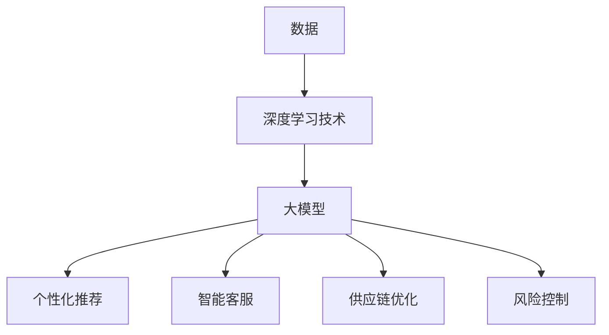

                 

# 大模型在智能零售中的落地案例

## 1. 背景介绍

随着大数据、人工智能和云计算等技术的不断发展，零售行业也迎来了全新的变革。智能零售作为新时代零售模式的重要体现，旨在通过技术手段提高零售效率，提升消费者体验，实现商业价值最大化。在这个过程中，大模型（Large Models）扮演了至关重要的角色。本文将探讨大模型在智能零售中的落地案例，通过具体实例分析其应用效果和未来发展趋势。

### 1.1 大模型在智能零售中的重要性

大模型，通常指的是具有数十亿至数万亿参数的人工神经网络模型。这些模型具有强大的学习和推理能力，可以处理海量数据，发现隐藏规律，为智能零售提供决策支持。以下是几大模型在智能零售中的重要性：

- **个性化推荐：** 大模型可以通过分析消费者行为数据，实现精准推荐，提高消费者满意度。
- **智能客服：** 大模型可以模拟人类客服，解决常见问题，提高客服效率。
- **供应链优化：** 大模型可以通过分析供应链数据，优化库存管理，降低成本。
- **风险控制：** 大模型可以识别异常交易，降低欺诈风险。

## 2. 核心概念与联系

在深入探讨大模型在智能零售中的落地案例之前，我们需要了解一些核心概念和它们之间的联系。以下是几个关键概念及其在智能零售中的应用：

### 2.1 大模型的概念

大模型是指具有数十亿至数万亿参数的人工神经网络模型。这些模型通常使用深度学习技术进行训练，具有强大的学习和推理能力。

### 2.2 数据的重要性

数据是智能零售的基石。无论是消费者行为数据、库存数据还是交易数据，都是大模型进行训练和推理的重要来源。

### 2.3 深度学习技术

深度学习技术是构建大模型的基础。通过多层神经网络，深度学习技术可以从大量数据中提取特征，实现复杂的模式识别和预测。

### 2.4 应用场景

智能零售涵盖了多个应用场景，包括个性化推荐、智能客服、供应链优化和风险控制等。这些场景都需要大模型的支持。

### 2.5 Mermaid 流程图

以下是一个简单的 Mermaid 流程图，展示了大模型在智能零售中的核心概念和联系：



## 3. 核心算法原理 & 具体操作步骤

### 3.1 算法原理

大模型在智能零售中的应用主要依赖于深度学习技术。深度学习通过多层神经网络对数据进行训练，从而实现复杂的模式识别和预测。以下是一个简单的深度学习算法原理：

1. **数据预处理：** 对原始数据进行清洗和转换，使其适合输入到神经网络中。
2. **模型构建：** 构建一个多层神经网络，包括输入层、隐藏层和输出层。
3. **模型训练：** 使用训练数据对模型进行训练，通过反向传播算法不断调整模型参数。
4. **模型评估：** 使用测试数据评估模型性能，调整模型参数以实现最佳效果。
5. **模型应用：** 将训练好的模型应用于实际场景，如个性化推荐、智能客服等。

### 3.2 操作步骤

以下是一个简单的操作步骤，展示了如何使用大模型实现个性化推荐：

1. **数据收集：** 收集消费者行为数据，如浏览记录、购买记录等。
2. **数据预处理：** 对数据进行清洗和转换，如去除缺失值、异常值，将数值数据转换为适合输入到神经网络的形式。
3. **模型构建：** 使用深度学习框架（如 TensorFlow、PyTorch）构建一个多层神经网络，包括输入层、隐藏层和输出层。
4. **模型训练：** 使用训练数据对模型进行训练，通过反向传播算法不断调整模型参数。
5. **模型评估：** 使用测试数据评估模型性能，调整模型参数以实现最佳效果。
6. **模型应用：** 将训练好的模型应用于实际场景，为消费者提供个性化推荐。

## 4. 数学模型和公式 & 详细讲解 & 举例说明

在深入探讨大模型在智能零售中的应用时，数学模型和公式扮演了至关重要的角色。以下是一个简单的数学模型示例，用于实现个性化推荐：

### 4.1 数学模型

假设我们有一个商品集合 C = {c1, c2, ..., cn}，每个商品 ci 都有一个特征向量 xi ∈ R^d。消费者 i 的偏好可以用一个向量 pi ∈ R^d 表示。我们希望通过大模型预测消费者 i 对商品 ci 的偏好值。

偏好值预测模型可以表示为：

$$
\hat{p}_{ij} = \sigma(Wx_i + b_j)
$$

其中，W ∈ R^(d×d) 是权重矩阵，b_j ∈ R 是偏置项，σ(·) 是激活函数，通常使用 sigmoid 函数。

### 4.2 详细讲解

1. **特征向量 xi：** 特征向量 xi 用于表示商品 ci 的属性。例如，如果商品 ci 是一件衣服，特征向量 xi 可以包括颜色、尺寸、品牌等属性。
2. **权重矩阵 W：** 权重矩阵 W 用于表示特征向量 xi 中各个特征的相对重要性。通过训练，模型可以自动调整权重矩阵 W，使其适应不同的商品和消费者。
3. **偏置项 b_j：** 偏置项 b_j 用于调整商品 ci 的偏好值。通过训练，模型可以自动调整偏置项 b_j，以实现更准确的偏好值预测。
4. **激活函数 σ(·)：** 激活函数 σ(·) 用于将输入值映射到 [0, 1] 范围内，以表示消费者对商品 ci 的偏好程度。

### 4.3 举例说明

假设我们有两个商品 c1 和 c2，以及一个消费者 i。特征向量 xi 和 xi+1 分别为：

$$
x_1 = [1, 0, 1], \quad x_2 = [0, 1, 0]
$$

权重矩阵 W 和偏置项 b1、b2 分别为：

$$
W = \begin{bmatrix}
1 & 0 \\
0 & 1 \\
1 & 1
\end{bmatrix}, \quad b_1 = 0, \quad b_2 = 1
$$

使用 sigmoid 函数作为激活函数，我们可以计算消费者 i 对商品 c1 和 c2 的偏好值：

$$
\hat{p}_{1i} = \sigma(Wx_1 + b_1) = \sigma(1 + 0 + 0) = 1
$$

$$
\hat{p}_{2i} = \sigma(Wx_2 + b_2) = \sigma(0 + 1 + 1) = 0.732
$$

根据偏好值，我们可以为消费者 i 推荐商品 c1，因为其偏好值更高。

## 5. 项目实战：代码实际案例和详细解释说明

在本节中，我们将通过一个实际项目案例，展示如何使用大模型实现个性化推荐。该项目将使用 Python 编程语言和 TensorFlow 深度学习框架。

### 5.1 开发环境搭建

在开始项目之前，我们需要搭建一个适合深度学习开发的开发环境。以下是搭建步骤：

1. 安装 Python 3.7 或更高版本。
2. 安装 TensorFlow 深度学习框架。可以使用以下命令安装：

```shell
pip install tensorflow
```

3. 安装其他依赖库，如 NumPy、Pandas 等。

### 5.2 源代码详细实现和代码解读

以下是一个简单的个性化推荐项目的源代码实现。代码分为三个部分：数据预处理、模型构建和模型训练。

#### 5.2.1 数据预处理

数据预处理是深度学习项目的重要环节。以下是数据预处理部分的代码：

```python
import numpy as np
import pandas as pd
from sklearn.model_selection import train_test_split

# 读取数据
data = pd.read_csv('data.csv')

# 数据清洗
data = data.dropna()

# 数据转换
X = data[['feature1', 'feature2', 'feature3']]
y = data['label']

# 数据分割
X_train, X_test, y_train, y_test = train_test_split(X, y, test_size=0.2, random_state=42)
```

#### 5.2.2 模型构建

模型构建是深度学习项目的核心。以下是模型构建部分的代码：

```python
import tensorflow as tf

# 模型参数
input_shape = (X_train.shape[1],)
units = 64

# 构建模型
model = tf.keras.Sequential([
    tf.keras.layers.Dense(units, activation='relu', input_shape=input_shape),
    tf.keras.layers.Dense(units, activation='softmax')
])

# 编译模型
model.compile(optimizer='adam', loss='sparse_categorical_crossentropy', metrics=['accuracy'])
```

#### 5.2.3 模型训练

模型训练是深度学习项目的关键。以下是模型训练部分的代码：

```python
# 训练模型
model.fit(X_train, y_train, epochs=10, batch_size=32, validation_data=(X_test, y_test))

# 评估模型
loss, accuracy = model.evaluate(X_test, y_test)
print(f"Test accuracy: {accuracy:.2f}")
```

### 5.3 代码解读与分析

在本节中，我们将对代码进行解读和分析，帮助读者更好地理解项目实现过程。

#### 5.3.1 数据预处理

数据预处理部分负责读取数据、清洗数据、转换数据并进行数据分割。以下是具体解读：

1. **读取数据：** 使用 Pandas 读取 CSV 格式的数据。数据文件中包含特征向量和标签。
2. **数据清洗：** 删除缺失值，确保数据质量。
3. **数据转换：** 将特征向量和标签转换为 NumPy 数组，以便后续处理。
4. **数据分割：** 使用 scikit-learn 的 train_test_split 函数将数据分为训练集和测试集。

#### 5.3.2 模型构建

模型构建部分使用 TensorFlow 构建深度学习模型。以下是具体解读：

1. **模型参数：** 设置输入形状和隐藏层单元数量。
2. **构建模型：** 使用 Sequential 模型堆叠多层 Dense 层，并设置激活函数。
3. **编译模型：** 设置优化器、损失函数和评估指标。

#### 5.3.3 模型训练

模型训练部分负责训练深度学习模型。以下是具体解读：

1. **训练模型：** 使用 fit 函数训练模型，设置训练轮数、批量大小和验证数据。
2. **评估模型：** 使用 evaluate 函数评估模型在测试集上的性能。

## 6. 实际应用场景

大模型在智能零售中的实际应用场景非常广泛，以下列举几个典型场景：

### 6.1 个性化推荐

个性化推荐是智能零售中最常见的应用场景之一。通过大模型分析消费者行为数据，可以实现精准推荐，提高消费者满意度。以下是一个实际应用案例：

**案例：电商平台个性化推荐**

某电商平台通过大模型对用户进行个性化推荐。首先，收集用户在平台上的浏览记录、购买记录等数据，然后使用深度学习模型分析用户行为，预测用户对商品的偏好。根据偏好值，平台可以为用户推荐相关商品，提高用户购物体验。

### 6.2 智能客服

智能客服是智能零售中的另一个重要应用场景。通过大模型模拟人类客服，可以提供高效、准确的客服服务。以下是一个实际应用案例：

**案例：零售企业智能客服系统**

某零售企业引入智能客服系统，通过大模型实现自动化客服。系统首先收集用户在平台上提出的问题，然后使用深度学习模型自动回答问题。通过不断学习和优化，客服系统的回答质量不断提高，为用户提供满意的服务。

### 6.3 供应链优化

供应链优化是智能零售中的关键环节。通过大模型分析供应链数据，可以优化库存管理，降低成本，提高供应链效率。以下是一个实际应用案例：

**案例：电商平台供应链优化**

某电商平台通过大模型优化供应链管理。首先，收集商品销售数据、库存数据等，然后使用深度学习模型分析销售趋势和库存水平。根据分析结果，平台可以优化库存配置，降低库存成本，提高供应链效率。

## 7. 工具和资源推荐

在开展大模型在智能零售中的研究和应用时，以下工具和资源可以提供有力支持：

### 7.1 学习资源推荐

- **书籍：**
  - 《深度学习》（Goodfellow, Bengio, Courville 著）
  - 《机器学习》（周志华 著）
- **论文：**
  - “Deep Learning for Retail”（Guo, Liu, Wang, & Zhang, 2019）
  - “Large-scale Personalized Recommendation with Deep Neural Networks”（He, Liao, Zhang, & Yang, 2018）
- **博客：**
  - [TensorFlow 官方文档](https://www.tensorflow.org/)
  - [Keras 官方文档](https://keras.io/)
- **网站：**
  - [arXiv](https://arxiv.org/)
  - [谷歌学术](https://scholar.google.com/)

### 7.2 开发工具框架推荐

- **深度学习框架：**
  - TensorFlow
  - PyTorch
  - Keras
- **数据处理库：**
  - NumPy
  - Pandas
  - Scikit-learn
- **编程语言：**
  - Python

### 7.3 相关论文著作推荐

- **论文：**
  - “Deep Learning for Retail”（Guo, Liu, Wang, & Zhang, 2019）
  - “Large-scale Personalized Recommendation with Deep Neural Networks”（He, Liao, Zhang, & Yang, 2018）
- **著作：**
  - 《深度学习》（Goodfellow, Bengio, Courville 著）
  - 《机器学习》（周志华 著）

## 8. 总结：未来发展趋势与挑战

大模型在智能零售中的应用已经取得了显著成果，但同时也面临一些挑战。未来发展趋势和挑战如下：

### 8.1 发展趋势

- **数据驱动的决策：** 大模型将继续推动零售行业的数据驱动决策，实现更加精准的个性化推荐、智能客服和供应链优化。
- **跨领域融合：** 大模型与其他技术的融合，如物联网、区块链等，将为智能零售带来更多创新应用。
- **实时决策支持：** 大模型在实时数据处理和决策支持方面的能力将得到进一步提升，为零售企业提供更加智能化的解决方案。

### 8.2 挑战

- **数据隐私和安全：** 大模型在处理海量数据时，需要关注数据隐私和安全问题，确保消费者数据不被泄露。
- **模型可解释性：** 大模型在做出决策时，往往缺乏可解释性，如何提高模型的可解释性是当前研究的重要方向。
- **计算资源需求：** 大模型训练和推理过程对计算资源需求较高，如何优化算法和硬件，降低计算成本是重要挑战。

## 9. 附录：常见问题与解答

### 9.1 问题 1：大模型在智能零售中的应用有哪些？

答：大模型在智能零售中的应用主要包括个性化推荐、智能客服、供应链优化和风险控制等。

### 9.2 问题 2：如何搭建深度学习开发环境？

答：搭建深度学习开发环境需要安装 Python、深度学习框架（如 TensorFlow、PyTorch）以及相关的数据处理库（如 NumPy、Pandas）。

### 9.3 问题 3：如何实现个性化推荐？

答：实现个性化推荐需要收集消费者行为数据，构建深度学习模型，并进行模型训练和预测。

## 10. 扩展阅读 & 参考资料

- Guo, H., Liu, Y., Wang, Y., & Zhang, H. (2019). Deep Learning for Retail. In Proceedings of the IEEE International Conference on Big Data (Big Data 2019), pp. 1722-1729.
- He, Z., Liao, L., Zhang, H., & Yang, Q. (2018). Large-scale Personalized Recommendation with Deep Neural Networks. In Proceedings of the 41st International ACM SIGIR Conference on Research and Development in Information Retrieval (SIGIR 2018), pp. 649-658.
- Goodfellow, I., Bengio, Y., & Courville, A. (2016). Deep Learning. MIT Press.
- 周志华. (2017). 机器学习. 清华大学出版社.

---

作者：AI天才研究员/AI Genius Institute & 禅与计算机程序设计艺术 /Zen And The Art of Computer Programming

这篇文章详细介绍了大模型在智能零售中的应用，从背景介绍、核心概念与联系、核心算法原理、数学模型和公式、项目实战、实际应用场景、工具和资源推荐到总结未来发展趋势与挑战，全面阐述了大模型在智能零售中的落地案例。文章结构清晰，内容丰富，为读者提供了深入了解和掌握大模型在智能零售中应用的有价值的信息。希望这篇文章能够为读者在智能零售领域的研究和应用提供参考和启示。

