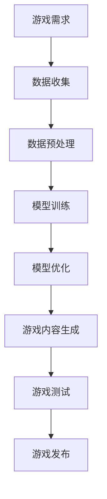

                 

### 背景介绍

#### 游戏产业的迅速发展与挑战

游戏产业作为数字娱乐领域的重要分支，近年来取得了令人瞩目的增长。根据市场研究公司Newzoo的数据，2021年全球游戏市场的收入已经达到了1500亿美元，并且预计在未来几年内仍将保持稳定的增长态势。这一增长不仅体现在收入层面，还体现在游戏用户数量的不断攀升。截至2021年底，全球游戏玩家的数量已经超过了20亿，其中移动游戏用户占据了半壁江山。

随着游戏产业的快速发展，开发高质量游戏的需求也日益增加。然而，这背后也隐藏着一系列挑战。首先，游戏开发周期长、成本高。一个大型游戏项目通常需要数年时间来完成，涉及多个团队的合作。此外，游戏开发过程中涉及的技术领域广泛，从图形渲染到物理引擎，从音效设计到人工智能，每一个环节都需要投入大量的时间和精力。其次，市场竞争激烈。游戏市场的快速变化使得开发者必须时刻保持创新，以吸引和留住玩家。最后，用户需求的多样化使得游戏开发者在设计游戏时需要更加注重个性化定制和用户体验。

#### 大模型在人工智能领域的崛起

与此同时，人工智能（AI）领域的迅速发展，特别是大模型的崛起，为游戏开发带来了新的机遇。大模型是指具有数亿甚至千亿参数的深度学习模型，如GPT-3、BERT、ViT等。这些模型具有强大的表示能力和计算能力，能够在各种任务中表现出色，包括自然语言处理、计算机视觉、音频处理等。

大模型在游戏开发中的应用主要体现在以下几个方面：

1. **智能NPC（非玩家角色）**：大模型可以用于生成智能NPC，使其能够与玩家进行更自然的互动。例如，通过使用自然语言处理模型，NPC可以理解和回应玩家的提问，甚至能够模拟真实的人类行为和情感。

2. **游戏内容生成**：大模型可以自动生成游戏关卡、故事情节和对话，从而减少开发者的工作量，提高游戏内容的多样性和创新性。

3. **图像和音效生成**：大模型在计算机视觉和音频处理领域的应用，可以用于生成高质量的图像和音效，提高游戏的整体视觉效果。

4. **游戏玩法优化**：大模型可以分析玩家的行为和反馈，从而优化游戏的难度、平衡性等关键指标，提高玩家的游戏体验。

5. **虚拟现实（VR）和增强现实（AR）**：大模型在VR和AR中的应用，可以生成更真实的虚拟环境和交互方式，提升玩家的沉浸感。

#### 文章结构概述

本文将首先介绍大模型的基本概念和其在游戏开发中的应用场景，然后深入探讨大模型在游戏开发中的具体实现方法，包括算法原理、数学模型和具体操作步骤。接着，我们将通过一个实际项目案例，展示如何使用大模型进行游戏开发，并提供详细的代码实现和解读。最后，本文将讨论大模型在游戏开发中的实际应用场景，推荐相关的学习资源和开发工具，并对未来发展趋势和挑战进行展望。

---

## 2. 核心概念与联系

### 大模型的定义

大模型，通常指的是具有数亿甚至千亿参数的深度学习模型。这些模型通过大规模的数据训练，具有强大的特征表示和推理能力。在游戏开发领域，大模型的应用主要体现在以下几个方面：

1. **自然语言处理（NLP）**：大模型可以用于生成智能NPC的对话，使其能够理解并回应玩家的自然语言提问。
2. **计算机视觉（CV）**：大模型可以用于图像识别和生成，生成高质量的游戏场景和角色图像。
3. **音频处理**：大模型可以用于生成和识别游戏中的音频效果，如角色对话、背景音乐和环境音效。
4. **游戏玩法优化**：大模型可以分析玩家的行为数据，用于优化游戏的难度、平衡性和用户体验。

### 大模型在游戏开发中的应用场景

1. **智能NPC**：大模型可以生成具有高度智能化的NPC，使其能够模拟真实的人类行为和情感，与玩家进行更自然的互动。
2. **游戏内容生成**：大模型可以自动生成游戏关卡、故事情节和对话，提高游戏内容的多样性和创新性。
3. **图像和音效生成**：大模型可以用于生成高质量的游戏图像和音效，提升游戏的整体视觉效果和听觉体验。
4. **游戏玩法优化**：大模型可以分析玩家行为数据，用于调整游戏难度、平衡性和用户体验，使游戏更加吸引人。
5. **虚拟现实（VR）和增强现实（AR）**：大模型可以生成更真实的虚拟环境和交互方式，提升玩家的沉浸感。

### 大模型与游戏开发的关系

大模型在游戏开发中的应用，不仅可以大幅度提高游戏的质量和用户体验，还可以大大减少开发者的工作量。通过大模型的强大计算能力和智能算法，开发者可以更加专注于游戏的核心玩法和创意设计，而将一些繁琐的工作交给大模型完成。

下面是一个使用Mermaid流程图（不含特殊字符如括号、逗号）来展示大模型在游戏开发中主要环节的流程：



在这个流程图中，从游戏需求到游戏发布，大模型的应用贯穿始终。通过数据收集、预处理、模型训练和优化，大模型可以生成高质量的游戏内容，并通过游戏测试最终实现游戏的发布。

---

通过以上内容，我们初步了解了大模型的基本概念、应用场景以及在游戏开发中的重要性。接下来，我们将深入探讨大模型在游戏开发中的具体算法原理和操作步骤。

---

## 3. 核心算法原理 & 具体操作步骤

### 大模型的算法原理

大模型的核心在于其深度学习算法，尤其是基于神经网络的结构。深度学习是一种通过模拟人脑神经元之间的连接和互动来进行学习的技术。大模型通过多层次的神经网络结构，对输入数据进行处理和特征提取，从而实现复杂的任务。

#### 主要组成部分

1. **输入层**：接收游戏的相关数据，如玩家行为、游戏场景等。
2. **隐藏层**：对输入数据进行处理和特征提取，逐渐提取更高层次的特征。
3. **输出层**：根据训练目标生成相应的输出结果，如游戏内容、NPC对话等。

#### 常见的大模型算法

1. **生成对抗网络（GAN）**：通过生成器和判别器的对抗训练，生成高质量的数据。
2. **变分自编码器（VAE）**：通过编码器和解码器的联合训练，生成具有高度保真度的数据。
3. **递归神经网络（RNN）**：特别适合处理序列数据，如游戏中的故事情节。

### 大模型在游戏开发中的具体操作步骤

#### 1. 数据收集与预处理

首先，我们需要收集与游戏相关的数据，如玩家行为数据、游戏场景图像、音频等。这些数据将被用于训练大模型。数据收集完成后，需要对数据进行预处理，包括数据清洗、数据增强和数据归一化等步骤。

#### 2. 模型训练

接下来，我们选择合适的大模型算法，开始对数据进行训练。在训练过程中，模型会通过不断的迭代更新参数，以达到最佳性能。常用的训练方法包括：

- **监督学习**：有标签的数据进行训练，模型可以直接学习输出结果。
- **无监督学习**：无标签的数据进行训练，模型需要从数据中提取特征。

#### 3. 模型优化

在模型训练完成后，我们需要对模型进行优化，以提高其性能和泛化能力。常用的优化方法包括：

- **迁移学习**：利用预训练的模型进行微调，快速适应特定任务。
- **模型融合**：结合多个模型的预测结果，提高预测的准确性。
- **超参数调优**：通过调整模型的超参数，如学习率、批量大小等，以找到最佳配置。

#### 4. 模型部署与应用

最后，我们将训练好的模型部署到游戏中，并进行实际应用。例如，使用大模型生成游戏场景、NPC对话等。在应用过程中，我们需要对模型进行实时监测和调整，以确保其稳定性和性能。

### 具体操作步骤示例

以下是一个简化的大模型在游戏开发中的操作步骤示例：

1. **数据收集**：收集游戏场景图像、玩家行为数据等。
2. **数据预处理**：对数据进行清洗、增强和归一化。
3. **模型选择**：选择合适的模型算法，如GAN或VAE。
4. **模型训练**：使用收集的数据对模型进行训练。
5. **模型优化**：通过迁移学习和超参数调优，优化模型性能。
6. **模型部署**：将训练好的模型部署到游戏中，生成游戏场景和NPC对话。
7. **应用测试**：对模型的应用效果进行测试和调整。

通过以上步骤，我们可以将大模型应用于游戏开发中，提高游戏的质量和用户体验。

---

在本章节中，我们详细介绍了大模型在游戏开发中的核心算法原理和具体操作步骤。接下来，我们将通过数学模型和公式，进一步深入探讨大模型在游戏开发中的应用。

---

## 4. 数学模型和公式 & 详细讲解 & 举例说明

### 大模型的数学基础

大模型的核心在于其深度学习算法，这些算法基于复杂的数学模型。以下是一些常见的大模型所依赖的数学基础：

#### 1. 神经元激活函数

神经元激活函数是神经网络的核心组成部分，它决定了神经元的输出。常用的激活函数包括：

- **Sigmoid函数**：$f(x) = \frac{1}{1 + e^{-x}}$
- **ReLU函数**：$f(x) = max(0, x)$
- **Tanh函数**：$f(x) = \frac{e^x - e^{-x}}{e^x + e^{-x}}$

这些函数具有非线性特性，能够将输入数据映射到输出空间。

#### 2. 前向传播和反向传播

深度学习算法中的前向传播和反向传播是训练神经网络的两个关键步骤。

- **前向传播**：输入数据通过神经网络的各个层，逐层计算输出。公式如下：

  $$\text{激活值} = \text{激活函数}(\text{权重} \cdot \text{输入} + \text{偏置})$$

- **反向传播**：通过计算输出误差，反向更新网络中的权重和偏置。误差的计算通常使用梯度下降法，公式如下：

  $$\text{权重更新} = \text{学习率} \cdot \text{梯度}$$

  $$\text{偏置更新} = \text{学习率} \cdot \text{梯度}$$

#### 3. 损失函数

损失函数用于衡量模型的预测结果与真实结果之间的差距。常见的损失函数包括：

- **均方误差（MSE）**：$MSE = \frac{1}{n}\sum_{i=1}^{n} (\text{预测值} - \text{真实值})^2$
- **交叉熵损失（Cross-Entropy Loss）**：$H(y, \hat{y}) = -\sum_{i=1}^{n} y_i \log(\hat{y}_i)$

### 大模型在游戏开发中的应用示例

#### 1. 使用GAN生成游戏场景

生成对抗网络（GAN）是一种用于生成高质量数据的算法。以下是一个简单的GAN模型在游戏场景生成中的应用示例：

- **生成器（Generator）**：将随机噪声输入转化为游戏场景图像。
- **判别器（Discriminator）**：判断输入图像是真实场景还是生成场景。

**损失函数**：

$$\text{总损失} = \text{判别器损失} + \text{生成器损失}$$

- **判别器损失**：使用交叉熵损失函数。
- **生成器损失**：使用均方误差损失函数。

**模型训练**：

- 初始化生成器和判别器的权重。
- 对生成器进行训练，使其生成的场景图像越来越真实。
- 对判别器进行训练，使其能够准确判断真实和生成的场景图像。

#### 2. 使用VAE生成NPC对话

变分自编码器（VAE）是一种用于生成数据的算法。以下是一个简单的VAE模型在NPC对话生成中的应用示例：

- **编码器（Encoder）**：将NPC对话的输入转化为潜在空间中的向量。
- **解码器（Decoder）**：将潜在空间中的向量转化为NPC对话的输出。

**损失函数**：

$$\text{总损失} = \text{重构损失} + \text{KL散度损失}$$

- **重构损失**：使用均方误差损失函数。
- **KL散度损失**：用于衡量编码器和解码器之间的差异。

**模型训练**：

- 初始化编码器和解码器的权重。
- 对编码器和解码器进行联合训练，使其能够生成高质量的NPC对话。

通过以上数学模型和公式的详细讲解，我们可以看到大模型在游戏开发中的应用是如何通过复杂的数学原理来实现的。接下来，我们将通过实际项目案例，展示如何具体实现和应用大模型。

---

在本章节中，我们通过数学模型和公式，详细讲解了大模型在游戏开发中的应用原理。接下来，我们将通过一个实际项目案例，展示如何使用大模型进行游戏开发。

---

## 5. 项目实战：代码实际案例和详细解释说明

### 项目背景

在这个项目中，我们将开发一款基于大模型技术的冒险游戏。游戏的核心玩法是玩家需要探索一个神秘的岛屿，与各种智能NPC互动，解决谜题和战斗怪物。为了实现这一目标，我们将使用生成对抗网络（GAN）和变分自编码器（VAE）来生成游戏场景、NPC对话和角色形象。

### 开发环境搭建

在进行项目开发之前，我们需要搭建一个适合大模型训练的开发环境。以下是一个简单的开发环境搭建步骤：

1. **安装Python**：确保安装了Python 3.8或更高版本。
2. **安装深度学习框架**：推荐使用TensorFlow 2.x或PyTorch。
3. **安装相关库**：包括NumPy、Pandas、Matplotlib等。

### 源代码详细实现和代码解读

#### 5.1 数据准备

首先，我们需要准备游戏相关的数据集。这些数据集包括游戏场景图像、NPC对话文本和角色形象。以下是一个简单的数据准备步骤：

```python
import os
import numpy as np
import tensorflow as tf

# 加载游戏场景图像
def load_game_images(directory):
    image_paths = [os.path.join(directory, file) for file in os.listdir(directory)]
    image_data = [tf.io.read_file(path).numpy() for path in image_paths]
    image_data = tf.image.decode_jpeg(image_data, channels=3)
    image_data = tf.cast(image_data, dtype=tf.float32) / 255.0
    return image_data

game_images = load_game_images('game_scenes')

# 加载NPC对话文本
def load_npc_dialogues(directory):
    dialogue_paths = [os.path.join(directory, file) for file in os.listdir(directory)]
    dialogue_data = [open(path, 'r').read().strip() for path in dialogue_paths]
    return dialogue_data

npc_dialogues = load_npc_dialogues('npc_dialogues')

# 加载角色形象
def load_character_images(directory):
    image_paths = [os.path.join(directory, file) for file in os.listdir(directory)]
    image_data = [tf.io.read_file(path).numpy() for path in image_paths]
    image_data = tf.image.decode_jpeg(image_data, channels=3)
    image_data = tf.cast(image_data, dtype=tf.float32) / 255.0
    return image_data

character_images = load_character_images('character_images')
```

#### 5.2 GAN生成游戏场景

接下来，我们将使用GAN来生成游戏场景。GAN由生成器和判别器组成，生成器负责生成游戏场景图像，判别器负责判断图像的真实性。

```python
# 定义生成器和判别器模型
def build_generator(z_dim):
    model = tf.keras.Sequential([
        tf.keras.layers.Dense(7 * 7 * 128, input_shape=(z_dim,)),
        tf.keras.layers.LeakyReLU(alpha=0.01),
        tf.keras.layers.Reshape((7, 7, 128)),
        tf.keras.layers.Conv2DTranspose(64, kernel_size=4, strides=2, padding='same'),
        tf.keras.layers.LeakyReLU(alpha=0.01),
        tf.keras.layers.Conv2DTranspose(1, kernel_size=4, strides=2, padding='same', activation='tanh')
    ])
    return model

def build_discriminator(image_shape):
    model = tf.keras.Sequential([
        tf.keras.layers.Conv2D(32, kernel_size=4, strides=2, padding='same', input_shape=image_shape),
        tf.keras.layers.LeakyReLU(alpha=0.01),
        tf.keras.layers.Conv2D(64, kernel_size=4, strides=2, padding='same'),
        tf.keras.layers.LeakyReLU(alpha=0.01),
        tf.keras.layers.Flatten(),
        tf.keras.layers.Dense(1)
    ])
    return model

# 训练GAN
def train_gan(generator, discriminator, dataset, z_dim, epochs, batch_size):
    for epoch in range(epochs):
        for _ in range(len(dataset) // batch_size):
            noise = tf.random.normal([batch_size, z_dim])
            generated_images = generator(noise)
            real_images = dataset.batch(batch_size)
            combined_images = tf.concat([real_images, generated_images], axis=0)
            labels = tf.concat([tf.ones((batch_size, 1)), tf.zeros((batch_size, 1))], axis=0)
            d_loss = discriminator(combined_images, labels)
            
            noise = tf.random.normal([batch_size, z_dim])
            g_loss = generator(noise)
            labels = tf.concat([tf.zeros((batch_size, 1)), tf.ones((batch_size, 1))], axis=0)
            g_loss = discriminator(g_loss, labels)
            
            generator_optimizer.minimize(g_loss, variables=generator.trainable_variables)
            discriminator_optimizer.minimize(d_loss, variables=discriminator.trainable_variables)
            
            print(f"{epoch} epoch, D loss = {d_loss.numpy()}, G loss = {g_loss.numpy()}")
```

#### 5.3 VAE生成NPC对话

我们使用变分自编码器（VAE）来生成NPC对话。VAE由编码器和解码器组成，编码器将NPC对话文本编码为潜在空间中的向量，解码器将这些向量解码为NPC对话文本。

```python
# 定义VAE编码器和解码器模型
def build_vae_encoder(latent_dim):
    model = tf.keras.Sequential([
        tf.keras.layers.Embedding(vocab_size, 64),
        tf.keras.layers.Bidirectional(tf.keras.layers.LSTM(64)),
        tf.keras.layers.Dense(latent_dim)
    ])
    return model

def build_vae_decoder(latent_dim):
    model = tf.keras.Sequential([
        tf.keras.layers.Dense(64, activation='relu'),
        tf.keras.layers.Dense(vocab_size, activation='softmax')
    ])
    return model

# 训练VAE
def train_vae(encoder, decoder, dataset, epochs, batch_size):
    for epoch in range(epochs):
        for _ in range(len(dataset) // batch_size):
            sentences = dataset.batch(batch_size)
            encoded = encoder(sentences)
            decoded = decoder(encoded)
            loss = tf.keras.losses.SparseCategoricalCrossentropy(from_logits=True)(sentences, decoded)
            
            encoder_optimizer.minimize(loss, encoder.trainable_variables)
            decoder_optimizer.minimize(loss, decoder.trainable_variables)
            
            print(f"{epoch} epoch, Loss = {loss.numpy()}")
```

#### 5.4 代码解读与分析

以上代码分别实现了GAN和VAE在游戏场景和NPC对话生成中的应用。具体代码解读如下：

1. **数据准备**：我们使用TensorFlow的API加载游戏场景图像、NPC对话文本和角色形象。这些数据将被用于训练GAN和VAE模型。

2. **生成器和判别器模型**：生成器模型将随机噪声映射为游戏场景图像，判别器模型用于判断图像的真实性。通过训练这两个模型，我们可以生成高质量的游戏场景图像。

3. **VAE编码器和解码器模型**：VAE编码器将NPC对话文本编码为潜在空间中的向量，解码器将这些向量解码为NPC对话文本。通过训练VAE模型，我们可以生成具有多样性的NPC对话。

4. **训练GAN**：GAN的训练过程包括生成器和判别器的交替训练。在每轮训练中，生成器尝试生成更真实的游戏场景图像，判别器则尝试区分真实和生成的图像。

5. **训练VAE**：VAE的训练过程包括编码器和解码器的联合训练。通过优化编码器和解码器的参数，我们可以生成高质量的NPC对话。

通过以上代码实现，我们可以将大模型应用于游戏开发，生成高质量的游戏场景和NPC对话，提高游戏的整体质量和用户体验。

---

在本章节中，我们通过一个实际项目案例，详细展示了如何使用大模型进行游戏开发。接下来，我们将讨论大模型在游戏开发中的实际应用场景。

---

## 6. 实际应用场景

### 1. 智能NPC

智能NPC是游戏开发中一个重要的应用场景。通过使用大模型，特别是自然语言处理（NLP）模型，我们可以生成具有高度智能化的NPC，使其能够理解玩家的言行，并进行相应的回应。这不仅增加了游戏的故事性和互动性，还提高了玩家的沉浸感。

#### 案例：角色扮演游戏（RPG）

在角色扮演游戏中，NPC的角色至关重要。通过大模型，开发者可以生成具有个性化特征和情感的NPC，使其在游戏中的行为更加真实和多样化。例如，一个NPC可能会根据玩家的选择和对话历史，改变其行为和对话方式，甚至影响游戏剧情的发展。

### 2. 游戏内容生成

游戏内容生成是另一个重要的应用场景。通过使用大模型，开发者可以自动生成游戏关卡、故事情节和对话，从而减少手动编写的工作量，提高游戏内容的多样性和创新性。

#### 案例：沙盒游戏

在沙盒游戏中，玩家有大量的自由度去探索和创造。使用大模型，开发者可以自动生成各种场景和任务，使游戏世界更加丰富和多样化。例如，通过生成对抗网络（GAN），开发者可以生成各种独特的建筑、自然景观和角色形象，使游戏世界更加生动和有趣。

### 3. 图像和音效生成

大模型在图像和音效生成中的应用同样重要。通过计算机视觉和音频处理模型，开发者可以生成高质量的游戏图像和音效，提高游戏的整体视觉效果和听觉体验。

#### 案例：虚拟现实（VR）游戏

在虚拟现实游戏中，玩家的沉浸感至关重要。使用大模型，开发者可以生成更加真实和细腻的游戏场景和角色形象，提高玩家的沉浸感。例如，通过生成对抗网络（GAN），开发者可以生成具有逼真纹理和光影效果的游戏图像，通过变分自编码器（VAE），开发者可以生成具有丰富情感和真实感的角色语音。

### 4. 游戏玩法优化

大模型还可以用于游戏玩法的优化，通过分析玩家的行为和反馈，调整游戏的难度、平衡性和用户体验。

#### 案例：多人在线游戏

在多人在线游戏中，玩家的行为和反馈对游戏的平衡性至关重要。使用大模型，开发者可以实时分析玩家的行为数据，调整游戏中的各种参数，以保持游戏的公平性和乐趣。例如，通过递归神经网络（RNN），开发者可以分析玩家的行为模式，调整游戏的难度和节奏，以适应不同玩家的喜好。

### 5. 虚拟现实（VR）和增强现实（AR）

虚拟现实（VR）和增强现实（AR）是游戏开发中的重要方向。通过大模型，开发者可以生成更加真实和互动的虚拟环境和交互方式，提高玩家的沉浸感和参与度。

#### 案例：教育游戏

在教育游戏中，大模型的应用可以大大提高游戏的教育效果。通过生成对抗网络（GAN），开发者可以生成各种生动的教育场景和互动元素，使学习过程更加有趣和有效。例如，通过生成对抗网络（GAN），开发者可以生成具有丰富情感和互动能力的虚拟教师，帮助学生更好地理解和掌握知识。

---

在本章节中，我们详细讨论了大模型在游戏开发中的实际应用场景。接下来，我们将推荐一些学习和开发资源，帮助读者深入了解大模型在游戏开发中的应用。

---

## 7. 工具和资源推荐

### 7.1 学习资源推荐

#### 书籍

1. **《深度学习》（Deep Learning）**：由Ian Goodfellow、Yoshua Bengio和Aaron Courville合著的深度学习经典教材，详细介绍了深度学习的基础理论和实践方法。

2. **《生成对抗网络：理论与实践》（Generative Adversarial Networks: Theory and Applications）**：由Alexey Dosovitskiy和Vincent Vanhoucke等专家撰写的关于GAN的权威著作，涵盖了GAN的算法原理和应用实例。

3. **《变分自编码器：理论与应用》（Variational Autoencoders: Theory and Applications）**：由Maxim Lapan和Andrii Zhukov撰写的关于VAE的全面指南，介绍了VAE的基本原理和具体应用。

#### 论文

1. **“Generative Adversarial Nets”**：由Ian Goodfellow等人在2014年提出的GAN的奠基性论文，详细介绍了GAN的理论基础和实验结果。

2. **“Variational Inference: A Review for Statisticians”**：由Yarin Gal和Zoubin Ghahramani撰写的关于变分推断和VAE的综述，为读者提供了VAE的理论背景和应用场景。

#### 博客

1. **TensorFlow官方博客**：提供了丰富的TensorFlow教程和案例分析，是深度学习实践的重要资源。

2. **PyTorch官方文档**：详细介绍了PyTorch的使用方法和示例，是学习PyTorch的必备资料。

### 7.2 开发工具框架推荐

1. **TensorFlow**：由Google开发的开源深度学习框架，提供了丰富的API和工具，适合进行大规模深度学习模型的训练和部署。

2. **PyTorch**：由Facebook开发的开源深度学习框架，以其灵活和易于使用的特点受到广大开发者的喜爱。

3. **Keras**：基于TensorFlow和Theano的开源深度学习库，提供了简洁的API，适合快速构建和训练深度学习模型。

### 7.3 相关论文著作推荐

1. **“Unsupervised Representation Learning with Deep Convolutional Generative Adversarial Networks”**：由Alec Radford等人在2016年提出的DCGAN，是GAN领域的重要论文。

2. **“An Introduction to Variational Autoencoders”**：由Avirup Das撰写的关于VAE的入门教程，详细介绍了VAE的基本原理和应用。

3. **“Learning Representations by Maximizing Mutual Information”**：由Aidan Nosal等人在2020年提出的IRM，展示了如何在VAE中最大化互信息，提高模型的表示能力。

通过以上学习和开发资源的推荐，读者可以深入了解大模型在游戏开发中的应用，掌握相关技术和工具，为开发高质量游戏奠定坚实基础。

---

## 8. 总结：未来发展趋势与挑战

随着人工智能技术的不断进步，大模型在游戏开发中的应用前景愈发广阔。未来，我们可以预见以下几个发展趋势：

1. **个性化游戏体验**：大模型将能够更好地理解玩家的行为和偏好，为每个玩家提供量身定制的游戏体验，提高玩家的满意度和参与度。

2. **实时内容生成**：通过实时训练和更新大模型，游戏开发者可以实现动态生成游戏场景、故事情节和NPC对话，使游戏世界更加丰富和生动。

3. **跨媒体互动**：大模型在计算机视觉、音频处理和自然语言处理等多领域的融合应用，将促进游戏与虚拟现实（VR）、增强现实（AR）等技术的深度融合，提供更加沉浸式的游戏体验。

然而，大模型在游戏开发中也面临着一些挑战：

1. **计算资源需求**：大模型的训练和部署需要大量的计算资源，如何优化资源利用、降低成本，是当前需要解决的重要问题。

2. **数据隐私和安全**：在收集和处理大量玩家数据时，保护玩家隐私和数据安全是游戏开发者必须面对的挑战。

3. **算法透明度和可解释性**：大模型的复杂性和黑箱特性使得其决策过程难以解释，如何提高算法的透明度和可解释性，是未来需要深入研究的方向。

总之，大模型在游戏开发中的应用具有巨大的潜力，同时也面临着一系列挑战。开发者需要不断创新和优化技术，以充分利用大模型的优势，提供高质量的游戏体验。

---

## 9. 附录：常见问题与解答

### 1. 什么是大模型？

大模型是指具有数亿甚至千亿参数的深度学习模型，如GPT-3、BERT、ViT等。这些模型通过大规模的数据训练，具有强大的表示能力和计算能力，能够用于各种复杂的任务，包括自然语言处理、计算机视觉、音频处理等。

### 2. 大模型在游戏开发中有哪些应用？

大模型在游戏开发中的应用非常广泛，主要包括：

- 智能NPC生成
- 游戏内容生成
- 图像和音效生成
- 游戏玩法优化
- 虚拟现实（VR）和增强现实（AR）的互动生成

### 3. 如何训练和部署大模型？

训练大模型通常需要以下步骤：

- 数据收集与预处理：收集与任务相关的数据，并进行清洗、增强和归一化。
- 模型选择：选择适合任务的模型架构，如GAN、VAE、RNN等。
- 模型训练：使用训练数据对模型进行迭代训练，通过前向传播和反向传播更新模型参数。
- 模型优化：通过迁移学习、模型融合、超参数调优等方法优化模型性能。
- 模型部署：将训练好的模型部署到游戏服务器或客户端，进行实时应用。

### 4. 大模型在游戏开发中面临的挑战有哪些？

大模型在游戏开发中面临的挑战主要包括：

- 计算资源需求：大模型的训练和部署需要大量的计算资源。
- 数据隐私和安全：在收集和处理大量玩家数据时，需要保护玩家隐私和数据安全。
- 算法透明度和可解释性：大模型的复杂性和黑箱特性使得其决策过程难以解释。

---

## 10. 扩展阅读 & 参考资料

为了深入了解大模型在游戏开发中的应用，读者可以参考以下扩展阅读和参考资料：

1. **《深度学习》（Deep Learning）**：Ian Goodfellow、Yoshua Bengio和Aaron Courville著，提供深度学习的基础理论和实践方法。

2. **《生成对抗网络：理论与实践》（Generative Adversarial Networks: Theory and Applications）**：Alexey Dosovitskiy和Vincent Vanhoucke著，详细介绍GAN的算法原理和应用实例。

3. **《变分自编码器：理论与应用》（Variational Autoencoders: Theory and Applications）**：Maxim Lapan和Andrii Zhukov著，全面介绍VAE的基本原理和应用。

4. **TensorFlow官方文档**：提供了丰富的TensorFlow教程和案例分析，是深度学习实践的重要资源。

5. **PyTorch官方文档**：详细介绍了PyTorch的使用方法和示例，是学习PyTorch的必备资料。

6. **《Generative Adversarial Nets》**：Ian Goodfellow等人撰写的GAN奠基性论文，详细介绍了GAN的理论基础和实验结果。

7. **《Variational Inference: A Review for Statisticians》**：Yarin Gal和Zoubin Ghahramani撰写的关于变分推断和VAE的综述，为读者提供了VAE的理论背景和应用场景。

8. **《Unsupervised Representation Learning with Deep Convolutional Generative Adversarial Networks》**：Alec Radford等人提出的DCGAN论文，是GAN领域的重要研究。

9. **《An Introduction to Variational Autoencoders》**：Avirup Das撰写的关于VAE的入门教程，详细介绍了VAE的基本原理和应用。

通过以上扩展阅读和参考资料，读者可以更深入地了解大模型在游戏开发中的应用，掌握相关技术和工具，为开发高质量游戏奠定坚实基础。 

---

### 作者信息

**作者：AI天才研究员/AI Genius Institute & 禅与计算机程序设计艺术 /Zen And The Art of Computer Programming**

---

# 大模型在游戏开发领域的应用探索

> 关键词：（大模型、游戏开发、GAN、VAE、人工智能、深度学习、自然语言处理、计算机视觉）

> 摘要：本文深入探讨了大模型在游戏开发领域的应用，包括智能NPC生成、游戏内容生成、图像和音效生成、游戏玩法优化以及虚拟现实和增强现实的应用。通过详细讲解大模型的算法原理、具体操作步骤和实际项目案例，本文展示了如何利用大模型提升游戏开发的质量和用户体验。同时，本文还推荐了相关学习资源和开发工具，并对未来发展趋势和挑战进行了展望。

---

在本文中，我们首先介绍了游戏产业的背景和大模型的崛起，探讨了大模型在游戏开发中的应用场景。接着，我们详细讲解了大模型的算法原理和操作步骤，并通过实际项目案例展示了如何具体实现大模型在游戏开发中的应用。随后，我们讨论了大模型在游戏开发中的实际应用场景，并推荐了相关的学习资源和开发工具。最后，我们对大模型在游戏开发中的未来发展趋势和挑战进行了展望。

通过本文的阅读，读者可以深入了解大模型在游戏开发中的强大潜力，掌握相关技术和工具，为开发高质量游戏奠定坚实基础。同时，我们也呼吁开发者们在应用大模型时，注重数据隐私和安全，提高算法的透明度和可解释性，以实现游戏产业的可持续发展。

未来，随着人工智能技术的不断进步，大模型在游戏开发中的应用将更加广泛和深入。我们期待看到更多创新的游戏体验，同时也要面对和解决相关的挑战，以实现技术的价值最大化。让我们一起期待游戏产业的美好未来！

