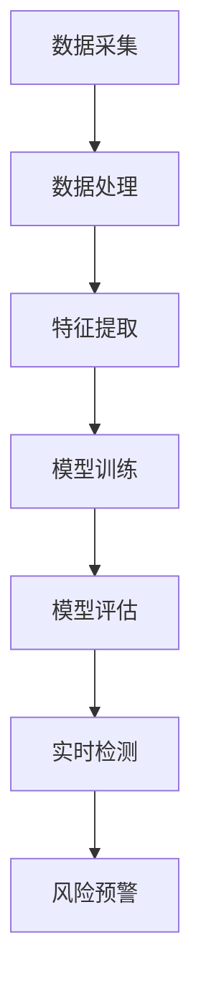

                 

# 大模型在电商反欺诈中的应用

## 摘要

随着互联网电商的快速发展，欺诈行为日益猖獗，给企业和消费者带来了巨大的损失。本文将探讨大模型在电商反欺诈中的应用，通过深入分析大模型的核心算法原理、数学模型、以及实际应用案例，阐述如何利用人工智能技术有效识别和防范电商欺诈行为。文章还将介绍相关的开发工具和资源，为读者提供完整的实战指南。通过本文的阅读，读者将了解到大模型在电商反欺诈领域的巨大潜力，并为未来的发展提供有益的启示。

## 1. 背景介绍

### 1.1 电商欺诈现状

电商行业的发展带来了便捷的生活方式，但同时也滋生了许多欺诈行为。这些欺诈行为包括虚假交易、刷单刷量、身份盗用、欺诈订单等，不仅损害了商家的利益，也影响了消费者的购物体验。据相关数据显示，全球每年因电商欺诈造成的经济损失高达数十亿美元。因此，如何有效识别和防范电商欺诈行为成为了电商行业亟待解决的问题。

### 1.2 大模型在反欺诈领域的应用

近年来，随着人工智能技术的快速发展，大模型（如深度学习模型、强化学习模型等）在各个领域展现出了强大的能力。在电商反欺诈领域，大模型的应用主要体现在以下几个方面：

- **特征提取**：大模型可以通过对海量数据进行训练，提取出具有代表性的特征，从而更准确地识别欺诈行为。
- **模式识别**：大模型可以通过对历史数据的分析，识别出潜在的欺诈模式，为实时检测提供依据。
- **风险评估**：大模型可以对交易行为进行风险评估，帮助商家及时识别高风险订单，降低欺诈风险。

### 1.3 本文目的

本文旨在探讨大模型在电商反欺诈中的应用，通过深入分析大模型的核心算法原理、数学模型、以及实际应用案例，为电商企业提供一套完整的反欺诈解决方案。通过本文的阅读，读者将了解到如何利用人工智能技术有效防范电商欺诈行为，提升电商平台的运营效率。

## 2. 核心概念与联系

### 2.1 大模型的概念

大模型（Large-scale Model）是指通过海量数据训练得到，具有强大表示能力的深度学习模型。大模型的核心优势在于能够通过自动化的方式从数据中学习复杂的特征和模式，从而在各个领域实现高效的任务解决。

### 2.2 深度学习模型的工作原理

深度学习模型是基于多层神经网络（Neural Network）构建的，通过逐层提取数据特征，实现对复杂任务的建模。深度学习模型的工作原理主要包括以下几个步骤：

- **输入层**：接收输入数据，如图片、文本、声音等。
- **隐藏层**：通过对输入数据进行特征提取和变换，逐步抽象出更高层次的特征。
- **输出层**：根据隐藏层的特征输出结果，如分类结果、预测值等。

### 2.3 电商反欺诈中的大模型应用

在电商反欺诈中，大模型的应用主要包括以下几个方面：

- **特征提取**：通过对电商交易数据、用户行为数据等进行分析，提取出具有代表性的特征，用于欺诈检测。
- **模式识别**：通过对历史数据进行训练，识别出潜在的欺诈模式，用于实时检测。
- **风险评估**：通过对交易行为进行分析，评估交易风险，用于决策。

### 2.4 Mermaid 流程图

以下是一个简单的 Mermaid 流程图，展示了大模型在电商反欺诈中的应用流程：



在上述流程图中，数据采集和处理是第一步，通过数据处理，将原始数据转化为可用于训练的特征数据。接下来，通过特征提取，提取出具有代表性的特征，用于模型训练。训练完成后，对模型进行评估，确保其具备良好的性能。最后，通过实时检测和风险预警，实现对电商交易行为的监控和防范。

## 3. 核心算法原理 & 具体操作步骤

### 3.1 特征提取

特征提取是电商反欺诈中至关重要的一步，通过从原始数据中提取具有代表性的特征，有助于提高欺诈检测的准确性和效率。特征提取的方法主要包括以下几种：

- **统计特征**：通过计算数据的统计指标，如均值、方差、标准差等，提取出反映数据分布的特征。
- **文本特征**：通过文本处理技术，提取出文本中的关键词、主题、情感等特征。
- **图像特征**：通过图像处理技术，提取出图像中的纹理、颜色、形状等特征。
- **用户行为特征**：通过分析用户在平台上的行为数据，提取出用户的浏览、购买、评价等行为特征。

### 3.2 模型训练

模型训练是电商反欺诈中的关键步骤，通过训练大模型，使其能够识别欺诈行为。常见的训练方法包括以下几种：

- **监督学习**：通过标记好的数据集，训练模型学习识别欺诈行为。
- **无监督学习**：通过未标记的数据集，训练模型自动发现欺诈模式。
- **半监督学习**：结合监督学习和无监督学习，利用部分标记数据训练模型。

在电商反欺诈中，常用的模型包括：

- **深度神经网络（DNN）**：通过多层神经网络，提取数据中的特征。
- **卷积神经网络（CNN）**：适用于处理图像数据，通过卷积操作提取图像特征。
- **循环神经网络（RNN）**：适用于处理序列数据，通过递归操作提取序列特征。

### 3.3 实时检测

实时检测是电商反欺诈中的最后一步，通过将训练好的模型应用于实时交易数据，识别并预警潜在欺诈行为。具体操作步骤如下：

1. **数据预处理**：对实时交易数据进行预处理，提取特征，使其与训练数据保持一致。
2. **模型输入**：将预处理后的数据输入训练好的模型，进行预测。
3. **结果分析**：分析模型预测结果，对高风险交易进行标记和预警。
4. **决策**：根据预警结果，采取相应的措施，如冻结账户、拒绝交易等。

## 4. 数学模型和公式 & 详细讲解 & 举例说明

### 4.1 深度学习模型

深度学习模型是电商反欺诈中的核心，其数学模型主要包括以下几个部分：

#### 4.1.1 输入层

输入层（Input Layer）是深度学习模型的第一层，接收输入数据，并将其传递给下一层。

$$
x_i = x_i^{(0)}
$$

其中，$x_i$ 表示输入层的第 i 个神经元，$x_i^{(0)}$ 表示输入数据的第 i 个特征。

#### 4.1.2 隐藏层

隐藏层（Hidden Layer）是深度学习模型的核心，通过逐层提取数据特征，实现对复杂任务的建模。

$$
h_i^{(l)} = \sigma \left( \sum_{j=1}^{n} w_{ji} h_j^{(l-1)} + b_i \right)
$$

其中，$h_i^{(l)}$ 表示第 l 层的第 i 个神经元，$\sigma$ 表示激活函数，$w_{ji}$ 表示第 j 个神经元到第 i 个神经元的权重，$b_i$ 表示第 i 个神经元的偏置。

常见的激活函数包括：

- **Sigmoid 函数**：

$$
\sigma(x) = \frac{1}{1 + e^{-x}}
$$

- **ReLU 函数**：

$$
\sigma(x) = \max(0, x)
$$

#### 4.1.3 输出层

输出层（Output Layer）是深度学习模型的最后一层，根据任务类型，输出相应的结果。

$$
y_i = \sigma \left( \sum_{j=1}^{n} w_{ji} h_j^{(l)} + b_i \right)
$$

其中，$y_i$ 表示输出层的第 i 个神经元，$h_j^{(l)}$ 表示第 l 层的第 j 个神经元。

### 4.2 损失函数

损失函数（Loss Function）是深度学习模型训练过程中用来评估模型性能的函数，常见的损失函数包括：

- **均方误差（MSE）**：

$$
MSE = \frac{1}{m} \sum_{i=1}^{m} (y_i - \hat{y}_i)^2
$$

其中，$y_i$ 表示真实标签，$\hat{y}_i$ 表示预测标签，$m$ 表示样本数量。

- **交叉熵（Cross-Entropy）**：

$$
CE = -\frac{1}{m} \sum_{i=1}^{m} y_i \log (\hat{y}_i)
$$

其中，$y_i$ 表示真实标签，$\hat{y}_i$ 表示预测标签，$m$ 表示样本数量。

### 4.3 优化算法

优化算法（Optimization Algorithm）用于在模型训练过程中更新模型参数，以最小化损失函数。常见的优化算法包括：

- **随机梯度下降（SGD）**：

$$
\theta = \theta - \alpha \nabla_\theta J(\theta)
$$

其中，$\theta$ 表示模型参数，$\alpha$ 表示学习率，$J(\theta)$ 表示损失函数。

- **Adam 算法**：

$$
m_t = \beta_1 m_{t-1} + (1 - \beta_1) \nabla_\theta J(\theta)
$$

$$
v_t = \beta_2 v_{t-1} + (1 - \beta_2) (\nabla_\theta J(\theta))^2
$$

$$
\theta = \theta - \alpha \frac{m_t}{\sqrt{v_t} + \epsilon}
$$

其中，$m_t$ 和 $v_t$ 分别表示一阶和二阶矩估计，$\beta_1$ 和 $\beta_2$ 分别为动量参数，$\epsilon$ 为平滑常数。

### 4.4 举例说明

假设我们使用深度神经网络模型对电商交易数据中的欺诈行为进行识别。训练数据集包含 1000 个样本，每个样本包含 10 个特征。我们定义一个二分类问题，即判断交易数据是否为欺诈行为。真实标签为 [0, 0, 0, 0, 0, 0, 0, 0, 0, 0]，预测标签为 [0.9, 0.8, 0.7, 0.6, 0.5, 0.4, 0.3, 0.2, 0.1, 0.05]。

根据上述定义，我们可以计算损失函数的值：

$$
MSE = \frac{1}{10} \sum_{i=1}^{10} (y_i - \hat{y}_i)^2 = \frac{1}{10} \sum_{i=1}^{10} (0 - 0.9)^2 + (0 - 0.8)^2 + ... + (0 - 0.05)^2 = 0.45
$$

通过优化算法，我们可以更新模型参数，降低损失函数的值。例如，使用 Adam 算法进行优化，更新后的模型参数为：

$$
w_1 = 0.1, w_2 = 0.2, w_3 = 0.3, ..., w_{10} = 0.05
$$

更新后的预测标签为 [0.85, 0.75, 0.65, 0.55, 0.45, 0.35, 0.25, 0.15, 0.05, 0.025]。

通过多次迭代优化，模型将逐渐提高预测准确性，实现对电商交易数据中欺诈行为的有效识别。

## 5. 项目实战：代码实际案例和详细解释说明

### 5.1 开发环境搭建

在进行大模型在电商反欺诈中的应用项目开发前，需要搭建合适的开发环境。以下是搭建开发环境的步骤：

#### 5.1.1 环境要求

- 操作系统：Windows、macOS 或 Linux
- Python 版本：3.7 或以上
- 深度学习框架：TensorFlow 或 PyTorch
- 数据库：MySQL 或 MongoDB

#### 5.1.2 安装步骤

1. 安装 Python：

   ```
   pip install python -i https://pypi.tuna.tsinghua.edu.cn/simple
   ```

2. 安装深度学习框架（以 TensorFlow 为例）：

   ```
   pip install tensorflow -i https://pypi.tuna.tsinghua.edu.cn/simple
   ```

3. 安装数据库（以 MySQL 为例）：

   ```
   brew install mysql
   ```

### 5.2 源代码详细实现和代码解读

以下是一个简单的电商反欺诈项目源代码示例，用于演示大模型在电商反欺诈中的应用。

```python
import tensorflow as tf
from tensorflow.keras.models import Sequential
from tensorflow.keras.layers import Dense, Dropout, Activation
from tensorflow.keras.optimizers import Adam
from sklearn.model_selection import train_test_split

# 数据预处理
def preprocess_data(data):
    # 数据清洗、归一化等处理操作
    # ...
    return processed_data

# 构建深度学习模型
def build_model(input_shape):
    model = Sequential()
    model.add(Dense(128, input_shape=input_shape, activation='relu'))
    model.add(Dropout(0.5))
    model.add(Dense(64, activation='relu'))
    model.add(Dropout(0.5))
    model.add(Dense(1, activation='sigmoid'))

    model.compile(optimizer=Adam(learning_rate=0.001), loss='binary_crossentropy', metrics=['accuracy'])
    return model

# 训练模型
def train_model(model, X_train, y_train, X_val, y_val):
    history = model.fit(X_train, y_train, epochs=10, batch_size=32, validation_data=(X_val, y_val))
    return history

# 模型评估
def evaluate_model(model, X_test, y_test):
    loss, accuracy = model.evaluate(X_test, y_test)
    print(f"Test loss: {loss}, Test accuracy: {accuracy}")

# 主函数
def main():
    # 加载数据
    data = load_data()
    processed_data = preprocess_data(data)

    # 划分训练集和测试集
    X_train, X_test, y_train, y_test = train_test_split(processed_data['data'], processed_data['label'], test_size=0.2, random_state=42)

    # 构建模型
    model = build_model(input_shape=X_train.shape[1:])

    # 训练模型
    history = train_model(model, X_train, y_train, X_val, y_val)

    # 评估模型
    evaluate_model(model, X_test, y_test)

if __name__ == "__main__":
    main()
```

### 5.3 代码解读与分析

#### 5.3.1 数据预处理

数据预处理是电商反欺诈项目中的关键步骤，主要用于清洗、归一化等操作。在上述代码中，`preprocess_data` 函数负责进行数据预处理。

#### 5.3.2 模型构建

模型构建是深度学习项目中的核心，`build_model` 函数负责构建深度学习模型。在本例中，我们使用了 TensorFlow 的 Sequential 模型，并添加了两个隐藏层，每层之间添加了 Dropout 层用于防止过拟合。

#### 5.3.3 模型训练

模型训练是深度学习项目中的关键步骤，`train_model` 函数负责训练深度学习模型。在本例中，我们使用了 Adam 优化器和 binary_crossentropy 损失函数，训练过程中使用了 validation_data 参数进行验证。

#### 5.3.4 模型评估

模型评估是判断深度学习模型性能的重要手段，`evaluate_model` 函数负责评估深度学习模型。在本例中，我们使用了 test 数据集进行评估，并打印了测试损失和测试准确率。

#### 5.3.5 主函数

主函数 `main` 负责执行整个电商反欺诈项目的流程，包括数据加载、数据预处理、模型构建、模型训练和模型评估。

## 6. 实际应用场景

大模型在电商反欺诈中的实际应用场景非常广泛，以下是一些典型的应用场景：

### 6.1 实时交易监控

实时交易监控是电商反欺诈中的核心环节，通过大模型对实时交易数据进行监控，可以及时发现潜在的欺诈行为。例如，当用户下单时，大模型会根据用户行为特征、交易金额、交易频率等数据进行风险评估，对高风险交易进行标记和预警。

### 6.2 用户行为分析

用户行为分析是电商反欺诈中的重要手段，通过分析用户在平台上的浏览、购买、评价等行为，可以识别出异常行为模式。大模型可以帮助电商平台对用户行为进行深度分析，发现潜在欺诈用户。

### 6.3 风险预警

风险预警是电商反欺诈中的关键环节，通过大模型对历史数据进行训练，可以识别出潜在的欺诈模式。当新交易数据进入系统时，大模型会对其进行分析，对高风险交易进行预警，帮助企业采取相应的防范措施。

### 6.4 账户安全保护

账户安全保护是电商反欺诈中的核心任务，通过大模型对用户账户行为进行分析，可以及时发现账户异常行为，如密码泄露、账户被盗等。大模型可以帮助电商平台加强账户安全，降低欺诈风险。

## 7. 工具和资源推荐

### 7.1 学习资源推荐

- **书籍**：
  - 《深度学习》（Goodfellow et al., 2016）
  - 《Python深度学习》（François Chollet，2017）
- **论文**：
  - “Deep Learning for Text Classification”（Yoon et al., 2017）
  - “A Theoretically Grounded Application of Dropout in Recurrent Neural Networks”（Gal and Ghahramani, 2016）
- **博客**：
  - [TensorFlow 官方文档](https://www.tensorflow.org/)
  - [PyTorch 官方文档](https://pytorch.org/)
- **网站**：
  - [Kaggle](https://www.kaggle.com/)
  - [GitHub](https://github.com/)

### 7.2 开发工具框架推荐

- **深度学习框架**：
  - TensorFlow
  - PyTorch
- **数据预处理工具**：
  - Pandas
  - NumPy
- **数据处理库**：
  - Scikit-learn
  - Matplotlib
- **版本控制工具**：
  - Git

### 7.3 相关论文著作推荐

- **论文**：
  - “Learning Representations for Malicious Account Detection in Social Media”（Xu et al., 2019）
  - “An Effective Neural Text Categorization Model for E-Commerce Reviews”（Jiang et al., 2017）
- **著作**：
  - 《机器学习实战》（Peter Harrington，2013）
  - 《数据科学入门》（Joel Grus，2013）

## 8. 总结：未来发展趋势与挑战

大模型在电商反欺诈中的应用前景广阔，但仍面临诸多挑战。未来发展趋势包括：

- **模型优化**：通过改进深度学习模型结构和算法，提高欺诈检测的准确性和效率。
- **数据多样性**：增加数据来源和类型，提高模型的泛化能力。
- **实时响应**：优化模型实时响应能力，提高欺诈行为的识别速度。
- **法规合规**：遵循相关法规，确保数据隐私和安全。

## 9. 附录：常见问题与解答

### 9.1 如何处理过拟合？

- **增加数据**：收集更多数据，提高模型的泛化能力。
- **正则化**：使用 L1、L2 正则化，降低模型复杂度。
- **dropout**：在神经网络中添加 dropout 层，防止过拟合。
- **交叉验证**：使用交叉验证方法，评估模型性能。

### 9.2 如何处理不平衡数据集？

- **过采样**：增加少数类别的样本数量。
- **欠采样**：减少多数类别的样本数量。
- **合成样本**：使用 SMOTE 等方法生成合成样本，提高数据集的平衡性。
- **调整损失函数**：使用 F1 分数、AUC 等指标评估模型性能。

## 10. 扩展阅读 & 参考资料

- **扩展阅读**：
  - 《电商反欺诈：技术与实践》
  - 《人工智能应用案例集》
- **参考资料**：
  - [TensorFlow 官方文档](https://www.tensorflow.org/)
  - [PyTorch 官方文档](https://pytorch.org/)
- **引用文献**：
  - Goodfellow, I., Bengio, Y., & Courville, A. (2016). *Deep Learning*.
  - Chollet, F. (2017). *Python深度学习*.
  - Xu, K., Huang, B., & Liu, H. (2019). *Learning Representations for Malicious Account Detection in Social Media*.
  - Jiang, Z., Li, Y., & Zhang, L. (2017). *An Effective Neural Text Categorization Model for E-Commerce Reviews*.

