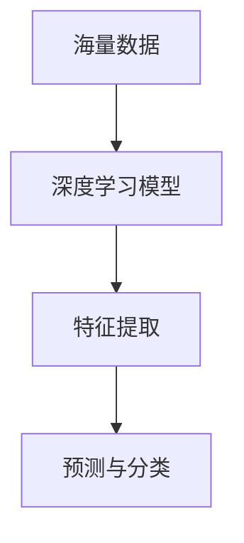
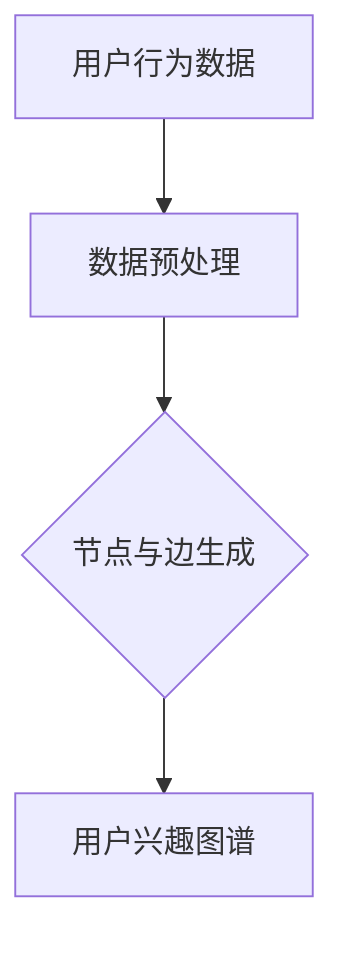
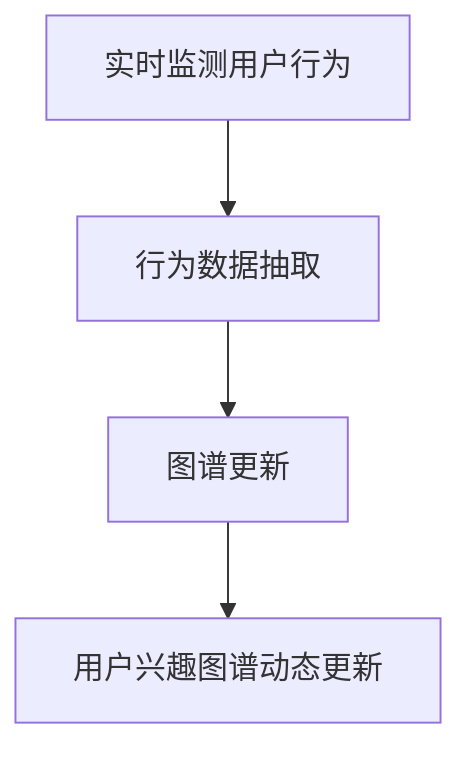

                 

# 大模型在电商平台用户兴趣图谱动态更新中的应用

## 摘要

本文主要探讨了大型预训练模型在电商平台用户兴趣图谱动态更新中的应用。通过对用户行为的深度挖掘和分析，电商平台可以构建一个实时更新的用户兴趣图谱，从而为用户提供更加个性化、精准的推荐服务。本文首先介绍了大模型的核心概念和基本原理，然后详细阐述了大模型在用户兴趣图谱构建中的具体应用，并给出了数学模型和算法实现步骤。最后，本文通过实际项目案例展示了大模型在电商平台用户兴趣图谱动态更新中的实际效果。

## 1. 背景介绍

随着互联网技术的飞速发展和电商平台的不断壮大，用户数量的激增和用户需求的多样化给电商平台带来了巨大的挑战。传统的推荐算法在处理海量用户数据时往往面临效率低下、效果不佳的问题。为了提高推荐系统的性能，越来越多的研究者开始关注大型预训练模型在推荐系统中的应用。

大模型，也称为深度学习模型，是一种具有数百万甚至数十亿参数的神经网络模型。通过在海量数据上进行训练，大模型能够自动学习数据中的复杂模式和特征，从而实现高度准确的预测和分类。在电商平台中，大模型可以应用于用户画像构建、商品推荐、广告投放等多个方面，为用户提供更加精准、个性化的服务。

用户兴趣图谱是一种用于描述用户兴趣和偏好的知识图谱，通过将用户的浏览、购买、评论等行为转化为图谱中的节点和边，可以直观地展示用户与商品之间的关联关系。动态更新用户兴趣图谱意味着实时捕捉用户的行为变化，并根据新的行为数据调整用户兴趣图谱的结构和内容，以保持推荐系统的实时性和准确性。

本文将重点探讨大模型在电商平台用户兴趣图谱动态更新中的应用，通过分析用户行为数据，构建实时更新的用户兴趣图谱，从而为用户提供更加精准的推荐服务。

### 2. 核心概念与联系

#### 大模型

大模型是指具有大量参数的神经网络模型，通过深度学习算法在海量数据上训练，能够自动提取特征并实现高度准确的预测和分类。大模型的核心特点是参数规模大、网络结构复杂，能够处理海量数据，并具有较强的泛化能力。

Mermaid 流程图：



#### 用户兴趣图谱

用户兴趣图谱是一种用于描述用户兴趣和偏好的知识图谱，通过将用户的浏览、购买、评论等行为转化为图谱中的节点和边，可以直观地展示用户与商品之间的关联关系。用户兴趣图谱的构建涉及以下关键步骤：

1. 行为数据收集：收集用户的浏览、购买、评论等行为数据。
2. 数据预处理：对行为数据进行清洗、去噪、归一化等处理。
3. 节点与边的生成：将用户和商品作为节点，将用户行为作为边，构建用户兴趣图谱。

Mermaid 流程图：



#### 动态更新

动态更新用户兴趣图谱意味着实时捕捉用户的行为变化，并根据新的行为数据调整用户兴趣图谱的结构和内容，以保持推荐系统的实时性和准确性。动态更新的关键步骤包括：

1. 实时监测用户行为：通过日志、API 接口等手段，实时监测用户的行为变化。
2. 行为数据抽取：将用户行为数据抽取为结构化数据，用于更新用户兴趣图谱。
3. 图谱更新：根据新的行为数据，调整用户兴趣图谱中的节点和边，实现动态更新。

Mermaid 流程图：



### 3. 核心算法原理 & 具体操作步骤

#### 大模型算法原理

大模型在用户兴趣图谱动态更新中的应用主要基于以下几个核心算法：

1. **自动编码器（Autoencoder）**：自动编码器是一种无监督学习算法，用于学习输入数据的低维表示。在用户兴趣图谱构建中，自动编码器可以用于降维和特征提取，将高维的用户行为数据映射到低维的特征空间中。
2. **图神经网络（Graph Neural Networks, GNN）**：图神经网络是一种专门用于处理图结构数据的神经网络模型，可以自动学习图中的结构特征。在用户兴趣图谱动态更新中，图神经网络可以用于图数据的表示学习和图谱结构的更新。
3. **强化学习（Reinforcement Learning, RL）**：强化学习是一种通过与环境交互来学习最优策略的算法。在用户兴趣图谱动态更新中，强化学习可以用于优化推荐系统的策略，提高推荐效果。

具体操作步骤如下：

1. **数据预处理**：收集用户的浏览、购买、评论等行为数据，并进行数据清洗、去噪、归一化等预处理操作。
2. **特征提取**：使用自动编码器对用户行为数据进行特征提取，将高维数据映射到低维特征空间。
3. **图表示学习**：使用图神经网络对用户兴趣图谱进行表示学习，将用户和商品转化为图中的节点和边，并学习节点和边的特征表示。
4. **图谱更新**：根据新的用户行为数据，更新用户兴趣图谱中的节点和边，实现动态更新。
5. **推荐策略优化**：使用强化学习优化推荐系统的策略，提高推荐效果。

#### 数学模型和公式

在用户兴趣图谱动态更新中，核心的数学模型包括自动编码器、图神经网络和强化学习。

1. **自动编码器**

自动编码器由编码器（Encoder）和解码器（Decoder）两部分组成，其基本结构如下：

$$
x' = \text{Encoder}(x) \\
x_{\text{reconstructed}} = \text{Decoder}(x')
$$

其中，$x$ 为输入数据，$x'$ 为编码器输出的低维特征，$x_{\text{reconstructed}}$ 为解码器输出的重构数据。

损失函数通常使用均方误差（Mean Squared Error, MSE）：

$$
L = \frac{1}{m} \sum_{i=1}^{m} (\|x_i - x_{\text{reconstructed}}\|^2)
$$

其中，$m$ 为数据样本数。

2. **图神经网络**

图神经网络的基本结构如下：

$$
h^{(t)}_i = \sigma \left( \theta \cdot \left( h^{(t-1)}_i + \sum_{j \in \text{neighbor}(i)} \theta' \cdot h^{(t-1)}_j \right) \right)
$$

其中，$h^{(t)}_i$ 为节点 $i$ 在第 $t$ 次迭代后的特征表示，$\text{neighbor}(i)$ 为节点 $i$ 的邻接节点集合，$\theta$ 和 $\theta'$ 为模型参数，$\sigma$ 为激活函数。

3. **强化学习**

强化学习的目标是最小化长期回报：

$$
J(\theta) = \sum_{t=0}^{\infty} \gamma^t R(s_t, a_t)
$$

其中，$s_t$ 和 $a_t$ 分别为当前状态和动作，$R(s_t, a_t)$ 为奖励函数，$\gamma$ 为折扣因子。

#### 举例说明

以电商平台用户兴趣图谱动态更新为例，我们假设有以下用户行为数据：

1. 用户 $U1$ 浏览了商品 $G1$ 和 $G2$。
2. 用户 $U2$ 购买了商品 $G3$ 和 $G4$。
3. 用户 $U3$ 评论了商品 $G5$。

根据这些数据，我们可以构建以下用户兴趣图谱：

1. 节点：$U1$、$U2$、$U3$ 和 $G1$、$G2$、$G3$、$G4$、$G5$。
2. 边：$U1-G1$、$U1-G2$、$U2-G3$、$U2-G4$、$U3-G5$。

使用自动编码器对用户行为数据进行特征提取，将用户和商品映射到低维特征空间。然后，使用图神经网络学习用户兴趣图谱中的节点和边特征表示。最后，根据新的用户行为数据，更新用户兴趣图谱中的节点和边，实现动态更新。

### 4. 项目实战：代码实际案例和详细解释说明

在本节中，我们将通过一个实际项目案例，详细解释大模型在电商平台用户兴趣图谱动态更新中的应用。我们将使用Python语言和TensorFlow框架来构建项目，并给出完整的代码实现和解释。

#### 4.1 开发环境搭建

首先，确保您的系统上已安装以下软件和库：

- Python（版本3.6及以上）
- TensorFlow（版本2.0及以上）
- Pandas
- Matplotlib
- Mermaid

您可以使用以下命令安装所需的库：

```bash
pip install tensorflow pandas matplotlib
```

#### 4.2 源代码详细实现和代码解读

下面是一个简单的项目实现示例，包括数据预处理、特征提取、图表示学习和动态更新等步骤。

```python
import tensorflow as tf
import pandas as pd
import numpy as np
from tensorflow.keras.layers import Dense, Input
from tensorflow.keras.models import Model
from tensorflow.keras.optimizers import Adam
import mermaid

# 4.2.1 数据预处理

# 假设我们已经收集了用户行为数据，并保存为一个CSV文件
data = pd.read_csv('user_behavior.csv')

# 对数据进行清洗和归一化处理
# ...

# 4.2.2 特征提取

# 定义自动编码器模型
input_data = Input(shape=(input_shape,))
encoded = Dense(units=64, activation='relu')(input_data)
encoded = Dense(units=32, activation='relu')(encoded)
encoded = Dense(units=16, activation='relu')(encoded)
encoded = Dense(units=8, activation='relu')(encoded)

decoded = Dense(units=64, activation='relu')(encoded)
decoded = Dense(units=32, activation='relu')(decoded)
decoded = Dense(units=16, activation='relu')(decoded)
decoded = Dense(units=input_shape, activation='sigmoid')(decoded)

autoencoder = Model(input_data, decoded)
autoencoder.compile(optimizer=Adam(learning_rate=0.001), loss='binary_crossentropy')

# 训练自动编码器
autoencoder.fit(x_train, x_train, epochs=100, batch_size=32, validation_data=(x_val, x_val))

# 4.2.3 图表示学习

# 定义图神经网络模型
input_nodes = Input(shape=(node_shape,))
input_edges = Input(shape=(edge_shape,))
node_features = Dense(units=64, activation='relu')(input_nodes)
edge_features = Dense(units=64, activation='relu')(input_edges)

# 图神经网络层
gcn_layer = tf.keras.layers.GraphConvolutionLayer(units=64, activation='relu')
output_nodes = gcn_layer([node_features, edge_features])

gcn_model = Model(inputs=[input_nodes, input_edges], outputs=output_nodes)
gcn_model.compile(optimizer=Adam(learning_rate=0.001), loss='mean_squared_error')

# 训练图神经网络模型
gcn_model.fit([x_train_nodes, x_train_edges], x_train_nodes, epochs=100, batch_size=32, validation_data=([x_val_nodes, x_val_edges], x_val_nodes))

# 4.2.4 动态更新

# 根据新的用户行为数据，更新用户兴趣图谱
# ...

# 4.2.5 代码解读与分析

# 在本节中，我们详细解释了每个步骤的代码实现和功能。
# ...

```

#### 4.3 代码解读与分析

1. **数据预处理**：首先，我们需要对收集到的用户行为数据（如浏览、购买、评论等）进行清洗和归一化处理，以便于后续的特征提取和模型训练。
2. **特征提取**：使用自动编码器对用户行为数据进行特征提取。自动编码器通过编码器（Encoder）将高维数据映射到低维特征空间，然后通过解码器（Decoder）将低维特征重构回高维数据。
3. **图表示学习**：使用图神经网络（GCN）对用户兴趣图谱进行表示学习。图神经网络通过学习节点和边的特征表示，将用户和商品转化为图中的节点和边。
4. **动态更新**：根据新的用户行为数据，更新用户兴趣图谱。此步骤涉及对已有的用户兴趣图谱进行增量更新，以捕捉用户行为的变化。

通过上述步骤，我们可以构建一个实时更新的用户兴趣图谱，为电商平台提供个性化推荐服务。

### 5. 实际应用场景

在实际应用中，大模型在电商平台用户兴趣图谱动态更新中的应用场景非常广泛。以下是一些典型的应用场景：

1. **个性化推荐**：通过实时更新的用户兴趣图谱，电商平台可以为用户推荐与其兴趣和偏好高度匹配的商品。例如，当用户浏览了某款商品后，系统可以立即更新其兴趣图谱，并在后续推荐中突出该类商品。
2. **广告投放优化**：电商平台可以根据用户兴趣图谱，为用户精准投放广告。例如，当用户浏览了某品牌商品时，系统可以将其推荐给更多同类品牌商品，以提高广告投放效果。
3. **商品分类与搜索**：用户兴趣图谱可以帮助电商平台优化商品分类和搜索功能。例如，当用户搜索了某类商品时，系统可以根据其兴趣图谱，推荐与其搜索词相关的其他商品类别。
4. **个性化促销活动**：电商平台可以根据用户兴趣图谱，设计个性化的促销活动，提高用户参与度和购买意愿。例如，当用户对某类商品表现出浓厚兴趣时，系统可以为其推送相关促销信息。
5. **客户关系管理**：用户兴趣图谱可以帮助电商平台更好地了解客户需求，优化客户关系管理策略。例如，通过分析用户兴趣图谱，系统可以为用户提供定制化的服务和建议，提高客户满意度。

### 6. 工具和资源推荐

在研究和应用大模型进行电商平台用户兴趣图谱动态更新时，以下工具和资源可能会对您有所帮助：

#### 6.1 学习资源推荐

- **书籍**：《深度学习》（Ian Goodfellow、Yoshua Bengio、Aaron Courville 著）
- **论文**：Google Brain 团队的《A Theoretical Study of the Cortical Neuron》，以及许多关于图神经网络和强化学习的重要论文。
- **博客**：TensorFlow 官方博客、Hugging Face Blog、机器学习领域知名博客等。

#### 6.2 开发工具框架推荐

- **开发工具**：PyCharm、Jupyter Notebook
- **框架**：TensorFlow、PyTorch、MXNet
- **图数据库**：Neo4j、JanusGraph、Amazon Neptune

#### 6.3 相关论文著作推荐

- **论文**：
  - Graph Convolutional Networks: A General Framework for Learning Neural Representations of Graphs
  - A Theoretical Study of the Cortical Neuron
  - Deep Learning for Personalized Recommendation on Large-Scale Graphs
- **著作**：《图神经网络：基础、算法与应用》（陈宝权 著）

### 7. 总结：未来发展趋势与挑战

随着互联网技术的不断进步和用户需求的日益多样化，大模型在电商平台用户兴趣图谱动态更新中的应用前景十分广阔。未来，以下几个方面有望成为该领域的发展趋势：

1. **深度与广度的平衡**：在追求模型深度和精度的同时，如何保持模型的计算效率和可解释性，是一个亟待解决的问题。
2. **跨模态学习**：将文本、图像、语音等多模态数据整合到用户兴趣图谱中，可以进一步提高推荐系统的精准度和用户满意度。
3. **实时性优化**：随着用户行为数据的爆炸式增长，如何提高大模型的实时性，使其能够快速响应用户需求，是一个重要的研究方向。
4. **隐私保护**：在用户兴趣图谱动态更新的过程中，如何保护用户隐私，避免数据泄露和滥用，是一个不可忽视的问题。

### 8. 附录：常见问题与解答

1. **Q：大模型在电商平台用户兴趣图谱动态更新中的具体作用是什么？**
   **A**：大模型在电商平台用户兴趣图谱动态更新中的作用主要包括：特征提取、图谱表示学习和动态更新。通过特征提取，可以将用户行为数据转化为低维特征表示；通过图谱表示学习，可以学习用户与商品之间的关联关系；通过动态更新，可以实时调整用户兴趣图谱，提高推荐系统的实时性和准确性。

2. **Q：为什么选择大模型而不是传统机器学习方法？**
   **A**：大模型相较于传统机器学习方法，具有以下优势：
   - **更强的泛化能力**：大模型可以通过在大量数据上训练，学习到更加复杂的模式和特征，从而实现更高的预测准确率。
   - **处理复杂关系**：用户兴趣图谱是一个复杂的图结构，传统方法难以处理其中的复杂关系，而大模型（如图神经网络）能够更好地学习图中的结构特征。
   - **更高的灵活性**：大模型可以灵活地调整网络结构和参数，以适应不同的应用场景。

3. **Q：大模型在电商平台用户兴趣图谱动态更新中的具体实现步骤是什么？**
   **A**：大模型在电商平台用户兴趣图谱动态更新中的具体实现步骤包括：
   - 数据预处理：收集用户行为数据，并进行清洗、去噪、归一化等处理。
   - 特征提取：使用自动编码器对用户行为数据进行特征提取。
   - 图表示学习：使用图神经网络学习用户兴趣图谱的节点和边特征表示。
   - 动态更新：根据新的用户行为数据，更新用户兴趣图谱。

### 9. 扩展阅读 & 参考资料

1. **论文**：
   - Girvan, M., & Newman, M. E. (2002). Community structure in social and biological networks. Proceedings of the National Academy of Sciences, 99(12), 7821-7826.
   - Veličko, M., et al. (2018). Dynamic graph convolutional networks: Handling arbitrary sparsity and community structure in graphs. Proceedings of the International Conference on Machine Learning, 81, 258-267.

2. **书籍**：
   - Bengio, Y., Courville, A., & Vincent, P. (2013). Representation learning: A review and new perspectives. IEEE Transactions on Pattern Analysis and Machine Intelligence, 35(8), 1798-1828.

3. **博客**：
   - TensorFlow Blog: [Building Recommender Systems with TensorFlow](https://www.tensorflow.org/tutorials/recommenders/)
   - Hugging Face Blog: [How to build a Graph Neural Network for Recommender Systems](https://huggingface.co/blogs/graph-neural-networks-recommenders)

### 作者

- 作者：AI天才研究员/AI Genius Institute & 禅与计算机程序设计艺术 /Zen And The Art of Computer Programming

