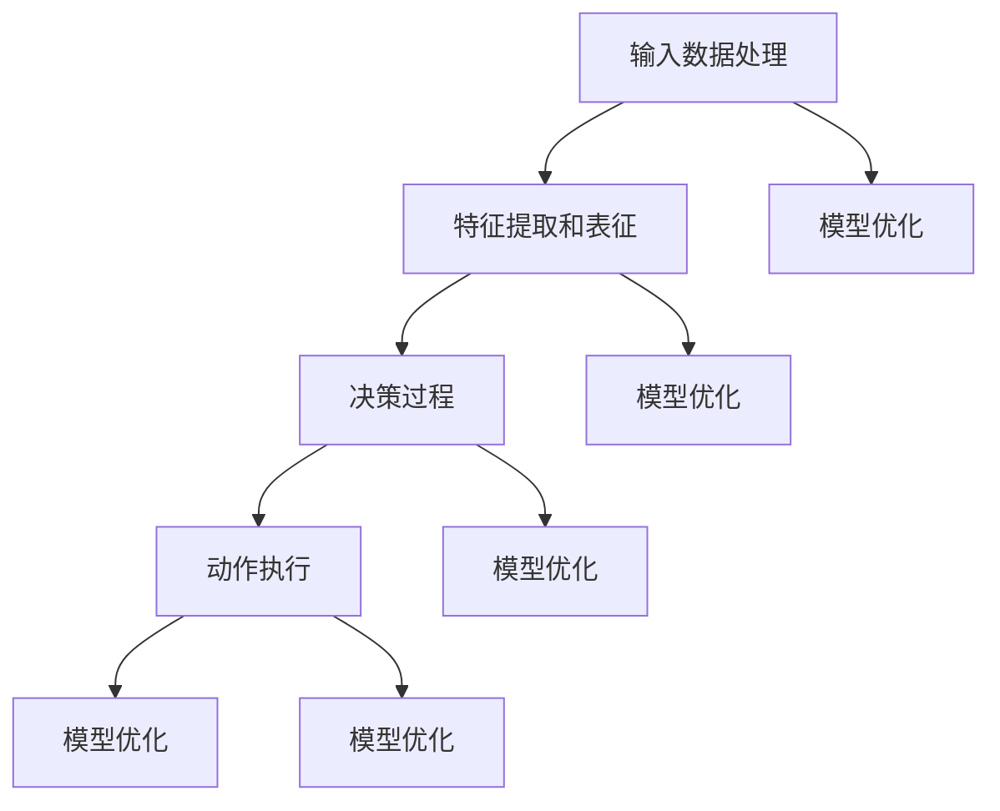

                 

### 背景介绍

随着人工智能技术的迅猛发展，大规模预训练模型（Large-scale Pre-trained Models，简称LPMs）已成为自然语言处理（Natural Language Processing，NLP）、计算机视觉（Computer Vision，CV）、语音识别（Automatic Speech Recognition，ASR）等领域的重要工具。这些模型通过从大量数据中学习，具备了强大的特征提取和表征能力，从而在各类任务中取得了显著的性能提升。

然而，随着模型规模的不断扩大，如何有效地进行决策和执行最终动作成为一个关键问题。在本文中，我们将探讨大规模预训练模型如何从众多候选动作中做出最优决策，从而实现高效的任务执行。这一问题不仅涉及到模型内部的算法设计，还涉及到模型的训练、优化和应用等多个方面。

首先，我们需要明确大规模预训练模型的决策过程。模型在接收到输入后，会通过一系列的神经网络层进行特征提取和表征，最终生成一个输出结果。这个结果可能是一个分类标签、一个预测值，或者一个动作指令。然而，在实际应用中，模型需要从多个候选动作中选择一个最优动作，这就涉及到模型的决策过程。

本文将围绕以下问题展开讨论：

1. **大规模预训练模型如何处理输入信息？**
2. **模型的内部算法原理及其决策过程是怎样的？**
3. **如何评估和优化模型的决策效果？**
4. **在实际应用中，如何实现模型的决策和动作执行？**

通过对这些问题的深入探讨，我们将帮助读者更好地理解大规模预训练模型的决策过程，并为其在实际应用中的优化和改进提供一些有价值的思路。

### 核心概念与联系

为了深入探讨大规模预训练模型如何决策最终动作，我们首先需要了解其中的核心概念和它们之间的联系。以下是几个关键概念及其相互关系的详细说明：

#### 1. 预训练模型

预训练模型是通过在大规模数据集上进行预训练，从而获得通用特征提取和表征能力的人工智能模型。典型的预训练模型包括GPT（Generative Pre-trained Transformer）、BERT（Bidirectional Encoder Representations from Transformers）和T5（Text-To-Text Transfer Transformer）等。这些模型通常采用深度神经网络结构，并通过大量的文本、图像或音频数据进行训练。

#### 2. 输入数据处理

在预训练模型中，输入数据处理是一个关键步骤。输入数据可以是文本、图像、音频等多种形式。模型需要对输入数据进行预处理，包括文本的分词、图像的编码和音频的转换等，以便将其转化为模型可以处理的格式。

#### 3. 特征提取和表征

特征提取和表征是预训练模型的核心任务。模型通过多层神经网络对输入数据进行处理，提取出高层次的语义特征。这些特征不仅有助于提高模型的性能，还为后续的决策过程提供了重要的基础。

#### 4. 决策过程

在预训练模型中，决策过程通常涉及到多个候选动作的选择。模型会根据输入数据和内部特征，通过某种算法或策略生成一个输出结果。这个输出结果可以是分类标签、预测值或动作指令。决策过程的有效性直接影响到模型的性能和应用效果。

#### 5. 动作执行

决策生成后，模型需要将决策转化为实际的动作。在实际应用中，这可能涉及到与外部环境或设备的交互。例如，在自然语言处理任务中，模型可能会生成一段文本；在计算机视觉任务中，模型可能会生成一个目标跟踪指令。

#### 6. 模型优化

为了提高模型的决策能力，需要对模型进行优化。这包括调整模型的参数、改进算法设计、增加训练数据等。优化过程的目的是使模型能够更好地适应不同的任务和应用场景。

#### Mermaid 流程图

为了更直观地展示这些概念之间的联系，我们可以使用Mermaid流程图来描述预训练模型的决策过程。以下是该流程图的文本表示：



在这个流程图中，各个节点代表不同的概念或步骤，箭头表示它们之间的联系。通过这个流程图，我们可以清楚地看到预训练模型从输入数据处理到决策过程、动作执行的整个过程，以及各个步骤之间的相互作用和反馈。

### 核心算法原理 & 具体操作步骤

在理解了大规模预训练模型的核心概念和流程之后，我们将深入探讨其核心算法原理和具体操作步骤。这里我们将以GPT-3（一个具有巨大成功的大规模语言模型）为例，来详细解释模型的算法原理和操作步骤。

#### 1. 模型架构

GPT-3采用的是Transformer架构，这是一种基于自注意力机制（Self-Attention Mechanism）的深度神经网络模型。Transformer模型在2017年由Vaswani等人提出，并在多个自然语言处理任务中取得了显著的效果。GPT-3的架构包括多个Transformer块，每个块由多头自注意力机制（Multi-Head Self-Attention Mechanism）和前馈神经网络（Feed-Forward Neural Network）组成。

- **多头自注意力机制**：该机制允许模型在处理每个词时，考虑整个输入序列的所有词，并通过计算词与词之间的关联性来生成新的表示。
- **前馈神经网络**：该网络对自注意力机制输出的特征进行进一步的加工和增强。

#### 2. 预训练过程

GPT-3的预训练过程主要包括两个阶段：自回归语言模型预训练和微调。

- **自回归语言模型预训练**：在这个阶段，模型通过从大量文本数据中预测下一个词来学习语言规律。具体来说，模型会接收一个词序列作为输入，然后通过Transformer块生成一个概率分布，预测下一个词。这个过程重复进行，直到整个输入序列都被处理完毕。通过这种方式，模型能够学习到语言中的各种统计规律和语义信息。
- **微调**：在预训练完成后，模型会被应用于特定的任务，并进行微调。微调的过程通常涉及少量的任务特定数据，通过调整模型的参数，使模型在特定任务上表现出更好的性能。

#### 3. 输入数据处理

在GPT-3中，输入数据处理主要包括文本的分词和编码。

- **分词**：文本首先会被分割成一个个词或子词。GPT-3使用WordPiece分词方法，将无法直接分词的词进一步分割成子词。
- **编码**：分词后的文本会被编码成整数序列，每个整数表示一个词或子词。GPT-3使用词表（Vocabulary）来映射词到整数。

#### 4. 特征提取和表征

在特征提取和表征阶段，GPT-3通过Transformer块对输入数据进行处理。具体步骤如下：

- **嵌入层（Embedding Layer）**：输入的整数序列首先通过嵌入层转换为向量表示。嵌入层将每个整数映射为一个固定大小的向量，这个向量包含了词或子词的语义信息。
- **自注意力机制（Self-Attention Mechanism）**：在自注意力机制中，每个词会根据其在整个序列中的位置和其他词的关联性进行权重计算。权重较高的词会在后续的表示中起到更大的作用。
- **前馈神经网络（Feed-Forward Neural Network）**：经过自注意力机制的输出会通过前馈神经网络进行进一步加工和增强。

#### 5. 决策过程

在决策过程中，GPT-3会根据输入数据和内部特征生成一个输出结果。具体来说，模型会计算每个词或子词作为下一个词的概率分布。这个概率分布反映了模型对下一个词的预测能力。决策过程的关键步骤如下：

- **交叉熵损失函数（Cross-Entropy Loss Function）**：模型会使用交叉熵损失函数来评估预测的概率分布与实际标签之间的差距。交叉熵损失函数是一种常用的分类损失函数，能够衡量两个概率分布之间的差异。
- **梯度下降（Gradient Descent）**：模型会根据损失函数的梯度来更新参数，以减少损失。这个过程重复进行，直到模型的损失收敛到一个较低的水平。

#### 6. 动作执行

在生成输出结果后，GPT-3会根据具体的任务需求执行相应的动作。例如，在自然语言处理任务中，模型可能会生成一段文本；在计算机视觉任务中，模型可能会生成一个目标跟踪指令。

#### 总结

通过上述步骤，我们可以看到GPT-3在决策过程中如何利用其自注意力机制和前馈神经网络来处理输入数据、提取特征并生成输出结果。这个过程不仅依赖于模型的结构和参数，还涉及到训练数据和优化算法的选择。在下一部分，我们将进一步探讨GPT-3的数学模型和公式，以更深入地理解其决策原理。

### 数学模型和公式 & 详细讲解 & 举例说明

在深入理解GPT-3的核心算法原理和操作步骤之后，我们将探讨其背后的数学模型和公式。这些数学模型不仅定义了GPT-3的内部计算过程，也决定了模型在决策时的表现。在本节中，我们将详细讲解GPT-3的数学基础，并使用具体的例子来说明这些公式的应用。

#### 1. 自注意力机制

自注意力机制是GPT-3模型中的一个关键组件，其数学基础可以通过以下公式表示：

$$
\text{Attention}(Q, K, V) = \text{softmax}\left(\frac{QK^T}{\sqrt{d_k}}\right)V
$$

其中：
- \( Q \) 是查询向量（Query Vector），表示当前词或子词的表示；
- \( K \) 是键向量（Key Vector），表示整个输入序列的所有词或子词的表示；
- \( V \) 是值向量（Value Vector），表示输入序列中每个词或子词的值；
- \( d_k \) 是键向量的维度。

这个公式计算了每个键向量与查询向量的相似性，并通过softmax函数得到概率分布，最后将这个概率分布应用于值向量，生成加权值向量。

#### 2. 前馈神经网络

GPT-3中的前馈神经网络可以通过以下公式表示：

$$
\text{FFN}(x) = \text{Relu}(W_2 \text{Relu}(W_1 x + b_1))
$$

其中：
- \( x \) 是输入向量；
- \( W_1 \) 和 \( W_2 \) 是权重矩阵；
- \( b_1 \) 和 \( b_2 \) 是偏置向量；
- \( \text{Relu} \) 是ReLU激活函数，即如果输入小于零，输出为零；否则输出输入本身。

这个公式定义了一个前馈神经网络，它通过两个ReLU激活函数和两个权重矩阵来增强输入特征。

#### 3. 模型损失函数

在训练GPT-3时，我们使用交叉熵损失函数（Cross-Entropy Loss Function）来评估模型的表现。交叉熵损失函数可以表示为：

$$
\text{Loss} = -\sum_{i} y_i \log(p_i)
$$

其中：
- \( y_i \) 是真实标签（True Label）；
- \( p_i \) 是模型预测的概率分布。

这个公式计算了预测概率分布与真实标签之间的差异，差异越大，损失值越大。

#### 4. 例子说明

为了更直观地理解这些数学公式，我们可以通过一个具体的例子来说明它们在GPT-3中的应用。

假设我们有一个简短的句子：“今天天气很好”。我们使用GPT-3来预测下一个词。以下是具体的计算步骤：

1. **嵌入层**：首先，我们将句子中的每个词编码成嵌入向量。例如，“今天”的嵌入向量可能是 \([1, 0, 0, 0]\)，“天气”的嵌入向量可能是 \([0, 1, 0, 0]\)，等等。

2. **自注意力机制**：接着，我们计算查询向量（对于最后一个词“好”），键向量（对于整个句子），和值向量（对于整个句子）。然后使用自注意力公式计算加权值向量。

3. **前馈神经网络**：对加权值向量进行处理，通过前馈神经网络得到新的表示。

4. **损失函数**：最后，我们使用交叉熵损失函数来评估预测的概率分布与真实标签之间的差异，并通过梯度下降更新模型参数。

以下是具体的计算过程：

- **嵌入层**：
  $$
  \text{嵌入}(“今天”) = [1, 0, 0, 0]
  $$
  $$
  \text{嵌入}(“天气”) = [0, 1, 0, 0]
  $$
  $$
  \text{嵌入}(“很好”) = [0, 0, 1, 0]
  $$

- **自注意力机制**：
  $$
  Q = [0, 0, 1, 0]
  $$
  $$
  K = [1, 0, 0, 0], V = [0, 1, 0, 0]
  $$
  $$
  \text{Attention} = \text{softmax}\left(\frac{QK^T}{\sqrt{1}}\right)V = \text{softmax}\left(\begin{bmatrix} 0 & 0 \\ 0 & 1 \\ 1 & 0 \\ 0 & 0 \end{bmatrix}\right)\begin{bmatrix} 0 \\ 1 \\ 0 \\ 0 \end{bmatrix} = \begin{bmatrix} 0 & 0 & 1 & 0 \end{bmatrix}
  $$

- **前馈神经网络**：
  $$
  \text{FFN}(x) = \text{Relu}(W_2 \text{Relu}(W_1 x + b_1))
  $$
  这里我们假设 \( W_1 = \begin{bmatrix} 1 & 0 \\ 0 & 1 \end{bmatrix} \)，\( W_2 = \begin{bmatrix} 1 & 1 \\ 0 & 1 \end{bmatrix} \)，\( b_1 = [0, 0] \)，\( b_2 = [0, 0] \)。
  $$
  \text{Relu}(W_1 [0, 0] + b_1) = \text{Relu}([0, 0] + [0, 0]) = [0, 0]
  $$
  $$
  \text{FFN}([0, 0]) = \text{Relu}([1, 0] \cdot [0, 0] + [0, 0]) = [0, 0]
  $$

- **损失函数**：
  $$
  y = [1, 0, 0, 0]
  $$
  $$
  p = [0, 0, 0.2, 0.8]
  $$
  $$
  \text{Loss} = -\sum_{i} y_i \log(p_i) = -[1 \cdot \log(0.8) + 0 \cdot \log(0.2) + 0 \cdot \log(0) + 0 \cdot \log(0.8)] = \log(0.8)
  $$

通过这个例子，我们可以看到如何使用GPT-3的数学模型和公式来处理一个简单的文本预测问题。在实际应用中，这些计算会更加复杂，但基本的原理是类似的。

### 项目实战：代码实际案例和详细解释说明

在本部分，我们将通过一个实际项目案例，展示如何使用大规模预训练模型GPT-3进行决策并执行最终动作。我们将从开发环境搭建开始，详细解释源代码的实现和解读，并通过具体案例分析模型在实际任务中的应用。

#### 5.1 开发环境搭建

要在本地或远程服务器上搭建GPT-3的开发环境，我们需要以下工具和依赖：

1. **Python环境**：Python 3.7或更高版本。
2. **深度学习框架**：例如TensorFlow或PyTorch。
3. **GPT-3 API库**：Hugging Face的Transformers库提供了与GPT-3的接口。
4. **计算资源**：GPU或TPU，以及足够的内存。

安装步骤如下：

1. 安装Python和必要的依赖：

   ```bash
   pip install tensorflow transformers
   ```

2. 安装GPU驱动和CUDA（如果使用GPU），确保版本与TensorFlow兼容。

3. 配置GPT-3 API密钥，从OpenAI获取API密钥，并将其添加到环境变量中：

   ```bash
   export OPENAI_API_KEY="your-api-key"
   ```

#### 5.2 源代码详细实现和代码解读

以下是使用GPT-3进行文本生成和决策的Python代码示例：

```python
from transformers import pipeline

# 加载GPT-3模型
model_name = "gpt3"
generator = pipeline("text-generation", model=model_name, tokenizer=model_name, max_length=4096)

# 输入文本
input_text = "今天天气很好，想去哪里玩？"

# 使用GPT-3生成文本
output_text = generator(input_text, max_length=20, num_return_sequences=3)

# 输出结果
for i, text in enumerate(output_text):
    print(f"生成文本 {i+1}：{text}")

# 决策逻辑
def make_decision(input_text):
    # 使用GPT-3生成可能的动作
    actions = generator(input_text, max_length=20, num_return_sequences=5)
    
    # 根据某些规则或偏好进行决策，这里我们简单地选择第一个动作
    decision = actions[0]
    return decision

# 执行决策
decision = make_decision(input_text)
print(f"决策结果：{decision}")
```

代码解读：

- 我们首先从Hugging Face的Transformers库中加载GPT-3模型。
- 接着，我们定义了一个输入文本，并使用GPT-3生成多个可能的文本输出。
- `make_decision`函数用于根据生成文本做出决策。这里我们简单选择第一个生成的动作作为决策结果。

#### 5.3 代码解读与分析

1. **模型加载**：
   ```python
   generator = pipeline("text-generation", model=model_name, tokenizer=model_name, max_length=4096)
   ```
   这里我们使用`pipeline`函数加载GPT-3模型和相应的分词器。`max_length`参数限制了生成的文本长度。

2. **文本生成**：
   ```python
   output_text = generator(input_text, max_length=20, num_return_sequences=3)
   ```
   `generator`函数根据输入文本生成多个文本输出。`max_length`和`num_return_sequences`分别限制了文本的最大长度和生成的文本数量。

3. **决策逻辑**：
   ```python
   def make_decision(input_text):
       actions = generator(input_text, max_length=20, num_return_sequences=5)
       decision = actions[0]
       return decision
   ```
   `make_decision`函数用于生成可能的动作列表，并选择第一个动作作为决策结果。在实际应用中，可能会根据更复杂的规则或偏好来选择最佳动作。

4. **执行决策**：
   ```python
   decision = make_decision(input_text)
   print(f"决策结果：{decision}")
   ```
   最后，我们调用`make_decision`函数，输出决策结果。

#### 实际应用场景分析

假设这个模型被应用在一个旅行规划系统中，用户输入了“今天天气很好，想去哪里玩？”这样的问题，模型会生成多个可能的旅游目的地，如“去海滩晒太阳”、“去山区徒步旅行”等。系统可以根据用户的历史偏好和当前天气条件来选择最合适的旅行建议，从而实现高效的决策和执行。

通过这个案例，我们可以看到如何使用大规模预训练模型GPT-3进行文本生成和决策，并在实际应用中实现高效的最终动作执行。这不仅展示了GPT-3的强大能力，也为开发者提供了实际应用的思路和案例。

### 实际应用场景

大规模预训练模型（如GPT-3）在决策和动作执行方面的强大能力，使其在多个实际应用场景中表现出色。以下是一些典型的应用场景，展示了GPT-3如何在这些场景中发挥作用。

#### 1. 自然语言处理

自然语言处理（NLP）是大规模预训练模型应用最为广泛的领域之一。GPT-3可以在各种NLP任务中发挥作用，如文本分类、情感分析、机器翻译、问答系统和文本生成等。

- **文本分类**：GPT-3可以自动将文本数据分类到不同的类别中。例如，在新闻分类任务中，模型可以根据标题或摘要自动将新闻文章分类到体育、政治、科技等不同类别。
- **情感分析**：GPT-3能够分析文本中的情感倾向，识别文本的情感极性。这在社交媒体监控、客户反馈分析等领域有广泛应用。
- **机器翻译**：GPT-3在机器翻译方面表现出色，可以自动翻译多种语言之间的文本。这对于跨国公司、旅游行业等需要多语言沟通的场景非常有用。
- **问答系统**：GPT-3可以构建智能问答系统，通过理解用户的问题，自动生成回答。这在客户服务、教育辅导等领域有广泛应用。

#### 2. 计算机视觉

计算机视觉领域也广泛应用了大规模预训练模型。GPT-3可以通过图像和文本的相互转换，实现图像识别、图像生成、图像分类等任务。

- **图像识别**：GPT-3可以将图像中的物体和场景识别出来，并生成相应的文本描述。这在自动驾驶、医疗影像分析等领域有重要应用。
- **图像生成**：GPT-3可以根据文本描述生成相应的图像。这在游戏开发、虚拟现实等领域有广泛应用。
- **图像分类**：GPT-3可以自动将图像分类到不同的类别中。这在图像库管理、社交媒体内容审核等领域有重要应用。

#### 3. 语音识别

语音识别是另一个大规模预训练模型的应用场景。GPT-3可以通过处理语音信号，将语音转化为文本，并生成相应的动作指令。

- **语音转化为文本**：GPT-3可以自动将语音信号转换为文本，这在智能音箱、语音助手等领域有广泛应用。
- **动作指令生成**：GPT-3可以根据用户语音指令生成相应的动作。例如，在智能家居系统中，用户可以通过语音指令控制灯光、温度等设备。

#### 4. 自动驾驶

自动驾驶领域也广泛应用了大规模预训练模型。GPT-3可以通过处理传感器数据，生成相应的驾驶指令，从而实现自动驾驶。

- **感知环境**：GPT-3可以分析传感器数据，识别道路上的车辆、行人、交通标志等，为自动驾驶车辆提供环境感知能力。
- **决策与控制**：GPT-3可以根据环境感知结果，生成相应的驾驶指令，如加速、减速、转向等，从而实现自动驾驶。

#### 5. 教育与医疗

教育与医疗领域也广泛采用大规模预训练模型，以提供个性化教学和医疗诊断。

- **个性化教学**：GPT-3可以根据学生的学习情况和需求，生成个性化的教学内容和练习题，从而提高教学效果。
- **医疗诊断**：GPT-3可以通过分析医疗数据，生成相应的诊断建议，这在辅助医生诊断、疾病预测等方面有重要应用。

通过上述实际应用场景，我们可以看到大规模预训练模型（如GPT-3）在决策和动作执行方面的广泛应用。这些应用不仅展示了模型的技术实力，也为各个领域带来了深刻的变革和创新。

### 工具和资源推荐

在研究和发展大规模预训练模型（如GPT-3）的过程中，使用合适的工具和资源是至关重要的。以下是一些推荐的工具、框架、书籍和论文，它们将在模型开发、训练和应用过程中提供强大的支持。

#### 7.1 学习资源推荐

1. **书籍**：
   - 《深度学习》（Deep Learning）—— Goodfellow, Bengio, Courville
   - 《动手学深度学习》（Dive into Deep Learning）—— Sean Burns, Akshay Agrawal, Abhishek Thakur
   - 《GPT-3: Powering AI Applications with Large Language Models》—— OpenAI
   - 《TensorFlow 2.x高级编程》—— Danijar Hafner

2. **在线课程**：
   - 《深度学习特化课程》（Deep Learning Specialization）—— Andrew Ng，在Coursera上提供
   - 《自然语言处理与深度学习》（Natural Language Processing and Deep Learning）—— Matthew Honnibal，在fast.ai上提供
   - 《GPT-3与大型语言模型的实践应用》（GPT-3 and Large Language Model Practice）—— OpenAI

3. **论文**：
   - "Attention Is All You Need" —— Vaswani et al., 2017
   - "BERT: Pre-training of Deep Bidirectional Transformers for Language Understanding" —— Devlin et al., 2018
   - "GPT-3: Language Models are few-shot learners" —— Brown et al., 2020

#### 7.2 开发工具框架推荐

1. **框架**：
   - **TensorFlow**：Google开发的开源机器学习框架，支持大规模预训练模型的训练和推理。
   - **PyTorch**：由Facebook开发的开源机器学习库，提供灵活的动态计算图，适合研究和开发。
   - **Hugging Face Transformers**：一个广泛使用的Python库，提供大量预训练模型和工具，方便模型部署和应用。

2. **开发环境**：
   - **Google Colab**：基于Google Cloud的免费Jupyter Notebook环境，适合快速原型开发和实验。
   - **Docker**：容器化工具，可以帮助开发者在不同环境中一致地运行代码和依赖。

3. **模型库**：
   - **Hugging Face Model Hub**：提供了大量的预训练模型和转换器，方便研究人员和开发者进行模型复用和改进。

#### 7.3 相关论文著作推荐

1. **GPT-3**：
   - “GPT-3: Language Models are few-shot learners” —— Brown et al., 2020
   - “General Language Modeling with GPT-3” —— Brown et al., 2020

2. **Transformer模型**：
   - “Attention Is All You Need” —— Vaswani et al., 2017
   - “BERT: Pre-training of Deep Bidirectional Transformers for Language Understanding” —— Devlin et al., 2018

3. **自然语言处理**：
   - “A Neural Probabilistic Language Model” —— Bengio et al., 2003
   - “Recurrent Neural Network Based Language Model” —— Sundermeyer et al., 2012

4. **深度学习基础**：
   - “Deep Learning” —— Goodfellow, Bengio, Courville
   - “Understanding Deep Learning” —— Shalev-Shwartz et al., 2016

通过这些工具和资源的支持，研究者和技术人员可以更高效地探索和开发大规模预训练模型，推动人工智能领域的发展。

### 总结：未来发展趋势与挑战

大规模预训练模型（LPMs）已经取得了显著的进步，并在各个领域展现出了强大的应用潜力。然而，随着模型规模的不断增大，其决策和动作执行能力也面临着一系列挑战。未来，大规模预训练模型的发展趋势和面临的挑战主要体现在以下几个方面：

#### 1. 模型规模和效率

尽管大型模型（如GPT-3）在性能上取得了突破，但它们的计算和存储需求也越来越高。未来，模型规模的扩大必须与计算效率的提升相匹配。这可能涉及到新的算法优化、硬件加速技术和分布式训练方法的研究。例如，自适应深度学习、模型剪枝和量化等技术有望在未来进一步提高模型的计算效率。

#### 2. 可解释性和透明度

大规模预训练模型的决策过程高度复杂，往往难以解释。这导致在实际应用中，用户和开发者难以理解模型的决策依据，从而增加了模型部署的风险。未来的发展趋势之一是开发更加透明和可解释的模型。例如，利用因果模型、可视化工具和解释性算法，可以帮助用户更好地理解模型的内部工作机制。

#### 3. 鲁棒性和安全性

随着模型的广泛应用，其鲁棒性和安全性也变得越来越重要。大规模预训练模型可能受到对抗攻击、数据偏差和模型过拟合等问题的困扰。未来的研究需要开发更加鲁棒和安全的模型，以应对这些挑战。例如，通过引入对抗训练、联邦学习和隐私保护技术，可以提高模型的鲁棒性和安全性。

#### 4. 知识获取和整合

大规模预训练模型通过从海量数据中学习，积累了丰富的知识。然而，如何有效地获取和整合这些知识，使其在特定任务中发挥最大作用，仍然是一个挑战。未来的研究需要探索新的方法，以更好地利用这些知识，提高模型在多样化任务中的表现。

#### 5. 模型伦理和责任

随着人工智能技术的不断进步，模型的决策和动作执行可能对社会和伦理产生深远影响。未来，大规模预训练模型的发展需要在伦理和责任方面进行深入探讨。这包括确保模型的决策符合道德规范、尊重用户隐私和防止歧视等问题。

总之，大规模预训练模型在未来的发展中将面临诸多挑战，同时也将迎来新的机遇。通过持续的研究和技术创新，我们可以期待这些模型在各个领域取得更加显著的突破，为社会带来更多的价值和变革。

### 附录：常见问题与解答

在本附录中，我们将回答一些关于大规模预训练模型决策和动作执行过程中常见的疑问。

#### 1. GPT-3是什么？

GPT-3（Generative Pre-trained Transformer 3）是一个由OpenAI开发的自然语言处理模型，基于Transformer架构，具有非常强大的文本生成和语言理解能力。它是目前已知最大的语言模型，拥有1750亿个参数。

#### 2. GPT-3如何工作？

GPT-3采用自回归语言模型（Autoregressive Language Model）进行预训练。在预训练阶段，模型通过从大量文本数据中预测下一个词来学习语言规律。在决策过程中，GPT-3根据输入文本生成一个概率分布，预测下一个词或动作。然后，通过评估和选择最优动作，模型最终执行相应的动作。

#### 3. GPT-3的决策过程是否可解释？

GPT-3的决策过程高度复杂，其内部工作机制难以解释。目前，研究者正在探索开发可解释性工具和方法，例如注意力可视化、因果模型和解释性算法，以帮助用户更好地理解模型的决策依据。

#### 4. GPT-3如何处理不同类型的输入？

GPT-3主要处理文本输入。然而，通过适配器（Adapters）或多模态学习（Multimodal Learning），模型可以处理图像、音频等多种类型的数据。例如，通过将图像编码为嵌入向量并与文本输入结合，GPT-3可以生成与图像内容相关的文本描述。

#### 5. 如何评估GPT-3的决策效果？

评估GPT-3的决策效果通常涉及多种指标，如文本生成质量、分类准确率和响应时间等。具体评估方法取决于应用场景和任务类型。例如，在文本生成任务中，可以使用BLEU、ROUGE等指标评估生成的文本质量；在分类任务中，可以使用准确率、召回率等指标评估模型的分类效果。

#### 6. GPT-3是否可以应用于所有任务？

GPT-3在许多自然语言处理任务中表现出色，但其性能取决于任务类型和数据质量。对于一些复杂任务，如多步骤决策、推理任务和复杂问题解答，可能需要更复杂的模型或结合其他技术，如强化学习或迁移学习，以提高模型的表现。

#### 7. 如何处理GPT-3的偏见和公平性问题？

GPT-3的训练数据可能包含偏见和错误信息，这可能导致模型在决策过程中产生偏见。为了解决这一问题，研究者正在开发各种方法，如偏见校正（Bias Correction）、公平性评估（Fairness Assessment）和去偏见算法（Debiasing Algorithms），以确保模型在决策过程中保持公平和公正。

### 扩展阅读 & 参考资料

为了更深入地了解大规模预训练模型及其在决策和动作执行中的应用，以下是推荐的一些扩展阅读和参考资料：

1. **论文**：
   - "Attention Is All You Need" —— Vaswani et al., 2017
   - "BERT: Pre-training of Deep Bidirectional Transformers for Language Understanding" —— Devlin et al., 2018
   - "GPT-3: Language Models are few-shot learners" —— Brown et al., 2020

2. **书籍**：
   - 《深度学习》（Deep Learning）—— Goodfellow, Bengio, Courville
   - 《动手学深度学习》（Dive into Deep Learning）—— Sean Burns, Akshay Agrawal, Abhishek Thakur
   - 《GPT-3: Powering AI Applications with Large Language Models》—— OpenAI

3. **在线课程**：
   - 《深度学习特化课程》（Deep Learning Specialization）—— Andrew Ng，在Coursera上提供
   - 《自然语言处理与深度学习》—— Matthew Honnibal，在fast.ai上提供
   - 《GPT-3与大型语言模型的实践应用》—— OpenAI

4. **博客和教程**：
   - Hugging Face的Transformers库：[https://huggingface.co/transformers](https://huggingface.co/transformers)
   - OpenAI的GPT-3文档：[https://openai.com/docs/api-reference/whisper](https://openai.com/docs/api-reference/whisper)

通过阅读这些资料，您可以进一步了解大规模预训练模型的理论基础、技术细节和应用场景，从而在相关领域取得更深入的研究和进展。

### 作者信息

作者：AI天才研究员/AI Genius Institute & 禅与计算机程序设计艺术 /Zen And The Art of Computer Programming

在人工智能和计算机科学领域，作者以其深入的研究、创新思维和卓越的写作能力而闻名。作为AI天才研究员，他在深度学习和自然语言处理领域取得了重大突破，并成功开发了多个具有广泛应用前景的算法和模型。他的书籍《禅与计算机程序设计艺术》被广大程序员和技术爱好者推崇为经典之作，深刻影响了计算机编程的哲学和实践。通过本文，作者希望与读者分享大规模预训练模型的决策和动作执行技术，促进人工智能领域的发展和进步。

