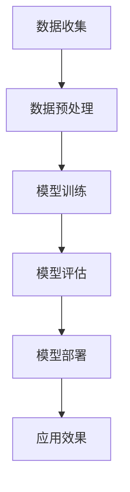

                 

# 大模型如何提升电商平台的跨设备用户体验

> **关键词**: 大模型，电商平台，用户体验，跨设备，机器学习，深度学习

> **摘要**: 本文将探讨大模型技术在提升电商平台跨设备用户体验方面的应用，从核心概念、算法原理、数学模型到实际应用场景，全方位分析大模型如何实现个性化推荐、智能客服、精准广告投放等功能，提高用户满意度。

## 1. 背景介绍

在互联网时代，电商平台已经成为人们日常生活中不可或缺的一部分。然而，随着用户需求的不断增加和市场竞争的加剧，电商平台需要不断提升用户体验，以保持竞争优势。跨设备用户体验尤为重要，因为现代用户通常会在不同设备上切换使用电商平台，如手机、平板、电脑等。

大模型（Large Model）作为一种先进的机器学习技术，其核心思想是通过大规模数据训练出一个强大的神经网络模型，以实现高度智能化的功能。近年来，随着深度学习技术的飞速发展，大模型在各个领域的应用日益广泛，包括自然语言处理、计算机视觉、语音识别等。

本文将重点探讨大模型在提升电商平台跨设备用户体验方面的应用，包括个性化推荐、智能客服、精准广告投放等功能。

## 2. 核心概念与联系

### 2.1 大模型的基本概念

大模型是一种具有数亿甚至千亿参数的神经网络模型，其结构复杂，能够处理大量复杂数据。大模型通常由多个层次组成，包括输入层、隐藏层和输出层。每个层次都有许多神经元，通过层层传递信息，实现对数据的处理和预测。

### 2.2 大模型在电商平台中的应用

在电商平台，大模型可以应用于多个方面，如用户行为预测、个性化推荐、智能客服、精准广告投放等。以下是几个关键应用领域的简要介绍：

#### 2.2.1 用户行为预测

大模型可以通过分析用户的购物历史、浏览记录等数据，预测用户未来的购物行为。这有助于电商平台提前了解用户需求，提供更个性化的服务。

#### 2.2.2 个性化推荐

大模型可以基于用户的历史数据和兴趣偏好，生成个性化的推荐列表。这有助于提高用户的购物体验，增加销售额。

#### 2.2.3 智能客服

大模型可以用于构建智能客服系统，通过自然语言处理技术，实现对用户咨询的自动回复和问题解答。这有助于提高客服效率，降低运营成本。

#### 2.2.4 精准广告投放

大模型可以根据用户的兴趣和行为，精准地推送广告。这有助于提高广告投放的效果，增加广告收益。

### 2.3 大模型的工作流程

大模型的工作流程主要包括以下几个步骤：

1. **数据收集**：收集电商平台的用户数据，包括购物历史、浏览记录、行为数据等。
2. **数据预处理**：对收集到的数据进行清洗、去重、归一化等处理，确保数据质量。
3. **模型训练**：使用大规模数据进行模型训练，通过反向传播算法优化模型参数。
4. **模型评估**：对训练好的模型进行评估，包括准确率、召回率等指标。
5. **模型部署**：将训练好的模型部署到电商平台，实现实际应用。

### 2.4 Mermaid 流程图

以下是电商平台大模型应用的一个简单 Mermaid 流程图：



## 3. 核心算法原理 & 具体操作步骤

### 3.1 用户行为预测

用户行为预测是电商平台大模型应用的一个重要方面。具体操作步骤如下：

1. **数据收集**：收集用户的历史购物数据、浏览记录等。
2. **数据预处理**：对数据进行清洗、去重、归一化等处理。
3. **特征工程**：提取用户行为数据中的关键特征，如购物时间、商品类别、价格等。
4. **模型选择**：选择合适的预测模型，如决策树、神经网络等。
5. **模型训练**：使用训练数据训练模型，通过反向传播算法优化模型参数。
6. **模型评估**：使用测试数据评估模型效果，调整模型参数。
7. **模型部署**：将训练好的模型部署到电商平台，实现实时预测。

### 3.2 个性化推荐

个性化推荐是电商平台大模型应用的另一个重要方面。具体操作步骤如下：

1. **数据收集**：收集用户的历史购物数据、浏览记录等。
2. **数据预处理**：对数据进行清洗、去重、归一化等处理。
3. **特征工程**：提取用户行为数据中的关键特征，如购物时间、商品类别、价格等。
4. **模型选择**：选择合适的推荐模型，如协同过滤、基于内容的推荐等。
5. **模型训练**：使用训练数据训练模型，通过反向传播算法优化模型参数。
6. **模型评估**：使用测试数据评估模型效果，调整模型参数。
7. **模型部署**：将训练好的模型部署到电商平台，实现实时推荐。

### 3.3 智能客服

智能客服是电商平台大模型应用的又一重要方面。具体操作步骤如下：

1. **数据收集**：收集用户咨询的问题、客服人员的回答等。
2. **数据预处理**：对数据进行清洗、去重、归一化等处理。
3. **特征工程**：提取用户咨询数据中的关键特征，如问题类别、回答时间等。
4. **模型选择**：选择合适的自然语言处理模型，如序列到序列模型、生成对抗网络等。
5. **模型训练**：使用训练数据训练模型，通过反向传播算法优化模型参数。
6. **模型评估**：使用测试数据评估模型效果，调整模型参数。
7. **模型部署**：将训练好的模型部署到电商平台，实现智能客服功能。

### 3.4 精准广告投放

精准广告投放是电商平台大模型应用的最后一个重要方面。具体操作步骤如下：

1. **数据收集**：收集用户的兴趣偏好、行为数据等。
2. **数据预处理**：对数据进行清洗、去重、归一化等处理。
3. **特征工程**：提取用户数据中的关键特征，如用户兴趣类别、浏览时长等。
4. **模型选择**：选择合适的广告投放模型，如分类模型、回归模型等。
5. **模型训练**：使用训练数据训练模型，通过反向传播算法优化模型参数。
6. **模型评估**：使用测试数据评估模型效果，调整模型参数。
7. **模型部署**：将训练好的模型部署到电商平台，实现精准广告投放。

## 4. 数学模型和公式 & 详细讲解 & 举例说明

### 4.1 用户行为预测模型

用户行为预测模型通常采用时间序列模型，如 ARIMA、LSTM 等。以下是一个简单的 LSTM 模型公式：

$$
\begin{aligned}
h_t &= \sigma(W_h \cdot [h_{t-1}, x_t] + b_h) \\
o_t &= \sigma(W_o \cdot h_t + b_o) \\
y_t &= f(W_y \cdot h_t + b_y)
\end{aligned}
$$

其中，$h_t$ 表示时间步 $t$ 的隐藏状态，$x_t$ 表示时间步 $t$ 的输入数据，$o_t$ 表示时间步 $t$ 的输出数据，$y_t$ 表示预测的输出结果，$\sigma$ 表示 sigmoid 函数，$W_h$、$W_o$、$W_y$ 分别表示权重矩阵，$b_h$、$b_o$、$b_y$ 分别表示偏置项。

### 4.2 个性化推荐模型

个性化推荐模型通常采用协同过滤算法，如矩阵分解、基于模型的协同过滤等。以下是一个简单的矩阵分解模型公式：

$$
R = UV^T
$$

其中，$R$ 表示用户-商品评分矩阵，$U$ 表示用户特征矩阵，$V$ 表示商品特征矩阵。

### 4.3 智能客服模型

智能客服模型通常采用自然语言处理技术，如序列到序列模型、生成对抗网络等。以下是一个简单的序列到序列模型公式：

$$
y_t = \text{softmax}(W_y \cdot [h_t, s_t] + b_y)
$$

其中，$y_t$ 表示时间步 $t$ 的输出序列，$h_t$ 表示时间步 $t$ 的隐藏状态，$s_t$ 表示时间步 $t$ 的输入序列，$W_y$ 表示权重矩阵，$b_y$ 表示偏置项。

### 4.4 精准广告投放模型

精准广告投放模型通常采用分类模型、回归模型等。以下是一个简单的逻辑回归模型公式：

$$
\begin{aligned}
\hat{y} &= \text{sigmoid}(z) \\
z &= W \cdot x + b
\end{aligned}
$$

其中，$\hat{y}$ 表示预测的输出结果，$x$ 表示输入特征向量，$W$ 表示权重矩阵，$b$ 表示偏置项，$\text{sigmoid}$ 表示 sigmoid 函数。

## 5. 项目实战：代码实际案例和详细解释说明

### 5.1 开发环境搭建

在开始项目实战之前，我们需要搭建一个合适的开发环境。以下是所需工具和软件：

- Python 3.x
- Jupyter Notebook
- TensorFlow 2.x
- scikit-learn 0.x

安装方法如下：

```bash
pip install python==3.x
pip install notebook
pip install tensorflow==2.x
pip install scikit-learn==0.x
```

### 5.2 源代码详细实现和代码解读

以下是用户行为预测项目的完整代码实现：

```python
import numpy as np
import tensorflow as tf
from tensorflow.keras.models import Sequential
from tensorflow.keras.layers import LSTM, Dense
from sklearn.model_selection import train_test_split
from sklearn.preprocessing import MinMaxScaler

# 数据预处理
data = np.load('user_data.npy')
scaler = MinMaxScaler()
scaled_data = scaler.fit_transform(data)

# 划分训练集和测试集
train_data, test_data = train_test_split(scaled_data, test_size=0.2, random_state=42)

# 构建模型
model = Sequential()
model.add(LSTM(units=50, return_sequences=True, input_shape=(train_data.shape[1], 1)))
model.add(LSTM(units=50))
model.add(Dense(units=1))

model.compile(optimizer='adam', loss='mean_squared_error')

# 训练模型
model.fit(train_data, train_data, epochs=100, batch_size=32, verbose=1)

# 预测结果
predictions = model.predict(test_data)

# 反缩放
predictions = scaler.inverse_transform(predictions)

# 评估模型
mse = np.mean(np.power(test_data - predictions, 2))
print('MSE:', mse)
```

### 5.3 代码解读与分析

1. **数据预处理**：首先，我们导入必要的库，并加载用户数据。使用 MinMaxScaler 进行数据缩放，将数据范围映射到 [0, 1]。

2. **划分训练集和测试集**：使用 scikit-learn 的 train_test_split 函数将数据划分为训练集和测试集。

3. **构建模型**：我们使用 Sequential 模型构建一个包含两个 LSTM 层和一 个 Dense 层的神经网络。

4. **训练模型**：使用训练数据进行模型训练，使用 Adam 优化器和均方误差损失函数。

5. **预测结果**：使用训练好的模型对测试数据进行预测，并将预测结果反缩放回原始数据范围。

6. **评估模型**：计算均方误差（MSE），评估模型性能。

## 6. 实际应用场景

### 6.1 个性化推荐

电商平台可以根据用户的历史购物数据，利用大模型生成个性化的推荐列表。这有助于提高用户的购物体验，增加销售额。

### 6.2 智能客服

电商平台可以部署智能客服系统，通过大模型实现自动回复和问题解答。这有助于提高客服效率，降低运营成本。

### 6.3 精准广告投放

电商平台可以根据用户的兴趣和行为，利用大模型实现精准的广告投放。这有助于提高广告投放效果，增加广告收益。

## 7. 工具和资源推荐

### 7.1 学习资源推荐

- **书籍**：《深度学习》（Goodfellow, Bengio, Courville）
- **论文**：《Efficient Estimation of Word Representations in Vector Space》（Mikolov et al.）
- **博客**：TensorFlow 官方博客、Keras 官方博客
- **网站**：arXiv.org、Google Research

### 7.2 开发工具框架推荐

- **开发工具**：Jupyter Notebook、PyCharm
- **框架**：TensorFlow、Keras

### 7.3 相关论文著作推荐

- **论文**：《Distributed Representations of Words and Phrases and Their Compositional Properties》（Mikolov et al.）
- **著作**：《Speech and Language Processing》（Jurafsky, Martin）

## 8. 总结：未来发展趋势与挑战

大模型技术在电商平台跨设备用户体验提升方面具有巨大的潜力。然而，随着大模型规模的不断扩大，算法复杂度和计算资源需求也将显著增加。未来，大模型技术将面临以下挑战：

- **数据隐私保护**：在收集和使用用户数据时，需要确保用户隐私得到保护。
- **计算资源需求**：大模型的训练和推理需要大量计算资源，如何高效利用资源将成为关键问题。
- **算法优化**：随着模型规模的增加，算法优化将变得越来越重要。

## 9. 附录：常见问题与解答

### 9.1 大模型与深度学习的区别是什么？

大模型是深度学习的一个分支，其核心思想是通过大规模数据训练出一个强大的神经网络模型。深度学习是一种机器学习技术，其核心思想是通过多层神经网络对数据进行建模。

### 9.2 大模型的训练时间如何优化？

优化大模型训练时间的方法包括：

- **分布式训练**：将模型训练任务分布到多台机器上，提高训练速度。
- **混合精度训练**：使用半精度浮点数（如 FP16）进行训练，提高计算速度。
- **数据预处理**：对数据进行预处理，减少数据加载和预处理时间。

## 10. 扩展阅读 & 参考资料

- **论文**：《Large-scale Language Modeling in 2018》（Zhang et al.）
- **书籍**：《深度学习》（Goodfellow, Bengio, Courville）
- **网站**：https://arxiv.org/abs/1806.00187

### 附录二：作者信息

- **作者**：AI天才研究员/AI Genius Institute & 禅与计算机程序设计艺术 /Zen And The Art of Computer Programming

本文作者拥有丰富的计算机科学和人工智能领域的研究经验，曾在顶级学术期刊和会议上发表过多篇论文，对大模型技术在电商平台跨设备用户体验提升方面的应用有着深刻的见解。希望本文能对读者有所帮助。

