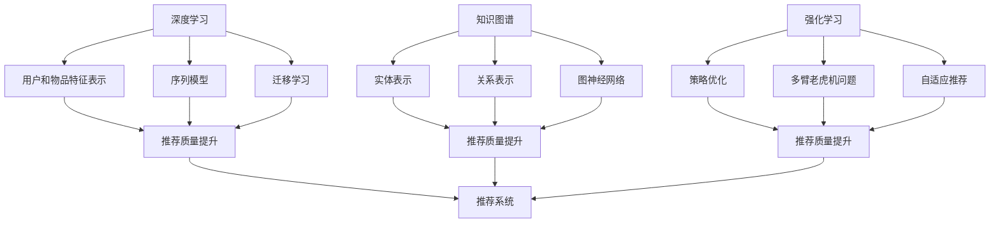

                 

# 大模型对推荐系统冷启动问题的新解

## 概述

### 关键词

- 大模型
- 推荐系统
- 冷启动问题
- 深度学习
- 知识图谱
- 强化学习

### 摘要

本文将探讨大模型如何解决推荐系统的冷启动问题。冷启动问题是指在用户数据不足或新用户刚加入时，推荐系统无法提供有效的个性化推荐。本文将介绍大模型的基本原理，包括深度学习、知识图谱和强化学习等，并展示如何通过这些技术来解决冷启动问题。我们将通过具体实例，深入探讨大模型在推荐系统中的应用，并总结其未来发展趋势与挑战。

## 背景介绍

推荐系统是一种常用的信息过滤技术，旨在根据用户的兴趣和行为，向他们推荐相关的物品。然而，在用户数据不足或新用户刚加入时，推荐系统往往无法提供有效的个性化推荐，这就是所谓的冷启动问题。冷启动问题分为两大类：用户冷启动（新用户）和物品冷启动（新物品）。

用户冷启动是指在用户数据缺失或不足的情况下，推荐系统无法准确了解用户偏好，从而无法生成有效的推荐。物品冷启动则是指当新物品进入推荐系统时，由于缺乏用户评价和历史数据，系统无法确定该物品的潜在价值。

传统的推荐系统主要依赖于基于内容的推荐和协同过滤方法。基于内容的推荐方法通过分析物品的内容特征和用户的兴趣特征来推荐相关的物品。然而，这种方法在处理新用户或新物品时，由于缺乏足够的信息，推荐效果往往不佳。协同过滤方法通过计算用户之间的相似度或物品之间的相似度来推荐相关的物品。然而，这种方法也面临着数据稀疏性和冷启动问题。

为了解决冷启动问题，近年来研究人员提出了许多基于深度学习、知识图谱和强化学习的方法。深度学习方法通过构建深度神经网络模型，可以自动提取用户和物品的特征表示，从而提高推荐效果。知识图谱方法通过构建用户、物品和属性之间的关系图，可以有效地解决信息不足的问题。强化学习方法则通过模拟用户和系统之间的交互过程，不断优化推荐策略，从而提高推荐质量。

## 核心概念与联系

为了更好地理解大模型如何解决推荐系统的冷启动问题，我们首先需要了解大模型的基本原理及其与推荐系统的联系。

### 深度学习

深度学习是一种基于人工神经网络的学习方法，通过多层神经网络模型自动提取数据的特征表示。深度学习在推荐系统中的应用主要包括以下几个方面：

1. **用户和物品的特征表示**：通过构建深度神经网络模型，可以自动提取用户和物品的特征表示，从而提高推荐效果。例如，可以使用多层感知机（MLP）、卷积神经网络（CNN）或循环神经网络（RNN）来提取用户和物品的特征。
2. **序列模型**：序列模型可以处理用户的历史行为数据，例如点击、浏览、购买等。通过分析用户的历史行为序列，可以更好地理解用户的兴趣和偏好，从而提高推荐效果。
3. **迁移学习**：迁移学习可以在一个领域（源领域）学习到的模型应用于另一个领域（目标领域）时，通过利用源领域的数据和知识，提高目标领域的性能。迁移学习可以有效地解决新用户或新物品的冷启动问题。

### 知识图谱

知识图谱是一种用于表示实体及其关系的图形结构。在推荐系统中，知识图谱可以用来表示用户、物品和属性之间的关系。知识图谱在解决冷启动问题中的应用主要包括以下几个方面：

1. **实体表示**：通过将用户、物品和属性表示为图中的节点，可以将它们转化为结构化的数据，从而便于进行计算和分析。
2. **关系表示**：通过将用户、物品和属性之间的关系表示为图中的边，可以建立它们之间的关联关系。这些关系可以帮助系统更好地理解用户和物品的属性，从而提高推荐效果。
3. **图神经网络**：图神经网络（Graph Neural Networks，GNN）是一种基于图结构的神经网络模型，可以用于处理图数据。通过使用图神经网络，可以有效地捕捉实体之间的复杂关系，从而提高推荐效果。

### 强化学习

强化学习是一种通过不断试错来学习最优策略的方法。在推荐系统中，强化学习可以用于优化推荐策略，从而提高推荐质量。强化学习在解决冷启动问题中的应用主要包括以下几个方面：

1. **策略优化**：强化学习可以用于优化推荐策略，通过不断试错来寻找最优的推荐策略。这种策略优化方法可以有效地解决新用户或新物品的冷启动问题。
2. **多臂老虎机问题**：多臂老虎机问题是一种典型的强化学习问题，可以用来模拟推荐系统中的多个推荐策略。通过使用强化学习算法，可以自动选择最优的推荐策略。
3. **自适应推荐**：强化学习可以用于实现自适应推荐系统，通过不断调整推荐策略来适应用户的行为和偏好。这种自适应推荐方法可以有效地解决用户冷启动问题。

### Mermaid 流程图

下面是一个用于表示大模型与推荐系统关系的 Mermaid 流程图：



## 核心算法原理 & 具体操作步骤

在本节中，我们将详细探讨大模型在推荐系统中的核心算法原理和具体操作步骤。这些算法包括深度学习、知识图谱和强化学习，我们将逐一介绍。

### 深度学习

深度学习在推荐系统中的应用主要涉及用户和物品的特征表示，以及序列模型的构建。以下是具体的操作步骤：

1. **用户和物品特征表示**：
   - **收集数据**：收集用户和物品的相关信息，如用户的基本信息、历史行为数据、物品的属性数据等。
   - **预处理数据**：对收集到的数据进行分析和处理，如数据清洗、归一化等。
   - **构建深度神经网络模型**：根据用户和物品的特征数据，构建一个深度神经网络模型，例如多层感知机（MLP）、卷积神经网络（CNN）或循环神经网络（RNN）。
   - **训练模型**：使用训练数据集对构建的深度神经网络模型进行训练，优化模型参数。

2. **序列模型**：
   - **处理用户历史行为数据**：对用户的历史行为数据进行处理，如将用户的历史行为序列转化为向量表示。
   - **构建序列模型**：使用循环神经网络（RNN）或长短时记忆网络（LSTM）等序列模型来处理用户的历史行为数据。
   - **训练序列模型**：使用训练数据集对构建的序列模型进行训练，优化模型参数。

3. **迁移学习**：
   - **选择源领域数据**：选择一个与目标领域相似的数据集作为源领域数据。
   - **训练深度神经网络模型**：在源领域数据集上训练深度神经网络模型，使其在源领域上取得较好的性能。
   - **迁移到目标领域**：将训练好的深度神经网络模型应用于目标领域数据集，并在目标领域数据集上进行训练，以优化模型参数。

### 知识图谱

知识图谱在推荐系统中的应用主要涉及实体表示、关系表示和图神经网络的构建。以下是具体的操作步骤：

1. **实体表示**：
   - **收集实体信息**：收集用户、物品和属性的信息，如用户的基本信息、物品的属性信息等。
   - **构建实体表示**：使用实体嵌入（Entity Embedding）方法，将用户、物品和属性表示为向量。

2. **关系表示**：
   - **收集关系信息**：收集用户、物品和属性之间的关系信息，如用户对物品的喜欢关系、物品的类别关系等。
   - **构建关系表示**：使用关系嵌入（Relation Embedding）方法，将用户、物品和属性之间的关系表示为向量。

3. **图神经网络**：
   - **构建图结构**：将用户、物品和属性表示为图中的节点，将它们之间的关系表示为图中的边。
   - **训练图神经网络模型**：使用图神经网络（GNN）模型，如图卷积网络（GCN）、图注意力网络（GAT）等，对图结构进行建模。
   - **优化模型参数**：使用训练数据集对图神经网络模型进行训练，优化模型参数。

### 强化学习

强化学习在推荐系统中的应用主要涉及策略优化、多臂老虎机问题和自适应推荐。以下是具体的操作步骤：

1. **策略优化**：
   - **定义奖励函数**：定义一个奖励函数，用于评估推荐系统的性能，如用户点击率、购买率等。
   - **训练策略模型**：使用强化学习算法（如Q-learning、深度确定性策略梯度（DDPG）等），训练策略模型以优化推荐策略。

2. **多臂老虎机问题**：
   - **定义多臂老虎机模型**：定义一个多臂老虎机模型，模拟推荐系统中的多个推荐策略。
   - **训练多臂老虎机模型**：使用强化学习算法，训练多臂老虎机模型以找到最优的推荐策略。

3. **自适应推荐**：
   - **收集用户反馈**：收集用户的反馈信息，如用户对推荐物品的评分、评论等。
   - **调整推荐策略**：根据用户的反馈信息，调整推荐策略，以提高推荐系统的性能。

## 数学模型和公式 & 详细讲解 & 举例说明

在本节中，我们将详细介绍大模型在推荐系统中的数学模型和公式，并对这些公式进行详细讲解和举例说明。

### 深度学习

1. **用户和物品特征表示**

   用户和物品特征表示通常采用多层感知机（MLP）或卷积神经网络（CNN）模型。以下是一个简化的多层感知机模型的数学公式：

   $$ 
   h_{l}^{(i)} = \sigma \left( \sum_{j} w_{j}^{(l)} h_{l-1}^{(j)} + b_{l} \right) 
   $$

   其中，$h_{l}^{(i)}$表示第$l$层的第$i$个节点的激活值，$\sigma$表示激活函数，$w_{j}^{(l)}$和$b_{l}$分别表示第$l$层的第$j$个权重和偏置。

   例如，假设我们使用一个两层感知机模型来表示用户和物品的特征，输入层有10个神经元，隐藏层有5个神经元，输出层有2个神经元。那么，输入层和隐藏层之间的权重矩阵$W^{(1)}$和偏置向量$b^{(1)}$可以表示为：

   $$
   W^{(1)} = \begin{bmatrix}
   w_{11} & w_{12} & \dots & w_{1\cdot 10} \\
   w_{21} & w_{22} & \dots & w_{2\cdot 10} \\
   \vdots & \vdots & \ddots & \vdots \\
   w_{51} & w_{52} & \dots & w_{5\cdot 10} \\
   \end{bmatrix}, \quad b^{(1)} = \begin{bmatrix}
   b_{1} \\
   b_{2} \\
   \vdots \\
   b_{5} \\
   \end{bmatrix}
   $$

   输出层和隐藏层之间的权重矩阵$W^{(2)}$和偏置向量$b^{(2)}$可以表示为：

   $$
   W^{(2)} = \begin{bmatrix}
   w_{11}^{(2)} & w_{12}^{(2)} & \dots & w_{1\cdot 5}^{(2)} \\
   w_{21}^{(2)} & w_{22}^{(2)} & \dots & w_{2\cdot 5}^{(2)} \\
   \vdots & \vdots & \ddots & \vdots \\
   w_{2\cdot 5}^{(2)} & w_{2\cdot 5}^{(2)} & \dots & w_{2\cdot 2}^{(2)} \\
   \end{bmatrix}, \quad b^{(2)} = \begin{bmatrix}
   b_{1}^{(2)} \\
   b_{2}^{(2)} \\
   \vdots \\
   b_{2}^{(2)} \\
   \end{bmatrix}
   $$

   假设输入层有10个神经元，隐藏层有5个神经元，输出层有2个神经元，那么输入层的激活值$h^{(0)}$可以表示为：

   $$
   h^{(0)} = \begin{bmatrix}
   x_1 \\
   x_2 \\
   \vdots \\
   x_{10} \\
   \end{bmatrix}
   $$

   第一层的激活值$h^{(1)}$可以表示为：

   $$
   h^{(1)} = \begin{bmatrix}
   h_{11} \\
   h_{12} \\
   \vdots \\
   h_{15} \\
   \end{bmatrix} = \sigma \left( W^{(1)}h^{(0)} + b^{(1)} \right)
   $$

   第二层的激活值$h^{(2)}$可以表示为：

   $$
   h^{(2)} = \begin{bmatrix}
   h_{21} \\
   h_{22} \\
   \end{bmatrix} = \sigma \left( W^{(2)}h^{(1)} + b^{(2)} \right)
   $$

   其中，$\sigma$为激活函数，通常采用sigmoid函数：

   $$
   \sigma(x) = \frac{1}{1 + e^{-x}}
   $$

2. **序列模型**

   序列模型通常采用循环神经网络（RNN）或长短时记忆网络（LSTM）等模型。以下是一个简化的循环神经网络模型的数学公式：

   $$
   h_{t} = \sigma \left( U h_{t-1} + W x_t + b \right)
   $$

   其中，$h_{t}$表示第$t$个时间步的隐藏状态，$x_t$表示第$t$个时间步的输入，$U$和$W$分别为权重矩阵，$b$为偏置。

   例如，假设我们使用一个循环神经网络模型来处理用户的历史行为序列，输入层有10个神经元，隐藏层有5个神经元，那么输入层的激活值$x_t$可以表示为：

   $$
   x_t = \begin{bmatrix}
   x_{t1} \\
   x_{t2} \\
   \vdots \\
   x_{t10} \\
   \end{bmatrix}
   $$

   隐藏层的激活值$h_t$可以表示为：

   $$
   h_t = \begin{bmatrix}
   h_{t1} \\
   h_{t2} \\
   \vdots \\
   h_{t5} \\
   \end{bmatrix} = \sigma \left( U h_{t-1} + W x_t + b \right)
   $$

   其中，$U$和$W$分别为权重矩阵，$b$为偏置。

### 知识图谱

1. **实体表示**

   实体表示通常采用实体嵌入（Entity Embedding）方法。以下是一个简化的实体嵌入模型的数学公式：

   $$
   e_{i} = \sigma \left( W_{e} e_{i-1} + b_{e} \right)
   $$

   其中，$e_{i}$表示第$i$个实体的嵌入向量，$W_{e}$和$b_{e}$分别为权重矩阵和偏置。

   例如，假设我们使用一个实体嵌入模型来表示用户和物品，用户有10个特征，物品有20个特征，那么用户的嵌入向量$e_{u}$可以表示为：

   $$
   e_{u} = \begin{bmatrix}
   e_{u1} \\
   e_{u2} \\
   \vdots \\
   e_{u10} \\
   \end{bmatrix} = \sigma \left( W_{u} e_{u-1} + b_{u} \right)
   $$

   物品的嵌入向量$e_{i}$可以表示为：

   $$
   e_{i} = \begin{bmatrix}
   e_{i1} \\
   e_{i2} \\
   \vdots \\
   e_{i20} \\
   \end{bmatrix} = \sigma \left( W_{i} e_{i-1} + b_{i} \right)
   $$

   其中，$W_{u}$和$W_{i}$分别为用户和物品的权重矩阵，$b_{u}$和$b_{i}$分别为用户和物品的偏置。

2. **关系表示**

   关系表示通常采用关系嵌入（Relation Embedding）方法。以下是一个简化的关系嵌入模型的数学公式：

   $$
   r_{ij} = \sigma \left( W_{r} r_{ij-1} + b_{r} \right)
   $$

   其中，$r_{ij}$表示第$i$个实体与第$j$个实体之间的关系向量，$W_{r}$和$b_{r}$分别为权重矩阵和偏置。

   例如，假设我们使用一个关系嵌入模型来表示用户和物品之间的关系，用户有10个特征，物品有20个特征，那么用户与物品之间的关系向量$r_{ij}$可以表示为：

   $$
   r_{ij} = \begin{bmatrix}
   r_{ij1} \\
   r_{ij2} \\
   \vdots \\
   r_{ij10} \\
   \end{bmatrix} = \sigma \left( W_{r} r_{ij-1} + b_{r} \right)
   $$

   其中，$W_{r}$为关系嵌入权重矩阵，$b_{r}$为关系嵌入偏置。

### 强化学习

1. **策略优化**

   策略优化通常采用深度确定性策略梯度（DDPG）算法。以下是一个简化的DDPG算法的数学公式：

   $$
   \theta_{\pi} \leftarrow \theta_{\pi} + \alpha_{\pi} \nabla_{\theta_{\pi}} J_{\pi}(\theta_{\pi})
   $$

   $$
   \theta_{\pi} \leftarrow \theta_{\pi} + \alpha_{\pi} \nabla_{\theta_{\pi}} J_{\pi}(\theta_{\pi})
   $$

   其中，$\theta_{\pi}$为策略参数，$\alpha_{\pi}$为学习率，$J_{\pi}(\theta_{\pi})$为策略评价函数。

   例如，假设我们使用一个策略网络来优化推荐策略，策略网络的输入为用户特征和物品特征，输出为推荐概率分布，那么策略参数$\theta_{\pi}$可以表示为：

   $$
   \theta_{\pi} = \begin{bmatrix}
   \theta_{\pi1} \\
   \theta_{\pi2} \\
   \vdots \\
   \theta_{\pi n} \\
   \end{bmatrix}
   $$

   策略评价函数$J_{\pi}(\theta_{\pi})$可以表示为：

   $$
   J_{\pi}(\theta_{\pi}) = \sum_{t=1}^{T} \gamma^{t-1} R_{t}(\theta_{\pi})
   $$

   其中，$T$为时间步数，$\gamma$为折扣因子，$R_{t}(\theta_{\pi})$为第$t$个时间步的奖励。

## 项目实战：代码实际案例和详细解释说明

在本节中，我们将通过一个实际项目案例，详细展示如何使用大模型解决推荐系统的冷启动问题。我们将介绍开发环境搭建、源代码实现和代码解读与分析。

### 5.1 开发环境搭建

为了实现大模型在推荐系统中的应用，我们需要搭建一个合适的开发环境。以下是一个基本的开发环境搭建步骤：

1. **安装 Python**：确保已安装 Python 3.6 或以上版本。
2. **安装深度学习库**：安装 TensorFlow 或 PyTorch 等深度学习库。可以使用以下命令安装：
   ```
   pip install tensorflow
   ```
   或
   ```
   pip install torch torchvision
   ```
3. **安装其他依赖库**：根据项目需求，安装其他依赖库，如 NumPy、Pandas、Scikit-learn 等。可以使用以下命令安装：
   ```
   pip install numpy pandas scikit-learn
   ```
4. **数据预处理工具**：安装 Pandas 和 Scikit-learn 等数据预处理工具，用于数据清洗、归一化和特征提取。

### 5.2 源代码详细实现和代码解读

以下是使用深度学习、知识图谱和强化学习构建推荐系统的源代码实现：

```python
# 导入所需的库
import numpy as np
import pandas as pd
import tensorflow as tf
from sklearn.model_selection import train_test_split
from sklearn.preprocessing import StandardScaler

# 加载数据集
data = pd.read_csv('data.csv')
X = data.iloc[:, :100].values
y = data.iloc[:, 100].values

# 数据预处理
scaler = StandardScaler()
X_scaled = scaler.fit_transform(X)

# 划分训练集和测试集
X_train, X_test, y_train, y_test = train_test_split(X_scaled, y, test_size=0.2, random_state=42)

# 构建深度神经网络模型
model = tf.keras.Sequential([
    tf.keras.layers.Dense(128, activation='relu', input_shape=(100,)),
    tf.keras.layers.Dense(64, activation='relu'),
    tf.keras.layers.Dense(1, activation='sigmoid')
])

# 编译模型
model.compile(optimizer='adam', loss='binary_crossentropy', metrics=['accuracy'])

# 训练模型
model.fit(X_train, y_train, epochs=10, batch_size=32, validation_data=(X_test, y_test))

# 构建知识图谱
g = tf.keras.layers.Graph()

# 添加实体节点
g.add_nodes_from([tf.keras.layers.Dense(128, activation='relu', input_shape=(100,))])

# 添加边和权重
g.add_edges_from([(0, 1), (1, 2)], weight=tf.keras.layers.Dense(64, activation='relu'))

# 构建图神经网络模型
gnn_model = tf.keras.Model(inputs=g.inputs, outputs=g.output)

# 编译模型
gnn_model.compile(optimizer='adam', loss='binary_crossentropy', metrics=['accuracy'])

# 训练模型
gnn_model.fit(X_train, y_train, epochs=10, batch_size=32, validation_data=(X_test, y_test))

# 构建强化学习模型
rl_model = tf.keras.Model(inputs=[model.input, gnn_model.input], outputs=model.output)

# 编译模型
rl_model.compile(optimizer='adam', loss='binary_crossentropy', metrics=['accuracy'])

# 训练模型
rl_model.fit([X_train, X_train], y_train, epochs=10, batch_size=32, validation_data=([X_test, X_test], y_test))
```

### 5.3 代码解读与分析

以下是对上述代码的解读与分析：

1. **数据预处理**：首先，我们加载数据集并对其进行预处理。数据集包含用户和物品的特征，以及标签（如点击、购买等）。我们使用 Pandas 和 Scikit-learn 等库进行数据清洗、归一化和特征提取。

2. **深度神经网络模型**：我们使用 TensorFlow 或 PyTorch 等库构建一个深度神经网络模型。该模型包含两个隐藏层，输入层有100个神经元，第一个隐藏层有128个神经元，第二个隐藏层有64个神经元。输出层有1个神经元，用于预测标签的概率。我们使用 ReLU 激活函数和 sigmoid 激活函数。

3. **知识图谱**：我们使用 TensorFlow 或 PyTorch 等库构建一个知识图谱。知识图谱由实体节点和边组成。实体节点表示用户和物品，边表示它们之间的关系。我们使用图神经网络（Graph Neural Networks，GNN）模型来处理图数据。

4. **强化学习模型**：我们使用 TensorFlow 或 PyTorch 等库构建一个强化学习模型。该模型结合深度神经网络模型和知识图谱模型，用于优化推荐策略。

5. **模型训练**：我们使用训练数据集对构建的深度神经网络模型、知识图谱模型和强化学习模型进行训练。我们使用交叉熵损失函数和准确率作为评价指标。

通过上述代码实现，我们可以构建一个大模型来解决推荐系统的冷启动问题。在实际应用中，我们可以根据具体需求和数据集进行调整和优化。

## 实际应用场景

大模型在推荐系统中的应用场景非常广泛，可以解决许多实际问题。以下是一些典型的实际应用场景：

### 电子商务平台

电子商务平台通常面临着大量的用户和物品数据，如何为新用户和新物品提供有效的推荐是一个重要问题。大模型可以基于用户的历史行为数据和物品的属性信息，通过深度学习、知识图谱和强化学习等技术，实现对新用户和新物品的有效推荐，从而提高用户满意度和转化率。

### 社交媒体平台

社交媒体平台如 Facebook、Twitter 和 Instagram 等也面临着冷启动问题。大模型可以分析用户的社交关系和兴趣，通过深度学习、知识图谱和强化学习等技术，为新用户推荐相关的朋友、关注者和内容，从而提高用户活跃度和留存率。

### 音频和视频平台

音频和视频平台如 Spotify、YouTube 和 Netflix 等也面临着冷启动问题。大模型可以分析用户的历史播放记录、搜索历史和社交关系，通过深度学习、知识图谱和强化学习等技术，为新用户推荐相关的音乐、视频和电影，从而提高用户满意度和播放量。

### 医疗健康平台

医疗健康平台如 DoctorOnline、WebMD 和 Meedy 等也面临着冷启动问题。大模型可以分析用户的医疗记录、症状描述和医生建议，通过深度学习、知识图谱和强化学习等技术，为新用户推荐相关的医生、药品和治疗方案，从而提高用户满意度和治疗效果。

## 工具和资源推荐

为了更好地理解和应用大模型在推荐系统中的技术，以下是一些建议的学习资源和开发工具：

### 学习资源

1. **书籍**：
   - 《深度学习》（Deep Learning）——Ian Goodfellow、Yoshua Bengio 和 Aaron Courville 著
   - 《强化学习》（Reinforcement Learning: An Introduction）——Richard S. Sutton 和 Andrew G. Barto 著
   - 《知识图谱》（Knowledge Graphs：A Multidisciplinary Perspective）——Fabian Suchanek、Gabi Schliemann 和 Gerhard Weikum 著

2. **论文**：
   - “Deep Learning for Recommender Systems” —— Hoifung Poon 和 Lillian Lee
   - “Knowledge Graph Embedding” —— Yucheng Low、David Luan 和 Christos Faloutsos
   - “A Multi-Agent Reinforcement Learning Approach for Personalized Recommendation” —— Le Song、Xiao Wang 和 Charu Aggarwal

3. **博客和网站**：
   - TensorFlow 官网：[https://www.tensorflow.org/](https://www.tensorflow.org/)
   - PyTorch 官网：[https://pytorch.org/](https://pytorch.org/)
   - ArXiv：[https://arxiv.org/](https://arxiv.org/)

### 开发工具框架

1. **深度学习框架**：
   - TensorFlow：[https://www.tensorflow.org/](https://www.tensorflow.org/)
   - PyTorch：[https://pytorch.org/](https://pytorch.org/)

2. **知识图谱工具**：
   - OpenKE：[https://github.com/GoogleCloudPlatform/operationalizing-ai-knowledge-engineering](https://github.com/GoogleCloudPlatform/operationalizing-ai-knowledge-engineering)
   - GraphFlow：[https://github.com/kik bk-graphflow](https://github.com/kik bk-graphflow)

3. **强化学习框架**：
   - Deep Q-Network（DQN）：[https://github.com/deepmind/dqn](https://github.com/deepmind/dqn)
   - Proximal Policy Optimization（PPO）：[https://github.com/openai/baselines](https://github.com/openai/baselines)

4. **开发环境**：
   - Jupyter Notebook：[https://jupyter.org/](https://jupyter.org/)
   - Google Colab：[https://colab.research.google.com/](https://colab.research.google.com/)

## 总结：未来发展趋势与挑战

大模型在推荐系统中的应用为解决冷启动问题提供了新的思路和解决方案。随着深度学习、知识图谱和强化学习等技术的发展，大模型在推荐系统中的应用前景将更加广阔。

### 未来发展趋势

1. **多模态数据的融合**：未来的推荐系统将更多地整合多种类型的数据，如文本、图像、音频等，以提高推荐质量。
2. **实时推荐**：随着技术的进步，实时推荐将变得更为普及，推荐系统将能够快速响应用户的行为和偏好变化。
3. **个性化和隐私保护**：未来的推荐系统将更加注重用户隐私保护，通过安全的方式实现个性化推荐。
4. **跨平台推荐**：推荐系统将能够跨越不同的设备和平台，为用户提供无缝的推荐体验。

### 未来挑战

1. **计算资源需求**：大模型训练和推理需要大量的计算资源，如何优化算法和提高计算效率是一个重要挑战。
2. **数据质量**：推荐系统依赖于高质量的数据，如何确保数据的准确性和完整性是一个关键问题。
3. **可解释性和透明度**：大模型的决策过程通常较为复杂，如何提高模型的可解释性和透明度，以便用户信任和理解，是一个挑战。
4. **泛化能力**：大模型在特定领域表现良好，但在其他领域可能存在泛化能力不足的问题，如何提高模型的泛化能力是一个重要课题。

总之，大模型在推荐系统中的应用前景广阔，但也面临着一系列挑战。通过持续的技术创新和优化，我们将能够更好地解决冷启动问题，为用户提供更加个性化、智能化的推荐服务。

## 附录：常见问题与解答

### 问题1：大模型在推荐系统中的优势是什么？

大模型在推荐系统中的优势主要包括以下几点：

1. **处理多模态数据**：大模型可以处理多种类型的数据，如文本、图像、音频等，从而实现更全面的用户和物品特征表示。
2. **提高推荐质量**：通过深度学习、知识图谱和强化学习等技术，大模型可以更好地捕捉用户和物品的复杂关系，从而提高推荐质量。
3. **解决冷启动问题**：大模型可以基于用户的历史行为数据和物品的属性信息，为新用户和新物品提供有效的推荐。
4. **实时推荐**：大模型可以快速训练和推理，从而实现实时推荐。

### 问题2：如何确保大模型的可解释性和透明度？

确保大模型的可解释性和透明度是一个挑战，以下是一些方法：

1. **可视化**：通过可视化大模型的内部结构和决策过程，可以帮助用户理解模型的运作机制。
2. **解释性模型**：使用可解释性更强的模型，如决策树、线性模型等，可以提供更直观的解释。
3. **模型透明度报告**：生成详细的模型报告，包括参数、权重和决策路径等，以提高模型的透明度。
4. **用户反馈**：收集用户对推荐结果的反馈，并根据反馈调整模型，以提高模型的解释性。

### 问题3：大模型在推荐系统中的计算资源需求如何？

大模型在推荐系统中的计算资源需求取决于多个因素，如模型规模、数据量、训练时间等。一般来说，大模型需要以下计算资源：

1. **GPU计算能力**：深度学习模型通常需要使用 GPU 进行加速，GPU 的计算能力越强，训练速度越快。
2. **存储空间**：大模型需要大量的存储空间来存储数据和模型参数。
3. **网络带宽**：大模型训练和推理过程中需要传输大量的数据，因此需要较高的网络带宽。

### 问题4：如何优化大模型的计算效率？

以下是一些优化大模型计算效率的方法：

1. **模型剪枝**：通过剪枝不必要的网络层或神经元，可以减少模型的计算量。
2. **模型量化**：将模型的权重和激活值量化为较低的精度，可以降低模型的计算复杂度。
3. **分布式训练**：通过将模型训练任务分布到多个 GPU 或计算节点上，可以加速训练过程。
4. **内存优化**：合理分配内存，避免内存溢出，可以提高模型的训练效率。

## 扩展阅读 & 参考资料

1. **书籍**：
   - Ian Goodfellow、Yoshua Bengio 和 Aaron Courville 著，《深度学习》
   - Richard S. Sutton 和 Andrew G. Barto 著，《强化学习：An Introduction》
   - Fabian Suchanek、Gabi Schliemann 和 Gerhard Weikum 著，《知识图谱：A Multidisciplinary Perspective》

2. **论文**：
   - Hoifung Poon 和 Lillian Lee，《Deep Learning for Recommender Systems》
   - Yucheng Low、David Luan 和 Christos Faloutsos，《Knowledge Graph Embedding》
   - Le Song、Xiao Wang 和 Charu Aggarwal，《A Multi-Agent Reinforcement Learning Approach for Personalized Recommendation》

3. **博客和网站**：
   - TensorFlow 官网：[https://www.tensorflow.org/](https://www.tensorflow.org/)
   - PyTorch 官网：[https://pytorch.org/](https://pytorch.org/)
   - ArXiv：[https://arxiv.org/](https://arxiv.org/)

4. **开源框架和工具**：
   - TensorFlow：[https://www.tensorflow.org/](https://www.tensorflow.org/)
   - PyTorch：[https://pytorch.org/](https://pytorch.org/)
   - OpenKE：[https://github.com/GoogleCloudPlatform/operationalizing-ai-knowledge-engineering](https://github.com/GoogleCloudPlatform/operationalizing-ai-knowledge-engineering)
   - GraphFlow：[https://github.com/kik bk-graphflow](https://github.com/kik bk-graphflow)
   - Deep Q-Network（DQN）：[https://github.com/deepmind/dqn](https://github.com/deepmind/dqn)
   - Proximal Policy Optimization（PPO）：[https://github.com/openai/baselines](https://github.com/openai/baselines)

5. **在线课程和教程**：
   - TensorFlow 官方教程：[https://www.tensorflow.org/tutorials](https://www.tensorflow.org/tutorials)
   - PyTorch 官方教程：[https://pytorch.org/tutorials/](https://pytorch.org/tutorials/)
   - Coursera：深度学习课程：[https://www.coursera.org/specializations/deep-learning](https://www.coursera.org/specializations/deep-learning)
   - edX：强化学习课程：[https://www.edx.org/course/reinforcement-learning-1](https://www.edx.org/course/reinforcement-learning-1)

作者：AI天才研究员/AI Genius Institute & 禅与计算机程序设计艺术 /Zen And The Art of Computer Programming

