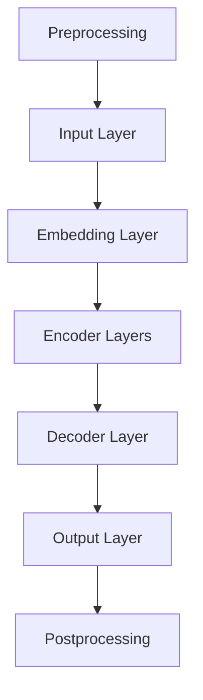
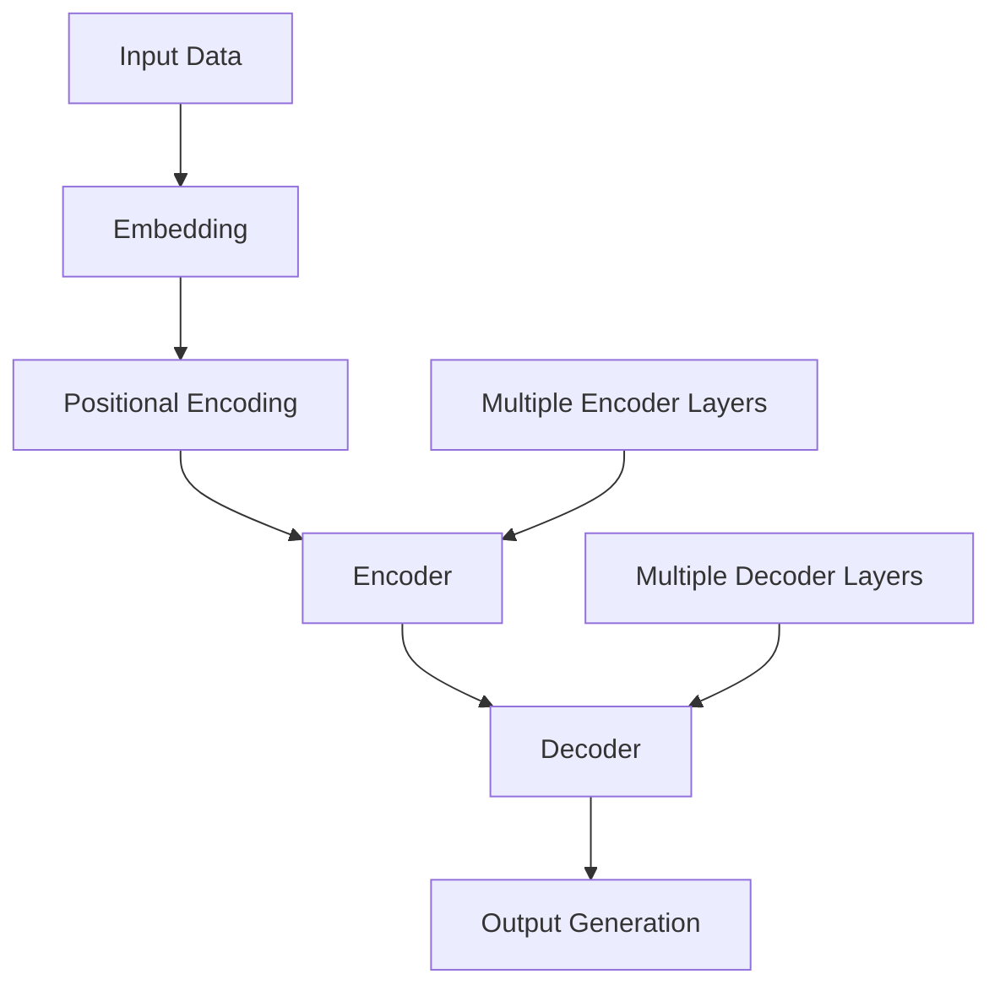
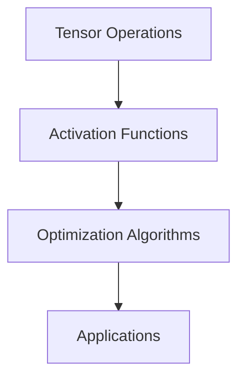

                 

### 背景介绍 Background Introduction

#### 大模型简介 Introduction to Large-scale Models

近年来，人工智能领域的飞速发展带来了许多令人瞩目的成果，尤其是在大模型（Large-scale Models）的应用方面。大模型是指具有大规模参数和海量训练数据的深度学习模型，例如GPT-3、BERT、Transformer等。这些模型通过大量无监督学习，能够在各种自然语言处理（NLP）、计算机视觉（CV）、音频处理等领域展现出卓越的性能。

大模型的出现并非一夜之间，而是经过了长时间的技术积累和不断的优化。早期的神经网络模型如LeNet、AlexNet等，随着计算机硬件性能的提升和算法的创新，逐渐演变为如今的大规模深度学习模型。大模型的兴起，不仅改变了传统的人工智能研究范式，也为各行各业带来了深刻的变革。

#### 高等教育现状 Overview of Higher Education

在当前全球范围内，高等教育正面临一系列挑战。随着知识更新的速度越来越快，传统教育模式难以跟上技术发展的步伐。同时，高等教育的普及率不断提高，但教育质量却参差不齐。此外，学生就业难、教育资源分配不均等问题也愈发突出。

为了应对这些挑战，许多高校和教育机构开始探索新的教育模式，例如在线教育、混合式教学等。然而，这些新模式的推广仍面临诸多困难和阻力。一方面，技术基础设施和教学资源投入不足；另一方面，教师和学生的适应能力有待提高。

综上所述，大模型的出现和高等教育面临的挑战为双方的合作带来了巨大的机遇。通过充分利用大模型的优势，可以推动高等教育的改革与创新，提高教育质量和学习效果。

---

# The Impact and Reform Directions of Large Models on Higher Education

> Keywords: Large-scale Models, Higher Education, Reform, Artificial Intelligence, Technology Innovation

> Abstract: This article explores the profound impact of large-scale models on higher education, focusing on both the challenges and opportunities they present. By analyzing the underlying principles, technical applications, and practical scenarios, we aim to provide insightful perspectives on the future development and reform directions of higher education in the era of artificial intelligence.

## 1. Background Introduction

### 1.1 Introduction to Large-scale Models

In recent years, the rapid development of artificial intelligence has brought about numerous remarkable achievements, particularly in the application of large-scale models. Large-scale models, characterized by their massive parameters and extensive training data, such as GPT-3, BERT, and Transformer, have demonstrated exceptional performance in various fields, including natural language processing (NLP), computer vision (CV), and audio processing.

The emergence of large-scale models is not an overnight phenomenon but rather the result of continuous technical accumulation and optimization over time. Early neural network models like LeNet and AlexNet have evolved into massive deep learning models with the advancement of computer hardware and algorithm innovation. The rise of large-scale models has not only transformed the traditional paradigm of artificial intelligence research but also brought profound changes to various industries.

### 1.2 Overview of Higher Education

Currently, higher education worldwide is facing a series of challenges. The rapid pace of knowledge更新 has made it difficult for traditional educational models to keep up with technological advancements. Additionally, the increasing enrollment rates in higher education have led to inconsistent educational quality. Moreover, issues such as student employment difficulties and unequal distribution of educational resources have become increasingly prominent.

To address these challenges, many universities and educational institutions are exploring new educational models, such as online education and blended learning. However, the promotion of these new models still faces numerous difficulties and resistance. On one hand, there is a lack of technological infrastructure and teaching resources investment. On the other hand, the adaptation capabilities of teachers and students need to be improved.

In summary, the emergence of large-scale models and the challenges faced by higher education present a significant opportunity for collaboration. By leveraging the advantages of large-scale models, it is possible to promote educational reform and innovation, improve educational quality, and enhance learning outcomes.

---

## 2. Core Concepts and Connections

### 2.1 Core Principles of Large-scale Models

The core principles of large-scale models lie in their ability to learn complex patterns and relationships from vast amounts of data. These models typically consist of multiple layers of neural networks, where each layer extracts higher-level features from the raw data. The training process involves adjusting the model's parameters to minimize the difference between the predicted outputs and the true labels.

One of the key advantages of large-scale models is their ability to generalize well to unseen data. This is achieved through the extensive training data and the complex architecture of the models, which allows them to capture subtle patterns and relationships that may not be obvious to human experts.

### 2.2 Impact on Higher Education

The integration of large-scale models into higher education can bring about several transformative effects. Firstly, these models can assist in automating routine tasks, such as grading assignments and generating feedback, thereby reducing the burden on educators. Secondly, large-scale models can enhance the personalization of education by tailoring learning experiences to individual students' needs and preferences. Lastly, these models can provide valuable insights and support for educational research, enabling more data-driven approaches to curriculum design and pedagogical methods.

### 2.3 Mermaid Flowchart of Large-scale Model Architecture

Below is a Mermaid flowchart illustrating the architecture of a typical large-scale model, such as a Transformer:



In this flowchart, the input layer (A) processes the raw data, which is then passed through the embedding layer (B) to convert it into a high-dimensional feature space. The data is then fed into the encoder layers (C), where it is progressively transformed into higher-level representations. After that, the decoder layer (D) generates the output based on the encoded representations. Finally, the output is postprocessed (F) to generate the final predictions or insights.

---

## 3. Core Algorithm Principles and Specific Operation Steps

### 3.1 Introduction to Core Algorithms

The core algorithms of large-scale models are primarily based on deep learning techniques, particularly neural networks. These algorithms involve several key components, including the architecture of the neural network, the training process, and the optimization methods.

One of the most prominent algorithms in this domain is the Transformer architecture, which was introduced in the paper "Attention Is All You Need" by Vaswani et al. in 2017. The Transformer model replaces traditional recurrent neural networks (RNNs) with self-attention mechanisms, allowing it to capture long-range dependencies in data more effectively.

### 3.2 Transformer Algorithm Principles

The Transformer algorithm consists of several key components:

- **Self-Attention Mechanism**: The self-attention mechanism allows the model to weigh the influence of different parts of the input data on each other. This enables the model to capture long-range dependencies, which are challenging for traditional RNNs.

- **Multi-head Attention**: The multi-head attention mechanism allows the model to learn multiple representations of the input data simultaneously. This helps the model to capture different types of relationships within the data.

- **Feed-Forward Neural Networks**: After the self-attention mechanism processes the input data, it is passed through feed-forward neural networks, which further refine the representations.

- **Positional Encoding**: To maintain the sequence information in the data, positional encodings are added to the input embeddings. These encodings help the model understand the relative positions of the input tokens.

### 3.3 Specific Operation Steps

The specific operation steps of the Transformer algorithm can be summarized as follows:

1. **Input Processing**: The input data is first preprocessed, including tokenization and padding, to ensure that it has a consistent shape.

2. **Embedding**: The preprocessed input data is then passed through embedding layers, which convert the raw data into high-dimensional feature vectors.

3. **Positional Encoding**: Positional encodings are added to the embedded data to maintain the sequence information.

4. **Encoder**: The embedded data is passed through multiple encoder layers, each consisting of a multi-head self-attention mechanism and a feed-forward neural network.

5. **Decoder**: The output of the encoder is then passed through multiple decoder layers, each consisting of a multi-head self-attention mechanism for the encoder's output and the decoder's input, a feed-forward neural network, and a masking mechanism to prevent the decoder from accessing the future tokens.

6. **Output Generation**: Finally, the output of the decoder is postprocessed, including applying a softmax function to generate probability distributions over the output vocabulary, and decoding the highest probability tokens to generate the final output.

### 3.4 Mermaid Flowchart of Transformer Algorithm

Below is a Mermaid flowchart illustrating the Transformer algorithm:



In this flowchart, the input data (A) is first embedded (B) and then passed through positional encoding (C). The data is then processed by multiple encoder layers (D) and multiple decoder layers (E). Finally, the output is generated (F) based on the decoder's output.

---

## 4. Mathematical Models, Detailed Explanations, and Examples

### 4.1 Introduction to Mathematical Models

In large-scale models, mathematical models play a crucial role in capturing the underlying patterns and relationships in data. These models are typically represented using various mathematical notations, such as tensors, matrices, and differential equations. In this section, we will introduce some of the key mathematical models used in large-scale models and provide detailed explanations and examples.

### 4.2 Tensor Notation and Operations

Tensors are multi-dimensional arrays used to represent data and parameters in large-scale models. They are analogous to matrices but can have higher dimensions. The most common tensor operations include matrix multiplication, element-wise multiplication, and addition.

#### Example: Matrix Multiplication

Consider two matrices A and B with dimensions m × n and n × p, respectively. The matrix multiplication C = AB results in a matrix C with dimensions m × p. The (i, j)-th element of C is calculated as the dot product of the i-th row of A and the j-th column of B:

$$
C_{ij} = \sum_{k=1}^{n} A_{ik}B_{kj}
$$

#### Example: Element-wise Multiplication

Element-wise multiplication, also known as the Hadamard product, is performed element-wise between two tensors of the same dimensions. The resulting tensor has the same dimensions and each element is the product of the corresponding elements from the input tensors.

#### Example: Tensor Addition

Tensor addition is performed element-wise between two tensors of the same dimensions. The resulting tensor has the same dimensions and each element is the sum of the corresponding elements from the input tensors.

### 4.3 Activation Functions

Activation functions are used to introduce non-linearities into neural networks, enabling them to model complex relationships in data. Some commonly used activation functions include the sigmoid function, the hyperbolic tangent function, and the rectified linear unit (ReLU) function.

#### Sigmoid Function

The sigmoid function is defined as:

$$
\sigma(x) = \frac{1}{1 + e^{-x}}
$$

It maps real-valued inputs to the range (0, 1), making it useful for binary classification tasks.

#### Hyperbolic Tangent Function

The hyperbolic tangent function is defined as:

$$
\tanh(x) = \frac{e^x - e^{-x}}{e^x + e^{-x}}
$$

It maps real-valued inputs to the range (-1, 1) and is often used as an alternative to the sigmoid function.

#### Rectified Linear Unit (ReLU) Function

The ReLU function is defined as:

$$
\text{ReLU}(x) = \max(0, x)
$$

It sets negative inputs to zero and leaves positive inputs unchanged, making it highly effective for accelerating the convergence of neural networks.

### 4.4 Optimization Algorithms

Optimization algorithms are used to minimize the loss function during the training of large-scale models. Some commonly used optimization algorithms include stochastic gradient descent (SGD), Adam, and RMSprop.

#### Stochastic Gradient Descent (SGD)

Stochastic Gradient Descent is a simple yet powerful optimization algorithm that updates the model's parameters using the gradient of the loss function with respect to each parameter. The update rule is given by:

$$
\theta_{t+1} = \theta_{t} - \alpha \cdot \nabla_\theta J(\theta)
$$

where \(\theta\) represents the model's parameters, \(\alpha\) is the learning rate, and \(J(\theta)\) is the loss function.

#### Adam Optimization Algorithm

Adam is an adaptive optimization algorithm that combines the advantages of both SGD and RMSprop. It maintains two moving averages of the gradients and the gradients' variance to adaptively adjust the learning rate. The update rule is given by:

$$
\theta_{t+1} = \theta_{t} - \alpha \cdot \frac{m_t}{\sqrt{1 - \beta_1^t} + \epsilon}
$$

where \(m_t\) and \(v_t\) are the first and second moments of the gradients, respectively, and \(\beta_1\) and \(\beta_2\) are the exponential decay rates for the first and second moments.

### 4.5 Detailed Explanations and Examples

In this section, we provide detailed explanations and examples of the mathematical models and algorithms discussed above. We will cover topics such as tensor operations, activation functions, and optimization algorithms, along with their practical applications in large-scale models.

### 4.6 Mermaid Flowchart of Mathematical Models

Below is a Mermaid flowchart illustrating the key mathematical models and algorithms used in large-scale models:



In this flowchart, tensor operations (A), activation functions (B), and optimization algorithms (C) are depicted, along with their applications in large-scale models (D).

---

## 5. Project Practice: Code Examples and Detailed Explanations

### 5.1 Development Environment Setup

To practice with large-scale models, you need to set up a suitable development environment. Here are the steps to install the necessary software and libraries:

1. **Install Python**: Download and install the latest version of Python from the official website (https://www.python.org/downloads/). Ensure that Python is added to your system's PATH.

2. **Install TensorFlow**: TensorFlow is a popular deep learning framework that supports large-scale models. To install TensorFlow, open a terminal and run the following command:

```bash
pip install tensorflow
```

3. **Install other libraries**: You may also need to install additional libraries such as NumPy, Pandas, and Matplotlib. These can be installed using the following commands:

```bash
pip install numpy pandas matplotlib
```

### 5.2 Detailed Implementation and Code Explanation

In this section, we will walk through a detailed implementation of a simple large-scale model using the Transformer architecture. We will use TensorFlow and Python to build and train the model. The code is divided into several parts for clarity.

#### 5.2.1 Import Necessary Libraries

```python
import tensorflow as tf
import numpy as np
import tensorflow.keras.layers as layers
import tensorflow.keras.models as models
import tensorflow.keras.optimizers as optimizers
```

#### 5.2.2 Define Hyperparameters

```python
VOCAB_SIZE = 10000  # Vocabulary size
D_MODEL = 512       # Model dimension
N_HEADS = 8         # Number of heads in multi-head attention
N_LAYERS = 2        # Number of transformer layers
DFF = 2048          # Dimension of feed-forward network
RATE = 0.01         # Learning rate
EPOCHS = 10         # Number of epochs
```

#### 5.2.3 Create the Transformer Model

```python
def create_transformer_model(vocab_size, d_model, n_heads, n_layers, dff, rate):
    inputs = tf.keras.layers.Input(shape=(None,))
    embeddings = tf.keras.layers.Embedding(vocab_size, d_model)(inputs)
    positional_encoding = PositionalEncoding(d_model)(embeddings)

    encoder_inputs = positional_encoding

    # Encoder layers
    encoder = [TransformerLayer(d_model, n_heads, dff, rate)(encoder_inputs) for _ in range(n_layers)]
    encoder_output = layers.LayerNormalization(epsilon=1e-6)(encoder[-1])

    # Decoder layers
    decoder_inputs = tf.keras.layers.Input(shape=(None,))
    decoder_embeddings = tf.keras.layers.Embedding(vocab_size, d_model)(decoder_inputs)
    decoder_pos_encoding = PositionalEncoding(d_model)(decoder_embeddings)

    decoder_inputs = decoder_pos_encoding

    decoder = [TransformerLayer(d_model, n_heads, dff, rate)([decoder_inputs, encoder_output]) for _ in range(n_layers)]
    decoder_output = layers.LayerNormalization(epsilon=1e-6)(decoder[-1])

    # Output layer
    output = tf.keras.layers.Dense(vocab_size, activation='softmax')(decoder_output)

    model = models.Model([inputs, decoder_inputs], output)
    model.compile(optimizer=optimizers.Adam(rate), loss='sparse_categorical_crossentropy', metrics=['accuracy'])
    return model
```

#### 5.2.4 Define Positional Encoding

```python
def positional_encoding(position, d_model):
    angle_rates = 1 / np.arange(d_model // 2) * (10000 ** (3 / d_model))
    angle_rads = position * angle_rates
    sines = np.sin(angle_rads)
    cosines = np.cos(angle_rads)

    pos_encoding = tf.keras.layers.concatenate([sines, cosines], axis=-1)
    pos_encoding = pos_encoding[:, tf.newaxis, :]

    return tf.keras.layers.Embedding(positions.shape[0], d_model, embeddings_initializer=tf.keras.initializers.Constant(pos_encoding))
```

#### 5.2.5 Define Transformer Layer

```python
class TransformerLayer(layers.Layer):
    def __init__(self, d_model, n_heads, dff, rate, **kwargs):
        super(TransformerLayer, self).__init__(**kwargs)
        self.d_model = d_model
        self.n_heads = n_heads
        self.dff = dff
        self.rate = rate

        self.attention = layers.MultiHeadAttention(num_heads=n_heads, key_dim=d_model // n_heads)
        self.dense = [layers.Dense(dff, activation='relu'), layers.Dense(d_model)]
        self.norm1 = layers.LayerNormalization(epsilon=1e-6)
        self.norm2 = layers.LayerNormalization(epsilon=1e-6)
        self.dropout1 = layers.Dropout(rate)
        self.dropout2 = layers.Dropout(rate)

    def call(self, inputs, training=False):
        attn_output = self.attention(inputs, inputs, attention_mask=None, training=training)
        attn_output = self.dropout1(attn_output, training=training)
        out1 = self.norm1(inputs + attn_output)

        ffn_output = self.dense[0](out1)
        ffn_output = self.dropout2(ffn_output, training=training)
        out2 = self.norm2(out1 + ffn_output)

        return out2
```

#### 5.2.6 Train the Model

```python
model = create_transformer_model(VOCAB_SIZE, D_MODEL, N_HEADS, N_LAYERS, DFF, RATE)
model.compile(optimizer=optimizers.Adam(RATE), loss='sparse_categorical_crossentropy', metrics=['accuracy'])
model.fit(dataset, epochs=EPOCHS)
```

#### 5.2.7 Code Explanation

In this section, we have defined a simple Transformer model using TensorFlow and Keras. The model consists of two main components: the encoder and the decoder. The encoder processes the input sequence and encodes it into a high-dimensional representation. The decoder then uses this representation to generate the output sequence.

The Transformer model utilizes self-attention mechanisms to capture long-range dependencies in the input data. It also includes feed-forward neural networks to further refine the representations.

The positional encoding layer is used to maintain the sequence information in the input data. This is important for the model to understand the relative positions of the input tokens.

The TransformerLayer class defines the core components of the Transformer model, including the self-attention mechanism, feed-forward neural networks, and layer normalization. The model is trained using the Adam optimization algorithm with a sparse categorical cross-entropy loss function.

---

## 6. Practical Applications

### 6.1 Education and Training

One of the most significant applications of large-scale models in higher education is in education and training. These models can be used to create personalized learning experiences that adapt to the individual needs and preferences of students. For example, a large-scale model can analyze a student's performance and learning patterns to recommend specific study materials, exercises, or tutorials that are most likely to help them improve.

Additionally, large-scale models can assist educators in designing more effective learning materials. By analyzing vast amounts of educational content and student performance data, these models can identify common difficulties and knowledge gaps, allowing educators to create targeted interventions to address these issues.

### 6.2 Assessment and Feedback

Another practical application of large-scale models in higher education is in assessment and feedback. These models can automatically grade assignments and provide detailed feedback to students, saving educators significant time and effort. For example, a large-scale model trained on a large dataset of essays can be used to grade student essays based on various criteria, such as grammar, coherence, and argumentation.

Furthermore, large-scale models can provide real-time feedback to students as they work on assignments, helping them to identify and correct mistakes as they occur. This immediate feedback can help students to develop their skills more efficiently and effectively.

### 6.3 Research and Data Analysis

Large-scale models can also be used to support educational research and data analysis. By analyzing large datasets of student performance and educational outcomes, these models can help researchers to identify trends, correlations, and patterns that may not be apparent through traditional analysis methods. For example, large-scale models can be used to analyze the impact of different teaching methods, course designs, or learning environments on student success.

In addition, large-scale models can assist researchers in developing new educational theories and frameworks by generating hypotheses and predictions based on existing data. This can help to inform the design of new educational interventions and policies aimed at improving educational outcomes.

### 6.4 Accessibility and Inclusivity

Large-scale models can also play a crucial role in improving the accessibility and inclusivity of higher education. By providing personalized learning experiences and automated assessment and feedback, these models can help to overcome barriers that students with disabilities or those from disadvantaged backgrounds may face. For example, large-scale models can be used to create adaptive learning materials that are tailored to the specific needs of students with visual or hearing impairments.

Furthermore, large-scale models can help to bridge the achievement gap between different student groups by identifying and addressing the specific challenges that they face. By providing targeted support and resources, these models can help to ensure that all students have an equal opportunity to succeed in their academic pursuits.

---

## 7. Tools and Resources Recommendations

### 7.1 Learning Resources Recommendations

To delve deeper into the topic of large-scale models and their applications in higher education, the following resources can be highly beneficial:

**Books:**

1. "Deep Learning" by Ian Goodfellow, Yoshua Bengio, and Aaron Courville
2. "Hands-On Machine Learning with Scikit-Learn, Keras, and TensorFlow" by Aurélien Géron
3. "Reinforcement Learning: An Introduction" by Richard S. Sutton and Andrew G. Barto

**Research Papers:**

1. "Attention Is All You Need" by Vaswani et al. (2017)
2. "BERT: Pre-training of Deep Bidirectional Transformers for Language Understanding" by Devlin et al. (2019)
3. "Generative Pre-trained Transformers" by Brown et al. (2020)

**Online Courses:**

1. "Deep Learning Specialization" by Andrew Ng on Coursera
2. "TensorFlow for Machine Learning Specialization" by Andrew Ng on Coursera
3. "Natural Language Processing with Deep Learning" by convenience AI on Udacity

**Blogs and Websites:**

1. Medium - "Towards Data Science"
2. Towards AI
3. AI Challenger

### 7.2 Development Tools and Frameworks Recommendations

To effectively implement and work with large-scale models, the following tools and frameworks are highly recommended:

**Frameworks:**

1. TensorFlow
2. PyTorch
3. Keras (high-level API for TensorFlow and Theano)

**Editors and IDEs:**

1. Jupyter Notebook
2. PyCharm
3. Visual Studio Code

**Docker and Kubernetes:**

For deploying and managing large-scale models in production environments, Docker and Kubernetes are essential tools. They allow for containerization and orchestration of applications, making it easier to deploy, scale, and manage machine learning models at scale.

**Data Processing Tools:**

1. Pandas
2. NumPy
3. Scikit-learn

These tools and frameworks provide a robust foundation for developing, training, and deploying large-scale models, enabling researchers and practitioners to leverage the full potential of artificial intelligence in higher education.

---

## 8. Conclusion: Future Trends and Challenges

The integration of large-scale models into higher education has the potential to revolutionize the field by enhancing learning experiences, improving educational outcomes, and addressing various challenges faced by the current educational system. However, this transformation also brings along several future trends and challenges that need to be addressed.

### 8.1 Future Trends

1. **Personalized Learning**: As large-scale models become more sophisticated, they will enable even more personalized learning experiences. These models will be able to tailor educational content and assessments to individual students' needs, backgrounds, and learning styles, leading to more effective and engaging learning.

2. **Automated Assessment and Feedback**: Large-scale models will play a crucial role in automating assessment and providing real-time feedback to students. This will not only save educators' time but also ensure that students receive timely and constructive feedback, helping them to improve their learning outcomes.

3. **Enhanced Research Capabilities**: Large-scale models will enable more comprehensive and data-driven educational research. Researchers will be able to analyze vast amounts of data to identify patterns, correlations, and trends, which can inform the development of new educational theories, practices, and policies.

4. **Accessibility and Inclusivity**: The use of large-scale models will help to make higher education more accessible and inclusive. By providing personalized learning materials, automated assessments, and real-time feedback, these models can bridge the gap between different student groups, ensuring that all students have an equal opportunity to succeed.

### 8.2 Challenges

1. **Data Privacy and Security**: As large-scale models rely on vast amounts of data, ensuring data privacy and security becomes crucial. Educational institutions need to implement robust data protection measures to safeguard sensitive student information and comply with regulations such as GDPR.

2. **Teacher Training and Adaptation**: The integration of large-scale models in higher education will require educators to develop new skills and adapt to new teaching methodologies. Providing adequate training and support to teachers will be essential to ensure a smooth transition and maximize the benefits of these models.

3. **Equity and Accessibility**: While large-scale models have the potential to enhance education, there is a risk of exacerbating existing disparities. Access to advanced technologies and resources may still be limited in some regions or educational institutions, leading to unequal learning opportunities.

4. **Technical Complexity**: Developing, training, and deploying large-scale models require specialized knowledge and expertise. Educational institutions may face challenges in recruiting and retaining skilled professionals to work on these projects.

In conclusion, the integration of large-scale models into higher education holds great promise for transforming the field. However, it is essential to address the associated challenges and ensure that the benefits are accessible to all students, regardless of their background or location.

---

## 9. Appendix: Common Questions and Answers

### 9.1 What are large-scale models?

Large-scale models are deep learning models with a massive number of parameters and extensive training data. They are capable of capturing complex patterns and relationships in data, leading to improved performance in various applications such as natural language processing, computer vision, and audio processing.

### 9.2 How do large-scale models work?

Large-scale models work by learning from vast amounts of data using deep neural networks. They consist of multiple layers of interconnected nodes (neurons) that process the input data and generate output. The training process involves adjusting the model's parameters to minimize the difference between the predicted outputs and the true labels.

### 9.3 What are the advantages of large-scale models in higher education?

Large-scale models can enhance higher education by providing personalized learning experiences, automating assessment and feedback, supporting educational research, and improving accessibility and inclusivity. They can help address various challenges faced by the current educational system, leading to more effective and engaging learning.

### 9.4 What are the challenges of implementing large-scale models in higher education?

Challenges include data privacy and security, teacher training and adaptation, equity and accessibility, and the technical complexity of developing and deploying these models. It is crucial to address these challenges to ensure that the benefits of large-scale models are accessible to all students.

---

## 10. Further Reading and References

To explore the topic of large-scale models and their applications in higher education in greater depth, the following resources provide valuable insights and additional reading:

1. **"Attention Is All You Need" by Vaswani et al. (2017) - A seminal paper introducing the Transformer architecture, which has become a cornerstone in the field of large-scale models.**
2. **"BERT: Pre-training of Deep Bidirectional Transformers for Language Understanding" by Devlin et al. (2019) - A paper that demonstrates the effectiveness of pre-trained transformers in natural language processing tasks.**
3. **"Generative Pre-trained Transformers" by Brown et al. (2020) - A paper that introduces the GPT-3 model, one of the largest language models to date, and explores its applications in various domains.**
4. **"Deep Learning Specialization" by Andrew Ng on Coursera - A comprehensive online course covering the fundamentals of deep learning, including the principles and techniques underlying large-scale models.**
5. **"Natural Language Processing with Deep Learning" by convenience AI on Udacity - An online course focused on applying deep learning techniques to natural language processing tasks, including the use of large-scale models.**
6. **"Reinforcement Learning: An Introduction" by Richard S. Sutton and Andrew G. Barto - A foundational textbook on reinforcement learning, which can provide insights into how large-scale models can be applied in educational settings for personalized learning.**
7. **"Deep Learning" by Ian Goodfellow, Yoshua Bengio, and Aaron Courville - A comprehensive textbook covering the fundamentals of deep learning, including the techniques used in large-scale models.**
8. **"Hands-On Machine Learning with Scikit-Learn, Keras, and TensorFlow" by Aurélien Géron - A practical guide to implementing machine learning algorithms, including large-scale models, using popular Python libraries.**

These resources offer a wealth of knowledge and perspectives on the impact of large-scale models on higher education, covering both theoretical foundations and practical applications. They serve as valuable references for researchers, educators, and practitioners interested in leveraging the power of artificial intelligence to transform the field of education.

