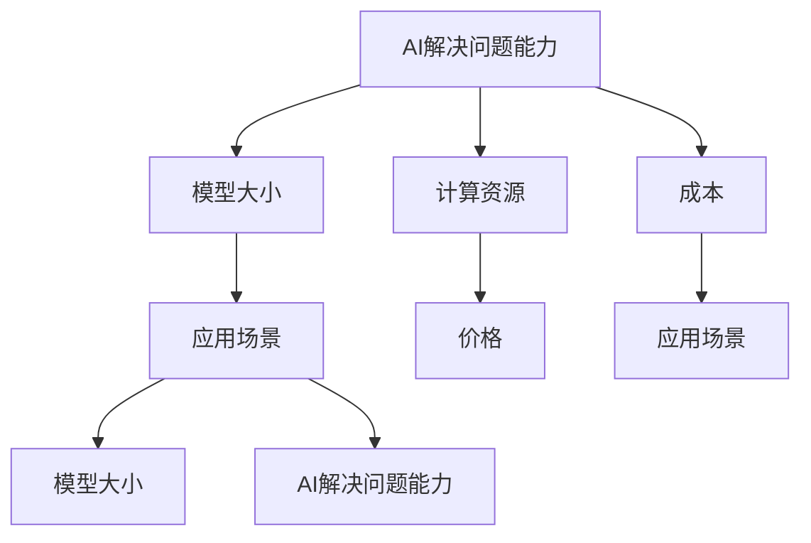

                 

## 大模型应用关键：AI解决问题能力优先，价格其次

> **关键词**：大模型应用、AI 解决问题能力、价格优先级、技术博客
>
> **摘要**：本文深入探讨大模型在AI应用中的关键因素，强调解决问题能力的重要性，同时指出价格并非唯一决定因素。通过逻辑分析和实际案例，提供对大模型应用的深刻见解。

### 1. 背景介绍

在过去的几十年里，人工智能（AI）技术经历了显著的进步。从早期的符号逻辑和知识表示，到基于统计学习和深度学习的现代方法，AI 已经成为了改变世界的重要力量。特别是在深度学习领域，大模型的兴起带来了前所未有的计算能力和表现提升。大模型，如 GPT-3、BERT、BERT-Large 等，能够处理大量的数据，生成高质量的文本、图像和音频，并且在很多任务上都超越了人类水平。

然而，大模型的应用并非一帆风顺。尽管其能力令人瞩目，但在实际应用中，如何选择合适的大模型，如何有效地部署和优化这些模型，以及如何评估其经济性，都是重要的挑战。本文旨在探讨大模型应用的关键因素，特别是AI的解决问题能力在决策中的优先级，以及价格的影响。

### 2. 核心概念与联系

在讨论大模型应用的关键因素之前，我们需要了解几个核心概念：

**1. AI 解决问题能力**：这是指大模型在特定任务上表现出的能力，包括文本生成、图像识别、语言翻译等。解决问题的关键在于模型的准确性和鲁棒性。

**2. 模型大小**：大模型通常具有更多的参数和更大的计算需求。这决定了模型的学习能力和适应性。

**3. 计算资源**：大模型的训练和部署需要大量的计算资源和存储空间。成本和可访问性是关键因素。

**4. 成本**：包括模型训练、部署和维护的成本。价格通常是一个重要的决策因素。

**5. 应用场景**：不同的应用场景对模型的能力和成本有不同的要求。例如，在实时应用中，模型的响应速度和准确性尤为重要。

为了更好地理解这些概念之间的联系，我们可以使用 Mermaid 流程图来展示它们之间的交互关系。



通过这个流程图，我们可以看出，AI 解决问题能力是一个核心因素，它直接影响应用场景和成本。同时，模型大小和计算资源也与成本密切相关。

### 3. 核心算法原理 & 具体操作步骤

大模型的核心算法通常是基于深度学习，特别是基于神经网络的方法。以下是一个简化的大模型训练和部署的基本步骤：

#### 3.1 数据预处理

**步骤 1**：数据收集。从各种来源收集大量数据，包括文本、图像、音频等。

**步骤 2**：数据清洗。去除无效数据、噪声和错误，确保数据质量。

**步骤 3**：数据转换。将数据格式化为适合模型训练的形式，例如，将文本转换为词嵌入向量，将图像转换为像素矩阵。

#### 3.2 模型训练

**步骤 1**：定义模型架构。选择适当的神经网络架构，例如，Transformer、BERT 等。

**步骤 2**：初始化模型参数。随机初始化模型的权重和偏置。

**步骤 3**：选择损失函数。根据任务类型，选择适当的损失函数，例如，交叉熵损失用于分类任务。

**步骤 4**：优化器选择。选择适当的优化器，例如，Adam、SGD 等。

**步骤 5**：训练循环。迭代地更新模型参数，最小化损失函数。

**步骤 6**：验证和调整。在验证集上评估模型性能，根据需要对模型进行调优。

#### 3.3 模型部署

**步骤 1**：模型保存。将训练好的模型保存为文件，以便后续部署。

**步骤 2**：模型加载。在部署环境（例如，服务器、边缘设备）上加载模型。

**步骤 3**：预测。使用加载的模型进行预测，生成输出。

**步骤 4**：性能评估。在实际应用中评估模型性能，并根据需要进行迭代优化。

### 4. 数学模型和公式 & 详细讲解 & 举例说明

在深度学习中，数学模型和公式起着至关重要的作用。以下是一些常用的数学模型和公式，用于大模型训练和优化：

#### 4.1 损失函数

在分类任务中，常用的损失函数是交叉熵损失（Cross-Entropy Loss），其公式如下：

$$
L(y, \hat{y}) = -\sum_{i} y_i \log(\hat{y}_i)
$$

其中，$y$ 是真实标签，$\hat{y}$ 是模型的预测概率。

#### 4.2 优化器

Adam 优化器是一种常用的优化器，其公式如下：

$$
m_t = \beta_1 m_{t-1} + (1 - \beta_1) [g_t - m_{t-1}]
$$

$$
v_t = \beta_2 v_{t-1} + (1 - \beta_2) [g_t^2 - v_{t-1}]
$$

$$
\hat{m}_t = m_t / (1 - \beta_1^t)
$$

$$
\hat{v}_t = v_t / (1 - \beta_2^t)
$$

$$
\theta_t = \theta_{t-1} - \alpha \hat{m}_t / \sqrt{\hat{v}_t} + \epsilon
$$

其中，$m_t$ 和 $v_t$ 分别是梯度的一阶和二阶矩估计，$\beta_1$ 和 $\beta_2$ 是矩估计的衰减系数，$\alpha$ 是学习率，$\theta_t$ 是模型的参数。

#### 4.3 举例说明

假设我们有一个二元分类问题，真实标签 $y$ 为 [0, 1]，模型预测概率 $\hat{y}$ 为 [0.6, 0.4]。使用交叉熵损失函数计算损失：

$$
L(y, \hat{y}) = -[0 \cdot \log(0.6) + 1 \cdot \log(0.4)] \approx 0.469
$$

这意味着模型的预测偏离真实标签，损失为 0.469。

### 5. 项目实战：代码实际案例和详细解释说明

为了更好地理解大模型的实际应用，我们将通过一个简单的项目来展示大模型的训练和部署过程。

#### 5.1 开发环境搭建

**步骤 1**：安装 Python 和相关库。确保安装了 TensorFlow 或 PyTorch，这两个库是训练和部署深度学习模型的常用工具。

```bash
pip install tensorflow
# 或
pip install torch
```

**步骤 2**：准备数据集。我们使用一个公开的文本数据集，例如 IMDb 评论数据集，用于训练文本分类模型。

**步骤 3**：配置计算资源。由于大模型训练需要大量计算资源，我们建议使用 GPU 来加速训练过程。

#### 5.2 源代码详细实现和代码解读

以下是一个基于 PyTorch 的简单文本分类模型的代码示例：

```python
import torch
import torch.nn as nn
import torch.optim as optim
from torchtext.venv import Field, TabularDataset

# 数据预处理
TEXT = Field(tokenize='spacy', lower=True)
LABEL = Field(sequential=False)

train_data, test_data = TabularDataset.splits(
    path='data',
    train='train.txt',
    test='test.txt',
    format='csv',
    fields=[('text', TEXT), ('label', LABEL)]
)

# 模型定义
class TextClassifier(nn.Module):
    def __init__(self):
        super().__init__()
        self.embedding = nn.Embedding(vocab_size, embedding_dim)
        self.fc = nn.Linear(embedding_dim, num_classes)
        
    def forward(self, text):
        embedded = self.embedding(text)
        out = self.fc(embedded)
        return out

# 模型训练
model = TextClassifier()
criterion = nn.CrossEntropyLoss()
optimizer = optim.Adam(model.parameters(), lr=0.001)

for epoch in range(num_epochs):
    for batch in train_dataloader:
        optimizer.zero_grad()
        predictions = model(batch.text).squeeze(1)
        loss = criterion(predictions, batch.label)
        loss.backward()
        optimizer.step()
        
    print(f'Epoch {epoch+1}, Loss: {loss.item()}')

# 模型评估
with torch.no_grad():
    correct = 0
    total = 0
    for batch in test_dataloader:
        predictions = model(batch.text).squeeze(1)
        _, predicted = torch.max(predictions, 1)
        total += batch.label.size(0)
        correct += (predicted == batch.label).sum().item()

print(f'Accuracy: {100 * correct / total}%')
```

在这个示例中，我们首先定义了数据预处理、模型定义、模型训练和模型评估的过程。具体步骤如下：

**步骤 1**：数据预处理。我们使用 torchtext 库来加载和处理数据。文本字段使用 spaCy 进行分词和下

