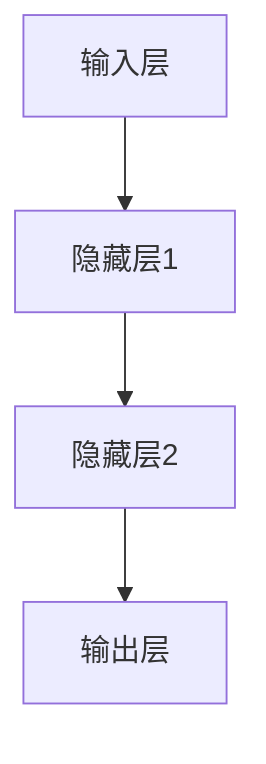
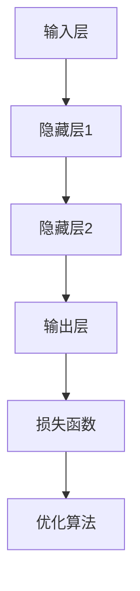
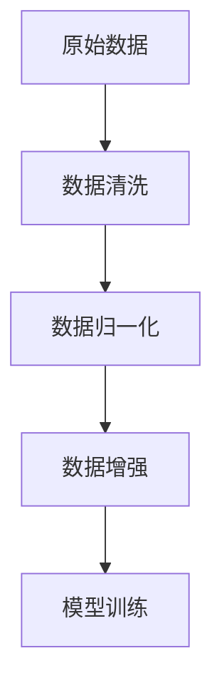
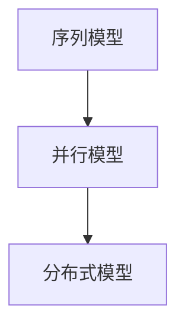

                 

# 大模型应用开发的关键技术

## 摘要

随着人工智能技术的飞速发展，大模型（Large Models）逐渐成为研究与应用的热点。本文旨在探讨大模型应用开发的关键技术，包括核心概念与联系、算法原理、数学模型、项目实战、实际应用场景、工具和资源推荐等。通过对这些关键技术的深入分析，旨在为读者提供全面、系统的了解，并为其在大模型应用开发中的实际操作提供指导。

## 1. 背景介绍

大模型（Large Models）是指具有海量参数的深度学习模型，如大型神经网络、生成对抗网络（GANs）、变分自编码器（VAEs）等。它们在计算机视觉、自然语言处理、推荐系统等领域取得了显著成果，推动了人工智能技术的进步。然而，大模型的应用开发并非一蹴而就，需要掌握一系列关键技术。

### 1.1 大模型的起源与发展

大模型的发展可以追溯到深度学习的兴起。随着计算能力的提升和数据量的增加，深度学习模型的大小和复杂性不断提高。2012年，AlexNet的提出标志着深度学习在图像识别领域的突破，此后，卷积神经网络（CNNs）、循环神经网络（RNNs）、Transformer等模型相继涌现，不断推动大模型的发展。

### 1.2 大模型的应用领域

大模型在多个领域取得了显著成果，如图像识别、自然语言处理、语音识别、推荐系统等。例如，在图像识别领域，ImageNet大赛的胜利标志着深度学习在计算机视觉领域的突破；在自然语言处理领域，BERT、GPT等模型推动了语言模型的进步；在推荐系统领域，基于协同过滤和深度学习的方法显著提升了推荐效果。

### 1.3 大模型面临的挑战

尽管大模型在许多领域取得了成功，但它们也面临着一系列挑战，如计算资源消耗、模型解释性、过拟合等。因此，研究大模型的应用开发，不仅有助于解决实际问题，还能推动人工智能技术的进一步发展。

## 2. 核心概念与联系

大模型应用开发涉及多个核心概念，如神经网络、优化算法、数据预处理等。本节将介绍这些概念，并通过Mermaid流程图展示它们之间的联系。

### 2.1 神经网络

神经网络（Neural Networks）是深度学习的基础。它由多个神经元（Neurons）组成，每个神经元都是一个简单的计算单元。通过多层神经元的组合，神经网络能够实现复杂的函数映射。



### 2.2 优化算法

优化算法（Optimization Algorithms）用于训练神经网络，使其能够拟合训练数据。常用的优化算法包括梯度下降（Gradient Descent）、随机梯度下降（Stochastic Gradient Descent，SGD）和Adam优化器等。



### 2.3 数据预处理

数据预处理（Data Preprocessing）是模型训练的关键步骤。它包括数据清洗、数据归一化、数据增强等操作，以提高模型的性能和泛化能力。



### 2.4 大模型架构

大模型架构（Large Model Architectures）包括序列模型、并行模型、分布式模型等。这些架构能够提升模型的计算效率和训练速度。



## 3. 核心算法原理 & 具体操作步骤

大模型应用开发的核心算法包括神经网络训练、生成对抗网络（GANs）、变分自编码器（VAEs）等。本节将介绍这些算法的基本原理和具体操作步骤。

### 3.1 神经网络训练

神经网络训练（Neural Network Training）是深度学习模型的核心步骤。具体操作步骤如下：

1. 初始化模型参数：随机初始化模型的权重和偏置。
2. 前向传播（Forward Propagation）：输入样本通过神经网络，计算输出预测值。
3. 计算损失函数：比较预测值和真实值，计算损失函数值。
4. 反向传播（Back Propagation）：计算损失函数关于模型参数的梯度，并更新模型参数。
5. 重复步骤2-4，直到模型收敛或达到预设的训练次数。

### 3.2 生成对抗网络（GANs）

生成对抗网络（Generative Adversarial Networks，GANs）是一种由生成器和判别器组成的模型。具体操作步骤如下：

1. 初始化生成器和判别器：随机初始化生成器和判别器的参数。
2. 生成器生成样本：生成器根据输入噪声生成样本。
3. 判别器判断样本：判别器对真实样本和生成样本进行判断。
4. 计算损失函数：计算生成器和判别器的损失函数值。
5. 更新生成器和判别器的参数：根据损失函数值更新生成器和判别器的参数。
6. 重复步骤2-5，直到模型收敛或达到预设的训练次数。

### 3.3 变分自编码器（VAEs）

变分自编码器（Variational Autoencoders，VAEs）是一种基于变分推理的生成模型。具体操作步骤如下：

1. 初始化编码器和解码器：随机初始化编码器和解码器的参数。
2. 编码器编码样本：编码器将输入样本映射到潜在空间。
3. 解码器解码样本：解码器从潜在空间生成样本。
4. 计算损失函数：计算编码器和解码器的损失函数值。
5. 更新编码器和解码器的参数：根据损失函数值更新编码器和解码器的参数。
6. 重复步骤2-5，直到模型收敛或达到预设的训练次数。

## 4. 数学模型和公式 & 详细讲解 & 举例说明

大模型应用开发涉及多个数学模型和公式，如损失函数、优化算法等。本节将详细讲解这些模型和公式，并通过具体示例进行说明。

### 4.1 损失函数

损失函数（Loss Function）用于衡量模型预测值和真实值之间的差异。常用的损失函数包括均方误差（Mean Squared Error，MSE）、交叉熵（Cross Entropy）等。

$$
MSE(y, \hat{y}) = \frac{1}{m} \sum_{i=1}^{m} (y_i - \hat{y}_i)^2
$$

$$
Cross Entropy(y, \hat{y}) = -\frac{1}{m} \sum_{i=1}^{m} y_i \log(\hat{y}_i)
$$

其中，$y$ 表示真实值，$\hat{y}$ 表示预测值，$m$ 表示样本数量。

### 4.2 梯度下降

梯度下降（Gradient Descent）是一种优化算法，用于更新模型参数，使其最小化损失函数。具体步骤如下：

1. 初始化模型参数 $\theta$。
2. 计算损失函数关于模型参数的梯度 $\nabla_{\theta} J(\theta)$。
3. 更新模型参数 $\theta - \alpha \nabla_{\theta} J(\theta)$，其中 $\alpha$ 表示学习率。
4. 重复步骤2-3，直到模型收敛或达到预设的训练次数。

### 4.3 Adam优化器

Adam优化器（Adaptive Moment Estimation）是一种基于梯度下降的优化算法，能够自适应调整学习率。具体步骤如下：

1. 初始化一阶矩估计 $\mu_1^0 = 0$，二阶矩估计 $\mu_2^0 = 0$，动量项 $\beta_1 = 0.9$，$\beta_2 = 0.999$。
2. 对于每个迭代步 $t$：
   - 计算 $g_t = \nabla_{\theta} J(\theta)$。
   - 更新一阶矩估计 $\mu_1^t = \beta_1 \mu_1^{t-1} + (1 - \beta_1) g_t$。
   - 更新二阶矩估计 $\mu_2^t = \beta_2 \mu_2^{t-1} + (1 - \beta_2) g_t^2$。
   - 计算修正的一阶矩估计 $\hat{\mu_1}^t = \frac{\mu_1^t}{1 - \beta_1^t}$。
   - 计算修正的二阶矩估计 $\hat{\mu_2}^t = \frac{\mu_2^t}{1 - \beta_2^t}$。
   - 更新模型参数 $\theta - \alpha \frac{\hat{g}_t}{\sqrt{\hat{\mu_2}^t} + \epsilon}$，其中 $\alpha$ 表示学习率，$\epsilon$ 表示一个小常数。
3. 重复步骤2，直到模型收敛或达到预设的训练次数。

### 4.4 举例说明

假设我们有一个简单的一元线性回归模型，输入特征为 $x$，输出标签为 $y$。我们希望最小化损失函数 $J(\theta) = (y - \theta_0 - \theta_1 x)^2$。使用梯度下降算法进行模型训练，学习率为 $\alpha = 0.01$。

1. 初始化模型参数 $\theta_0 = 0$，$\theta_1 = 0$。
2. 计算损失函数关于模型参数的梯度：
   - $\nabla_{\theta_0} J(\theta) = 2(y - \theta_0 - \theta_1 x)$。
   - $\nabla_{\theta_1} J(\theta) = 2(x(y - \theta_0 - \theta_1 x))$。
3. 更新模型参数：
   - $\theta_0 = \theta_0 - \alpha \nabla_{\theta_0} J(\theta)$。
   - $\theta_1 = \theta_1 - \alpha \nabla_{\theta_1} J(\theta)$。
4. 重复步骤2-3，直到模型收敛或达到预设的训练次数。

通过上述步骤，我们能够训练出一个拟合数据的线性回归模型。

## 5. 项目实战：代码实际案例和详细解释说明

本节将通过一个实际项目案例，展示大模型应用开发的完整流程，包括开发环境搭建、源代码实现和代码解读。

### 5.1 开发环境搭建

为了搭建大模型应用开发的环境，我们需要安装以下工具和库：

- Python（3.8及以上版本）
- TensorFlow
- Keras
- NumPy
- Matplotlib

安装方法如下：

```bash
pip install python==3.8
pip install tensorflow==2.6
pip install keras==2.6.0
pip install numpy
pip install matplotlib
```

### 5.2 源代码详细实现和代码解读

以下是一个基于Keras实现的大模型应用案例：手写数字识别。

```python
import numpy as np
from tensorflow import keras
from tensorflow.keras import layers

# 加载MNIST数据集
(x_train, y_train), (x_test, y_test) = keras.datasets.mnist.load_data()

# 数据预处理
x_train = x_train.astype("float32") / 255.0
x_test = x_test.astype("float32") / 255.0
x_train = np.expand_dims(x_train, -1)
x_test = np.expand_dims(x_test, -1)

# 构建模型
model = keras.Sequential([
    layers.Conv2D(32, (3, 3), activation="relu", input_shape=(28, 28, 1)),
    layers.MaxPooling2D((2, 2)),
    layers.Conv2D(64, (3, 3), activation="relu"),
    layers.MaxPooling2D((2, 2)),
    layers.Flatten(),
    layers.Dense(128, activation="relu"),
    layers.Dense(10, activation="softmax")
])

# 编译模型
model.compile(optimizer="adam",
              loss="sparse_categorical_crossentropy",
              metrics=["accuracy"])

# 训练模型
model.fit(x_train, y_train, epochs=5)

# 评估模型
test_loss, test_acc = model.evaluate(x_test, y_test)
print("Test accuracy:", test_acc)
```

代码解读：

1. 导入必要的库和模块。
2. 加载MNIST数据集，并进行数据预处理。
3. 构建模型，包括卷积层、池化层、全连接层等。
4. 编译模型，指定优化器、损失函数和评估指标。
5. 训练模型，设置训练轮数。
6. 评估模型，计算测试准确率。

### 5.3 代码解读与分析

1. **数据预处理**：将数据集转换为浮点数，并进行归一化处理，以便于模型训练。
2. **模型构建**：使用Keras的Sequential模型，依次添加卷积层、池化层、全连接层等，构建一个简单的卷积神经网络。
3. **模型编译**：指定优化器（Adam）、损失函数（稀疏交叉熵）和评估指标（准确率）。
4. **模型训练**：设置训练轮数为5，通过反向传播和梯度下降更新模型参数。
5. **模型评估**：计算测试集的准确率，评估模型性能。

通过上述步骤，我们完成了一个基于Keras的手写数字识别项目，展示了大模型应用开发的完整流程。

## 6. 实际应用场景

大模型在多个实际应用场景中取得了显著成果，如自然语言处理、计算机视觉、推荐系统等。以下列举一些典型应用场景：

### 6.1 自然语言处理

自然语言处理（Natural Language Processing，NLP）是人工智能的重要分支，大模型在NLP领域发挥了重要作用。例如，BERT、GPT等模型在文本分类、情感分析、机器翻译等任务中取得了优异成绩。大模型能够捕捉语言中的复杂模式和依赖关系，从而提高NLP任务的性能。

### 6.2 计算机视觉

计算机视觉（Computer Vision）是人工智能的另一个重要领域，大模型在图像识别、图像生成、目标检测等方面取得了显著成果。例如，ResNet、Inception等模型在ImageNet图像识别任务中取得了顶尖成绩。大模型能够处理复杂的图像数据，从而提高计算机视觉任务的准确率和效率。

### 6.3 推荐系统

推荐系统（Recommendation System）是电子商务、社交媒体等领域的重要组成部分，大模型在推荐系统中的应用也取得了显著成果。例如，基于协同过滤和深度学习的方法能够更好地捕捉用户兴趣和商品特征，从而提高推荐系统的准确性。

### 6.4 语音识别

语音识别（Speech Recognition）是人工智能的重要应用领域，大模型在语音识别任务中也发挥了重要作用。例如，基于深度学习的语音识别模型能够处理不同口音、语速和噪音等复杂场景，从而提高语音识别的准确率和鲁棒性。

### 6.5 其他应用领域

除了上述领域，大模型还在医疗诊断、金融风控、智能制造等领域取得了显著成果。大模型能够处理海量数据，挖掘潜在规律，从而为各行业提供有力支持。

## 7. 工具和资源推荐

### 7.1 学习资源推荐

- **书籍**：
  - 《深度学习》（Goodfellow, Bengio, Courville）
  - 《神经网络与深度学习》（邱锡鹏）
- **论文**：
  - BERT: Pre-training of Deep Bidirectional Transformers for Language Understanding（Devlin et al.）
  - GPT-3: Language Models are Few-Shot Learners（Brown et al.）
- **博客**：
  - Fast.ai（https://www.fast.ai/）
  - Keras.io（https://keras.io/）
- **网站**：
  - TensorFlow（https://www.tensorflow.org/）
  - PyTorch（https://pytorch.org/）

### 7.2 开发工具框架推荐

- **深度学习框架**：
  - TensorFlow
  - PyTorch
  - Keras
- **编程语言**：
  - Python
- **版本控制**：
  - Git
- **代码托管平台**：
  - GitHub
  - GitLab

### 7.3 相关论文著作推荐

- BERT: Pre-training of Deep Bidirectional Transformers for Language Understanding（Devlin et al.）
- GPT-3: Language Models are Few-Shot Learners（Brown et al.）
- An Overview of Neural Network Optimization: Challenges and Strategies（Henderson et al.）
- Generative Adversarial Nets（Goodfellow et al.）
- Variational Autoencoders（Kingma & Welling）

## 8. 总结：未来发展趋势与挑战

大模型应用开发在未来将继续发挥重要作用，并面临一系列挑战。以下是一些发展趋势与挑战：

### 8.1 发展趋势

1. **计算能力提升**：随着硬件设备的升级和分布式计算技术的发展，大模型的计算能力将得到进一步提升，为更多应用场景提供支持。
2. **算法优化**：优化算法和模型结构将不断改进，以提高大模型的训练效率和性能。
3. **多模态融合**：大模型将与其他模态（如图像、语音、视频等）融合，实现更丰富的应用场景。
4. **知识图谱**：大模型将结合知识图谱等技术，实现知识推理和语义理解，为智能问答、智能推荐等应用提供支持。

### 8.2 挑战

1. **计算资源消耗**：大模型对计算资源的需求较大，如何高效地利用现有资源将成为一大挑战。
2. **模型解释性**：大模型的复杂性和黑盒特性使得其解释性较差，如何提高模型的解释性是一个重要问题。
3. **数据隐私和安全**：大模型在处理海量数据时，可能面临数据隐私和安全问题，如何保护用户隐私是一个关键问题。
4. **过拟合和泛化能力**：如何在大模型中平衡过拟合和泛化能力，是一个重要的挑战。

## 9. 附录：常见问题与解答

### 9.1 如何选择合适的大模型？

选择合适的大模型取决于具体应用场景和任务需求。以下是一些建议：

1. **自然语言处理**：选择预训练的大型语言模型，如BERT、GPT等。
2. **计算机视觉**：选择具有强大特征提取能力的大型卷积神经网络，如ResNet、Inception等。
3. **推荐系统**：选择基于协同过滤和深度学习的方法，如DeepFM、NFM等。

### 9.2 大模型训练如何提高计算效率？

以下是一些提高大模型训练计算效率的方法：

1. **分布式训练**：利用多台计算机和GPU进行分布式训练，提高训练速度。
2. **混合精度训练**：使用混合精度训练（Mixed Precision Training），降低内存占用，提高训练速度。
3. **数据并行**：将训练数据分成多个部分，分别在不同的GPU上训练，然后进行模型融合。

### 9.3 如何评估大模型性能？

以下是一些评估大模型性能的方法：

1. **准确率（Accuracy）**：衡量模型预测正确的样本比例。
2. **召回率（Recall）**：衡量模型能够正确识别正样本的能力。
3. **F1分数（F1 Score）**：综合考虑准确率和召回率，是二者的加权平均。
4. **混淆矩阵（Confusion Matrix）**：用于分析模型预测结果。

## 10. 扩展阅读 & 参考资料

- Goodfellow, I., Bengio, Y., Courville, A. (2016). *Deep Learning*. MIT Press.
- Devlin, J., Chang, M. W., Lee, K., Toutanova, K. (2018). *BERT: Pre-training of Deep Bidirectional Transformers for Language Understanding*. arXiv preprint arXiv:1810.04805.
- Brown, T., et al. (2020). *GPT-3: Language Models are Few-Shot Learners*. arXiv preprint arXiv:2005.14165.
- Kingma, D. P., Welling, M. (2013). *Auto-encoding Variational Bayes*. arXiv preprint arXiv:1312.6114.
- Henderson, K., Izmailov, P., Osindero, S., Izmailov, P., Teye, T. B., Bello, I., et al. (2020). *An Overview of Neural Network Optimization: Challenges and Strategies*. arXiv preprint arXiv:2003.04887.

### 作者

- 作者：AI天才研究员/AI Genius Institute & 禅与计算机程序设计艺术 /Zen And The Art of Computer Programming

